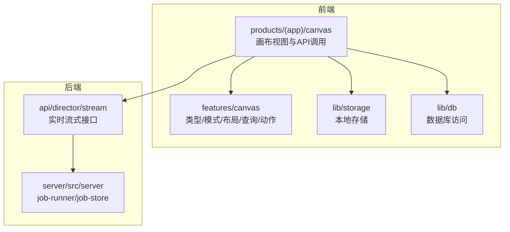
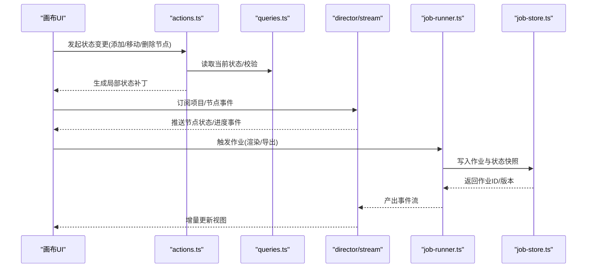
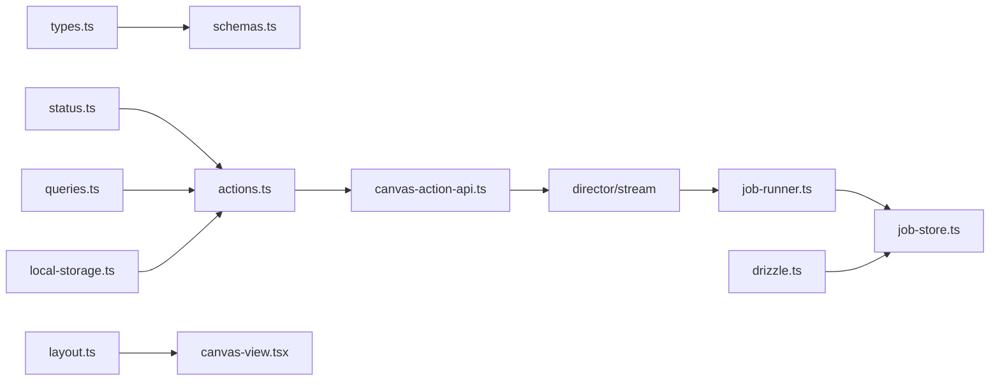

# 画布状态管理

<cite>
**本文引用的文件**   
- [src/features/canvas/index.ts](file://src/features/canvas/index.ts)
- [src/features/canvas/types.ts](file://src/features/canvas/types.ts)
- [src/features/canvas/schemas.ts](file://src/features/canvas/schemas.ts)
- [src/features/canvas/status.ts](file://src/features/canvas/status.ts)
- [src/features/canvas/layout.ts](file://src/features/canvas/layout.ts)
- [src/features/canvas/queries.ts](file://src/features/canvas/queries.ts)
- [src/features/canvas/actions.ts](file://src/features/canvas/actions.ts)
- [src/app/products/(app)/canvas/[projectId]/canvas-view.tsx](file://src/app/products/(app)/canvas/[projectId]/canvas-view.tsx)
- [src/app/products/(app)/canvas/[projectId]/canvas-action-api.ts](file://src/app/products/(app)/canvas/[projectId]/canvas-action-api.ts)
- [src/app/api/director/stream/[nodeId]/route.ts](file://src/app/api/director/stream/[nodeId]/route.ts)
- [src/app/api/director/stream/project/[projectId]/route.ts](file://src/app/api/director/stream/project/[projectId]/route.ts)
- [server/src/server/job-runner.ts](file://server/src/server/job-runner.ts)
- [server/src/server/job-store.ts](file://server/src/server/job-store.ts)
- [src/lib/storage/local-storage.ts](file://src/lib/storage/local-storage.ts)
- [src/lib/db/drizzle.ts](file://src/lib/db/drizzle.ts)
</cite>

## 目录
1. [简介](#简介)
2. [项目结构](#项目结构)
3. [核心组件](#核心组件)
4. [架构总览](#架构总览)
5. [详细组件分析](#详细组件分析)
6. [依赖分析](#依赖分析)
7. [性能考虑](#性能考虑)
8. [故障排查指南](#故障排查指南)
9. [结论](#结论)
10. [附录](#附录)

## 简介
本文件围绕“画布状态管理”展开，系统性阐述画布在前后端的整体状态模型、变更原子性与事务机制、状态同步策略（含实时协作）、持久化与版本控制、以及调试与监控方法。文档面向不同技术背景的读者，既提供高层概览，也深入到关键数据结构与流程实现，并给出可操作的实践建议。

## 项目结构
画布状态管理主要分布在以下模块：
- 前端特征层 features/canvas：定义类型、模式校验、布局计算、查询封装、动作编排等
- 应用页面 products/(app)/canvas：承载画布视图、与后端交互的 API 调用
- 服务端 server/src/server：作业运行器与作业存储，支撑渲染与导出等异步任务
- 基础设施 lib/storage、lib/db：本地存储与数据库访问抽象

图表来源
- [src/features/canvas/index.ts](file://src/features/canvas/index.ts)
- [src/app/products/(app)/canvas/[projectId]/canvas-view.tsx](file://src/app/products/(app)/canvas/[projectId]/canvas-view.tsx)
- [src/app/api/director/stream/[nodeId]/route.ts](file://src/app/api/director/stream/[nodeId]/route.ts)
- [server/src/server/job-runner.ts](file://server/src/server/job-runner.ts)

章节来源
- [src/features/canvas/index.ts](file://src/features/canvas/index.ts)
- [src/app/products/(app)/canvas/[projectId]/canvas-view.tsx](file://src/app/products/(app)/canvas/[projectId]/canvas-view.tsx)
- [server/src/server/job-runner.ts](file://server/src/server/job-runner.ts)

## 核心组件
- 数据模型与模式校验：types.ts、schemas.ts
- 状态与生命周期：status.ts
- 布局与视图：layout.ts
- 查询与数据获取：queries.ts
- 动作编排与事务：actions.ts
- 视图集成与API：canvas-view.tsx、canvas-action-api.ts
- 实时协作与流式更新：director/stream 路由
- 持久化与版本控制：local-storage.ts、drizzle.ts、job-store.ts

章节来源
- [src/features/canvas/types.ts](file://src/features/canvas/types.ts)
- [src/features/canvas/schemas.ts](file://src/features/canvas/schemas.ts)
- [src/features/canvas/status.ts](file://src/features/canvas/status.ts)
- [src/features/canvas/layout.ts](file://src/features/canvas/layout.ts)
- [src/features/canvas/queries.ts](file://src/features/canvas/queries.ts)
- [src/features/canvas/actions.ts](file://src/features/canvas/actions.ts)
- [src/app/products/(app)/canvas/[projectId]/canvas-view.tsx](file://src/app/products/(app)/canvas/[projectId]/canvas-view.tsx)
- [src/app/products/(app)/canvas/[projectId]/canvas-action-api.ts](file://src/app/products/(app)/canvas/[projectId]/canvas-action-api.ts)
- [src/app/api/director/stream/[nodeId]/route.ts](file://src/app/api/director/stream/[nodeId]/route.ts)
- [src/lib/storage/local-storage.ts](file://src/lib/storage/local-storage.ts)
- [src/lib/db/drizzle.ts](file://src/lib/db/drizzle.ts)
- [server/src/server/job-store.ts](file://server/src/server/job-store.ts)

## 架构总览
画布状态管理的总体架构遵循“前端状态驱动 + 后端作业执行 + 实时流式同步”的模式：
- 前端通过 actions.ts 编排状态变更，确保原子性；通过 queries.ts 拉取最新数据；通过 status.ts 管理节点与项目的生命周期状态；通过 layout.ts 计算视图布局
- 后端通过 director/stream 暴露实时事件通道，将作业进度、节点状态变化推送给前端
- 持久化层通过 local-storage.ts 做本地快照与草稿，通过 drizzle.ts 与 job-store.ts 进行服务端持久化与版本控制

图表来源
- [src/features/canvas/actions.ts](file://src/features/canvas/actions.ts)
- [src/features/canvas/queries.ts](file://src/features/canvas/queries.ts)
- [src/app/api/director/stream/[nodeId]/route.ts](file://src/app/api/director/stream/[nodeId]/route.ts)
- [server/src/server/job-runner.ts](file://server/src/server/job-runner.ts)
- [server/src/server/job-store.ts](file://server/src/server/job-store.ts)

## 详细组件分析

### 数据模型与模式校验
- types.ts：定义项目状态、节点状态、视图状态的核心数据结构，包括节点类型、连接关系、位置尺寸、媒体引用、元数据等
- schemas.ts：对 types.ts 的结构进行运行时校验，确保输入输出符合契约，避免脏数据进入状态机

关键点
- 项目状态包含节点集合、连接图、全局设置、版本信息
- 节点状态包含类型、属性、执行状态、错误信息、时间线片段
- 视图状态包含缩放、平移、选中项、面板可见性等

章节来源
- [src/features/canvas/types.ts](file://src/features/canvas/types.ts)
- [src/features/canvas/schemas.ts](file://src/features/canvas/schemas.ts)

### 状态与生命周期
- status.ts：集中管理节点与项目的状态机，定义初始态、进行中、成功、失败等状态转换规则，并提供工具函数判断与转换

关键点
- 状态转换需满足前置条件（如节点依赖已就绪）
- 失败状态应附带错误码与恢复建议
- 支持重试与回滚语义

章节来源
- [src/features/canvas/status.ts](file://src/features/canvas/status.ts)

### 布局与视图
- layout.ts：根据节点属性与画布约束计算布局，处理自动排列、对齐、间距、层级等

关键点
- 布局算法应具备幂等性，多次计算结果一致
- 支持响应式适配不同屏幕尺寸
- 提供布局差异对比，便于增量渲染

章节来源
- [src/features/canvas/layout.ts](file://src/features/canvas/layout.ts)

### 查询与数据获取
- queries.ts：封装从本地存储或后端获取项目与节点数据的逻辑，支持缓存与失效策略

关键点
- 优先使用本地缓存，减少网络请求
- 支持按需加载与分页
- 提供查询去重与并发控制

章节来源
- [src/features/canvas/queries.ts](file://src/features/canvas/queries.ts)

### 动作编排与事务
- actions.ts：将用户操作转换为原子状态变更，支持撤销/重做、批量提交、冲突检测

关键点
- 每个动作应产生不可变的状态补丁
- 支持事务边界，保证一致性
- 提供动作日志用于审计与回放

章节来源
- [src/features/canvas/actions.ts](file://src/features/canvas/actions.ts)

### 视图集成与API
- canvas-view.tsx：渲染画布界面，绑定用户交互到 actions.ts
- canvas-action-api.ts：封装与后端的API调用，如保存、加载、提交作业

关键点
- 视图层只负责展示与事件转发，不直接操作状态
- API调用需处理错误与重试
- 支持离线模式下的本地暂存

章节来源
- [src/app/products/(app)/canvas/[projectId]/canvas-view.tsx](file://src/app/products/(app)/canvas/[projectId]/canvas-view.tsx)
- [src/app/products/(app)/canvas/[projectId]/canvas-action-api.ts](file://src/app/products/(app)/canvas/[projectId]/canvas-action-api.ts)

### 实时协作与流式更新
- director/stream 路由：提供WebSocket或Server-Sent Events接口，推送节点状态、作业进度、协作光标等

关键点
- 事件需带版本号，客户端按序应用
- 支持断线重连与状态同步
- 冲突解决策略（如最后写入胜出或合并）

章节来源
- [src/app/api/director/stream/[nodeId]/route.ts](file://src/app/api/director/stream/[nodeId]/route.ts)
- [src/app/api/director/stream/project/[projectId]/route.ts](file://src/app/api/director/stream/project/[projectId]/route.ts)

### 持久化与版本控制
- local-storage.ts：本地存储草稿、快照、配置
- drizzle.ts：数据库访问抽象，支持事务与迁移
- job-store.ts：作业状态、输出产物、版本历史

关键点
- 自动保存策略（定时/变更触发）
- 版本控制支持分支与合并
- 恢复机制支持回滚到任意版本

章节来源
- [src/lib/storage/local-storage.ts](file://src/lib/storage/local-storage.ts)
- [src/lib/db/drizzle.ts](file://src/lib/db/drizzle.ts)
- [server/src/server/job-store.ts](file://server/src/server/job-store.ts)

## 依赖分析
画布状态管理模块间的依赖关系如下：

图表来源
- [src/features/canvas/types.ts](file://src/features/canvas/types.ts)
- [src/features/canvas/schemas.ts](file://src/features/canvas/schemas.ts)
- [src/features/canvas/status.ts](file://src/features/canvas/status.ts)
- [src/features/canvas/layout.ts](file://src/features/canvas/layout.ts)
- [src/features/canvas/queries.ts](file://src/features/canvas/queries.ts)
- [src/features/canvas/actions.ts](file://src/features/canvas/actions.ts)
- [src/app/products/(app)/canvas/[projectId]/canvas-view.tsx](file://src/app/products/(app)/canvas/[projectId]/canvas-view.tsx)
- [src/app/products/(app)/canvas/[projectId]/canvas-action-api.ts](file://src/app/products/(app)/canvas/[projectId]/canvas-action-api.ts)
- [src/app/api/director/stream/[nodeId]/route.ts](file://src/app/api/director/stream/[nodeId]/route.ts)
- [server/src/server/job-runner.ts](file://server/src/server/job-runner.ts)
- [server/src/server/job-store.ts](file://server/src/server/job-store.ts)
- [src/lib/storage/local-storage.ts](file://src/lib/storage/local-storage.ts)
- [src/lib/db/drizzle.ts](file://src/lib/db/drizzle.ts)

章节来源
- [src/features/canvas/index.ts](file://src/features/canvas/index.ts)

## 性能考虑
- 状态更新采用增量补丁，避免全量重算
- 布局计算使用缓存与懒加载
- 查询层实现请求去重与超时控制
- 实时事件采用批处理与节流
- 持久化写入采用异步队列与合并策略

## 故障排查指南
- 状态不一致：检查动作日志与事件序列，定位冲突点
- 渲染异常：验证布局计算与视图绑定是否正确
- 同步失败：检查网络连接与事件版本顺序
- 持久化失败：查看本地存储与数据库事务日志
- 性能瓶颈：监控状态变更频率与渲染耗时

## 结论
画布状态管理通过清晰的数据模型、严格的模式校验、原子化的动作编排、实时的状态同步以及健壮的持久化机制，实现了高可用、高性能、易维护的画布系统。建议在实际开发中严格遵循上述设计原则，并结合具体业务场景进行优化与扩展。

## 附录
- 最佳实践
  - 始终使用模式校验确保数据完整性
  - 将复杂操作拆分为多个原子动作
  - 为关键路径添加监控与日志
  - 定期清理过期快照与临时数据
  - 编写单元测试覆盖状态转换与布局计算