# 画布编辑器

<cite>
**本文引用的文件**   
- [src/app/products/(app)/canvas/[projectId]/canvas-view.tsx](file://src/app/products/(app)/canvas/[projectId]/canvas-view.tsx)
- [src/app/products/(app)/canvas/[projectId]/flow-elements.tsx](file://src/app/products/(app)/canvas/[projectId]/flow-elements.tsx)
- [src/features/canvas/types.ts](file://src/features/canvas/types.ts)
- [src/features/canvas/layout.ts](file://src/features/canvas/layout.ts)
- [src/features/canvas/actions.ts](file://src/features/canvas/actions.ts)
- [src/features/canvas/contracts.ts](file://src/features/canvas/contracts.ts)
- [src/features/canvas/status.ts](file://src/features/canvas/status.ts)
- [src/features/canvas/fan-out.ts](file://src/features/canvas/fan-out.ts)
- [src/features/canvas/workflow-error.ts](file://src/features/canvas/workflow-error.ts)
- [src/components/ui/node/stage-node.tsx](file://src/components/ui/node/stage-node.tsx)
- [src/components/ui/node/shot-node.tsx](file://src/components/ui/node/shot-node.tsx)
- [src/components/ui/node/audio-node.tsx](file://src/components/ui/node/audio-node.tsx)
- [src/components/ui/node/export-node.tsx](file://src/components/ui/node/export-node.tsx)
- [src/components/ui/node/types.ts](file://src/components/ui/node/types.ts)
- [src/app/api/director/pipeline/route.ts](file://src/app/api/director/pipeline/route.ts)
- [src/app/api/director/stage/route.ts](file://src/app/api/director/stage/route.ts)
- [src/app/api/director/stream/[nodeId]/route.ts](file://src/app/api/director/stream/[nodeId]/route.ts)
- [src/app/api/projects/[id]/route.ts](file://src/app/api/projects/[id]/route.ts)
- [src/app/api/render/route.ts](file://src/app/api/render/route.ts)
- [src/features/director/pipeline.ts](file://src/features/director/pipeline.ts)
- [src/features/director/stage-runner.ts](file://src/features/director/stage-runner.ts)
- [src/features/director/runtime-repository.ts](file://src/features/director/runtime-repository.ts)
- [src/features/artifacts/service.ts](file://src/features/artifacts/service.ts)
- [src/lib/queue/index.ts](file://src/lib/queue/index.ts)
</cite>

## 目录
1. [简介](#简介)
2. [项目结构](#项目结构)
3. [核心组件](#核心组件)
4. [架构总览](#架构总览)
5. [详细组件分析](#详细组件分析)
6. [依赖关系分析](#依赖关系分析)
7. [性能考量](#性能考量)
8. [故障排查指南](#故障排查指南)
9. [结论](#结论)
10. [附录](#附录)

## 简介
本文件为 PurpleInk 画布编辑器的全面技术文档，聚焦可视化编辑器的架构设计与实现细节。内容涵盖：
- 画布状态管理、拖拽交互与实时预览
- 节点系统（节点类型、属性管理、连接关系）
- 布局算法（自动排列、对齐辅助、缩放适配）
- AI 集成（脚本生成、素材推荐、智能布局）
- 协作编辑支持（实时同步、冲突解决、版本管理）
- 自定义节点开发与扩展指南

该文档面向开发者与产品工程师，既提供高层架构概览，也深入到关键模块的实现要点与优化建议。

## 项目结构
PurpleInk 采用前后端分离的 Next.js 应用结构，前端以 React/Next.js 构建，后端通过 API Routes 暴露服务，核心业务逻辑分布在 features 目录中，UI 组件集中在 components/ui 下，画布相关能力位于 features/canvas 与 app/products/(app)/canvas 路径。

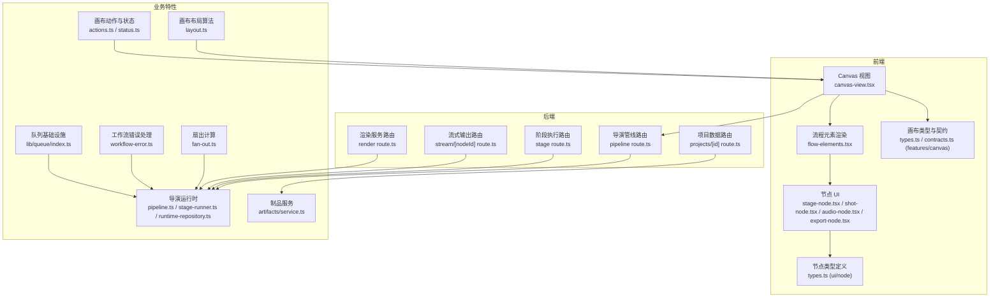

图表来源
- [src/app/products/(app)/canvas/[projectId]/canvas-view.tsx](file://src/app/products/(app)/canvas/[projectId]/canvas-view.tsx)
- [src/app/products/(app)/canvas/[projectId]/flow-elements.tsx](file://src/app/products/(app)/canvas/[projectId]/flow-elements.tsx)
- [src/components/ui/node/stage-node.tsx](file://src/components/ui/node/stage-node.tsx)
- [src/components/ui/node/shot-node.tsx](file://src/components/ui/node/shot-node.tsx)
- [src/components/ui/node/audio-node.tsx](file://src/components/ui/node/audio-node.tsx)
- [src/components/ui/node/export-node.tsx](file://src/components/ui/node/export-node.tsx)
- [src/components/ui/node/types.ts](file://src/components/ui/node/types.ts)
- [src/features/canvas/types.ts](file://src/features/canvas/types.ts)
- [src/features/canvas/contracts.ts](file://src/features/canvas/contracts.ts)
- [src/features/canvas/layout.ts](file://src/features/canvas/layout.ts)
- [src/features/canvas/actions.ts](file://src/features/canvas/actions.ts)
- [src/features/canvas/status.ts](file://src/features/canvas/status.ts)
- [src/features/canvas/fan-out.ts](file://src/features/canvas/fan-out.ts)
- [src/features/canvas/workflow-error.ts](file://src/features/canvas/workflow-error.ts)
- [src/app/api/director/pipeline/route.ts](file://src/app/api/director/pipeline/route.ts)
- [src/app/api/director/stage/route.ts](file://src/app/api/director/stage/route.ts)
- [src/app/api/director/stream/[nodeId]/route.ts](file://src/app/api/director/stream/[nodeId]/route.ts)
- [src/app/api/projects/[id]/route.ts](file://src/app/api/projects/[id]/route.ts)
- [src/app/api/render/route.ts](file://src/app/api/render/route.ts)
- [src/features/director/pipeline.ts](file://src/features/director/pipeline.ts)
- [src/features/director/stage-runner.ts](file://src/features/director/stage-runner.ts)
- [src/features/director/runtime-repository.ts](file://src/features/director/runtime-repository.ts)
- [src/features/artifacts/service.ts](file://src/features/artifacts/service.ts)
- [src/lib/queue/index.ts](file://src/lib/queue/index.ts)

章节来源
- [src/app/products/(app)/canvas/[projectId]/canvas-view.tsx](file://src/app/products/(app)/canvas/[projectId]/canvas-view.tsx)
- [src/app/products/(app)/canvas/[projectId]/flow-elements.tsx](file://src/app/products/(app)/canvas/[projectId]/flow-elements.tsx)
- [src/features/canvas/types.ts](file://src/features/canvas/types.ts)
- [src/features/canvas/layout.ts](file://src/features/canvas/layout.ts)
- [src/features/canvas/actions.ts](file://src/features/canvas/actions.ts)
- [src/features/canvas/contracts.ts](file://src/features/canvas/contracts.ts)
- [src/features/canvas/status.ts](file://src/features/canvas/status.ts)
- [src/features/canvas/fan-out.ts](file://src/features/canvas/fan-out.ts)
- [src/features/canvas/workflow-error.ts](file://src/features/canvas/workflow-error.ts)
- [src/components/ui/node/stage-node.tsx](file://src/components/ui/node/stage-node.tsx)
- [src/components/ui/node/shot-node.tsx](file://src/components/ui/node/shot-node.tsx)
- [src/components/ui/node/audio-node.tsx](file://src/components/ui/node/audio-node.tsx)
- [src/components/ui/node/export-node.tsx](file://src/components/ui/node/export-node.tsx)
- [src/components/ui/node/types.ts](file://src/components/ui/node/types.ts)
- [src/app/api/director/pipeline/route.ts](file://src/app/api/director/pipeline/route.ts)
- [src/app/api/director/stage/route.ts](file://src/app/api/director/stage/route.ts)
- [src/app/api/director/stream/[nodeId]/route.ts](file://src/app/api/director/stream/[nodeId]/route.ts)
- [src/app/api/projects/[id]/route.ts](file://src/app/api/projects/[id]/route.ts)
- [src/app/api/render/route.ts](file://src/app/api/render/route.ts)
- [src/features/director/pipeline.ts](file://src/features/director/pipeline.ts)
- [src/features/director/stage-runner.ts](file://src/features/director/stage-runner.ts)
- [src/features/director/runtime-repository.ts](file://src/features/director/runtime-repository.ts)
- [src/features/artifacts/service.ts](file://src/features/artifacts/service.ts)
- [src/lib/queue/index.ts](file://src/lib/queue/index.ts)

## 核心组件
- 画布视图与流程元素：负责渲染节点、连线、工具栏与交互事件（选择、拖拽、缩放）。
- 节点 UI 组件：Stage、Shot、Audio、Export 等节点的具体展示与属性面板。
- 画布类型与契约：统一节点、边、画布状态的数据模型与校验契约。
- 布局算法：自动排列、对齐辅助、缩放适配等布局策略。
- 动作与状态：画布变更的动作派发、状态更新与持久化。
- 导演运行时：将画布转换为可执行的阶段流水线，驱动各阶段运行并产出制品。
- 制品服务：对中间产物与最终产物进行读写与缓存。
- 队列基础设施：任务调度与并发控制，支撑渲染与导出。

章节来源
- [src/app/products/(app)/canvas/[projectId]/canvas-view.tsx](file://src/app/products/(app)/canvas/[projectId]/canvas-view.tsx)
- [src/app/products/(app)/canvas/[projectId]/flow-elements.tsx](file://src/app/products/(app)/canvas/[projectId]/flow-elements.tsx)
- [src/components/ui/node/stage-node.tsx](file://src/components/ui/node/stage-node.tsx)
- [src/components/ui/node/shot-node.tsx](file://src/components/ui/node/shot-node.tsx)
- [src/components/ui/node/audio-node.tsx](file://src/components/ui/node/audio-node.tsx)
- [src/components/ui/node/export-node.tsx](file://src/components/ui/node/export-node.tsx)
- [src/components/ui/node/types.ts](file://src/components/ui/node/types.ts)
- [src/features/canvas/types.ts](file://src/features/canvas/types.ts)
- [src/features/canvas/contracts.ts](file://src/features/canvas/contracts.ts)
- [src/features/canvas/layout.ts](file://src/features/canvas/layout.ts)
- [src/features/canvas/actions.ts](file://src/features/canvas/actions.ts)
- [src/features/canvas/status.ts](file://src/features/canvas/status.ts)
- [src/features/director/pipeline.ts](file://src/features/director/pipeline.ts)
- [src/features/director/stage-runner.ts](file://src/features/director/stage-runner.ts)
- [src/features/artifacts/service.ts](file://src/features/artifacts/service.ts)
- [src/lib/queue/index.ts](file://src/lib/queue/index.ts)

## 架构总览
画布编辑器采用“前端可视化 + 后端执行”的双层架构。前端维护画布状态与交互，后端通过导演运行时将画布转化为阶段流水线，按依赖顺序执行各阶段，并通过制品服务与队列系统进行资源管理与并发控制。

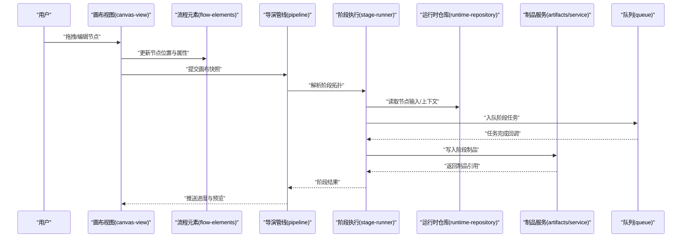

图表来源
- [src/app/products/(app)/canvas/[projectId]/canvas-view.tsx](file://src/app/products/(app)/canvas/[projectId]/canvas-view.tsx)
- [src/app/products/(app)/canvas/[projectId]/flow-elements.tsx](file://src/app/products/(app)/canvas/[projectId]/flow-elements.tsx)
- [src/features/director/pipeline.ts](file://src/features/director/pipeline.ts)
- [src/features/director/stage-runner.ts](file://src/features/director/stage-runner.ts)
- [src/features/director/runtime-repository.ts](file://src/features/director/runtime-repository.ts)
- [src/features/artifacts/service.ts](file://src/features/artifacts/service.ts)
- [src/lib/queue/index.ts](file://src/lib/queue/index.ts)

## 详细组件分析

### 画布视图与流程元素
- 职责：承载画布的渲染与交互，包括节点选择、拖拽移动、连线创建、缩放平移、实时预览。
- 关键点：
  - 使用统一的节点与边数据结构，确保渲染与状态一致。
  - 事件委托与节流防抖，提升大画布下的交互性能。
  - 与后端流式接口对接，实时更新节点状态与预览。

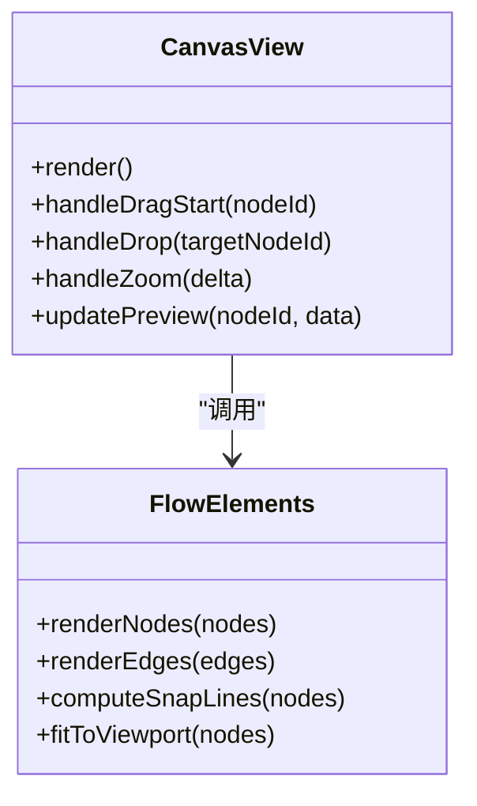

图表来源
- [src/app/products/(app)/canvas/[projectId]/canvas-view.tsx](file://src/app/products/(app)/canvas/[projectId]/canvas-view.tsx)
- [src/app/products/(app)/canvas/[projectId]/flow-elements.tsx](file://src/app/products/(app)/canvas/[projectId]/flow-elements.tsx)

章节来源
- [src/app/products/(app)/canvas/[projectId]/canvas-view.tsx](file://src/app/products/(app)/canvas/[projectId]/canvas-view.tsx)
- [src/app/products/(app)/canvas/[projectId]/flow-elements.tsx](file://src/app/products/(app)/canvas/[projectId]/flow-elements.tsx)

### 节点系统与类型定义
- 节点类型：Stage、Shot、Audio、Export 等，每种节点拥有独立的属性集与渲染逻辑。
- 属性管理：通过表单或属性面板绑定到节点实例，支持校验与默认值。
- 连接关系：边表示数据流向，需满足输入输出契约。

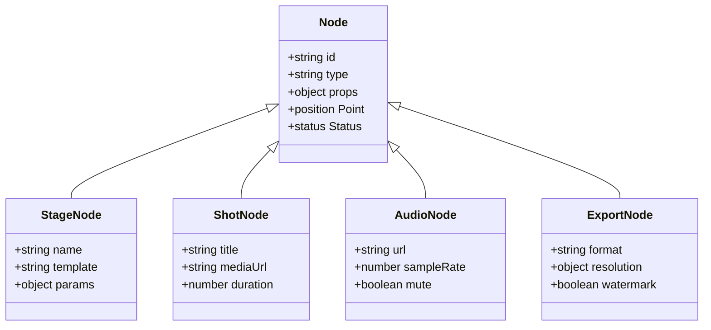

图表来源
- [src/components/ui/node/types.ts](file://src/components/ui/node/types.ts)
- [src/components/ui/node/stage-node.tsx](file://src/components/ui/node/stage-node.tsx)
- [src/components/ui/node/shot-node.tsx](file://src/components/ui/node/shot-node.tsx)
- [src/components/ui/node/audio-node.tsx](file://src/components/ui/node/audio-node.tsx)
- [src/components/ui/node/export-node.tsx](file://src/components/ui/node/export-node.tsx)

章节来源
- [src/components/ui/node/types.ts](file://src/components/ui/node/types.ts)
- [src/components/ui/node/stage-node.tsx](file://src/components/ui/node/stage-node.tsx)
- [src/components/ui/node/shot-node.tsx](file://src/components/ui/node/shot-node.tsx)
- [src/components/ui/node/audio-node.tsx](file://src/components/ui/node/audio-node.tsx)
- [src/components/ui/node/export-node.tsx](file://src/components/ui/node/export-node.tsx)

### 布局算法
- 自动排列：根据节点类型与依赖关系生成初始布局，避免重叠。
- 对齐辅助：在拖拽过程中提供网格与参考线，提升排版精度。
- 缩放适配：保持节点相对位置不变，动态调整视口显示范围。

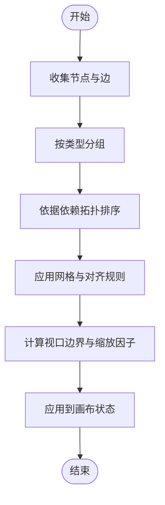

图表来源
- [src/features/canvas/layout.ts](file://src/features/canvas/layout.ts)

章节来源
- [src/features/canvas/layout.ts](file://src/features/canvas/layout.ts)

### 画布状态与动作
- 状态管理：集中维护节点集合、边集合、选中项、视口参数等。
- 动作设计：增删改节点、连线、撤销重做、批量操作。
- 持久化：与项目数据接口同步，支持版本回溯。

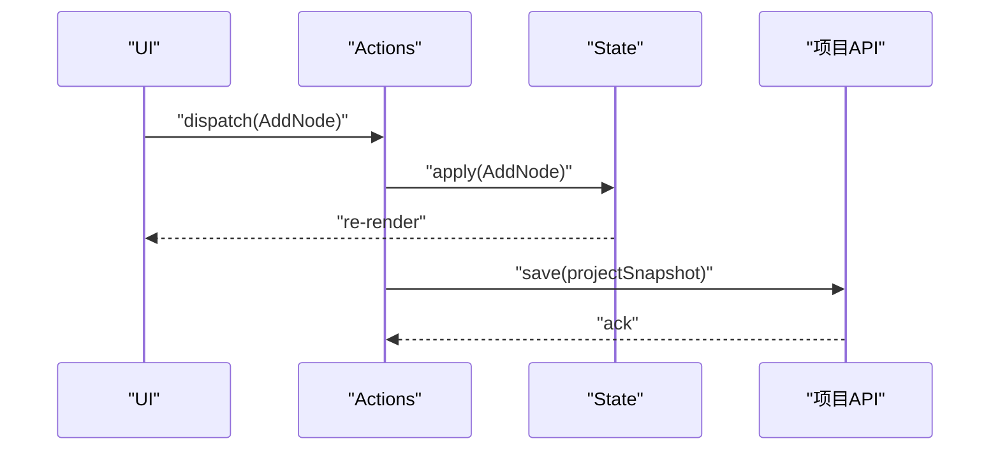

图表来源
- [src/features/canvas/actions.ts](file://src/features/canvas/actions.ts)
- [src/app/api/projects/[id]/route.ts](file://src/app/api/projects/[id]/route.ts)

章节来源
- [src/features/canvas/actions.ts](file://src/features/canvas/actions.ts)
- [src/app/api/projects/[id]/route.ts](file://src/app/api/projects/[id]/route.ts)

### 导演运行时与阶段执行
- 导演管线：将画布拓扑解析为阶段序列，确定执行顺序与并行度。
- 阶段执行器：按阶段配置拉取输入、执行逻辑、写入制品。
- 运行时仓库：提供节点上下文、输入输出数据的存取。

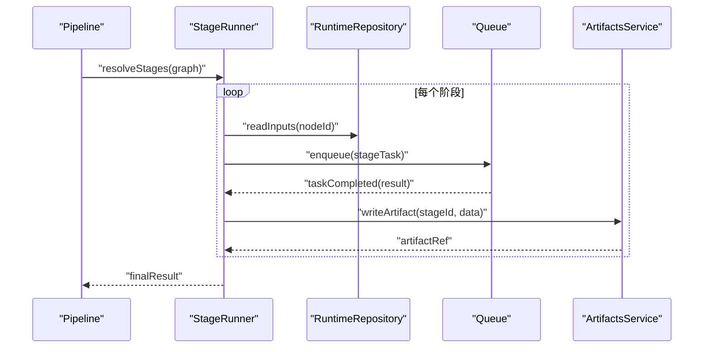

图表来源
- [src/features/director/pipeline.ts](file://src/features/director/pipeline.ts)
- [src/features/director/stage-runner.ts](file://src/features/director/stage-runner.ts)
- [src/features/director/runtime-repository.ts](file://src/features/director/runtime-repository.ts)
- [src/features/artifacts/service.ts](file://src/features/artifacts/service.ts)
- [src/lib/queue/index.ts](file://src/lib/queue/index.ts)

章节来源
- [src/features/director/pipeline.ts](file://src/features/director/pipeline.ts)
- [src/features/director/stage-runner.ts](file://src/features/director/stage-runner.ts)
- [src/features/director/runtime-repository.ts](file://src/features/director/runtime-repository.ts)
- [src/features/artifacts/service.ts](file://src/features/artifacts/service.ts)
- [src/lib/queue/index.ts](file://src/lib/queue/index.ts)

### 流式输出与实时预览
- 流式接口：按节点维度推送执行进度与中间结果。
- 前端订阅：实时渲染预览图、音频波形、文本草稿等。

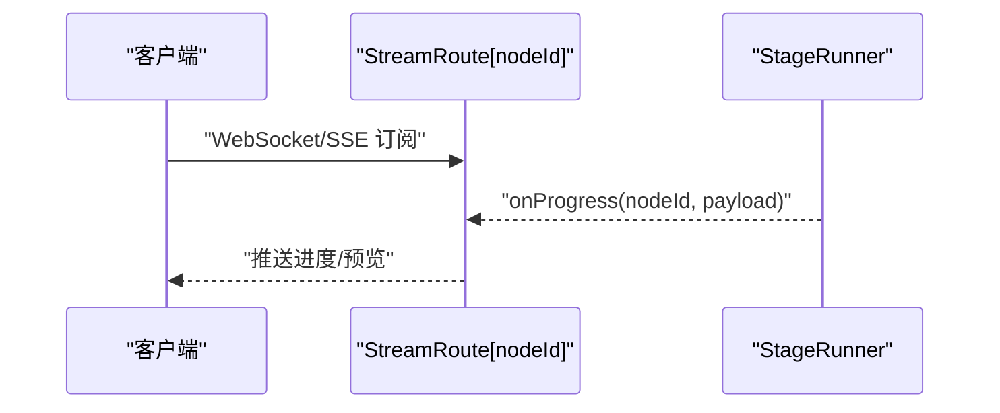

图表来源
- [src/app/api/director/stream/[nodeId]/route.ts](file://src/app/api/director/stream/[nodeId]/route.ts)
- [src/features/director/stage-runner.ts](file://src/features/director/stage-runner.ts)

章节来源
- [src/app/api/director/stream/[nodeId]/route.ts](file://src/app/api/director/stream/[nodeId]/route.ts)
- [src/features/director/stage-runner.ts](file://src/features/director/stage-runner.ts)

### 扇出计算与依赖拓扑
- 扇出：统计节点的直接后继数量，用于并行度评估与负载均衡。
- 拓扑：基于边的方向构建 DAG，检测环路与不可达节点。

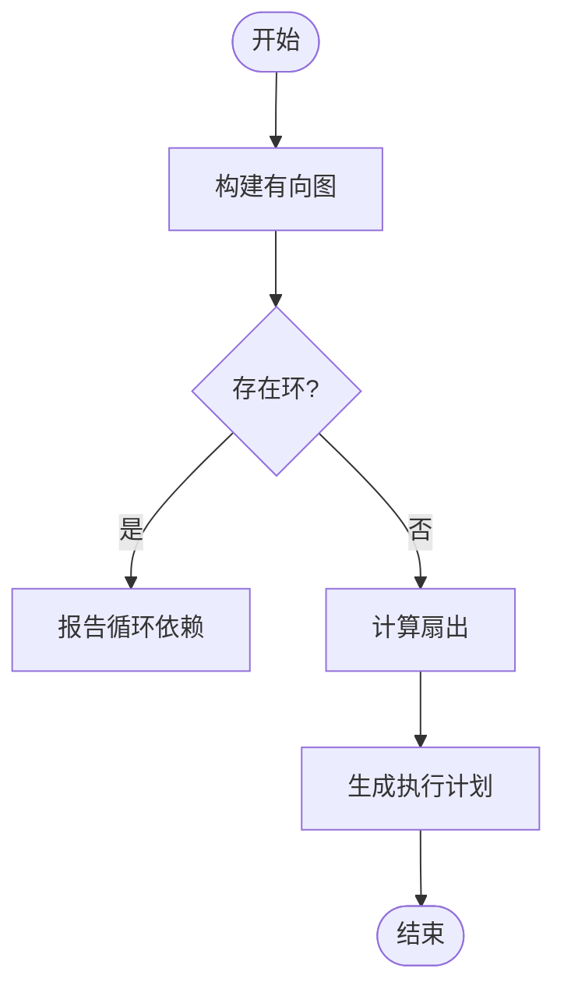

图表来源
- [src/features/canvas/fan-out.ts](file://src/features/canvas/fan-out.ts)

章节来源
- [src/features/canvas/fan-out.ts](file://src/features/canvas/fan-out.ts)

### 工作流错误处理
- 错误分类：节点级错误、阶段级错误、全局错误。
- 恢复策略：重试、降级、跳过、回滚。
- 诊断信息：堆栈、输入摘要、制品状态。

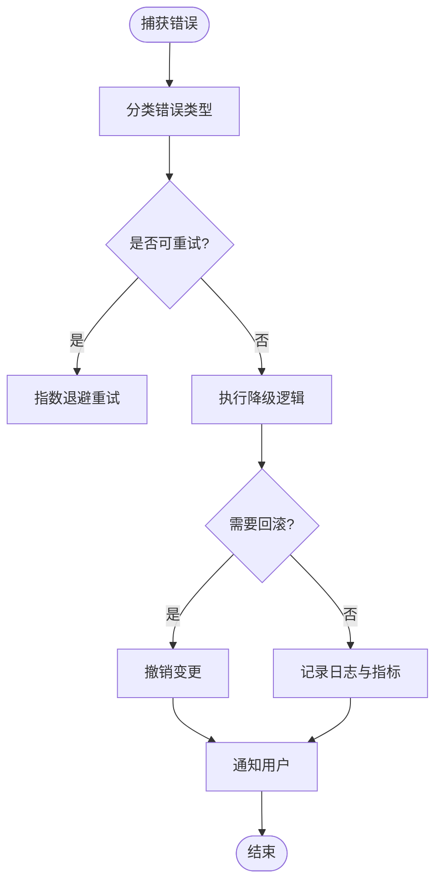

图表来源
- [src/features/canvas/workflow-error.ts](file://src/features/canvas/workflow-error.ts)

章节来源
- [src/features/canvas/workflow-error.ts](file://src/features/canvas/workflow-error.ts)

### 状态与契约
- 状态枚举：节点状态（待执行、运行中、成功、失败）、画布状态（编辑、锁定、发布）。
- 契约校验：输入输出字段、类型约束、必填项检查。

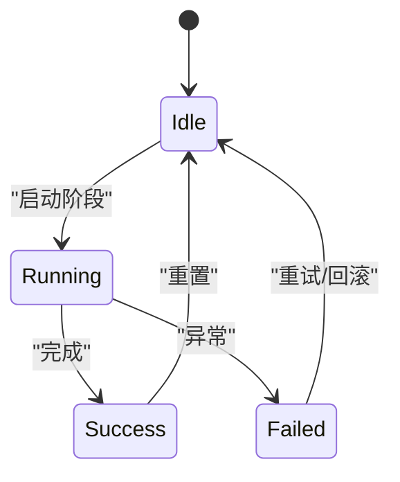

图表来源
- [src/features/canvas/status.ts](file://src/features/canvas/status.ts)
- [src/features/canvas/contracts.ts](file://src/features/canvas/contracts.ts)

章节来源
- [src/features/canvas/status.ts](file://src/features/canvas/status.ts)
- [src/features/canvas/contracts.ts](file://src/features/canvas/contracts.ts)

### AI 集成（脚本生成、素材推荐、智能布局）
- 脚本生成：基于画布意图与节点属性，调用 AI 适配器生成阶段脚本或模板。
- 素材推荐：根据节点类型与上下文，检索并推荐媒体素材。
- 智能布局：结合拓扑与视觉规则，自动生成更优的节点排布。

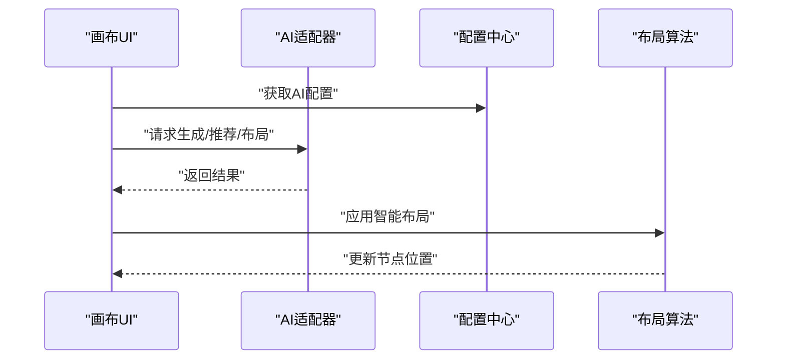

图表来源
- [src/app/api/director/pipeline/route.ts](file://src/app/api/director/pipeline/route.ts)
- [src/app/api/director/stage/route.ts](file://src/app/api/director/stage/route.ts)
- [src/features/canvas/layout.ts](file://src/features/canvas/layout.ts)

章节来源
- [src/app/api/director/pipeline/route.ts](file://src/app/api/director/pipeline/route.ts)
- [src/app/api/director/stage/route.ts](file://src/app/api/director/stage/route.ts)
- [src/features/canvas/layout.ts](file://src/features/canvas/layout.ts)

### 协作编辑（实时同步、冲突解决、版本管理）
- 实时同步：基于 WebSocket/SSE 推送增量变更，保证多端一致性。
- 冲突解决：采用操作转换（OT）或 CRDT 策略合并冲突。
- 版本管理：每次保存生成快照，支持分支与回滚。

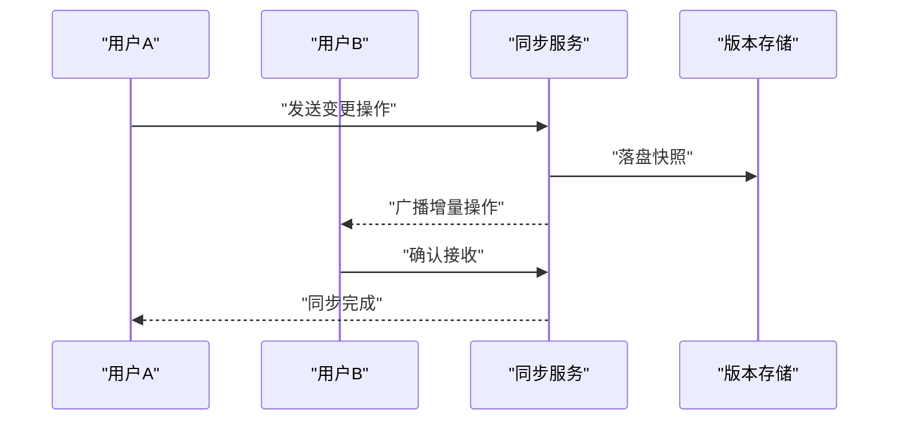

图表来源
- [src/app/api/projects/[id]/route.ts](file://src/app/api/projects/[id]/route.ts)
- [src/app/api/director/stream/[nodeId]/route.ts](file://src/app/api/director/stream/[nodeId]/route.ts)

章节来源
- [src/app/api/projects/[id]/route.ts](file://src/app/api/projects/[id]/route.ts)
- [src/app/api/director/stream/[nodeId]/route.ts](file://src/app/api/director/stream/[nodeId]/route.ts)

### 自定义节点开发与扩展
- 步骤：
  1. 定义节点类型与属性契约。
  2. 实现节点 UI 组件（展示与编辑）。
  3. 注册节点到画布注册表。
  4. 编写阶段执行逻辑（如需要）。
  5. 添加测试与文档。
- 最佳实践：
  - 属性校验在前端与后端同时生效。
  - 节点状态与生命周期清晰明确。
  - 错误信息对用户友好且可诊断。

章节来源
- [src/components/ui/node/types.ts](file://src/components/ui/node/types.ts)
- [src/features/canvas/contracts.ts](file://src/features/canvas/contracts.ts)
- [src/features/director/stage-runner.ts](file://src/features/director/stage-runner.ts)

## 依赖关系分析
画布编辑器的前后端依赖关系如下：
- 前端依赖画布类型与契约，确保 UI 与状态一致。
- 后端依赖导演运行时与制品服务，保障执行与产出。
- 队列作为横切关注点，贯穿执行与渲染流程。

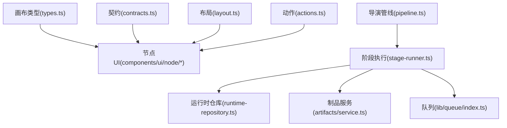

图表来源
- [src/features/canvas/types.ts](file://src/features/canvas/types.ts)
- [src/features/canvas/contracts.ts](file://src/features/canvas/contracts.ts)
- [src/features/canvas/layout.ts](file://src/features/canvas/layout.ts)
- [src/features/canvas/actions.ts](file://src/features/canvas/actions.ts)
- [src/features/director/pipeline.ts](file://src/features/director/pipeline.ts)
- [src/features/director/stage-runner.ts](file://src/features/director/stage-runner.ts)
- [src/features/director/runtime-repository.ts](file://src/features/director/runtime-repository.ts)
- [src/features/artifacts/service.ts](file://src/features/artifacts/service.ts)
- [src/lib/queue/index.ts](file://src/lib/queue/index.ts)

章节来源
- [src/features/canvas/types.ts](file://src/features/canvas/types.ts)
- [src/features/canvas/contracts.ts](file://src/features/canvas/contracts.ts)
- [src/features/canvas/layout.ts](file://src/features/canvas/layout.ts)
- [src/features/canvas/actions.ts](file://src/features/canvas/actions.ts)
- [src/features/director/pipeline.ts](file://src/features/director/pipeline.ts)
- [src/features/director/stage-runner.ts](file://src/features/director/stage-runner.ts)
- [src/features/director/runtime-repository.ts](file://src/features/director/runtime-repository.ts)
- [src/features/artifacts/service.ts](file://src/features/artifacts/service.ts)
- [src/lib/queue/index.ts](file://src/lib/queue/index.ts)

## 性能考量
- 渲染性能：虚拟化长列表、按需加载节点、减少重绘。
- 交互性能：事件节流与防抖、增量更新、离屏计算。
- 执行性能：阶段并行度控制、资源复用、缓存命中。
- 网络性能：流式传输、压缩、断点续传。

[本节为通用指导，不直接分析具体文件]

## 故障排查指南
- 常见问题：
  - 节点无法连接：检查输入输出契约与类型匹配。
  - 阶段执行失败：查看运行时仓库输入与制品状态。
  - 布局错乱：验证拓扑无环与依赖完整。
- 诊断手段：
  - 启用详细日志与指标上报。
  - 使用回放功能复现问题。
  - 隔离单节点验证执行逻辑。

章节来源
- [src/features/canvas/workflow-error.ts](file://src/features/canvas/workflow-error.ts)
- [src/features/director/stage-runner.ts](file://src/features/director/stage-runner.ts)
- [src/features/canvas/fan-out.ts](file://src/features/canvas/fan-out.ts)

## 结论
PurpleInk 画布编辑器通过清晰的模块化设计与强类型的契约体系，实现了高可扩展的可视化编辑体验。导演运行时与制品服务确保了从画布到产物的稳定执行链路。未来可在 AI 增强、协作编辑与性能优化方面持续迭代，以提升用户体验与开发效率。

[本节为总结性内容，不直接分析具体文件]

## 附录
- 术语表：节点、边、阶段、制品、运行时、队列等。
- 参考链接：内部设计文档与部署手册。

[本节为补充信息，不直接分析具体文件]