# 画布编辑器

<cite>
**本文引用的文件**   
- [src/app/products/(app)/canvas/[projectId]/page.tsx](file://src/app/products/(app)/canvas/[projectId]/page.tsx)
- [src/app/products/(app)/canvas/[projectId]/canvas-view.tsx](file://src/app/products/(app)/canvas/[projectId]/canvas-view.tsx)
- [src/app/products/(app)/canvas/[projectId]/flow-elements.tsx](file://src/app/products/(app)/canvas/[projectId]/flow-elements.tsx)
- [src/app/products/(app)/canvas/[projectId]/canvas-inspector.tsx](file://src/app/products/(app)/canvas/[projectId]/canvas-inspector.tsx)
- [src/app/products/(app)/canvas/[projectId]/live-status.ts](file://src/app/products/(app)/canvas/[projectId]/live-status.ts)
- [src/app/products/(app)/canvas/[projectId]/pipeline-feedback.ts](file://src/app/products/(app)/canvas/[projectId]/pipeline-feedback.ts)
- [src/app/products/(app)/canvas/[projectId]/streaming-log-card.tsx](file://src/app/products/(app)/canvas/[projectId]/streaming-log-card.tsx)
- [src/app/products/(app)/canvas/[projectId]/stage-error-dialog.tsx](file://src/app/products/(app)/canvas/[projectId]/stage-error-dialog.tsx)
- [src/features/canvas/types.ts](file://src/features/canvas/types.ts)
- [src/features/canvas/layout.ts](file://src/features/canvas/layout.ts)
- [src/features/canvas/status.ts](file://src/features/canvas/status.ts)
- [src/features/canvas/export-settings.ts](file://src/features/canvas/export-settings.ts)
- [src/features/canvas/fan-out.ts](file://src/features/canvas/fan-out.ts)
- [src/features/canvas/queries.ts](file://src/features/canvas/queries.ts)
- [src/features/canvas/actions.ts](file://src/features/canvas/actions.ts)
- [src/features/canvas/contracts.ts](file://src/features/canvas/contracts.ts)
- [src/components/ui/node/stage-node.tsx](file://src/components/ui/node/stage-node.tsx)
- [src/components/ui/node/audio-node.tsx](file://src/components/ui/node/audio-node.tsx)
- [src/components/ui/node/export-node.tsx](file://src/components/ui/node/export-node.tsx)
- [src/components/ui/node/shot-node.tsx](file://src/components/ui/node/shot-node.tsx)
- [src/components/ui/node/types.ts](file://src/components/ui/node/types.ts)
- [src/app/api/director/pipeline/route.ts](file://src/app/api/director/pipeline/route.ts)
- [src/app/api/director/stage/route.ts](file://src/app/api/director/stage/route.ts)
- [src/app/api/director/stream/[nodeId]/route.ts](file://src/app/api/director/stream/[nodeId]/route.ts)
- [src/app/api/render/route.ts](file://src/app/api/render/route.ts)
- [src/app/api/projects/[id]/route.ts](file://src/app/api/projects/[id]/route.ts)
- [src/app/api/artifacts/[id]/route.ts](file://src/app/api/artifacts/[id]/route.ts)
- [src/lib/queue/index.ts](file://src/lib/queue/index.ts)
- [src/lib/storage/index.ts](file://src/lib/storage/index.ts)
</cite>

## 目录
1. [简介](#简介)
2. [项目结构](#项目结构)
3. [核心组件](#核心组件)
4. [架构总览](#架构总览)
5. [详细组件分析](#详细组件分析)
6. [依赖关系分析](#依赖关系分析)
7. [性能考量](#性能考量)
8. [故障排查指南](#故障排查指南)
9. [结论](#结论)
10. [附录](#附录)

## 简介
PurpleInk 画布编辑器是一个面向可视化编排与渲染的 Web 应用，提供节点式画布、拖拽交互、实时预览、版本控制与协作编辑能力。其前端基于 Next.js App Router，后端通过 API 路由与队列/存储层协同，实现从画布状态到渲染产物的端到端流程。文档将深入解析画布的核心架构、节点系统、布局算法、拖拽与实时预览机制、版本控制与协作支持，并给出扩展自定义节点与性能优化的实践建议。

## 项目结构
本项目采用“功能域 + 页面路由”的组织方式：
- 画布相关页面位于 src/app/products/(app)/canvas/[projectId]，包含画布视图、检查器、流式日志、错误弹窗等。
- 画布领域逻辑集中在 src/features/canvas，涵盖类型定义、布局算法、状态机、导出设置、扇出策略、查询封装等。
- 节点 UI 组件位于 src/components/ui/node，提供阶段节点、音频节点、导出节点、分镜节点等。
- API 路由位于 src/app/api，负责导演（Director）流水线、阶段执行、流式事件、渲染、项目与制品管理等。
- 通用基础设施包括队列与存储抽象，位于 src/lib/queue 与 src/lib/storage。

```mermaid
graph TB
subgraph "前端页面"
CanvasPage["画布页面<br/>page.tsx"]
CanvasView["画布视图<br/>canvas-view.tsx"]
Inspector["属性检查器<br/>canvas-inspector.tsx"]
FlowElements["流程图元素<br/>flow-elements.tsx"]
LiveStatus["实时状态<br/>live-status.ts"]
PipelineFeedback["管线反馈<br/>pipeline-feedback.ts"]
StreamingLog["流式日志卡片<br/>streaming-log-card.tsx"]
StageErrorDialog["阶段错误弹窗<br/>stage-error-dialog.tsx"]
end
subgraph "画布领域"
Types["类型定义<br/>types.ts"]
Layout["布局算法<br/>layout.ts"]
Status["状态机<br/>status.ts"]
ExportSettings["导出设置<br/>export-settings.ts"]
FanOut["扇出策略<br/>fan-out.ts"]
Queries["查询封装<br/>queries.ts"]
Actions["操作API<br/>actions.ts"]
Contracts["契约定义<br/>contracts.ts"]
end
subgraph "节点UI"
StageNode["阶段节点<br/>stage-node.tsx"]
AudioNode["音频节点<br/>audio-node.tsx"]
ExportNode["导出节点<br/>export-node.tsx"]
ShotNode["分镜节点<br/>shot-node.tsx"]
NodeTypes["节点类型<br/>types.ts"]
end
subgraph "API 路由"
PipelineRoute["流水线路由<br/>director/pipeline/route.ts"]
StageRoute["阶段路由<br/>director/stage/route.ts"]
StreamRoute["流式事件路由<br/>director/stream/[nodeId]/route.ts"]
RenderRoute["渲染路由<br/>render/route.ts"]
ProjectRoute["项目路由<br/>projects/[id]/route.ts"]
ArtifactRoute["制品路由<br/>artifacts/[id]/route.ts"]
end
subgraph "基础设施"
Queue["队列抽象<br/>lib/queue/index.ts"]
Storage["存储抽象<br/>lib/storage/index.ts"]
end
CanvasPage --> CanvasView
CanvasView --> FlowElements
CanvasView --> Inspector
CanvasView --> LiveStatus
CanvasView --> PipelineFeedback
CanvasView --> StreamingLog
CanvasView --> StageErrorDialog
CanvasView --> Types
CanvasView --> Layout
CanvasView --> Status
CanvasView --> ExportSettings
CanvasView --> FanOut
CanvasView --> Queries
CanvasView --> Actions
CanvasView --> Contracts
FlowElements --> StageNode
FlowElements --> AudioNode
FlowElements --> ExportNode
FlowElements --> ShotNode
FlowElements --> NodeTypes
CanvasView --> PipelineRoute
CanvasView --> StageRoute
CanvasView --> StreamRoute
CanvasView --> RenderRoute
CanvasView --> ProjectRoute
CanvasView --> ArtifactRoute
PipelineRoute --> Queue
StageRoute --> Queue
StreamRoute --> Queue
RenderRoute --> Storage
ProjectRoute --> Storage
ArtifactRoute --> Storage
```

**图表来源** 
- [src/app/products/(app)/canvas/[projectId]/page.tsx](file://src/app/products/(app)/canvas/[projectId]/page.tsx)
- [src/app/products/(app)/canvas/[projectId]/canvas-view.tsx](file://src/app/products/(app)/canvas/[projectId]/canvas-view.tsx)
- [src/app/products/(app)/canvas/[projectId]/flow-elements.tsx](file://src/app/products/(app)/canvas/[projectId]/flow-elements.tsx)
- [src/app/products/(app)/canvas/[projectId]/canvas-inspector.tsx](file://src/app/products/(app)/canvas/[projectId]/canvas-inspector.tsx)
- [src/app/products/(app)/canvas/[projectId]/live-status.ts](file://src/app/products/(app)/canvas/[projectId]/live-status.ts)
- [src/app/products/(app)/canvas/[projectId]/pipeline-feedback.ts](file://src/app/products/(app)/canvas/[projectId]/pipeline-feedback.ts)
- [src/app/products/(app)/canvas/[projectId]/streaming-log-card.tsx](file://src/app/products/(app)/canvas/[projectId]/streaming-log-card.tsx)
- [src/app/products/(app)/canvas/[projectId]/stage-error-dialog.tsx](file://src/app/products/(app)/canvas/[projectId]/stage-error-dialog.tsx)
- [src/features/canvas/types.ts](file://src/features/canvas/types.ts)
- [src/features/canvas/layout.ts](file://src/features/canvas/layout.ts)
- [src/features/canvas/status.ts](file://src/features/canvas/status.ts)
- [src/features/canvas/export-settings.ts](file://src/features/canvas/export-settings.ts)
- [src/features/canvas/fan-out.ts](file://src/features/canvas/fan-out.ts)
- [src/features/canvas/queries.ts](file://src/features/canvas/queries.ts)
- [src/features/canvas/actions.ts](file://src/features/canvas/actions.ts)
- [src/features/canvas/contracts.ts](file://src/features/canvas/contracts.ts)
- [src/components/ui/node/stage-node.tsx](file://src/components/ui/node/stage-node.tsx)
- [src/components/ui/node/audio-node.tsx](file://src/components/ui/node/audio-node.tsx)
- [src/components/ui/node/export-node.tsx](file://src/components/ui/node/export-node.tsx)
- [src/components/ui/node/shot-node.tsx](file://src/components/ui/node/shot-node.tsx)
- [src/components/ui/node/types.ts](file://src/components/ui/node/types.ts)
- [src/app/api/director/pipeline/route.ts](file://src/app/api/director/pipeline/route.ts)
- [src/app/api/director/stage/route.ts](file://src/app/api/director/stage/route.ts)
- [src/app/api/director/stream/[nodeId]/route.ts](file://src/app/api/director/stream/[nodeId]/route.ts)
- [src/app/api/render/route.ts](file://src/app/api/render/route.ts)
- [src/app/api/projects/[id]/route.ts](file://src/app/api/projects/[id]/route.ts)
- [src/app/api/artifacts/[id]/route.ts](file://src/app/api/artifacts/[id]/route.ts)
- [src/lib/queue/index.ts](file://src/lib/queue/index.ts)
- [src/lib/storage/index.ts](file://src/lib/storage/index.ts)

**章节来源**
- [src/app/products/(app)/canvas/[projectId]/page.tsx](file://src/app/products/(app)/canvas/[projectId]/page.tsx)
- [src/app/products/(app)/canvas/[projectId]/canvas-view.tsx](file://src/app/products/(app)/canvas/[projectId]/canvas-view.tsx)
- [src/features/canvas/types.ts](file://src/features/canvas/types.ts)
- [src/features/canvas/layout.ts](file://src/features/canvas/layout.ts)

## 核心组件
- 画布视图与流程图元素：负责渲染节点、连线、选择与高亮、缩放平移、拖拽移动与连接点交互。
- 属性检查器：根据选中节点动态渲染属性表单，支持校验与变更回写。
- 实时状态与管线反馈：订阅流式事件，展示阶段进度、日志与错误提示。
- 节点类型与UI：阶段节点、音频节点、导出节点、分镜节点等，统一遵循节点类型契约。
- 画布领域逻辑：类型定义、布局算法、状态机、导出设置、扇出策略、查询封装、操作API与契约。
- API 路由：导演流水线、阶段执行、流式事件、渲染、项目与制品管理。
- 基础设施：队列与存储抽象，支撑异步任务与持久化。

**章节来源**
- [src/app/products/(app)/canvas/[projectId]/canvas-view.tsx](file://src/app/products/(app)/canvas/[projectId]/canvas-view.tsx)
- [src/app/products/(app)/canvas/[projectId]/flow-elements.tsx](file://src/app/products/(app)/canvas/[projectId]/flow-elements.tsx)
- [src/app/products/(app)/canvas/[projectId]/canvas-inspector.tsx](file://src/app/products/(app)/canvas/[projectId]/canvas-inspector.tsx)
- [src/app/products/(app)/canvas/[projectId]/live-status.ts](file://src/app/products/(app)/canvas/[projectId]/live-status.ts)
- [src/app/products/(app)/canvas/[projectId]/pipeline-feedback.ts](file://src/app/products/(app)/canvas/[projectId]/pipeline-feedback.ts)
- [src/components/ui/node/types.ts](file://src/components/ui/node/types.ts)
- [src/features/canvas/types.ts](file://src/features/canvas/types.ts)
- [src/features/canvas/layout.ts](file://src/features/canvas/layout.ts)
- [src/features/canvas/status.ts](file://src/features/canvas/status.ts)
- [src/features/canvas/export-settings.ts](file://src/features/canvas/export-settings.ts)
- [src/features/canvas/fan-out.ts](file://src/features/canvas/fan-out.ts)
- [src/features/canvas/queries.ts](file://src/features/canvas/queries.ts)
- [src/features/canvas/actions.ts](file://src/features/canvas/actions.ts)
- [src/features/canvas/contracts.ts](file://src/features/canvas/contracts.ts)

## 架构总览
画布编辑器的前端通过页面与视图组件驱动用户交互，调用画布领域的类型与布局逻辑，并通过 API 路由与后端服务通信。节点 UI 组件遵循统一的类型契约，确保可扩展性。实时预览通过流式事件推送，状态同步由状态机与操作API保证一致性。

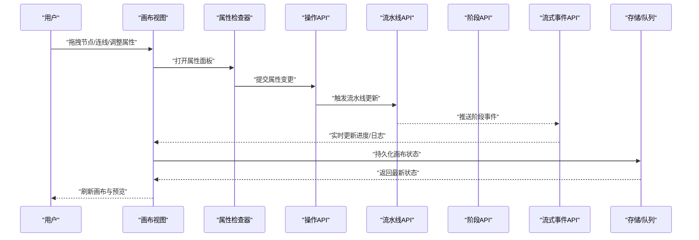

**图表来源** 
- [src/app/products/(app)/canvas/[projectId]/canvas-view.tsx](file://src/app/products/(app)/canvas/[projectId]/canvas-view.tsx)
- [src/app/products/(app)/canvas/[projectId]/canvas-inspector.tsx](file://src/app/products/(app)/canvas/[projectId]/canvas-inspector.tsx)
- [src/features/canvas/actions.ts](file://src/features/canvas/actions.ts)
- [src/app/api/director/pipeline/route.ts](file://src/app/api/director/pipeline/route.ts)
- [src/app/api/director/stage/route.ts](file://src/app/api/director/stage/route.ts)
- [src/app/api/director/stream/[nodeId]/route.ts](file://src/app/api/director/stream/[nodeId]/route.ts)
- [src/lib/queue/index.ts](file://src/lib/queue/index.ts)
- [src/lib/storage/index.ts](file://src/lib/storage/index.ts)

## 详细组件分析

### 节点系统与类型定义
- 节点类型契约：统一描述节点元数据、输入输出端口、属性字段、渲染行为与验证规则。
- 内置节点：阶段节点（Stage）、音频节点（Audio）、导出节点（Export）、分镜节点（Shot）。
- 节点扩展：通过注册新类型与渲染组件，接入画布渲染与属性编辑流程。

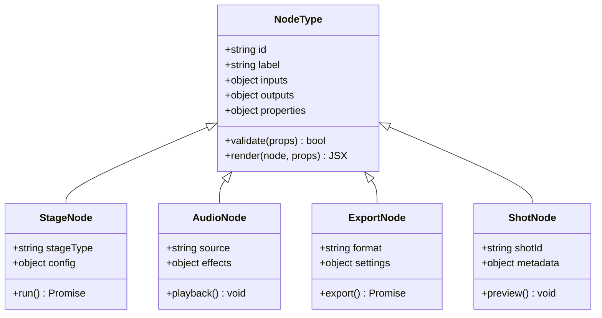

**图表来源** 
- [src/components/ui/node/types.ts](file://src/components/ui/node/types.ts)
- [src/components/ui/node/stage-node.tsx](file://src/components/ui/node/stage-node.tsx)
- [src/components/ui/node/audio-node.tsx](file://src/components/ui/node/audio-node.tsx)
- [src/components/ui/node/export-node.tsx](file://src/components/ui/node/export-node.tsx)
- [src/components/ui/node/shot-node.tsx](file://src/components/ui/node/shot-node.tsx)

**章节来源**
- [src/components/ui/node/types.ts](file://src/components/ui/node/types.ts)
- [src/components/ui/node/stage-node.tsx](file://src/components/ui/node/stage-node.tsx)
- [src/components/ui/node/audio-node.tsx](file://src/components/ui/node/audio-node.tsx)
- [src/components/ui/node/export-node.tsx](file://src/components/ui/node/export-node.tsx)
- [src/components/ui/node/shot-node.tsx](file://src/components/ui/node/shot-node.tsx)

### 布局算法与画布渲染
- 布局目标：在有限画布空间内自动排列节点，避免重叠，保持可读性与可编辑性。
- 算法要点：拓扑排序、层级划分、间距计算、边界约束、增量重排。
- 渲染优化：虚拟滚动、按需渲染、防抖重排、增量更新。

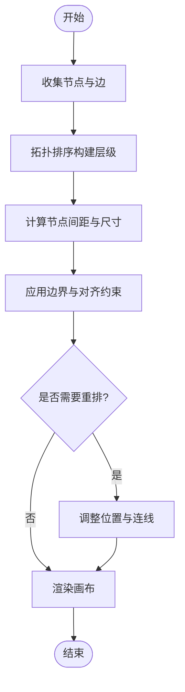

**图表来源** 
- [src/features/canvas/layout.ts](file://src/features/canvas/layout.ts)

**章节来源**
- [src/features/canvas/layout.ts](file://src/features/canvas/layout.ts)

### 状态机与实时预览
- 状态机：定义节点与阶段的生命周期（待运行、运行中、成功、失败、取消），驱动 UI 更新。
- 实时预览：通过流式事件推送阶段日志与进度，前端订阅并即时渲染。
- 错误处理：捕获阶段异常，弹出错误对话框并提供重试或跳过选项。

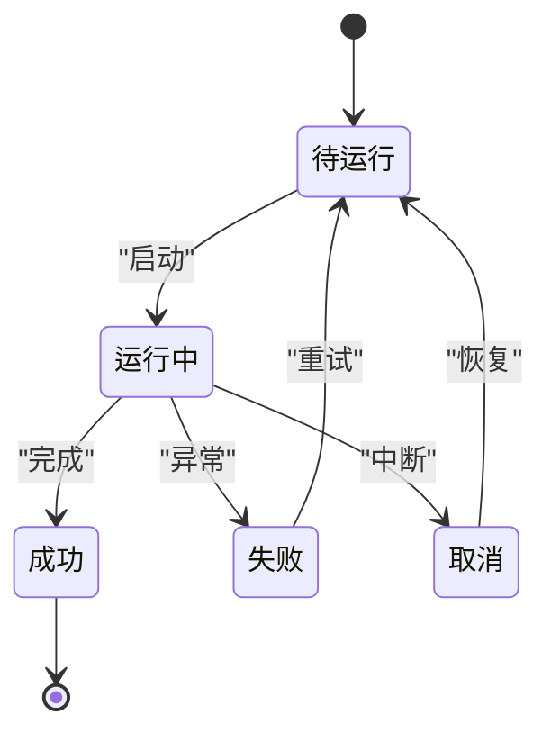

**图表来源** 
- [src/features/canvas/status.ts](file://src/features/canvas/status.ts)
- [src/app/products/(app)/canvas/[projectId]/live-status.ts](file://src/app/products/(app)/canvas/[projectId]/live-status.ts)
- [src/app/products/(app)/canvas/[projectId]/pipeline-feedback.ts](file://src/app/products/(app)/canvas/[projectId]/pipeline-feedback.ts)
- [src/app/products/(app)/canvas/[projectId]/streaming-log-card.tsx](file://src/app/products/(app)/canvas/[projectId]/streaming-log-card.tsx)
- [src/app/products/(app)/canvas/[projectId]/stage-error-dialog.tsx](file://src/app/products/(app)/canvas/[projectId]/stage-error-dialog.tsx)

**章节来源**
- [src/features/canvas/status.ts](file://src/features/canvas/status.ts)
- [src/app/products/(app)/canvas/[projectId]/live-status.ts](file://src/app/products/(app)/canvas/[projectId]/live-status.ts)
- [src/app/products/(app)/canvas/[projectId]/pipeline-feedback.ts](file://src/app/products/(app)/canvas/[projectId]/pipeline-feedback.ts)
- [src/app/products/(app)/canvas/[projectId]/streaming-log-card.tsx](file://src/app/products/(app)/canvas/[projectId]/streaming-log-card.tsx)
- [src/app/products/(app)/canvas/[projectId]/stage-error-dialog.tsx](file://src/app/products/(app)/canvas/[projectId]/stage-error-dialog.tsx)

### 拖拽交互与连线
- 拖拽实现：监听鼠标/触摸事件，计算偏移量，更新节点坐标；支持吸附与网格对齐。
- 连线交互：从输出端口拖拽至输入端口，生成边对象，校验连通性与循环依赖。
- 撤销/重做：记录操作历史，支持批量撤销与重放。

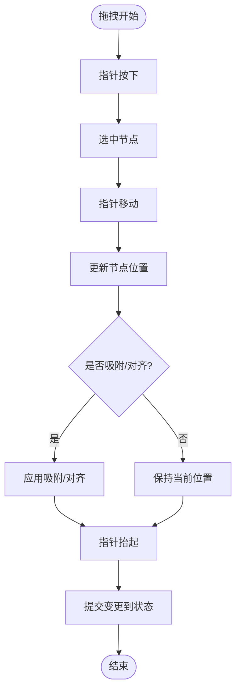

**图表来源** 
- [src/app/products/(app)/canvas/[projectId]/flow-elements.tsx](file://src/app/products/(app)/canvas/[projectId]/flow-elements.tsx)
- [src/app/products/(app)/canvas/[projectId]/canvas-view.tsx](file://src/app/products/(app)/canvas/[projectId]/canvas-view.tsx)

**章节来源**
- [src/app/products/(app)/canvas/[projectId]/flow-elements.tsx](file://src/app/products/(app)/canvas/[projectId]/flow-elements.tsx)
- [src/app/products/(app)/canvas/[projectId]/canvas-view.tsx](file://src/app/products/(app)/canvas/[projectId]/canvas-view.tsx)

### 属性编辑器与模板系统
- 属性编辑器：根据节点类型动态生成表单，支持文本、数值、枚举、文件上传等字段类型。
- 模板系统：提供常用节点配置模板，快速初始化复杂节点。
- 校验与回写：前端校验通过后写入状态，触发重新布局或预览。

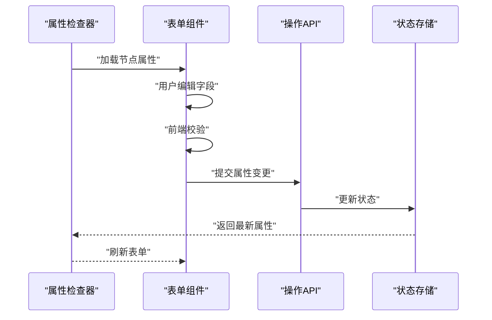

**图表来源** 
- [src/app/products/(app)/canvas/[projectId]/canvas-inspector.tsx](file://src/app/products/(app)/canvas/[projectId]/canvas-inspector.tsx)
- [src/features/canvas/actions.ts](file://src/features/canvas/actions.ts)

**章节来源**
- [src/app/products/(app)/canvas/[projectId]/canvas-inspector.tsx](file://src/app/products/(app)/canvas/[projectId]/canvas-inspector.tsx)
- [src/features/canvas/actions.ts](file://src/features/canvas/actions.ts)

### 版本控制与协作编辑
- 版本控制：每次重要变更创建快照，支持分支与合并，保留完整历史。
- 协作编辑：基于操作转换（OT）或冲突-free 复制（CRDT）实现多用户实时同步。
- 冲突解决：检测冲突并提示用户选择合并策略。

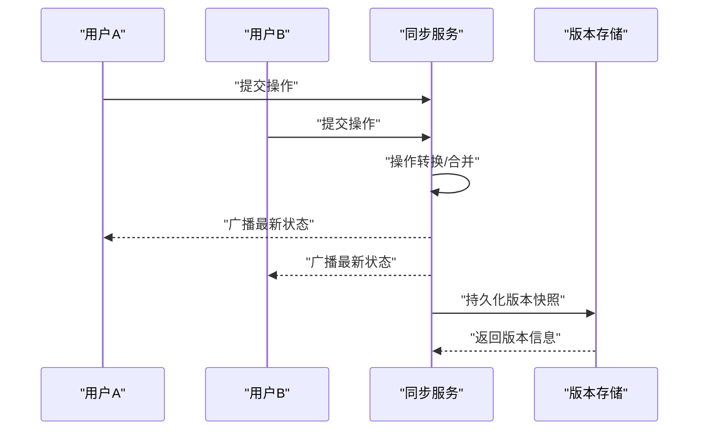

**图表来源** 
- [src/features/canvas/actions.ts](file://src/features/canvas/actions.ts)
- [src/lib/storage/index.ts](file://src/lib/storage/index.ts)

**章节来源**
- [src/features/canvas/actions.ts](file://src/features/canvas/actions.ts)
- [src/lib/storage/index.ts](file://src/lib/storage/index.ts)

### 画布操作API与状态同步
- 操作API：封装增删改查、批量操作、事务提交，保证状态一致性。
- 状态同步：本地状态与服务器状态双向同步，断线重连与冲突合并。
- 并发控制：锁机制与乐观更新，避免竞态条件。

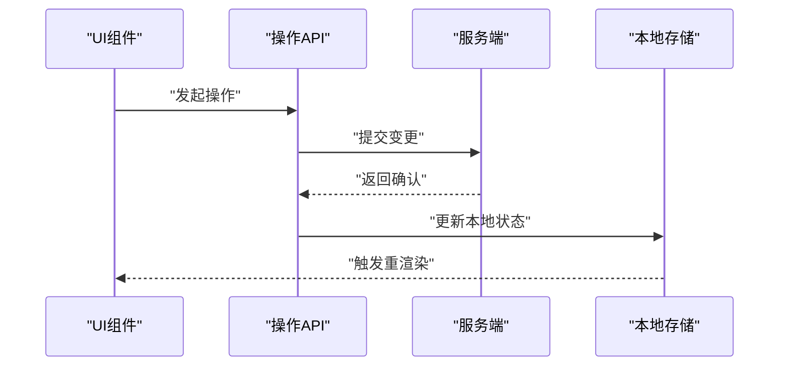

**图表来源** 
- [src/features/canvas/actions.ts](file://src/features/canvas/actions.ts)
- [src/lib/storage/index.ts](file://src/lib/storage/index.ts)

**章节来源**
- [src/features/canvas/actions.ts](file://src/features/canvas/actions.ts)
- [src/lib/storage/index.ts](file://src/lib/storage/index.ts)

### 导出与扇出策略
- 导出设置：定义输出格式、分辨率、编码参数与质量阈值。
- 扇出策略：并行处理多个导出任务，限制并发度，避免资源耗尽。
- 结果聚合：合并多个导出产物，生成最终交付包。

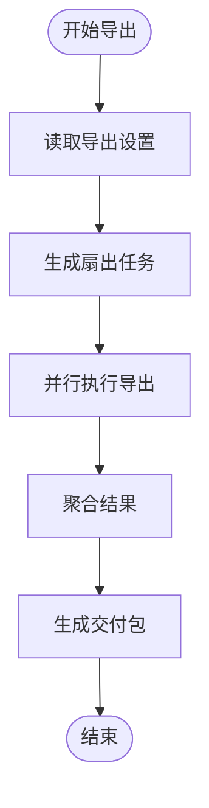

**图表来源** 
- [src/features/canvas/export-settings.ts](file://src/features/canvas/export-settings.ts)
- [src/features/canvas/fan-out.ts](file://src/features/canvas/fan-out.ts)

**章节来源**
- [src/features/canvas/export-settings.ts](file://src/features/canvas/export-settings.ts)
- [src/features/canvas/fan-out.ts](file://src/features/canvas/fan-out.ts)

### 查询封装与数据访问
- 查询封装：统一封装画布数据的查询接口，支持分页、过滤与排序。
- 缓存策略：本地缓存与服务器缓存结合，减少重复请求。
- 错误处理：网络异常与数据不一致的降级与重试。

**章节来源**
- [src/features/canvas/queries.ts](file://src/features/canvas/queries.ts)

### API 路由与后端集成
- 导演流水线：接收画布状态，调度阶段执行，返回执行计划。
- 阶段执行：按依赖顺序执行各阶段，产出中间结果。
- 流式事件：推送阶段日志与进度，前端实时展示。
- 渲染与制品：生成最终渲染产物与缩略图，管理制品生命周期。
- 项目与设置：项目管理、设置读写、凭证管理。

**章节来源**
- [src/app/api/director/pipeline/route.ts](file://src/app/api/director/pipeline/route.ts)
- [src/app/api/director/stage/route.ts](file://src/app/api/director/stage/route.ts)
- [src/app/api/director/stream/[nodeId]/route.ts](file://src/app/api/director/stream/[nodeId]/route.ts)
- [src/app/api/render/route.ts](file://src/app/api/render/route.ts)
- [src/app/api/projects/[id]/route.ts](file://src/app/api/projects/[id]/route.ts)
- [src/app/api/artifacts/[id]/route.ts](file://src/app/api/artifacts/[id]/route.ts)

## 依赖关系分析
画布编辑器的前端模块与后端 API 之间存在清晰的依赖边界：
- 画布视图依赖类型、布局、状态、导出设置、扇出策略、查询与操作API。
- 节点 UI 组件依赖节点类型契约，确保渲染与交互的一致性。
- API 路由依赖队列与存储抽象，解耦具体实现。

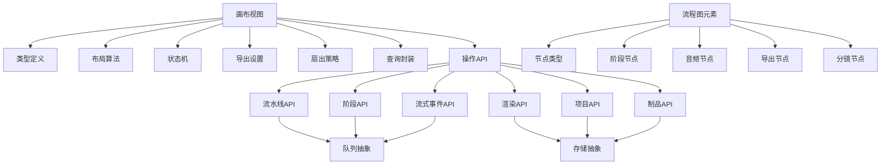

**图表来源** 
- [src/app/products/(app)/canvas/[projectId]/canvas-view.tsx](file://src/app/products/(app)/canvas/[projectId]/canvas-view.tsx)
- [src/app/products/(app)/canvas/[projectId]/flow-elements.tsx](file://src/app/products/(app)/canvas/[projectId]/flow-elements.tsx)
- [src/features/canvas/types.ts](file://src/features/canvas/types.ts)
- [src/features/canvas/layout.ts](file://src/features/canvas/layout.ts)
- [src/features/canvas/status.ts](file://src/features/canvas/status.ts)
- [src/features/canvas/export-settings.ts](file://src/features/canvas/export-settings.ts)
- [src/features/canvas/fan-out.ts](file://src/features/canvas/fan-out.ts)
- [src/features/canvas/queries.ts](file://src/features/canvas/queries.ts)
- [src/features/canvas/actions.ts](file://src/features/canvas/actions.ts)
- [src/components/ui/node/types.ts](file://src/components/ui/node/types.ts)
- [src/components/ui/node/stage-node.tsx](file://src/components/ui/node/stage-node.tsx)
- [src/components/ui/node/audio-node.tsx](file://src/components/ui/node/audio-node.tsx)
- [src/components/ui/node/export-node.tsx](file://src/components/ui/node/export-node.tsx)
- [src/components/ui/node/shot-node.tsx](file://src/components/ui/node/shot-node.tsx)
- [src/app/api/director/pipeline/route.ts](file://src/app/api/director/pipeline/route.ts)
- [src/app/api/director/stage/route.ts](file://src/app/api/director/stage/route.ts)
- [src/app/api/director/stream/[nodeId]/route.ts](file://src/app/api/director/stream/[nodeId]/route.ts)
- [src/app/api/render/route.ts](file://src/app/api/render/route.ts)
- [src/app/api/projects/[id]/route.ts](file://src/app/api/projects/[id]/route.ts)
- [src/app/api/artifacts/[id]/route.ts](file://src/app/api/artifacts/[id]/route.ts)
- [src/lib/queue/index.ts](file://src/lib/queue/index.ts)
- [src/lib/storage/index.ts](file://src/lib/storage/index.ts)

**章节来源**
- [src/app/products/(app)/canvas/[projectId]/canvas-view.tsx](file://src/app/products/(app)/canvas/[projectId]/canvas-view.tsx)
- [src/app/products/(app)/canvas/[projectId]/flow-elements.tsx](file://src/app/products/(app)/canvas/[projectId]/flow-elements.tsx)
- [src/features/canvas/types.ts](file://src/features/canvas/types.ts)
- [src/features/canvas/layout.ts](file://src/features/canvas/layout.ts)
- [src/features/canvas/status.ts](file://src/features/canvas/status.ts)
- [src/features/canvas/export-settings.ts](file://src/features/canvas/export-settings.ts)
- [src/features/canvas/fan-out.ts](file://src/features/canvas/fan-out.ts)
- [src/features/canvas/queries.ts](file://src/features/canvas/queries.ts)
- [src/features/canvas/actions.ts](file://src/features/canvas/actions.ts)
- [src/components/ui/node/types.ts](file://src/components/ui/node/types.ts)
- [src/components/ui/node/stage-node.tsx](file://src/components/ui/node/stage-node.tsx)
- [src/components/ui/node/audio-node.tsx](file://src/components/ui/node/audio-node.tsx)
- [src/components/ui/node/export-node.tsx](file://src/components/ui/node/export-node.tsx)
- [src/components/ui/node/shot-node.tsx](file://src/components/ui/node/shot-node.tsx)
- [src/app/api/director/pipeline/route.ts](file://src/app/api/director/pipeline/route.ts)
- [src/app/api/director/stage/route.ts](file://src/app/api/director/stage/route.ts)
- [src/app/api/director/stream/[nodeId]/route.ts](file://src/app/api/director/stream/[nodeId]/route.ts)
- [src/app/api/render/route.ts](file://src/app/api/render/route.ts)
- [src/app/api/projects/[id]/route.ts](file://src/app/api/projects/[id]/route.ts)
- [src/app/api/artifacts/[id]/route.ts](file://src/app/api/artifacts/[id]/route.ts)
- [src/lib/queue/index.ts](file://src/lib/queue/index.ts)
- [src/lib/storage/index.ts](file://src/lib/storage/index.ts)

## 性能考量
- 渲染优化：使用虚拟列表与按需渲染，减少 DOM 节点数量；对频繁更新的区域进行局部重绘。
- 布局计算：增量重排与缓存布局结果，避免全量重算；对大型项目采用分块布局。
- 内存管理：及时释放不再使用的节点与媒体资源；避免闭包引用导致内存泄漏。
- 并发控制：限制并行任务数，避免阻塞主线程；使用 Web Worker 处理耗时计算。
- 网络优化：请求去重与缓存；流式传输减少首屏延迟。

[本节为通用指导，不直接分析具体文件]

## 故障排查指南
- 阶段错误：查看阶段错误弹窗与流式日志，定位失败原因；支持重试或跳过。
- 状态不一致：检查操作API的事务提交与本地状态同步；必要时回滚到最近快照。
- 布局错乱：检查布局算法的约束与边界条件；重置布局或手动调整。
- 拖拽异常：检查指针事件监听与坐标计算；确认吸附与对齐逻辑。
- 网络错误：检查 API 路由响应与错误码；启用重试与降级策略。

**章节来源**
- [src/app/products/(app)/canvas/[projectId]/stage-error-dialog.tsx](file://src/app/products/(app)/canvas/[projectId]/stage-error-dialog.tsx)
- [src/app/products/(app)/canvas/[projectId]/streaming-log-card.tsx](file://src/app/products/(app)/canvas/[projectId]/streaming-log-card.tsx)
- [src/features/canvas/status.ts](file://src/features/canvas/status.ts)
- [src/features/canvas/layout.ts](file://src/features/canvas/layout.ts)
- [src/app/products/(app)/canvas/[projectId]/flow-elements.tsx](file://src/app/products/(app)/canvas/[projectId]/flow-elements.tsx)
- [src/app/api/director/stage/route.ts](file://src/app/api/director/stage/route.ts)

## 结论
PurpleInk 画布编辑器通过清晰的模块化架构、统一的节点类型契约、稳健的状态机与流式事件机制，实现了高效的可视化编排与实时预览。布局算法与拖拽交互保证了良好的用户体验，版本控制与协作编辑支持多人协同工作。通过合理的性能优化与内存管理策略，系统能够处理大型项目并保持流畅。开发者可通过扩展节点类型与模板系统，快速定制业务需求。

[本节为总结，不直接分析具体文件]

## 附录
- 自定义节点开发指南：
  - 定义节点类型与属性字段，遵循类型契约。
  - 实现渲染组件与属性编辑器，支持校验与回写。
  - 注册节点到画布渲染器，确保拖拽与连线可用。
- 最佳实践：
  - 使用操作API进行状态变更，避免直接修改状态。
  - 合理拆分组件，提升可维护性与复用性。
  - 编写单元测试与集成测试，保障稳定性。

[本节为补充说明，不直接分析具体文件]