# 节点系统

<cite>
**本文引用的文件**   
- [src/components/ui/node/stage-node.tsx](file://src/components/ui/node/stage-node.tsx)
- [src/components/ui/node/shot-node.tsx](file://src/components/ui/node/shot-node.tsx)
- [src/components/ui/node/audio-node.tsx](file://src/components/ui/node/audio-node.tsx)
- [src/components/ui/node/export-node.tsx](file://src/components/ui/node/export-node.tsx)
- [src/components/ui/node/types.ts](file://src/components/ui/node/types.ts)
- [src/components/ui/pipeline-node.tsx](file://src/components/ui/pipeline-node.tsx)
- [src/features/canvas/types.ts](file://src/features/canvas/types.ts)
- [src/features/canvas/status.ts](file://src/features/canvas/status.ts)
- [src/features/director/runtime-node-data.ts](file://src/features/director/runtime-node-data.ts)
- [src/features/director/stage-runner.ts](file://src/features/director/stage-runner.ts)
- [src/app/api/render/route.ts](file://src/app/api/render/route.ts)
- [src/app/api/director/stream/[nodeId]/route.ts](file://src/app/api/director/stream/[nodeId]/route.ts)
</cite>

## 目录
1. [简介](#简介)
2. [项目结构](#项目结构)
3. [核心组件](#核心组件)
4. [架构总览](#架构总览)
5. [详细组件分析](#详细组件分析)
6. [依赖关系分析](#依赖关系分析)
7. [性能考量](#性能考量)
8. [故障排查指南](#故障排查指南)
9. [结论](#结论)
10. [附录](#附录)

## 简介
本文件面向“节点系统”的完整文档，覆盖节点类型设计（StageNode、ShotNode、AudioNode、ExportNode）、属性管理系统（定义、验证、默认值）、连接与数据流转机制、渲染逻辑（视觉表现、交互效果、状态指示），以及自定义节点开发指南（接口规范、生命周期、事件处理）和最佳实践与常见问题解决方案。目标是帮助开发者快速理解并扩展节点系统，同时为使用者提供清晰的可视化工作流说明。

## 项目结构
节点系统由前端可视化组件、画布类型与状态、运行时节点数据与执行器、以及服务端渲染与流式输出等模块共同组成：
- 可视化节点组件位于 src/components/ui/node 下，包含 StageNode、ShotNode、AudioNode、ExportNode 等具体节点实现，以及通用管道节点容器 pipeline-node.tsx。
- 画布类型与状态集中在 src/features/canvas 中，定义节点类型、状态机、布局与查询等。
- 运行时节点数据与执行器位于 src/features/director 中，负责节点运行时的数据模型、阶段执行与结果提交。
- 服务端 API 提供渲染与流式输出能力，支撑节点执行过程中的进度与结果推送。

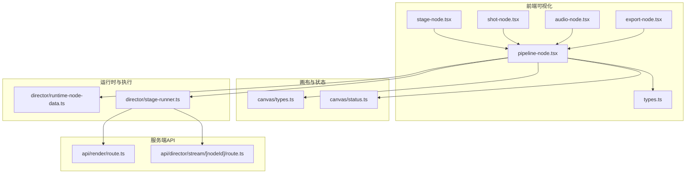

**图表来源** 
- [src/components/ui/node/stage-node.tsx](file://src/components/ui/node/stage-node.tsx)
- [src/components/ui/node/shot-node.tsx](file://src/components/ui/node/shot-node.tsx)
- [src/components/ui/node/audio-node.tsx](file://src/components/ui/node/audio-node.tsx)
- [src/components/ui/node/export-node.tsx](file://src/components/ui/node/export-node.tsx)
- [src/components/ui/node/types.ts](file://src/components/ui/node/types.ts)
- [src/components/ui/pipeline-node.tsx](file://src/components/ui/pipeline-node.tsx)
- [src/features/canvas/types.ts](file://src/features/canvas/types.ts)
- [src/features/canvas/status.ts](file://src/features/canvas/status.ts)
- [src/features/director/runtime-node-data.ts](file://src/features/director/runtime-node-data.ts)
- [src/features/director/stage-runner.ts](file://src/features/director/stage-runner.ts)
- [src/app/api/render/route.ts](file://src/app/api/render/route.ts)
- [src/app/api/director/stream/[nodeId]/route.ts](file://src/app/api/director/stream/[nodeId]/route.ts)

**章节来源**
- [src/components/ui/node/stage-node.tsx](file://src/components/ui/node/stage-node.tsx)
- [src/components/ui/node/shot-node.tsx](file://src/components/ui/node/shot-node.tsx)
- [src/components/ui/node/audio-node.tsx](file://src/components/ui/node/audio-node.tsx)
- [src/components/ui/node/export-node.tsx](file://src/components/ui/node/export-node.tsx)
- [src/components/ui/node/types.ts](file://src/components/ui/node/types.ts)
- [src/components/ui/pipeline-node.tsx](file://src/components/ui/pipeline-node.tsx)
- [src/features/canvas/types.ts](file://src/features/canvas/types.ts)
- [src/features/canvas/status.ts](file://src/features/canvas/status.ts)
- [src/features/director/runtime-node-data.ts](file://src/features/director/runtime-node-data.ts)
- [src/features/director/stage-runner.ts](file://src/features/director/stage-runner.ts)
- [src/app/api/render/route.ts](file://src/app/api/render/route.ts)
- [src/app/api/director/stream/[nodeId]/route.ts](file://src/app/api/director/stream/[nodeId]/route.ts)

## 核心组件
- StageNode：表示流程中的“阶段”节点，通常用于编排任务或子流程的执行入口。具备阶段标识、输入参数、执行状态与结果展示区域。
- ShotNode：表示“镜头”节点，承载与镜头相关的媒体与元数据，支持预览、时间轴定位与关键帧信息展示。
- AudioNode：表示“音频”节点，管理音频片段、时长测量、字幕与混音配置，支持播放控制与波形可视化。
- ExportNode：表示“导出”节点，负责将多路媒体资源合成输出，支持格式选择、质量设置与导出队列状态。
- PipelineNode：通用管道节点容器，统一渲染节点外壳、端口连接点、拖拽与选中交互、状态徽章与工具提示。

这些组件通过统一的类型系统与状态机协作，确保节点在画布上的行为一致且可组合。

**章节来源**
- [src/components/ui/node/stage-node.tsx](file://src/components/ui/node/stage-node.tsx)
- [src/components/ui/node/shot-node.tsx](file://src/components/ui/node/shot-node.tsx)
- [src/components/ui/node/audio-node.tsx](file://src/components/ui/node/audio-node.tsx)
- [src/components/ui/node/export-node.tsx](file://src/components/ui/node/export-node.tsx)
- [src/components/ui/pipeline-node.tsx](file://src/components/ui/pipeline-node.tsx)

## 架构总览
节点系统的整体架构分为四层：
- 可视化层：各节点组件与通用容器，负责用户交互与视觉反馈。
- 类型与状态层：定义节点类型、属性契约、状态机与画布查询。
- 运行时层：维护节点运行时的数据模型、阶段执行与结果提交。
- 服务层：提供渲染与流式输出，驱动节点执行并回传进度与结果。

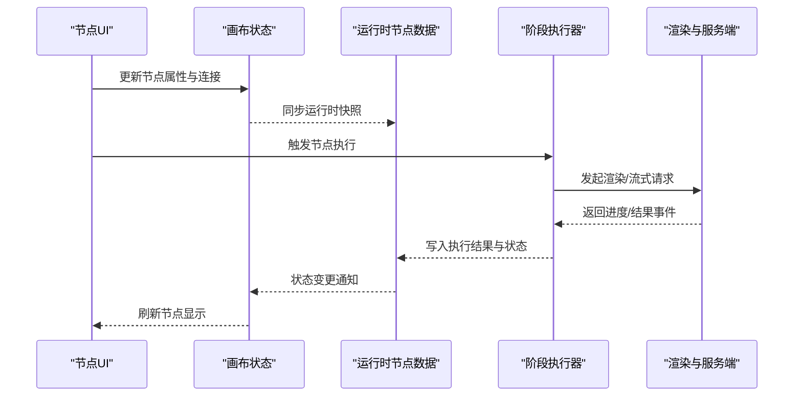

**图表来源** 
- [src/components/ui/pipeline-node.tsx](file://src/components/ui/pipeline-node.tsx)
- [src/features/canvas/types.ts](file://src/features/canvas/types.ts)
- [src/features/director/runtime-node-data.ts](file://src/features/director/runtime-node-data.ts)
- [src/features/director/stage-runner.ts](file://src/features/director/stage-runner.ts)
- [src/app/api/render/route.ts](file://src/app/api/render/route.ts)
- [src/app/api/director/stream/[nodeId]/route.ts](file://src/app/api/director/stream/[nodeId]/route.ts)

## 详细组件分析

### StageNode（阶段节点）
- 特性与用途：作为流程编排的入口，支持阶段参数配置、依赖检查与批量执行。
- 属性管理：阶段标识、输入参数、执行模式（串行/并行）、重试策略与超时设置。
- 连接关系：入端口接收上游阶段输出，出端口传递阶段结果给下游节点。
- 渲染逻辑：显示阶段名称、状态徽章（待执行/运行中/成功/失败）、错误摘要与日志入口。
- 交互效果：点击展开详情、拖拽调整顺序、右键菜单操作（复制/删除/重命名）。

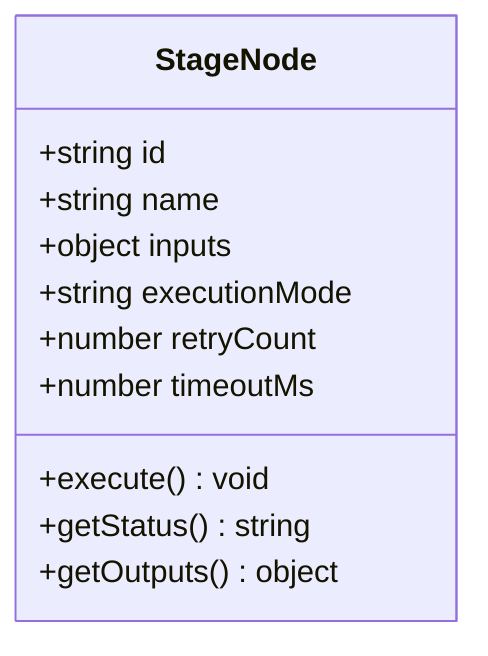

**图表来源** 
- [src/components/ui/node/stage-node.tsx](file://src/components/ui/node/stage-node.tsx)
- [src/features/canvas/types.ts](file://src/features/canvas/types.ts)
- [src/features/director/runtime-node-data.ts](file://src/features/director/runtime-node-data.ts)

**章节来源**
- [src/components/ui/node/stage-node.tsx](file://src/components/ui/node/stage-node.tsx)
- [src/features/canvas/types.ts](file://src/features/canvas/types.ts)
- [src/features/director/runtime-node-data.ts](file://src/features/director/runtime-node-data.ts)

### ShotNode（镜头节点）
- 特性与用途：管理镜头级媒体与元数据，支持预览、时间轴定位与关键帧标注。
- 属性管理：镜头ID、素材路径、时长、分辨率、关键帧列表与注释。
- 连接关系：入端口接收上游生成的素材，出端口输出剪辑后的片段。
- 渲染逻辑：缩略图预览、播放控件、时间轴滑块、关键帧标记与备注面板。
- 交互效果：双击进入编辑、拖拽调整位置、滚轮缩放时间轴。

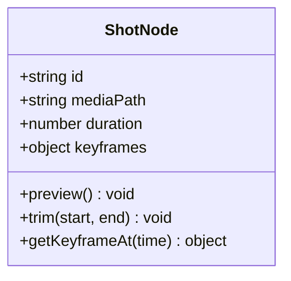

**图表来源** 
- [src/components/ui/node/shot-node.tsx](file://src/components/ui/node/shot-node.tsx)
- [src/features/canvas/types.ts](file://src/features/canvas/types.ts)

**章节来源**
- [src/components/ui/node/shot-node.tsx](file://src/components/ui/node/shot-node.tsx)
- [src/features/canvas/types.ts](file://src/features/canvas/types.ts)

### AudioNode（音频节点）
- 特性与用途：管理音频片段、时长测量、字幕与混音配置，支持播放控制与波形可视化。
- 属性管理：音频路径、采样率、声道数、音量增益、字幕轨道与特效参数。
- 连接关系：入端口接收原始音频，出端口输出处理后的音频与字幕。
- 渲染逻辑：波形图、播放/暂停按钮、音量滑块、字幕编辑器与效果面板。
- 交互效果：拖拽裁剪、右键添加效果、快捷键切换静音。

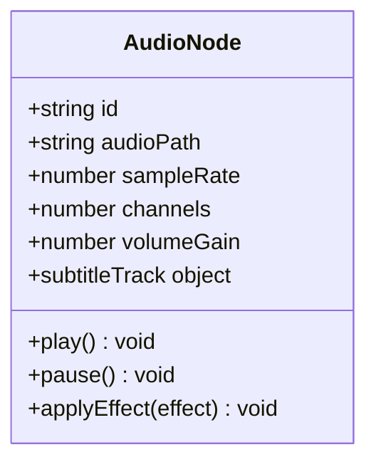

**图表来源** 
- [src/components/ui/node/audio-node.tsx](file://src/components/ui/node/audio-node.tsx)
- [src/features/canvas/types.ts](file://src/features/canvas/types.ts)

**章节来源**
- [src/components/ui/node/audio-node.tsx](file://src/components/ui/node/audio-node.tsx)
- [src/features/canvas/types.ts](file://src/features/canvas/types.ts)

### ExportNode（导出节点）
- 特性与用途：将多路媒体资源合成输出，支持格式选择、质量设置与导出队列状态。
- 属性管理：输出格式、分辨率、码率、封面生成、水印与压缩选项。
- 连接关系：入端口接收所有需要合成的素材，出端口输出最终文件路径与元数据。
- 渲染逻辑：进度条、队列位置、错误提示与下载入口。
- 交互效果：取消导出、调整优先级、查看导出日志。

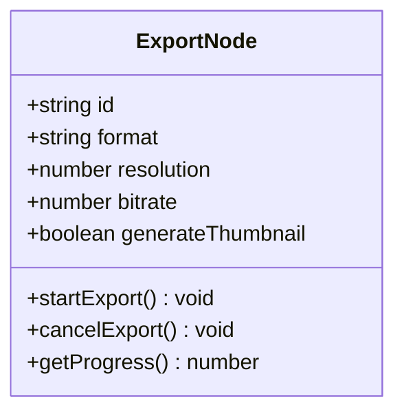

**图表来源** 
- [src/components/ui/node/export-node.tsx](file://src/components/ui/node/export-node.tsx)
- [src/features/canvas/types.ts](file://src/features/canvas/types.ts)

**章节来源**
- [src/components/ui/node/export-node.tsx](file://src/components/ui/node/export-node.tsx)
- [src/features/canvas/types.ts](file://src/features/canvas/types.ts)

### PipelineNode（通用管道节点容器）
- 职责：统一渲染节点外壳、端口连接点、拖拽与选中交互、状态徽章与工具提示。
- 属性管理：节点ID、类型、可见性、层级、锚点坐标与连接拓扑。
- 交互效果：多选、对齐、分组、撤销/重做、快捷键操作。
- 状态指示：根据节点状态动态显示颜色边框、旋转图标与错误弹窗。

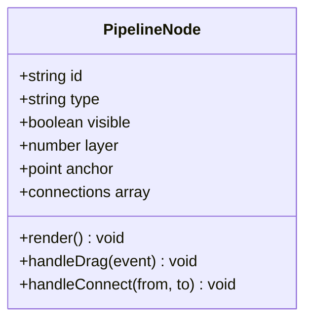

**图表来源** 
- [src/components/ui/pipeline-node.tsx](file://src/components/ui/pipeline-node.tsx)
- [src/components/ui/node/types.ts](file://src/components/ui/node/types.ts)

**章节来源**
- [src/components/ui/pipeline-node.tsx](file://src/components/ui/pipeline-node.tsx)
- [src/components/ui/node/types.ts](file://src/components/ui/node/types.ts)

### 属性管理系统
- 属性定义：每个节点类型在类型系统中声明属性键、数据类型、是否必填与默认值。
- 验证规则：支持范围校验、格式校验、依赖校验与自定义校验函数。
- 默认值设置：未提供的属性自动填充默认值，确保节点初始化一致性。
- 变更追踪：属性修改触发重新渲染与运行时数据同步。

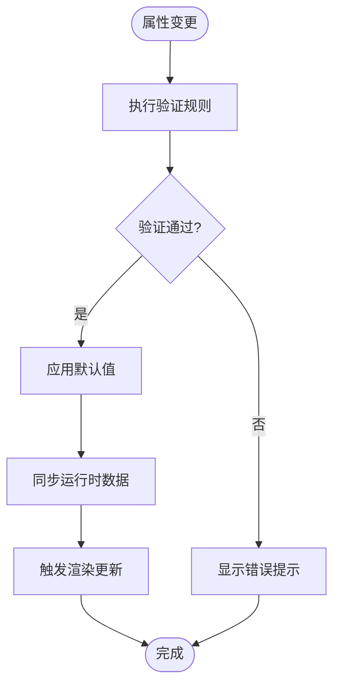

**图表来源** 
- [src/components/ui/node/types.ts](file://src/components/ui/node/types.ts)
- [src/features/canvas/types.ts](file://src/features/canvas/types.ts)

**章节来源**
- [src/components/ui/node/types.ts](file://src/components/ui/node/types.ts)
- [src/features/canvas/types.ts](file://src/features/canvas/types.ts)

### 连接关系与数据流转机制
- 连接拓扑：节点间通过入/出端口建立有向边，形成 DAG（有向无环图）。
- 数据契约：每个端口定义数据类型与可选性，确保上下游数据兼容。
- 流转策略：支持同步传递与异步流式传输，避免阻塞主线程。
- 错误传播：上游失败时，下游节点标记为不可用并提示修复建议。

**图表来源** 
- [src/components/ui/node/stage-node.tsx](file://src/components/ui/node/stage-node.tsx)
- [src/components/ui/node/shot-node.tsx](file://src/components/ui/node/shot-node.tsx)
- [src/components/ui/node/audio-node.tsx](file://src/components/ui/node/audio-node.tsx)
- [src/components/ui/node/export-node.tsx](file://src/components/ui/node/export-node.tsx)

**章节来源**
- [src/components/ui/node/stage-node.tsx](file://src/components/ui/node/stage-node.tsx)
- [src/components/ui/node/shot-node.tsx](file://src/components/ui/node/shot-node.tsx)
- [src/components/ui/node/audio-node.tsx](file://src/components/ui/node/audio-node.tsx)
- [src/components/ui/node/export-node.tsx](file://src/components/ui/node/export-node.tsx)

### 渲染逻辑与状态指示
- 视觉表现：节点背景色、边框样式、图标与缩略图根据类型与状态动态变化。
- 交互效果：悬停高亮、点击选中、拖拽移动、右键菜单与快捷键。
- 状态指示：待执行（灰色）、运行中（蓝色旋转）、成功（绿色对勾）、失败（红色叉号）。
- 错误提示：弹出错误详情、链接到日志与修复指南。

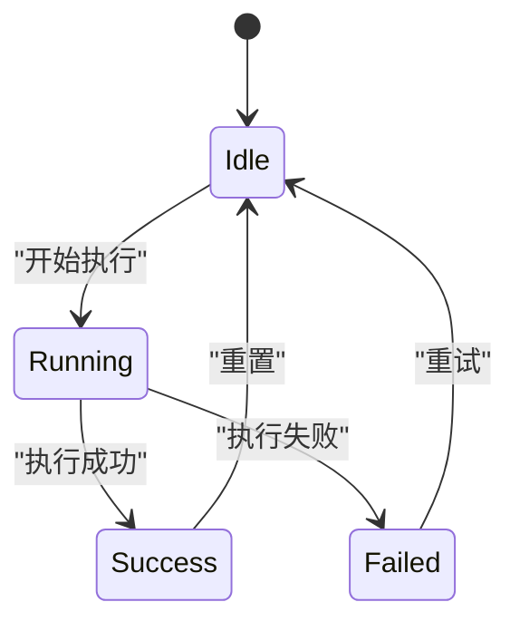

**图表来源** 
- [src/features/canvas/status.ts](file://src/features/canvas/status.ts)
- [src/components/ui/pipeline-node.tsx](file://src/components/ui/pipeline-node.tsx)

**章节来源**
- [src/features/canvas/status.ts](file://src/features/canvas/status.ts)
- [src/components/ui/pipeline-node.tsx](file://src/components/ui/pipeline-node.tsx)

### 自定义节点开发指南
- 接口规范：实现节点类型、属性定义、验证规则与渲染方法。
- 生命周期管理：初始化、挂载、更新、卸载与错误恢复钩子。
- 事件处理：订阅画布事件（如连接变更、属性修改）、派发业务事件（如执行完成）。
- 最佳实践：保持组件轻量、避免副作用、使用受控属性、提供测试用例。

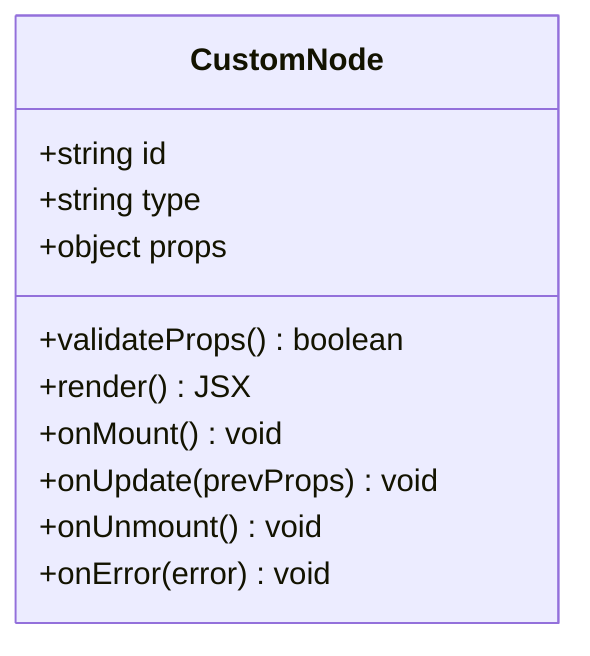

**图表来源** 
- [src/components/ui/node/types.ts](file://src/components/ui/node/types.ts)
- [src/components/ui/pipeline-node.tsx](file://src/components/ui/pipeline-node.tsx)

**章节来源**
- [src/components/ui/node/types.ts](file://src/components/ui/node/types.ts)
- [src/components/ui/pipeline-node.tsx](file://src/components/ui/pipeline-node.tsx)

## 依赖关系分析
节点系统内部依赖清晰，外部集成点明确：
- 组件依赖类型系统与状态机，确保行为一致。
- 运行时依赖执行器与仓库，保证数据持久化与执行可靠性。
- 服务端依赖渲染与流式输出，提供高性能处理能力。

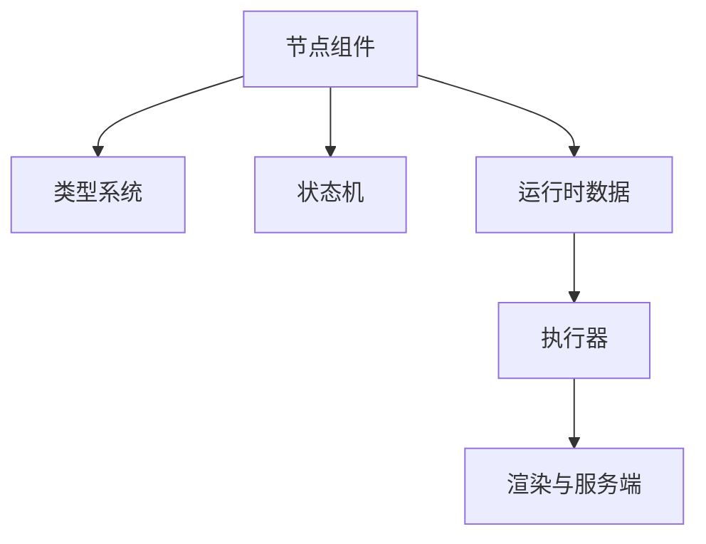

**图表来源** 
- [src/components/ui/node/types.ts](file://src/components/ui/node/types.ts)
- [src/features/canvas/status.ts](file://src/features/canvas/status.ts)
- [src/features/director/runtime-node-data.ts](file://src/features/director/runtime-node-data.ts)
- [src/features/director/stage-runner.ts](file://src/features/director/stage-runner.ts)
- [src/app/api/render/route.ts](file://src/app/api/render/route.ts)

**章节来源**
- [src/components/ui/node/types.ts](file://src/components/ui/node/types.ts)
- [src/features/canvas/status.ts](file://src/features/canvas/status.ts)
- [src/features/director/runtime-node-data.ts](file://src/features/director/runtime-node-data.ts)
- [src/features/director/stage-runner.ts](file://src/features/director/stage-runner.ts)
- [src/app/api/render/route.ts](file://src/app/api/render/route.ts)

## 性能考量
- 渲染优化：虚拟滚动大画布、按需加载节点内容、合并状态更新。
- 数据传输：使用流式响应减少等待时间、增量更新避免全量刷新。
- 内存管理：及时释放媒体资源、清理事件监听器、避免闭包泄漏。
- 并发控制：限制并行执行节点数量、排队长任务、避免阻塞主线程。

[本节为通用指导，无需特定文件引用]

## 故障排查指南
- 常见错误：属性验证失败、连接类型不匹配、执行超时、资源加载失败。
- 调试技巧：启用详细日志、检查网络请求、查看节点状态与错误堆栈。
- 恢复策略：重试机制、降级方案、数据回滚与备份恢复。

**章节来源**
- [src/features/canvas/status.ts](file://src/features/canvas/status.ts)
- [src/features/director/stage-runner.ts](file://src/features/director/stage-runner.ts)

## 结论
节点系统通过清晰的类型定义、健壮的状态机与高效的执行器，实现了可视化工作流的灵活编排与可靠执行。开发者可基于统一接口快速扩展新节点类型，满足多样化业务需求。建议遵循最佳实践，注重性能与可维护性，持续优化用户体验。

[本节为总结，无需特定文件引用]

## 附录
- 术语表：节点、端口、连接、状态机、运行时数据、执行器、渲染服务等。
- 参考链接：相关组件与类型文件的源码路径，便于深入阅读与贡献代码。

[本节为补充信息，无需特定文件引用]