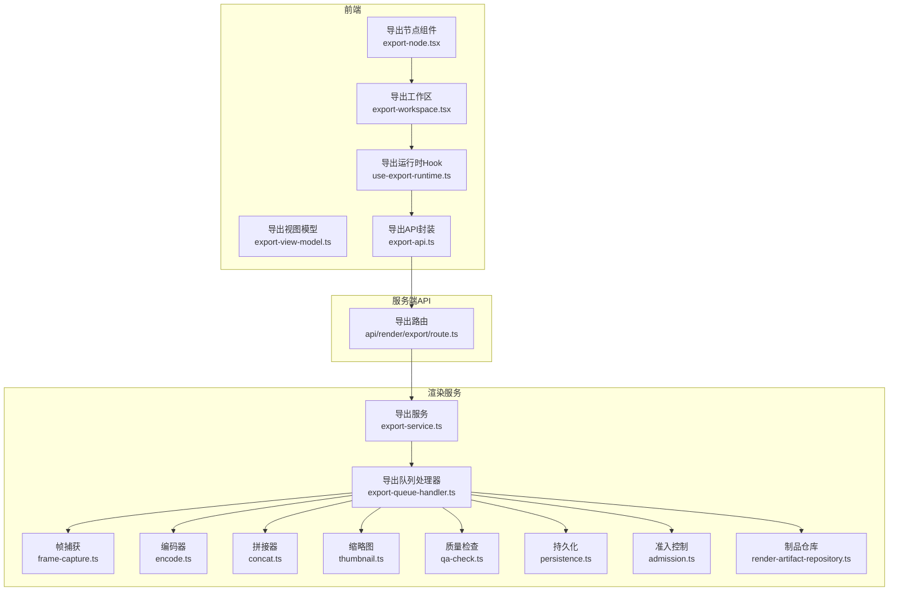
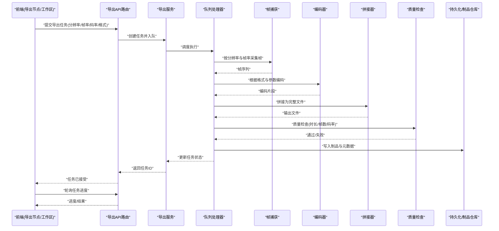
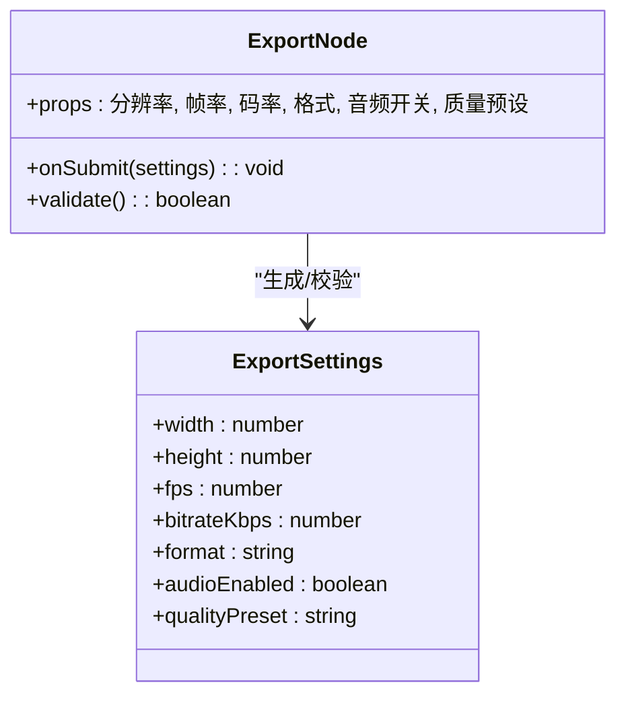
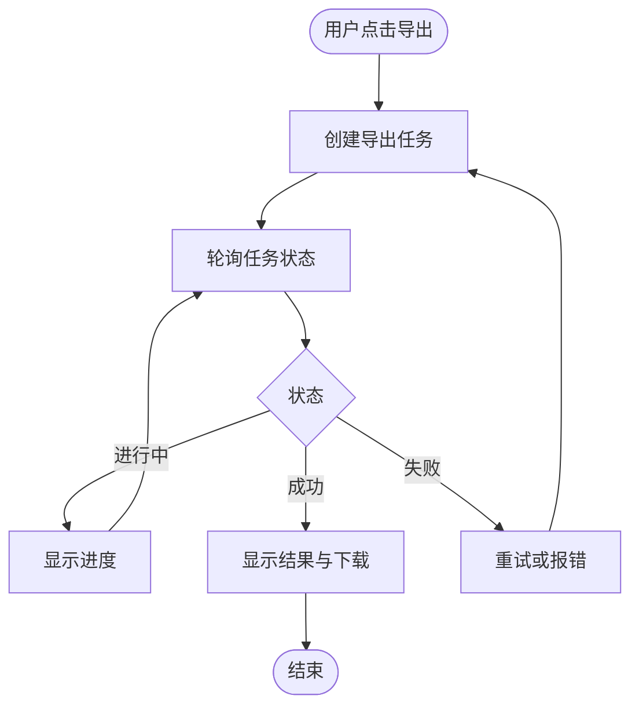
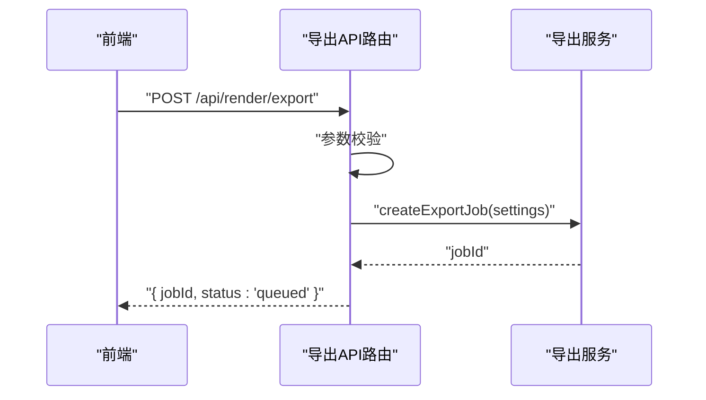
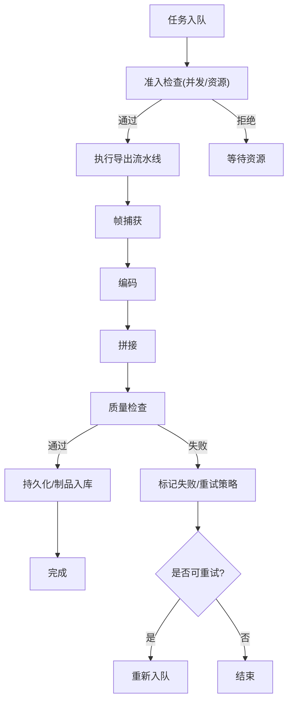
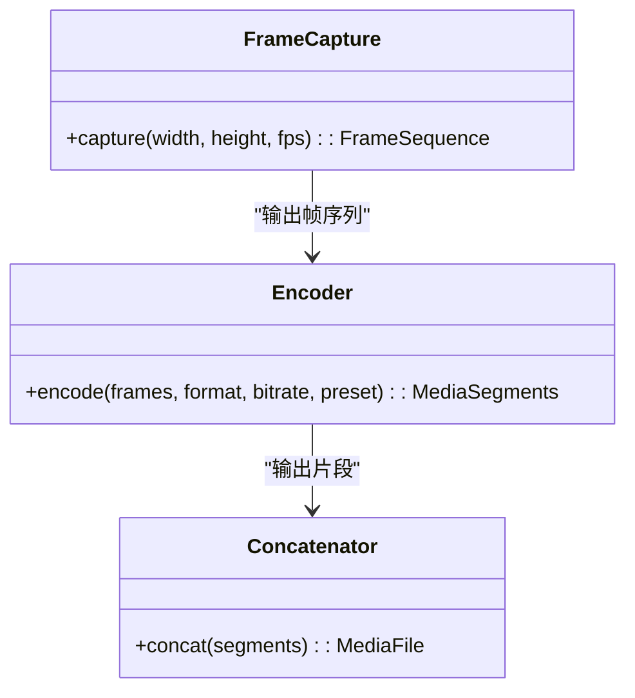
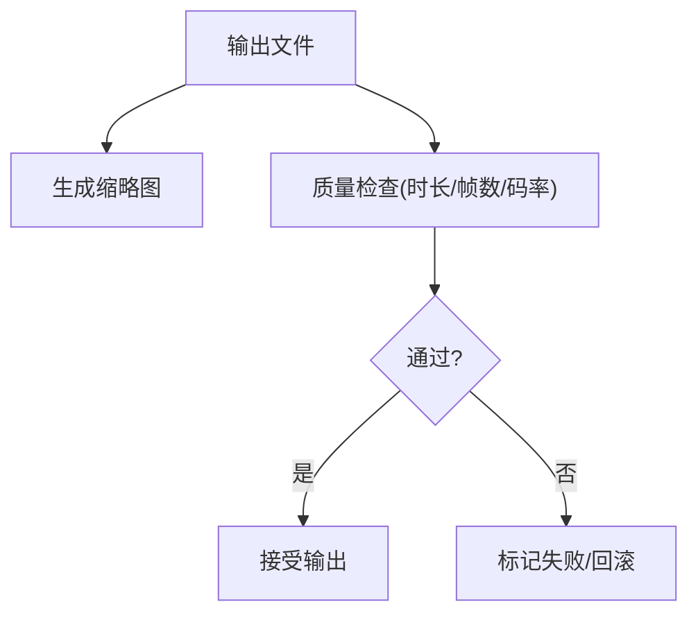
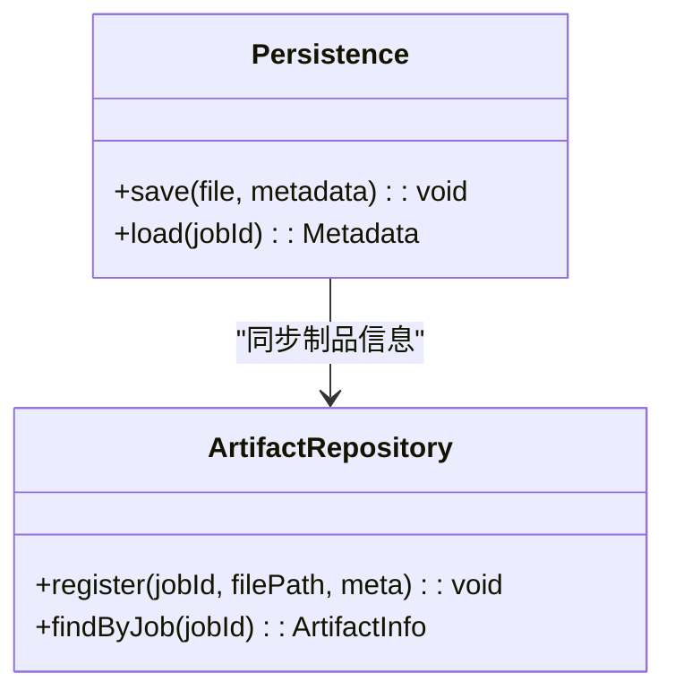
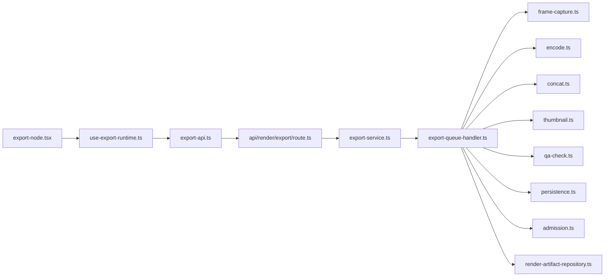

# 导出节点

<cite>
**本文引用的文件**   
- [export-node.tsx](file://src/components/ui/node/export-node.tsx)
- [export-node.demo.tsx](file://src/components/ui/node/export-node.demo.tsx)
- [export-settings.ts](file://src/features/canvas/export-settings.ts)
- [export-service.ts](file://src/features/render/export-service.ts)
- [export-queue-handler.ts](file://src/features/render/export-queue-handler.ts)
- [encode.ts](file://src/features/render/encode.ts)
- [frame-capture.ts](file://src/features/render/frame-capture.ts)
- [concat.ts](file://src/features/render/concat.ts)
- [thumbnail.ts](file://src/features/render/thumbnail.ts)
- [persistence.ts](file://src/features/render/persistence.ts)
- [types.ts](file://src/features/render/types.ts)
- [admission.ts](file://src/features/render/admission.ts)
- [qa-check.ts](file://src/features/render/qa-check.ts)
- [render-artifact-repository.ts](file://src/features/render/render-artifact-repository.ts)
- [route.ts](file://src/app/api/render/export/route.ts)
- [export-api.ts](file://src/app/products/(app)/canvas/[projectId]/export/[projectId]/export-api.ts)
- [export-view-model.ts](file://src/app/products/(app)/canvas/[projectId]/export/[projectId]/export-view-model.ts)
- [use-export-runtime.ts](file://src/app/products/(app)/canvas/[projectId]/export/[projectId]/use-export-runtime.ts)
- [export-workspace.tsx](file://src/app/products/(app)/canvas/[projectId]/export/[projectId]/export-workspace.tsx)
</cite>

## 目录
1. [简介](#简介)
2. [项目结构](#项目结构)
3. [核心组件](#核心组件)
4. [架构总览](#架构总览)
5. [详细组件分析](#详细组件分析)
6. [依赖关系分析](#依赖关系分析)
7. [性能考量](#性能考量)
8. [故障排查指南](#故障排查指南)
9. [结论](#结论)
10. [附录](#附录)

## 简介
本文件面向“导出节点”的技术实现与使用，覆盖配置选项、输出格式、渲染设置、视频编码参数、质量控制与文件大小优化、任务提交与进度跟踪、结果获取机制、批量导出、错误恢复、并发处理与资源管理等关键主题。读者可据此完成从前端配置到后端编码的全链路理解与排障。

## 项目结构
导出功能横跨前端 UI、API 路由、渲染服务、队列处理器与持久化层：
- 前端 UI：导出节点组件与演示、导出工作区与运行时 Hook、视图模型与 API 封装
- 服务端 API：导出接口路由
- 渲染服务：导出编排、帧捕获、编码、拼接、缩略图生成、质量检查、持久化
- 队列与准入：任务排队、准入控制、并发限制
- 类型定义：统一的导出相关类型契约

**图表来源** 
- [export-node.tsx](file://src/components/ui/node/export-node.tsx)
- [export-workspace.tsx](file://src/app/products/(app)/canvas/[projectId]/export/[projectId]/export-workspace.tsx)
- [use-export-runtime.ts](file://src/app/products/(app)/canvas/[projectId]/export/[projectId]/use-export-runtime.ts)
- [export-view-model.ts](file://src/app/products/(app)/canvas/[projectId]/export/[projectId]/export-view-model.ts)
- [export-api.ts](file://src/app/products/(app)/canvas/[projectId]/export/[projectId]/export-api.ts)
- [route.ts](file://src/app/api/render/export/route.ts)
- [export-service.ts](file://src/features/render/export-service.ts)
- [export-queue-handler.ts](file://src/features/render/export-queue-handler.ts)
- [frame-capture.ts](file://src/features/render/frame-capture.ts)
- [encode.ts](file://src/features/render/encode.ts)
- [concat.ts](file://src/features/render/concat.ts)
- [thumbnail.ts](file://src/features/render/thumbnail.ts)
- [qa-check.ts](file://src/features/render/qa-check.ts)
- [persistence.ts](file://src/features/render/persistence.ts)
- [admission.ts](file://src/features/render/admission.ts)
- [render-artifact-repository.ts](file://src/features/render/render-artifact-repository.ts)

**章节来源**
- [export-node.tsx](file://src/components/ui/node/export-node.tsx)
- [export-workspace.tsx](file://src/app/products/(app)/canvas/[projectId]/export/[projectId]/export-workspace.tsx)
- [use-export-runtime.ts](file://src/app/products/(app)/canvas/[projectId]/export/[projectId]/use-export-runtime.ts)
- [export-view-model.ts](file://src/app/products/(app)/canvas/[projectId]/export/[projectId]/export-view-model.ts)
- [export-api.ts](file://src/app/products/(app)/canvas/[projectId]/export/[projectId]/export-api.ts)
- [route.ts](file://src/app/api/render/export/route.ts)
- [export-service.ts](file://src/features/render/export-service.ts)
- [export-queue-handler.ts](file://src/features/render/export-queue-handler.ts)
- [frame-capture.ts](file://src/features/render/frame-capture.ts)
- [encode.ts](file://src/features/render/encode.ts)
- [concat.ts](file://src/features/render/concat.ts)
- [thumbnail.ts](file://src/features/render/thumbnail.ts)
- [qa-check.ts](file://src/features/render/qa-check.ts)
- [persistence.ts](file://src/features/render/persistence.ts)
- [admission.ts](file://src/features/render/admission.ts)
- [render-artifact-repository.ts](file://src/features/render/render-artifact-repository.ts)

## 核心组件
- 导出节点组件：提供可视化配置入口（分辨率、帧率、码率、容器格式等），并触发导出任务
- 导出工作区：集中展示导出任务列表、状态与操作
- 导出运行时 Hook：封装任务生命周期（创建、轮询、取消、重试）
- 导出视图模型：将后端状态映射为前端展示数据
- 导出 API：统一调用服务端导出接口
- 导出服务：编排帧捕获、编码、拼接、缩略图、质量检查与持久化
- 导出队列处理器：负责任务调度、并发控制、失败重试与结果落盘
- 编码器：根据配置选择容器与编码参数（MP4/WebM 等）
- 帧捕获：按分辨率与帧率采集画面序列
- 拼接器：将帧序列合并为完整媒体文件
- 缩略图：生成预览图
- 质量检查：对输出进行基础校验（时长、帧数、码率范围等）
- 准入控制：限制并发与资源占用
- 制品仓库：读写导出产物元数据与路径

**章节来源**
- [export-node.tsx](file://src/components/ui/node/export-node.tsx)
- [export-workspace.tsx](file://src/app/products/(app)/canvas/[projectId]/export/[projectId]/export-workspace.tsx)
- [use-export-runtime.ts](file://src/app/products/(app)/canvas/[projectId]/export/[projectId]/use-export-runtime.ts)
- [export-view-model.ts](file://src/app/products/(app)/canvas/[projectId]/export/[projectId]/export-view-model.ts)
- [export-api.ts](file://src/app/products/(app)/canvas/[projectId]/export/[projectId]/export-api.ts)
- [export-service.ts](file://src/features/render/export-service.ts)
- [export-queue-handler.ts](file://src/features/render/export-queue-handler.ts)
- [encode.ts](file://src/features/render/encode.ts)
- [frame-capture.ts](file://src/features/render/frame-capture.ts)
- [concat.ts](file://src/features/render/concat.ts)
- [thumbnail.ts](file://src/features/render/thumbnail.ts)
- [qa-check.ts](file://src/features/render/qa-check.ts)
- [admission.ts](file://src/features/render/admission.ts)
- [render-artifact-repository.ts](file://src/features/render/render-artifact-repository.ts)

## 架构总览
导出流程采用“前端配置 → API 路由 → 渲染服务 → 队列处理器 → 编码管线 → 持久化”的分层架构，支持多格式输出与并发控制。

**图表来源** 
- [route.ts](file://src/app/api/render/export/route.ts)
- [export-service.ts](file://src/features/render/export-service.ts)
- [export-queue-handler.ts](file://src/features/render/export-queue-handler.ts)
- [frame-capture.ts](file://src/features/render/frame-capture.ts)
- [encode.ts](file://src/features/render/encode.ts)
- [concat.ts](file://src/features/render/concat.ts)
- [qa-check.ts](file://src/features/render/qa-check.ts)
- [persistence.ts](file://src/features/render/persistence.ts)
- [render-artifact-repository.ts](file://src/features/render/render-artifact-repository.ts)

## 详细组件分析

### 导出节点组件与配置
- 配置项涵盖：分辨率（宽×高）、帧率（fps）、码率（kbps）、容器格式（MP4/WebM）、音频开关、质量预设、输出命名规则等
- 交互行为：校验输入、生成导出设置对象、触发任务创建
- 演示组件用于快速验证不同配置组合

**图表来源** 
- [export-node.tsx](file://src/components/ui/node/export-node.tsx)
- [export-settings.ts](file://src/features/canvas/export-settings.ts)

**章节来源**
- [export-node.tsx](file://src/components/ui/node/export-node.tsx)
- [export-node.demo.tsx](file://src/components/ui/node/export-node.demo.tsx)
- [export-settings.ts](file://src/features/canvas/export-settings.ts)

### 导出工作区与运行时
- 工作区展示任务列表、状态、进度条、下载链接与重试按钮
- 运行时 Hook 封装了任务创建、轮询、取消、重试与错误提示
- 视图模型将后端状态转换为前端友好的数据结构

**图表来源** 
- [export-workspace.tsx](file://src/app/products/(app)/canvas/[projectId]/export/[projectId]/export-workspace.tsx)
- [use-export-runtime.ts](file://src/app/products/(app)/canvas/[projectId]/export/[projectId]/use-export-runtime.ts)
- [export-view-model.ts](file://src/app/products/(app)/canvas/[projectId]/export/[projectId]/export-view-model.ts)

**章节来源**
- [export-workspace.tsx](file://src/app/products/(app)/canvas/[projectId]/export/[projectId]/export-workspace.tsx)
- [use-export-runtime.ts](file://src/app/products/(app)/canvas/[projectId]/export/[projectId]/use-export-runtime.ts)
- [export-view-model.ts](file://src/app/products/(app)/canvas/[projectId]/export/[projectId]/export-view-model.ts)

### 导出 API 路由与服务
- API 路由接收前端请求，校验参数并委托导出服务
- 导出服务负责编排任务、入队、状态管理与结果聚合

**图表来源** 
- [route.ts](file://src/app/api/render/export/route.ts)
- [export-service.ts](file://src/features/render/export-service.ts)

**章节来源**
- [route.ts](file://src/app/api/render/export/route.ts)
- [export-service.ts](file://src/features/render/export-service.ts)

### 导出队列处理器与并发控制
- 队列处理器负责拉取任务、执行流水线、更新状态、失败重试与资源释放
- 准入控制限制并发度，避免资源耗尽

**图表来源** 
- [export-queue-handler.ts](file://src/features/render/export-queue-handler.ts)
- [admission.ts](file://src/features/render/admission.ts)

**章节来源**
- [export-queue-handler.ts](file://src/features/render/export-queue-handler.ts)
- [admission.ts](file://src/features/render/admission.ts)

### 帧捕获、编码与拼接
- 帧捕获：按分辨率与帧率生成图像序列
- 编码：根据容器格式（MP4/WebM）与码率、质量预设选择编码器参数
- 拼接：将编码片段合并为最终文件

**图表来源** 
- [frame-capture.ts](file://src/features/render/frame-capture.ts)
- [encode.ts](file://src/features/render/encode.ts)
- [concat.ts](file://src/features/render/concat.ts)

**章节来源**
- [frame-capture.ts](file://src/features/render/frame-capture.ts)
- [encode.ts](file://src/features/render/encode.ts)
- [concat.ts](file://src/features/render/concat.ts)

### 缩略图与质量检查
- 缩略图：从输出文件或中间帧生成预览图
- 质量检查：校验时长、帧数、码率范围、容器兼容性等

**图表来源** 
- [thumbnail.ts](file://src/features/render/thumbnail.ts)
- [qa-check.ts](file://src/features/render/qa-check.ts)

**章节来源**
- [thumbnail.ts](file://src/features/render/thumbnail.ts)
- [qa-check.ts](file://src/features/render/qa-check.ts)

### 持久化与制品仓库
- 持久化：保存导出文件的存储路径、元数据与状态
- 制品仓库：统一管理导出产物的索引与访问信息

**图表来源** 
- [persistence.ts](file://src/features/render/persistence.ts)
- [render-artifact-repository.ts](file://src/features/render/render-artifact-repository.ts)

**章节来源**
- [persistence.ts](file://src/features/render/persistence.ts)
- [render-artifact-repository.ts](file://src/features/render/render-artifact-repository.ts)

## 依赖关系分析
- 前端依赖：导出节点与工作区依赖运行时 Hook 与视图模型；运行时 Hook 依赖导出 API
- 服务端依赖：导出 API 依赖导出服务；导出服务依赖队列处理器与各处理模块
- 外部依赖：编码器依赖系统或容器库（如 FFmpeg），帧捕获依赖渲染环境

**图表来源** 
- [export-node.tsx](file://src/components/ui/node/export-node.tsx)
- [use-export-runtime.ts](file://src/app/products/(app)/canvas/[projectId]/export/[projectId]/use-export-runtime.ts)
- [export-api.ts](file://src/app/products/(app)/canvas/[projectId]/export/[projectId]/export-api.ts)
- [route.ts](file://src/app/api/render/export/route.ts)
- [export-service.ts](file://src/features/render/export-service.ts)
- [export-queue-handler.ts](file://src/features/render/export-queue-handler.ts)
- [frame-capture.ts](file://src/features/render/frame-capture.ts)
- [encode.ts](file://src/features/render/encode.ts)
- [concat.ts](file://src/features/render/concat.ts)
- [thumbnail.ts](file://src/features/render/thumbnail.ts)
- [qa-check.ts](file://src/features/render/qa-check.ts)
- [persistence.ts](file://src/features/render/persistence.ts)
- [admission.ts](file://src/features/render/admission.ts)
- [render-artifact-repository.ts](file://src/features/render/render-artifact-repository.ts)

**章节来源**
- [export-node.tsx](file://src/components/ui/node/export-node.tsx)
- [use-export-runtime.ts](file://src/app/products/(app)/canvas/[projectId]/export/[projectId]/use-export-runtime.ts)
- [export-api.ts](file://src/app/products/(app)/canvas/[projectId]/export/[projectId]/export-api.ts)
- [route.ts](file://src/app/api/render/export/route.ts)
- [export-service.ts](file://src/features/render/export-service.ts)
- [export-queue-handler.ts](file://src/features/render/export-queue-handler.ts)
- [frame-capture.ts](file://src/features/render/frame-capture.ts)
- [encode.ts](file://src/features/render/encode.ts)
- [concat.ts](file://src/features/render/concat.ts)
- [thumbnail.ts](file://src/features/render/thumbnail.ts)
- [qa-check.ts](file://src/features/render/qa-check.ts)
- [persistence.ts](file://src/features/render/persistence.ts)
- [admission.ts](file://src/features/render/admission.ts)
- [render-artifact-repository.ts](file://src/features/render/render-artifact-repository.ts)

## 性能考量
- 并发与限流：通过准入控制限制同时执行的导出任务数量，避免 CPU/内存峰值
- 分片编码：将长视频拆分为片段并行编码，再拼接减少单任务耗时
- 缓存与复用：对相同设置的重复导出启用缓存或增量更新
- I/O 优化：使用高速存储与异步写入，减少磁盘瓶颈
- 资源回收：任务完成后及时释放临时文件与句柄
- 自适应码率：根据目标文件大小与质量预设动态调整码率

[本节为通用指导，不直接分析具体文件]

## 故障排查指南
- 常见错误
  - 参数校验失败：分辨率/帧率/码率超出范围或格式不支持
  - 编码失败：编码器不可用或参数不兼容
  - 拼接失败：片段顺序错误或元数据不一致
  - 质量检查失败：时长/帧数/码率异常
  - 持久化失败：权限不足或存储空间不足
- 定位方法
  - 查看任务状态与日志（进行中/失败/重试次数）
  - 检查队列处理器与准入控制日志
  - 核对导出设置与支持的格式/参数
  - 确认存储路径与权限
- 恢复策略
  - 自动重试：针对瞬时错误（I/O 抖动、网络超时）
  - 人工干预：修改参数后重新提交
  - 回滚清理：失败时删除半成品与临时文件

**章节来源**
- [export-queue-handler.ts](file://src/features/render/export-queue-handler.ts)
- [admission.ts](file://src/features/render/admission.ts)
- [qa-check.ts](file://src/features/render/qa-check.ts)
- [persistence.ts](file://src/features/render/persistence.ts)

## 结论
导出节点以清晰的前端配置入口与稳健的后端流水线为核心，支持多种输出格式与灵活的渲染设置。通过队列处理器与准入控制实现并发与资源管理，结合质量检查与持久化保障输出可靠性。合理配置分辨率、帧率与码率可在质量与文件大小之间取得平衡，并通过分片编码与缓存提升性能。

[本节为总结性内容，不直接分析具体文件]

## 附录
- 常用配置示例
  - MP4 高清：分辨率 1920×1080，帧率 30fps，码率 5000 kbps，质量预设“高”
  - WebM 网页优化：分辨率 1280×720，帧率 24fps，码率 2500 kbps，质量预设“中”
- 批量导出
  - 通过工作区一次性提交多个导出任务，队列处理器按并发上限依次执行
- 结果获取
  - 通过任务 ID 轮询状态，成功后获取下载链接与缩略图

[本节为概念性说明，不直接分析具体文件]