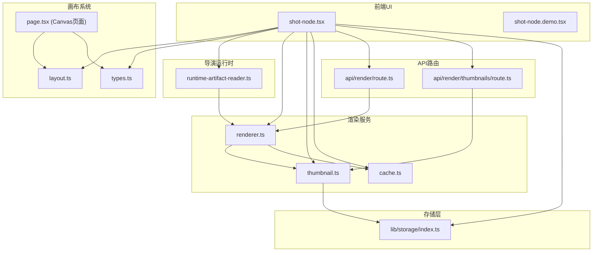
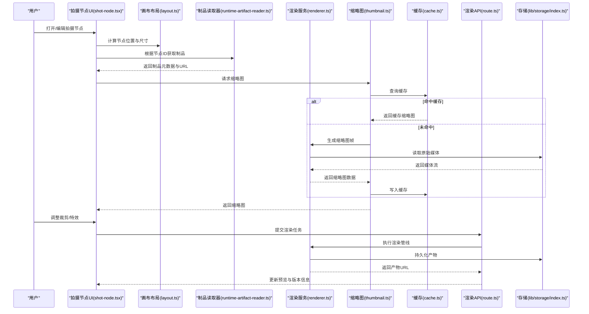
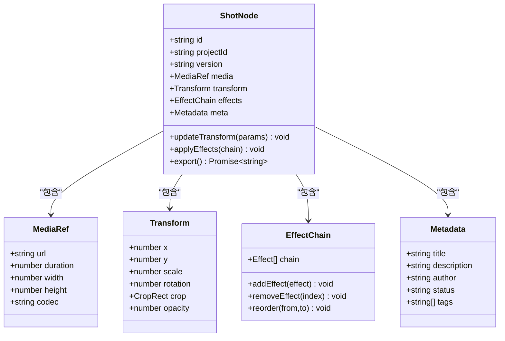
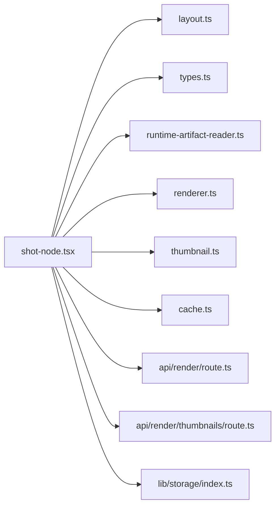

# 拍摄节点

<cite>
**本文引用的文件**   
- [src/components/ui/node/shot-node.tsx](file://src/components/ui/node/shot-node.tsx)
- [src/components/ui/node/shot-node.demo.tsx](file://src/components/ui/node/shot-node.demo.tsx)
- [src/app/products/(app)/canvas/[projectId]/page.tsx](file://src/app/products/(app)/canvas/[projectId]/page.tsx)
- [src/features/canvas/layout.ts](file://src/features/canvas/layout.ts)
- [src/features/canvas/types.ts](file://src/features/canvas/types.ts)
- [src/features/director/runtime-artifact-reader.ts](file://src/features/director/runtime-artifact-reader.ts)
- [src/features/render/thumbnail.ts](file://src/features/render/thumbnail.ts)
- [src/features/render/renderer.ts](file://src/features/render/renderer.ts)
- [src/features/render/cache.ts](file://src/features/render/cache.ts)
- [src/lib/storage/index.ts](file://src/lib/storage/index.ts)
- [src/app/api/render/route.ts](file://src/app/api/render/route.ts)
- [src/app/api/render/thumbnails/route.ts](file://src/app/api/render/thumbnails/route.ts)
</cite>

## 目录
1. [简介](#简介)
2. [项目结构](#项目结构)
3. [核心组件](#核心组件)
4. [架构总览](#架构总览)
5. [详细组件分析](#详细组件分析)
6. [依赖关系分析](#依赖关系分析)
7. [性能考虑](#性能考虑)
8. [故障排查指南](#故障排查指南)
9. [结论](#结论)
10. [附录](#附录)

## 简介
本技术文档聚焦“拍摄节点”（Shot Node）在 PurpleInk 画布系统中的设计与实现，围绕以下目标展开：
- 数据模型与元数据管理：定义拍摄节点的类型、属性、版本化字段及与制品（Artifact）的关联。
- 编辑、预览与版本控制：支持对拍摄信息进行编辑、实时预览、历史版本回溯与切换。
- 与画布布局集成：说明节点在画布中的位置计算、尺寸适配与响应式行为。
- 内容导入、裁剪与特效：涵盖媒体导入流程、裁剪参数与特效链的应用方式。
- 操作示例与批量编辑：提供常用操作流程与批量处理策略。
- 状态同步机制：前端状态与后端渲染/制品存储的一致性保障。
- 数据处理、缓存与性能优化：介绍缩略图与渲染结果的缓存策略、I/O 优化与并发控制。

## 项目结构
拍摄节点涉及前端 UI 组件、画布布局系统、导演运行时、渲染服务与存储层等模块。下图概览了关键文件与职责边界：

图表来源
- [src/components/ui/node/shot-node.tsx](file://src/components/ui/node/shot-node.tsx)
- [src/components/ui/node/shot-node.demo.tsx](file://src/components/ui/node/shot-node.demo.tsx)
- [src/features/canvas/layout.ts](file://src/features/canvas/layout.ts)
- [src/features/canvas/types.ts](file://src/features/canvas/types.ts)
- [src/app/products/(app)/canvas/[projectId]/page.tsx](file://src/app/products/(app)/canvas/[projectId]/page.tsx)
- [src/features/director/runtime-artifact-reader.ts](file://src/features/director/runtime-artifact-reader.ts)
- [src/features/render/renderer.ts](file://src/features/render/renderer.ts)
- [src/features/render/thumbnail.ts](file://src/features/render/thumbnail.ts)
- [src/features/render/cache.ts](file://src/features/render/cache.ts)
- [src/app/api/render/route.ts](file://src/app/api/render/route.ts)
- [src/app/api/render/thumbnails/route.ts](file://src/app/api/render/thumbnails/route.ts)
- [src/lib/storage/index.ts](file://src/lib/storage/index.ts)

章节来源
- [src/components/ui/node/shot-node.tsx](file://src/components/ui/node/shot-node.tsx)
- [src/features/canvas/layout.ts](file://src/features/canvas/layout.ts)
- [src/features/canvas/types.ts](file://src/features/canvas/types.ts)
- [src/app/products/(app)/canvas/[projectId]/page.tsx](file://src/app/products/(app)/canvas/[projectId]/page.tsx)

## 核心组件
- 拍摄节点 UI 组件：负责展示与交互，包括媒体预览、裁剪控件、特效开关、版本选择与导出入口。
- 画布布局系统：负责节点坐标、尺寸、对齐与自适应缩放，确保不同分辨率下的稳定显示。
- 导演运行时读取器：根据节点 ID 解析并加载对应的制品（视频/图像/音频），为预览与渲染提供数据源。
- 渲染服务与缩略图：将节点配置转换为可播放或可导出的媒体产物，生成缩略图用于快速预览。
- 缓存层：缓存缩略图与中间渲染结果，减少重复计算与 I/O 开销。
- API 路由：对外暴露渲染与缩略图接口，供前端调用。
- 存储层：统一封装本地/云端存储访问，保证制品与缓存的一致性与持久化。

章节来源
- [src/components/ui/node/shot-node.tsx](file://src/components/ui/node/shot-node.tsx)
- [src/features/director/runtime-artifact-reader.ts](file://src/features/director/runtime-artifact-reader.ts)
- [src/features/render/renderer.ts](file://src/features/render/renderer.ts)
- [src/features/render/thumbnail.ts](file://src/features/render/thumbnail.ts)
- [src/features/render/cache.ts](file://src/features/render/cache.ts)
- [src/app/api/render/route.ts](file://src/app/api/render/route.ts)
- [src/app/api/render/thumbnails/route.ts](file://src/app/api/render/thumbnails/route.ts)
- [src/lib/storage/index.ts](file://src/lib/storage/index.ts)

## 架构总览
下图展示了从用户操作到最终渲染输出的完整链路，以及各模块之间的协作关系：

图表来源
- [src/components/ui/node/shot-node.tsx](file://src/components/ui/node/shot-node.tsx)
- [src/features/canvas/layout.ts](file://src/features/canvas/layout.ts)
- [src/features/director/runtime-artifact-reader.ts](file://src/features/director/runtime-artifact-reader.ts)
- [src/features/render/renderer.ts](file://src/features/render/renderer.ts)
- [src/features/render/thumbnail.ts](file://src/features/render/thumbnail.ts)
- [src/features/render/cache.ts](file://src/features/render/cache.ts)
- [src/app/api/render/route.ts](file://src/app/api/render/route.ts)
- [src/lib/storage/index.ts](file://src/lib/storage/index.ts)

## 详细组件分析

### 拍摄节点 UI 组件（shot-node.tsx）
- 功能要点
  - 展示媒体预览与时间轴，支持播放/暂停、进度拖拽。
  - 提供裁剪区域设置（矩形框、比例锁定）、旋转与翻转。
  - 特效面板：滤镜、转场、叠加、字幕等开关与参数调节。
  - 版本选择器：列出同一拍摄的多版本，支持切换与回滚。
  - 导出按钮：触发渲染任务并监听完成回调。
- 数据模型
  - 节点标识：唯一 ID、项目名称、版本号、创建/更新时间戳。
  - 媒体引用：源 URL、时长、分辨率、编码格式。
  - 变换参数：位置、缩放、旋转、裁剪矩形、透明度。
  - 特效链：按顺序排列的特效项及其参数。
  - 元数据：标签、描述、作者、审核状态。
- 交互流程
  - 编辑时实时更新预览；变更防抖后落库。
  - 版本切换时重新加载对应制品与元数据。
  - 导出前校验必填字段与资源可用性。

章节来源
- [src/components/ui/node/shot-node.tsx](file://src/components/ui/node/shot-node.tsx)
- [src/components/ui/node/shot-node.demo.tsx](file://src/components/ui/node/shot-node.demo.tsx)

#### 类与关系图（概念映射）

图表来源
- [src/components/ui/node/shot-node.tsx](file://src/components/ui/node/shot-node.tsx)

### 画布布局集成（layout.ts）
- 位置计算
  - 基于网格与吸附规则，计算节点在画布中的绝对坐标。
  - 支持多分辨率适配，按比例缩放并保持相对布局。
- 尺寸适配
  - 根据媒体宽高比自动填充或留白，避免拉伸变形。
  - 动态调整节点尺寸以匹配导出分辨率。
- 联动更新
  - 节点移动/缩放时，实时更新相邻节点的对齐与间距。
  - 画布缩放级别变化时，重算所有节点像素坐标。

章节来源
- [src/features/canvas/layout.ts](file://src/features/canvas/layout.ts)
- [src/features/canvas/types.ts](file://src/features/canvas/types.ts)
- [src/app/products/(app)/canvas/[projectId]/page.tsx](file://src/app/products/(app)/canvas/[projectId]/page.tsx)

### 制品读取与版本控制（runtime-artifact-reader.ts）
- 读取策略
  - 根据节点 ID 与版本号定位制品路径，优先命中缓存。
  - 若未命中则向存储层拉取并回填缓存。
- 版本管理
  - 维护版本清单与差异摘要，支持快速切换。
  - 回滚时保留旧版本元数据，便于审计与对比。

章节来源
- [src/features/director/runtime-artifact-reader.ts](file://src/features/director/runtime-artifact-reader.ts)

### 渲染与缩略图（renderer.ts, thumbnail.ts, cache.ts）
- 渲染管线
  - 输入：节点配置（变换、特效链、媒体引用）。
  - 处理：解码媒体、应用特效、合成输出。
  - 输出：视频/图像文件与元数据，持久化至存储层。
- 缩略图生成
  - 抽取关键帧或首帧，压缩为轻量图片。
  - 结合缓存键（节点ID+版本+参数哈希）去重。
- 缓存策略
  - 内存缓存热数据，磁盘缓存冷数据。
  - 过期策略与容量上限，避免占用过多空间。

章节来源
- [src/features/render/renderer.ts](file://src/features/render/renderer.ts)
- [src/features/render/thumbnail.ts](file://src/features/render/thumbnail.ts)
- [src/features/render/cache.ts](file://src/features/render/cache.ts)

### API 路由（render/route.ts, thumbnails/route.ts）
- 渲染接口
  - 接收渲染请求，校验参数，调度渲染任务。
  - 返回任务 ID 与状态轮询端点。
- 缩略图接口
  - 根据节点 ID 与版本返回缩略图 URL。
  - 支持可选参数（尺寸、质量、格式）。

章节来源
- [src/app/api/render/route.ts](file://src/app/api/render/route.ts)
- [src/app/api/render/thumbnails/route.ts](file://src/app/api/render/thumbnails/route.ts)

### 存储层（lib/storage/index.ts）
- 统一抽象
  - 封装本地文件系统与对象存储（如 S3）的读写。
  - 提供分片上传、断点续传与并发限制。
- 一致性保障
  - 写入原子性，失败回滚。
  - 元数据与内容分离，便于索引与检索。

章节来源
- [src/lib/storage/index.ts](file://src/lib/storage/index.ts)

## 依赖关系分析
拍摄节点依赖画布布局、制品读取、渲染与存储等模块，形成清晰的分层与单向依赖：

图表来源
- [src/components/ui/node/shot-node.tsx](file://src/components/ui/node/shot-node.tsx)
- [src/features/canvas/layout.ts](file://src/features/canvas/layout.ts)
- [src/features/canvas/types.ts](file://src/features/canvas/types.ts)
- [src/features/director/runtime-artifact-reader.ts](file://src/features/director/runtime-artifact-reader.ts)
- [src/features/render/renderer.ts](file://src/features/render/renderer.ts)
- [src/features/render/thumbnail.ts](file://src/features/render/thumbnail.ts)
- [src/features/render/cache.ts](file://src/features/render/cache.ts)
- [src/app/api/render/route.ts](file://src/app/api/render/route.ts)
- [src/app/api/render/thumbnails/route.ts](file://src/app/api/render/thumbnails/route.ts)
- [src/lib/storage/index.ts](file://src/lib/storage/index.ts)

章节来源
- [src/components/ui/node/shot-node.tsx](file://src/components/ui/node/shot-node.tsx)
- [src/features/canvas/layout.ts](file://src/features/canvas/layout.ts)
- [src/features/director/runtime-artifact-reader.ts](file://src/features/director/runtime-artifact-reader.ts)
- [src/features/render/renderer.ts](file://src/features/render/renderer.ts)
- [src/features/render/thumbnail.ts](file://src/features/render/thumbnail.ts)
- [src/features/render/cache.ts](file://src/features/render/cache.ts)
- [src/app/api/render/route.ts](file://src/app/api/render/route.ts)
- [src/app/api/render/thumbnails/route.ts](file://src/app/api/render/thumbnails/route.ts)
- [src/lib/storage/index.ts](file://src/lib/storage/index.ts)

## 性能考虑
- 缩略图与渲染缓存
  - 使用节点 ID、版本与参数哈希作为缓存键，避免重复计算。
  - 分层缓存：内存优先，磁盘次之，网络兜底。
- 媒体解码与合成
  - 按需解码关键帧，减少全量解码开销。
  - 并行处理独立特效链，利用多线程或 WebAssembly。
- I/O 优化
  - 分块读取大文件，降低内存峰值。
  - 预取下一镜头素材，提升切换流畅度。
- 并发与限流
  - 渲染队列限流，防止过载。
  - 缩略图生成异步化，不阻塞主线程。

[本节为通用指导，无需特定文件来源]

## 故障排查指南
- 预览空白或黑屏
  - 检查制品读取是否成功，确认 URL 可达与权限。
  - 验证解码器兼容性，必要时降级到软解。
- 缩略图不更新
  - 核对缓存键是否包含最新参数哈希。
  - 清理缓存后重试，观察是否命中新值。
- 渲染失败
  - 查看渲染日志，定位具体阶段错误（解码、特效、合成）。
  - 检查存储写入权限与配额。
- 版本切换异常
  - 确认版本清单完整性与元数据一致性。
  - 回滚时校验旧版本制品是否存在。

章节来源
- [src/features/director/runtime-artifact-reader.ts](file://src/features/director/runtime-artifact-reader.ts)
- [src/features/render/renderer.ts](file://src/features/render/renderer.ts)
- [src/features/render/thumbnail.ts](file://src/features/render/thumbnail.ts)
- [src/features/render/cache.ts](file://src/features/render/cache.ts)
- [src/lib/storage/index.ts](file://src/lib/storage/index.ts)

## 结论
拍摄节点是 PurpleInk 画布系统的核心单元，通过清晰的数据模型、完善的元数据管理与严格的版本控制，实现了高效的编辑、预览与导出能力。与画布布局的深度集成确保了稳定的位置与尺寸表现；借助制品读取、渲染与缓存体系，系统在性能与体验之间取得平衡。建议在生产环境中持续监控缓存命中率、渲染耗时与 I/O 负载，并结合业务场景优化特效链与解码策略。

[本节为总结性内容，无需特定文件来源]

## 附录
- 操作示例
  - 导入媒体：选择本地文件或粘贴 URL，系统自动解析元数据并生成缩略图。
  - 裁剪调整：拖动四角或边线设定矩形区域，锁定比例保持画面不变形。
  - 应用特效：添加滤镜或转场，实时预览效果，保存为当前版本。
  - 批量编辑：选中多个节点，统一调整裁剪或特效参数，批量导出。
- 状态同步机制
  - 前端变更通过防抖合并后提交至后端，后端持久化并广播更新。
  - 版本切换时，前端拉取最新元数据与制品 URL，确保一致显示。

[本节为补充说明，无需特定文件来源]