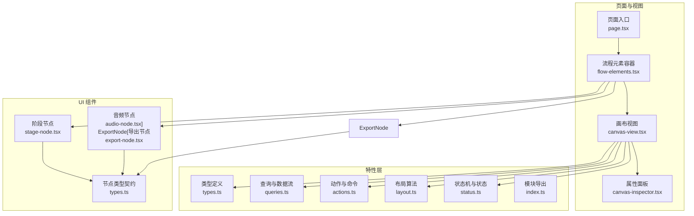
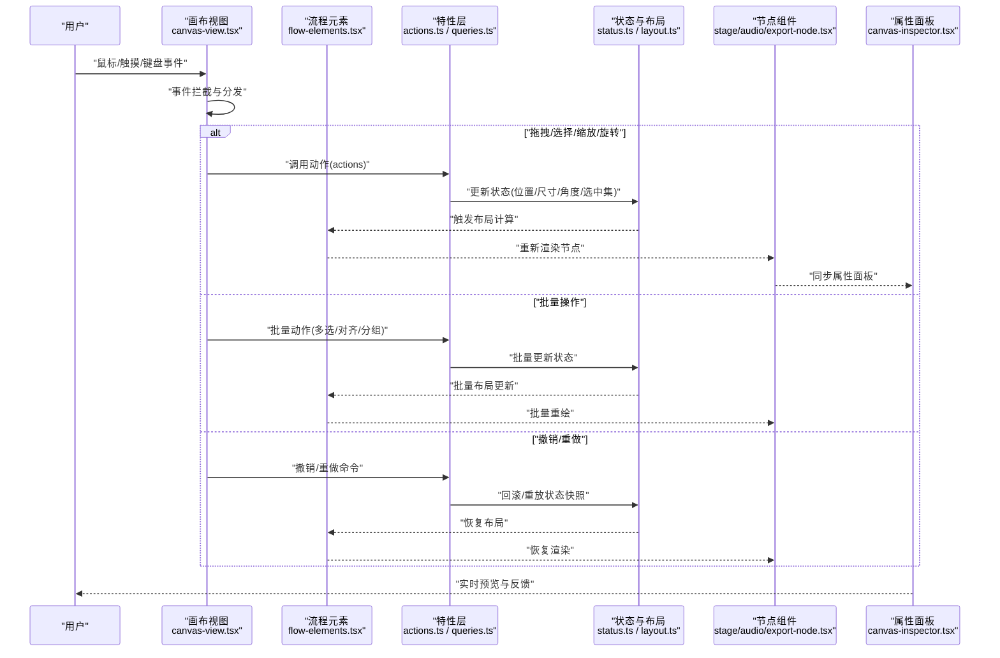
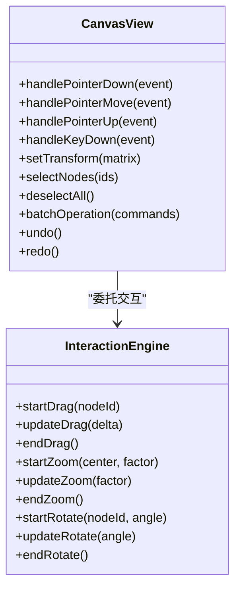
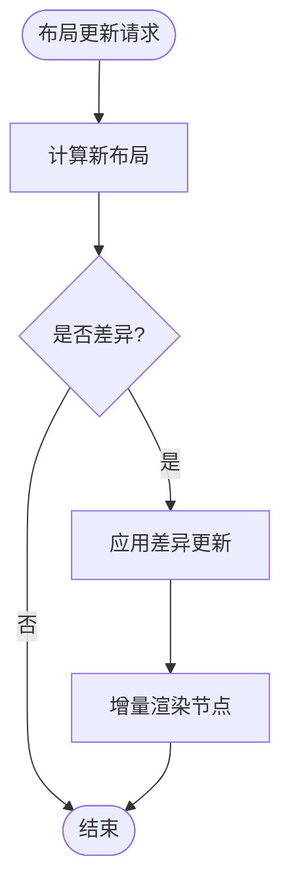
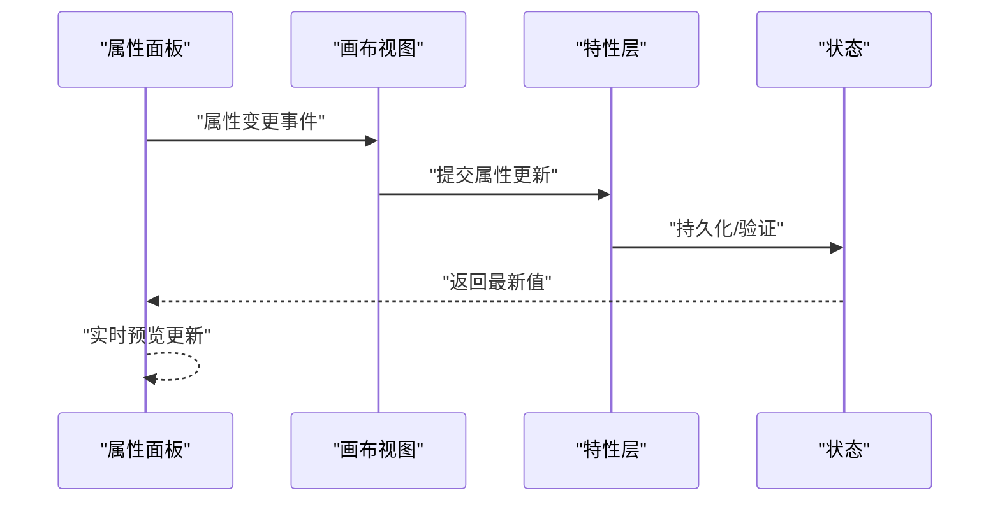
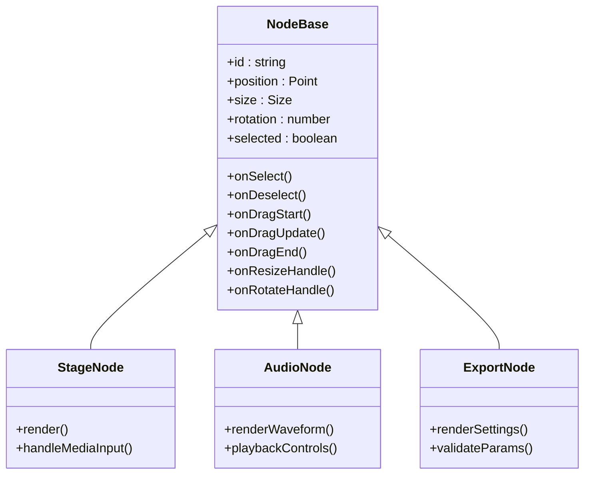
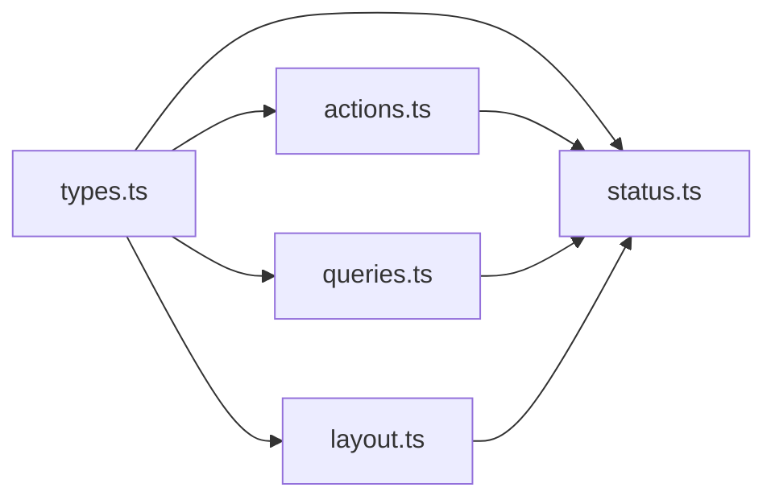
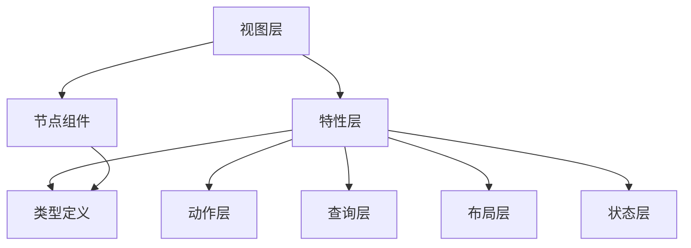

# 节点交互操作

<cite>
**本文引用的文件**   
- [src/app/products/(app)/canvas/[projectId]/page.tsx](file://src/app/products/(app)/canvas/[projectId]/page.tsx)
- [src/app/products/(app)/canvas/[projectId]/flow-elements.tsx](file://src/app/products/(app)/canvas/[projectId]/flow-elements.tsx)
- [src/app/products/(app)/canvas/[projectId]/canvas-view.tsx](file://src/app/products/(app)/canvas/[projectId]/canvas-view.tsx)
- [src/app/products/(app)/canvas/[projectId]/canvas-inspector.tsx](file://src/app/products/(app)/canvas/[projectId]/canvas-inspector.tsx)
- [src/app/products/(app)/canvas/[projectId]/canvas-action-api.ts](file://src/app/products/(app)/canvas/[projectId]/canvas-action-api.ts)
- [src/features/canvas/index.ts](file://src/features/canvas/index.ts)
- [src/features/canvas/types.ts](file://src/features/canvas/types.ts)
- [src/features/canvas/queries.ts](file://src/features/canvas/queries.ts)
- [src/features/canvas/actions.ts](file://src/features/canvas/actions.ts)
- [src/features/canvas/layout.ts](file://src/features/canvas/layout.ts)
- [src/features/canvas/status.ts](file://src/features/canvas/status.ts)
- [src/components/ui/node/stage-node.tsx](file://src/components/ui/node/stage-node.tsx)
- [src/components/ui/node/audio-node.tsx](file://src/components/ui/node/audio-node.tsx)
- [src/components/ui/node/export-node.tsx](file://src/components/ui/node/export-node.tsx)
- [src/components/ui/node/types.ts](file://src/components/ui/node/types.ts)
</cite>

## 目录
1. [简介](#简介)
2. [项目结构](#项目结构)
3. [核心组件](#核心组件)
4. [架构总览](#架构总览)
5. [详细组件分析](#详细组件分析)
6. [依赖关系分析](#依赖关系分析)
7. [性能考量](#性能考量)
8. [故障排查指南](#故障排查指南)
9. [结论](#结论)
10. [附录：API 参考与扩展](#附录api-参考与扩展)

## 简介
本技术文档聚焦于“节点交互操作”，涵盖拖拽、选择、缩放、旋转等核心交互，以及键盘快捷键、鼠标手势、触摸支持、批量操作、撤销重做、状态同步、上下文菜单、属性面板、实时预览、事件处理与自定义扩展方法。同时提供性能优化建议、用户体验设计与无障碍访问支持要点，帮助开发者快速理解并扩展画布中的节点交互能力。

## 项目结构
本项目采用按功能域组织的前端代码结构，与节点交互相关的核心位于 products/canvas 页面与 features/canvas 模块，UI 层由 components/ui/node 下的具体节点组件构成。整体分层清晰：
- 页面与视图层：负责渲染画布、节点与侧边栏（Inspector）
- 特性层（features/canvas）：封装类型、查询、动作、布局与状态管理
- UI 组件层（components/ui/node）：实现各节点类型的可视化与基础交互

**图表来源** 
- [src/app/products/(app)/canvas/[projectId]/page.tsx](file://src/app/products/(app)/canvas/[projectId]/page.tsx)
- [src/app/products/(app)/canvas/[projectId]/flow-elements.tsx](file://src/app/products/(app)/canvas/[projectId]/flow-elements.tsx)
- [src/app/products/(app)/canvas/[projectId]/canvas-view.tsx](file://src/app/products/(app)/canvas/[projectId]/canvas-view.tsx)
- [src/app/products/(app)/canvas/[projectId]/canvas-inspector.tsx](file://src/app/products/(app)/canvas/[projectId]/canvas-inspector.tsx)
- [src/features/canvas/index.ts](file://src/features/canvas/index.ts)
- [src/features/canvas/types.ts](file://src/features/canvas/types.ts)
- [src/features/canvas/queries.ts](file://src/features/canvas/queries.ts)
- [src/features/canvas/actions.ts](file://src/features/canvas/actions.ts)
- [src/features/canvas/layout.ts](file://src/features/canvas/layout.ts)
- [src/features/canvas/status.ts](file://src/features/canvas/status.ts)
- [src/components/ui/node/stage-node.tsx](file://src/components/ui/node/stage-node.tsx)
- [src/components/ui/node/audio-node.tsx](file://src/components/ui/node/audio-node.tsx)
- [src/components/ui/node/export-node.tsx](file://src/components/ui/node/export-node.tsx)
- [src/components/ui/node/types.ts](file://src/components/ui/node/types.ts)

**章节来源**
- [src/app/products/(app)/canvas/[projectId]/page.tsx](file://src/app/products/(app)/canvas/[projectId]/page.tsx)
- [src/app/products/(app)/canvas/[projectId]/flow-elements.tsx](file://src/app/products/(app)/canvas/[projectId]/flow-elements.tsx)
- [src/app/products/(app)/canvas/[projectId]/canvas-view.tsx](file://src/app/products/(app)/canvas/[projectId]/canvas-view.tsx)
- [src/app/products/(app)/canvas/[projectId]/canvas-inspector.tsx](file://src/app/products/(app)/canvas/[projectId]/canvas-inspector.tsx)
- [src/features/canvas/index.ts](file://src/features/canvas/index.ts)
- [src/features/canvas/types.ts](file://src/features/canvas/types.ts)
- [src/features/canvas/queries.ts](file://src/features/canvas/queries.ts)
- [src/features/canvas/actions.ts](file://src/features/canvas/actions.ts)
- [src/features/canvas/layout.ts](file://src/features/canvas/layout.ts)
- [src/features/canvas/status.ts](file://src/features/canvas/status.ts)
- [src/components/ui/node/stage-node.tsx](file://src/components/ui/node/stage-node.tsx)
- [src/components/ui/node/audio-node.tsx](file://src/components/ui/node/audio-node.tsx)
- [src/components/ui/node/export-node.tsx](file://src/components/ui/node/export-node.tsx)
- [src/components/ui/node/types.ts](file://src/components/ui/node/types.ts)

## 核心组件
- 画布视图（Canvas View）：承载节点渲染、变换矩阵（平移/缩放/旋转）、事件分发与选中态管理
- 流程元素容器（Flow Elements）：编排节点实例的布局与连接关系，响应布局算法更新
- 属性面板（Inspector）：展示当前选中节点的属性，支持编辑与实时预览
- 节点类型（Stage/Audio/Export）：各自实现特定的交互行为与渲染逻辑
- 特性层（Features）：统一类型、查询、动作、布局与状态，确保跨组件一致性

**章节来源**
- [src/app/products/(app)/canvas/[projectId]/canvas-view.tsx](file://src/app/products/(app)/canvas/[projectId]/canvas-view.tsx)
- [src/app/products/(app)/canvas/[projectId]/flow-elements.tsx](file://src/app/products/(app)/canvas/[projectId]/flow-elements.tsx)
- [src/app/products/(app)/canvas/[projectId]/canvas-inspector.tsx](file://src/app/products/(app)/canvas/[projectId]/canvas-inspector.tsx)
- [src/components/ui/node/stage-node.tsx](file://src/components/ui/node/stage-node.tsx)
- [src/components/ui/node/audio-node.tsx](file://src/components/ui/node/audio-node.tsx)
- [src/components/ui/node/export-node.tsx](file://src/components/ui/node/export-node.tsx)
- [src/features/canvas/types.ts](file://src/features/canvas/types.ts)
- [src/features/canvas/queries.ts](file://src/features/canvas/queries.ts)
- [src/features/canvas/actions.ts](file://src/features/canvas/actions.ts)
- [src/features/canvas/layout.ts](file://src/features/canvas/layout.ts)
- [src/features/canvas/status.ts](file://src/features/canvas/status.ts)

## 架构总览
下图展示了从用户输入到状态变更与渲染更新的完整链路，包括拖拽、选择、缩放、旋转、批量操作、撤销重做与状态同步。

**图表来源** 
- [src/app/products/(app)/canvas/[projectId]/canvas-view.tsx](file://src/app/products/(app)/canvas/[projectId]/canvas-view.tsx)
- [src/app/products/(app)/canvas/[projectId]/flow-elements.tsx](file://src/app/products/(app)/canvas/[projectId]/flow-elements.tsx)
- [src/app/products/(app)/canvas/[projectId]/canvas-inspector.tsx](file://src/app/products/(app)/canvas/[projectId]/canvas-inspector.tsx)
- [src/features/canvas/actions.ts](file://src/features/canvas/actions.ts)
- [src/features/canvas/queries.ts](file://src/features/canvas/queries.ts)
- [src/features/canvas/layout.ts](file://src/features/canvas/layout.ts)
- [src/features/canvas/status.ts](file://src/features/canvas/status.ts)

## 详细组件分析

### 画布视图（Canvas View）
- 职责：接收用户输入（鼠标、触摸、键盘），维护画布变换矩阵（平移、缩放、旋转），管理节点选中集合，派发事件到对应节点或动作层
- 关键点：
  - 事件优先级：框选 > 拖拽 > 缩放 > 旋转 > 点击选择
  - 变换矩阵缓存与增量更新，避免全量重算
  - 批量选择与框选区域计算
  - 撤销/重做栈集成，记录关键状态快照

**图表来源** 
- [src/app/products/(app)/canvas/[projectId]/canvas-view.tsx](file://src/app/products/(app)/canvas/[projectId]/canvas-view.tsx)

**章节来源**
- [src/app/products/(app)/canvas/[projectId]/canvas-view.tsx](file://src/app/products/(app)/canvas/[projectId]/canvas-view.tsx)

### 流程元素（Flow Elements）
- 职责：编排节点实例，响应布局算法变化，维持节点间连接关系
- 关键点：
  - 布局算法驱动（自动排列、对齐、间距控制）
  - 节点可见性与层级管理
  - 批量布局更新与增量渲染

**图表来源** 
- [src/app/products/(app)/canvas/[projectId]/flow-elements.tsx](file://src/app/products/(app)/canvas/[projectId]/flow-elements.tsx)
- [src/features/canvas/layout.ts](file://src/features/canvas/layout.ts)

**章节来源**
- [src/app/products/(app)/canvas/[projectId]/flow-elements.tsx](file://src/app/products/(app)/canvas/[projectId]/flow-elements.tsx)
- [src/features/canvas/layout.ts](file://src/features/canvas/layout.ts)

### 属性面板（Inspector）
- 职责：显示与编辑当前选中节点的属性，支持实时预览与校验
- 关键点：
  - 属性双向绑定与防抖更新
  - 实时预览（如音频时长、导出参数）
  - 错误提示与约束校验

**图表来源** 
- [src/app/products/(app)/canvas/[projectId]/canvas-inspector.tsx](file://src/app/products/(app)/canvas/[projectId]/canvas-inspector.tsx)
- [src/features/canvas/actions.ts](file://src/features/canvas/actions.ts)
- [src/features/canvas/status.ts](file://src/features/canvas/status.ts)

**章节来源**
- [src/app/products/(app)/canvas/[projectId]/canvas-inspector.tsx](file://src/app/products/(app)/canvas/[projectId]/canvas-inspector.tsx)
- [src/features/canvas/actions.ts](file://src/features/canvas/actions.ts)
- [src/features/canvas/status.ts](file://src/features/canvas/status.ts)

### 节点类型（Stage/Audio/Export）
- 职责：实现特定节点类型的交互与渲染，如音频波形、导出配置、阶段标记
- 关键点：
  - 统一的节点接口与类型契约
  - 自定义手柄（缩放/旋转锚点）
  - 节点内部状态与外部状态同步

**图表来源** 
- [src/components/ui/node/types.ts](file://src/components/ui/node/types.ts)
- [src/components/ui/node/stage-node.tsx](file://src/components/ui/node/stage-node.tsx)
- [src/components/ui/node/audio-node.tsx](file://src/components/ui/node/audio-node.tsx)
- [src/components/ui/node/export-node.tsx](file://src/components/ui/node/export-node.tsx)

**章节来源**
- [src/components/ui/node/types.ts](file://src/components/ui/node/types.ts)
- [src/components/ui/node/stage-node.tsx](file://src/components/ui/node/stage-node.tsx)
- [src/components/ui/node/audio-node.tsx](file://src/components/ui/node/audio-node.tsx)
- [src/components/ui/node/export-node.tsx](file://src/components/ui/node/export-node.tsx)

### 特性层（Features）
- 类型（types.ts）：定义节点、连接、变换、选中集、命令等数据结构
- 查询（queries.ts）：封装数据获取与订阅，保证视图与数据一致
- 动作（actions.ts）：集中实现拖拽、选择、缩放、旋转、批量、撤销重做等命令
- 布局（layout.ts）：提供自动排列、对齐、间距、吸附等算法
- 状态（status.ts）：管理画布状态机、节点状态、错误与加载态

**图表来源** 
- [src/features/canvas/types.ts](file://src/features/canvas/types.ts)
- [src/features/canvas/actions.ts](file://src/features/canvas/actions.ts)
- [src/features/canvas/queries.ts](file://src/features/canvas/queries.ts)
- [src/features/canvas/layout.ts](file://src/features/canvas/layout.ts)
- [src/features/canvas/status.ts](file://src/features/canvas/status.ts)

**章节来源**
- [src/features/canvas/types.ts](file://src/features/canvas/types.ts)
- [src/features/canvas/actions.ts](file://src/features/canvas/actions.ts)
- [src/features/canvas/queries.ts](file://src/features/canvas/queries.ts)
- [src/features/canvas/layout.ts](file://src/features/canvas/layout.ts)
- [src/features/canvas/status.ts](file://src/features/canvas/status.ts)

## 依赖关系分析
- 松耦合：视图层通过特性层暴露的动作与查询进行交互，不直接操作状态
- 高内聚：每个节点类型自包含交互与渲染逻辑，遵循统一接口
- 可测试性：特性层与 UI 组件分离，便于单元测试与集成测试

**图表来源** 
- [src/app/products/(app)/canvas/[projectId]/canvas-view.tsx](file://src/app/products/(app)/canvas/[projectId]/canvas-view.tsx)
- [src/features/canvas/index.ts](file://src/features/canvas/index.ts)
- [src/components/ui/node/types.ts](file://src/components/ui/node/types.ts)

**章节来源**
- [src/app/products/(app)/canvas/[projectId]/canvas-view.tsx](file://src/app/products/(app)/canvas/[projectId]/canvas-view.tsx)
- [src/features/canvas/index.ts](file://src/features/canvas/index.ts)
- [src/components/ui/node/types.ts](file://src/components/ui/node/types.ts)

## 性能考量
- 增量渲染：仅更新受影响的节点与连接，避免全量重绘
- 变换矩阵缓存：对平移/缩放/旋转进行合并与缓存，减少重复计算
- 事件节流与防抖：高频事件（移动、缩放）使用节流/防抖降低开销
- 虚拟滚动与视口裁剪：仅渲染可视区域内的节点
- 批量操作合并：将多个小操作合并为一次状态更新，减少重排
- 撤销/重做快照策略：按需保存最小必要快照，避免内存膨胀

[本节为通用指导，无需引用具体文件]

## 故障排查指南
- 常见问题：
  - 拖拽卡顿：检查事件节流与增量渲染是否生效
  - 缩放异常：确认变换矩阵顺序与中心点计算
  - 旋转偏移：核对锚点与局部坐标系转换
  - 批量失败：检查命令幂等性与状态一致性
  - 撤销重做失效：验证快照结构与回滚路径
- 调试建议：
  - 启用交互日志与状态快照对比
  - 使用浏览器性能面板定位重绘热点
  - 针对边界条件编写用例（空节点、极小尺寸、负角度）

**章节来源**
- [src/features/canvas/status.ts](file://src/features/canvas/status.ts)
- [src/features/canvas/actions.ts](file://src/features/canvas/actions.ts)

## 结论
本方案通过清晰的层次划分与统一的类型契约，实现了稳定高效的节点交互能力。借助特性层的动作与状态管理，结合视图层的精细事件处理与 UI 组件的自描述性，能够支撑复杂的拖拽、选择、缩放、旋转、批量操作与撤销重做场景。未来可扩展更多节点类型与交互模式，保持架构的可扩展性与可维护性。

[本节为总结性内容，无需引用具体文件]

## 附录：API 参考与扩展

### 交互 API（概览）
- 选择与取消选择
  - selectNodes(ids): 选中指定节点集合
  - deselectAll(): 清空选中
- 拖拽
  - startDrag(nodeId): 开始拖拽
  - updateDrag(delta): 更新拖拽位移
  - endDrag(): 结束拖拽
- 缩放
  - startZoom(center, factor): 开始缩放
  - updateZoom(factor): 更新缩放比例
  - endZoom(): 结束缩放
- 旋转
  - startRotate(nodeId, angle): 开始旋转
  - updateRotate(angle): 更新旋转角度
  - endRotate(): 结束旋转
- 批量操作
  - batchOperation(commands): 执行一组命令
- 撤销/重做
  - undo(): 撤销上一步
  - redo(): 重做下一步

**章节来源**
- [src/features/canvas/actions.ts](file://src/features/canvas/actions.ts)
- [src/app/products/(app)/canvas/[projectId]/canvas-view.tsx](file://src/app/products/(app)/canvas/[projectId]/canvas-view.tsx)

### 事件处理
- 鼠标事件：pointerdown/move/up、wheel（缩放）
- 触摸事件：touchstart/move/end（多指缩放/旋转）
- 键盘事件：Ctrl/Cmd+Z（撤销）、Shift+方向键（微调）、Delete（删除）
- 自定义事件：node-selected、node-dragging、zoom-change、rotate-change

**章节来源**
- [src/app/products/(app)/canvas/[projectId]/canvas-view.tsx](file://src/app/products/(app)/canvas/[projectId]/canvas-view.tsx)

### 自定义扩展方法
- 新增节点类型：实现统一接口，注册到节点工厂
- 扩展交互手柄：在节点组件中增加缩放/旋转锚点
- 扩展布局算法：在布局层添加新的排列规则
- 扩展属性面板：为节点类型定制编辑器与校验逻辑

**章节来源**
- [src/components/ui/node/types.ts](file://src/components/ui/node/types.ts)
- [src/features/canvas/layout.ts](file://src/features/canvas/layout.ts)
- [src/app/products/(app)/canvas/[projectId]/canvas-inspector.tsx](file://src/app/products/(app)/canvas/[projectId]/canvas-inspector.tsx)

### 用户体验设计
- 即时反馈：拖拽时显示网格/吸附线，缩放时显示比例提示
- 容错设计：允许部分失败的回滚，提供明确错误提示
- 渐进式引导：首次使用时提供快捷方式提示与示例节点

[本节为通用指导，无需引用具体文件]

### 无障碍访问支持
- 键盘可达性：所有交互可通过键盘完成
- 屏幕阅读器：为节点与控件提供语义化标签与状态说明
- 对比度与焦点样式：确保高对比度与清晰焦点指示
- 替代文本：为媒体节点提供描述性文本

[本节为通用指导，无需引用具体文件]