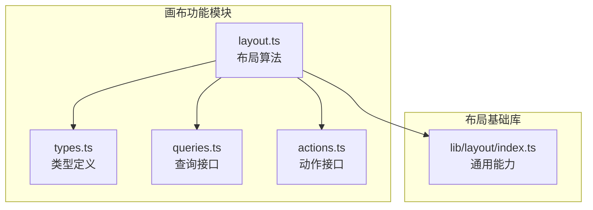
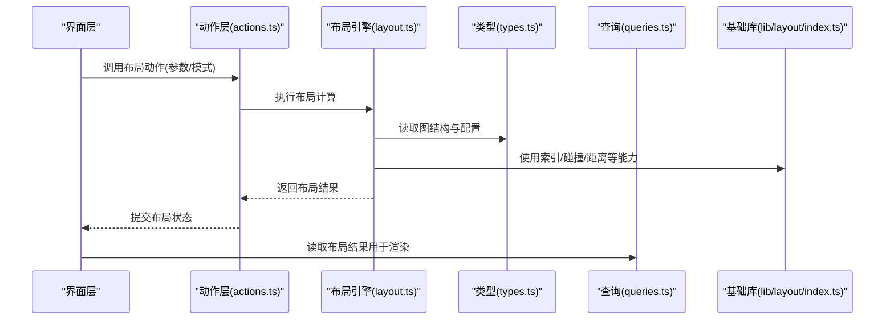
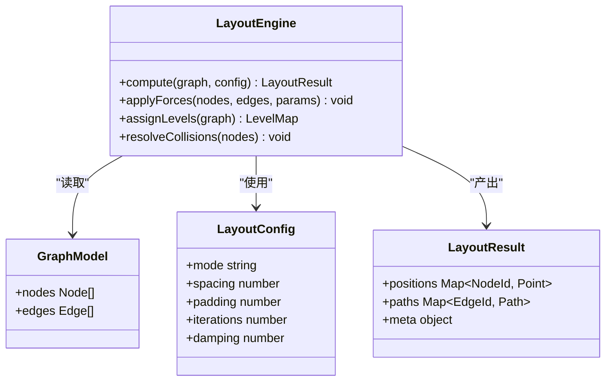
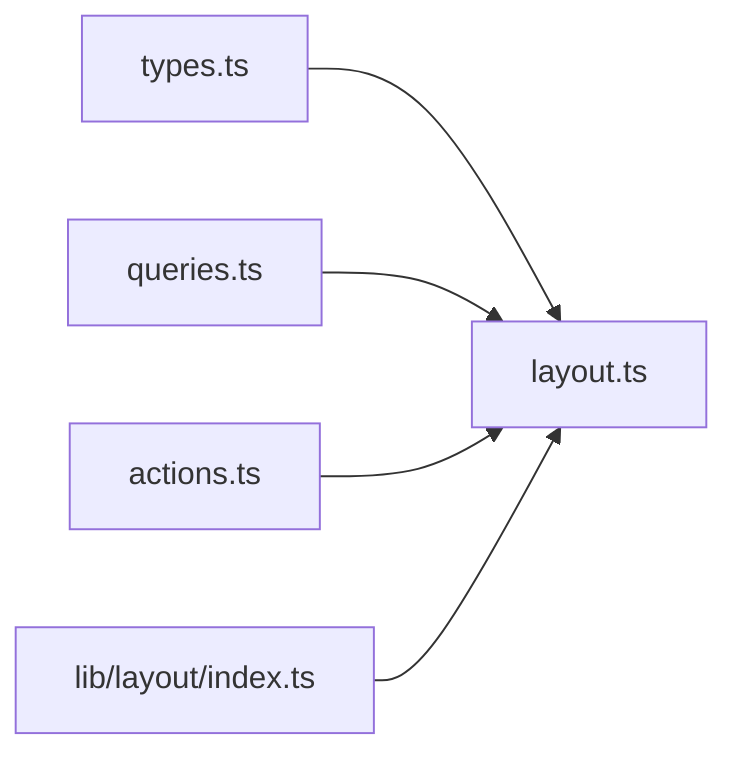

# 节点布局算法

<cite>
**本文引用的文件**   
- [src/features/canvas/layout.ts](file://src/features/canvas/layout.ts)
- [src/features/canvas/layout.test.ts](file://src/features/canvas/layout.test.ts)
- [src/features/canvas/types.ts](file://src/features/canvas/types.ts)
- [src/features/canvas/queries.ts](file://src/features/canvas/queries.ts)
- [src/features/canvas/actions.ts](file://src/features/canvas/actions.ts)
- [src/lib/layout/index.ts](file://src/lib/layout/index.ts)
</cite>

## 目录
1. [简介](#简介)
2. [项目结构](#项目结构)
3. [核心组件](#核心组件)
4. [架构总览](#架构总览)
5. [详细组件分析](#详细组件分析)
6. [依赖分析](#依赖分析)
7. [性能考虑](#性能考虑)
8. [故障排查指南](#故障排查指南)
9. [结论](#结论)
10. [附录](#附录)

## 简介
本技术文档聚焦于“节点布局算法”，覆盖自动布局、力导向布局与层次布局的实现原理，详细说明节点间距计算、连接线优化与视觉平衡策略；阐述手动调整、约束系统与智能对齐机制；并给出性能优化、增量更新与缓存策略。同时提供配置自定义选项、算法选择与调试工具建议，以及复杂工作流、响应式设计与跨平台适配的实践要点。

## 项目结构
与节点布局相关的代码主要位于 features/canvas 与 lib/layout 两个区域：
- features/canvas：包含布局算法实现、类型定义、查询与动作接口等。
- lib/layout：布局相关的基础能力与通用工具（如索引、缓存、增量更新等）。

图表来源 
- [src/features/canvas/layout.ts](file://src/features/canvas/layout.ts)
- [src/features/canvas/types.ts](file://src/features/canvas/types.ts)
- [src/features/canvas/queries.ts](file://src/features/canvas/queries.ts)
- [src/features/canvas/actions.ts](file://src/features/canvas/actions.ts)
- [src/lib/layout/index.ts](file://src/lib/layout/index.ts)

章节来源
- [src/features/canvas/layout.ts](file://src/features/canvas/layout.ts)
- [src/features/canvas/types.ts](file://src/features/canvas/types.ts)
- [src/features/canvas/queries.ts](file://src/features/canvas/queries.ts)
- [src/features/canvas/actions.ts](file://src/features/canvas/actions.ts)
- [src/lib/layout/index.ts](file://src/lib/layout/index.ts)

## 核心组件
- 布局引擎：负责根据输入图结构与配置，计算节点坐标与边路径，支持多种布局模式（自动、力导向、层次）。
- 类型系统：定义节点、边、布局配置、布局结果等数据结构，确保前后端一致性与可序列化。
- 查询层：提供对图数据与布局状态的只读访问，便于渲染与交互。
- 动作层：封装布局触发、参数变更、手动拖拽与约束应用等写操作。
- 基础库：提供空间索引、碰撞检测、距离度量、增量更新与缓存等通用能力。

章节来源
- [src/features/canvas/layout.ts](file://src/features/canvas/layout.ts)
- [src/features/canvas/types.ts](file://src/features/canvas/types.ts)
- [src/features/canvas/queries.ts](file://src/features/canvas/queries.ts)
- [src/features/canvas/actions.ts](file://src/features/canvas/actions.ts)
- [src/lib/layout/index.ts](file://src/lib/layout/index.ts)

## 架构总览
整体采用分层架构：上层通过 actions 触发布局流程，layout 引擎依据 types 定义的模型进行计算，queries 暴露只读视图供 UI 消费，lib/layout 提供底层通用能力。

图表来源 
- [src/features/canvas/actions.ts](file://src/features/canvas/actions.ts)
- [src/features/canvas/layout.ts](file://src/features/canvas/layout.ts)
- [src/features/canvas/types.ts](file://src/features/canvas/types.ts)
- [src/features/canvas/queries.ts](file://src/features/canvas/queries.ts)
- [src/lib/layout/index.ts](file://src/lib/layout/index.ts)

## 详细组件分析

### 布局引擎（自动布局、力导向、层次）
- 自动布局：基于图拓扑与默认间距规则，快速生成可读性良好的初始布局。
- 力导向布局：模拟物理力（斥力、引力、阻尼），迭代收敛得到稳定分布，适合复杂关系图。
- 层次布局：按层级划分节点，减少边交叉，提升流程图的清晰度。

关键处理步骤：
- 输入校验与归一化：统一节点尺寸、边权重与方向信息。
- 初始位置分配：根据布局模式设置起始坐标或继承上次布局。
- 迭代求解：力导向采用多轮迭代，层次布局采用分层与排序策略。
- 边界与碰撞修正：防止节点越界与重叠，保持视觉平衡。
- 输出规范化：生成稳定的布局结果，便于序列化与增量更新。

章节来源
- [src/features/canvas/layout.ts](file://src/features/canvas/layout.ts)
- [src/features/canvas/types.ts](file://src/features/canvas/types.ts)

#### 类与关系（概念映射）

图表来源 
- [src/features/canvas/layout.ts](file://src/features/canvas/layout.ts)
- [src/features/canvas/types.ts](file://src/features/canvas/types.ts)

### 节点间距计算与视觉平衡
- 间距策略：基于节点尺寸、边密度与布局模式动态计算最小间距，避免重叠与拥挤。
- 视觉平衡：通过重心对齐、网格吸附与留白控制，使整体布局更均衡。
- 自适应缩放：在容器变化时按比例调整间距与内边距，保持可读性。

章节来源
- [src/features/canvas/layout.ts](file://src/features/canvas/layout.ts)
- [src/features/canvas/types.ts](file://src/features/canvas/types.ts)

### 连接线优化
- 路径规划：优先直线与正交折线，减少交叉与回绕。
- 路由策略：根据端口位置与邻居关系选择最优路径，必要时引入中间点。
- 冲突规避：与节点及其他边进行碰撞检测，动态调整路径。

章节来源
- [src/features/canvas/layout.ts](file://src/features/canvas/layout.ts)
- [src/lib/layout/index.ts](file://src/lib/layout/index.ts)

### 手动调整、约束系统与智能对齐
- 手动调整：支持拖拽节点、批量移动与旋转，实时更新布局状态。
- 约束系统：允许设置相对位置、固定锚点、范围限制等约束，保证布局一致性。
- 智能对齐：基于网格与参考线自动对齐，提升排版质量。

章节来源
- [src/features/canvas/actions.ts](file://src/features/canvas/actions.ts)
- [src/features/canvas/types.ts](file://src/features/canvas/types.ts)

### 增量更新与缓存策略
- 增量更新：仅重算受影响的子图或节点，降低计算开销。
- 缓存策略：对布局结果与中间状态进行缓存，结合版本号与哈希键失效。
- 并发安全：在多线程或异步场景下保证布局状态的一致性。

章节来源
- [src/lib/layout/index.ts](file://src/lib/layout/index.ts)
- [src/features/canvas/layout.ts](file://src/features/canvas/layout.ts)

### 测试与验证
- 单元测试：覆盖不同布局模式、边界条件与异常输入。
- 回归测试：确保布局结果稳定性与可重复性。
- 性能基准：评估大规模图下的计算时间与内存占用。

章节来源
- [src/features/canvas/layout.test.ts](file://src/features/canvas/layout.test.ts)

## 依赖分析
布局模块依赖类型定义、查询与动作接口，并通过基础库获取通用能力。

图表来源 
- [src/features/canvas/types.ts](file://src/features/canvas/types.ts)
- [src/features/canvas/queries.ts](file://src/features/canvas/queries.ts)
- [src/features/canvas/actions.ts](file://src/features/canvas/actions.ts)
- [src/features/canvas/layout.ts](file://src/features/canvas/layout.ts)
- [src/lib/layout/index.ts](file://src/lib/layout/index.ts)

章节来源
- [src/features/canvas/layout.ts](file://src/features/canvas/layout.ts)
- [src/lib/layout/index.ts](file://src/lib/layout/index.ts)

## 性能考虑
- 复杂度控制：力导向迭代次数与邻域半径可调，避免 O(n^2) 瓶颈。
- 空间索引：使用四叉树或网格加速碰撞检测与近邻搜索。
- 增量计算：局部重算与懒加载，减少全量布局成本。
- 缓存命中：合理设计缓存键与失效策略，提高复用率。
- 渲染优化：合并绘制批次，减少重排与回流。

[本节为通用指导，不直接分析具体文件]

## 故障排查指南
- 布局不收敛：检查力导向参数（阻尼、斥力强度）、初始位置与边界约束。
- 节点重叠：确认间距计算与碰撞修正逻辑是否生效。
- 边交叉严重：调整路由策略与端口优先级，必要时启用正交布线。
- 性能退化：监控迭代次数与缓存命中率，优化索引与增量更新范围。
- 手动调整异常：验证约束系统与对齐规则是否冲突。

章节来源
- [src/features/canvas/layout.test.ts](file://src/features/canvas/layout.test.ts)
- [src/features/canvas/layout.ts](file://src/features/canvas/layout.ts)

## 结论
本布局系统以清晰的模块化设计与可扩展的算法框架为基础，兼顾自动布局的效率与力导向、层次布局的可控性。通过间距计算、连接优化与智能对齐，保障视觉质量；借助增量更新与缓存策略，满足大规模图的性能需求。配合完善的测试与调试手段，可在复杂工作流中稳定运行，并支持响应式与跨平台适配。

[本节为总结性内容，不直接分析具体文件]

## 附录
- 配置自定义：支持布局模式、间距、内边距、迭代次数、阻尼系数等参数的灵活配置。
- 算法选择：根据图规模与可视化目标选择合适的布局模式。
- 调试工具：可视化迭代过程、力场分布与路径选择，辅助定位问题。
- 复杂工作流：分层与分组布局，结合约束与对齐提升可读性。
- 响应式设计：容器尺寸变化时的自适应缩放与重布局。
- 跨平台适配：在不同分辨率与像素密度下保持一致的视觉效果。

[本节为补充说明，不直接分析具体文件]