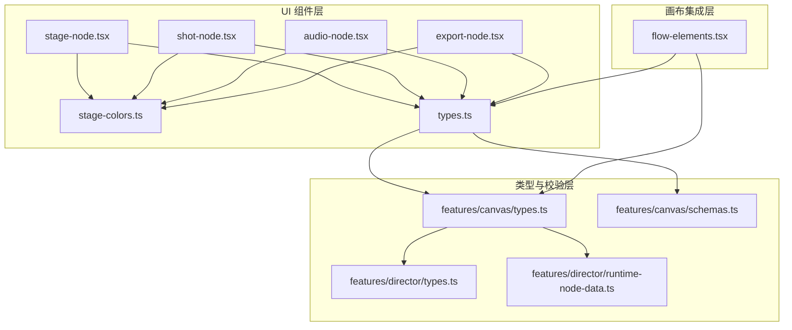
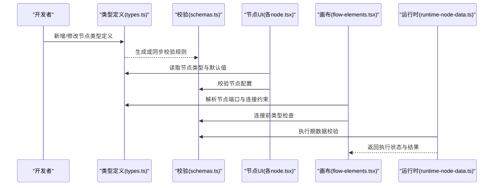
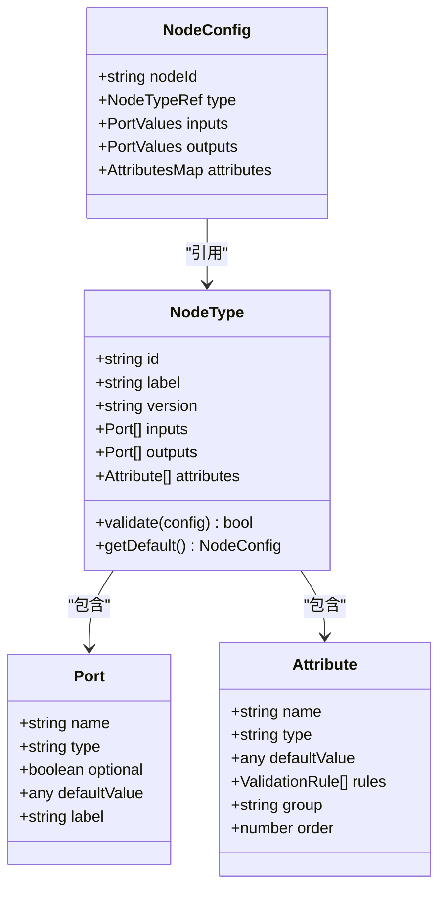
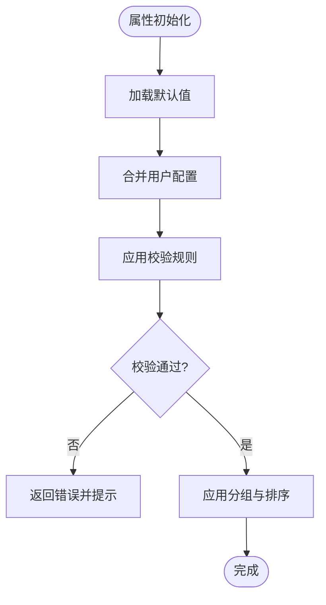
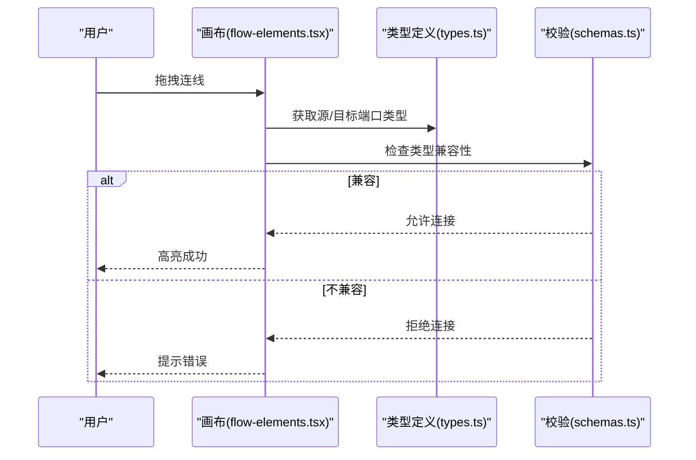
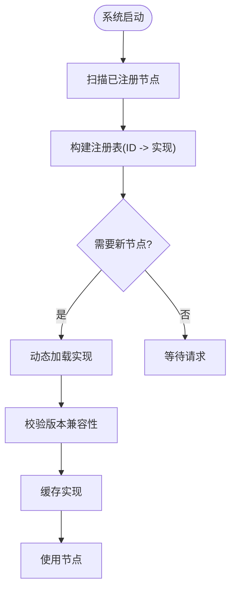
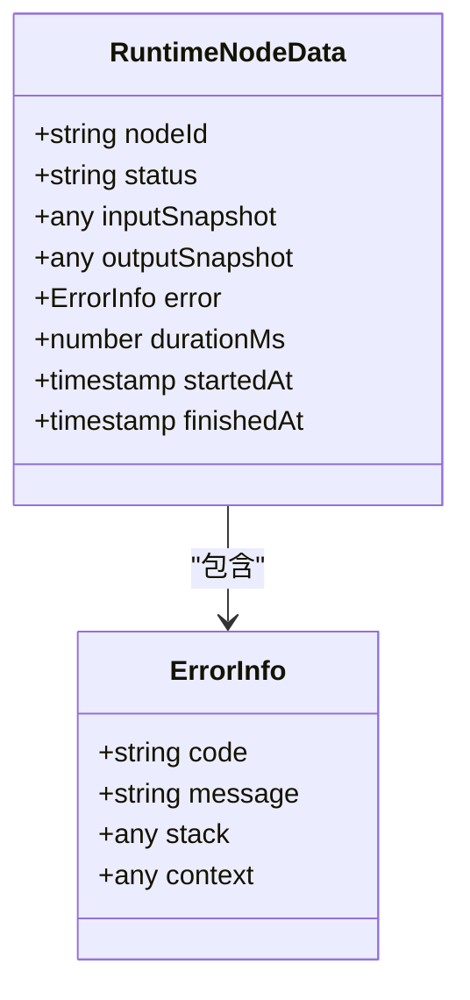
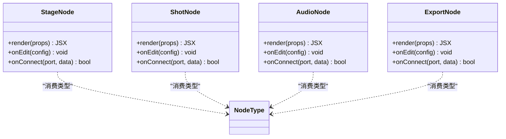
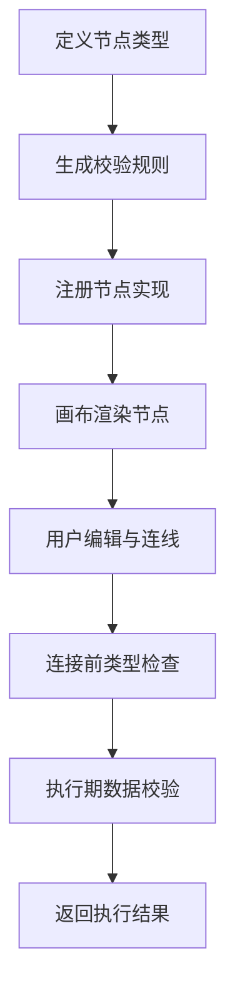
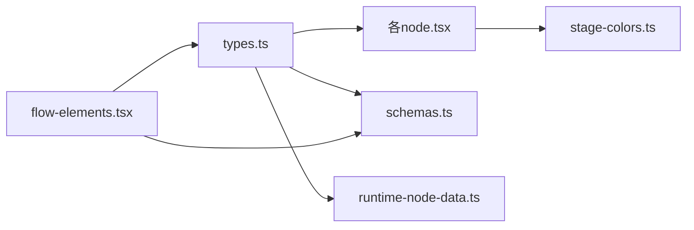

# 节点类型定义

<cite>
**本文引用的文件**   
- [src/components/ui/node/types.ts](file://src/components/ui/node/types.ts)
- [src/components/ui/node/stage-node.tsx](file://src/components/ui/node/stage-node.tsx)
- [src/components/ui/node/shot-node.tsx](file://src/components/ui/node/shot-node.tsx)
- [src/components/ui/node/audio-node.tsx](file://src/components/ui/node/audio-node.tsx)
- [src/components/ui/node/export-node.tsx](file://src/components/ui/node/export-node.tsx)
- [src/components/ui/node/stage-colors.ts](file://src/components/ui/node/stage-colors.ts)
- [src/features/canvas/types.ts](file://src/features/canvas/types.ts)
- [src/features/canvas/schemas.ts](file://src/features/canvas/schemas.ts)
- [src/features/director/types.ts](file://src/features/director/types.ts)
- [src/features/director/runtime-node-data.ts](file://src/features/director/runtime-node-data.ts)
- [src/app/products/(app)/canvas/[projectId]/flow-elements.tsx](file://src/app/products/(app)/canvas/[projectId]/flow-elements.tsx)
</cite>

## 目录
1. [简介](#简介)
2. [项目结构](#项目结构)
3. [核心组件](#核心组件)
4. [架构总览](#架构总览)
5. [详细组件分析](#详细组件分析)
6. [依赖关系分析](#依赖关系分析)
7. [性能考量](#性能考量)
8. [故障排查指南](#故障排查指南)
9. [结论](#结论)
10. [附录](#附录)

## 简介
本技术文档围绕“节点类型系统”展开，聚焦于节点类型的定义规范、接口约定与扩展机制；详述节点属性系统、数据类型验证与默认值处理；说明节点连接的类型检查、兼容性验证与数据转换；并覆盖节点类型的注册机制、动态加载与版本兼容。同时提供自定义节点类型的开发指南、类型定义示例与最佳实践，帮助读者在现有系统中安全、高效地扩展新的节点类型。

## 项目结构
节点类型系统在项目中由前端 UI 层（组件）与特性层（类型与校验）共同构成：
- 组件层：各具体节点 UI 实现（如阶段节点、镜头节点、音频节点、导出节点），以及颜色主题等辅助模块。
- 类型与校验层：统一的节点类型定义、运行时数据结构与 JSON Schema 校验。
- 画布集成层：将节点类型映射到画布渲染与交互逻辑。

图表来源
- [src/components/ui/node/types.ts](file://src/components/ui/node/types.ts)
- [src/components/ui/node/stage-node.tsx](file://src/components/ui/node/stage-node.tsx)
- [src/components/ui/node/shot-node.tsx](file://src/components/ui/node/shot-node.tsx)
- [src/components/ui/node/audio-node.tsx](file://src/components/ui/node/audio-node.tsx)
- [src/components/ui/node/export-node.tsx](file://src/components/ui/node/export-node.tsx)
- [src/components/ui/node/stage-colors.ts](file://src/components/ui/node/stage-colors.ts)
- [src/features/canvas/types.ts](file://src/features/canvas/types.ts)
- [src/features/canvas/schemas.ts](file://src/features/canvas/schemas.ts)
- [src/features/director/types.ts](file://src/features/director/types.ts)
- [src/features/director/runtime-node-data.ts](file://src/features/director/runtime-node-data.ts)
- [src/app/products/(app)/canvas/[projectId]/flow-elements.tsx](file://src/app/products/(app)/canvas/[projectId]/flow-elements.tsx)

章节来源
- [src/components/ui/node/types.ts](file://src/components/ui/node/types.ts)
- [src/features/canvas/types.ts](file://src/features/canvas/types.ts)
- [src/features/canvas/schemas.ts](file://src/features/canvas/schemas.ts)
- [src/app/products/(app)/canvas/[projectId]/flow-elements.tsx](file://src/app/products/(app)/canvas/[projectId]/flow-elements.tsx)

## 核心组件
- 节点类型定义与统一接口：集中定义节点类型标识、输入输出端口、属性元数据与默认值，确保 UI 与运行时的契约一致。
- 具体节点 UI：阶段节点、镜头节点、音频节点、导出节点等，各自实现可视化编辑与交互。
- 类型系统与校验：基于 JSON Schema 的强类型约束，保障节点配置与连接数据的合法性。
- 运行时数据模型：描述节点执行过程中的状态、中间结果与错误信息。
- 画布集成：将类型定义映射为可拖拽、可连线、可配置的画布元素。

章节来源
- [src/components/ui/node/types.ts](file://src/components/ui/node/types.ts)
- [src/components/ui/node/stage-node.tsx](file://src/components/ui/node/stage-node.tsx)
- [src/components/ui/node/shot-node.tsx](file://src/components/ui/node/shot-node.tsx)
- [src/components/ui/node/audio-node.tsx](file://src/components/ui/node/audio-node.tsx)
- [src/components/ui/node/export-node.tsx](file://src/components/ui/node/export-node.tsx)
- [src/features/canvas/types.ts](file://src/features/canvas/types.ts)
- [src/features/canvas/schemas.ts](file://src/features/canvas/schemas.ts)
- [src/features/director/types.ts](file://src/features/director/types.ts)
- [src/features/director/runtime-node-data.ts](file://src/features/director/runtime-node-data.ts)

## 架构总览
节点类型系统的整体架构遵循“类型驱动 + 校验先行 + UI 解耦”的原则：
- 类型定义位于共享模块，供 UI 与运行时复用。
- 校验层通过 JSON Schema 对节点配置进行静态与运行时双重校验。
- UI 组件仅消费类型与校验结果，不直接耦合业务细节。
- 画布层负责将类型映射为可视化元素，支持拖拽、连线与属性编辑。

图表来源
- [src/components/ui/node/types.ts](file://src/components/ui/node/types.ts)
- [src/features/canvas/schemas.ts](file://src/features/canvas/schemas.ts)
- [src/app/products/(app)/canvas/[projectId]/flow-elements.tsx](file://src/app/products/(app)/canvas/[projectId]/flow-elements.tsx)
- [src/features/director/runtime-node-data.ts](file://src/features/director/runtime-node-data.ts)

## 详细组件分析

### 节点类型定义与接口约定
- 节点类型标识：每个节点拥有唯一标识，用于注册、查找与序列化。
- 输入输出端口：定义端口的名称、数据类型、是否可选、默认值与显示标签。
- 属性元数据：包括字段类型、校验规则、默认值、分组与展示顺序。
- 版本兼容：通过版本号与迁移策略保证向后兼容。

图表来源
- [src/components/ui/node/types.ts](file://src/components/ui/node/types.ts)
- [src/features/canvas/types.ts](file://src/features/canvas/types.ts)

章节来源
- [src/components/ui/node/types.ts](file://src/components/ui/node/types.ts)
- [src/features/canvas/types.ts](file://src/features/canvas/types.ts)

### 节点属性系统与默认值处理
- 属性系统：所有节点属性以结构化方式声明，支持基础类型、对象、数组与枚举。
- 默认值：每个属性具备默认值，缺失时自动填充，确保节点初始化可用。
- 分组与排序：属性按组与顺序组织，提升编辑器体验。
- 校验规则：内置与自定义校验规则组合，确保数据完整性。

图表来源
- [src/features/canvas/schemas.ts](file://src/features/canvas/schemas.ts)
- [src/components/ui/node/types.ts](file://src/components/ui/node/types.ts)

章节来源
- [src/features/canvas/schemas.ts](file://src/features/canvas/schemas.ts)
- [src/components/ui/node/types.ts](file://src/components/ui/node/types.ts)

### 节点连接的类型检查与兼容性验证
- 连接前检查：根据输入输出端口的类型进行匹配，阻止不兼容连接。
- 数据转换：当类型存在子集或兼容关系时，尝试自动转换。
- 运行时校验：执行期再次校验数据形态，捕获异常并回退。

图表来源
- [src/app/products/(app)/canvas/[projectId]/flow-elements.tsx](file://src/app/products/(app)/canvas/[projectId]/flow-elements.tsx)
- [src/components/ui/node/types.ts](file://src/components/ui/node/types.ts)
- [src/features/canvas/schemas.ts](file://src/features/canvas/schemas.ts)

章节来源
- [src/app/products/(app)/canvas/[projectId]/flow-elements.tsx](file://src/app/products/(app)/canvas/[projectId]/flow-elements.tsx)
- [src/components/ui/node/types.ts](file://src/components/ui/node/types.ts)
- [src/features/canvas/schemas.ts](file://src/features/canvas/schemas.ts)

### 节点类型的注册机制与动态加载
- 注册表：集中维护节点类型 ID 到实现的映射，支持按需加载。
- 动态加载：根据画布需求懒加载节点实现，减少初始包体积。
- 版本兼容：注册时携带版本信息，冲突时选择最兼容实现。

图表来源
- [src/components/ui/node/types.ts](file://src/components/ui/node/types.ts)
- [src/app/products/(app)/canvas/[projectId]/flow-elements.tsx](file://src/app/products/(app)/canvas/[projectId]/flow-elements.tsx)

章节来源
- [src/components/ui/node/types.ts](file://src/components/ui/node/types.ts)
- [src/app/products/(app)/canvas/[projectId]/flow-elements.tsx](file://src/app/products/(app)/canvas/[projectId]/flow-elements.tsx)

### 运行时数据模型与错误处理
- 运行时数据：记录节点执行状态、输入输出快照、耗时与错误堆栈。
- 错误分类：区分配置错误、连接错误与执行错误，便于定位。
- 恢复策略：失败节点支持重试、跳过或回滚。

图表来源
- [src/features/director/runtime-node-data.ts](file://src/features/director/runtime-node-data.ts)

章节来源
- [src/features/director/runtime-node-data.ts](file://src/features/director/runtime-node-data.ts)

### 具体节点 UI 组件
- 阶段节点：管理阶段流程与参数配置。
- 镜头节点：管理镜头规格与媒体资源。
- 音频节点：管理音频轨道与效果链。
- 导出节点：管理导出格式与输出路径。

图表来源
- [src/components/ui/node/stage-node.tsx](file://src/components/ui/node/stage-node.tsx)
- [src/components/ui/node/shot-node.tsx](file://src/components/ui/node/shot-node.tsx)
- [src/components/ui/node/audio-node.tsx](file://src/components/ui/node/audio-node.tsx)
- [src/components/ui/node/export-node.tsx](file://src/components/ui/node/export-node.tsx)
- [src/components/ui/node/types.ts](file://src/components/ui/node/types.ts)

章节来源
- [src/components/ui/node/stage-node.tsx](file://src/components/ui/node/stage-node.tsx)
- [src/components/ui/node/shot-node.tsx](file://src/components/ui/node/shot-node.tsx)
- [src/components/ui/node/audio-node.tsx](file://src/components/ui/node/audio-node.tsx)
- [src/components/ui/node/export-node.tsx](file://src/components/ui/node/export-node.tsx)
- [src/components/ui/node/types.ts](file://src/components/ui/node/types.ts)

### 概念性概览
以下流程图展示了从类型定义到画布渲染与执行的端到端过程，帮助理解节点类型系统的工作流。

[此图为概念性流程图，不直接映射具体源码文件]

## 依赖关系分析
节点类型系统内部依赖清晰，外部扩展点明确：
- UI 组件依赖类型定义与颜色主题。
- 类型定义依赖运行时数据模型与校验规则。
- 画布集成依赖类型定义与校验规则，确保连接与渲染一致性。

图表来源
- [src/components/ui/node/types.ts](file://src/components/ui/node/types.ts)
- [src/components/ui/node/stage-node.tsx](file://src/components/ui/node/stage-node.tsx)
- [src/components/ui/node/shot-node.tsx](file://src/components/ui/node/shot-node.tsx)
- [src/components/ui/node/audio-node.tsx](file://src/components/ui/node/audio-node.tsx)
- [src/components/ui/node/export-node.tsx](file://src/components/ui/node/export-node.tsx)
- [src/components/ui/node/stage-colors.ts](file://src/components/ui/node/stage-colors.ts)
- [src/features/canvas/schemas.ts](file://src/features/canvas/schemas.ts)
- [src/features/director/runtime-node-data.ts](file://src/features/director/runtime-node-data.ts)
- [src/app/products/(app)/canvas/[projectId]/flow-elements.tsx](file://src/app/products/(app)/canvas/[projectId]/flow-elements.tsx)

章节来源
- [src/components/ui/node/types.ts](file://src/components/ui/node/types.ts)
- [src/features/canvas/schemas.ts](file://src/features/canvas/schemas.ts)
- [src/features/director/runtime-node-data.ts](file://src/features/director/runtime-node-data.ts)
- [src/app/products/(app)/canvas/[projectId]/flow-elements.tsx](file://src/app/products/(app)/canvas/[projectId]/flow-elements.tsx)

## 性能考量
- 懒加载节点实现：按需加载减少首屏体积。
- 校验规则缓存：避免重复计算，提升连接与编辑响应速度。
- 增量更新：画布只重绘受影响的节点区域。
- 批量校验：对多节点配置进行批处理，降低主线程阻塞。

[本节为通用指导，不直接分析具体文件]

## 故障排查指南
- 连接错误：检查端口类型是否兼容，查看连接前校验日志。
- 配置错误：核对属性默认值与必填项，确认 JSON Schema 校验结果。
- 执行错误：查看运行时数据中的错误码与上下文，定位失败节点。
- 版本冲突：确认节点类型版本与注册表一致性，必要时进行迁移。

章节来源
- [src/features/canvas/schemas.ts](file://src/features/canvas/schemas.ts)
- [src/features/director/runtime-node-data.ts](file://src/features/director/runtime-node-data.ts)

## 结论
节点类型系统通过统一的类型定义、严格的校验机制与解耦的 UI 组件，实现了可扩展、可维护且高性能的节点编排能力。遵循本文档的规范与最佳实践，开发者可以安全地扩展新的节点类型，并确保其在画布与运行时的稳定表现。

[本节为总结性内容，不直接分析具体文件]

## 附录
- 自定义节点类型开发步骤：
  - 在类型定义中声明节点 ID、端口与属性。
  - 编写 JSON Schema 校验规则。
  - 实现节点 UI 组件，消费类型与校验结果。
  - 注册节点实现，确保版本兼容。
  - 在画布中进行连线与编辑测试。
- 最佳实践：
  - 保持端口类型最小化与语义清晰。
  - 为属性设置合理的默认值与校验规则。
  - 使用分组与排序提升编辑器体验。
  - 在连接前进行类型检查，避免运行时错误。
  - 记录运行时错误上下文，便于问题定位。

[本节为补充性内容，不直接分析具体文件]