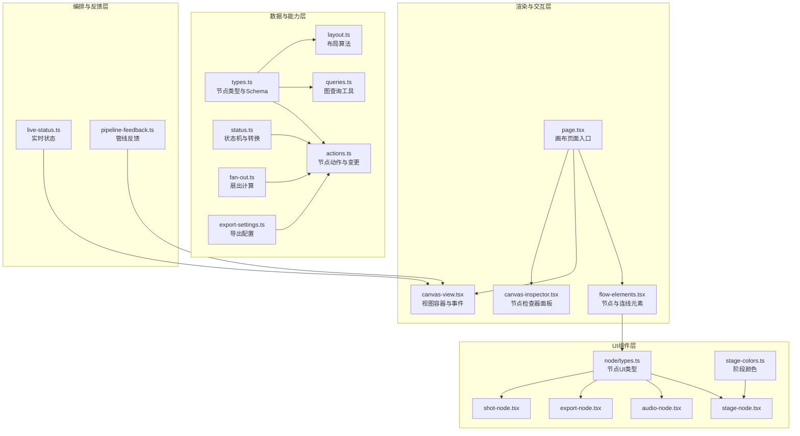
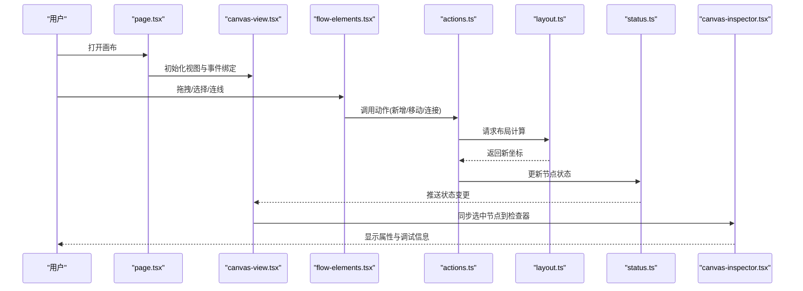
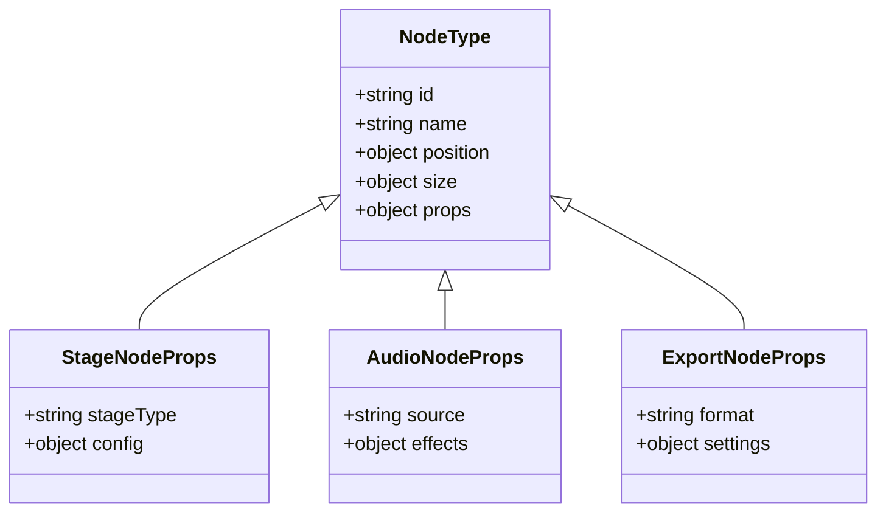
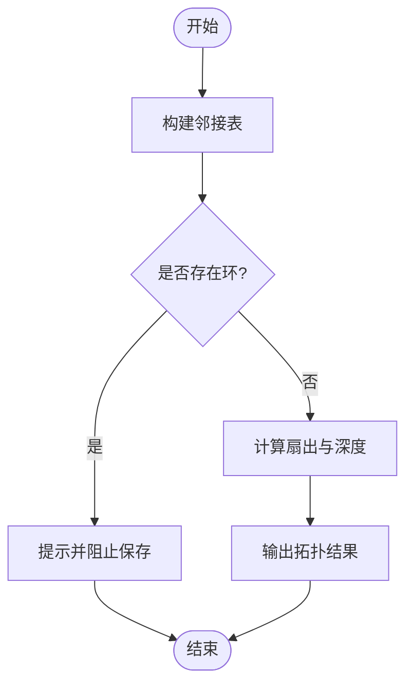
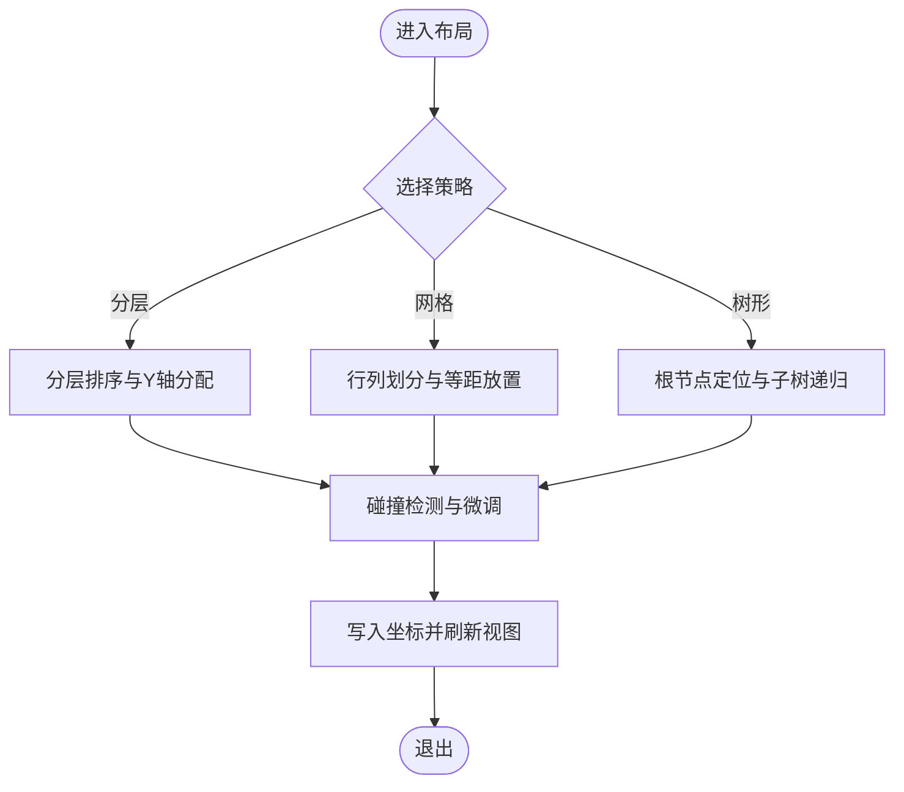
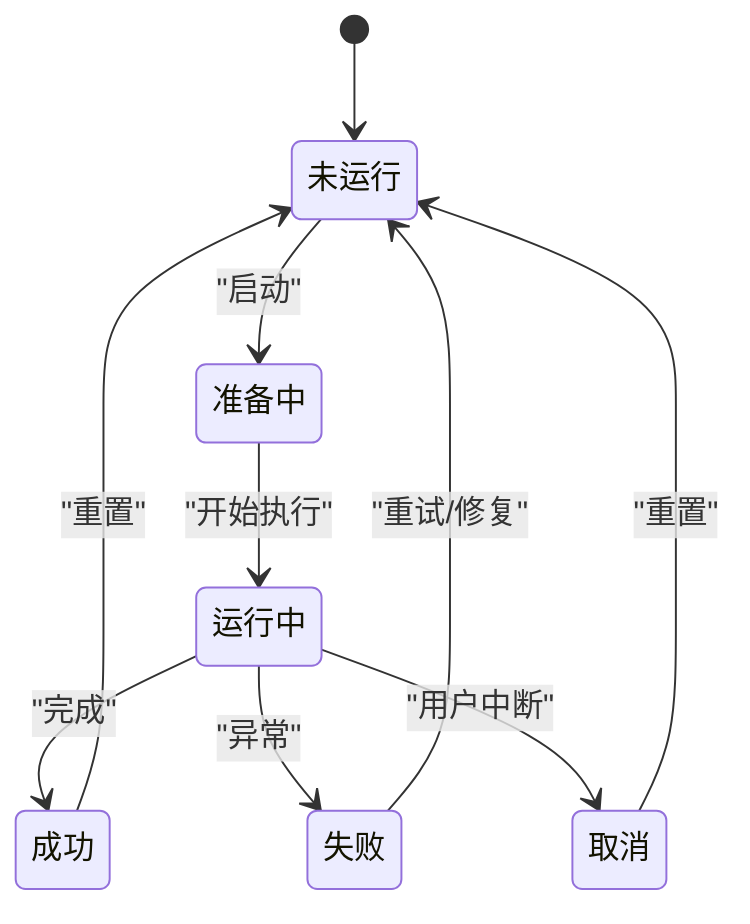
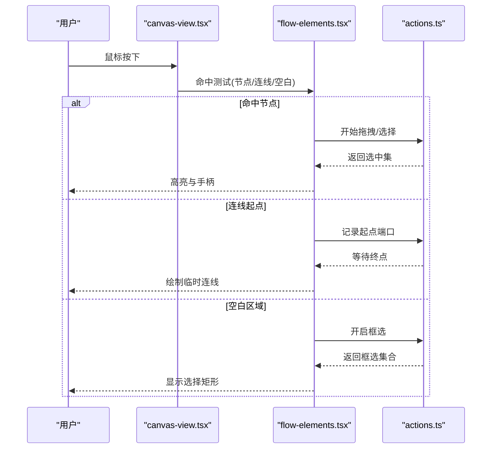
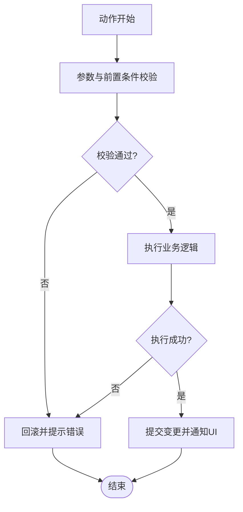
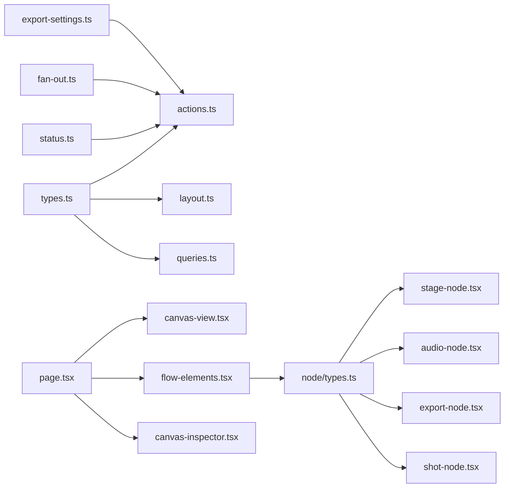

# 节点系统

<cite>
**本文引用的文件**   
- [src/features/canvas/types.ts](file://src/features/canvas/types.ts)
- [src/features/canvas/layout.ts](file://src/features/canvas/layout.ts)
- [src/features/canvas/queries.ts](file://src/features/canvas/queries.ts)
- [src/features/canvas/actions.ts](file://src/features/canvas/actions.ts)
- [src/features/canvas/status.ts](file://src/features/canvas/status.ts)
- [src/features/canvas/fan-out.ts](file://src/features/canvas/fan-out.ts)
- [src/features/canvas/export-settings.ts](file://src/features/canvas/export-settings.ts)
- [src/app/products/(app)/canvas/[projectId]/page.tsx](file://src/app/products/(app)/canvas/[projectId]/page.tsx)
- [src/app/products/(app)/canvas/[projectId]/flow-elements.tsx](file://src/app/products/(app)/canvas/[projectId]/flow-elements.tsx)
- [src/app/products/(app)/canvas/[projectId]/canvas-view.tsx](file://src/app/products/(app)/canvas/[projectId]/canvas-view.tsx)
- [src/app/products/(app)/canvas/[projectId]/canvas-inspector.tsx](file://src/app/products/(app)/canvas/[projectId]/canvas-inspector.tsx)
- [src/app/products/(app)/canvas/[projectId]/live-status.ts](file://src/app/products/(app)/canvas/[projectId]/live-status.ts)
- [src/app/products/(app)/canvas/[projectId]/pipeline-feedback.ts](file://src/app/products/(app)/canvas/[projectId]/pipeline-feedback.ts)
- [src/components/ui/node/types.ts](file://src/components/ui/node/types.ts)
- [src/components/ui/node/stage-node.tsx](file://src/components/ui/node/stage-node.tsx)
- [src/components/ui/node/audio-node.tsx](file://src/components/ui/node/audio-node.tsx)
- [src/components/ui/node/export-node.tsx](file://src/components/ui/node/export-node.tsx)
- [src/components/ui/node/shot-node.tsx](file://src/components/ui/node/shot-node.tsx)
- [src/components/ui/node/stage-colors.ts](file://src/components/ui/node/stage-colors.ts)
</cite>

## 目录
1. [简介](#简介)
2. [项目结构](#项目结构)
3. [核心组件](#核心组件)
4. [架构总览](#架构总览)
5. [详细组件分析](#详细组件分析)
6. [依赖关系分析](#依赖关系分析)
7. [性能考量](#性能考量)
8. [故障排查指南](#故障排查指南)
9. [结论](#结论)
10. [附录](#附录)

## 简介
本技术文档围绕画布节点系统，系统性阐述节点类型定义、属性系统与连接机制；节点生命周期管理、状态同步与错误处理；布局算法（自动排列与手动调整）；拖拽交互、选择操作与批量处理；自定义节点开发指南、API参考与最佳实践；以及性能优化、内存管理与大型项目支持策略。内容基于仓库中 features/canvas、components/ui/node 及 canvas 页面模块的实现进行归纳与提炼。

## 项目结构
画布节点系统由“数据模型与能力”、“渲染与交互”、“编排与反馈”三部分组成：
- 数据与能力层：位于 src/features/canvas，提供节点类型、布局、查询、动作、状态、扇出等核心能力。
- 渲染与交互层：位于 src/components/ui/node 与 src/app/products/(app)/canvas/[projectId]，负责节点 UI、连线绘制、拖拽选择、批量操作与实时状态展示。
- 编排与反馈层：通过 live-status、pipeline-feedback 等模块将运行时状态与用户界面同步。

图表来源
- [src/features/canvas/types.ts](file://src/features/canvas/types.ts)
- [src/features/canvas/layout.ts](file://src/features/canvas/layout.ts)
- [src/features/canvas/queries.ts](file://src/features/canvas/queries.ts)
- [src/features/canvas/actions.ts](file://src/features/canvas/actions.ts)
- [src/features/canvas/status.ts](file://src/features/canvas/status.ts)
- [src/features/canvas/fan-out.ts](file://src/features/canvas/fan-out.ts)
- [src/features/canvas/export-settings.ts](file://src/features/canvas/export-settings.ts)
- [src/app/products/(app)/canvas/[projectId]/page.tsx](file://src/app/products/(app)/canvas/[projectId]/page.tsx)
- [src/app/products/(app)/canvas/[projectId]/flow-elements.tsx](file://src/app/products/(app)/canvas/[projectId]/flow-elements.tsx)
- [src/app/products/(app)/canvas/[projectId]/canvas-view.tsx](file://src/app/products/(app)/canvas/[projectId]/canvas-view.tsx)
- [src/app/products/(app)/canvas/[projectId]/canvas-inspector.tsx](file://src/app/products/(app)/canvas/[projectId]/canvas-inspector.tsx)
- [src/app/products/(app)/canvas/[projectId]/live-status.ts](file://src/app/products/(app)/canvas/[projectId]/live-status.ts)
- [src/app/products/(app)/canvas/[projectId]/pipeline-feedback.ts](file://src/app/products/(app)/canvas/[projectId]/pipeline-feedback.ts)
- [src/components/ui/node/types.ts](file://src/components/ui/node/types.ts)
- [src/components/ui/node/stage-node.tsx](file://src/components/ui/node/stage-node.tsx)
- [src/components/ui/node/audio-node.tsx](file://src/components/ui/node/audio-node.tsx)
- [src/components/ui/node/export-node.tsx](file://src/components/ui/node/export-node.tsx)
- [src/components/ui/node/shot-node.tsx](file://src/components/ui/node/shot-node.tsx)
- [src/components/ui/node/stage-colors.ts](file://src/components/ui/node/stage-colors.ts)

章节来源
- [src/features/canvas/types.ts](file://src/features/canvas/types.ts)
- [src/features/canvas/layout.ts](file://src/features/canvas/layout.ts)
- [src/app/products/(app)/canvas/[projectId]/page.tsx](file://src/app/products/(app)/canvas/[projectId]/page.tsx)

## 核心组件
- 节点类型与Schema：集中定义节点类型、字段约束与校验规则，确保前后端一致的数据契约。
- 布局算法：提供自动排列（如分层、网格、树形）与手动调整（坐标更新、对齐、吸附）能力。
- 查询工具：对节点图进行遍历、连通性检测、入度/出度统计、路径查找等。
- 动作系统：封装节点的增删改、连接建立/断开、批量操作与撤销重做。
- 状态机：管理节点运行态（未运行、运行中、成功、失败、取消等），驱动UI与后端同步。
- 扇出计算：根据连接拓扑计算分支执行范围，辅助预览与资源预估。
- 导出设置：将画布配置序列化为可执行的导出任务参数。

章节来源
- [src/features/canvas/types.ts](file://src/features/canvas/types.ts)
- [src/features/canvas/layout.ts](file://src/features/canvas/layout.ts)
- [src/features/canvas/queries.ts](file://src/features/canvas/queries.ts)
- [src/features/canvas/actions.ts](file://src/features/canvas/actions.ts)
- [src/features/canvas/status.ts](file://src/features/canvas/status.ts)
- [src/features/canvas/fan-out.ts](file://src/features/canvas/fan-out.ts)
- [src/features/canvas/export-settings.ts](file://src/features/canvas/export-settings.ts)

## 架构总览
画布节点系统的整体流程如下：用户在页面上创建/编辑节点与连线，触发动作层对图数据进行变更；布局引擎根据策略重新计算节点位置；状态机驱动节点运行态变化，并通过实时通道推送至前端；渲染层根据最新状态与样式绘制节点与连线，同时提供检查器面板用于调试与配置。

图表来源
- [src/app/products/(app)/canvas/[projectId]/page.tsx](file://src/app/products/(app)/canvas/[projectId]/page.tsx)
- [src/app/products/(app)/canvas/[projectId]/canvas-view.tsx](file://src/app/products/(app)/canvas/[projectId]/canvas-view.tsx)
- [src/app/products/(app)/canvas/[projectId]/flow-elements.tsx](file://src/app/products/(app)/canvas/[projectId]/flow-elements.tsx)
- [src/features/canvas/actions.ts](file://src/features/canvas/actions.ts)
- [src/features/canvas/layout.ts](file://src/features/canvas/layout.ts)
- [src/features/canvas/status.ts](file://src/features/canvas/status.ts)
- [src/app/products/(app)/canvas/[projectId]/canvas-inspector.tsx](file://src/app/products/(app)/canvas/[projectId]/canvas-inspector.tsx)

## 详细组件分析

### 节点类型与属性系统
- 类型定义：集中声明节点类型枚举、字段Schema与默认值，保证类型安全与一致性。
- 属性系统：每个节点包含基础属性（id、名称、位置、尺寸）与业务属性（阶段参数、音频配置、导出选项等）。
- 校验与迁移：在加载与保存时进行Schema校验，必要时进行字段迁移与兼容处理。

图表来源
- [src/components/ui/node/types.ts](file://src/components/ui/node/types.ts)
- [src/components/ui/node/stage-node.tsx](file://src/components/ui/node/stage-node.tsx)
- [src/components/ui/node/audio-node.tsx](file://src/components/ui/node/audio-node.tsx)
- [src/components/ui/node/export-node.tsx](file://src/components/ui/node/export-node.tsx)

章节来源
- [src/components/ui/node/types.ts](file://src/components/ui/node/types.ts)
- [src/components/ui/node/stage-node.tsx](file://src/components/ui/node/stage-node.tsx)
- [src/components/ui/node/audio-node.tsx](file://src/components/ui/node/audio-node.tsx)
- [src/components/ui/node/export-node.tsx](file://src/components/ui/node/export-node.tsx)

### 连接机制与拓扑
- 连接建模：以有向边表示节点间的数据流或控制流，支持多输入/多输出端口。
- 连通性检查：构建邻接表，检测环路与不可达节点，保障图合法性。
- 扇出计算：从指定节点出发，递归统计下游分支数量与深度，辅助资源预估与并行调度。

图表来源
- [src/features/canvas/queries.ts](file://src/features/canvas/queries.ts)
- [src/features/canvas/fan-out.ts](file://src/features/canvas/fan-out.ts)

章节来源
- [src/features/canvas/queries.ts](file://src/features/canvas/queries.ts)
- [src/features/canvas/fan-out.ts](file://src/features/canvas/fan-out.ts)

### 布局算法与自动排列
- 自动排列：支持分层布局（按阶段）、网格布局（均匀分布）、树形布局（父子关系清晰）。
- 手动调整：支持拖拽移动、框选批量移动、对齐与吸附、间距统一。
- 碰撞检测：避免节点重叠，必要时自动微调位置。

图表来源
- [src/features/canvas/layout.ts](file://src/features/canvas/layout.ts)

章节来源
- [src/features/canvas/layout.ts](file://src/features/canvas/layout.ts)

### 节点生命周期与状态同步
- 生命周期阶段：未运行、准备中、运行中、成功、失败、取消。
- 状态机：严格限制状态转换路径，防止非法状态跳变。
- 同步机制：通过实时通道（如SSE/WS）推送状态变更，前端增量更新UI。

图表来源
- [src/features/canvas/status.ts](file://src/features/canvas/status.ts)
- [src/app/products/(app)/canvas/[projectId]/live-status.ts](file://src/app/products/(app)/canvas/[projectId]/live-status.ts)

章节来源
- [src/features/canvas/status.ts](file://src/features/canvas/status.ts)
- [src/app/products/(app)/canvas/[projectId]/live-status.ts](file://src/app/products/(app)/canvas/[projectId]/live-status.ts)

### 拖拽交互、选择与批量处理
- 拖拽：节点创建、移动、连线绘制，支持快捷键与撤销重做。
- 选择：单选、多选、框选、按类型过滤选择。
- 批量：批量移动、删除、复制、属性批量修改。

图表来源
- [src/app/products/(app)/canvas/[projectId]/canvas-view.tsx](file://src/app/products/(app)/canvas/[projectId]/canvas-view.tsx)
- [src/app/products/(app)/canvas/[projectId]/flow-elements.tsx](file://src/app/products/(app)/canvas/[projectId]/flow-elements.tsx)
- [src/features/canvas/actions.ts](file://src/features/canvas/actions.ts)

章节来源
- [src/app/products/(app)/canvas/[projectId]/canvas-view.tsx](file://src/app/products/(app)/canvas/[projectId]/canvas-view.tsx)
- [src/app/products/(app)/canvas/[projectId]/flow-elements.tsx](file://src/app/products/(app)/canvas/[projectId]/flow-elements.tsx)
- [src/features/canvas/actions.ts](file://src/features/canvas/actions.ts)

### 错误处理与回滚
- 动作原子性：单个动作内部保持事务性，失败时回滚。
- 状态一致性：状态机拒绝非法转换，并提供恢复路径。
- 用户反馈：错误消息与日志聚合，便于定位问题。

图表来源
- [src/features/canvas/actions.ts](file://src/features/canvas/actions.ts)
- [src/features/canvas/status.ts](file://src/features/canvas/status.ts)

章节来源
- [src/features/canvas/actions.ts](file://src/features/canvas/actions.ts)
- [src/features/canvas/status.ts](file://src/features/canvas/status.ts)

### 导出与序列化
- 导出设置：收集节点配置与全局参数，生成可执行的任务描述。
- 版本兼容：导出格式需考虑向后兼容，支持字段迁移。
- 校验与打包：导出前进行完整性校验，打包为标准化格式。

章节来源
- [src/features/canvas/export-settings.ts](file://src/features/canvas/export-settings.ts)

### 自定义节点开发指南
- 步骤概览：
  - 定义节点类型与属性Schema（遵循现有类型约定）。
  - 实现节点UI组件（继承通用节点基类，复用拖拽/选择行为）。
  - 注册节点到渲染器，确保连线端口与数据流正确映射。
  - 编写单元测试覆盖属性校验与交互边界。
- 最佳实践：
  - 使用统一的阶段颜色与图标规范，提升一致性。
  - 属性面板与检查器联动，便于调试。
  - 避免在渲染路径中进行重型计算，采用异步与缓存。

章节来源
- [src/components/ui/node/types.ts](file://src/components/ui/node/types.ts)
- [src/components/ui/node/stage-colors.ts](file://src/components/ui/node/stage-colors.ts)

## 依赖关系分析
- 低耦合：数据与能力层与渲染层通过接口契约解耦，便于替换与扩展。
- 内聚性：布局、查询、动作、状态各自职责明确，减少交叉依赖。
- 外部集成：实时状态与管线反馈通过独立模块接入，不影响核心逻辑。

图表来源
- [src/features/canvas/types.ts](file://src/features/canvas/types.ts)
- [src/features/canvas/actions.ts](file://src/features/canvas/actions.ts)
- [src/features/canvas/layout.ts](file://src/features/canvas/layout.ts)
- [src/features/canvas/queries.ts](file://src/features/canvas/queries.ts)
- [src/features/canvas/status.ts](file://src/features/canvas/status.ts)
- [src/features/canvas/fan-out.ts](file://src/features/canvas/fan-out.ts)
- [src/features/canvas/export-settings.ts](file://src/features/canvas/export-settings.ts)
- [src/app/products/(app)/canvas/[projectId]/page.tsx](file://src/app/products/(app)/canvas/[projectId]/page.tsx)
- [src/app/products/(app)/canvas/[projectId]/canvas-view.tsx](file://src/app/products/(app)/canvas/[projectId]/canvas-view.tsx)
- [src/app/products/(app)/canvas/[projectId]/flow-elements.tsx](file://src/app/products/(app)/canvas/[projectId]/flow-elements.tsx)
- [src/app/products/(app)/canvas/[projectId]/canvas-inspector.tsx](file://src/app/products/(app)/canvas/[projectId]/canvas-inspector.tsx)
- [src/components/ui/node/types.ts](file://src/components/ui/node/types.ts)
- [src/components/ui/node/stage-node.tsx](file://src/components/ui/node/stage-node.tsx)
- [src/components/ui/node/audio-node.tsx](file://src/components/ui/node/audio-node.tsx)
- [src/components/ui/node/export-node.tsx](file://src/components/ui/node/export-node.tsx)
- [src/components/ui/node/shot-node.tsx](file://src/components/ui/node/shot-node.tsx)

章节来源
- [src/features/canvas/types.ts](file://src/features/canvas/types.ts)
- [src/app/products/(app)/canvas/[projectId]/page.tsx](file://src/app/products/(app)/canvas/[projectId]/page.tsx)

## 性能考量
- 渲染优化：
  - 虚拟滚动与按需渲染，仅绘制可视区域内的节点与连线。
  - 使用稳定的键值与浅比较，减少不必要的重渲染。
- 计算优化：
  - 布局与拓扑计算采用增量更新与缓存，避免全量重算。
  - 重型计算放入Web Worker或后台队列，主线程只负责UI更新。
- 内存管理：
  - 及时释放不再使用的节点实例与监听器，避免内存泄漏。
  - 大对象分片处理，降低单次GC压力。
- 大型项目支持：
  - 分页加载与懒加载，首屏快速响应。
  - 分布式计算与并行执行，缩短长链路耗时。

[本节为通用指导，不直接分析具体文件]

## 故障排查指南
- 常见问题：
  - 节点无法连接：检查端口类型匹配与Schema约束。
  - 布局错乱：确认布局策略与碰撞检测参数。
  - 状态不同步：核对状态机转换路径与实时通道订阅。
- 诊断工具：
  - 检查器面板：查看节点属性、连接拓扑与运行日志。
  - 控制台日志：捕获动作执行与错误堆栈。
- 恢复策略：
  - 撤销/重做：回滚到上一稳定状态。
  - 重置节点：恢复默认属性并重新初始化。

章节来源
- [src/app/products/(app)/canvas/[projectId]/canvas-inspector.tsx](file://src/app/products/(app)/canvas/[projectId]/canvas-inspector.tsx)
- [src/features/canvas/actions.ts](file://src/features/canvas/actions.ts)
- [src/features/canvas/status.ts](file://src/features/canvas/status.ts)

## 结论
画布节点系统以清晰的类型与Schema为基础，结合强大的布局、查询、动作与状态管理能力，提供了完整的节点可视化与编排体验。通过模块化设计与严格的错误处理，系统在易用性与可靠性之间取得平衡。面向大型项目，建议持续优化渲染与计算性能，完善监控与诊断工具，以提升用户体验与运维效率。

[本节为总结性内容，不直接分析具体文件]

## 附录
- API参考（概念性）：
  - 节点类型注册：提供类型名、Schema与默认值。
  - 动作接口：新增/删除/移动/连接/批量操作。
  - 布局接口：选择策略、参数与回调。
  - 状态接口：查询与订阅状态变更。
- 最佳实践清单：
  - 保持Schema稳定，避免破坏性变更。
  - 使用统一的UI规范与主题变量。
  - 对关键路径添加单元测试与集成测试。
  - 对性能敏感操作进行基准测试与监控。

[本节为补充信息，不直接分析具体文件]