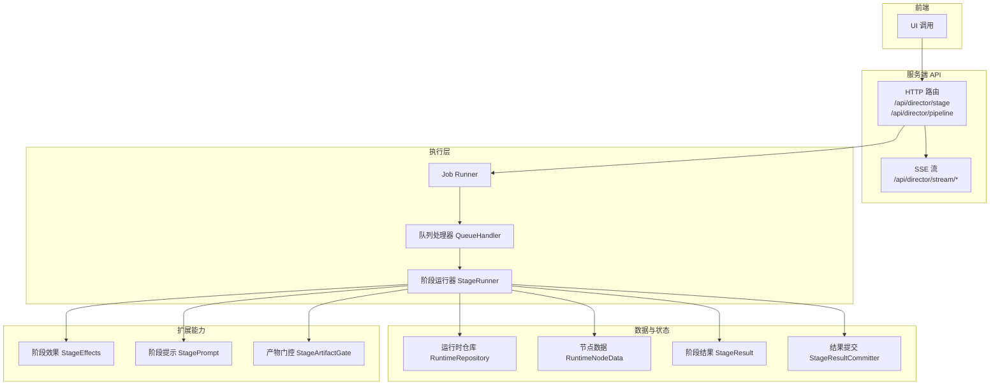
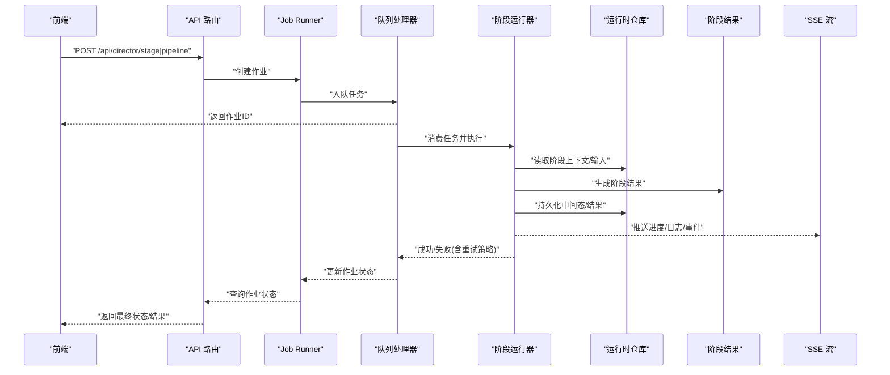
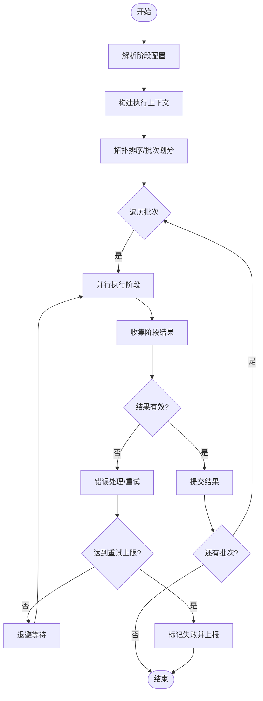
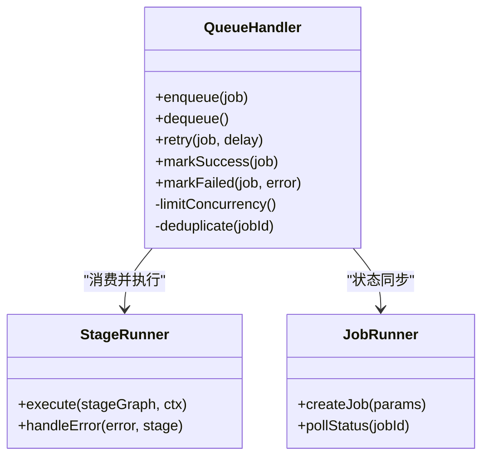
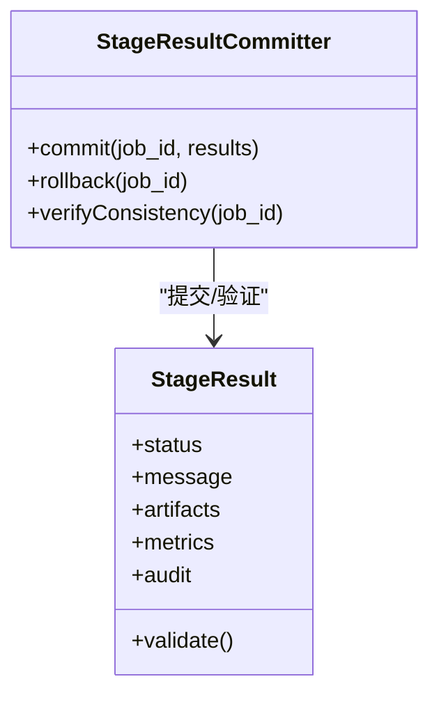
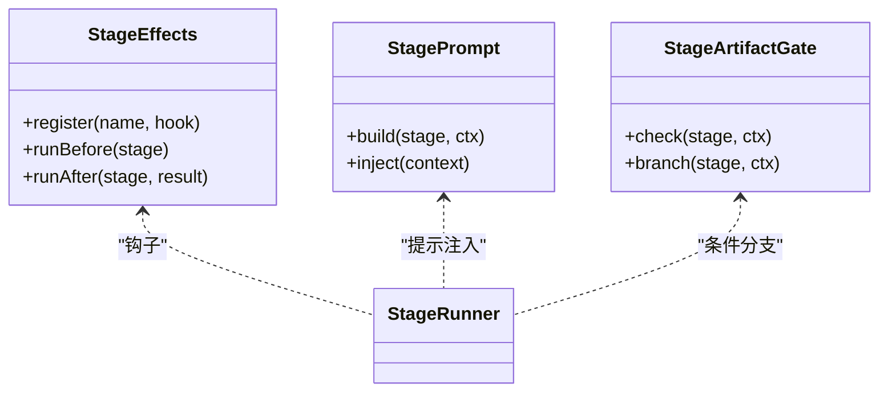
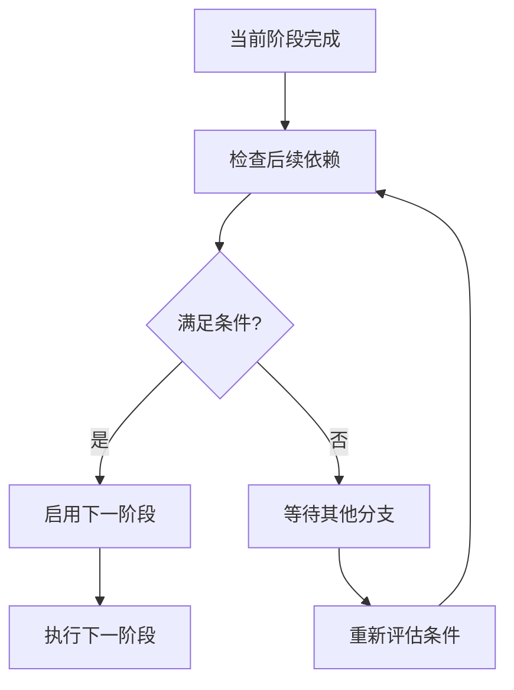
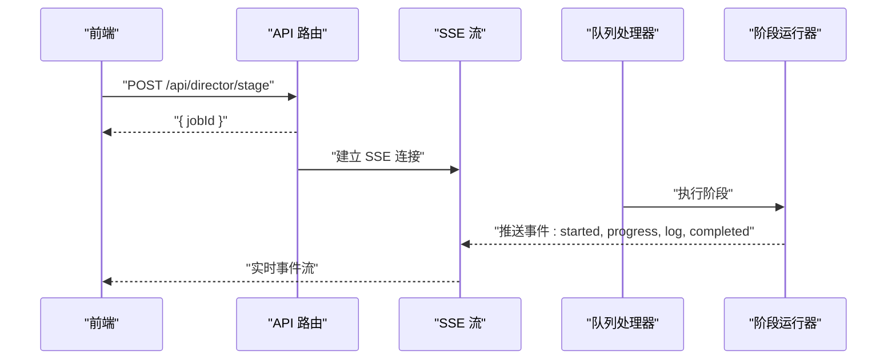
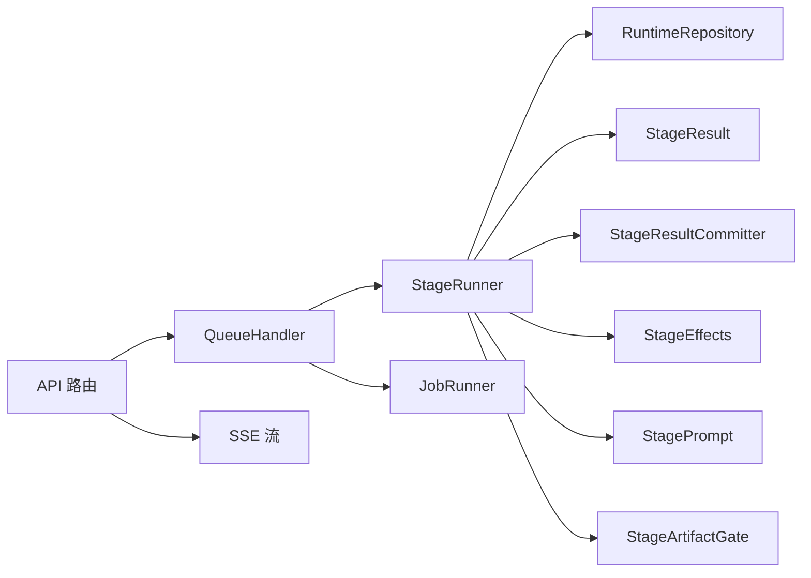

# 阶段节点

<cite>
**本文引用的文件**   
- [stage-runner.ts](file://src/features/director/stage-runner.ts)
- [stage-result.ts](file://src/features/director/stage-result.ts)
- [stage-effects.ts](file://src/features/director/stage-effects.ts)
- [stage-prompt.ts](file://src/features/director/stage-prompt.ts)
- [advance.ts](file://src/features/director/advance.ts)
- [queue-handler.ts](file://src/features/director/queue-handler.ts)
- [runtime-repository.ts](file://src/features/director/runtime-repository.ts)
- [runtime-node-data.ts](file://src/features/director/runtime-node-data.ts)
- [stage-artifact-gate.ts](file://src/features/director/stage-artifact-gate.ts)
- [stage-result-committer.ts](file://src/features/director/stage-result-committer.ts)
- [job-runner.ts](file://server/src/server/job-runner.ts)
- [api.ts](file://server/src/server/api.ts)
- [route.ts](file://src/app/api/director/stage/route.ts)
- [route.ts](file://src/app/api/director/pipeline/route.ts)
- [stream/route.ts](file://src/app/api/director/stream/[nodeId]/route.ts)
- [stream/route.ts](file://src/app/api/director/stream/project/[projectId]/route.ts)
- [types.ts](file://src/features/director/types.ts)
</cite>

## 目录
1. [简介](#简介)
2. [项目结构](#项目结构)
3. [核心组件](#核心组件)
4. [架构总览](#架构总览)
5. [详细组件分析](#详细组件分析)
6. [依赖关系分析](#依赖关系分析)
7. [性能考量](#性能考量)
8. [故障排查指南](#故障排查指南)
9. [结论](#结论)
10. [附录](#附录)

## 简介
本技术文档聚焦“阶段节点”的运行时实现与编排机制，覆盖工作流编排、执行顺序与依赖关系、配置与参数传递、状态管理、生命周期、错误处理与重试、多阶段类型支持、条件分支与并行执行、配置示例、调试与监控接口、执行优化、资源调度与故障恢复策略。读者可据此理解从前端触发到后端执行、再到结果落库与流式反馈的完整链路。

## 项目结构
阶段节点相关代码主要分布在以下模块：
- 编排与执行：stage-runner、advance、queue-handler、job-runner
- 数据与状态：runtime-repository、runtime-node-data、stage-result、stage-result-committer
- 能力扩展：stage-effects、stage-prompt、stage-artifact-gate
- API 与流式输出：API 路由与 SSE 流端点
- 类型定义：统一类型与契约



图表来源
- [api.ts](file://server/src/server/api.ts)
- [job-runner.ts](file://server/src/server/job-runner.ts)
- [queue-handler.ts](file://src/features/director/queue-handler.ts)
- [stage-runner.ts](file://src/features/director/stage-runner.ts)
- [runtime-repository.ts](file://src/features/director/runtime-repository.ts)
- [runtime-node-data.ts](file://src/features/director/runtime-node-data.ts)
- [stage-result.ts](file://src/features/director/stage-result.ts)
- [stage-result-committer.ts](file://src/features/director/stage-result-committer.ts)
- [stage-effects.ts](file://src/features/director/stage-effects.ts)
- [stage-prompt.ts](file://src/features/director/stage-prompt.ts)
- [stage-artifact-gate.ts](file://src/features/director/stage-artifact-gate.ts)
- [route.ts](file://src/app/api/director/stage/route.ts)
- [route.ts](file://src/app/api/director/pipeline/route.ts)
- [stream/route.ts](file://src/app/api/director/stream/[nodeId]/route.ts)
- [stream/route.ts](file://src/app/api/director/stream/project/[projectId]/route.ts)

章节来源
- [types.ts](file://src/features/director/types.ts)
- [stage-runner.ts](file://src/features/director/stage-runner.ts)
- [queue-handler.ts](file://src/features/director/queue-handler.ts)
- [job-runner.ts](file://server/src/server/job-runner.ts)
- [api.ts](file://server/src/server/api.ts)

## 核心组件
- 阶段运行器（StageRunner）：负责解析阶段配置、构建上下文、按依赖顺序调度子阶段、管理并发与重试、收集并持久化结果。
- 队列处理器（QueueHandler）：将阶段任务入队、限流、消费与重试，保证高吞吐与稳定性。
- 运行时仓库（RuntimeRepository）：提供阶段运行元数据、中间态与结果的读写能力。
- 节点数据（RuntimeNodeData）：封装阶段输入、输出、上下文与副作用数据。
- 阶段结果（StageResult）：标准化阶段执行结果的结构与校验。
- 结果提交器（StageResultCommitter）：原子性提交阶段结果，确保一致性。
- 阶段效果（StageEffects）：注册与执行阶段级副作用（如日志、指标、缓存）。
- 阶段提示（StagePrompt）：生成或注入阶段提示词/指令，驱动 AI 或外部工具。
- 产物门控（StageArtifactGate）：基于前置产物存在性与有效性进行条件分支控制。

章节来源
- [stage-runner.ts](file://src/features/director/stage-runner.ts)
- [queue-handler.ts](file://src/features/director/queue-handler.ts)
- [runtime-repository.ts](file://src/features/director/runtime-repository.ts)
- [runtime-node-data.ts](file://src/features/director/runtime-node-data.ts)
- [stage-result.ts](file://src/features/director/stage-result.ts)
- [stage-result-committer.ts](file://src/features/director/stage-result-committer.ts)
- [stage-effects.ts](file://src/features/director/stage-effects.ts)
- [stage-prompt.ts](file://src/features/director/stage-prompt.ts)
- [stage-artifact-gate.ts](file://src/features/director/stage-artifact-gate.ts)

## 架构总览
阶段节点的端到端流程如下：
- 前端通过 HTTP API 发起阶段或流水线执行请求。
- 服务端 Job Runner 接收请求，交由队列处理器进行排队与调度。
- 阶段运行器根据阶段图与依赖拓扑，按序或并行执行各阶段。
- 每个阶段读取输入、执行逻辑、写入中间结果，并通过结果提交器持久化。
- 运行过程中通过 SSE 流推送进度、日志与事件，供前端实时展示。
- 失败时由队列处理器与运行器协同完成重试、回滚与告警。



图表来源
- [route.ts](file://src/app/api/director/stage/route.ts)
- [route.ts](file://src/app/api/director/pipeline/route.ts)
- [job-runner.ts](file://server/src/server/job-runner.ts)
- [queue-handler.ts](file://src/features/director/queue-handler.ts)
- [stage-runner.ts](file://src/features/director/stage-runner.ts)
- [runtime-repository.ts](file://src/features/director/runtime-repository.ts)
- [stage-result.ts](file://src/features/director/stage-result.ts)
- [stream/route.ts](file://src/app/api/director/stream/[nodeId]/route.ts)
- [stream/route.ts](file://src/app/api/director/stream/project/[projectId]/route.ts)

## 详细组件分析

### 阶段运行器（StageRunner）
- 职责
  - 解析阶段配置，构建执行上下文（输入、环境变量、凭据、模型服务）。
  - 依据依赖拓扑决定执行顺序；对无依赖的阶段并行执行，有依赖的阶段等待前置完成。
  - 管理阶段生命周期：初始化、执行、产出、提交、清理。
  - 错误处理：捕获异常、记录诊断信息、触发重试或降级。
  - 集成扩展：调用阶段效果、提示生成、产物门控等。
- 关键行为
  - 拓扑排序与调度：基于阶段图的边关系计算执行批次。
  - 并发控制：限制每批并行度，避免资源争用。
  - 重试策略：指数退避、最大重试次数、幂等性保障。
  - 结果聚合：合并多个阶段的输出，形成下一阶段输入。
- 典型调用链
  - 入口：队列处理器消费任务后调用运行器。
  - 内部：读取运行时仓库、执行阶段函数、提交结果、更新状态。



图表来源
- [stage-runner.ts](file://src/features/director/stage-runner.ts)
- [runtime-repository.ts](file://src/features/director/runtime-repository.ts)
- [stage-result.ts](file://src/features/director/stage-result.ts)
- [stage-result-committer.ts](file://src/features/director/stage-result-committer.ts)

章节来源
- [stage-runner.ts](file://src/features/director/stage-runner.ts)
- [runtime-repository.ts](file://src/features/director/runtime-repository.ts)
- [stage-result.ts](file://src/features/director/stage-result.ts)
- [stage-result-committer.ts](file://src/features/director/stage-result-committer.ts)

### 队列处理器（QueueHandler）
- 职责
  - 任务入队、出队、限流、重试与死信处理。
  - 维护作业状态机（待处理、进行中、成功、失败、重试中）。
  - 与 Job Runner 协作，确保作业生命周期一致。
- 关键行为
  - 优先级与分片：按项目/阶段类型分片，避免热点阻塞。
  - 背压与节流：控制并发消费者数量，保护下游资源。
  - 幂等与去重：基于作业 ID 防止重复执行。
- 与运行器的交互
  - 消费任务后调用阶段运行器执行，并根据返回结果更新状态。



图表来源
- [queue-handler.ts](file://src/features/director/queue-handler.ts)
- [job-runner.ts](file://server/src/server/job-runner.ts)
- [stage-runner.ts](file://src/features/director/stage-runner.ts)

章节来源
- [queue-handler.ts](file://src/features/director/queue-handler.ts)
- [job-runner.ts](file://server/src/server/job-runner.ts)

### 运行时仓库（RuntimeRepository）与节点数据（RuntimeNodeData）
- 运行时仓库
  - 提供阶段运行元数据的读写：阶段图、依赖关系、输入输出、中间态、结果、审计日志。
  - 事务性操作：确保阶段结果提交的原子性。
- 节点数据
  - 封装阶段输入、输出、上下文、副作用数据，便于跨阶段传递。
  - 支持序列化/反序列化，适配不同存储后端。

```mermaid
erDiagram
RUNTIME_NODE_DATA {
string id PK
string job_id FK
string stage_id
jsonb input
jsonb output
jsonb context
timestamp created_at
timestamp updated_at
}
RUNTIME_REPOSITORY {
method read(node_id)
method write(node_id, data)
method commit(job_id, results)
method audit(job_id, event)
}
RUNTIME_NODE_DATA ||--o{ RUNTIME_REPOSITORY : "被读写"
```

图表来源
- [runtime-repository.ts](file://src/features/director/runtime-repository.ts)
- [runtime-node-data.ts](file://src/features/director/runtime-node-data.ts)

章节来源
- [runtime-repository.ts](file://src/features/director/runtime-repository.ts)
- [runtime-node-data.ts](file://src/features/director/runtime-node-data.ts)

### 阶段结果（StageResult）与结果提交器（StageResultCommitter）
- 阶段结果
  - 标准化阶段输出结构，包含状态、消息、产物引用、指标与审计字段。
  - 提供校验规则，确保下游阶段输入合法性。
- 结果提交器
  - 原子提交阶段结果，保证一致性。
  - 支持回滚与补偿，避免部分提交导致的状态不一致。



图表来源
- [stage-result.ts](file://src/features/director/stage-result.ts)
- [stage-result-committer.ts](file://src/features/director/stage-result-committer.ts)

章节来源
- [stage-result.ts](file://src/features/director/stage-result.ts)
- [stage-result-committer.ts](file://src/features/director/stage-result-committer.ts)

### 阶段效果（StageEffects）、阶段提示（StagePrompt）、产物门控（StageArtifactGate）
- 阶段效果
  - 注册与执行副作用：日志、指标、缓存、通知等。
  - 支持钩子：before/after 阶段执行。
- 阶段提示
  - 动态生成阶段提示词或指令，注入上下文与约束。
- 产物门控
  - 检查前置产物是否存在且有效，决定是否继续执行或走分支路径。



图表来源
- [stage-effects.ts](file://src/features/director/stage-effects.ts)
- [stage-prompt.ts](file://src/features/director/stage-prompt.ts)
- [stage-artifact-gate.ts](file://src/features/director/stage-artifact-gate.ts)

章节来源
- [stage-effects.ts](file://src/features/director/stage-effects.ts)
- [stage-prompt.ts](file://src/features/director/stage-prompt.ts)
- [stage-artifact-gate.ts](file://src/features/director/stage-artifact-gate.ts)

### 推进器（Advance）与工作流编排
- 推进器
  - 根据阶段状态与依赖关系推进工作流，决定下一步执行哪些阶段。
  - 支持条件分支与汇聚，形成复杂 DAG。
- 编排策略
  - 串行、并行、条件分支、重试、超时、熔断等策略组合。



图表来源
- [advance.ts](file://src/features/director/advance.ts)

章节来源
- [advance.ts](file://src/features/director/advance.ts)

### API 与流式输出
- HTTP 路由
  - /api/director/stage：单阶段执行
  - /api/director/pipeline：流水线执行
- SSE 流
  - /api/director/stream/[nodeId]：按节点推送事件
  - /api/director/stream/project/[projectId]：按项目推送事件
- 职责
  - 接收请求、创建作业、返回作业 ID、提供流式进度与日志。



图表来源
- [route.ts](file://src/app/api/director/stage/route.ts)
- [route.ts](file://src/app/api/director/pipeline/route.ts)
- [stream/route.ts](file://src/app/api/director/stream/[nodeId]/route.ts)
- [stream/route.ts](file://src/app/api/director/stream/project/[projectId]/route.ts)

章节来源
- [route.ts](file://src/app/api/director/stage/route.ts)
- [route.ts](file://src/app/api/director/pipeline/route.ts)
- [stream/route.ts](file://src/app/api/director/stream/[nodeId]/route.ts)
- [stream/route.ts](file://src/app/api/director/stream/project/[projectId]/route.ts)

## 依赖关系分析
- 组件耦合
  - StageRunner 强依赖 RuntimeRepository、StageResult、StageResultCommitter。
  - QueueHandler 与 JobRunner 松耦合，通过作业 ID 通信。
  - StageEffects、StagePrompt、StageArtifactGate 以插件形式接入 StageRunner。
- 外部依赖
  - 数据库/对象存储：用于持久化运行时数据与产物。
  - 消息队列：用于任务排队与重试。
  - SSE：用于实时事件推送。
- 潜在循环依赖
  - 通过接口抽象与事件解耦避免循环依赖。



图表来源
- [stage-runner.ts](file://src/features/director/stage-runner.ts)
- [runtime-repository.ts](file://src/features/director/runtime-repository.ts)
- [stage-result.ts](file://src/features/director/stage-result.ts)
- [stage-result-committer.ts](file://src/features/director/stage-result-committer.ts)
- [stage-effects.ts](file://src/features/director/stage-effects.ts)
- [stage-prompt.ts](file://src/features/director/stage-prompt.ts)
- [stage-artifact-gate.ts](file://src/features/director/stage-artifact-gate.ts)
- [queue-handler.ts](file://src/features/director/queue-handler.ts)
- [job-runner.ts](file://server/src/server/job-runner.ts)
- [api.ts](file://server/src/server/api.ts)
- [route.ts](file://src/app/api/director/stage/route.ts)
- [route.ts](file://src/app/api/director/pipeline/route.ts)
- [stream/route.ts](file://src/app/api/director/stream/[nodeId]/route.ts)
- [stream/route.ts](file://src/app/api/director/stream/project/[projectId]/route.ts)

章节来源
- [types.ts](file://src/features/director/types.ts)

## 性能考量
- 并发与限流
  - 阶段批次并行度可调，避免下游资源过载。
  - 队列消费者数量与速率限制需与后端容量匹配。
- 缓存与幂等
  - 对读多写少的阶段启用缓存，减少重复计算。
  - 作业与阶段执行需幂等，支持重试不产生副作用。
- I/O 优化
  - 产物读写采用流式传输，降低内存占用。
  - 批量提交结果，减少数据库往返。
- 监控与可观测性
  - 通过 SSE 事件与指标采集，实时监控阶段健康度。
  - 关键路径埋点，定位瓶颈。

## 故障排查指南
- 常见问题
  - 阶段执行超时：检查依赖服务响应时间、网络延迟与资源配额。
  - 重试风暴：确认幂等性与退避策略，避免雪崩。
  - 结果不一致：检查提交器事务与回滚逻辑。
  - 流中断：检查 SSE 连接稳定性与服务器负载。
- 调试工具
  - 使用 SSE 流查看阶段事件与日志。
  - 查询运行时仓库获取中间态与结果。
  - 通过作业 ID 追踪全链路状态。
- 恢复策略
  - 失败阶段自动重试，超过阈值转人工干预。
  - 支持断点续跑，从最近成功阶段继续。

章节来源
- [stage-runner.ts](file://src/features/director/stage-runner.ts)
- [queue-handler.ts](file://src/features/director/queue-handler.ts)
- [runtime-repository.ts](file://src/features/director/runtime-repository.ts)
- [stage-result-committer.ts](file://src/features/director/stage-result-committer.ts)
- [stream/route.ts](file://src/app/api/director/stream/[nodeId]/route.ts)

## 结论
阶段节点通过清晰的编排与执行模型，实现了复杂工作流的可靠运行。借助队列、运行器、仓库与扩展能力，系统具备高吞吐、可扩展与可观测的特性。合理的并发控制、重试与回滚策略保障了稳定性，SSE 流提供了实时调试与监控能力。未来可进一步优化资源调度与智能降级，提升整体效率与韧性。

## 附录
- 配置示例要点
  - 阶段定义：名称、类型、输入输出模式、依赖列表、重试策略、超时设置。
  - 环境参数：模型服务、凭据、存储路径、并发度。
  - 条件分支：基于产物存在性或指标阈值决定执行路径。
- 监控接口
  - HTTP：查询作业状态、阶段结果、审计日志。
  - SSE：订阅项目或节点事件，实时获取进度与日志。
- 最佳实践
  - 保持阶段幂等，避免副作用。
  - 合理设置并发与超时，避免资源争用。
  - 使用产物门控与阶段效果增强健壮性与可观测性。