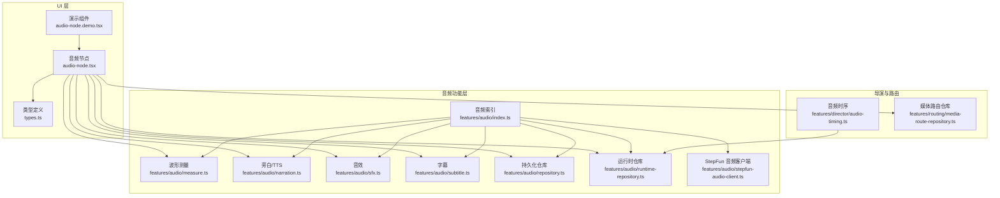
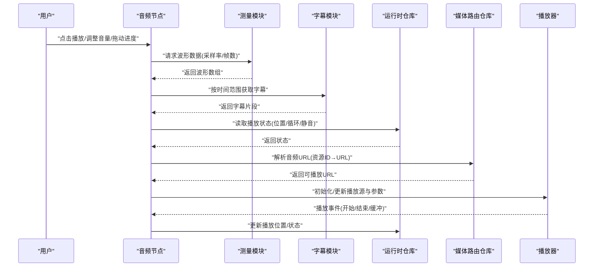
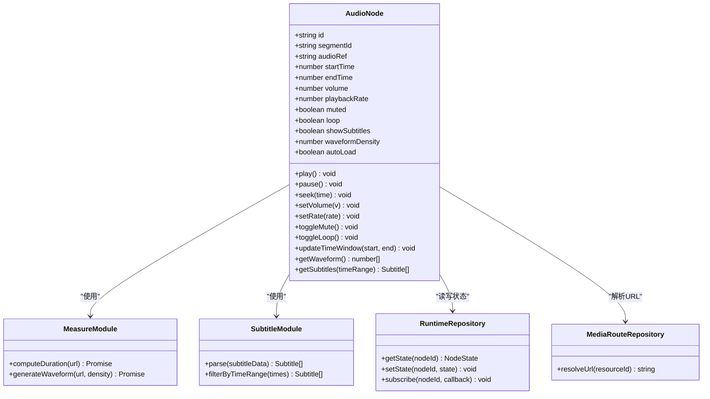
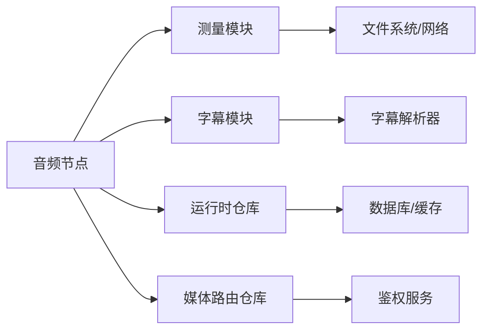

# 音频节点

<cite>
**本文引用的文件**   
- [audio-node.tsx](file://src/components/ui/node/audio-node.tsx)
- [audio-node.demo.tsx](file://src/components/ui/node/audio-node.demo.tsx)
- [types.ts](file://src/components/ui/node/types.ts)
- [index.ts](file://src/features/audio/index.ts)
- [measure.ts](file://src/features/audio/measure.ts)
- [narration.ts](file://src/features/audio/narration.ts)
- [repository.ts](file://src/features/audio/repository.ts)
- [runtime-repository.ts](file://src/features/audio/runtime-repository.ts)
- [subtitle.ts](file://src/features/audio/subtitle.ts)
- [sfx.ts](file://src/features/audio/sfx.ts)
- [stepfun-audio-client.ts](file://src/features/audio/stepfun-audio-client.ts)
- [audio-timing.ts](file://src/features/director/audio-timing.ts)
- [media-route-repository.ts](file://src/features/routing/media-route-repository.ts)
</cite>

## 目录
1. [简介](#简介)
2. [项目结构](#项目结构)
3. [核心组件](#核心组件)
4. [架构总览](#架构总览)
5. [详细组件分析](#详细组件分析)
6. [依赖关系分析](#依赖关系分析)
7. [性能考量](#性能考量)
8. [故障排查指南](#故障排查指南)
9. [结论](#结论)
10. [附录](#附录)

## 简介
本技术文档聚焦于“音频节点”的完整实现与使用，涵盖数据结构、属性配置、渲染逻辑、音频加载与播放控制、波形可视化、连接机制（输入输出端口）、参数调节接口、格式支持、采样率处理、实时预览、示例用法、扩展方式以及性能优化、内存管理与错误处理策略。目标是帮助开发者快速理解并高效使用音频节点，同时为后续扩展与维护提供权威参考。

## 项目结构
音频节点位于前端 UI 层，负责在画布中呈现音频片段、展示波形、提供播放控制和参数调节；其数据与运行时由 features/audio 模块提供，包括测量、字幕、音效、TTS 编排、仓库与客户端等。路由层通过媒体路由仓库将音频资源映射到可访问路径。

**图表来源** 
- [audio-node.tsx](file://src/components/ui/node/audio-node.tsx)
- [audio-node.demo.tsx](file://src/components/ui/node/audio-node.demo.tsx)
- [types.ts](file://src/components/ui/node/types.ts)
- [index.ts](file://src/features/audio/index.ts)
- [measure.ts](file://src/features/audio/measure.ts)
- [narration.ts](file://src/features/audio/narration.ts)
- [sfx.ts](file://src/features/audio/sfx.ts)
- [subtitle.ts](file://src/features/audio/subtitle.ts)
- [repository.ts](file://src/features/audio/repository.ts)
- [runtime-repository.ts](file://src/features/audio/runtime-repository.ts)
- [stepfun-audio-client.ts](file://src/features/audio/stepfun-audio-client.ts)
- [audio-timing.ts](file://src/features/director/audio-timing.ts)
- [media-route-repository.ts](file://src/features/routing/media-route-repository.ts)

**章节来源**
- [audio-node.tsx](file://src/components/ui/node/audio-node.tsx)
- [audio-node.demo.tsx](file://src/components/ui/node/audio-node.demo.tsx)
- [types.ts](file://src/components/ui/node/types.ts)
- [index.ts](file://src/features/audio/index.ts)
- [measure.ts](file://src/features/audio/measure.ts)
- [narration.ts](file://src/features/audio/narration.ts)
- [sfx.ts](file://src/features/audio/sfx.ts)
- [subtitle.ts](file://src/features/audio/subtitle.ts)
- [repository.ts](file://src/features/audio/repository.ts)
- [runtime-repository.ts](file://src/features/audio/runtime-repository.ts)
- [stepfun-audio-client.ts](file://src/features/audio/stepfun-audio-client.ts)
- [audio-timing.ts](file://src/features/director/audio-timing.ts)
- [media-route-repository.ts](file://src/features/routing/media-route-repository.ts)

## 核心组件
- 音频节点（UI）：负责渲染音频块、绘制波形、提供播放/暂停、进度拖动、音量与倍速控制、时间轴裁剪、字幕叠加显示。
- 音频测量（Measure）：计算音频时长、采样点、分帧生成波形数据，支持不同采样率与通道数。
- 旁白与 TTS（Narration）：文本转语音、合成结果管理、与运行时仓库交互。
- 音效（SFX）：短音效加载与播放，支持预加载与缓存。
- 字幕（Subtitle）：时间轴对齐的字幕解析与渲染。
- 仓库（Repository/Runtime Repository）：持久化与运行时状态读写，包含音频元数据、片段信息、播放位置等。
- StepFun 音频客户端：对接外部音频服务，发起生成或获取音频资源。
- 媒体路由（Media Route Repository）：将内部资源 ID 映射为可访问 URL，供播放器与波形绘制使用。
- 音频时序（Audio Timing）：保证多轨音频与画面同步的时间基准与偏移校正。

**章节来源**
- [audio-node.tsx](file://src/components/ui/node/audio-node.tsx)
- [measure.ts](file://src/features/audio/measure.ts)
- [narration.ts](file://src/features/audio/narration.ts)
- [sfx.ts](file://src/features/audio/sfx.ts)
- [subtitle.ts](file://src/features/audio/subtitle.ts)
- [repository.ts](file://src/features/audio/repository.ts)
- [runtime-repository.ts](file://src/features/audio/runtime-repository.ts)
- [stepfun-audio-client.ts](file://src/features/audio/stepfun-audio-client.ts)
- [media-route-repository.ts](file://src/features/routing/media-route-repository.ts)
- [audio-timing.ts](file://src/features/director/audio-timing.ts)

## 架构总览
音频节点作为画布中的可视化与交互单元，向上承接用户操作（播放、裁剪、音量、倍速），向下依赖测量与字幕模块生成可视化数据，并通过仓库与路由模块获取音频资源与元数据。运行时仓库维护播放状态，音频时序确保与视频轨道的对齐。

**图表来源** 
- [audio-node.tsx](file://src/components/ui/node/audio-node.tsx)
- [measure.ts](file://src/features/audio/measure.ts)
- [subtitle.ts](file://src/features/audio/subtitle.ts)
- [runtime-repository.ts](file://src/features/audio/runtime-repository.ts)
- [media-route-repository.ts](file://src/features/routing/media-route-repository.ts)

## 详细组件分析

### 音频节点（UI）
- 数据结构与属性
  - 节点标识、所属片段、音频资源引用、时间窗口（起止时间）、音量、倍速、静音、循环、字幕开关、波形采样密度、是否自动加载。
  - 输入端口：音频片段、字幕片段、时间基准。
  - 输出端口：播放状态、当前时间、波形数据、字幕数据。
- 渲染逻辑
  - 基于测量模块生成的波形数组，使用 Canvas/SVG 绘制波形；根据时间窗口裁剪显示区域。
  - 字幕按时间轴叠加显示，支持滚动与高亮当前行。
  - 播放控件：播放/暂停、进度条拖拽、音量滑块、倍速选择、静音切换。
- 播放控制
  - 使用 HTML5 Audio/Web Audio API 进行解码与播放；根据采样率与通道数适配播放质量。
  - 支持预加载、缓冲提示、错误重试与降级策略。
- 连接机制
  - 通过运行时仓库订阅播放状态变化，与其他节点共享时间线。
  - 媒体路由仓库将资源 ID 转换为可访问 URL，避免跨域与权限问题。
- 参数调节接口
  - 音量、倍速、静音、循环、时间窗口裁剪、波形密度、字幕样式。
- 错误处理
  - 网络错误、解码失败、格式不支持时回退到占位图与提示；记录错误日志并上报。

**图表来源** 
- [audio-node.tsx](file://src/components/ui/node/audio-node.tsx)
- [measure.ts](file://src/features/audio/measure.ts)
- [subtitle.ts](file://src/features/audio/subtitle.ts)
- [runtime-repository.ts](file://src/features/audio/runtime-repository.ts)
- [media-route-repository.ts](file://src/features/routing/media-route-repository.ts)

**章节来源**
- [audio-node.tsx](file://src/components/ui/node/audio-node.tsx)
- [audio-node.demo.tsx](file://src/components/ui/node/audio-node.demo.tsx)
- [types.ts](file://src/components/ui/node/types.ts)

### 音频测量（Measure）
- 功能
  - 计算音频时长、采样点、分帧生成波形数据。
  - 支持不同采样率与通道数的自适应处理。
- 算法复杂度
  - 波形生成通常为 O(N)，N 为采样点数；可通过密度参数降低计算量。
- 优化
  - 按需加载与缓存波形数据；对大文件采用分块处理。
- 错误处理
  - 解码失败时返回空数组并记录错误；支持重试与降级。

**章节来源**
- [measure.ts](file://src/features/audio/measure.ts)

### 旁白与 TTS（Narration）
- 功能
  - 文本转语音合成、结果管理、与运行时仓库交互。
- 集成
  - 通过 StepFun 音频客户端调用外部服务，返回音频资源 ID。
- 错误处理
  - 服务不可用或超时时的重试与降级策略。

**章节来源**
- [narration.ts](file://src/features/audio/narration.ts)
- [stepfun-audio-client.ts](file://src/features/audio/stepfun-audio-client.ts)

### 音效（SFX）
- 功能
  - 短音效加载与播放，支持预加载与缓存。
- 性能
  - 小体积音效优先使用 Web Audio API 提升响应速度。
- 错误处理
  - 加载失败时跳过播放并记录日志。

**章节来源**
- [sfx.ts](file://src/features/audio/sfx.ts)

### 字幕（Subtitle）
- 功能
  - 时间轴对齐的字幕解析与渲染，支持多种格式。
- 性能
  - 按时间窗口过滤字幕，减少渲染压力。
- 错误处理
  - 格式不兼容时回退到默认样式。

**章节来源**
- [subtitle.ts](file://src/features/audio/subtitle.ts)

### 仓库（Repository/Runtime Repository）
- 功能
  - 持久化音频元数据、片段信息、播放位置等；运行时状态读写与订阅。
- 一致性
  - 保证多节点间状态一致，支持撤销/重做。
- 错误处理
  - 读写失败时本地缓存与重试。

**章节来源**
- [repository.ts](file://src/features/audio/repository.ts)
- [runtime-repository.ts](file://src/features/audio/runtime-repository.ts)

### 媒体路由（Media Route Repository）
- 功能
  - 将内部资源 ID 映射为可访问 URL，统一资源访问入口。
- 安全
  - 鉴权与跨域处理。
- 错误处理
  - 资源不存在时返回 404 与友好提示。

**章节来源**
- [media-route-repository.ts](file://src/features/routing/media-route-repository.ts)

### 音频时序（Audio Timing）
- 功能
  - 保证多轨音频与画面同步的时间基准与偏移校正。
- 精度
  - 使用高精度时间戳与帧率对齐。
- 错误处理
  - 时钟漂移检测与补偿。

**章节来源**
- [audio-timing.ts](file://src/features/director/audio-timing.ts)

## 依赖关系分析
音频节点依赖测量、字幕、仓库与路由模块，形成清晰的单向依赖链，避免循环依赖。运行时仓库提供状态订阅，媒体路由仓库提供资源解析，确保 UI 与数据层解耦。

**图表来源** 
- [audio-node.tsx](file://src/components/ui/node/audio-node.tsx)
- [measure.ts](file://src/features/audio/measure.ts)
- [subtitle.ts](file://src/features/audio/subtitle.ts)
- [runtime-repository.ts](file://src/features/audio/runtime-repository.ts)
- [media-route-repository.ts](file://src/features/routing/media-route-repository.ts)

**章节来源**
- [audio-node.tsx](file://src/components/ui/node/audio-node.tsx)
- [measure.ts](file://src/features/audio/measure.ts)
- [subtitle.ts](file://src/features/audio/subtitle.ts)
- [runtime-repository.ts](file://src/features/audio/runtime-repository.ts)
- [media-route-repository.ts](file://src/features/routing/media-route-repository.ts)

## 性能考量
- 波形生成
  - 使用采样密度控制数据量，避免大文件导致卡顿。
  - 缓存已生成的波形数据，减少重复计算。
- 播放性能
  - 预加载与缓冲策略，减少首帧延迟。
  - 使用 Web Audio API 处理短音效，HTML5 Audio 处理长音频。
- 内存管理
  - 及时释放不再使用的音频对象与缓冲区。
  - 限制并发播放数量，避免内存峰值过高。
- 错误处理
  - 网络与解码错误时快速回退，保障用户体验。

[本节为通用指导，无需特定文件来源]

## 故障排查指南
- 常见问题
  - 波形不显示：检查测量模块是否正确生成数据，确认资源 URL 可访问。
  - 播放无声：检查音量、静音、浏览器权限与解码支持。
  - 字幕错位：确认时间轴对齐与字幕格式正确性。
- 调试步骤
  - 查看控制台错误日志与网络请求。
  - 使用运行时仓库订阅状态变化，定位播放位置异常。
  - 逐步禁用功能（如字幕、波形）以隔离问题。
- 恢复策略
  - 重试加载、降级到低分辨率波形、切换到备用音频源。

**章节来源**
- [audio-node.tsx](file://src/components/ui/node/audio-node.tsx)
- [measure.ts](file://src/features/audio/measure.ts)
- [subtitle.ts](file://src/features/audio/subtitle.ts)
- [runtime-repository.ts](file://src/features/audio/runtime-repository.ts)

## 结论
音频节点通过清晰的分层架构与模块化设计，实现了高效的音频加载、播放控制与波形可视化。结合测量、字幕、仓库与路由模块，提供了完整的音频处理能力。遵循性能优化与错误处理策略，可确保在不同场景下的稳定表现。开发者可基于现有接口进行扩展，满足更多定制化需求。

[本节为总结，无需特定文件来源]

## 附录
- 使用示例
  - 创建音频节点实例，设置资源引用与时间窗口。
  - 监听播放事件，更新 UI 状态。
  - 调用测量模块生成波形，渲染到画布。
- 配置选项
  - 音量、倍速、静音、循环、波形密度、字幕样式。
- 自定义扩展
  - 实现新的字幕格式解析器。
  - 接入其他音频服务客户端。
  - 扩展波形渲染样式与交互。

[本节为概念性内容，无需特定文件来源]