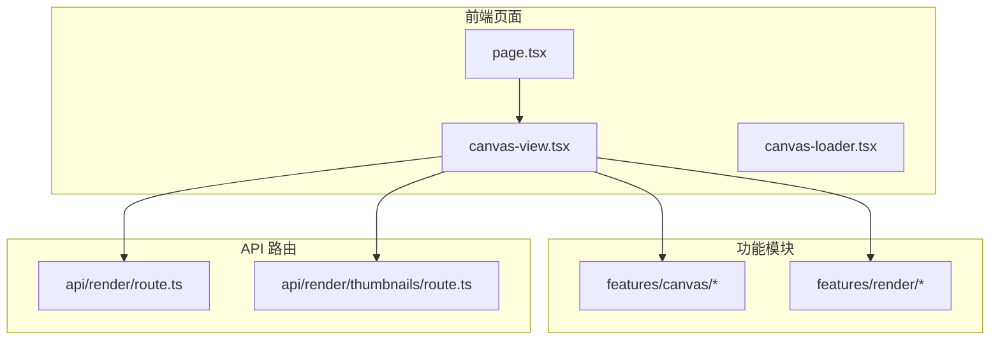
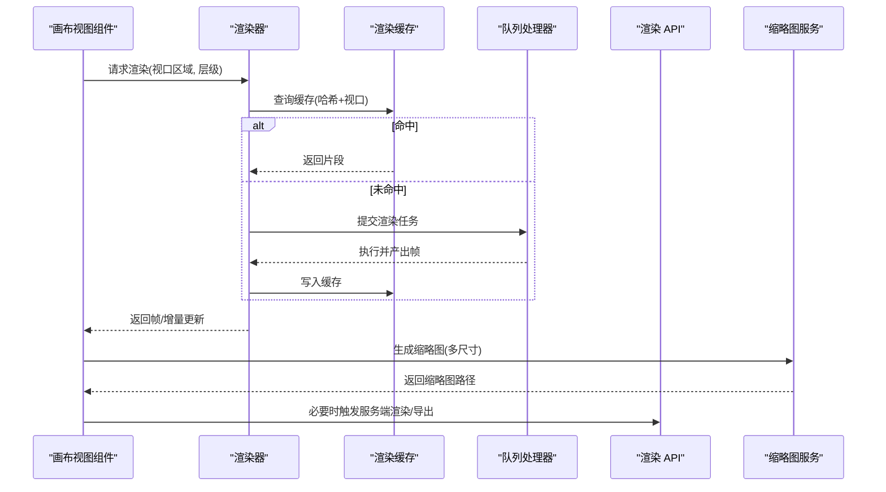
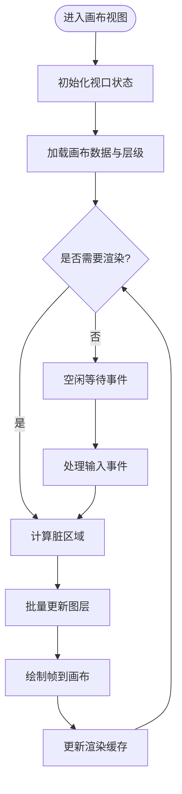
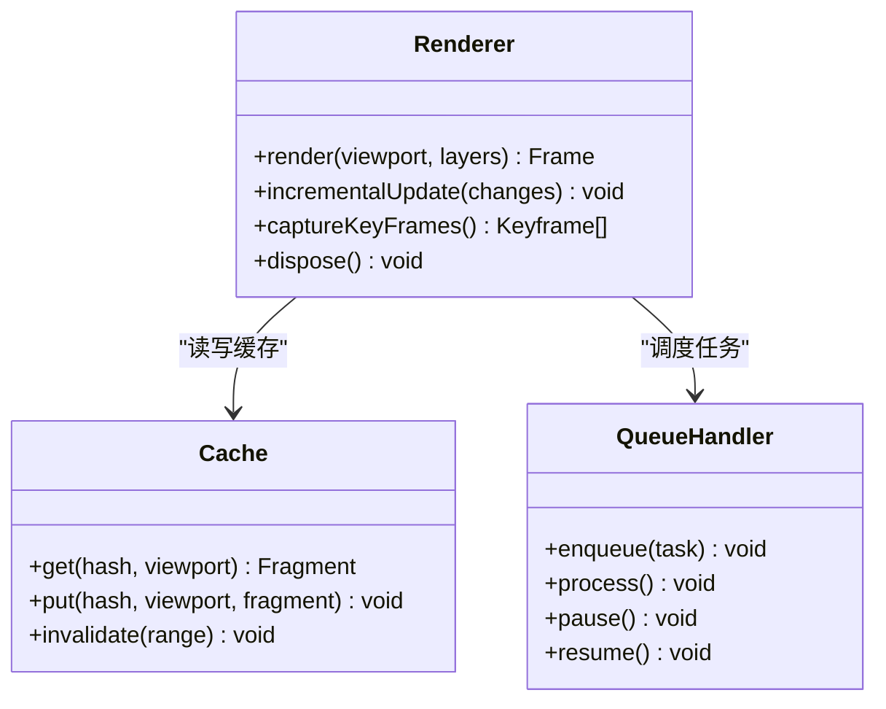
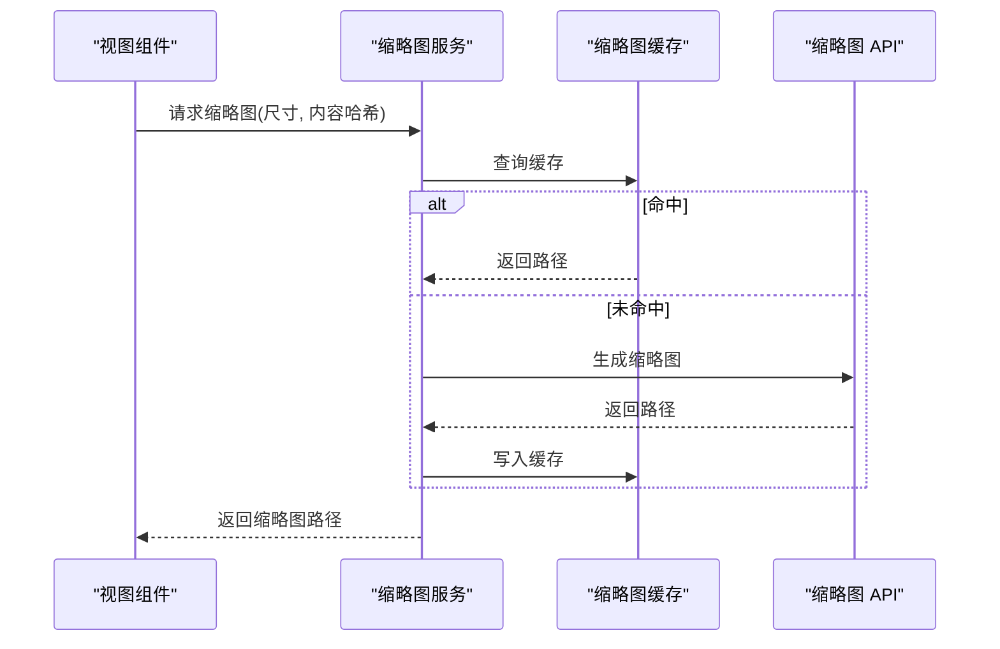
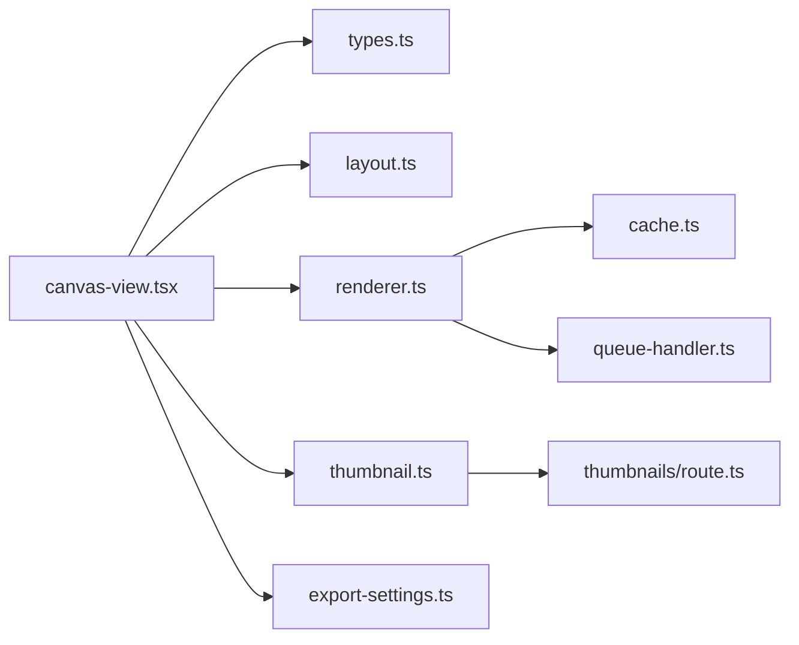

# 预览渲染

<cite>
**本文引用的文件**   
- [src/app/products/(app)/canvas/[projectId]/page.tsx](file://src/app/products/(app)/canvas/[projectId]/page.tsx)
- [src/app/products/(app)/canvas/[projectId]/canvas-view.tsx](file://src/app/products/(app)/canvas/[projectId]/canvas-view.tsx)
- [src/app/products/(app)/canvas/[projectId]/canvas-loader.tsx](file://src/app/products/(app)/canvas/[projectId]/canvas-loader.tsx)
- [src/app/products/(app)/canvas/[projectId]/canvas-action-api.ts](file://src/app/products/(app)/canvas/[projectId]/canvas-action-api.ts)
- [src/features/canvas/index.ts](file://src/features/canvas/index.ts)
- [src/features/canvas/types.ts](file://src/features/canvas/types.ts)
- [src/features/canvas/layout.ts](file://src/features/canvas/layout.ts)
- [src/features/canvas/export-settings.ts](file://src/features/canvas/export-settings.ts)
- [src/features/render/renderer.ts](file://src/features/render/renderer.ts)
- [src/features/render/thumbnail.ts](file://src/features/render/thumbnail.ts)
- [src/features/render/cache.ts](file://src/features/render/cache.ts)
- [src/features/render/frame-capture.ts](file://src/features/render/frame-capture.ts)
- [src/features/render/queue-handler.ts](file://src/features/render/queue-handler.ts)
- [src/app/api/render/route.ts](file://src/app/api/render/route.ts)
- [src/app/api/render/thumbnails/route.ts](file://src/app/api/render/thumbnails/route.ts)
- [src/lib/theme-mode.ts](file://src/lib/theme-mode.ts)
</cite>

## 目录
1. [简介](#简介)
2. [项目结构](#项目结构)
3. [核心组件](#核心组件)
4. [架构总览](#架构总览)
5. [详细组件分析](#详细组件分析)
6. [依赖关系分析](#依赖关系分析)
7. [性能考量](#性能考量)
8. [故障排查指南](#故障排查指南)
9. [结论](#结论)
10. [附录](#附录)

## 简介
本技术文档聚焦于画布预览渲染子系统，覆盖渲染管线设计、视口管理与层次结构、实时预览与增量更新、缩略图生成与最小地图导航、渲染缓存策略、虚拟滚动与大画布支持、渲染定制选项与主题系统样式覆盖，以及跨浏览器兼容性与移动端适配。目标是帮助开发者快速理解并扩展该子系统，同时为产品使用者提供清晰的配置与优化建议。

## 项目结构
画布预览渲染涉及前端页面、功能模块与 API 路由三部分：
- 前端页面层：负责挂载画布视图、加载状态与交互入口。
- 功能模块层：封装画布布局、导出设置、渲染器、缩略图、帧捕获、队列处理等能力。
- API 路由层：暴露渲染与缩略图接口，供前端调用。

图表来源
- [src/app/products/(app)/canvas/[projectId]/page.tsx](file://src/app/products/(app)/canvas/[projectId]/page.tsx)
- [src/app/products/(app)/canvas/[projectId]/canvas-view.tsx](file://src/app/products/(app)/canvas/[projectId]/canvas-view.tsx)
- [src/app/products/(app)/canvas/[projectId]/canvas-loader.tsx](file://src/app/products/(app)/canvas/[projectId]/canvas-loader.tsx)
- [src/features/canvas/index.ts](file://src/features/canvas/index.ts)
- [src/features/render/renderer.ts](file://src/features/render/renderer.ts)
- [src/app/api/render/route.ts](file://src/app/api/render/route.ts)
- [src/app/api/render/thumbnails/route.ts](file://src/app/api/render/thumbnails/route.ts)

章节来源
- [src/app/products/(app)/canvas/[projectId]/page.tsx](file://src/app/products/(app)/canvas/[projectId]/page.tsx)
- [src/app/products/(app)/canvas/[projectId]/canvas-view.tsx](file://src/app/products/(app)/canvas/[projectId]/canvas-view.tsx)
- [src/app/products/(app)/canvas/[projectId]/canvas-loader.tsx](file://src/app/products/(app)/canvas/[projectId]/canvas-loader.tsx)
- [src/features/canvas/index.ts](file://src/features/canvas/index.ts)
- [src/features/render/renderer.ts](file://src/features/render/renderer.ts)
- [src/app/api/render/route.ts](file://src/app/api/render/route.ts)
- [src/app/api/render/thumbnails/route.ts](file://src/app/api/render/thumbnails/route.ts)

## 核心组件
- 画布视图组件：承载画布渲染容器、视口控制、缩放与平移、层级管理、交互事件分发。
- 渲染器：将画布数据转换为可渲染的帧或图像序列，支持增量更新与按需重绘。
- 缩略图服务：生成多尺寸缩略图，用于时间轴、联系表与最小地图导航。
- 帧捕获：从渲染结果中抽取关键帧，用于预览与导出。
- 渲染缓存：基于内容哈希与视口范围缓存已渲染片段，减少重复计算。
- 队列处理器：协调渲染任务、限制并发、保证稳定性与可恢复性。
- 导出设置：定义分辨率、帧率、编码参数与输出格式。
- 主题模式：统一主题变量与样式覆盖，确保跨浏览器一致体验。

章节来源
- [src/features/canvas/types.ts](file://src/features/canvas/types.ts)
- [src/features/canvas/layout.ts](file://src/features/canvas/layout.ts)
- [src/features/canvas/export-settings.ts](file://src/features/canvas/export-settings.ts)
- [src/features/render/renderer.ts](file://src/features/render/renderer.ts)
- [src/features/render/thumbnail.ts](file://src/features/render/thumbnail.ts)
- [src/features/render/frame-capture.ts](file://src/features/render/frame-capture.ts)
- [src/features/render/cache.ts](file://src/features/render/cache.ts)
- [src/features/render/queue-handler.ts](file://src/features/render/queue-handler.ts)
- [src/lib/theme-mode.ts](file://src/lib/theme-mode.ts)

## 架构总览
预览渲染采用“视图-渲染-存储”分层架构：
- 视图层（React 组件）：负责用户交互、视口状态与 UI 反馈。
- 渲染层（Renderer + Cache + Queue）：负责帧生成、增量更新、缓存命中与任务调度。
- 存储层（持久化与缓存）：保存缩略图、关键帧与中间产物，支持离线与快速回放。

图表来源
- [src/app/products/(app)/canvas/[projectId]/canvas-view.tsx](file://src/app/products/(app)/canvas/[projectId]/canvas-view.tsx)
- [src/features/render/renderer.ts](file://src/features/render/renderer.ts)
- [src/features/render/cache.ts](file://src/features/render/cache.ts)
- [src/features/render/queue-handler.ts](file://src/features/render/queue-handler.ts)
- [src/features/render/thumbnail.ts](file://src/features/render/thumbnail.ts)
- [src/app/api/render/route.ts](file://src/app/api/render/route.ts)

## 详细组件分析

### 画布视图与视口管理
- 视口模型：包含视口矩形、缩放比例、平移偏移、旋转角度与层级可见性。
- 层次结构：节点树按层级排序，支持分组、锁定、透明度与混合模式。
- 交互事件：鼠标拖拽平移、滚轮缩放、键盘快捷键、触摸手势。
- 增量更新：仅重绘视口内变化区域，结合脏矩形与差分算法提升性能。

章节来源
- [src/app/products/(app)/canvas/[projectId]/canvas-view.tsx](file://src/app/products/(app)/canvas/[projectId]/canvas-view.tsx)
- [src/features/canvas/layout.ts](file://src/features/canvas/layout.ts)
- [src/features/canvas/types.ts](file://src/features/canvas/types.ts)

### 渲染器与增量更新
- 渲染管线：解析画布数据 -> 构建渲染图 -> 分块裁剪 -> 并行绘制 -> 合成帧。
- 增量更新：基于变更检测与脏区域合并，避免全量重绘。
- 帧序列：支持逐帧生成与关键帧抽取，便于预览与导出。
- 错误隔离：单个节点渲染失败不影响整体流程，记录错误日志并降级显示。

图表来源
- [src/features/render/renderer.ts](file://src/features/render/renderer.ts)
- [src/features/render/cache.ts](file://src/features/render/cache.ts)
- [src/features/render/queue-handler.ts](file://src/features/render/queue-handler.ts)

章节来源
- [src/features/render/renderer.ts](file://src/features/render/renderer.ts)
- [src/features/render/cache.ts](file://src/features/render/cache.ts)
- [src/features/render/queue-handler.ts](file://src/features/render/queue-handler.ts)

### 缩略图生成与最小地图导航
- 多尺寸缩略图：根据用途生成不同分辨率，平衡清晰度与体积。
- 最小地图：基于缩略图构建概览导航，支持跳转与定位。
- 懒加载：仅在需要时生成与缓存缩略图，降低初始负载。

图表来源
- [src/features/render/thumbnail.ts](file://src/features/render/thumbnail.ts)
- [src/app/api/render/thumbnails/route.ts](file://src/app/api/render/thumbnails/route.ts)

章节来源
- [src/features/render/thumbnail.ts](file://src/features/render/thumbnail.ts)
- [src/app/api/render/thumbnails/route.ts](file://src/app/api/render/thumbnails/route.ts)

### 帧捕获与关键帧抽取
- 帧捕获：从渲染结果中提取指定时间点的帧，支持 PNG/JPEG/WebP。
- 关键帧：基于内容变化阈值与时间间隔选择关键帧，减少冗余。
- 预览流：将关键帧序列打包为轻量预览流，提升交互响应。

章节来源
- [src/features/render/frame-capture.ts](file://src/features/render/frame-capture.ts)

### 渲染缓存策略
- 缓存键：由内容哈希与视口范围组成，确保精确命中。
- 缓存粒度：支持整帧、分块与图层级缓存，灵活权衡内存与速度。
- 失效策略：基于时间、版本与变更事件主动失效，保持一致性。

章节来源
- [src/features/render/cache.ts](file://src/features/render/cache.ts)

### 导出设置与输出格式
- 分辨率与帧率：支持自定义分辨率、帧率与宽高比。
- 编码参数：比特率、质量、编码器选择与兼容性开关。
- 输出格式：MP4、WebM、GIF、PNG 序列等。

章节来源
- [src/features/canvas/export-settings.ts](file://src/features/canvas/export-settings.ts)

### 主题系统与样式覆盖
- 主题变量：颜色、字体、间距、阴影等统一变量。
- 动态切换：运行时切换主题，影响渲染外观与 UI 控件。
- 样式覆盖：允许通过 CSS 变量或类名覆盖默认样式。

章节来源
- [src/lib/theme-mode.ts](file://src/lib/theme-mode.ts)

## 依赖关系分析
- 视图组件依赖画布类型与布局模块，确保数据结构与渲染逻辑一致。
- 渲染器依赖缓存与队列处理器，实现高性能与稳定调度。
- 缩略图服务依赖缓存与 API 路由，提供一致的缩略图获取路径。
- 导出设置独立于渲染器，便于扩展新格式与参数。

图表来源
- [src/app/products/(app)/canvas/[projectId]/canvas-view.tsx](file://src/app/products/(app)/canvas/[projectId]/canvas-view.tsx)
- [src/features/canvas/types.ts](file://src/features/canvas/types.ts)
- [src/features/canvas/layout.ts](file://src/features/canvas/layout.ts)
- [src/features/render/renderer.ts](file://src/features/render/renderer.ts)
- [src/features/render/cache.ts](file://src/features/render/cache.ts)
- [src/features/render/queue-handler.ts](file://src/features/render/queue-handler.ts)
- [src/features/render/thumbnail.ts](file://src/features/render/thumbnail.ts)
- [src/app/api/render/thumbnails/route.ts](file://src/app/api/render/thumbnails/route.ts)
- [src/features/canvas/export-settings.ts](file://src/features/canvas/export-settings.ts)

章节来源
- [src/app/products/(app)/canvas/[projectId]/canvas-view.tsx](file://src/app/products/(app)/canvas/[projectId]/canvas-view.tsx)
- [src/features/canvas/types.ts](file://src/features/canvas/types.ts)
- [src/features/canvas/layout.ts](file://src/features/canvas/layout.ts)
- [src/features/render/renderer.ts](file://src/features/render/renderer.ts)
- [src/features/render/cache.ts](file://src/features/render/cache.ts)
- [src/features/render/queue-handler.ts](file://src/features/render/queue-handler.ts)
- [src/features/render/thumbnail.ts](file://src/features/render/thumbnail.ts)
- [src/app/api/render/thumbnails/route.ts](file://src/app/api/render/thumbnails/route.ts)
- [src/features/canvas/export-settings.ts](file://src/features/canvas/export-settings.ts)

## 性能考量
- 视口裁剪：仅渲染可见区域，减少 GPU/CPU 压力。
- 增量更新：基于脏区域与差分算法，避免全量重绘。
- 缓存复用：合理设置缓存粒度与失效策略，提高命中率。
- 并发控制：队列处理器限制渲染任务并发，防止阻塞。
- 资源加载：懒加载与预取策略平衡首屏与交互延迟。
- 大画布支持：虚拟滚动与分块渲染，避免内存溢出。

[本节为通用指导，不直接分析具体文件]

## 故障排查指南
- 渲染卡顿：检查视口裁剪是否生效、缓存命中率与队列并发设置。
- 缩略图缺失：确认缩略图缓存与 API 路由是否正常，检查内容哈希一致性。
- 主题异常：验证主题变量注入与样式覆盖优先级。
- 导出失败：核对导出设置参数与编码器兼容性。

章节来源
- [src/app/api/render/route.ts](file://src/app/api/render/route.ts)
- [src/app/api/render/thumbnails/route.ts](file://src/app/api/render/thumbnails/route.ts)
- [src/lib/theme-mode.ts](file://src/lib/theme-mode.ts)

## 结论
画布预览渲染子系统通过分层架构与精细化缓存策略，实现了高性能、可扩展与稳定的预览体验。视图层与渲染层解耦，便于独立优化与扩展；缩略图与帧捕获为导航与导出提供了基础能力；主题系统与导出设置增强了定制化能力。建议在大规模场景下进一步引入虚拟滚动与分块渲染，以支撑超大画布与复杂层级。

[本节为总结，不直接分析具体文件]

## 附录
- 最佳实践：优先使用增量更新与视口裁剪，合理设置缓存粒度。
- 兼容性：测试主流浏览器与移动端设备，确保渲染一致。
- 监控：收集渲染耗时、缓存命中率与错误日志，持续优化性能。

[本节为补充信息，不直接分析具体文件]