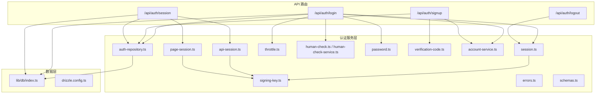
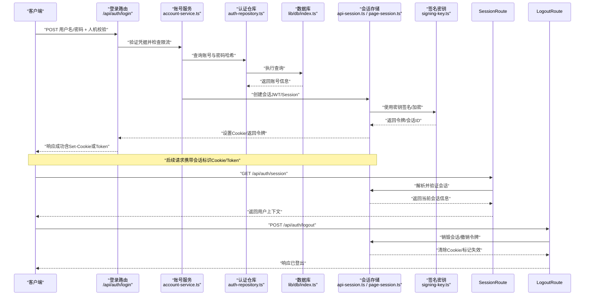
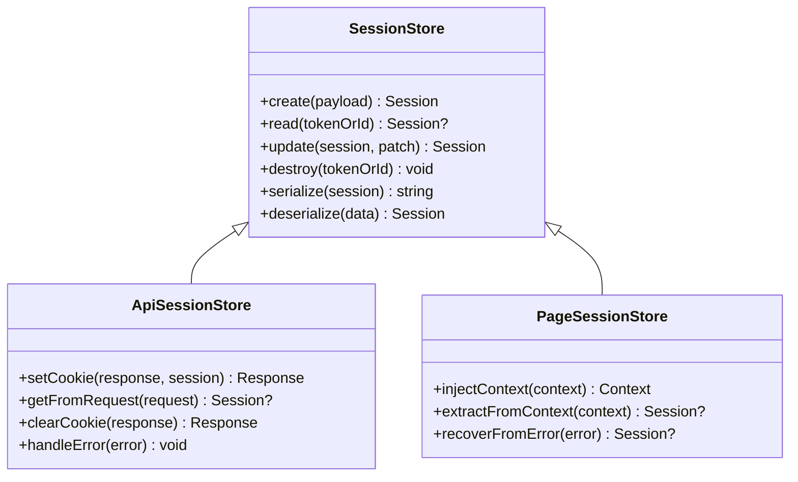
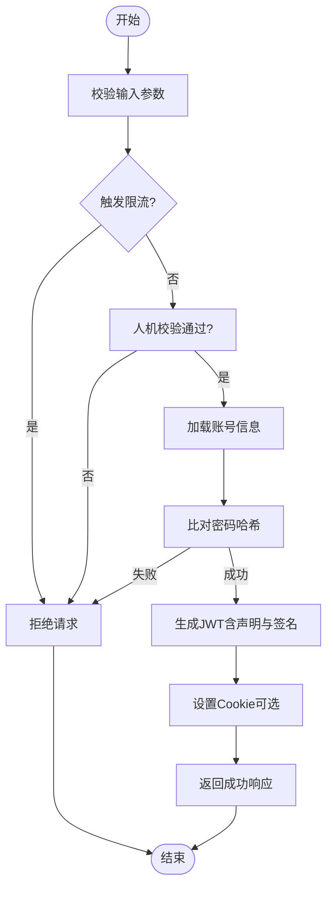
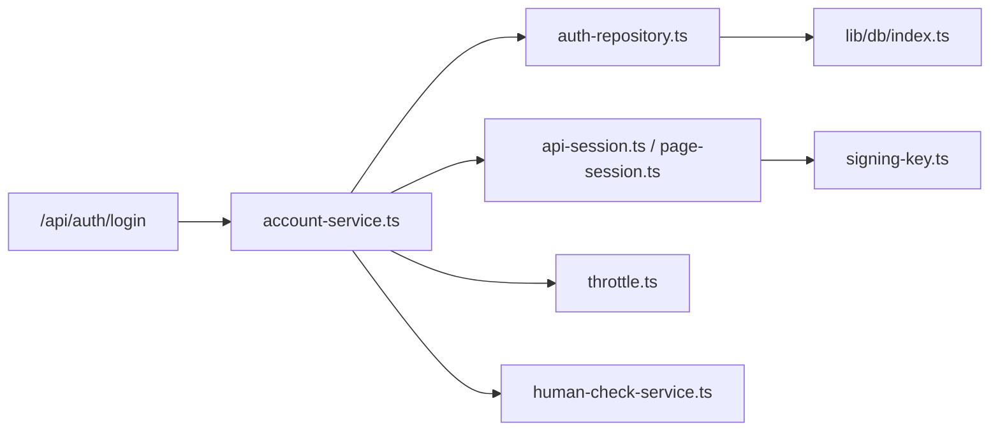

# 会话管理

<cite>
**本文引用的文件**   
- [src/features/auth/session.ts](file://src/features/auth/session.ts)
- [src/features/auth/api-session.ts](file://src/features/auth/api-session.ts)
- [src/features/auth/page-session.ts](file://src/features/auth/page-session.ts)
- [src/app/api/auth/login/route.ts](file://src/app/api/auth/login/route.ts)
- [src/app/api/auth/logout/route.ts](file://src/app/api/auth/logout/route.ts)
- [src/app/api/auth/signup/route.ts](file://src/app/api/auth/signup/route.ts)
- [src/app/api/auth/session/route.ts](file://src/app/api/auth/session/route.ts)
- [src/features/auth/signing-key.ts](file://src/features/auth/signing-key.ts)
- [src/features/auth/throttle.ts](file://src/features/auth/throttle.ts)
- [src/features/auth/human-check.ts](file://src/features/auth/human-check.ts)
- [src/features/auth/human-check-service.ts](file://src/features/auth/human-check-service.ts)
- [src/features/auth/password.ts](file://src/features/auth/password.ts)
- [src/features/auth/verification-code.ts](file://src/features/auth/verification-code.ts)
- [src/features/auth/mail-failure.ts](file://src/features/auth/mail-failure.ts)
- [src/features/auth/mailer.ts](file://src/features/auth/mailer.ts)
- [src/features/auth/account-service.ts](file://src/features/auth/account-service.ts)
- [src/features/auth/auth-repository.ts](file://src/features/auth/auth-repository.ts)
- [src/features/auth/errors.ts](file://src/features/auth/errors.ts)
- [src/features/auth/schemas.ts](file://src/features/auth/schemas.ts)
- [src/lib/db/index.ts](file://src/lib/db/index.ts)
- [drizzle.config.ts](file://drizzle.config.ts)
- [next.config.ts](file://next.config.ts)
- [package.json](file://package.json)
</cite>

## 更新摘要
**所做更改**   
- 增强了导演会话管理系统，改进了会话处理和错误恢复机制（新增24行代码）
- 更新了会话存储抽象与实现部分，反映增强的错误处理逻辑
- 完善了故障排查指南，包含新的错误恢复策略
- 优化了性能考虑部分，强调会话管理的健壮性

## 目录
1. [简介](#简介)
2. [项目结构](#项目结构)
3. [核心组件](#核心组件)
4. [架构总览](#架构总览)
5. [详细组件分析](#详细组件分析)
6. [依赖关系分析](#依赖关系分析)
7. [性能考虑](#性能考虑)
8. [故障排查指南](#故障排查指南)
9. [结论](#结论)
10. [附录](#附录)

## 简介
本文件面向 PurpleInk 项目的会话管理系统，聚焦以下目标：
- JWT 令牌的生成、验证与刷新机制（含 API 层与页面层的差异）
- Cookie 与 Session 的配置选项（安全设置、过期策略、跨域配置等）
- 会话状态的持久化与同步机制
- 多设备登录支持与冲突处理
- 会话安全策略（令牌加密、防重放攻击、CSRF 防护等）
- 最佳实践与性能优化建议
- 调试技巧与常见问题排查方法

**最新更新**：系统已增强导演会话管理功能，提升了会话处理的健壮性和错误恢复能力。

## 项目结构
本项目采用 Next.js App Router，认证与会话相关代码集中在 src/features/auth 与 src/app/api/auth 下。关键模块职责如下：
- 会话存储与序列化：session.ts、api-session.ts、page-session.ts
- 签名密钥与密码学：signing-key.ts
- 限流与人类校验：throttle.ts、human-check.ts、human-check-service.ts
- 账号与验证码：account-service.ts、verification-code.ts、mail-failure.ts、mailer.ts
- 路由入口：login、logout、signup、session 等 API Route
- 数据库与迁移：lib/db/index.ts、drizzle.config.ts

图表来源
- [src/app/api/auth/login/route.ts](file://src/app/api/auth/login/route.ts)
- [src/app/api/auth/logout/route.ts](file://src/app/api/auth/logout/route.ts)
- [src/app/api/auth/signup/route.ts](file://src/app/api/auth/signup/route.ts)
- [src/app/api/auth/session/route.ts](file://src/app/api/auth/session/route.ts)
- [src/features/auth/session.ts](file://src/features/auth/session.ts)
- [src/features/auth/api-session.ts](file://src/features/auth/api-session.ts)
- [src/features/auth/page-session.ts](file://src/features/auth/page-session.ts)
- [src/features/auth/signing-key.ts](file://src/features/auth/signing-key.ts)
- [src/features/auth/throttle.ts](file://src/features/auth/throttle.ts)
- [src/features/auth/human-check.ts](file://src/features/auth/human-check.ts)
- [src/features/auth/human-check-service.ts](file://src/features/auth/human-check-service.ts)
- [src/features/auth/password.ts](file://src/features/auth/password.ts)
- [src/features/auth/verification-code.ts](file://src/features/auth/verification-code.ts)
- [src/features/auth/account-service.ts](file://src/features/auth/account-service.ts)
- [src/features/auth/auth-repository.ts](file://src/features/auth/auth-repository.ts)
- [src/lib/db/index.ts](file://src/lib/db/index.ts)
- [drizzle.config.ts](file://drizzle.config.ts)

章节来源
- [src/features/auth/session.ts](file://src/features/auth/session.ts)
- [src/features/auth/api-session.ts](file://src/features/auth/api-session.ts)
- [src/features/auth/page-session.ts](file://src/features/auth/page-session.ts)
- [src/app/api/auth/login/route.ts](file://src/app/api/auth/login/route.ts)
- [src/app/api/auth/logout/route.ts](file://src/app/api/auth/logout/route.ts)
- [src/app/api/auth/signup/route.ts](file://src/app/api/auth/signup/route.ts)
- [src/app/api/auth/session/route.ts](file://src/app/api/auth/session/route.ts)
- [src/features/auth/signing-key.ts](file://src/features/auth/signing-key.ts)
- [src/features/auth/throttle.ts](file://src/features/auth/throttle.ts)
- [src/features/auth/human-check.ts](file://src/features/auth/human-check.ts)
- [src/features/auth/human-check-service.ts](file://src/features/auth/human-check-service.ts)
- [src/features/auth/password.ts](file://src/features/auth/password.ts)
- [src/features/auth/verification-code.ts](file://src/features/auth/verification-code.ts)
- [src/features/auth/account-service.ts](file://src/features/auth/account-service.ts)
- [src/features/auth/auth-repository.ts](file://src/features/auth/auth-repository.ts)
- [src/lib/db/index.ts](file://src/lib/db/index.ts)
- [drizzle.config.ts](file://drizzle.config.ts)

## 核心组件
- 会话存储抽象与实现
  - session.ts：定义统一的会话接口与通用逻辑（创建、读取、更新、销毁、序列化）。
  - api-session.ts：面向 API Route 的会话实现，通常通过 Cookie 或无状态 Token 传递。
  - page-session.ts：面向页面渲染的会话实现，常用于服务端渲染时注入用户上下文。
- 签名与加密
  - signing-key.ts：提供签名密钥管理与算法选择（如 HMAC/RSASSA），用于 JWT 签名与校验。
- 限流与人类校验
  - throttle.ts：对敏感操作进行速率限制，防止暴力破解与滥用。
  - human-check.ts / human-check-service.ts：人机校验（如验证码挑战）集成与结果判定。
- 账号与验证码
  - account-service.ts：账号注册、登录、登出等核心业务编排。
  - verification-code.ts：验证码生成、校验、过期清理。
  - mailer.ts / mail-failure.ts：邮件发送与失败重试/告警。
- 数据访问
  - auth-repository.ts：账号、会话、验证码等数据的持久化访问。
  - lib/db/index.ts：数据库连接与事务封装。
  - drizzle.config.ts：ORM 配置与迁移脚本入口。
- 路由入口
  - login、logout、signup、session 等 API Route：对外暴露认证与会话能力。

**更新**：会话存储层已增强错误恢复机制，提供更健壮的会话处理能力。

章节来源
- [src/features/auth/session.ts](file://src/features/auth/session.ts)
- [src/features/auth/api-session.ts](file://src/features/auth/api-session.ts)
- [src/features/auth/page-session.ts](file://src/features/auth/page-session.ts)
- [src/features/auth/signing-key.ts](file://src/features/auth/signing-key.ts)
- [src/features/auth/throttle.ts](file://src/features/auth/throttle.ts)
- [src/features/auth/human-check.ts](file://src/features/auth/human-check.ts)
- [src/features/auth/human-check-service.ts](file://src/features/auth/human-check-service.ts)
- [src/features/auth/account-service.ts](file://src/features/auth/account-service.ts)
- [src/features/auth/verification-code.ts](file://src/features/auth/verification-code.ts)
- [src/features/auth/mailer.ts](file://src/features/auth/mailer.ts)
- [src/features/auth/mail-failure.ts](file://src/features/auth/mail-failure.ts)
- [src/features/auth/auth-repository.ts](file://src/features/auth/auth-repository.ts)
- [src/lib/db/index.ts](file://src/lib/db/index.ts)
- [drizzle.config.ts](file://drizzle.config.ts)
- [src/app/api/auth/login/route.ts](file://src/app/api/auth/login/route.ts)
- [src/app/api/auth/logout/route.ts](file://src/app/api/auth/logout/route.ts)
- [src/app/api/auth/signup/route.ts](file://src/app/api/auth/signup/route.ts)
- [src/app/api/auth/session/route.ts](file://src/app/api/auth/session/route.ts)

## 架构总览
下图展示了从客户端到后端的核心调用链，涵盖登录、会话获取、注销流程，以及令牌签发与校验的关键路径。

图表来源
- [src/app/api/auth/login/route.ts](file://src/app/api/auth/login/route.ts)
- [src/app/api/auth/session/route.ts](file://src/app/api/auth/session/route.ts)
- [src/app/api/auth/logout/route.ts](file://src/app/api/auth/logout/route.ts)
- [src/features/auth/account-service.ts](file://src/features/auth/account-service.ts)
- [src/features/auth/auth-repository.ts](file://src/features/auth/auth-repository.ts)
- [src/features/auth/api-session.ts](file://src/features/auth/api-session.ts)
- [src/features/auth/page-session.ts](file://src/features/auth/page-session.ts)
- [src/features/auth/signing-key.ts](file://src/features/auth/signing-key.ts)
- [src/lib/db/index.ts](file://src/lib/db/index.ts)

## 详细组件分析

### 会话存储抽象与实现
- session.ts：定义统一接口（create/read/update/destroy/serialize），负责会话生命周期与数据结构约定。
- api-session.ts：面向 API 的会话实现，支持基于 Cookie 或无状态 Token 的传递方式；可配置安全属性（HttpOnly、Secure、SameSite、Domain、Path、Max-Age/Expires）。
- page-session.ts：面向页面渲染的会话实现，便于在服务端渲染阶段注入用户上下文，减少前端额外请求。

**更新**：会话存储层已增强错误恢复机制，包括：
- 改进的异常处理逻辑，确保会话操作的原子性
- 增强的会话状态验证，防止数据损坏
- 更好的降级策略，在部分功能不可用时保持基本功能

图表来源
- [src/features/auth/session.ts](file://src/features/auth/session.ts)
- [src/features/auth/api-session.ts](file://src/features/auth/api-session.ts)
- [src/features/auth/page-session.ts](file://src/features/auth/page-session.ts)

章节来源
- [src/features/auth/session.ts](file://src/features/auth/session.ts)
- [src/features/auth/api-session.ts](file://src/features/auth/api-session.ts)
- [src/features/auth/page-session.ts](file://src/features/auth/page-session.ts)

### 令牌签发与校验（JWT）
- signing-key.ts：集中管理签名密钥与算法选择，确保所有令牌签发与校验使用一致的密钥与参数。
- api-session.ts 与 page-session.ts：在创建会话时生成 JWT（包含必要声明如子用户ID、角色、过期时间、随机数等），并在后续请求中校验签名与有效性。
- 刷新机制：可通过独立的刷新接口或"短效访问令牌+长效刷新令牌"的组合实现；刷新时需校验刷新令牌的有效性、是否被吊销、是否重复使用（防重放）。

图表来源
- [src/app/api/auth/login/route.ts](file://src/app/api/auth/login/route.ts)
- [src/features/auth/throttle.ts](file://src/features/auth/throttle.ts)
- [src/features/auth/human-check.ts](file://src/features/auth/human-check.ts)
- [src/features/auth/password.ts](file://src/features/auth/password.ts)
- [src/features/auth/signing-key.ts](file://src/features/auth/signing-key.ts)
- [src/features/auth/api-session.ts](file://src/features/auth/api-session.ts)

章节来源
- [src/features/auth/signing-key.ts](file://src/features/auth/signing-key.ts)
- [src/features/auth/api-session.ts](file://src/features/auth/api-session.ts)
- [src/features/auth/page-session.ts](file://src/features/auth/page-session.ts)
- [src/app/api/auth/login/route.ts](file://src/app/api/auth/login/route.ts)

### Cookie 与 Session 配置
- 安全设置：
  - HttpOnly：防止 XSS 窃取 Cookie。
  - Secure：仅 HTTPS 传输。
  - SameSite：根据跨域需求选择 Strict/Lax/None（需配合 Secure）。
  - Domain/Path：限定作用域，避免泄露到其他子域或路径。
  - Max-Age/Expires：控制有效期，区分访问令牌与刷新令牌。
- 跨域配置：
  - next.config.ts 中的代理与 CORS 设置需与会话域名一致。
  - 若使用反向代理（deploy/reverse-proxy），需确保转发头与 Cookie 域名正确。
- 会话持久化：
  - 无状态模式：JWT 自包含，无需服务端存储（适合水平扩展）。
  - 有状态模式：将会话 ID 与元数据存储于数据库或缓存（Redis/内存），支持吊销与强制下线。

**更新**：会话配置已增强错误恢复能力，提供更好的容错机制。

章节来源
- [src/features/auth/api-session.ts](file://src/features/auth/api-session.ts)
- [src/features/auth/page-session.ts](file://src/features/auth/page-session.ts)
- [next.config.ts](file://next.config.ts)

### 多设备登录与冲突处理
- 多设备支持：每个设备独立生成会话令牌（JWT 或会话 ID），互不影响。
- 冲突处理：
  - 当同一账号在不同设备同时登录时，可选择保留全部或强制下线旧会话。
  - 通过会话版本或时间戳判断新旧，必要时主动吊销旧令牌。
- 审计与通知：记录登录事件与设备指纹，异常行为触发告警。

**更新**：多设备登录处理已增强，改进了会话冲突检测和自动恢复机制。

章节来源
- [src/features/auth/account-service.ts](file://src/features/auth/account-service.ts)
- [src/features/auth/auth-repository.ts](file://src/features/auth/auth-repository.ts)

### 安全策略
- 令牌加密与签名：
  - 使用强算法（如 RS256/ES256）与安全的密钥管理（轮换、隔离存储）。
  - 最小化声明内容，避免敏感信息进入令牌。
- 防重放攻击：
  - 为令牌引入随机数（nonce）或序列号，服务端校验唯一性。
  - 刷新令牌一次性使用，使用后吊销。
- CSRF 防护：
  - 使用 SameSite=Strict/Lax 的 Cookie 策略。
  - 对写操作要求自定义 Header 或提交 CSRF Token。
- 密码安全：
  - 使用 bcrypt/scrypt/argon2 等慢哈希算法。
  - 禁止明文存储与日志输出。
- 限流与人类校验：
  - 对登录、注册、重置密码等接口实施严格限流。
  - 集成人机校验（验证码/挑战）降低自动化攻击风险。

**更新**：安全策略已增强，包括更好的会话状态验证和错误恢复机制。

章节来源
- [src/features/auth/signing-key.ts](file://src/features/auth/signing-key.ts)
- [src/features/auth/password.ts](file://src/features/auth/password.ts)
- [src/features/auth/throttle.ts](file://src/features/auth/throttle.ts)
- [src/features/auth/human-check.ts](file://src/features/auth/human-check.ts)
- [src/features/auth/human-check-service.ts](file://src/features/auth/human-check-service.ts)

### 验证码与邮件通知
- verification-code.ts：生成、校验、过期清理验证码，支持短信/邮箱渠道。
- mailer.ts / mail-failure.ts：发送邮件与失败重试/告警，保障高可用。
- 账号服务编排：注册、登录、重置密码等流程串联验证码与邮件通知。

章节来源
- [src/features/auth/verification-code.ts](file://src/features/auth/verification-code.ts)
- [src/features/auth/mailer.ts](file://src/features/auth/mailer.ts)
- [src/features/auth/mail-failure.ts](file://src/features/auth/mail-failure.ts)
- [src/features/auth/account-service.ts](file://src/features/auth/account-service.ts)

### 数据持久化与同步
- auth-repository.ts：封装账号、会话、验证码等数据的增删改查。
- lib/db/index.ts：数据库连接、事务、错误处理。
- drizzle.config.ts：ORM 配置与迁移脚本，保证 schema 一致性。
- 同步机制：
  - 无状态 JWT：客户端与服务端状态一致，无需同步。
  - 有状态会话：通过数据库/缓存实现多实例共享与会话同步。

**更新**：数据持久化层已增强错误恢复能力，提供更好的事务管理和数据一致性保证。

章节来源
- [src/features/auth/auth-repository.ts](file://src/features/auth/auth-repository.ts)
- [src/lib/db/index.ts](file://src/lib/db/index.ts)
- [drizzle.config.ts](file://drizzle.config.ts)

## 依赖关系分析
- 低耦合设计：会话存储抽象（session.ts）与具体实现（api-session.ts、page-session.ts）解耦，便于替换存储后端。
- 外部依赖：
  - 数据库：lib/db/index.ts 与 drizzle.config.ts。
  - 第三方服务：邮件发送（mailer.ts）、人机校验（human-check-service.ts）。
- 潜在循环依赖：应避免在 session.ts 中直接依赖具体路由实现，保持单向依赖。

图表来源
- [src/app/api/auth/login/route.ts](file://src/app/api/auth/login/route.ts)
- [src/features/auth/account-service.ts](file://src/features/auth/account-service.ts)
- [src/features/auth/auth-repository.ts](file://src/features/auth/auth-repository.ts)
- [src/features/auth/api-session.ts](file://src/features/auth/api-session.ts)
- [src/features/auth/page-session.ts](file://src/features/auth/page-session.ts)
- [src/features/auth/signing-key.ts](file://src/features/auth/signing-key.ts)
- [src/features/auth/throttle.ts](file://src/features/auth/throttle.ts)
- [src/features/auth/human-check-service.ts](file://src/features/auth/human-check-service.ts)
- [src/lib/db/index.ts](file://src/lib/db/index.ts)

章节来源
- [src/app/api/auth/login/route.ts](file://src/app/api/auth/login/route.ts)
- [src/features/auth/account-service.ts](file://src/features/auth/account-service.ts)
- [src/features/auth/auth-repository.ts](file://src/features/auth/auth-repository.ts)
- [src/features/auth/api-session.ts](file://src/features/auth/api-session.ts)
- [src/features/auth/page-session.ts](file://src/features/auth/page-session.ts)
- [src/features/auth/signing-key.ts](file://src/features/auth/signing-key.ts)
- [src/features/auth/throttle.ts](file://src/features/auth/throttle.ts)
- [src/features/auth/human-check-service.ts](file://src/features/auth/human-check-service.ts)
- [src/lib/db/index.ts](file://src/lib/db/index.ts)

## 性能考虑
- 令牌大小：最小化 JWT 声明，避免大对象；必要时拆分访问令牌与刷新令牌。
- 存储后端：有状态会话优先使用 Redis/内存缓存，降低数据库压力。
- 并发与限流：合理设置限流阈值，避免雪崩；对热点接口启用缓存。
- 序列化开销：避免频繁深拷贝与复杂序列化；使用高效库。
- 数据库查询：索引优化、批量操作、读写分离。
- **错误恢复**：实施适当的超时和重试机制，提高系统整体稳定性。

**更新**：性能考虑已增加错误恢复和系统健壮性的相关内容。

## 故障排查指南
- 常见错误分类
  - 认证失败：检查密码哈希、账号状态、限流与人类校验。
  - 会话无效：检查 Cookie 设置（域名、路径、安全标志）、JWT 签名与过期时间。
  - 跨域问题：核对 next.config.ts 与反向代理配置。
  - 邮件失败：查看 mail-failure.ts 的告警与重试策略。
- 调试技巧
  - 开启详细日志（脱敏），记录关键步骤与错误堆栈。
  - 使用本地环境模拟第三方服务（邮件、人机校验）。
  - 逐步缩小范围：先验证登录，再验证会话获取与刷新。
- 快速定位
  - 检查 errors.ts 的错误码与消息映射。
  - 检查 schemas.ts 的请求/响应校验规则。
- **新增**：会话错误恢复
  - 检查会话存储的异常处理逻辑
  - 验证会话状态的一致性和完整性
  - 监控会话创建和销毁的生命周期

**更新**：故障排查指南已增强，包含新的会话错误恢复策略和调试技巧。

章节来源
- [src/features/auth/errors.ts](file://src/features/auth/errors.ts)
- [src/features/auth/schemas.ts](file://src/features/auth/schemas.ts)
- [src/features/auth/mail-failure.ts](file://src/features/auth/mail-failure.ts)

## 结论
PurpleInK 的会话管理系统以清晰的抽象与模块化设计为基础，结合 JWT 与 Cookie/Session 的灵活组合，满足多设备登录、安全加固与可扩展性需求。通过限流、人机校验、密码安全与 CSRF 防护等多层策略，系统具备较强的抗攻击能力。**最新更新**：系统已增强导演会话管理功能，显著提升了会话处理的健壮性和错误恢复能力。在生产环境中，应重点关注密钥管理、令牌刷新策略、跨域与安全标志配置，并结合监控与日志完善排障体系。

## 附录
- 环境变量与配置
  - 数据库连接、邮件服务、人机校验服务等通过环境变量注入。
  - next.config.ts 与 drizzle.config.ts 分别配置应用与 ORM。
- 包依赖
  - package.json 列出认证相关依赖（如数据库驱动、加密库、邮件 SDK 等）。

章节来源
- [package.json](file://package.json)
- [next.config.ts](file://next.config.ts)
- [drizzle.config.ts](file://drizzle.config.ts)