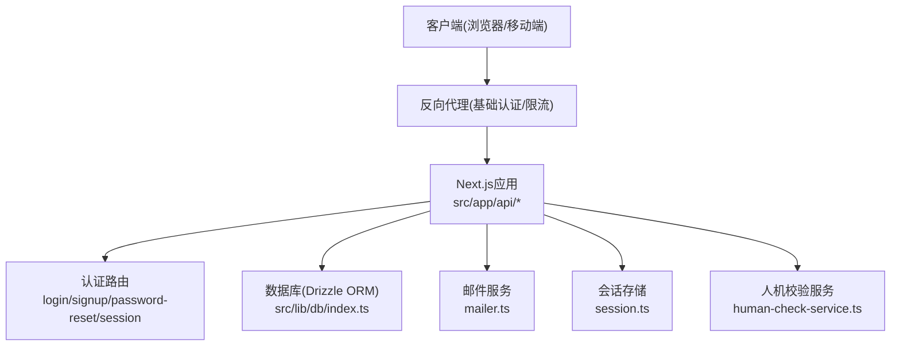
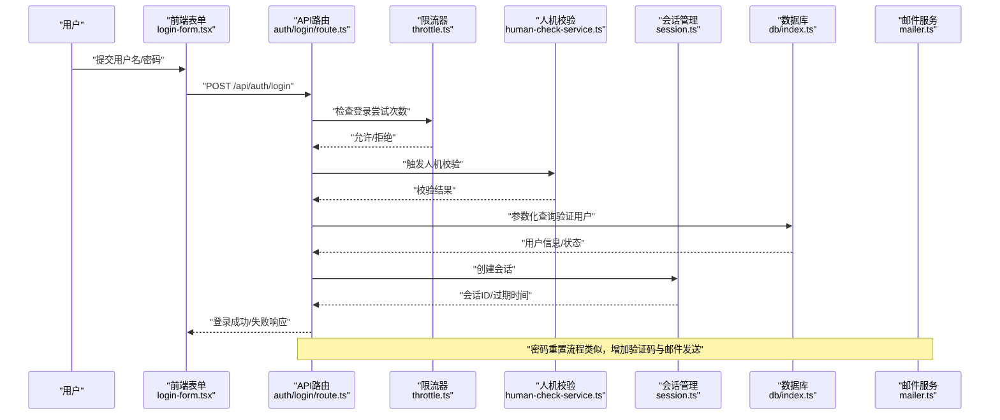
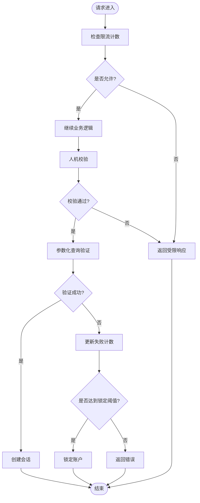
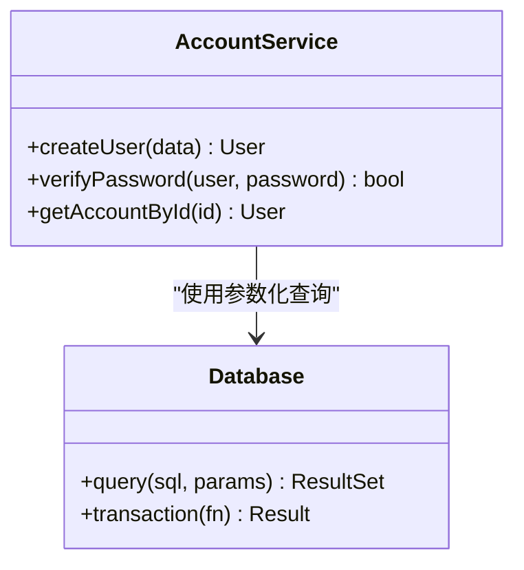
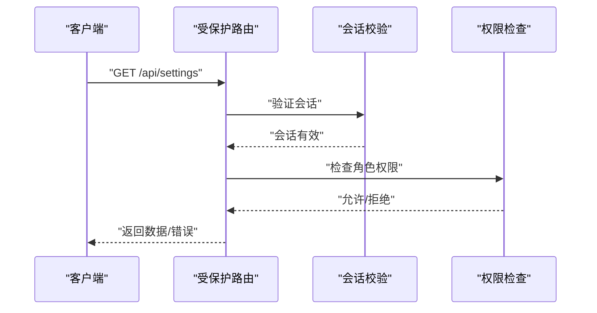
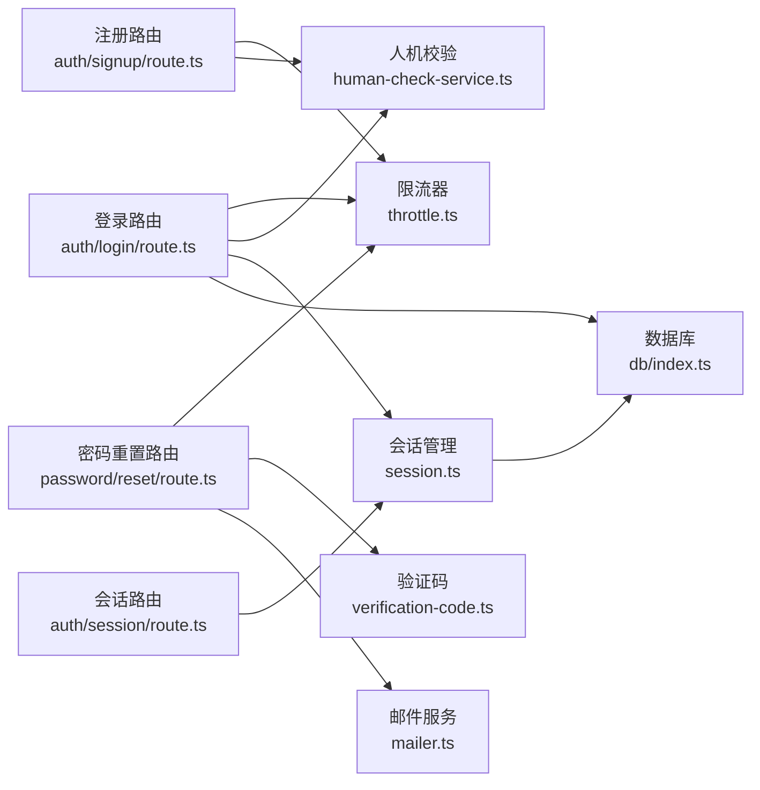

# 安全措施

<cite>
**本文引用的文件**   
- [src/features/auth/throttle.ts](file://src/features/auth/throttle.ts)
- [src/features/auth/human-check.ts](file://src/features/auth/human-check.ts)
- [src/features/auth/human-check-service.ts](file://src/features/auth/human-check-service.ts)
- [src/app/api/auth/login/route.ts](file://src/app/api/auth/login/route.ts)
- [src/app/api/auth/signup/route.ts](file://src/app/api/auth/signup/route.ts)
- [src/app/api/auth/password/reset/route.ts](file://src/app/api/auth/password/reset/route.ts)
- [src/app/(auth)/_components/auth-api.ts](file://src/app/(auth)/_components/auth-api.ts)
- [src/app/(auth)/_components/login-form.tsx](file://src/app/(auth)/_components/login-form.tsx)
- [src/app/(auth)/_components/signup-form.tsx](file://src/app/(auth)/_components/signup-form.tsx)
- [src/app/(auth)/_components/reset-password-form.tsx](file://src/app/(auth)/_components/reset-password-form.tsx)
- [src/app/api/auth/session/route.ts](file://src/app/api/auth/session/route.ts)
- [src/features/auth/session.ts](file://src/features/auth/session.ts)
- [src/features/auth/account-service.ts](file://src/features/auth/account-service.ts)
- [src/features/auth/schemas.ts](file://src/features/auth/schemas.ts)
- [src/features/auth/verification-code.ts](file://src/features/auth/verification-code.ts)
- [src/features/auth/verification-repository.ts](file://src/features/auth/verification-repository.ts)
- [src/features/auth/mail-failure.ts](file://src/features/auth/mail-failure.ts)
- [src/features/auth/mailer.ts](file://src/features/auth/mailer.ts)
- [src/lib/db/index.ts](file://src/lib/db/index.ts)
- [drizzle.config.ts](file://drizzle.config.ts)
- [next.config.ts](file://next.config.ts)
- [server/src/server/api.ts](file://server/src/server/api.ts)
- [deploy/reverse-proxy/Dockerfile](file://deploy/reverse-proxy/Dockerfile)
- [deploy/reverse-proxy/entrypoint.sh](file://deploy/reverse-proxy/entrypoint.sh)
- [scripts/setup/bootstrap-credentials.ts](file://scripts/setup/bootstrap-credentials.ts)
- [scripts/migration/provision-master-key.ts](file://scripts/migration/provision-master-key.ts)
- [src/instrumentation.ts](file://src/instrumentation.ts)
</cite>

## 目录
1. [简介](#简介)
2. [项目结构](#项目结构)
3. [核心组件](#核心组件)
4. [架构总览](#架构总览)
5. [详细组件分析](#详细组件分析)
6. [依赖分析](#依赖分析)
7. [性能考虑](#性能考虑)
8. [故障排查指南](#故障排查指南)
9. [结论](#结论)
10. [附录](#附录)

## 简介
本文件面向PurpleInk项目的安全设计与实现，聚焦以下主题：
- 防暴力破解机制：登录尝试限制、IP封禁、账户锁定策略与实现要点
- CSRF防护：令牌生成与校验、跨域配置建议
- XSS防护：输入过滤、输出编码、CSP配置建议
- SQL注入防护：参数化查询、ORM使用、输入验证
- 访问控制：RBAC模型、资源权限、接口保护
- 安全配置最佳实践与漏洞扫描建议
- 安全事件监控与应急响应流程

说明：本文基于仓库现有代码进行归纳与解读，并在“最佳实践”部分给出通用建议。若某些能力尚未在代码中实现，将明确标注为“待实现”。

## 项目结构
与安全相关的核心代码主要分布在以下位置：
- 认证与会话：src/features/auth/*（限流、人机校验、会话、验证码、邮件等）
- API路由：src/app/api/auth/*（登录、注册、密码重置、会话等）
- 前端表单：src/app/(auth)/_components/*（登录、注册、重置密码表单）
- 数据库与迁移：src/lib/db/index.ts、drizzle.config.ts、scripts/*（密钥与数据初始化）
- 反向代理部署：deploy/reverse-proxy/*（基础认证、入口脚本）
- 应用配置：next.config.ts（跨域与安全头建议）
- 服务端API网关：server/src/server/api.ts（内部服务鉴权与路由）

**图表来源**
- [src/app/api/auth/login/route.ts](file://src/app/api/auth/login/route.ts)
- [src/app/api/auth/signup/route.ts](file://src/app/api/auth/signup/route.ts)
- [src/app/api/auth/password/reset/route.ts](file://src/app/api/auth/password/reset/route.ts)
- [src/app/api/auth/session/route.ts](file://src/app/api/auth/session/route.ts)
- [src/features/auth/session.ts](file://src/features/auth/session.ts)
- [src/features/auth/human-check-service.ts](file://src/features/auth/human-check-service.ts)
- [src/lib/db/index.ts](file://src/lib/db/index.ts)
- [src/features/auth/mailer.ts](file://src/features/auth/mailer.ts)
- [deploy/reverse-proxy/Dockerfile](file://deploy/reverse-proxy/Dockerfile)

**章节来源**
- [src/app/api/auth/login/route.ts](file://src/app/api/auth/login/route.ts)
- [src/app/api/auth/signup/route.ts](file://src/app/api/auth/signup/route.ts)
- [src/app/api/auth/password/reset/route.ts](file://src/app/api/auth/password/reset/route.ts)
- [src/app/api/auth/session/route.ts](file://src/app/api/auth/session/route.ts)
- [src/features/auth/session.ts](file://src/features/auth/session.ts)
- [src/features/auth/human-check-service.ts](file://src/features/auth/human-check-service.ts)
- [src/lib/db/index.ts](file://src/lib/db/index.ts)
- [src/features/auth/mailer.ts](file://src/features/auth/mailer.ts)
- [deploy/reverse-proxy/Dockerfile](file://deploy/reverse-proxy/Dockerfile)

## 核心组件
- 限流器：用于对敏感接口（登录、注册、密码重置）实施请求频率限制，防止暴力破解
- 人机校验：集成第三方或本地校验，降低自动化攻击风险
- 会话管理：创建、刷新、销毁会话，支持短期有效与最小权限原则
- 验证码与邮件：发送一次性验证码，处理失败重试与退避
- 账号服务：用户账号的增删改查、密码哈希与校验
- 数据库层：通过Drizzle ORM执行参数化查询，避免SQL注入
- 反向代理：提供基础认证与前置限流能力

**章节来源**
- [src/features/auth/throttle.ts](file://src/features/auth/throttle.ts)
- [src/features/auth/human-check.ts](file://src/features/auth/human-check.ts)
- [src/features/auth/human-check-service.ts](file://src/features/auth/human-check-service.ts)
- [src/features/auth/session.ts](file://src/features/auth/session.ts)
- [src/features/auth/verification-code.ts](file://src/features/auth/verification-code.ts)
- [src/features/auth/account-service.ts](file://src/features/auth/account-service.ts)
- [src/lib/db/index.ts](file://src/lib/db/index.ts)
- [deploy/reverse-proxy/Dockerfile](file://deploy/reverse-proxy/Dockerfile)

## 架构总览
下图展示认证相关的关键调用链与组件交互：

**图表来源**
- [src/app/(auth)/_components/login-form.tsx](file://src/app/(auth)/_components/login-form.tsx)
- [src/app/api/auth/login/route.ts](file://src/app/api/auth/login/route.ts)
- [src/features/auth/throttle.ts](file://src/features/auth/throttle.ts)
- [src/features/auth/human-check-service.ts](file://src/features/auth/human-check-service.ts)
- [src/features/auth/session.ts](file://src/features/auth/session.ts)
- [src/lib/db/index.ts](file://src/lib/db/index.ts)
- [src/features/auth/mailer.ts](file://src/features/auth/mailer.ts)

## 详细组件分析

### 防暴力破解机制
- 登录尝试限制
  - 通过限流器对登录、注册、密码重置等接口进行频率限制，按IP或用户维度统计请求次数
  - 超过阈值后返回错误并延迟响应，逐步提高门槛
- IP封禁
  - 在高频失败场景下，可结合反向代理或中间件对IP进行临时封禁
  - 封禁策略应支持白名单与解封机制，避免误伤
- 账户锁定
  - 当某账户连续失败达到阈值时，标记账户为锁定状态，要求管理员解锁或等待冷却时间
  - 锁定期间仍允许人机校验通过以减轻自动化攻击影响

**图表来源**
- [src/features/auth/throttle.ts](file://src/features/auth/throttle.ts)
- [src/features/auth/human-check-service.ts](file://src/features/auth/human-check-service.ts)
- [src/lib/db/index.ts](file://src/lib/db/index.ts)
- [src/app/api/auth/login/route.ts](file://src/app/api/auth/login/route.ts)

**章节来源**
- [src/features/auth/throttle.ts](file://src/features/auth/throttle.ts)
- [src/app/api/auth/login/route.ts](file://src/app/api/auth/login/route.ts)
- [src/app/api/auth/signup/route.ts](file://src/app/api/auth/signup/route.ts)
- [src/app/api/auth/password/reset/route.ts](file://src/app/api/auth/password/reset/route.ts)

### CSRF防护
- 令牌生成与验证
  - 建议在表单提交前通过后端接口获取CSRF令牌，并在请求头或表单字段中携带
  - 服务端校验令牌与用户会话绑定，确保同源且未过期
- 跨域配置
  - 使用SameSite Cookie策略，避免跨站请求伪造
  - 严格设置Access-Control-Allow-Origin、Allow-Credentials等CORS头
- 当前实现建议
  - 在登录、注册、密码重置等写操作接口强制校验CSRF令牌
  - 前端表单统一封装CSRF头部注入逻辑

[本节为概念性说明，不直接分析具体文件]

### XSS防护
- 输入过滤
  - 对用户输入进行白名单过滤，仅允许安全字符集
  - 对富文本内容使用安全的解析器与转义策略
- 输出编码
  - 在前端渲染时使用框架内置的自动转义功能
  - 在后端API返回JSON时避免直接拼接HTML
- CSP配置
  - 通过HTTP响应头Content-Security-Policy限制脚本加载来源
  - 禁用内联脚本与不安全源，启用严格模式

[本节为概念性说明，不直接分析具体文件]

### SQL注入防护
- 参数化查询
  - 所有数据库查询必须使用参数化语句，禁止字符串拼接
- ORM使用
  - 通过Drizzle ORM构建查询，避免原生SQL拼接
- 输入验证
  - 对关键参数进行类型与范围校验，拒绝非法输入

**图表来源**
- [src/features/auth/account-service.ts](file://src/features/auth/account-service.ts)
- [src/lib/db/index.ts](file://src/lib/db/index.ts)

**章节来源**
- [src/features/auth/account-service.ts](file://src/features/auth/account-service.ts)
- [src/lib/db/index.ts](file://src/lib/db/index.ts)
- [drizzle.config.ts](file://drizzle.config.ts)

### 访问控制
- RBAC模型
  - 定义角色与权限映射，如管理员、普通用户等
  - 资源级权限控制，确保用户只能访问授权资源
- 接口保护
  - 在API路由层校验会话与权限，未授权请求返回401/403
  - 敏感操作需二次确认或额外权限校验
- 当前实现建议
  - 在session路由中校验会话有效性
  - 在业务路由中根据用户角色决定操作权限

**图表来源**
- [src/app/api/auth/session/route.ts](file://src/app/api/auth/session/route.ts)
- [src/features/auth/session.ts](file://src/features/auth/session.ts)
- [server/src/server/api.ts](file://server/src/server/api.ts)

**章节来源**
- [src/app/api/auth/session/route.ts](file://src/app/api/auth/session/route.ts)
- [src/features/auth/session.ts](file://src/features/auth/session.ts)
- [server/src/server/api.ts](file://server/src/server/api.ts)

### 验证码与邮件安全
- 验证码生成与验证
  - 使用一次性验证码，设置短有效期与使用次数限制
  - 验证码与用户邮箱绑定，防止重放攻击
- 邮件发送
  - 使用安全的SMTP配置，启用TLS加密
  - 对失败重试进行退避与限流，避免被滥用

**章节来源**
- [src/features/auth/verification-code.ts](file://src/features/auth/verification-code.ts)
- [src/features/auth/verification-repository.ts](file://src/features/auth/verification-repository.ts)
- [src/features/auth/mailer.ts](file://src/features/auth/mailer.ts)
- [src/features/auth/mail-failure.ts](file://src/features/auth/mail-failure.ts)

### 会话与密钥管理
- 会话管理
  - 会话ID随机生成，设置合理过期时间
  - 支持会话刷新与主动注销
- 密钥管理
  - 主密钥通过专用脚本初始化，避免硬编码
  - 敏感配置通过环境变量注入，不在代码中暴露

**章节来源**
- [src/features/auth/session.ts](file://src/features/auth/session.ts)
- [scripts/setup/bootstrap-credentials.ts](file://scripts/setup/bootstrap-credentials.ts)
- [scripts/migration/provision-master-key.ts](file://scripts/migration/provision-master-key.ts)

## 依赖分析
安全相关组件之间的依赖关系如下：

**图表来源**
- [src/app/api/auth/login/route.ts](file://src/app/api/auth/login/route.ts)
- [src/app/api/auth/signup/route.ts](file://src/app/api/auth/signup/route.ts)
- [src/app/api/auth/password/reset/route.ts](file://src/app/api/auth/password/reset/route.ts)
- [src/app/api/auth/session/route.ts](file://src/app/api/auth/session/route.ts)
- [src/features/auth/throttle.ts](file://src/features/auth/throttle.ts)
- [src/features/auth/human-check-service.ts](file://src/features/auth/human-check-service.ts)
- [src/features/auth/session.ts](file://src/features/auth/session.ts)
- [src/features/auth/verification-code.ts](file://src/features/auth/verification-code.ts)
- [src/features/auth/mailer.ts](file://src/features/auth/mailer.ts)
- [src/lib/db/index.ts](file://src/lib/db/index.ts)

**章节来源**
- [src/app/api/auth/login/route.ts](file://src/app/api/auth/login/route.ts)
- [src/app/api/auth/signup/route.ts](file://src/app/api/auth/signup/route.ts)
- [src/app/api/auth/password/reset/route.ts](file://src/app/api/auth/password/reset/route.ts)
- [src/app/api/auth/session/route.ts](file://src/app/api/auth/session/route.ts)
- [src/features/auth/throttle.ts](file://src/features/auth/throttle.ts)
- [src/features/auth/human-check-service.ts](file://src/features/auth/human-check-service.ts)
- [src/features/auth/session.ts](file://src/features/auth/session.ts)
- [src/features/auth/verification-code.ts](file://src/features/auth/verification-code.ts)
- [src/features/auth/mailer.ts](file://src/features/auth/mailer.ts)
- [src/lib/db/index.ts](file://src/lib/db/index.ts)

## 性能考虑
- 限流算法选择滑动窗口或漏桶算法，平衡准确性与内存占用
- 人机校验异步执行，避免阻塞主线程
- 数据库查询使用索引优化，减少锁竞争
- 会话存储采用内存缓存+持久化备份，提升读取性能

[本节为通用指导，不直接分析具体文件]

## 故障排查指南
- 登录失败频繁
  - 检查限流器计数是否正确累加
  - 查看人机校验服务是否可用
  - 验证数据库连接与查询性能
- 验证码无法接收
  - 检查邮件服务配置与网络连通性
  - 查看邮件发送失败重试日志
- 会话异常
  - 确认会话存储是否可达
  - 检查会话过期策略是否合理
- 密钥相关问题
  - 验证主密钥初始化是否成功
  - 检查环境变量注入是否正确

**章节来源**
- [src/features/auth/throttle.ts](file://src/features/auth/throttle.ts)
- [src/features/auth/human-check-service.ts](file://src/features/auth/human-check-service.ts)
- [src/features/auth/mailer.ts](file://src/features/auth/mailer.ts)
- [src/features/auth/session.ts](file://src/features/auth/session.ts)
- [scripts/setup/bootstrap-credentials.ts](file://scripts/setup/bootstrap-credentials.ts)

## 结论
本项目已实现基础的安全防护措施，包括限流、人机校验、会话管理、参数化查询等。建议进一步完善CSRF防护、XSS防护、CSP配置与访问控制策略。同时加强安全事件监控与应急响应流程，提升整体安全性。

[本节为总结性内容，不直接分析具体文件]

## 附录
- 安全配置最佳实践
  - 使用HTTPS与强加密算法
  - 定期更新依赖库与操作系统补丁
  - 最小权限原则配置服务账户
- 漏洞扫描建议
  - 使用静态代码分析工具检测潜在漏洞
  - 定期进行渗透测试与依赖审计
  - 建立安全开发生命周期(SDL)流程

[本节为通用指导，不直接分析具体文件]