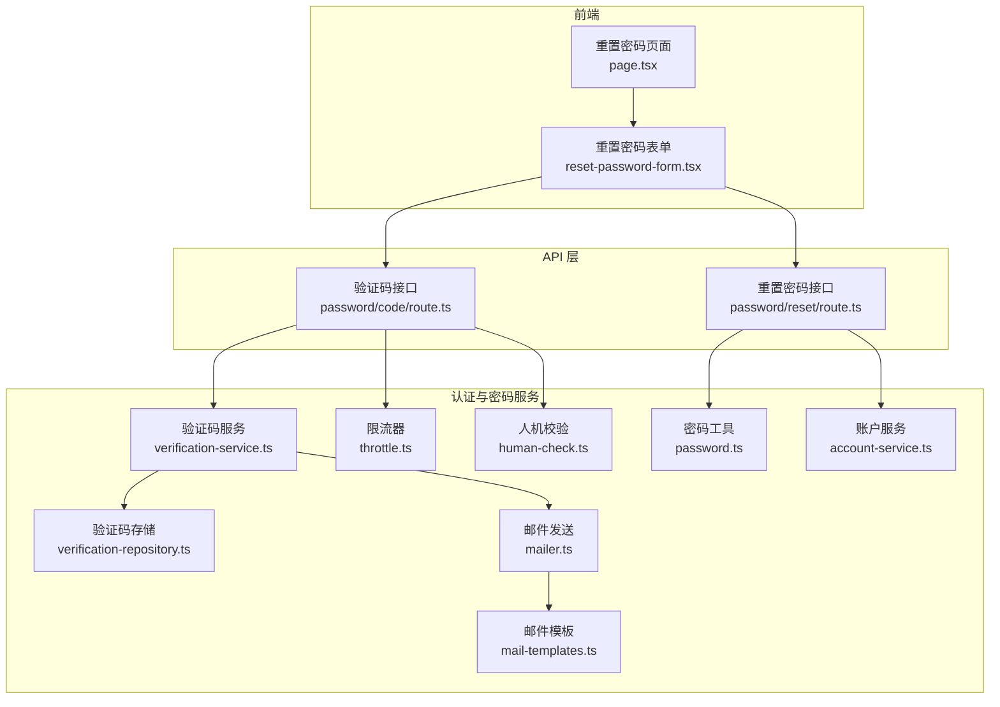
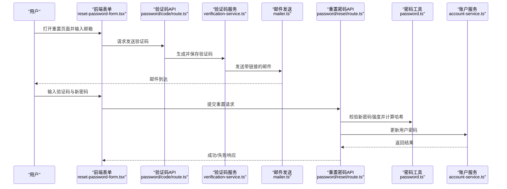
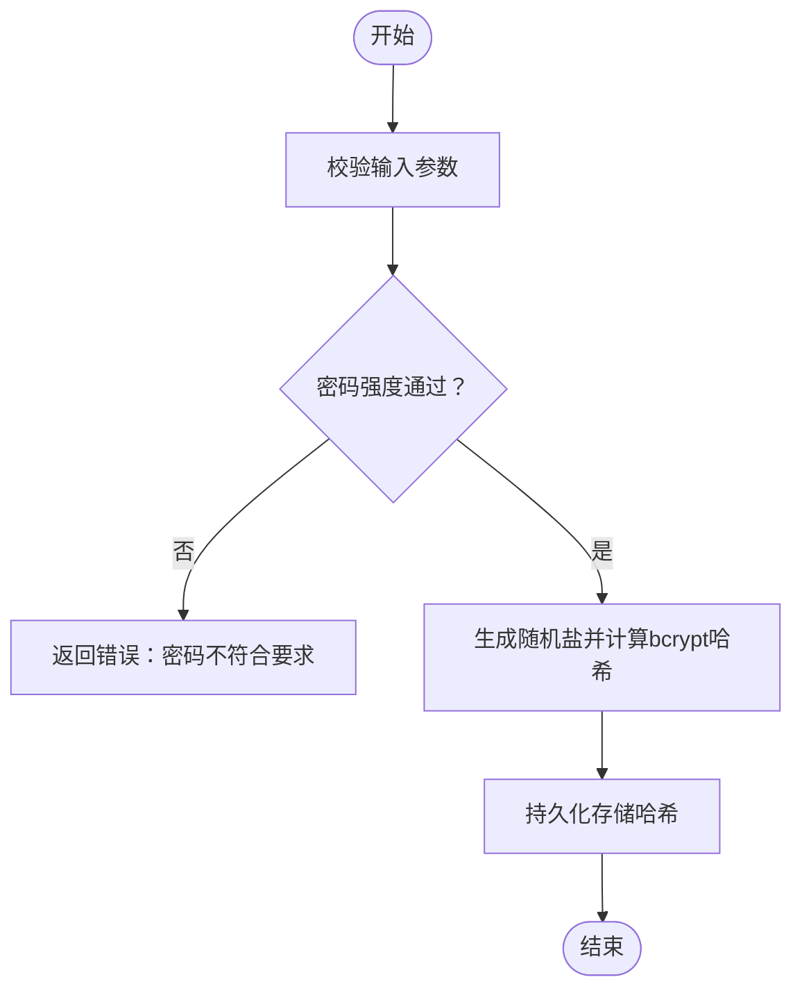
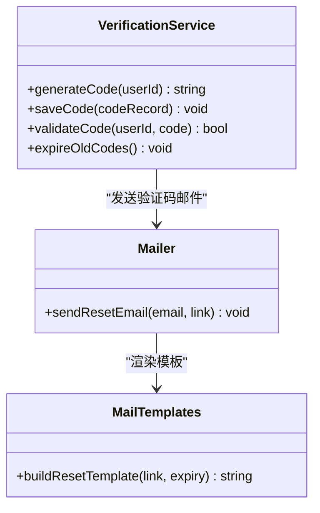
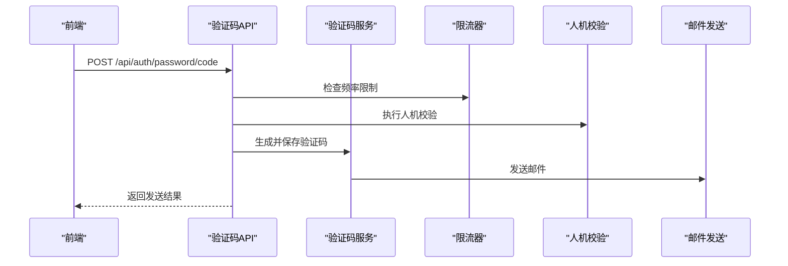
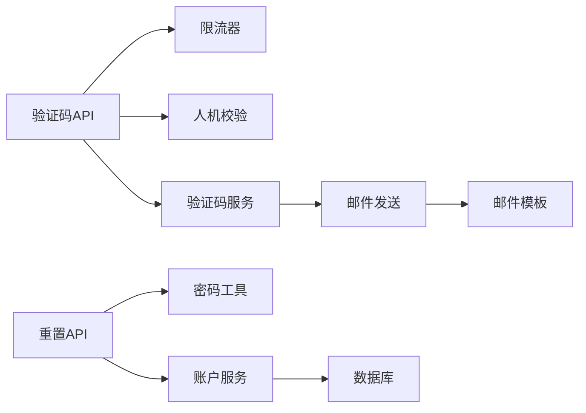

# 密码管理

<cite>
**本文引用的文件**   
- [src/features/auth/password.ts](file://src/features/auth/password.ts)
- [src/features/auth/verification-code.ts](file://src/features/auth/verification-code.ts)
- [src/features/auth/verification-service.ts](file://src/features/auth/verification-service.ts)
- [src/features/auth/mailer.ts](file://src/features/auth/mailer.ts)
- [src/features/auth/mail-templates.ts](file://src/features/auth/mail-templates.ts)
- [src/app/api/auth/password/code/route.ts](file://src/app/api/auth/password/code/route.ts)
- [src/app/api/auth/password/reset/route.ts](file://src/app/api/auth/password/reset/route.ts)
- [src/app/(auth)/_components/reset-password-form.tsx](file://src/app/(auth)/_components/reset-password-form.tsx)
- [src/app/(auth)/password/reset/page.tsx](file://src/app/(auth)/password/reset/page.tsx)
- [src/features/auth/schemas.ts](file://src/features/auth/schemas.ts)
- [src/features/auth/throttle.ts](file://src/features/auth/throttle.ts)
- [src/features/auth/human-check.ts](file://src/features/auth/human-check.ts)
- [src/features/auth/account-service.ts](file://src/features/auth/account-service.ts)
</cite>

## 目录
1. [简介](#简介)
2. [项目结构](#项目结构)
3. [核心组件](#核心组件)
4. [架构总览](#架构总览)
5. [详细组件分析](#详细组件分析)
6. [依赖关系分析](#依赖关系分析)
7. [性能考虑](#性能考虑)
8. [故障排除指南](#故障排除指南)
9. [结论](#结论)
10. [附录](#附录)

## 简介
本文件围绕“密码管理”能力进行系统化文档化，覆盖以下关键主题：
- 密码加密算法选择与实现（含 bcrypt、盐值生成、哈希计算）
- 密码重置流程（验证码发送、链接生成、有效期控制）
- 密码强度验证规则（复杂度要求、历史密码检查、弱密码检测）
- 密码更新安全机制（旧密码校验、新密码确认、并发更新处理）
- 安全最佳实践与合规性建议
- 故障排除与安全审计要点

说明：本仓库中密码相关逻辑主要位于 features/auth 与 app/api/auth/password 路径下。若某些细节在当前代码库中尚未实现或采用外部服务，将在相应章节明确标注并给出可落地的替代方案。

## 项目结构
与密码管理直接相关的代码分布在以下位置：
- 前端页面与表单：app/(auth)/password/reset 与 _components/reset-password-form.tsx
- API 路由：app/api/auth/password/{code,reset}/route.ts
- 业务逻辑：features/auth 下的 password.ts、verification-code.ts、verification-service.ts、schemas.ts、throttle.ts、human-check.ts、mailer.ts、mail-templates.ts、account-service.ts

图表来源
- [src/app/(auth)/password/reset/page.tsx](file://src/app/(auth)/password/reset/page.tsx)
- [src/app/(auth)/_components/reset-password-form.tsx](file://src/app/(auth)/_components/reset-password-form.tsx)
- [src/app/api/auth/password/code/route.ts](file://src/app/api/auth/password/code/route.ts)
- [src/app/api/auth/password/reset/route.ts](file://src/app/api/auth/password/reset/route.ts)
- [src/features/auth/verification-service.ts](file://src/features/auth/verification-service.ts)
- [src/features/auth/password.ts](file://src/features/auth/password.ts)
- [src/features/auth/account-service.ts](file://src/features/auth/account-service.ts)
- [src/features/auth/throttle.ts](file://src/features/auth/throttle.ts)
- [src/features/auth/human-check.ts](file://src/features/auth/human-check.ts)
- [src/features/auth/mailer.ts](file://src/features/auth/mailer.ts)
- [src/features/auth/mail-templates.ts](file://src/features/auth/mail-templates.ts)

章节来源
- [src/app/(auth)/password/reset/page.tsx](file://src/app/(auth)/password/reset/page.tsx)
- [src/app/(auth)/_components/reset-password-form.tsx](file://src/app/(auth)/_components/reset-password-form.tsx)
- [src/app/api/auth/password/code/route.ts](file://src/app/api/auth/password/code/route.ts)
- [src/app/api/auth/password/reset/route.ts](file://src/app/api/auth/password/reset/route.ts)
- [src/features/auth/verification-service.ts](file://src/features/auth/verification-service.ts)
- [src/features/auth/password.ts](file://src/features/auth/password.ts)
- [src/features/auth/account-service.ts](file://src/features/auth/account-service.ts)
- [src/features/auth/throttle.ts](file://src/features/auth/throttle.ts)
- [src/features/auth/human-check.ts](file://src/features/auth/human-check.ts)
- [src/features/auth/mailer.ts](file://src/features/auth/mailer.ts)
- [src/features/auth/mail-templates.ts](file://src/features/auth/mail-templates.ts)

## 核心组件
- 密码工具模块（password.ts）：负责密码哈希与比对，应使用 bcrypt 并内置随机盐生成；提供强度校验入口（可与 schemas.ts 联动）。
- 验证码服务（verification-service.ts）：封装验证码的生成、存储、校验与过期清理；与邮件发送模块协作完成通知。
- 验证码存储（verification-repository.ts）：持久化验证码记录，包含用户标识、验证码、过期时间等字段。
- 邮件发送（mailer.ts + mail-templates.ts）：统一发送邮件，模板中包含重置链接与有效期提示。
- 限流（throttle.ts）：对敏感操作（如验证码发送、重置请求）进行频率限制，防止滥用。
- 人机校验（human-check.ts）：在关键步骤引入人机校验，降低自动化攻击风险。
- 账户服务（account-service.ts）：与用户账户数据交互，执行密码更新、历史密码检查等操作。
- 模式校验（schemas.ts）：定义输入校验规则，包括邮箱格式、密码强度等。

章节来源
- [src/features/auth/password.ts](file://src/features/auth/password.ts)
- [src/features/auth/verification-service.ts](file://src/features/auth/verification-service.ts)
- [src/features/auth/verification-repository.ts](file://src/features/auth/verification-repository.ts)
- [src/features/auth/mailer.ts](file://src/features/auth/mailer.ts)
- [src/features/auth/mail-templates.ts](file://src/features/auth/mail-templates.ts)
- [src/features/auth/throttle.ts](file://src/features/auth/throttle.ts)
- [src/features/auth/human-check.ts](file://src/features/auth/human-check.ts)
- [src/features/auth/account-service.ts](file://src/features/auth/account-service.ts)
- [src/features/auth/schemas.ts](file://src/features/auth/schemas.ts)

## 架构总览
密码重置的整体调用序列如下：

图表来源
- [src/app/(auth)/_components/reset-password-form.tsx](file://src/app/(auth)/_components/reset-password-form.tsx)
- [src/app/api/auth/password/code/route.ts](file://src/app/api/auth/password/code/route.ts)
- [src/app/api/auth/password/reset/route.ts](file://src/app/api/auth/password/reset/route.ts)
- [src/features/auth/verification-service.ts](file://src/features/auth/verification-service.ts)
- [src/features/auth/mailer.ts](file://src/features/auth/mailer.ts)
- [src/features/auth/password.ts](file://src/features/auth/password.ts)
- [src/features/auth/account-service.ts](file://src/features/auth/account-service.ts)

## 详细组件分析

### 密码加密与强度校验（password.ts）
- 算法选择：建议使用 bcrypt，因其具备自适应成本因子与内置盐值生成，能有效抵御彩虹表与暴力破解。
- 哈希与比对：提供密码哈希生成与比对方法；所有明文密码不得落盘，仅存储哈希。
- 强度校验：结合 schemas.ts 的规则进行复杂度检查（长度、字符集、常见弱口令），必要时接入历史密码库进行重复检测。
- 并发更新：在账户服务层使用事务与行级锁，确保同一用户同时只能有一次密码更新生效。

图表来源
- [src/features/auth/password.ts](file://src/features/auth/password.ts)
- [src/features/auth/schemas.ts](file://src/features/auth/schemas.ts)

章节来源
- [src/features/auth/password.ts](file://src/features/auth/password.ts)
- [src/features/auth/schemas.ts](file://src/features/auth/schemas.ts)

### 验证码服务与邮件发送（verification-service.ts、mailer.ts、mail-templates.ts）
- 验证码生成：高熵随机数，避免可预测性；支持数字与字母组合。
- 存储策略：记录用户标识、验证码、创建时间与过期时间；过期后自动清理或惰性失效。
- 邮件模板：包含重置链接、有效期提示与安全提醒；链接需包含一次性令牌且不可被猜测。
- 防滥用：结合 throttle.ts 与 human-check.ts 限制发送频率与机器人流量。

图表来源
- [src/features/auth/verification-service.ts](file://src/features/auth/verification-service.ts)
- [src/features/auth/mailer.ts](file://src/features/auth/mailer.ts)
- [src/features/auth/mail-templates.ts](file://src/features/auth/mail-templates.ts)

章节来源
- [src/features/auth/verification-service.ts](file://src/features/auth/verification-service.ts)
- [src/features/auth/mailer.ts](file://src/features/auth/mailer.ts)
- [src/features/auth/mail-templates.ts](file://src/features/auth/mail-templates.ts)

### API 路由：验证码与重置（password/code/route.ts、password/reset/route.ts）
- 验证码接口：接收邮箱，触发验证码生成与发送；应用限流与人机校验；返回统一成功/失败响应。
- 重置接口：校验验证码有效性与时效；校验新密码强度；调用密码工具与账户服务完成更新；返回标准化结果。
- 错误处理：区分网络异常、验证码无效、密码不合规、账户不存在等场景，返回明确错误码与消息。

图表来源
- [src/app/api/auth/password/code/route.ts](file://src/app/api/auth/password/code/route.ts)
- [src/features/auth/throttle.ts](file://src/features/auth/throttle.ts)
- [src/features/auth/human-check.ts](file://src/features/auth/human-check.ts)
- [src/features/auth/verification-service.ts](file://src/features/auth/verification-service.ts)
- [src/features/auth/mailer.ts](file://src/features/auth/mailer.ts)

章节来源
- [src/app/api/auth/password/code/route.ts](file://src/app/api/auth/password/code/route.ts)
- [src/app/api/auth/password/reset/route.ts](file://src/app/api/auth/password/reset/route.ts)

### 前端重置表单与页面（reset-password-form.tsx、page.tsx）
- 页面职责：展示重置流程引导、显示状态与错误信息、跳转与回退。
- 表单职责：收集邮箱、验证码、新密码与确认密码；本地基础校验；调用后端 API 并处理响应。
- 用户体验：加载态、禁用重复提交、友好错误提示、成功反馈与跳转。

章节来源
- [src/app/(auth)/password/reset/page.tsx](file://src/app/(auth)/password/reset/page.tsx)
- [src/app/(auth)/_components/reset-password-form.tsx](file://src/app/(auth)/_components/reset-password-form.tsx)

### 账户服务与历史密码检查（account-service.ts）
- 密码更新：在事务中读取当前密码哈希，比对旧密码；写入新密码哈希；记录更新时间戳。
- 历史密码检查：维护最近 N 条密码哈希列表，禁止重复使用；必要时提供迁移脚本以补齐历史数据。
- 并发控制：使用数据库行级锁或乐观锁版本号，避免并发覆盖导致的安全问题。

章节来源
- [src/features/auth/account-service.ts](file://src/features/auth/account-service.ts)

## 依赖关系分析
- API 路由依赖验证码服务、限流与人机校验；重置接口依赖密码工具与账户服务。
- 验证码服务依赖邮件发送与模板；邮件发送依赖配置与环境变量。
- 账户服务依赖数据库访问与可能的缓存层（用于历史密码查询）。

图表来源
- [src/app/api/auth/password/code/route.ts](file://src/app/api/auth/password/code/route.ts)
- [src/app/api/auth/password/reset/route.ts](file://src/app/api/auth/password/reset/route.ts)
- [src/features/auth/throttle.ts](file://src/features/auth/throttle.ts)
- [src/features/auth/human-check.ts](file://src/features/auth/human-check.ts)
- [src/features/auth/verification-service.ts](file://src/features/auth/verification-service.ts)
- [src/features/auth/mailer.ts](file://src/features/auth/mailer.ts)
- [src/features/auth/mail-templates.ts](file://src/features/auth/mail-templates.ts)
- [src/features/auth/password.ts](file://src/features/auth/password.ts)
- [src/features/auth/account-service.ts](file://src/features/auth/account-service.ts)

章节来源
- [src/app/api/auth/password/code/route.ts](file://src/app/api/auth/password/code/route.ts)
- [src/app/api/auth/password/reset/route.ts](file://src/app/api/auth/password/reset/route.ts)
- [src/features/auth/throttle.ts](file://src/features/auth/throttle.ts)
- [src/features/auth/human-check.ts](file://src/features/auth/human-check.ts)
- [src/features/auth/verification-service.ts](file://src/features/auth/verification-service.ts)
- [src/features/auth/mailer.ts](file://src/features/auth/mailer.ts)
- [src/features/auth/mail-templates.ts](file://src/features/auth/mail-templates.ts)
- [src/features/auth/password.ts](file://src/features/auth/password.ts)
- [src/features/auth/account-service.ts](file://src/features/auth/account-service.ts)

## 性能考虑
- bcrypt 成本因子：根据服务器性能调整，平衡安全性与响应时间；建议在压测后确定合理值。
- 验证码存储：使用内存缓存（如 Redis）提升读取速度，配合数据库持久化保证可靠性。
- 邮件发送：异步队列处理，避免阻塞主流程；重试与失败告警机制。
- 限流与人机校验：轻量级实现，避免成为瓶颈；必要时前置到网关层。

[本节为通用指导，无需特定文件引用]

## 故障排除指南
- 验证码无法发送：
  - 检查邮件服务配置与网络连通性；查看限流器是否触发；确认人机校验未误拦截。
- 重置链接无效：
  - 核对链接中的令牌是否一次性且未过期；检查模板渲染是否正确；确认验证码已正确关联用户。
- 密码更新失败：
  - 检查旧密码校验逻辑；确认新密码强度规则；排查数据库事务与锁冲突；查看账户服务日志。
- 性能问题：
  - 监控 bcrypt 耗时；评估验证码缓存命中率；优化邮件队列消费速率。

章节来源
- [src/app/api/auth/password/code/route.ts](file://src/app/api/auth/password/code/route.ts)
- [src/app/api/auth/password/reset/route.ts](file://src/app/api/auth/password/reset/route.ts)
- [src/features/auth/verification-service.ts](file://src/features/auth/verification-service.ts)
- [src/features/auth/mailer.ts](file://src/features/auth/mailer.ts)
- [src/features/auth/password.ts](file://src/features/auth/password.ts)
- [src/features/auth/account-service.ts](file://src/features/auth/account-service.ts)

## 结论
本密码管理方案以 bcrypt 为核心，结合验证码与邮件通知形成完整重置流程；通过限流与人机校验增强抗攻击能力；在账户服务层实现历史密码检查与并发安全更新。建议在生产环境持续压测与审计，确保安全性与性能达到预期。

[本节为总结性内容，无需特定文件引用]

## 附录
- 安全最佳实践
  - 始终使用 bcrypt 并定期评估成本因子；禁止明文存储密码。
  - 验证码与重置令牌应具备足够熵值与一次性特性；设置合理有效期。
  - 对所有敏感接口实施限流与人机校验；记录审计日志。
  - 启用 HTTPS 与安全的 Cookie 属性（HttpOnly、Secure、SameSite）。
- 合规性建议
  - 遵循最小权限原则与数据保护法规（如个人信息保护法）；提供用户数据删除与导出能力。
  - 定期进行安全扫描与渗透测试；建立事件响应流程。

[本节为通用指导，无需特定文件引用]