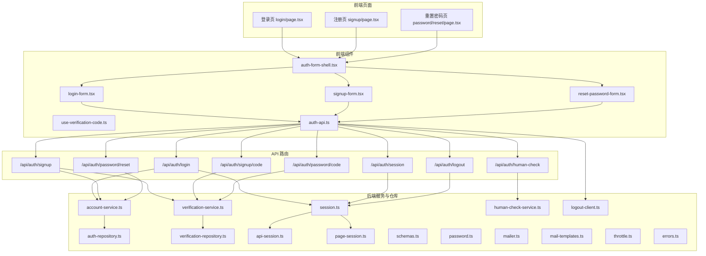
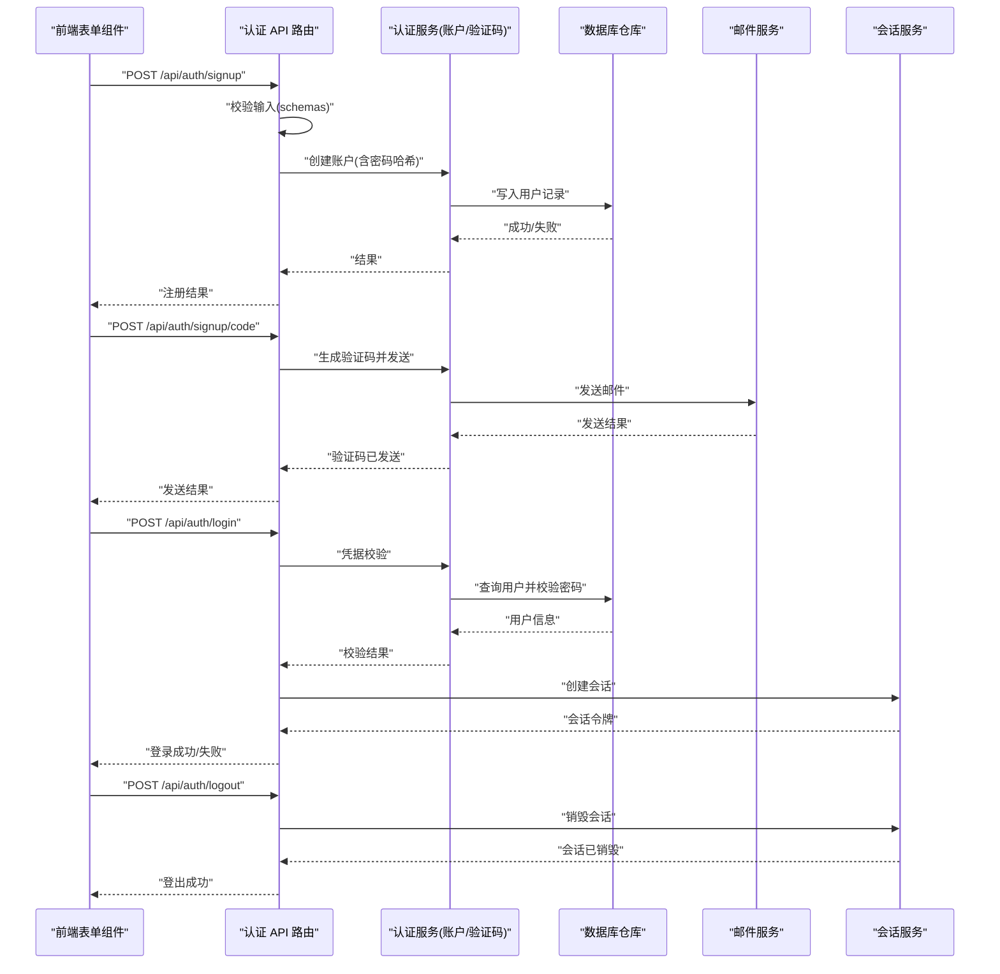
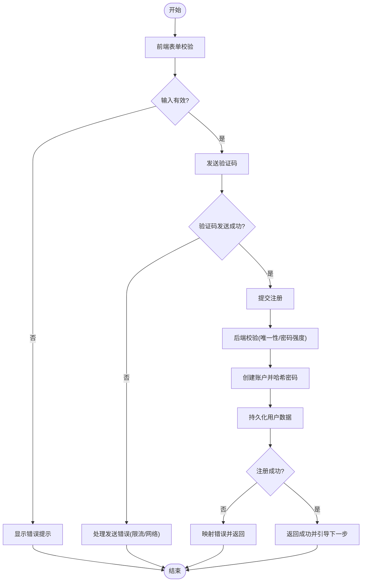
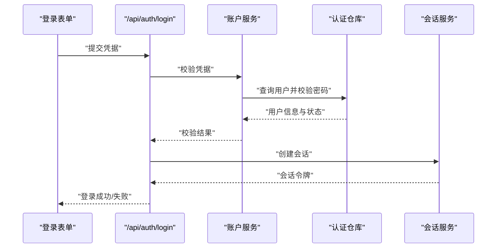
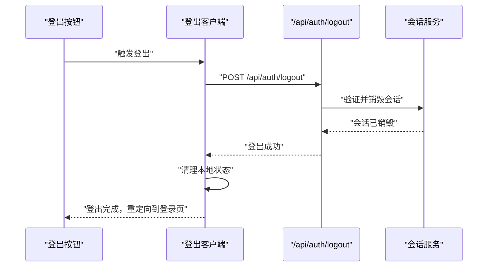
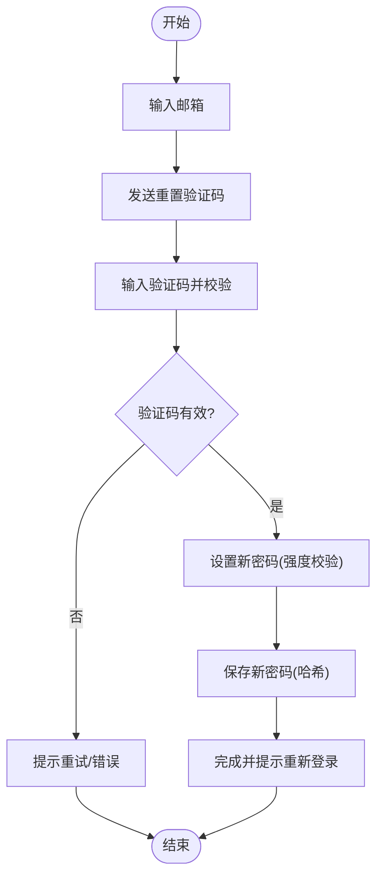
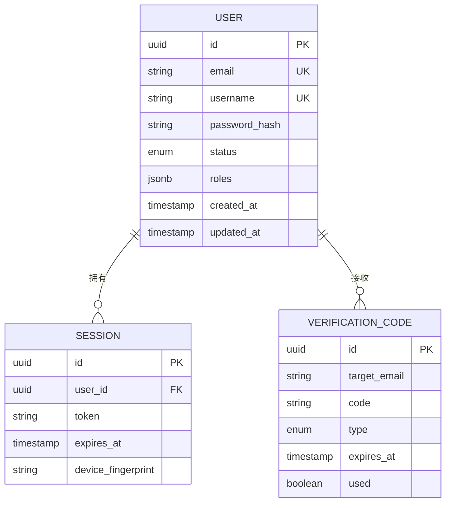
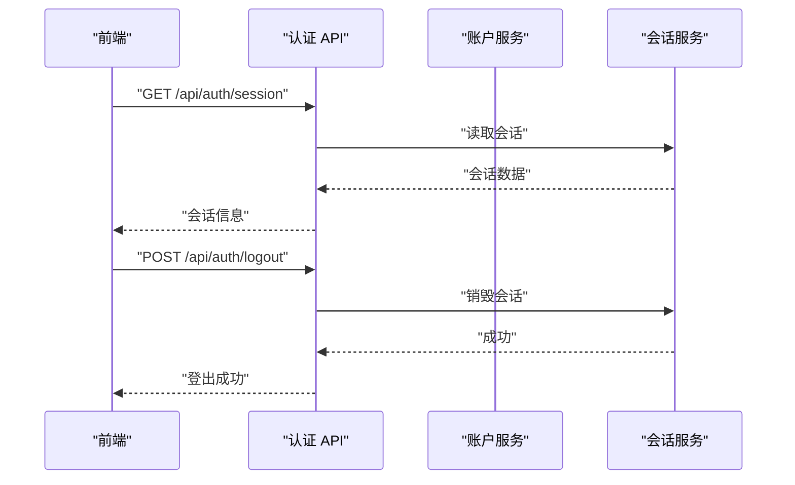
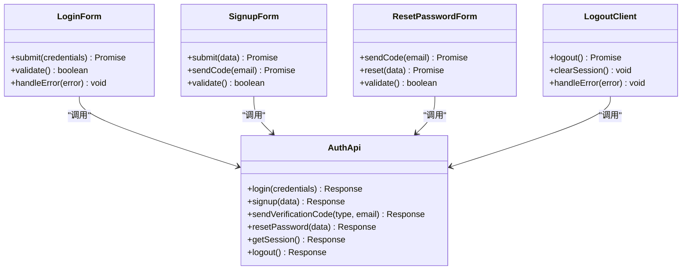
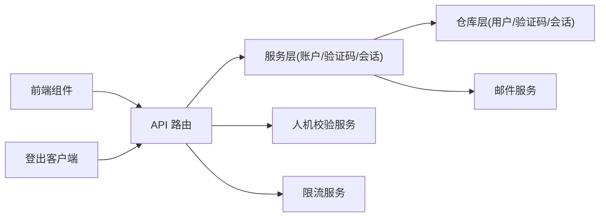

# 用户认证

<cite>
**本文档引用的文件**   
- [src/app/(auth)/_components/auth-api.ts](file://src/app/(auth)/_components/auth-api.ts)
- [src/app/(auth)/_components/auth-form-shell.tsx](file://src/app/(auth)/_components/auth-form-shell.tsx)
- [src/app/(auth)/_components/login-form.tsx](file://src/app/(auth)/_components/login-form.tsx)
- [src/app/(auth)/_components/signup-form.tsx](file://src/app/(auth)/_components/signup-form.tsx)
- [src/app/(auth)/_components/reset-password-form.tsx](file://src/app/(auth)/_components/reset-password-form.tsx)
- [src/app/(auth)/_components/use-verification-code.ts](file://src/app/(auth)/_components/use-verification-code.ts)
- [src/app/(auth)/login/page.tsx](file://src/app/(auth)/login/page.tsx)
- [src/app/(auth)/signup/page.tsx](file://src/app/(auth)/signup/page.tsx)
- [src/app/(auth)/password/reset/page.tsx](file://src/app/(auth)/password/reset/page.tsx)
- [src/app/api/auth/human-check/route.ts](file://src/app/api/auth/human-check/route.ts)
- [src/app/api/auth/login/route.ts](file://src/app/api/auth/login/route.ts)
- [src/app/api/auth/logout/route.ts](file://src/app/api/auth/logout/route.ts)
- [src/app/api/auth/session/route.ts](file://src/app/api/auth/session/route.ts)
- [src/app/api/auth/signup/route.ts](file://src/app/api/auth/signup/route.ts)
- [src/app/api/auth/signup/code/route.ts](file://src/app/api/auth/signup/code/route.ts)
- [src/app/api/auth/password/code/route.ts](file://src/app/api/auth/password/code/route.ts)
- [src/app/api/auth/password/reset/route.ts](file://src/app/api/auth/password/reset/route.ts)
- [src/features/auth/account-service.ts](file://src/features/auth/account-service.ts)
- [src/features/auth/api-session.ts](file://src/features/auth/api-session.ts)
- [src/features/auth/auth-repository.ts](file://src/features/auth/auth-repository.ts)
- [src/features/auth/errors.ts](file://src/features/auth/errors.ts)
- [src/features/auth/honeypot.ts](file://src/features/auth/honeypot.ts)
- [src/features/auth/http.ts](file://src/features/auth/http.ts)
- [src/features/auth/human-check-service.ts](file://src/features/auth/human-check-service.ts)
- [src/features/auth/mail-failure.ts](file://src/features/auth/mail-failure.ts)
- [src/features/auth/mail-templates.ts](file://src/features/auth/mail-templates.ts)
- [src/features/auth/mailer.ts](file://src/features/auth/mailer.ts)
- [src/features/auth/next-path.ts](file://src/features/auth/next-path.ts)
- [src/features/auth/page-session.ts](file://src/features/auth/page-session.ts)
- [src/features/auth/password.ts](file://src/features/auth/password.ts)
- [src/features/auth/schemas.ts](file://src/features/auth/schemas.ts)
- [src/features/auth/session.ts](file://src/features/auth/session.ts)
- [src/features/auth/signing-key.ts](file://src/features/auth/signing-key.ts)
- [src/features/auth/throttle.ts](file://src/features/auth/throttle.ts)
- [src/features/auth/verification-code.ts](file://src/features/auth/verification-code.ts)
- [src/features/auth/verification-repository.ts](file://src/features/auth/verification-repository.ts)
- [src/features/auth/verification-service.ts](file://src/features/auth/verification-service.ts)
- [src/features/auth/logout-client.ts](file://src/features/auth/logout-client.ts)
- [docs/plans/PLAN-002-auth-system.md](file://docs/plans/PLAN-002-auth-system.md)
</cite>

## 更新摘要
**所做更改**
- 新增完整的登出功能实现章节，包括客户端逻辑、API端点和错误处理
- 更新架构总览图以包含登出流程
- 在详细组件分析中增加登出机制说明
- 补充登出相关的API端点文档和使用示例
- 更新依赖关系分析以反映新的登出功能

## 目录
1. [简介](#简介)
2. [项目结构](#项目结构)
3. [核心组件](#核心组件)
4. [架构总览](#架构总览)
5. [详细组件分析](#详细组件分析)
6. [依赖关系分析](#依赖关系分析)
7. [性能考量](#性能考量)
8. [故障排查指南](#故障排查指南)
9. [结论](#结论)
10. [附录](#附录)

## 简介
本文件面向开发者与产品团队，系统性梳理并文档化"用户认证"功能。内容覆盖：
- 用户注册流程（表单校验、邮箱验证码、密码强度）
- 登录机制（凭据校验、会话创建、错误处理）
- **新增** 登出机制（会话销毁、状态清理、错误处理）
- 用户数据模型与存储（用户信息、权限角色、状态管理）
- API 端点设计与使用（请求格式、响应结构、错误码）
- 前端组件集成示例与最佳实践
- 常见问题与安全加固建议

## 项目结构
认证相关代码主要分布在以下位置：
- 前端页面与表单组件位于 src/app/(auth)/*
- API 路由位于 src/app/api/auth/*
- 业务逻辑、服务与仓库位于 src/features/auth/*
- 设计规划位于 docs/plans/PLAN-002-auth-system.md

**图表来源** 
- [src/app/(auth)/login/page.tsx](file://src/app/(auth)/login/page.tsx)
- [src/app/(auth)/signup/page.tsx](file://src/app/(auth)/signup/page.tsx)
- [src/app/(auth)/password/reset/page.tsx](file://src/app/(auth)/password/reset/page.tsx)
- [src/app/(auth)/_components/auth-form-shell.tsx](file://src/app/(auth)/_components/auth-form-shell.tsx)
- [src/app/(auth)/_components/login-form.tsx](file://src/app/(auth)/_components/login-form.tsx)
- [src/app/(auth)/_components/signup-form.tsx](file://src/app/(auth)/_components/signup-form.tsx)
- [src/app/(auth)/_components/reset-password-form.tsx](file://src/app/(auth)/_components/reset-password-form.tsx)
- [src/app/(auth)/_components/use-verification-code.ts](file://src/app/(auth)/_components/use-verification-code.ts)
- [src/app/(auth)/_components/auth-api.ts](file://src/app/(auth)/_components/auth-api.ts)
- [src/app/api/auth/login/route.ts](file://src/app/api/auth/login/route.ts)
- [src/app/api/auth/signup/route.ts](file://src/app/api/auth/signup/route.ts)
- [src/app/api/auth/signup/code/route.ts](file://src/app/api/auth/signup/code/route.ts)
- [src/app/api/auth/password/code/route.ts](file://src/app/api/auth/password/code/route.ts)
- [src/app/api/auth/password/reset/route.ts](file://src/app/api/auth/password/reset/route.ts)
- [src/app/api/auth/session/route.ts](file://src/app/api/auth/session/route.ts)
- [src/app/api/auth/logout/route.ts](file://src/app/api/auth/logout/route.ts)
- [src/app/api/auth/human-check/route.ts](file://src/app/api/auth/human-check/route.ts)
- [src/features/auth/account-service.ts](file://src/features/auth/account-service.ts)
- [src/features/auth/verification-service.ts](file://src/features/auth/verification-service.ts)
- [src/features/auth/auth-repository.ts](file://src/features/auth/auth-repository.ts)
- [src/features/auth/verification-repository.ts](file://src/features/auth/verification-repository.ts)
- [src/features/auth/session.ts](file://src/features/auth/session.ts)
- [src/features/auth/api-session.ts](file://src/features/auth/api-session.ts)
- [src/features/auth/page-session.ts](file://src/features/auth/page-session.ts)
- [src/features/auth/schemas.ts](file://src/features/auth/schemas.ts)
- [src/features/auth/password.ts](file://src/features/auth/password.ts)
- [src/features/auth/mailer.ts](file://src/features/auth/mailer.ts)
- [src/features/auth/mail-templates.ts](file://src/features/auth/mail-templates.ts)
- [src/features/auth/human-check-service.ts](file://src/features/auth/human-check-service.ts)
- [src/features/auth/throttle.ts](file://src/features/auth/throttle.ts)
- [src/features/auth/errors.ts](file://src/features/auth/errors.ts)
- [src/features/auth/logout-client.ts](file://src/features/auth/logout-client.ts)

**章节来源**
- [docs/plans/PLAN-002-auth-system.md](file://docs/plans/PLAN-002-auth-system.md)

## 核心组件
- 前端表单与交互
  - 登录表单：负责收集用户名/邮箱与密码，触发登录 API，处理成功跳转与错误提示
  - 注册表单：收集邮箱、密码、确认密码等，进行本地校验，发送验证码，提交注册
  - 重置密码表单：输入邮箱获取验证码，验证后设置新密码
  - 验证码 Hook：封装验证码倒计时、重试与错误处理
  - 统一 API 调用封装：集中处理请求头、错误映射与响应解析
- **新增** 登出客户端
  - logout-client.ts：提供登出功能的客户端封装，处理登出请求和状态清理
- 后端 API 路由
  - /api/auth/login：凭据校验、生成会话、返回令牌或重定向
  - /api/auth/signup：注册账户，校验唯一性与密码强度
  - /api/auth/signup/code：发送注册验证码
  - /api/auth/password/code：发送重置密码验证码
  - /api/auth/password/reset：重置密码
  - /api/auth/session：查询当前会话状态
  - **新增** /api/auth/logout：销毁会话，清理认证状态
  - /api/auth/human-check：人机校验前置检查
- 业务服务与仓库
  - account-service：账户生命周期（创建、查找、更新、删除）、密码哈希与校验
  - verification-service：验证码生成、校验、过期清理
  - auth-repository / verification-repository：持久化访问层
  - session / api-session / page-session：会话创建、读写、序列化与反序列化
  - schemas：输入输出校验规则
  - password：密码强度策略与哈希算法
  - mailer / mail-templates：邮件发送与模板渲染
  - human-check-service：人机校验服务
  - throttle：限流保护
  - errors：统一错误类型与消息

**章节来源**
- [src/app/(auth)/_components/login-form.tsx](file://src/app/(auth)/_components/login-form.tsx)
- [src/app/(auth)/_components/signup-form.tsx](file://src/app/(auth)/_components/signup-form.tsx)
- [src/app/(auth)/_components/reset-password-form.tsx](file://src/app/(auth)/_components/reset-password-form.tsx)
- [src/app/(auth)/_components/use-verification-code.ts](file://src/app/(auth)/_components/use-verification-code.ts)
- [src/app/(auth)/_components/auth-api.ts](file://src/app/(auth)/_components/auth-api.ts)
- [src/features/auth/logout-client.ts](file://src/features/auth/logout-client.ts)
- [src/app/api/auth/login/route.ts](file://src/app/api/auth/login/route.ts)
- [src/app/api/auth/signup/route.ts](file://src/app/api/auth/signup/route.ts)
- [src/app/api/auth/signup/code/route.ts](file://src/app/api/auth/signup/code/route.ts)
- [src/app/api/auth/password/code/route.ts](file://src/app/api/auth/password/code/route.ts)
- [src/app/api/auth/password/reset/route.ts](file://src/app/api/auth/password/reset/route.ts)
- [src/app/api/auth/session/route.ts](file://src/app/api/auth/session/route.ts)
- [src/app/api/auth/logout/route.ts](file://src/app/api/auth/logout/route.ts)
- [src/app/api/auth/human-check/route.ts](file://src/app/api/auth/human-check/route.ts)
- [src/features/auth/account-service.ts](file://src/features/auth/account-service.ts)
- [src/features/auth/verification-service.ts](file://src/features/auth/verification-service.ts)
- [src/features/auth/auth-repository.ts](file://src/features/auth/auth-repository.ts)
- [src/features/auth/verification-repository.ts](file://src/features/auth/verification-repository.ts)
- [src/features/auth/session.ts](file://src/features/auth/session.ts)
- [src/features/auth/api-session.ts](file://src/features/auth/api-session.ts)
- [src/features/auth/page-session.ts](file://src/features/auth/page-session.ts)
- [src/features/auth/schemas.ts](file://src/features/auth/schemas.ts)
- [src/features/auth/password.ts](file://src/features/auth/password.ts)
- [src/features/auth/mailer.ts](file://src/features/auth/mailer.ts)
- [src/features/auth/mail-templates.ts](file://src/features/auth/mail-templates.ts)
- [src/features/auth/human-check-service.ts](file://src/features/auth/human-check-service.ts)
- [src/features/auth/throttle.ts](file://src/features/auth/throttle.ts)
- [src/features/auth/errors.ts](file://src/features/auth/errors.ts)

## 架构总览
认证系统采用前后端分离的 Next.js App Router 架构：
- 前端通过统一的 API 封装模块发起请求，表单组件负责本地校验与 UI 反馈
- 后端 API 路由对输入进行严格校验，调用领域服务完成业务逻辑
- 服务层协调仓库层进行数据持久化，并通过邮件服务发送验证码
- 会话由服务端创建与签发，客户端通过 Cookie/Token 维持登录态
- **新增** 登出流程支持完整的会话销毁和状态清理机制

**图表来源** 
- [src/app/(auth)/_components/signup-form.tsx](file://src/app/(auth)/_components/signup-form.tsx)
- [src/app/(auth)/_components/login-form.tsx](file://src/app/(auth)/_components/login-form.tsx)
- [src/app/api/auth/signup/route.ts](file://src/app/api/auth/signup/route.ts)
- [src/app/api/auth/signup/code/route.ts](file://src/app/api/auth/signup/code/route.ts)
- [src/app/api/auth/login/route.ts](file://src/app/api/auth/login/route.ts)
- [src/app/api/auth/logout/route.ts](file://src/app/api/auth/logout/route.ts)
- [src/features/auth/account-service.ts](file://src/features/auth/account-service.ts)
- [src/features/auth/verification-service.ts](file://src/features/auth/verification-service.ts)
- [src/features/auth/auth-repository.ts](file://src/features/auth/auth-repository.ts)
- [src/features/auth/mailer.ts](file://src/features/auth/mailer.ts)
- [src/features/auth/session.ts](file://src/features/auth/session.ts)

## 详细组件分析

### 用户注册流程
- 前端校验
  - 邮箱格式、必填项、密码与确认密码一致性
  - 密码强度策略（长度、复杂度）由后端校验，前端可展示友好提示
- 验证码流程
  - 发送验证码接口支持频率限制与防刷
  - 验证码有效期与重试次数受控
- 注册接口
  - 校验唯一性（邮箱）
  - 密码哈希存储
  - 可选强制邮箱验证后再激活账户

**图表来源** 
- [src/app/(auth)/_components/signup-form.tsx](file://src/app/(auth)/_components/signup-form.tsx)
- [src/app/api/auth/signup/route.ts](file://src/app/api/auth/signup/route.ts)
- [src/app/api/auth/signup/code/route.ts](file://src/app/api/auth/signup/code/route.ts)
- [src/features/auth/schemas.ts](file://src/features/auth/schemas.ts)
- [src/features/auth/password.ts](file://src/features/auth/password.ts)
- [src/features/auth/account-service.ts](file://src/features/auth/account-service.ts)
- [src/features/auth/verification-service.ts](file://src/features/auth/verification-service.ts)
- [src/features/auth/auth-repository.ts](file://src/features/auth/auth-repository.ts)

**章节来源**
- [src/app/(auth)/_components/signup-form.tsx](file://src/app/(auth)/_components/signup-form.tsx)
- [src/app/api/auth/signup/route.ts](file://src/app/api/auth/signup/route.ts)
- [src/app/api/auth/signup/code/route.ts](file://src/app/api/auth/signup/code/route.ts)
- [src/features/auth/schemas.ts](file://src/features/auth/schemas.ts)
- [src/features/auth/password.ts](file://src/features/auth/password.ts)
- [src/features/auth/account-service.ts](file://src/features/auth/account-service.ts)
- [src/features/auth/verification-service.ts](file://src/features/auth/verification-service.ts)
- [src/features/auth/auth-repository.ts](file://src/features/auth/auth-repository.ts)

### 登录机制
- 凭据校验
  - 用户名/邮箱 + 密码
  - 支持锁定策略与错误计数（防暴力破解）
- 会话创建
  - 服务端签发会话令牌，设置安全 Cookie
  - 支持刷新与过期策略
- 错误处理
  - 统一错误映射，区分用户不存在、密码错误、账户未激活等场景

**图表来源** 
- [src/app/(auth)/_components/login-form.tsx](file://src/app/(auth)/_components/login-form.tsx)
- [src/app/api/auth/login/route.ts](file://src/app/api/auth/login/route.ts)
- [src/features/auth/account-service.ts](file://src/features/auth/account-service.ts)
- [src/features/auth/auth-repository.ts](file://src/features/auth/auth-repository.ts)
- [src/features/auth/session.ts](file://src/features/auth/session.ts)
- [src/features/auth/api-session.ts](file://src/features/auth/api-session.ts)

**章节来源**
- [src/app/(auth)/_components/login-form.tsx](file://src/app/(auth)/_components/login-form.tsx)
- [src/app/api/auth/login/route.ts](file://src/app/api/auth/login/route.ts)
- [src/features/auth/account-service.ts](file://src/features/auth/account-service.ts)
- [src/features/auth/auth-repository.ts](file://src/features/auth/auth-repository.ts)
- [src/features/auth/session.ts](file://src/features/auth/session.ts)
- [src/features/auth/api-session.ts](file://src/features/auth/api-session.ts)

### **新增** 登出机制
- 客户端登出逻辑
  - 调用登出 API 清除服务器端会话
  - 清理本地存储中的认证状态
  - 处理网络错误和超时情况
- 服务器端会话销毁
  - 验证当前会话有效性
  - 删除会话数据和相关缓存
  - 清除安全 Cookie
- 错误处理和状态管理
  - 统一错误捕获和日志记录
  - 确保即使部分步骤失败也能清理状态
  - 支持异步操作的状态同步

**图表来源** 
- [src/features/auth/logout-client.ts](file://src/features/auth/logout-client.ts)
- [src/app/api/auth/logout/route.ts](file://src/app/api/auth/logout/route.ts)
- [src/features/auth/session.ts](file://src/features/auth/session.ts)
- [src/features/auth/api-session.ts](file://src/features/auth/api-session.ts)

**章节来源**
- [src/features/auth/logout-client.ts](file://src/features/auth/logout-client.ts)
- [src/app/api/auth/logout/route.ts](file://src/app/api/auth/logout/route.ts)
- [src/features/auth/session.ts](file://src/features/auth/session.ts)
- [src/features/auth/api-session.ts](file://src/features/auth/api-session.ts)

### 密码重置流程
- 输入邮箱，发送验证码
- 校验验证码有效性（时间窗口、次数限制）
- 设置新密码并进行强度校验
- 成功后提示用户重新登录

**图表来源** 
- [src/app/(auth)/_components/reset-password-form.tsx](file://src/app/(auth)/_components/reset-password-form.tsx)
- [src/app/api/auth/password/code/route.ts](file://src/app/api/auth/password/code/route.ts)
- [src/app/api/auth/password/reset/route.ts](file://src/app/api/auth/password/reset/route.ts)
- [src/features/auth/verification-service.ts](file://src/features/auth/verification-service.ts)
- [src/features/auth/account-service.ts](file://src/features/auth/account-service.ts)
- [src/features/auth/password.ts](file://src/features/auth/password.ts)

**章节来源**
- [src/app/(auth)/_components/reset-password-form.tsx](file://src/app/(auth)/_components/reset-password-form.tsx)
- [src/app/api/auth/password/code/route.ts](file://src/app/api/auth/password/code/route.ts)
- [src/app/api/auth/password/reset/route.ts](file://src/app/api/auth/password/reset/route.ts)
- [src/features/auth/verification-service.ts](file://src/features/auth/verification-service.ts)
- [src/features/auth/account-service.ts](file://src/features/auth/account-service.ts)
- [src/features/auth/password.ts](file://src/features/auth/password.ts)

### 用户数据模型与存储
- 用户实体
  - 标识字段（ID）、邮箱、用户名、密码哈希、状态（激活/未激活/锁定）、角色（如普通用户/管理员）
  - 审计字段（创建时间、更新时间）
- 会话实体
  - 会话 ID、用户 ID、过期时间、设备/IP 指纹（可选）
- 验证码实体
  - 目标邮箱/用户 ID、验证码值、类型（注册/重置）、过期时间、使用状态
- 权限与角色
  - 基于角色的访问控制（RBAC），在资源访问时进行鉴权
- 状态管理
  - 账户激活状态、锁定状态、最后登录时间等

**图表来源** 
- [src/features/auth/auth-repository.ts](file://src/features/auth/auth-repository.ts)
- [src/features/auth/verification-repository.ts](file://src/features/auth/verification-repository.ts)
- [src/features/auth/session.ts](file://src/features/auth/session.ts)
- [src/features/auth/schemas.ts](file://src/features/auth/schemas.ts)

**章节来源**
- [src/features/auth/auth-repository.ts](file://src/features/auth/auth-repository.ts)
- [src/features/auth/verification-repository.ts](file://src/features/auth/verification-repository.ts)
- [src/features/auth/session.ts](file://src/features/auth/session.ts)
- [src/features/auth/schemas.ts](file://src/features/auth/schemas.ts)

### API 端点设计与使用
- 登录
  - POST /api/auth/login
  - 请求体：邮箱/用户名、密码
  - 响应：会话令牌或错误信息
- 注册
  - POST /api/auth/signup
  - 请求体：邮箱、密码、确认密码
  - 响应：注册结果
- 发送验证码
  - POST /api/auth/signup/code
  - POST /api/auth/password/code
  - 请求体：邮箱
  - 响应：发送结果
- 重置密码
  - POST /api/auth/password/reset
  - 请求体：邮箱、验证码、新密码
  - 响应：重置结果
- 会话
  - GET /api/auth/session
  - 响应：当前会话信息或空
- **新增** 登出
  - POST /api/auth/logout
  - 请求体：无（需要有效的会话）
  - 响应：登出结果
- 人机校验
  - POST /api/auth/human-check
  - 请求体：人机校验参数
  - 响应：校验结果

**图表来源** 
- [src/app/api/auth/session/route.ts](file://src/app/api/auth/session/route.ts)
- [src/app/api/auth/logout/route.ts](file://src/app/api/auth/logout/route.ts)
- [src/features/auth/session.ts](file://src/features/auth/session.ts)
- [src/features/auth/api-session.ts](file://src/features/auth/api-session.ts)

**章节来源**
- [src/app/api/auth/login/route.ts](file://src/app/api/auth/login/route.ts)
- [src/app/api/auth/signup/route.ts](file://src/app/api/auth/signup/route.ts)
- [src/app/api/auth/signup/code/route.ts](file://src/app/api/auth/signup/code/route.ts)
- [src/app/api/auth/password/code/route.ts](file://src/app/api/auth/password/code/route.ts)
- [src/app/api/auth/password/reset/route.ts](file://src/app/api/auth/password/reset/route.ts)
- [src/app/api/auth/session/route.ts](file://src/app/api/auth/session/route.ts)
- [src/app/api/auth/logout/route.ts](file://src/app/api/auth/logout/route.ts)
- [src/app/api/auth/human-check/route.ts](file://src/app/api/auth/human-check/route.ts)

### 前端组件集成指南
- 表单组件
  - 使用登录/注册/重置密码表单组件，绑定本地校验与错误提示
  - 通过统一 API 模块发起请求，处理成功回调与错误分支
- 验证码 Hook
  - 使用 use-verification-code 管理倒计时、重试与错误
- **新增** 登出集成
  - 使用 logout-client 封装的登出功能
  - 在用户菜单或设置页面集成登出按钮
  - 处理登出后的状态清理和页面重定向
- 会话状态
  - 通过 /api/auth/session 获取当前用户状态，决定页面可见性与导航
- 错误处理
  - 统一错误映射，区分网络错误、业务错误与用户输入错误

**图表来源** 
- [src/app/(auth)/_components/login-form.tsx](file://src/app/(auth)/_components/login-form.tsx)
- [src/app/(auth)/_components/signup-form.tsx](file://src/app/(auth)/_components/signup-form.tsx)
- [src/app/(auth)/_components/reset-password-form.tsx](file://src/app/(auth)/_components/reset-password-form.tsx)
- [src/features/auth/logout-client.ts](file://src/features/auth/logout-client.ts)
- [src/app/(auth)/_components/auth-api.ts](file://src/app/(auth)/_components/auth-api.ts)

**章节来源**
- [src/app/(auth)/_components/auth-form-shell.tsx](file://src/app/(auth)/_components/auth-form-shell.tsx)
- [src/app/(auth)/_components/auth-api.ts](file://src/app/(auth)/_components/auth-api.ts)
- [src/app/(auth)/_components/use-verification-code.ts](file://src/app/(auth)/_components/use-verification-code.ts)
- [src/features/auth/logout-client.ts](file://src/features/auth/logout-client.ts)

## 依赖关系分析
- 前端依赖
  - 表单组件依赖统一 API 模块
  - 验证码 Hook 依赖发送验证码接口
  - **新增** 登出客户端依赖登出 API 和会话管理
- 后端依赖
  - API 路由依赖服务层（账户、验证码、会话）
  - 服务层依赖仓库层（用户、验证码、会话）
  - 邮件服务用于发送验证码
  - 限流与人类校验服务用于安全防护

**图表来源** 
- [src/app/(auth)/_components/auth-api.ts](file://src/app/(auth)/_components/auth-api.ts)
- [src/app/api/auth/login/route.ts](file://src/app/api/auth/login/route.ts)
- [src/app/api/auth/signup/route.ts](file://src/app/api/auth/signup/route.ts)
- [src/app/api/auth/password/reset/route.ts](file://src/app/api/auth/password/reset/route.ts)
- [src/app/api/auth/logout/route.ts](file://src/app/api/auth/logout/route.ts)
- [src/features/auth/account-service.ts](file://src/features/auth/account-service.ts)
- [src/features/auth/verification-service.ts](file://src/features/auth/verification-service.ts)
- [src/features/auth/session.ts](file://src/features/auth/session.ts)
- [src/features/auth/auth-repository.ts](file://src/features/auth/auth-repository.ts)
- [src/features/auth/verification-repository.ts](file://src/features/auth/verification-repository.ts)
- [src/features/auth/mailer.ts](file://src/features/auth/mailer.ts)
- [src/features/auth/human-check-service.ts](file://src/features/auth/human-check-service.ts)
- [src/features/auth/throttle.ts](file://src/features/auth/throttle.ts)
- [src/features/auth/logout-client.ts](file://src/features/auth/logout-client.ts)

**章节来源**
- [src/app/(auth)/_components/auth-api.ts](file://src/app/(auth)/_components/auth-api.ts)
- [src/app/api/auth/login/route.ts](file://src/app/api/auth/login/route.ts)
- [src/app/api/auth/signup/route.ts](file://src/app/api/auth/signup/route.ts)
- [src/app/api/auth/password/reset/route.ts](file://src/app/api/auth/password/reset/route.ts)
- [src/app/api/auth/logout/route.ts](file://src/app/api/auth/logout/route.ts)
- [src/features/auth/account-service.ts](file://src/features/auth/account-service.ts)
- [src/features/auth/verification-service.ts](file://src/features/auth/verification-service.ts)
- [src/features/auth/session.ts](file://src/features/auth/session.ts)
- [src/features/auth/auth-repository.ts](file://src/features/auth/auth-repository.ts)
- [src/features/auth/verification-repository.ts](file://src/features/auth/verification-repository.ts)
- [src/features/auth/mailer.ts](file://src/features/auth/mailer.ts)
- [src/features/auth/human-check-service.ts](file://src/features/auth/human-check-service.ts)
- [src/features/auth/throttle.ts](file://src/features/auth/throttle.ts)
- [src/features/auth/logout-client.ts](file://src/features/auth/logout-client.ts)

## 性能考量
- 输入校验与错误快速失败：在前端与服务端均进行严格校验，减少无效请求
- 验证码发送限流：防止滥用与短信成本激增
- 会话优化：合理设置过期时间与刷新策略，降低频繁鉴权开销
- 数据库索引：对用户邮箱、用户名、会话 token、验证码目标字段建立索引
- 缓存策略：对热点数据（如配置、模板）进行缓存，提升响应速度
- **新增** 登出性能：确保会话销毁操作的原子性和快速响应

## 故障排查指南
- 常见错误
  - 邮箱重复：检查唯一性约束与注册流程
  - 密码强度不足：查看密码策略与前端提示
  - 验证码失效：检查过期时间与使用状态
  - 会话丢失：检查 Cookie 设置与会话存储
  - **新增** 登出失败：检查网络连接、会话状态和服务器响应
- 日志与监控
  - 关键操作（登录、注册、重置、登出）记录审计日志
  - 错误分类与上报，便于定位问题
- 调试步骤
  - 检查 API 响应与错误码
  - 查看服务层日志与仓库层 SQL
  - 验证邮件发送与模板渲染
  - **新增** 验证登出流程的完整性和状态清理

**章节来源**
- [src/features/auth/errors.ts](file://src/features/auth/errors.ts)
- [src/features/auth/mail-failure.ts](file://src/features/auth/mail-failure.ts)
- [src/features/auth/throttle.ts](file://src/features/auth/throttle.ts)
- [src/features/auth/logout-client.ts](file://src/features/auth/logout-client.ts)

## 结论
本认证系统通过清晰的分层架构与严格的输入校验，实现了安全的用户注册、登录、**新增的登出功能**与密码重置流程。结合会话管理与邮件验证码，提供了良好的用户体验与安全性。新增的登出功能确保了完整的用户会话生命周期管理，从登录到登出的每个环节都有相应的安全保障和错误处理机制。建议在后续迭代中持续完善限流策略、审计日志与多因素认证能力。

## 附录
- 安全最佳实践
  - 使用强哈希算法存储密码
  - 启用 HTTPS 与安全 Cookie 标志
  - 实施速率限制与人机校验
  - 定期轮换密钥与令牌
  - 最小权限原则与 RBAC
  - **新增** 确保登出操作的不可逆性和彻底性
- 扩展建议
  - 多因素认证（MFA）
  - 第三方登录（OAuth）
  - 账号解锁与申诉流程
  - **新增** 登出审计和会话追踪