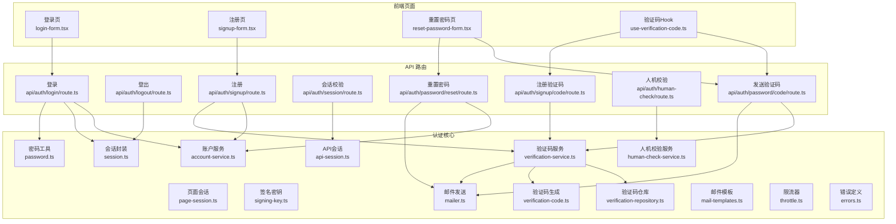
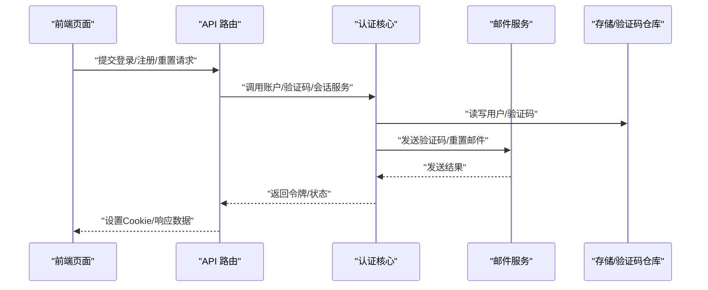
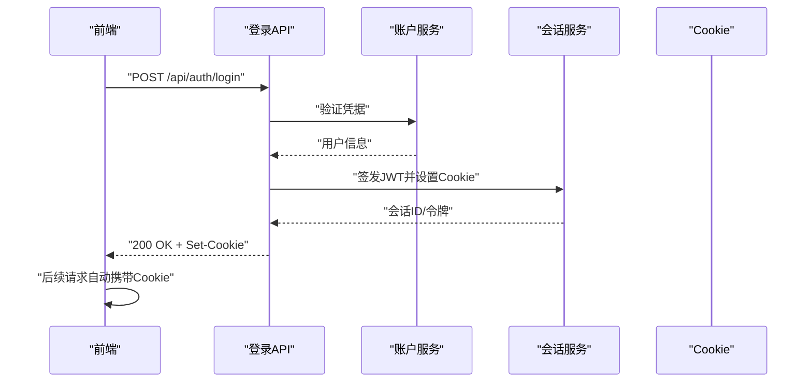
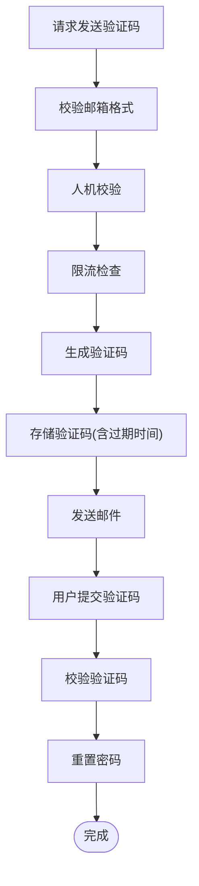
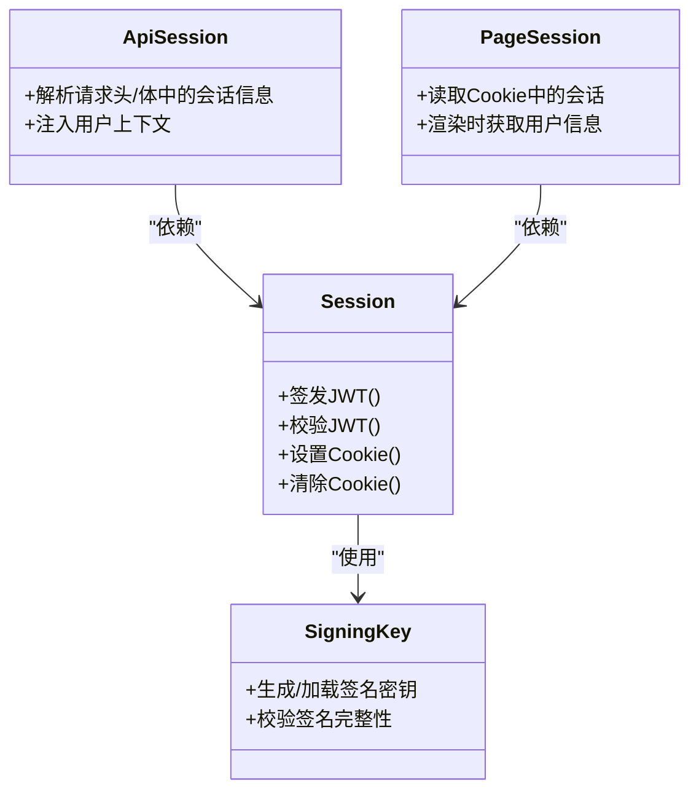
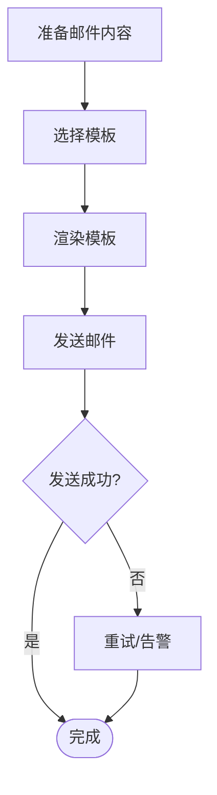
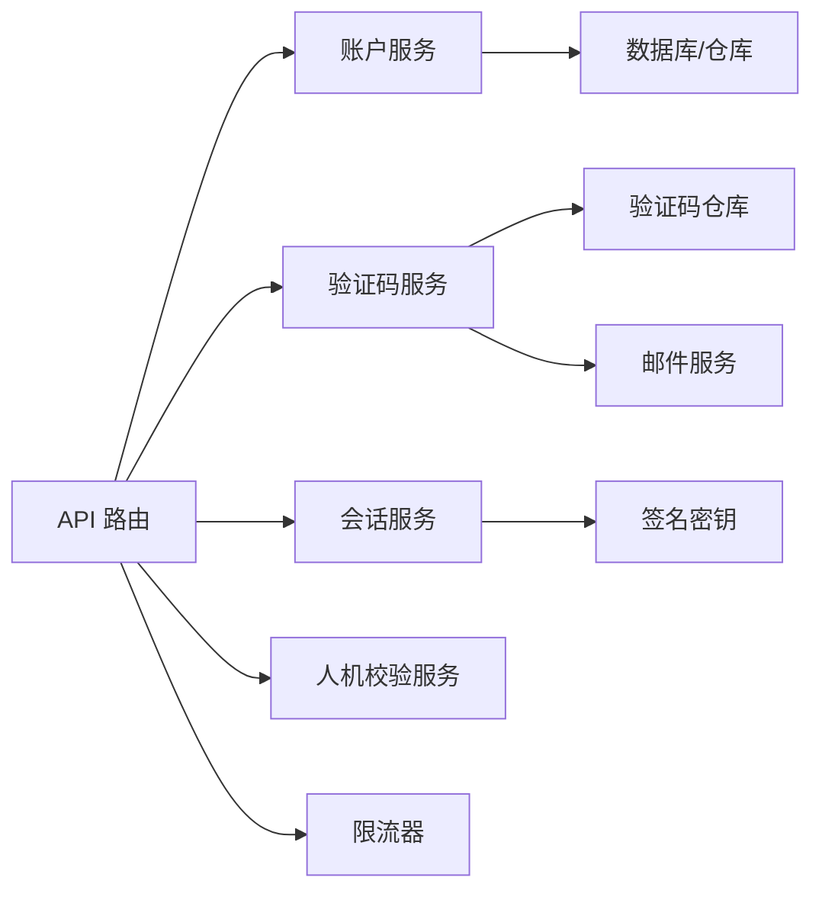

# 认证系统

<cite>
**本文引用的文件**   
- [src/features/auth/index.ts](file://src/features/auth/index.ts)
- [src/features/auth/account-service.ts](file://src/features/auth/account-service.ts)
- [src/features/auth/api-session.ts](file://src/features/auth/api-session.ts)
- [src/features/auth/page-session.ts](file://src/features/auth/page-session.ts)
- [src/features/auth/session.ts](file://src/features/auth/session.ts)
- [src/features/auth/signing-key.ts](file://src/features/auth/signing-key.ts)
- [src/features/auth/password.ts](file://src/features/auth/password.ts)
- [src/features/auth/human-check.ts](file://src/features/auth/human-check.ts)
- [src/features/auth/human-check-service.ts](file://src/features/auth/human-check-service.ts)
- [src/features/auth/throttle.ts](file://src/features/auth/throttle.ts)
- [src/features/auth/mailer.ts](file://src/features/auth/mailer.ts)
- [src/features/auth/mail-templates.ts](file://src/features/auth/mail-templates.ts)
- [src/features/auth/mail-failure.ts](file://src/features/auth/mail-failure.ts)
- [src/features/auth/verification-code.ts](file://src/features/auth/verification-code.ts)
- [src/features/auth/verification-repository.ts](file://src/features/auth/verification-repository.ts)
- [src/features/auth/verification-service.ts](file://src/features/auth/verification-service.ts)
- [src/app/(auth)/_components/auth-api.ts](file://src/app/(auth)/_components/auth-api.ts)
- [src/app/(auth)/_components/login-form.tsx](file://src/app/(auth)/_components/login-form.tsx)
- [src/app/(auth)/_components/signup-form.tsx](file://src/app/(auth)/_components/signup-form.tsx)
- [src/app/(auth)/_components/reset-password-form.tsx](file://src/app/(auth)/_components/reset-password-form.tsx)
- [src/app/(auth)/_components/use-verification-code.ts](file://src/app/(auth)/_components/use-verification-code.ts)
- [src/app/api/auth/login/route.ts](file://src/app/api/auth/login/route.ts)
- [src/app/api/auth/logout/route.ts](file://src/app/api/auth/logout/route.ts)
- [src/app/api/auth/signup/route.ts](file://src/app/api/auth/signup/route.ts)
- [src/app/api/auth/session/route.ts](file://src/app/api/auth/session/route.ts)
- [src/app/api/auth/password/code/route.ts](file://src/app/api/auth/password/code/route.ts)
- [src/app/api/auth/password/reset/route.ts](file://src/app/api/auth/password/reset/route.ts)
- [src/app/api/auth/human-check/route.ts](file://src/app/api/auth/human-check/route.ts)
- [src/app/api/auth/signup/code/route.ts](file://src/app/api/auth/signup/code/route.ts)
- [src/features/auth/schemas.ts](file://src/features/auth/schemas.ts)
- [src/features/auth/errors.ts](file://src/features/auth/errors.ts)
- [src/features/auth/http.ts](file://src/features/auth/http.ts)
- [src/features/auth/next-path.ts](file://src/features/auth/next-path.ts)
- [src/features/auth/auth-repository.ts](file://src/features/auth/auth-repository.ts)
</cite>

## 目录
1. [简介](#简介)
2. [项目结构](#项目结构)
3. [核心组件](#核心组件)
4. [架构总览](#架构总览)
5. [详细组件分析](#详细组件分析)
6. [依赖关系分析](#依赖关系分析)
7. [性能考量](#性能考量)
8. [故障排查指南](#故障排查指南)
9. [结论](#结论)
10. [附录](#附录)

## 简介
本文件为 PurpleInk 认证系统的全面技术文档，覆盖用户注册、登录、密码重置、邮箱验证等认证流程；会话管理（JWT/Cookie）、权限控制（RBAC）；邮件服务集成（验证码、重置通知、模板管理）；以及安全实践（密码加密、防暴力破解、CSRF防护）。文档面向不同技术背景的读者，提供从概览到代码级细节的分层说明与可视化图示。

## 项目结构
认证相关能力集中在 src/features/auth 模块中，并通过 Next.js App Router 的 API 路由暴露对外接口。前端页面位于 src/app/(auth)，包含登录、注册、密码重置表单及验证码交互。

**图表来源** 
- [src/app/(auth)/_components/login-form.tsx](file://src/app/(auth)/_components/login-form.tsx)
- [src/app/(auth)/_components/signup-form.tsx](file://src/app/(auth)/_components/signup-form.tsx)
- [src/app/(auth)/_components/reset-password-form.tsx](file://src/app/(auth)/_components/reset-password-form.tsx)
- [src/app/(auth)/_components/use-verification-code.ts](file://src/app/(auth)/_components/use-verification-code.ts)
- [src/app/api/auth/login/route.ts](file://src/app/api/auth/login/route.ts)
- [src/app/api/auth/logout/route.ts](file://src/app/api/auth/logout/route.ts)
- [src/app/api/auth/signup/route.ts](file://src/app/api/auth/signup/route.ts)
- [src/app/api/auth/session/route.ts](file://src/app/api/auth/session/route.ts)
- [src/app/api/auth/password/code/route.ts](file://src/app/api/auth/password/code/route.ts)
- [src/app/api/auth/password/reset/route.ts](file://src/app/api/auth/password/reset/route.ts)
- [src/app/api/auth/human-check/route.ts](file://src/app/api/auth/human-check/route.ts)
- [src/app/api/auth/signup/code/route.ts](file://src/app/api/auth/signup/code/route.ts)
- [src/features/auth/account-service.ts](file://src/features/auth/account-service.ts)
- [src/features/auth/session.ts](file://src/features/auth/session.ts)
- [src/features/auth/api-session.ts](file://src/features/auth/api-session.ts)
- [src/features/auth/page-session.ts](file://src/features/auth/page-session.ts)
- [src/features/auth/signing-key.ts](file://src/features/auth/signing-key.ts)
- [src/features/auth/password.ts](file://src/features/auth/password.ts)
- [src/features/auth/verification-service.ts](file://src/features/auth/verification-service.ts)
- [src/features/auth/verification-repository.ts](file://src/features/auth/verification-repository.ts)
- [src/features/auth/verification-code.ts](file://src/features/auth/verification-code.ts)
- [src/features/auth/mailer.ts](file://src/features/auth/mailer.ts)
- [src/features/auth/mail-templates.ts](file://src/features/auth/mail-templates.ts)
- [src/features/auth/throttle.ts](file://src/features/auth/throttle.ts)
- [src/features/auth/human-check-service.ts](file://src/features/auth/human-check-service.ts)
- [src/features/auth/errors.ts](file://src/features/auth/errors.ts)

**章节来源**
- [src/features/auth/index.ts](file://src/features/auth/index.ts)
- [src/app/(auth)/layout.tsx](file://src/app/(auth)/layout.tsx)

## 核心组件
- 账户服务：负责用户账号的创建、查询、更新与删除，以及与数据库的交互抽象。
- 会话管理：封装 JWT 的签发、校验、刷新与 Cookie 设置，区分 API 与页面端会话上下文。
- 密码工具：实现密码哈希与校验，确保存储安全。
- 验证码服务：生成、存储、校验一次性验证码，支持过期与次数限制。
- 邮件服务：统一发送邮件，内置模板与失败重试策略。
- 人机校验与限流：防止自动化攻击与暴力破解。
- 错误与校验：集中定义错误类型与输入校验规则。

**章节来源**
- [src/features/auth/account-service.ts](file://src/features/auth/account-service.ts)
- [src/features/auth/session.ts](file://src/features/auth/session.ts)
- [src/features/auth/api-session.ts](file://src/features/auth/api-session.ts)
- [src/features/auth/page-session.ts](file://src/features/auth/page-session.ts)
- [src/features/auth/password.ts](file://src/features/auth/password.ts)
- [src/features/auth/verification-service.ts](file://src/features/auth/verification-service.ts)
- [src/features/auth/verification-repository.ts](file://src/features/auth/verification-repository.ts)
- [src/features/auth/verification-code.ts](file://src/features/auth/verification-code.ts)
- [src/features/auth/mailer.ts](file://src/features/auth/mailer.ts)
- [src/features/auth/mail-templates.ts](file://src/features/auth/mail-templates.ts)
- [src/features/auth/human-check-service.ts](file://src/features/auth/human-check-service.ts)
- [src/features/auth/throttle.ts](file://src/features/auth/throttle.ts)
- [src/features/auth/errors.ts](file://src/features/auth/errors.ts)
- [src/features/auth/schemas.ts](file://src/features/auth/schemas.ts)

## 架构总览
认证系统采用分层设计：前端页面通过 API 路由发起请求，API 路由调用认证核心服务完成业务逻辑，服务层再访问数据层与外部依赖（邮件、人机校验、限流等）。会话以 JWT 为核心，配合 HttpOnly Cookie 进行安全传输与持久化。

**图表来源** 
- [src/app/api/auth/login/route.ts](file://src/app/api/auth/login/route.ts)
- [src/app/api/auth/signup/route.ts](file://src/app/api/auth/signup/route.ts)
- [src/app/api/auth/password/code/route.ts](file://src/app/api/auth/password/code/route.ts)
- [src/app/api/auth/password/reset/route.ts](file://src/app/api/auth/password/reset/route.ts)
- [src/features/auth/account-service.ts](file://src/features/auth/account-service.ts)
- [src/features/auth/verification-service.ts](file://src/features/auth/verification-service.ts)
- [src/features/auth/mailer.ts](file://src/features/auth/mailer.ts)
- [src/features/auth/verification-repository.ts](file://src/features/auth/verification-repository.ts)

## 详细组件分析

### 用户注册流程
- 前端收集邮箱、密码等信息，调用注册 API。
- API 路由执行输入校验、人机校验、限流检查。
- 账户服务创建用户并保存密码哈希。
- 可选发送邮箱验证码或确认邮件。
- 返回成功状态，前端引导用户进入下一步（如邮箱验证）。

**图表来源** 
- [src/app/api/auth/signup/route.ts](file://src/app/api/auth/signup/route.ts)
- [src/features/auth/account-service.ts](file://src/features/auth/account-service.ts)
- [src/features/auth/human-check-service.ts](file://src/features/auth/human-check-service.ts)
- [src/features/auth/throttle.ts](file://src/features/auth/throttle.ts)
- [src/features/auth/mailer.ts](file://src/features/auth/mailer.ts)

**章节来源**
- [src/app/(auth)/_components/signup-form.tsx](file://src/app/(auth)/_components/signup-form.tsx)
- [src/app/api/auth/signup/route.ts](file://src/app/api/auth/signup/route.ts)
- [src/features/auth/account-service.ts](file://src/features/auth/account-service.ts)
- [src/features/auth/human-check-service.ts](file://src/features/auth/human-check-service.ts)
- [src/features/auth/throttle.ts](file://src/features/auth/throttle.ts)
- [src/features/auth/mailer.ts](file://src/features/auth/mailer.ts)

### 用户登录与会话管理
- 前端提交用户名/邮箱与密码。
- API 路由校验输入、人机校验与限流。
- 账户服务验证密码哈希。
- 会话服务签发 JWT，设置 HttpOnly Cookie。
- 后续请求携带 Cookie，服务端解析会话上下文。

**图表来源** 
- [src/app/api/auth/login/route.ts](file://src/app/api/auth/login/route.ts)
- [src/features/auth/account-service.ts](file://src/features/auth/account-service.ts)
- [src/features/auth/session.ts](file://src/features/auth/session.ts)
- [src/features/auth/api-session.ts](file://src/features/auth/api-session.ts)
- [src/features/auth/page-session.ts](file://src/features/auth/page-session.ts)

**章节来源**
- [src/app/(auth)/_components/login-form.tsx](file://src/app/(auth)/_components/login-form.tsx)
- [src/app/api/auth/login/route.ts](file://src/app/api/auth/login/route.ts)
- [src/features/auth/session.ts](file://src/features/auth/session.ts)
- [src/features/auth/api-session.ts](file://src/features/auth/api-session.ts)
- [src/features/auth/page-session.ts](file://src/features/auth/page-session.ts)

### 密码重置与邮箱验证
- 用户提交邮箱，系统生成一次性验证码并发送至邮箱。
- 用户输入验证码后，系统校验验证码有效性（有效期、次数）。
- 校验通过后允许重置密码，更新密码哈希。
- 验证码与重置流程均受限流与人机校验保护。

**图表来源** 
- [src/app/api/auth/password/code/route.ts](file://src/app/api/auth/password/code/route.ts)
- [src/app/api/auth/password/reset/route.ts](file://src/app/api/auth/password/reset/route.ts)
- [src/features/auth/verification-service.ts](file://src/features/auth/verification-service.ts)
- [src/features/auth/verification-repository.ts](file://src/features/auth/verification-repository.ts)
- [src/features/auth/verification-code.ts](file://src/features/auth/verification-code.ts)
- [src/features/auth/mailer.ts](file://src/features/auth/mailer.ts)

**章节来源**
- [src/app/(auth)/_components/reset-password-form.tsx](file://src/app/(auth)/_components/reset-password-form.tsx)
- [src/app/(auth)/_components/use-verification-code.ts](file://src/app/(auth)/_components/use-verification-code.ts)
- [src/app/api/auth/password/code/route.ts](file://src/app/api/auth/password/code/route.ts)
- [src/app/api/auth/password/reset/route.ts](file://src/app/api/auth/password/reset/route.ts)
- [src/features/auth/verification-service.ts](file://src/features/auth/verification-service.ts)
- [src/features/auth/verification-repository.ts](file://src/features/auth/verification-repository.ts)
- [src/features/auth/verification-code.ts](file://src/features/auth/verification-code.ts)
- [src/features/auth/mailer.ts](file://src/features/auth/mailer.ts)

### 会话机制与权限控制
- JWT 由会话服务签发，包含用户标识与角色信息。
- Cookie 使用 HttpOnly、Secure、SameSite 配置，提升安全性。
- API 会话与页面会话分别处理请求上下文，便于在不同场景下获取当前用户与权限。
- RBAC 基于角色与资源访问控制，可在中间件或路由层进行鉴权判断。

**图表来源** 
- [src/features/auth/session.ts](file://src/features/auth/session.ts)
- [src/features/auth/api-session.ts](file://src/features/auth/api-session.ts)
- [src/features/auth/page-session.ts](file://src/features/auth/page-session.ts)
- [src/features/auth/signing-key.ts](file://src/features/auth/signing-key.ts)

**章节来源**
- [src/app/api/auth/session/route.ts](file://src/app/api/auth/session/route.ts)
- [src/features/auth/session.ts](file://src/features/auth/session.ts)
- [src/features/auth/api-session.ts](file://src/features/auth/api-session.ts)
- [src/features/auth/page-session.ts](file://src/features/auth/page-session.ts)
- [src/features/auth/signing-key.ts](file://src/features/auth/signing-key.ts)

### 邮件服务集成
- 统一邮件发送接口，支持模板渲染与变量替换。
- 验证码与密码重置邮件使用不同模板。
- 失败重试与错误上报，便于监控与排障。

**图表来源** 
- [src/features/auth/mailer.ts](file://src/features/auth/mailer.ts)
- [src/features/auth/mail-templates.ts](file://src/features/auth/mail-templates.ts)
- [src/features/auth/mail-failure.ts](file://src/features/auth/mail-failure.ts)

**章节来源**
- [src/features/auth/mailer.ts](file://src/features/auth/mailer.ts)
- [src/features/auth/mail-templates.ts](file://src/features/auth/mail-templates.ts)
- [src/features/auth/mail-failure.ts](file://src/features/auth/mail-failure.ts)

### 安全措施实施
- 密码加密：使用强哈希算法存储密码，避免明文。
- 防暴力破解：限流器限制同一 IP/用户的请求频率。
- 人机校验：集成第三方或自定义校验，阻止自动化攻击。
- CSRF 防护：通过 SameSite Cookie、Token 校验等方式防护跨站请求伪造。
- 会话安全：HttpOnly、Secure、Short-Lived Token、定期刷新。

**章节来源**
- [src/features/auth/password.ts](file://src/features/auth/password.ts)
- [src/features/auth/throttle.ts](file://src/features/auth/throttle.ts)
- [src/features/auth/human-check-service.ts](file://src/features/auth/human-check-service.ts)
- [src/features/auth/session.ts](file://src/features/auth/session.ts)
- [src/features/auth/http.ts](file://src/features/auth/http.ts)

### 用户角色与权限模型（RBAC）
- 角色定义：管理员、普通用户等，角色在用户记录或独立表中维护。
- 资源访问控制：在 API 路由或中间件中根据角色判断是否允许访问特定资源。
- 权限继承与组合：支持角色组合与权限继承，简化权限管理。
- 审计与日志：记录关键操作与权限变更，便于追踪与合规。

**章节来源**
- [src/features/auth/account-service.ts](file://src/features/auth/account-service.ts)
- [src/app/api/auth/session/route.ts](file://src/app/api/auth/session/route.ts)
- [src/features/auth/api-session.ts](file://src/features/auth/api-session.ts)

## 依赖关系分析
认证核心模块之间的依赖清晰，API 路由作为入口，调用服务层，服务层依赖存储、邮件、人机校验与限流等外部能力。

**图表来源** 
- [src/app/api/auth/login/route.ts](file://src/app/api/auth/login/route.ts)
- [src/app/api/auth/signup/route.ts](file://src/app/api/auth/signup/route.ts)
- [src/app/api/auth/password/code/route.ts](file://src/app/api/auth/password/code/route.ts)
- [src/app/api/auth/password/reset/route.ts](file://src/app/api/auth/password/reset/route.ts)
- [src/features/auth/account-service.ts](file://src/features/auth/account-service.ts)
- [src/features/auth/verification-service.ts](file://src/features/auth/verification-service.ts)
- [src/features/auth/session.ts](file://src/features/auth/session.ts)
- [src/features/auth/human-check-service.ts](file://src/features/auth/human-check-service.ts)
- [src/features/auth/throttle.ts](file://src/features/auth/throttle.ts)

**章节来源**
- [src/features/auth/index.ts](file://src/features/auth/index.ts)

## 性能考量
- 验证码缓存：将验证码存储在内存或高速缓存中，减少数据库压力。
- 邮件异步发送：使用队列或异步任务处理邮件发送，避免阻塞主流程。
- 会话刷新策略：合理设置令牌有效期与刷新间隔，平衡安全与用户体验。
- 限流粒度：按 IP、用户、接口维度进行限流，避免误伤正常流量。

[本节为通用指导，不直接分析具体文件]

## 故障排查指南
- 登录失败：检查密码哈希校验、限流与人机校验结果。
- 验证码无效：核对验证码有效期、次数限制与存储一致性。
- 邮件未送达：查看邮件模板渲染、发送接口与失败重试日志。
- 会话异常：检查 Cookie 设置、JWT 签名与过期时间。

**章节来源**
- [src/features/auth/errors.ts](file://src/features/auth/errors.ts)
- [src/features/auth/mail-failure.ts](file://src/features/auth/mail-failure.ts)
- [src/features/auth/throttle.ts](file://src/features/auth/throttle.ts)
- [src/features/auth/human-check-service.ts](file://src/features/auth/human-check-service.ts)

## 结论
PurpleInk 认证系统通过清晰的分层设计与完善的安全措施，实现了可靠的注册、登录、密码重置与邮箱验证流程。会话管理与 RBAC 权限控制为应用提供了安全的访问边界。建议在生产环境中加强监控与审计，持续优化性能与用户体验。

[本节为总结性内容，不直接分析具体文件]

## 附录
- 最佳实践清单：
  - 使用强密码策略与哈希存储。
  - 启用 HttpOnly、Secure、SameSite Cookie。
  - 实施严格的限流与人机校验。
  - 对敏感操作进行二次验证与审计。
  - 定期轮换签名密钥与更新依赖。

[本节为通用指导，不直接分析具体文件]