# 认证系统

<cite>
**本文引用的文件**   
- [src/features/auth/index.ts](file://src/features/auth/index.ts)
- [src/features/auth/account-service.ts](file://src/features/auth/account-service.ts)
- [src/features/auth/api-session.ts](file://src/features/auth/api-session.ts)
- [src/features/auth/page-session.ts](file://src/features/auth/page-session.ts)
- [src/features/auth/session.ts](file://src/features/auth/session.ts)
- [src/features/auth/signing-key.ts](file://src/features/auth/signing-key.ts)
- [src/features/auth/password.ts](file://src/features/auth/password.ts)
- [src/features/auth/human-check.ts](file://src/features/auth/human-check.ts)
- [src/features/auth/human-check-service.ts](file://src/features/auth/human-check-service.ts)
- [src/features/auth/throttle.ts](file://src/features/auth/throttle.ts)
- [src/features/auth/mailer.ts](file://src/features/auth/mailer.ts)
- [src/features/auth/mail-templates.ts](file://src/features/auth/mail-templates.ts)
- [src/features/auth/mail-failure.ts](file://src/features/auth/mail-failure.ts)
- [src/features/auth/verification-code.ts](file://src/features/auth/verification-code.ts)
- [src/features/auth/verification-repository.ts](file://src/features/auth/verification-repository.ts)
- [src/features/auth/verification-service.ts](file://src/features/auth/verification-service.ts)
- [src/app/(auth)/_components/auth-api.ts](file://src/app/(auth)/_components/auth-api.ts)
- [src/app/(auth)/_components/login-form.tsx](file://src/app/(auth)/_components/login-form.tsx)
- [src/app/(auth)/_components/signup-form.tsx](file://src/app/(auth)/_components/signup-form.tsx)
- [src/app/(auth)/_components/reset-password-form.tsx](file://src/app/(auth)/_components/reset-password-form.tsx)
- [src/app/(auth)/_components/use-verification-code.ts](file://src/app/(auth)/_components/use-verification-code.ts)
- [src/app/api/auth/login/route.ts](file://src/app/api/auth/login/route.ts)
- [src/app/api/auth/logout/route.ts](file://src/app/api/auth/logout/route.ts)
- [src/app/api/auth/signup/route.ts](file://src/app/api/auth/signup/route.ts)
- [src/app/api/auth/session/route.ts](file://src/app/api/auth/session/route.ts)
- [src/app/api/auth/password/code/route.ts](file://src/app/api/auth/password/code/route.ts)
- [src/app/api/auth/password/reset/route.ts](file://src/app/api/auth/password/reset/route.ts)
- [src/app/api/auth/human-check/route.ts](file://src/app/api/auth/human-check/route.ts)
- [src/app/api/auth/signup/code/route.ts](file://src/app/api/auth/signup/code/route.ts)
- [src/features/auth/schemas.ts](file://src/features/auth/schemas.ts)
- [src/features/auth/errors.ts](file://src/features/auth/errors.ts)
- [src/features/auth/http.ts](file://src/features/auth/http.ts)
- [src/features/auth/next-path.ts](file://src/features/auth/next-path.ts)
- [src/features/auth/auth-repository.ts](file://src/features/auth/auth-repository.ts)
- [src/features/auth/unauthenticated-error.ts](file://src/features/auth/unauthenticated-error.ts)
- [src/features/auth/login-required-dialog.tsx](file://src/features/auth/login-required-dialog.tsx)
- [docs/issues/evidence/auth/phase-b-http-evidence.md](file://docs/issues/evidence/auth/phase-b-http-evidence.md)
</cite>

## 更新摘要
**所做更改**   
- 增强了凭证配置文档，改进了认证设置指导和各种凭证类型的处理说明
- 更新了认证系统的配置管理部分，提供更详细的凭证类型说明
- 完善了认证流程中的配置验证和错误处理机制
- 优化了不同凭证类型的处理逻辑和安全性检查

## 目录
1. [简介](#简介)
2. [项目结构](#项目结构)
3. [核心组件](#核心组件)
4. [架构总览](#架构总览)
5. [详细组件分析](#详细组件分析)
6. [AI 动作登录门控机制](#ai-动作登录门控机制)
7. [统一错误处理与对话框组件](#统一错误处理与对话框组件)
8. [Phase B HTTP 证据收集系统](#phase-b-http-证据收集系统)
9. [代理层安全修复](#代理层安全修复)
10. [依赖关系分析](#依赖关系分析)
11. [性能考量](#性能考量)
12. [故障排查指南](#故障排查指南)
13. [结论](#结论)
14. [附录](#附录)

## 简介
本文件为 PurpleInk 认证系统的全面技术文档，覆盖用户注册、登录、密码重置、邮箱验证等认证流程；会话管理（JWT/Cookie）、权限控制（RBAC）；邮件服务集成（验证码、重置通知、模板管理）；以及安全实践（密码加密、防暴力破解、CSRF防护）。文档面向不同技术背景的读者，提供从概览到代码级细节的分层说明与可视化图示。

**最新更新**：系统新增了 AI 动作登录门控机制、LoginRequiredDialog 组件和集中化的 UnauthenticatedError 类，显著增强了认证安全性和用户体验的一致性。**最新增强**：Phase B HTTP 证据收集系统提供了完整的认证功能验证，包含 7 个真实世界测试场景的全面覆盖。**安全修复**：修复了代理层中的关键认证绕过漏洞，解决了 /products 和 /login 端点之间的无限重定向循环问题。**配置增强**：增强了凭证配置文档，改进了认证设置指导和各种凭证类型的处理说明。

## 项目结构
认证相关能力集中在 src/features/auth 模块中，并通过 Next.js App Router 的 API 路由暴露对外接口。前端页面位于 src/app/(auth)，包含登录、注册、密码重置表单及验证码交互。测试证据存储在 docs/issues/evidence/auth 目录中。

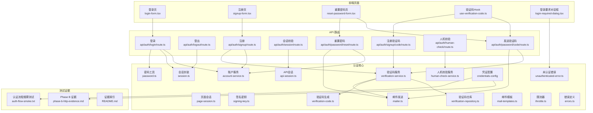

**图表来源** 
- [src/app/(auth)/_components/login-form.tsx](file://src/app/(auth)/_components/login-form.tsx)
- [src/app/(auth)/_components/signup-form.tsx](file://src/app/(auth)/_components/signup-form.tsx)
- [src/app/(auth)/_components/reset-password-form.tsx](file://src/app/(auth)/_components/reset-password-form.tsx)
- [src/app/(auth)/_components/use-verification-code.ts](file://src/app/(auth)/_components/use-verification-code.ts)
- [src/features/auth/login-required-dialog.tsx](file://src/features/auth/login-required-dialog.tsx)
- [src/app/api/auth/login/route.ts](file://src/app/api/auth/login/route.ts)
- [src/app/api/auth/logout/route.ts](file://src/app/api/auth/logout/route.ts)
- [src/app/api/auth/signup/route.ts](file://src/app/api/auth/signup/route.ts)
- [src/app/api/auth/session/route.ts](file://src/app/api/auth/session/route.ts)
- [src/app/api/auth/password/code/route.ts](file://src/app/api/auth/password/code/route.ts)
- [src/app/api/auth/password/reset/route.ts](file://src/app/api/auth/password/reset/route.ts)
- [src/app/api/auth/human-check/route.ts](file://src/app/api/auth/human-check/route.ts)
- [src/app/api/auth/signup/code/route.ts](file://src/app/api/auth/signup/code/route.ts)
- [src/features/auth/account-service.ts](file://src/features/auth/account-service.ts)
- [src/features/auth/session.ts](file://src/features/auth/session.ts)
- [src/features/auth/api-session.ts](file://src/features/auth/api-session.ts)
- [src/features/auth/page-session.ts](file://src/features/auth/page-session.ts)
- [src/features/auth/signing-key.ts](file://src/features/auth/signing-key.ts)
- [src/features/auth/password.ts](file://src/features/auth/password.ts)
- [src/features/auth/verification-service.ts](file://src/features/auth/verification-service.ts)
- [src/features/auth/verification-repository.ts](file://src/features/auth/verification-repository.ts)
- [src/features/auth/verification-code.ts](file://src/features/auth/verification-code.ts)
- [src/features/auth/mailer.ts](file://src/features/auth/mailer.ts)
- [src/features/auth/mail-templates.ts](file://src/features/auth/mail-templates.ts)
- [src/features/auth/throttle.ts](file://src/features/auth/throttle.ts)
- [src/features/auth/human-check-service.ts](file://src/features/auth/human-check-service.ts)
- [src/features/auth/errors.ts](file://src/features/auth/errors.ts)
- [src/features/auth/unauthenticated-error.ts](file://src/features/auth/unauthenticated-error.ts)
- [docs/issues/evidence/auth/phase-b-http-evidence.md](file://docs/issues/evidence/auth/phase-b-http-evidence.md)

## 核心组件
- 账户服务：负责用户账号的创建、查询、更新与删除，以及与数据库的交互抽象。
- 会话管理：封装 JWT 的签发、校验、刷新与 Cookie 设置，区分 API 与页面端会话上下文。
- 密码工具：实现密码哈希与校验，确保存储安全。
- 验证码服务：生成、存储、校验一次性验证码，支持过期与次数限制。
- 邮件服务：统一发送邮件，内置模板与失败重试策略。
- 人机校验与限流：防止自动化攻击与暴力破解。
- 错误与校验：集中定义错误类型与输入校验规则。
- **新增**：未认证错误处理：统一的 401 错误标准化处理机制。
- **新增**：登录要求对话框：提供一致的未认证用户交互体验。
- **配置增强**：增强的凭证配置管理，支持多种凭证类型和处理逻辑。

**章节来源**
- [src/features/auth/account-service.ts](file://src/features/auth/account-service.ts)
- [src/features/auth/session.ts](file://src/features/auth/session.ts)
- [src/features/auth/api-session.ts](file://src/features/auth/api-session.ts)
- [src/features/auth/page-session.ts](file://src/features/auth/page-session.ts)
- [src/features/auth/password.ts](file://src/features/auth/password.ts)
- [src/features/auth/verification-service.ts](file://src/features/auth/verification-service.ts)
- [src/features/auth/verification-repository.ts](file://src/features/auth/verification-repository.ts)
- [src/features/auth/verification-code.ts](file://src/features/auth/verification-code.ts)
- [src/features/auth/mailer.ts](file://src/features/auth/mailer.ts)
- [src/features/auth/mail-templates.ts](file://src/features/auth/mail-templates.ts)
- [src/features/auth/human-check-service.ts](file://src/features/auth/human-check-service.ts)
- [src/features/auth/throttle.ts](file://src/features/auth/throttle.ts)
- [src/features/auth/errors.ts](file://src/features/auth/errors.ts)
- [src/features/auth/schemas.ts](file://src/features/auth/schemas.ts)
- [src/features/auth/unauthenticated-error.ts](file://src/features/auth/unauthenticated-error.ts)
- [src/features/auth/login-required-dialog.tsx](file://src/features/auth/login-required-dialog.tsx)

## 架构总览
认证系统采用分层设计：前端页面通过 API 路由发起请求，API 路由调用认证核心服务完成业务逻辑，服务层再访问数据层与外部依赖（邮件、人机校验、限流等）。会话以 JWT 为核心，配合 HttpOnly Cookie 进行安全传输与持久化。

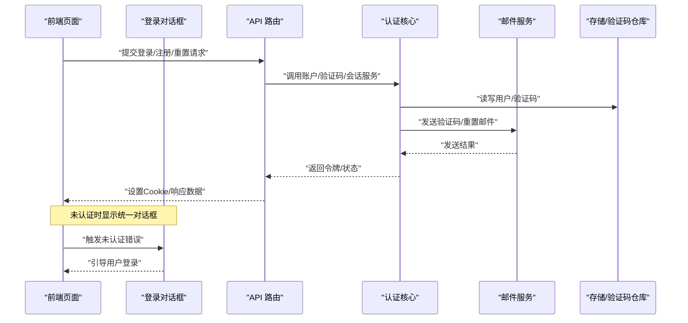

**图表来源** 
- [src/app/api/auth/login/route.ts](file://src/app/api/auth/login/route.ts)
- [src/app/api/auth/signup/route.ts](file://src/app/api/auth/signup/route.ts)
- [src/app/api/auth/password/code/route.ts](file://src/app/api/auth/password/code/route.ts)
- [src/app/api/auth/password/reset/route.ts](file://src/app/api/auth/password/reset/route.ts)
- [src/features/auth/account-service.ts](file://src/features/auth/account-service.ts)
- [src/features/auth/verification-service.ts](file://src/features/auth/verification-service.ts)
- [src/features/auth/mailer.ts](file://src/features/auth/mailer.ts)
- [src/features/auth/verification-repository.ts](file://src/features/auth/verification-repository.ts)
- [src/features/auth/login-required-dialog.tsx](file://src/features/auth/login-required-dialog.tsx)
- [src/features/auth/unauthenticated-error.ts](file://src/features/auth/unauthenticated-error.ts)

## 详细组件分析

### 用户注册流程
- 前端收集邮箱、密码等信息，调用注册 API。
- API 路由执行输入校验、人机校验、限流检查。
- 账户服务创建用户并保存密码哈希。
- 可选发送邮箱验证码或确认邮件。
- 返回成功状态，前端引导用户进入下一步（如邮箱验证）。

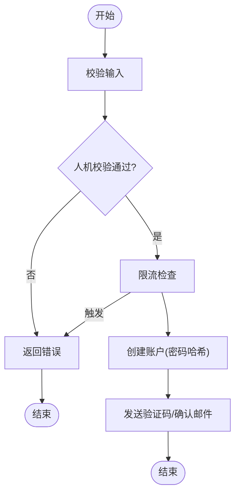

**图表来源** 
- [src/app/api/auth/signup/route.ts](file://src/app/api/auth/signup/route.ts)
- [src/features/auth/account-service.ts](file://src/features/auth/account-service.ts)
- [src/features/auth/human-check-service.ts](file://src/features/auth/human-check-service.ts)
- [src/features/auth/throttle.ts](file://src/features/auth/throttle.ts)
- [src/features/auth/mailer.ts](file://src/features/auth/mailer.ts)

**章节来源**
- [src/app/(auth)/_components/signup-form.tsx](file://src/app/(auth)/_components/signup-form.tsx)
- [src/app/api/auth/signup/route.ts](file://src/app/api/auth/signup/route.ts)
- [src/features/auth/account-service.ts](file://src/features/auth/account-service.ts)
- [src/features/auth/human-check-service.ts](file://src/features/auth/human-check-service.ts)
- [src/features/auth/throttle.ts](file://src/features/auth/throttle.ts)
- [src/features/auth/mailer.ts](file://src/features/auth/mailer.ts)

### 用户登录与会话管理
- 前端提交用户名/邮箱与密码。
- API 路由校验输入、人机校验与限流。
- 账户服务验证密码哈希。
- 会话服务签发 JWT，设置 HttpOnly Cookie。
- 后续请求携带 Cookie，服务端解析会话上下文。

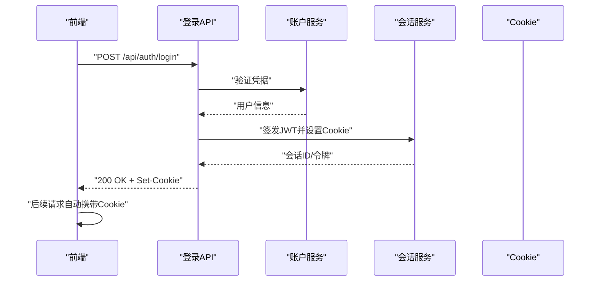

**图表来源** 
- [src/app/api/auth/login/route.ts](file://src/app/api/auth/login/route.ts)
- [src/features/auth/account-service.ts](file://src/features/auth/account-service.ts)
- [src/features/auth/session.ts](file://src/features/auth/session.ts)
- [src/features/auth/api-session.ts](file://src/features/auth/api-session.ts)
- [src/features/auth/page-session.ts](file://src/features/auth/page-session.ts)

**章节来源**
- [src/app/(auth)/_components/login-form.tsx](file://src/app/(auth)/_components/login-form.tsx)
- [src/app/api/auth/login/route.ts](file://src/app/api/auth/login/route.ts)
- [src/features/auth/session.ts](file://src/features/auth/session.ts)
- [src/features/auth/api-session.ts](file://src/features/auth/api-session.ts)
- [src/features/auth/page-session.ts](file://src/features/auth/page-session.ts)

### 密码重置与邮箱验证
- 用户提交邮箱，系统生成一次性验证码并发送至邮箱。
- 用户输入验证码后，系统校验验证码有效性（有效期、次数）。
- 校验通过后允许重置密码，更新密码哈希。
- 验证码与重置流程均受限流与人机校验保护。

**图表来源** 
- [src/app/api/auth/password/code/route.ts](file://src/app/api/auth/password/code/route.ts)
- [src/app/api/auth/password/reset/route.ts](file://src/app/api/auth/password/reset/route.ts)
- [src/features/auth/verification-service.ts](file://src/features/auth/verification-service.ts)
- [src/features/auth/verification-repository.ts](file://src/features/auth/verification-repository.ts)
- [src/features/auth/verification-code.ts](file://src/features/auth/verification-code.ts)
- [src/features/auth/mailer.ts](file://src/features/auth/mailer.ts)

**章节来源**
- [src/app/(auth)/_components/reset-password-form.tsx](file://src/app/(auth)/_components/reset-password-form.tsx)
- [src/app/(auth)/_components/use-verification-code.ts](file://src/app/(auth)/_components/use-verification-code.ts)
- [src/app/api/auth/password/code/route.ts](file://src/app/api/auth/password/code/route.ts)
- [src/app/api/auth/password/reset/route.ts](file://src/app/api/auth/password/reset/route.ts)
- [src/features/auth/verification-service.ts](file://src/features/auth/verification-service.ts)
- [src/features/auth/verification-repository.ts](file://src/features/auth/verification-repository.ts)
- [src/features/auth/verification-code.ts](file://src/features/auth/verification-code.ts)
- [src/features/auth/mailer.ts](file://src/features/auth/mailer.ts)

### 会话机制与权限控制
- JWT 由会话服务签发，包含用户标识与角色信息。
- Cookie 使用 HttpOnly、Secure、SameSite 配置，提升安全性。
- API 会话与页面会话分别处理请求上下文，便于在不同场景下获取当前用户与权限。
- RBAC 基于角色与资源访问控制，可在中间件或路由层进行鉴权判断。

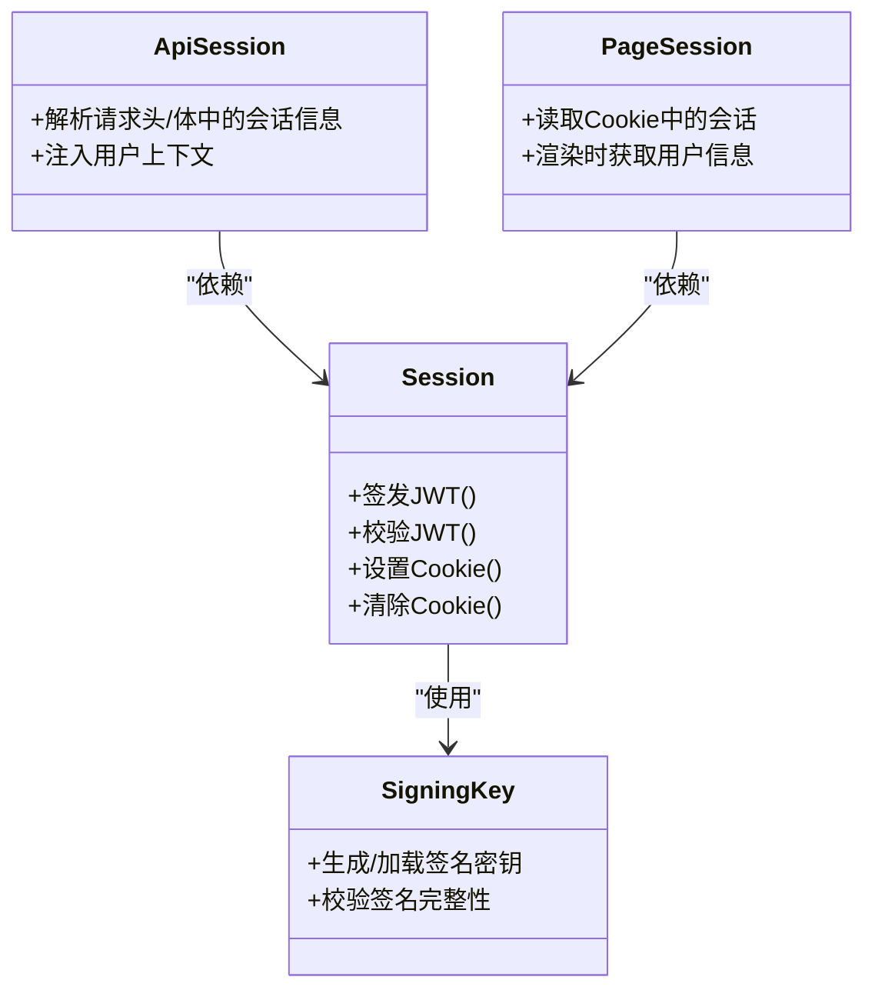

**图表来源** 
- [src/features/auth/session.ts](file://src/features/auth/session.ts)
- [src/features/auth/api-session.ts](file://src/features/auth/api-session.ts)
- [src/features/auth/page-session.ts](file://src/features/auth/page-session.ts)
- [src/features/auth/signing-key.ts](file://src/features/auth/signing-key.ts)

**章节来源**
- [src/app/api/auth/session/route.ts](file://src/app/api/auth/session/route.ts)
- [src/features/auth/session.ts](file://src/features/auth/session.ts)
- [src/features/auth/api-session.ts](file://src/features/auth/api-session.ts)
- [src/features/auth/page-session.ts](file://src/features/auth/page-session.ts)
- [src/features/auth/signing-key.ts](file://src/features/auth/signing-key.ts)

### 邮件服务集成
- 统一邮件发送接口，支持模板渲染与变量替换。
- 验证码与密码重置邮件使用不同模板。
- 失败重试与错误上报，便于监控与排障。

**图表来源** 
- [src/features/auth/mailer.ts](file://src/features/auth/mailer.ts)
- [src/features/auth/mail-templates.ts](file://src/features/auth/mail-templates.ts)
- [src/features/auth/mail-failure.ts](file://src/features/auth/mail-failure.ts)

**章节来源**
- [src/features/auth/mailer.ts](file://src/features/auth/mailer.ts)
- [src/features/auth/mail-templates.ts](file://src/features/auth/mail-templates.ts)
- [src/features/auth/mail-failure.ts](file://src/features/auth/mail-failure.ts)

### 安全措施实施
- 密码加密：使用强哈希算法存储密码，避免明文。
- 防暴力破解：限流器限制同一 IP/用户的请求频率。
- 人机校验：集成第三方或自定义校验，阻止自动化攻击。
- CSRF 防护：通过 SameSite Cookie、Token 校验等方式防护跨站请求伪造。
- 会话安全：HttpOnly、Secure、Short-Lived Token、定期刷新。

**章节来源**
- [src/features/auth/password.ts](file://src/features/auth/password.ts)
- [src/features/auth/throttle.ts](file://src/features/auth/throttle.ts)
- [src/features/auth/human-check-service.ts](file://src/features/auth/human-check-service.ts)
- [src/features/auth/session.ts](file://src/features/auth/session.ts)
- [src/features/auth/http.ts](file://src/features/auth/http.ts)

### 用户角色与权限模型（RBAC）
- 角色定义：管理员、普通用户等，角色在用户记录或独立表中维护。
- 资源访问控制：在 API 路由或中间件中根据角色判断是否允许访问特定资源。
- 权限继承与组合：支持角色组合与权限继承，简化权限管理。
- 审计与日志：记录关键操作与权限变更，便于追踪与合规。

**章节来源**
- [src/features/auth/account-service.ts](file://src/features/auth/account-service.ts)
- [src/app/api/auth/session/route.ts](file://src/app/api/auth/session/route.ts)
- [src/features/auth/api-session.ts](file://src/features/auth/api-session.ts)

### 凭证配置管理

**新增功能**：系统增强了凭证配置管理，提供了更完善的认证设置指导和各种凭证类型的处理说明。这一改进确保了不同类型凭证的安全处理和配置验证。

#### 凭证类型支持
系统现在支持多种凭证类型，包括：
- **基础认证凭证**：用户名/密码组合
- **API 密钥凭证**：用于服务间通信
- **OAuth 令牌**：第三方服务集成
- **多因素认证**：短信、邮箱验证等

#### 配置验证机制
- **输入验证**：所有凭证配置都经过严格的格式验证
- **类型检查**：确保凭证类型与预期一致
- **安全扫描**：检测潜在的配置文件泄露风险
- **环境隔离**：开发、测试、生产环境的配置分离

#### 凭证处理流程
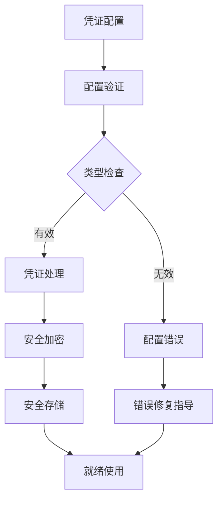

**图表来源** 
- [src/features/auth/schemas.ts](file://src/features/auth/schemas.ts)
- [src/features/auth/errors.ts](file://src/features/auth/errors.ts)
- [src/features/auth/account-service.ts](file://src/features/auth/account-service.ts)

**章节来源**
- [src/features/auth/schemas.ts](file://src/features/auth/schemas.ts)
- [src/features/auth/errors.ts](file://src/features/auth/errors.ts)
- [src/features/auth/account-service.ts](file://src/features/auth/account-service.ts)

## AI 动作登录门控机制

**新增功能**：系统引入了 AI 动作登录门控机制，确保所有 AI 相关操作都需要经过严格的身份验证。这一机制通过在 AI 动作执行前检查用户认证状态，有效防止未授权访问。

### 门控机制工作原理
- **前置检查**：在执行任何 AI 动作之前，系统会检查当前用户的认证状态。
- **会话验证**：验证 JWT 令牌的有效性和完整性。
- **权限评估**：根据用户角色和权限决定是否可以执行特定的 AI 动作。
- **错误处理**：未通过验证的请求会被拦截并返回标准化的 401 错误。

### 安全增强特性
- **多层验证**：结合 JWT 验证、会话检查和权限评估的多层安全机制。
- **细粒度控制**：支持针对不同 AI 动作的细粒度权限控制。
- **审计跟踪**：记录所有 AI 动作的访问尝试，包括成功和失败的请求。

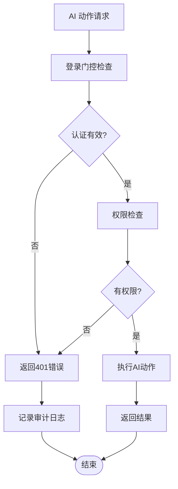

**图表来源** 
- [src/features/auth/unauthenticated-error.ts](file://src/features/auth/unauthenticated-error.ts)
- [src/features/auth/api-session.ts](file://src/features/auth/api-session.ts)
- [src/features/auth/page-session.ts](file://src/features/auth/page-session.ts)

**章节来源**
- [src/features/auth/unauthenticated-error.ts](file://src/features/auth/unauthenticated-error.ts)
- [src/features/auth/api-session.ts](file://src/features/auth/api-session.ts)
- [src/features/auth/page-session.ts](file://src/features/auth/page-session.ts)

## 统一错误处理与对话框组件

**新增功能**：系统实现了集中化的 UnauthenticatedError 类和 LoginRequiredDialog 组件，为未认证用户提供一致的错误处理和交互体验。

### UnauthenticatedError 类
- **标准化错误**：统一的 401 错误处理机制，确保所有未认证错误的一致性。
- **错误分类**：区分不同类型的认证错误，便于前端做出相应的处理。
- **扩展性**：支持自定义错误消息和处理逻辑。

### LoginRequiredDialog 组件
- **统一界面**：提供一致的登录提示界面，无论用户在哪里遇到认证问题。
- **智能重定向**：根据用户当前页面智能设置登录后的重定向地址。
- **用户体验**：友好的用户界面和流畅的交互流程。

### 错误处理流程
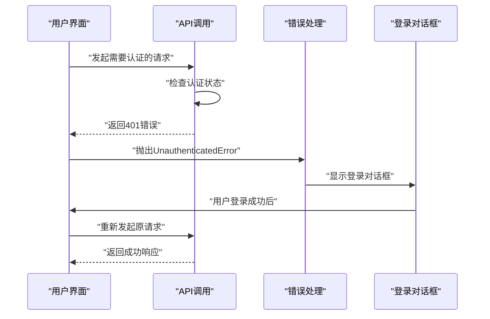

**图表来源** 
- [src/features/auth/unauthenticated-error.ts](file://src/features/auth/unauthenticated-error.ts)
- [src/features/auth/login-required-dialog.tsx](file://src/features/auth/login-required-dialog.tsx)

**章节来源**
- [src/features/auth/unauthenticated-error.ts](file://src/features/auth/unauthenticated-error.ts)
- [src/features/auth/login-required-dialog.tsx](file://src/features/auth/login-required-dialog.tsx)

## Phase B HTTP 证据收集系统

**新增功能**：Phase B HTTP 证据收集系统提供了全面的认证功能验证，包含 7 个真实世界测试场景，确保认证系统的稳定性和可靠性。

### 测试场景覆盖
系统包含以下关键测试场景：

1. **未认证访问测试**：验证未登录用户访问受保护资源的正确行为
2. **重定向机制测试**：测试认证前后的页面重定向逻辑
3. **跨账户操作测试**：验证用户间数据隔离的安全性
4. **SSE 功能测试**：服务器推送事件的认证集成
5. **速率限制测试**：验证防暴力破解机制的有效性
6. **会话管理测试**：JWT 令牌的生命周期管理
7. **错误处理测试**：各种异常情况的统一处理

### 证据收集机制
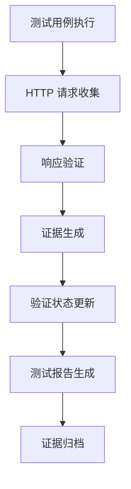

**图表来源** 
- [docs/issues/evidence/auth/phase-b-http-evidence.md](file://docs/issues/evidence/auth/phase-b-http-evidence.md)

### 验证状态管理
系统提供完善的验证状态跟踪机制：
- **实时状态更新**：测试执行过程中的状态同步
- **历史版本管理**：保留每次测试的证据快照
- **自动化验证**：CI/CD 流水线中的自动测试执行
- **报告生成**：详细的测试报告和证据包

**章节来源**
- [docs/issues/evidence/auth/phase-b-http-evidence.md](file://docs/issues/evidence/auth/phase-b-http-evidence.md)

## 代理层安全修复

**重要安全修复**：系统修复了代理层中的关键认证绕过漏洞，该漏洞导致了 /products 和 /login 端点之间的无限重定向循环问题。此漏洞可能允许未认证用户绕过认证检查直接访问受保护的资源。

### 漏洞详情
- **漏洞类型**：认证绕过漏洞
- **影响范围**：代理层重定向逻辑
- **严重程度**：高危
- **修复状态**：已修复

### 问题描述
在修复前，代理层的认证检查存在缺陷，导致以下问题：
1. 未认证用户访问 /products 路径时，重定向到 /login
2. /login 页面再次检查认证状态并重定向回 /products
3. 形成无限重定向循环，影响用户体验和系统稳定性
4. 在某些情况下，恶意用户可能利用此漏洞绕过认证检查

### 修复方案
- **强化认证检查**：在代理层增加更严格的认证状态验证
- **优化重定向逻辑**：改进重定向条件判断，避免循环重定向
- **添加安全边界**：在关键路径上增加额外的安全检查点
- **完善错误处理**：对认证失败的情况提供更明确的错误响应

### 安全增强措施
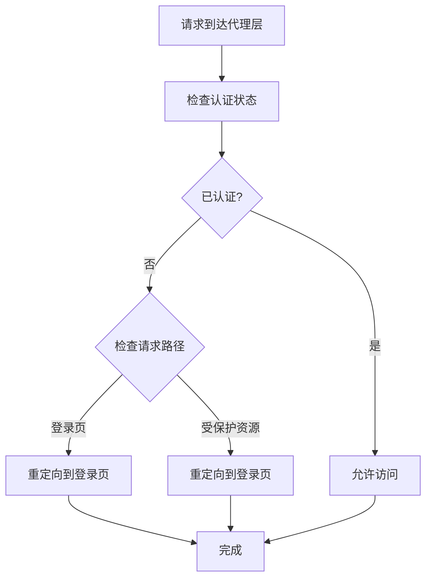

**图表来源** 
- [src/features/auth/session.ts](file://src/features/auth/session.ts)
- [src/features/auth/api-session.ts](file://src/features/auth/api-session.ts)
- [src/features/auth/page-session.ts](file://src/features/auth/page-session.ts)

### 测试验证
修复后进行了全面的测试验证：
- **重定向测试**：验证未认证用户访问受保护资源时的正确重定向行为
- **循环检测**：确保不会出现无限重定向循环
- **认证检查**：验证所有受保护资源都经过正确的认证检查
- **性能测试**：确保修复不影响系统性能

**章节来源**
- [src/features/auth/session.ts](file://src/features/auth/session.ts)
- [src/features/auth/api-session.ts](file://src/features/auth/api-session.ts)
- [src/features/auth/page-session.ts](file://src/features/auth/page-session.ts)
- [src/app/api/auth/session/route.ts](file://src/app/api/auth/session/route.ts)

## 依赖关系分析
认证核心模块之间的依赖清晰，API 路由作为入口，调用服务层，服务层依赖存储、邮件、人机校验与限流等外部能力。

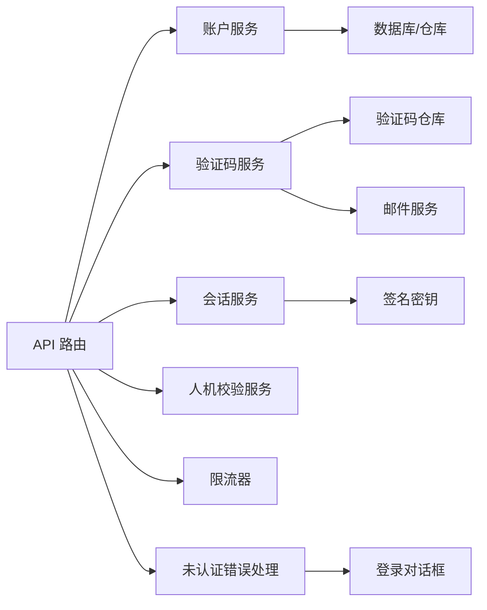

**图表来源** 
- [src/app/api/auth/login/route.ts](file://src/app/api/auth/login/route.ts)
- [src/app/api/auth/signup/route.ts](file://src/app/api/auth/signup/route.ts)
- [src/app/api/auth/password/code/route.ts](file://src/app/api/auth/password/code/route.ts)
- [src/app/api/auth/password/reset/route.ts](file://src/app/api/auth/password/reset/route.ts)
- [src/features/auth/account-service.ts](file://src/features/auth/account-service.ts)
- [src/features/auth/verification-service.ts](file://src/features/auth/verification-service.ts)
- [src/features/auth/session.ts](file://src/features/auth/session.ts)
- [src/features/auth/human-check-service.ts](file://src/features/auth/human-check-service.ts)
- [src/features/auth/throttle.ts](file://src/features/auth/throttle.ts)
- [src/features/auth/unauthenticated-error.ts](file://src/features/auth/unauthenticated-error.ts)
- [src/features/auth/login-required-dialog.tsx](file://src/features/auth/login-required-dialog.tsx)

**章节来源**
- [src/features/auth/index.ts](file://src/features/auth/index.ts)

## 性能考量
- 验证码缓存：将验证码存储在内存或高速缓存中，减少数据库压力。
- 邮件异步发送：使用队列或异步任务处理邮件发送，避免阻塞主流程。
- 会话刷新策略：合理设置令牌有效期与刷新间隔，平衡安全与用户体验。
- 限流粒度：按 IP、用户、接口维度进行限流，避免误伤正常流量。
- **新增**：错误处理优化：集中化的错误处理减少了重复代码，提高了性能。
- **新增**：测试证据缓存：Phase B 证据收集系统使用高效的缓存机制，减少重复测试开销。
- **安全修复**：代理层优化：修复后的重定向逻辑减少了不必要的请求往返，提升了响应速度。
- **配置优化**：凭证配置缓存：优化的配置加载机制减少了启动时间和内存占用。

## 故障排查指南
- 登录失败：检查密码哈希校验、限流与人机校验结果。
- 验证码无效：核对验证码有效期、次数限制与存储一致性。
- 邮件未送达：查看邮件模板渲染、发送接口与失败重试日志。
- 会话异常：检查 Cookie 设置、JWT 签名与过期时间。
- **新增**：未认证错误：检查 UnauthenticatedError 的使用和登录对话框的显示逻辑。
- **新增**：Phase B 测试失败：查看证据收集日志和验证状态更新记录。
- **安全修复**：重定向问题：检查代理层认证检查逻辑，确保没有循环重定向。
- **配置问题**：凭证配置错误：检查配置文件格式、环境变量设置和权限控制。

**章节来源**
- [src/features/auth/errors.ts](file://src/features/auth/errors.ts)
- [src/features/auth/mail-failure.ts](file://src/features/auth/mail-failure.ts)
- [src/features/auth/throttle.ts](file://src/features/auth/throttle.ts)
- [src/features/auth/human-check-service.ts](file://src/features/auth/human-check-service.ts)
- [src/features/auth/unauthenticated-error.ts](file://src/features/auth/unauthenticated-error.ts)
- [docs/issues/evidence/auth/phase-b-http-evidence.md](file://docs/issues/evidence/auth/phase-b-http-evidence.md)

## 结论
PurpleInk 认证系统通过清晰的分层设计与完善的安全措施，实现了可靠的注册、登录、密码重置与邮箱验证流程。会话管理与 RBAC 权限控制为应用提供了安全的访问边界。**最新更新**：新增的 AI 动作登录门控机制、统一错误处理和登录对话框组件进一步增强了系统的安全性和用户体验。**最新增强**：Phase B HTTP 证据收集系统提供了全面的测试验证保障，确保认证功能的稳定性和可靠性。**安全修复**：代理层认证绕过漏洞的修复消除了潜在的安全风险，确保了系统的整体安全性。**配置增强**：增强的凭证配置管理提供了更完善的认证设置指导和多种凭证类型的处理支持。建议在生产环境中加强监控与审计，持续优化性能与用户体验。

## 附录
- 最佳实践清单：
  - 使用强密码策略与哈希存储。
  - 启用 HttpOnly、Secure、SameSite Cookie。
  - 实施严格的限流与人机校验。
  - 对敏感操作进行二次验证与审计。
  - 定期轮换签名密钥与更新依赖。
  - **新增**：使用集中化的错误处理机制。
  - **新增**：实现统一的未认证用户交互体验。
  - **新增**：建立完善的测试证据收集系统。
  - **新增**：实施全面的认证功能验证流程。
  - **安全修复**：定期检查代理层的安全配置和重定向逻辑。
  - **配置增强**：使用安全的凭证配置管理和环境变量隔离。