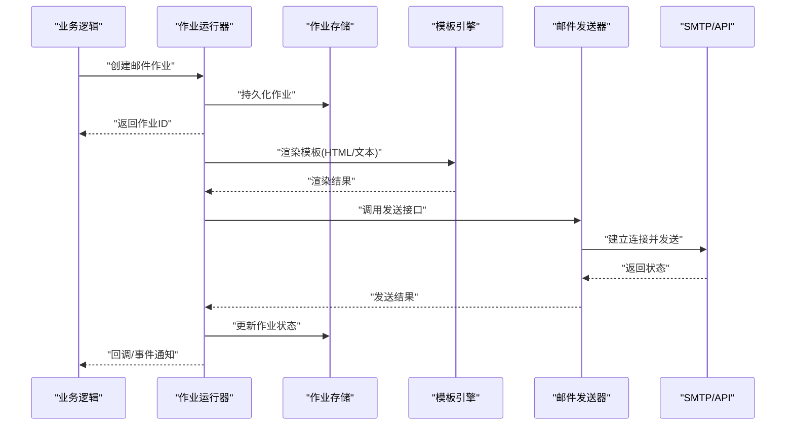
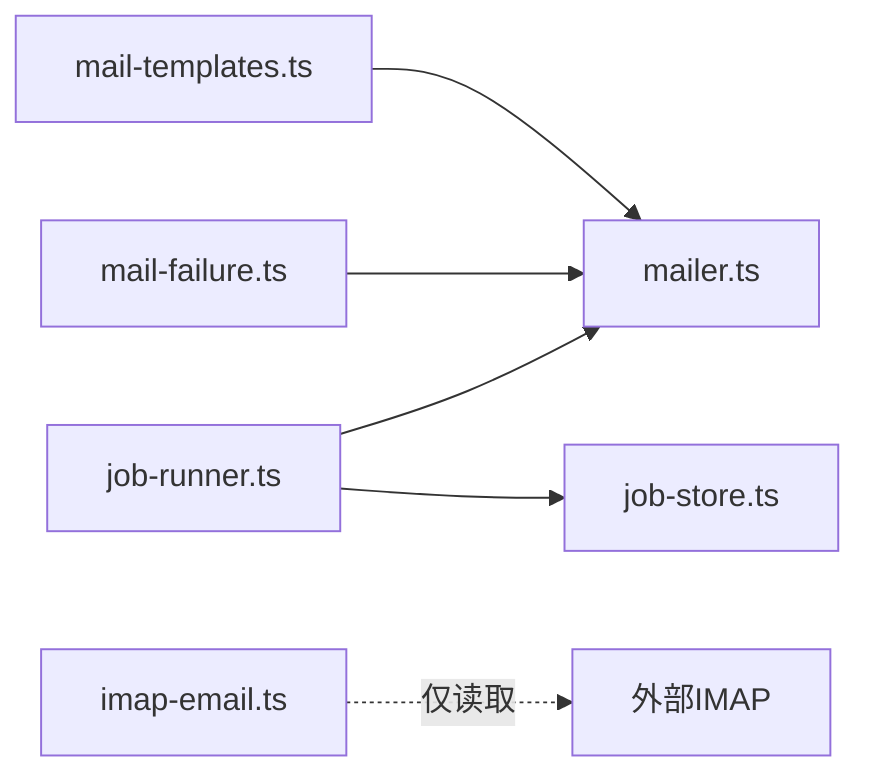

# 邮件服务

<cite>
**本文引用的文件**   
- [server/src/capture/imap-email.ts](file://server/src/capture/imap-email.ts)
- [src/features/auth/mailer.ts](file://src/features/auth/mailer.ts)
- [src/features/auth/mail-templates.ts](file://src/features/auth/mail-templates.ts)
- [src/features/auth/mail-failure.ts](file://src/features/auth/mail-failure.ts)
- [server/src/server/job-runner.ts](file://server/src/server/job-runner.ts)
- [server/src/server/job-store.ts](file://server/src/server/job-store.ts)
- [server/package.json](file://server/package.json)
</cite>

## 目录
1. [简介](#简介)
2. [项目结构](#项目结构)
3. [核心组件](#核心组件)
4. [架构总览](#架构总览)
5. [详细组件分析](#详细组件分析)
6. [依赖分析](#依赖分析)
7. [性能考虑](#性能考虑)
8. [故障排除指南](#故障排除指南)
9. [结论](#结论)
10. [附录](#附录)

## 简介
本文件面向邮件服务的集成与使用，覆盖以下方面：
- 邮件服务提供商集成配置（SMTP、API 密钥、连接池）
- 邮件模板系统（模板引擎、变量替换、多语言支持）
- 邮件发送队列（任务调度、重试机制、失败处理）
- 邮件内容生成与管理（HTML 模板、纯文本降级、附件处理）
- 监控与日志（发送状态、错误追踪、性能指标）
- 扩展指南与故障排除

说明：本项目包含两类邮件相关能力——IMAP 邮件采集（用于从邮箱拉取数据）与认证流程中的邮件发送（用于验证码、重置密码等）。本文重点围绕“邮件发送”进行系统化文档化，同时简要说明 IMAP 采集的边界。

## 项目结构
与邮件相关的代码主要分布在以下位置：
- 认证模块下的邮件发送与模板实现
- 服务器端作业运行器与作业存储（用于队列与持久化）
- IMAP 邮件采集（仅用于读取，非发送）

```mermaid
graph TB
subgraph "认证模块"
A["mailer.ts<br/>邮件发送封装"]
B["mail-templates.ts<br/>模板渲染与变量替换"]
C["mail-failure.ts<br/>失败处理策略"]
end
subgraph "服务器端"
D["job-runner.ts<br/>作业执行器"]
E["job-store.ts<br/>作业存储接口"]
end
subgraph "IMAP 采集"
F["imap-email.ts<br/>IMAP 连接与消息读取"]
end
A --> B
A --> C
D --> E
F -. 仅读取 .->|IMAP| 外部邮箱服务
```

图表来源
- [src/features/auth/mailer.ts](file://src/features/auth/mailer.ts)
- [src/features/auth/mail-templates.ts](file://src/features/auth/mail-templates.ts)
- [src/features/auth/mail-failure.ts](file://src/features/auth/mail-failure.ts)
- [server/src/server/job-runner.ts](file://server/src/server/job-runner.ts)
- [server/src/server/job-store.ts](file://server/src/server/job-store.ts)
- [server/src/capture/imap-email.ts](file://server/src/capture/imap-email.ts)

章节来源
- [src/features/auth/mailer.ts](file://src/features/auth/mailer.ts)
- [src/features/auth/mail-templates.ts](file://src/features/auth/mail-templates.ts)
- [src/features/auth/mail-failure.ts](file://src/features/auth/mail-failure.ts)
- [server/src/server/job-runner.ts](file://server/src/server/job-runner.ts)
- [server/src/server/job-store.ts](file://server/src/server/job-store.ts)
- [server/src/capture/imap-email.ts](file://server/src/capture/imap-email.ts)

## 核心组件
- 邮件发送封装（mailer.ts）
  - 负责选择并调用底层邮件提供商（如 SMTP 或 API），统一发送接口
  - 管理凭据加载、连接参数、重试与错误分类
- 邮件模板系统（mail-templates.ts）
  - 提供模板解析与变量替换，支持 HTML 与纯文本双版本
  - 可结合多语言键值映射进行本地化
- 失败处理（mail-failure.ts）
  - 对网络错误、认证失败、限流等进行分类与重试策略
- 作业运行器与存储（job-runner.ts, job-store.ts）
  - 将邮件发送作为作业入队、调度、执行与记录结果
- IMAP 邮件采集（imap-email.ts）
  - 通过 IMAP 协议读取邮件，用于业务数据采集（非发送）

章节来源
- [src/features/auth/mailer.ts](file://src/features/auth/mailer.ts)
- [src/features/auth/mail-templates.ts](file://src/features/auth/mail-templates.ts)
- [src/features/auth/mail-failure.ts](file://src/features/auth/mail-failure.ts)
- [server/src/server/job-runner.ts](file://server/src/server/job-runner.ts)
- [server/src/server/job-store.ts](file://server/src/server/job-store.ts)
- [server/src/capture/imap-email.ts](file://server/src/capture/imap-email.ts)

## 架构总览
邮件发送的整体流程如下：
- 业务触发（例如用户注册、密码重置）
- 构建邮件作业（收件人、模板、变量、附件）
- 入队与调度（作业运行器）
- 模板渲染（HTML + 纯文本降级）
- 选择提供商并发送（SMTP/API）
- 记录结果与错误（成功/失败/重试）



图表来源
- [server/src/server/job-runner.ts](file://server/src/server/job-runner.ts)
- [server/src/server/job-store.ts](file://server/src/server/job-store.ts)
- [src/features/auth/mail-templates.ts](file://src/features/auth/mail-templates.ts)
- [src/features/auth/mailer.ts](file://src/features/auth/mailer.ts)

## 详细组件分析

### 邮件发送封装（mailer.ts）
- 职责
  - 统一对外暴露 send() 接口，屏蔽不同提供商差异
  - 管理凭据（SMTP 主机、端口、用户名、密码；或 API 密钥）
  - 控制连接参数（超时、TLS/SSL、连接池大小）
  - 错误分类与重试决策（网络异常、认证失败、限流）
- 关键行为
  - 根据配置选择 SMTP 或 API 模式
  - 在发送前校验必要字段（收件人、主题、正文）
  - 记录发送耗时与状态码，便于监控
- 扩展点
  - 新增提供商时，实现统一接口并注入到选择器

章节来源
- [src/features/auth/mailer.ts](file://src/features/auth/mailer.ts)

### 邮件模板系统（mail-templates.ts）
- 职责
  - 维护模板集合（HTML 与纯文本）
  - 变量替换（姓名、链接、验证码等）
  - 多语言支持（按 locale 选择模板与文案）
- 关键行为
  - 渲染 HTML 模板，并生成对应的纯文本降级版本
  - 支持附件占位符与动态附件列表
  - 模板缺失或变量未填充时的回退策略
- 最佳实践
  - 保持 HTML 与纯文本同步更新
  - 敏感信息不放入模板变量（避免泄露）

章节来源
- [src/features/auth/mail-templates.ts](file://src/features/auth/mail-templates.ts)

### 失败处理（mail-failure.ts）
- 职责
  - 对发送失败进行分类（网络、认证、限流、内容校验）
  - 决定重试策略（指数退避、最大重试次数）
  - 记录失败上下文（错误码、堆栈、请求摘要）
- 关键行为
  - 区分可重试与不可重试错误
  - 将失败作业标记为死信或进入人工审核队列
- 监控与告警
  - 统计失败率与常见错误类型
  - 达到阈值时触发告警

章节来源
- [src/features/auth/mail-failure.ts](file://src/features/auth/mail-failure.ts)

### 作业运行器与存储（job-runner.ts, job-store.ts）
- 职责
  - 作业生命周期管理（创建、调度、执行、完成、失败）
  - 并发控制与优先级队列
  - 持久化作业状态与结果
- 关键行为
  - 定时拉取待执行作业
  - 执行完成后更新状态并清理资源
  - 失败作业按策略重试或转入死信队列
- 扩展点
  - 自定义作业处理器以支持更多场景

章节来源
- [server/src/server/job-runner.ts](file://server/src/server/job-runner.ts)
- [server/src/server/job-store.ts](file://server/src/server/job-store.ts)

### IMAP 邮件采集（imap-email.ts）
- 职责
  - 通过 IMAP 协议连接邮箱服务器
  - 拉取指定条件的邮件并解析内容
- 关键行为
  - 连接参数（主机、端口、加密方式）
  - 搜索与分页拉取
  - 错误处理（认证失败、连接中断）
- 注意
  - 该模块仅用于读取，不涉及邮件发送

章节来源
- [server/src/capture/imap-email.ts](file://server/src/capture/imap-email.ts)

## 依赖分析
- 内部依赖
  - mailer.ts 依赖 mail-templates.ts 与 mail-failure.ts
  - job-runner.ts 依赖 job-store.ts 与 mailer.ts
- 外部依赖
  - SMTP 服务器或第三方邮件 API（凭据由环境变量或密钥管理服务提供）
  - IMAP 服务器（仅读取）
- 潜在循环依赖
  - 确保模板与失败处理不反向依赖发送器，避免循环



图表来源
- [src/features/auth/mailer.ts](file://src/features/auth/mailer.ts)
- [src/features/auth/mail-templates.ts](file://src/features/auth/mail-templates.ts)
- [src/features/auth/mail-failure.ts](file://src/features/auth/mail-failure.ts)
- [server/src/server/job-runner.ts](file://server/src/server/job-runner.ts)
- [server/src/server/job-store.ts](file://server/src/server/job-store.ts)
- [server/src/capture/imap-email.ts](file://server/src/capture/imap-email.ts)

章节来源
- [server/package.json](file://server/package.json)

## 性能考虑
- 连接池
  - SMTP 连接复用与池化，减少握手开销
  - 合理设置最大连接数与空闲超时
- 并发与背压
  - 限制并发发送数量，避免被提供商限流
  - 使用队列缓冲突发流量
- 模板渲染
  - 预编译常用模板，减少运行时开销
  - 缓存静态资源（Logo、样式）
- I/O 优化
  - 批量发送时合并附件与压缩
  - 异步处理大附件上传与下载

[本节为通用指导，无需特定文件引用]

## 故障排除指南
- 常见问题
  - 认证失败：检查 SMTP 用户名/密码或 API 密钥是否正确
  - 连接超时：确认防火墙与端口开放，检查 TLS/SSL 配置
  - 限流与封禁：降低并发，启用指数退避重试
  - 模板渲染错误：确保所有变量已填充，HTML 合法
- 排查步骤
  - 查看作业状态与错误日志
  - 复现实验环境，最小化输入验证
  - 逐步禁用功能定位问题（关闭附件、简化模板）
- 恢复策略
  - 自动重试与死信队列
  - 人工介入与告警通知

章节来源
- [src/features/auth/mail-failure.ts](file://src/features/auth/mail-failure.ts)
- [server/src/server/job-runner.ts](file://server/src/server/job-runner.ts)

## 结论
本项目提供了完整的邮件发送能力与模板系统，并通过作业运行器实现可靠调度与失败处理。配合 IMAP 采集能力，可满足复杂业务场景。建议在生产环境中完善监控、告警与审计，确保高可用与可观测性。

[本节为总结，无需特定文件引用]

## 附录
- 配置清单（示例项）
  - SMTP：主机、端口、用户名、密码、加密方式
  - API：提供商、密钥、区域/端点
  - 连接池：最大连接数、超时、重试次数
  - 模板：默认语言、回退策略、附件路径
- 监控指标
  - 发送成功率、平均延迟、失败原因分布
  - 队列长度、作业积压、重试次数
- 安全建议
  - 凭据通过环境变量或密钥管理服务注入
  - 最小权限原则，限制访问范围

[本节为补充信息，无需特定文件引用]