# 邮箱验证

<cite>
**本文引用的文件**   
- [verification-code.ts](file://src/features/auth/verification-code.ts)
- [verification-repository.ts](file://src/features/auth/verification-repository.ts)
- [verification-service.ts](file://src/features/auth/verification-service.ts)
- [mail-templates.ts](file://src/features/auth/mail-templates.ts)
- [mailer.ts](file://src/features/auth/mailer.ts)
- [human-check.ts](file://src/features/auth/human-check.ts)
- [human-check-service.ts](file://src/features/auth/human-check-service.ts)
- [throttle.ts](file://src/features/auth/throttle.ts)
- [auth-api.ts](file://src/app/(auth)/_components/auth-api.ts)
- [signup-form.tsx](file://src/app/(auth)/_components/signup-form.tsx)
- [login-form.tsx](file://src/app/(auth)/_components/login-form.tsx)
- [use-verification-code.ts](file://src/app/(auth)/_components/use-verification-code.ts)
- [human-check-field.tsx](file://src/components/ui/human-check-field.tsx)
- [verification-code-field.demo.tsx](file://src/components/ui/verification-code-field.demo.tsx)
- [route.ts](file://src/app/api/auth/signup/route.ts)
- [route.ts](file://src/app/api/auth/signup/code/route.ts)
- [route.ts](file://src/app/api/auth/login/route.ts)
- [route.ts](file://src/app/api/auth/human-check/route.ts)
</cite>

## 目录
1. [简介](#简介)
2. [项目结构](#项目结构)
3. [核心组件](#核心组件)
4. [架构总览](#架构总览)
5. [详细组件分析](#详细组件分析)
6. [依赖关系分析](#依赖关系分析)
7. [性能考虑](#性能考虑)
8. [故障排查指南](#故障排查指南)
9. [结论](#结论)
10. [附录](#附录)

## 简介
本文件面向邮箱验证码与邮件验证流程的完整实现，覆盖以下关键主题：
- 验证码生成算法：随机性保证、长度控制、字符集选择
- 验证码生命周期管理：存储策略、过期清理、重试限制
- 邮件发送服务集成：模板渲染、附件处理、失败重试
- 人机验证实现：CAPTCHA 集成、行为分析、风险评分
- 验证流程状态机：待验证、已验证、过期等状态转换
- 邮件服务配置与故障恢复策略
- 性能优化与监控指标

## 项目结构
邮箱验证相关代码主要位于前端应用层与功能模块中：
- 功能模块（features/auth）：验证码生成、存储、校验、邮件模板与发送、人机校验、限流等
- 应用层（app/(auth)）：注册/登录表单、验证码输入交互、API 调用封装
- API 路由（app/api/auth）：注册、验证码发送、登录、人机校验等接口

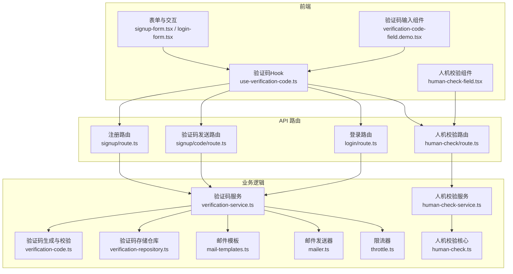

**图表来源** 
- [verification-code.ts](file://src/features/auth/verification-code.ts)
- [verification-repository.ts](file://src/features/auth/verification-repository.ts)
- [verification-service.ts](file://src/features/auth/verification-service.ts)
- [mail-templates.ts](file://src/features/auth/mail-templates.ts)
- [mailer.ts](file://src/features/auth/mailer.ts)
- [human-check.ts](file://src/features/auth/human-check.ts)
- [human-check-service.ts](file://src/features/auth/human-check-service.ts)
- [throttle.ts](file://src/features/auth/throttle.ts)
- [signup-form.tsx](file://src/app/(auth)/_components/signup-form.tsx)
- [login-form.tsx](file://src/app/(auth)/_components/login-form.tsx)
- [use-verification-code.ts](file://src/app/(auth)/_components/use-verification-code.ts)
- [human-check-field.tsx](file://src/components/ui/human-check-field.tsx)
- [verification-code-field.demo.tsx](file://src/components/ui/verification-code-field.demo.tsx)
- [route.ts](file://src/app/api/auth/signup/route.ts)
- [route.ts](file://src/app/api/auth/signup/code/route.ts)
- [route.ts](file://src/app/api/auth/login/route.ts)
- [route.ts](file://src/app/api/auth/human-check/route.ts)

**章节来源**
- [verification-code.ts](file://src/features/auth/verification-code.ts)
- [verification-repository.ts](file://src/features/auth/verification-repository.ts)
- [verification-service.ts](file://src/features/auth/verification-service.ts)
- [mail-templates.ts](file://src/features/auth/mail-templates.ts)
- [mailer.ts](file://src/features/auth/mailer.ts)
- [human-check.ts](file://src/features/auth/human-check.ts)
- [human-check-service.ts](file://src/features/auth/human-check-service.ts)
- [throttle.ts](file://src/features/auth/throttle.ts)
- [auth-api.ts](file://src/app/(auth)/_components/auth-api.ts)
- [signup-form.tsx](file://src/app/(auth)/_components/signup-form.tsx)
- [login-form.tsx](file://src/app/(auth)/_components/login-form.tsx)
- [use-verification-code.ts](file://src/app/(auth)/_components/use-verification-code.ts)
- [human-check-field.tsx](file://src/components/ui/human-check-field.tsx)
- [verification-code-field.demo.tsx](file://src/components/ui/verification-code-field.demo.tsx)
- [route.ts](file://src/app/api/auth/signup/route.ts)
- [route.ts](file://src/app/api/auth/signup/code/route.ts)
- [route.ts](file://src/app/api/auth/login/route.ts)
- [route.ts](file://src/app/api/auth/human-check/route.ts)

## 核心组件
- 验证码生成与校验（verification-code.ts）
  - 负责生成安全随机验证码、长度控制、字符集选择、校验匹配
- 验证码存储仓库（verification-repository.ts）
  - 负责持久化验证码记录、过期清理、按邮箱查询
- 验证码服务（verification-service.ts）
  - 编排验证码生命周期：生成、发送、校验、重试限制、过期处理
- 邮件模板（mail-templates.ts）
  - 渲染邮件正文与主题，支持变量替换与可选附件
- 邮件发送器（mailer.ts）
  - 对接外部邮件服务，支持失败重试、退避策略、错误分类
- 人机校验（human-check.ts, human-check-service.ts）
  - 集成 CAPTCHA、行为分析、风险评分，返回是否通过
- 限流器（throttle.ts）
  - 基于邮箱/IP 的发送频率限制，防止滥用

**章节来源**
- [verification-code.ts](file://src/features/auth/verification-code.ts)
- [verification-repository.ts](file://src/features/auth/verification-repository.ts)
- [verification-service.ts](file://src/features/auth/verification-service.ts)
- [mail-templates.ts](file://src/features/auth/mail-templates.ts)
- [mailer.ts](file://src/features/auth/mailer.ts)
- [human-check.ts](file://src/features/auth/human-check.ts)
- [human-check-service.ts](file://src/features/auth/human-check-service.ts)
- [throttle.ts](file://src/features/auth/throttle.ts)

## 架构总览
整体流程由前端触发 API 请求，后端路由调用服务层完成验证码生成、存储、邮件发送与人机校验，最终返回结果给前端。

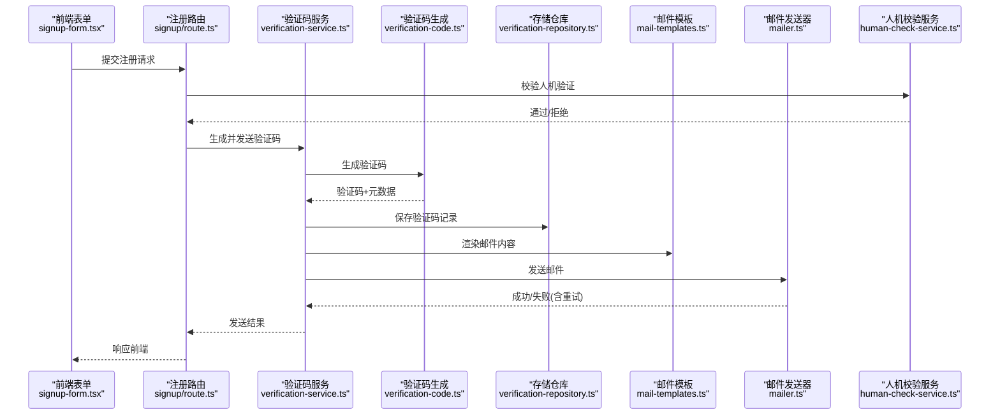

**图表来源** 
- [signup-form.tsx](file://src/app/(auth)/_components/signup-form.tsx)
- [route.ts](file://src/app/api/auth/signup/route.ts)
- [verification-service.ts](file://src/features/auth/verification-service.ts)
- [verification-code.ts](file://src/features/auth/verification-code.ts)
- [verification-repository.ts](file://src/features/auth/verification-repository.ts)
- [mail-templates.ts](file://src/features/auth/mail-templates.ts)
- [mailer.ts](file://src/features/auth/mailer.ts)
- [human-check-service.ts](file://src/features/auth/human-check-service.ts)

## 详细组件分析

### 验证码生成与校验（verification-code.ts）
- 随机性保证
  - 使用安全的随机源生成字节序列，避免可预测性
- 长度控制
  - 支持固定或动态长度策略，默认长度可配置
- 字符集选择
  - 数字字母组合，排除易混淆字符（如 0/O、1/I/l）
- 校验匹配
  - 提供严格匹配与容错策略（如忽略大小写、去除分隔符）

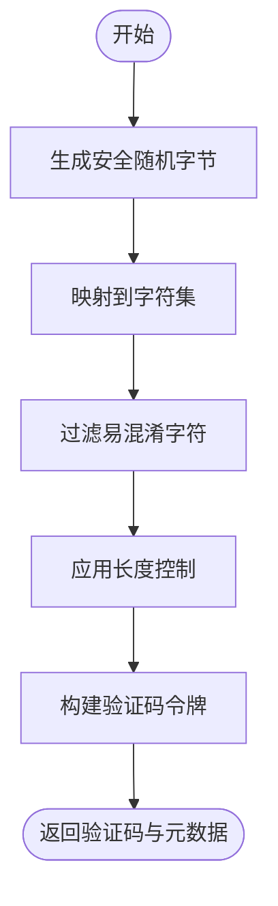

**图表来源** 
- [verification-code.ts](file://src/features/auth/verification-code.ts)

**章节来源**
- [verification-code.ts](file://src/features/auth/verification-code.ts)

### 验证码存储仓库（verification-repository.ts）
- 存储策略
  - 以邮箱为键，存储验证码哈希、创建时间、过期时间、尝试次数
- 过期清理
  - 定期扫描并删除过期记录，释放空间
- 查询与更新
  - 按邮箱获取最新有效验证码，更新尝试次数与状态

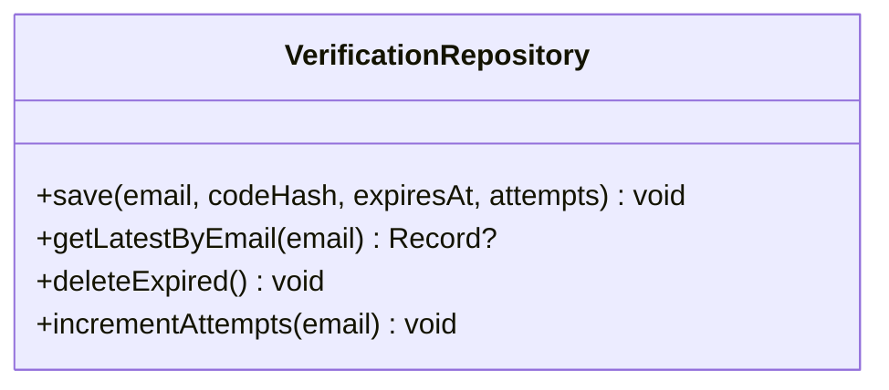

**图表来源** 
- [verification-repository.ts](file://src/features/auth/verification-repository.ts)

**章节来源**
- [verification-repository.ts](file://src/features/auth/verification-repository.ts)

### 验证码服务（verification-service.ts）
- 生命周期管理
  - 生成验证码、写入存储、渲染模板、发送邮件、重试与回滚
- 重试限制
  - 基于邮箱/IP 的频率限制，超过阈值拒绝发送
- 过期处理
  - 校验时检查过期时间，过期则要求重新发送

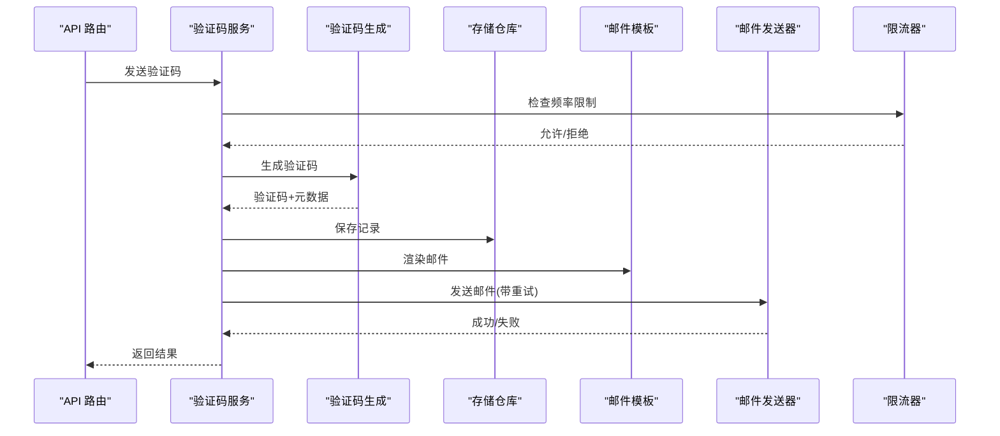

**图表来源** 
- [verification-service.ts](file://src/features/auth/verification-service.ts)
- [verification-code.ts](file://src/features/auth/verification-code.ts)
- [verification-repository.ts](file://src/features/auth/verification-repository.ts)
- [mail-templates.ts](file://src/features/auth/mail-templates.ts)
- [mailer.ts](file://src/features/auth/mailer.ts)
- [throttle.ts](file://src/features/auth/throttle.ts)

**章节来源**
- [verification-service.ts](file://src/features/auth/verification-service.ts)

### 邮件模板与发送（mail-templates.ts, mailer.ts）
- 模板渲染
  - 支持变量替换（邮箱、验证码、链接）、多语言与主题
- 附件处理
  - 支持可选附件（如品牌 Logo、说明文档），大小限制与类型白名单
- 失败重试
  - 指数退避、最大重试次数、错误分类（网络/认证/配额）

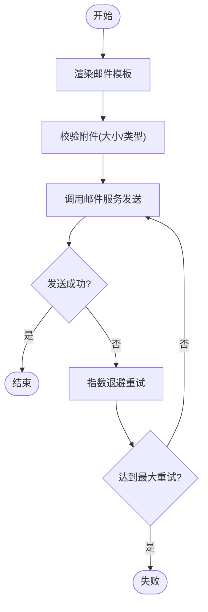

**图表来源** 
- [mail-templates.ts](file://src/features/auth/mail-templates.ts)
- [mailer.ts](file://src/features/auth/mailer.ts)

**章节来源**
- [mail-templates.ts](file://src/features/auth/mail-templates.ts)
- [mailer.ts](file://src/features/auth/mailer.ts)

### 人机验证（human-check.ts, human-check-service.ts）
- CAPTCHA 集成
  - 调用第三方 CAPTCHA 服务，验证用户交互合法性
- 行为分析
  - 采集鼠标轨迹、点击间隔、滚动行为等特征
- 风险评分
  - 综合多项信号计算风险分数，设定阈值判定通过与否

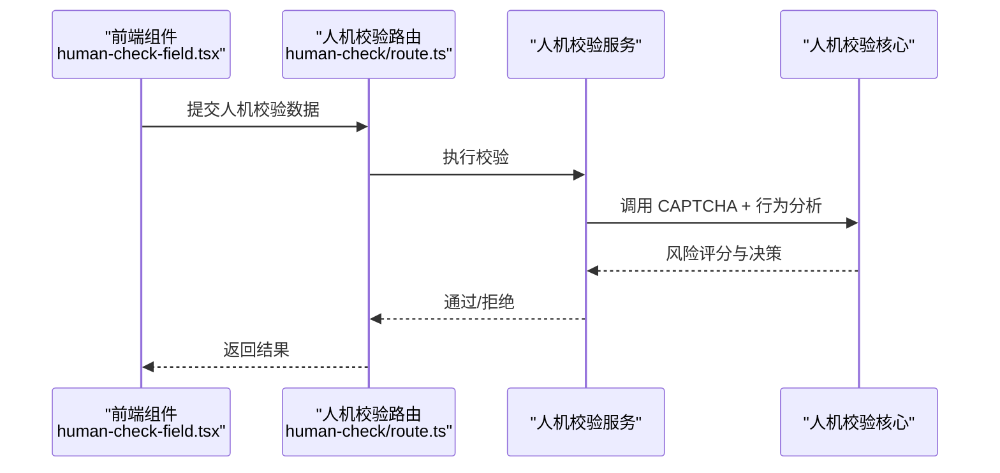

**图表来源** 
- [human-check-field.tsx](file://src/components/ui/human-check-field.tsx)
- [route.ts](file://src/app/api/auth/human-check/route.ts)
- [human-check-service.ts](file://src/features/auth/human-check-service.ts)
- [human-check.ts](file://src/features/auth/human-check.ts)

**章节来源**
- [human-check.ts](file://src/features/auth/human-check.ts)
- [human-check-service.ts](file://src/features/auth/human-check-service.ts)

### 限流器（throttle.ts）
- 基于邮箱/IP 的滑动窗口计数
- 可配置时间窗口与最大请求数
- 快速拒绝超限请求，降低系统压力

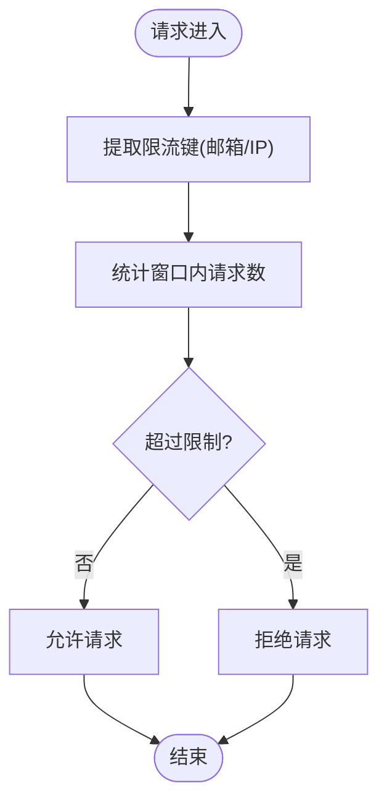

**图表来源** 
- [throttle.ts](file://src/features/auth/throttle.ts)

**章节来源**
- [throttle.ts](file://src/features/auth/throttle.ts)

### 前端交互与 API 调用（auth-api.ts, signup-form.tsx, login-form.tsx, use-verification-code.ts）
- auth-api.ts
  - 统一封装 API 调用，处理错误与重试
- signup-form.tsx / login-form.tsx
  - 表单收集用户输入，触发验证码发送与校验
- use-verification-code.ts
  - 管理验证码状态、倒计时、自动刷新、错误提示

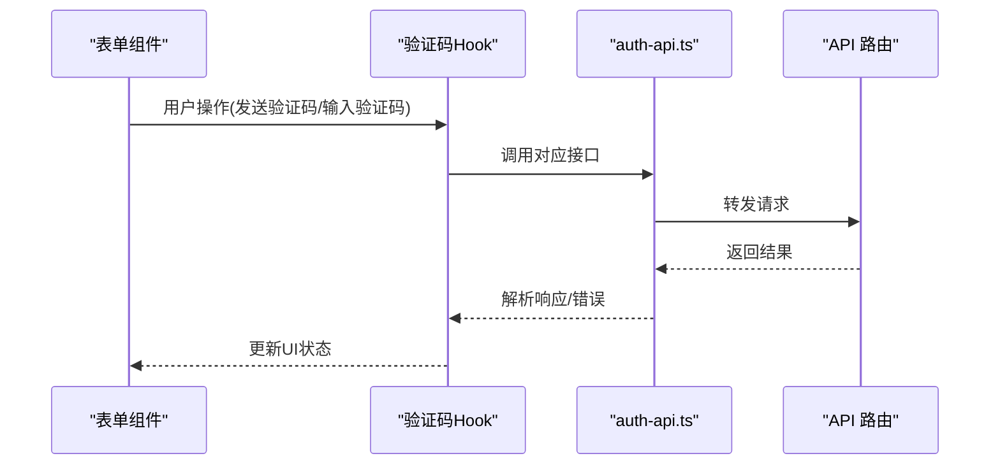

**图表来源** 
- [auth-api.ts](file://src/app/(auth)/_components/auth-api.ts)
- [signup-form.tsx](file://src/app/(auth)/_components/signup-form.tsx)
- [login-form.tsx](file://src/app/(auth)/_components/login-form.tsx)
- [use-verification-code.ts](file://src/app/(auth)/_components/use-verification-code.ts)

**章节来源**
- [auth-api.ts](file://src/app/(auth)/_components/auth-api.ts)
- [signup-form.tsx](file://src/app/(auth)/_components/signup-form.tsx)
- [login-form.tsx](file://src/app/(auth)/_components/login-form.tsx)
- [use-verification-code.ts](file://src/app/(auth)/_components/use-verification-code.ts)

### 验证流程状态机设计
状态包括：待验证、已验证、过期、被锁定（多次失败）。

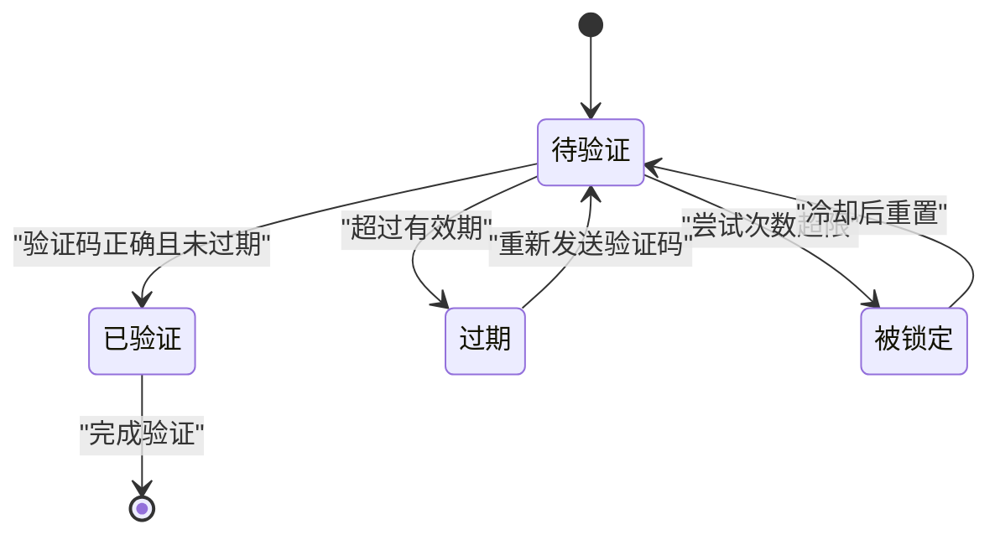

[此图为概念性状态机，不直接映射具体源码文件]

## 依赖关系分析
- 验证码服务依赖验证码生成、存储仓库、邮件模板、邮件发送器与限流器
- 人机校验服务依赖人机校验核心
- 前端表单与 Hook 依赖 API 路由与服务层

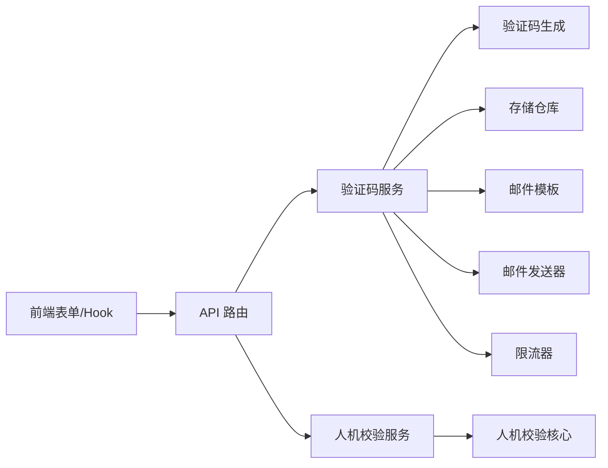

**图表来源** 
- [verification-service.ts](file://src/features/auth/verification-service.ts)
- [verification-code.ts](file://src/features/auth/verification-code.ts)
- [verification-repository.ts](file://src/features/auth/verification-repository.ts)
- [mail-templates.ts](file://src/features/auth/mail-templates.ts)
- [mailer.ts](file://src/features/auth/mailer.ts)
- [throttle.ts](file://src/features/auth/throttle.ts)
- [human-check-service.ts](file://src/features/auth/human-check-service.ts)
- [human-check.ts](file://src/features/auth/human-check.ts)
- [auth-api.ts](file://src/app/(auth)/_components/auth-api.ts)
- [signup-form.tsx](file://src/app/(auth)/_components/signup-form.tsx)
- [login-form.tsx](file://src/app/(auth)/_components/login-form.tsx)
- [use-verification-code.ts](file://src/app/(auth)/_components/use-verification-code.ts)
- [route.ts](file://src/app/api/auth/signup/route.ts)
- [route.ts](file://src/app/api/auth/signup/code/route.ts)
- [route.ts](file://src/app/api/auth/login/route.ts)
- [route.ts](file://src/app/api/auth/human-check/route.ts)

**章节来源**
- [verification-service.ts](file://src/features/auth/verification-service.ts)
- [verification-code.ts](file://src/features/auth/verification-code.ts)
- [verification-repository.ts](file://src/features/auth/verification-repository.ts)
- [mail-templates.ts](file://src/features/auth/mail-templates.ts)
- [mailer.ts](file://src/features/auth/mailer.ts)
- [throttle.ts](file://src/features/auth/throttle.ts)
- [human-check-service.ts](file://src/features/auth/human-check-service.ts)
- [human-check.ts](file://src/features/auth/human-check.ts)
- [auth-api.ts](file://src/app/(auth)/_components/auth-api.ts)
- [signup-form.tsx](file://src/app/(auth)/_components/signup-form.tsx)
- [login-form.tsx](file://src/app/(auth)/_components/login-form.tsx)
- [use-verification-code.ts](file://src/app/(auth)/_components/use-verification-code.ts)
- [route.ts](file://src/app/api/auth/signup/route.ts)
- [route.ts](file://src/app/api/auth/signup/code/route.ts)
- [route.ts](file://src/app/api/auth/login/route.ts)
- [route.ts](file://src/app/api/auth/human-check/route.ts)

## 性能考虑
- 验证码生成
  - 使用高效随机源，避免阻塞；批量生成时采用池化策略
- 存储访问
  - 缓存热点邮箱的最新验证码；过期清理任务异步执行
- 邮件发送
  - 连接池与并发限制；失败重试采用指数退避；队列化发送
- 人机校验
  - 本地行为分析优先，远程 CAPTCHA 调用降级与超时保护
- 限流
  - 内存计数器配合持久化备份，避免重启丢失
- 监控指标
  - 验证码生成耗时、发送成功率、重试次数、过期率、人机校验通过率、错误分类分布

[本节为通用指导，不直接分析具体文件]

## 故障排查指南
- 验证码无法发送
  - 检查限流器是否拒绝；查看邮件发送器错误日志与重试情况
- 验证码无效
  - 核对字符集与长度配置；确认存储记录是否过期或被覆盖
- 人机校验失败
  - 检查 CAPTCHA 密钥与网络连通性；调整风险评分阈值
- 邮件模板异常
  - 校验模板变量注入；检查附件大小与类型白名单

**章节来源**
- [throttle.ts](file://src/features/auth/throttle.ts)
- [mailer.ts](file://src/features/auth/mailer.ts)
- [mail-templates.ts](file://src/features/auth/mail-templates.ts)
- [human-check.ts](file://src/features/auth/human-check.ts)
- [human-check-service.ts](file://src/features/auth/human-check-service.ts)

## 结论
本邮箱验证系统围绕验证码生成、存储、邮件发送与人机校验形成闭环，具备完善的生命周期管理与容错机制。通过限流、重试、过期清理与风险评分，保障安全性与可用性。建议在生产环境完善监控与告警，持续优化性能与用户体验。

[本节为总结，不直接分析具体文件]

## 附录
- 配置项建议
  - 验证码长度、字符集、有效期、重试次数、限流窗口与阈值、邮件服务凭据、CAPTCHA 密钥
- 最佳实践
  - 最小权限原则、敏感信息加密存储、审计日志、灰度发布与回滚策略

[本节为补充信息，不直接分析具体文件]