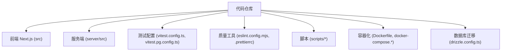
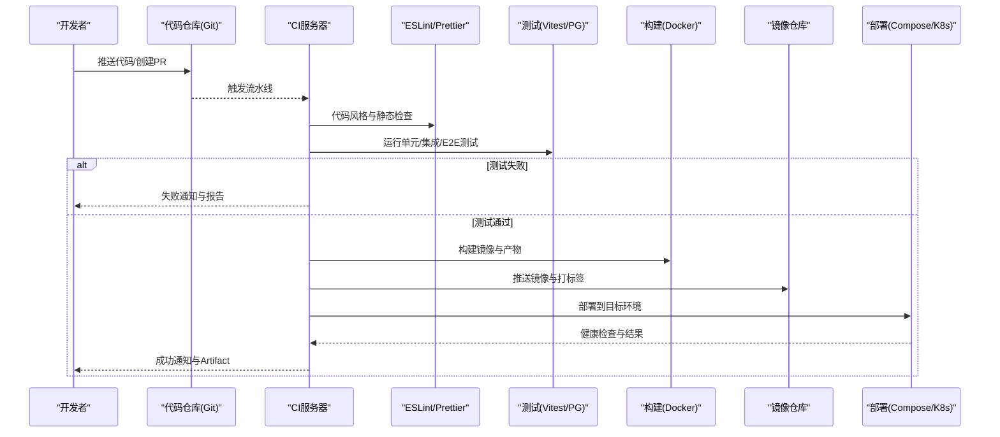
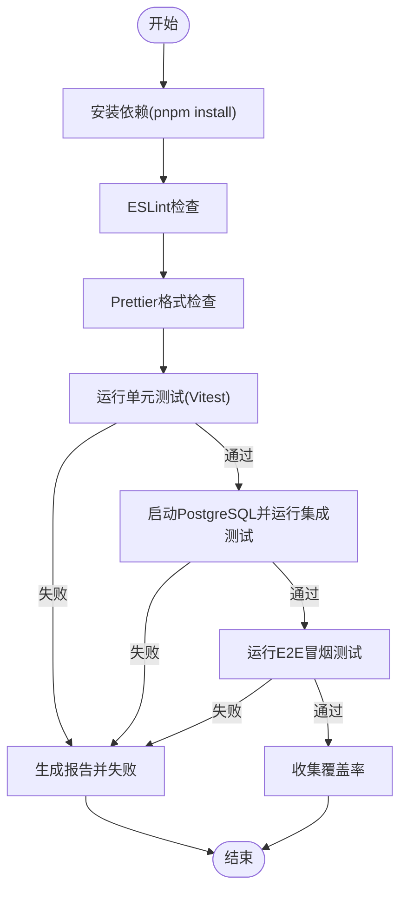
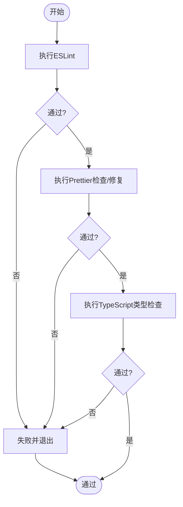
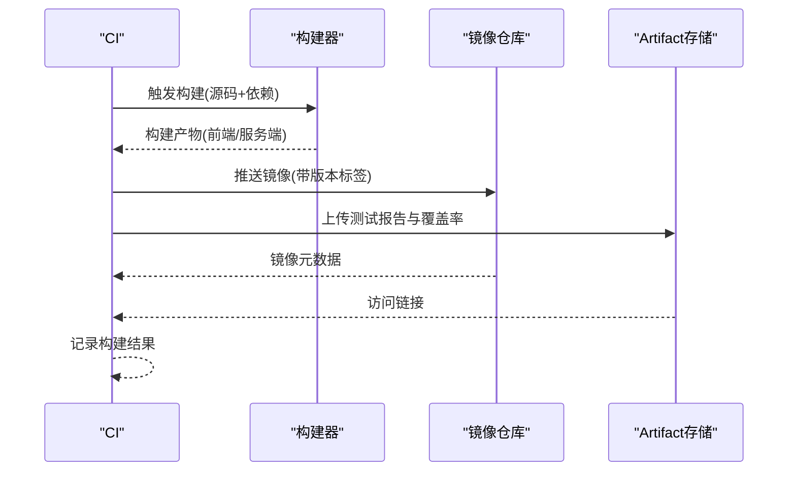
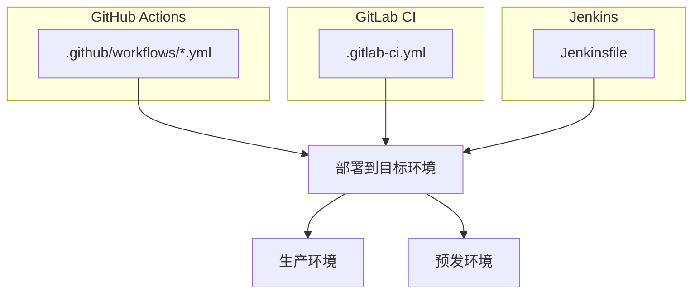
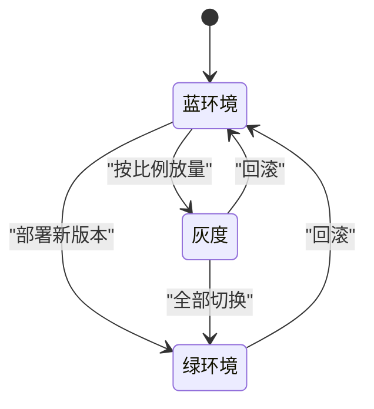
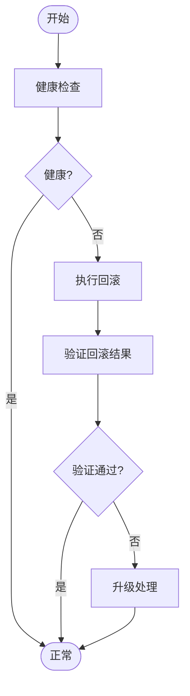
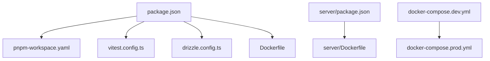

# CI/CD流水线配置

<cite>
**本文引用的文件**   
- [package.json](file://package.json)
- [vitest.config.ts](file://vitest.config.ts)
- [vitest.pg.config.ts](file://vitest.pg.config.ts)
- [eslint.config.mjs](file://eslint.config.mjs)
- [.prettierrc](file://.prettierrc)
- [.prettierignore](file://.prettierignore)
- [Dockerfile](file://Dockerfile)
- [docker-compose.dev.yml](file://docker-compose.dev.yml)
- [docker-compose.prod.yml](file://docker-compose.prod.yml)
- [server/Dockerfile](file://server/Dockerfile)
- [deploy/reverse-proxy/Dockerfile](file://deploy/reverse-proxy/Dockerfile)
- [scripts/verify/e2e-smoke.ts](file://scripts/verify/e2e-smoke.ts)
- [scripts/verify/auth-flow-smoke.mjs](file://scripts/verify/auth-flow-smoke.mjs)
- [scripts/setup/db-migrate.ts](file://scripts/setup/db-migrate.ts)
- [drizzle.config.ts](file://drizzle.config.ts)
- [next.config.ts](file://next.config.ts)
- [tsconfig.json](file://tsconfig.json)
- [pnpm-workspace.yaml](file://pnpm-workspace.yaml)
</cite>

## 目录
1. [简介](#简介)
2. [项目结构](#项目结构)
3. [核心组件](#核心组件)
4. [架构总览](#架构总览)
5. [详细组件分析](#详细组件分析)
6. [依赖分析](#依赖分析)
7. [性能考虑](#性能考虑)
8. [故障排查指南](#故障排查指南)
9. [结论](#结论)
10. [附录](#附录)

## 简介
本指南面向PurpleInk平台的CI/CD流水线设计与落地，覆盖自动化测试（单元测试、集成测试、E2E测试）、代码质量检查（ESLint、Prettier、TypeScript编译）、构建与发布（Docker镜像、版本管理、Artifact管理），以及多平台部署（GitHub Actions、GitLab CI、Jenkins）和灰度/蓝绿发布与回滚策略。文档基于仓库现有脚本与配置文件进行系统化梳理，帮助团队快速搭建稳定、可观测、可回滚的交付流水线。

## 项目结构
仓库采用前后端同仓（Monorepo）组织，前端使用Next.js，后端服务位于server目录，测试框架为Vitest，包管理器为pnpm工作区，数据库迁移使用Drizzle。关键目录与职责：
- src：前端应用与业务逻辑
- server：Node服务端与渲染管线
- scripts：开发、迁移、验证与E2E脚本
- deploy：反向代理与容器化入口
- .prettierrc/.prettierignore：代码格式化规则与忽略
- eslint.config.mjs：ESLint规则
- vitest.config.ts / vitest.pg.config.ts：单元测试与PostgreSQL集成测试配置
- drizzle.config.ts：数据库迁移配置
- Dockerfile / docker-compose.*：容器编排与镜像构建
- pnpm-workspace.yaml：工作区定义

**章节来源**
- [package.json](file://package.json)
- [pnpm-workspace.yaml](file://pnpm-workspace.yaml)
- [vitest.config.ts](file://vitest.config.ts)
- [vitest.pg.config.ts](file://vitest.pg.config.ts)
- [eslint.config.mjs](file://eslint.config.mjs)
- [.prettierrc](file://.prettierrc)
- [.prettierignore](file://.prettierignore)
- [drizzle.config.ts](file://drizzle.config.ts)
- [Dockerfile](file://Dockerfile)
- [docker-compose.dev.yml](file://docker-compose.dev.yml)
- [docker-compose.prod.yml](file://docker-compose.prod.yml)

## 核心组件
- 测试体系
  - 单元测试：Vitest运行，覆盖前端组件、服务端逻辑与工具函数
  - 集成测试：基于PostgreSQL的测试套件，通过独立配置文件隔离执行
  - E2E测试：基于脚本的冒烟与页面级验证，包含认证流程与关键路径
- 代码质量
  - ESLint：统一静态检查与错误拦截
  - Prettier：统一代码风格与自动格式化
  - TypeScript：类型检查与编译校验
- 构建与发布
  - Docker多阶段构建：前端产物与服务端镜像分离
  - 版本管理：语义化版本与标签推送
  - Artifact管理：测试报告、覆盖率、镜像元数据归档
- 部署编排
  - Compose环境：开发与生产环境差异化管理
  - 反向代理：Nginx或Caddy等容器化入口

**章节来源**
- [vitest.config.ts](file://vitest.config.ts)
- [vitest.pg.config.ts](file://vitest.pg.config.ts)
- [eslint.config.mjs](file://eslint.config.mjs)
- [.prettierrc](file://.prettierrc)
- [Dockerfile](file://Dockerfile)
- [server/Dockerfile](file://server/Dockerfile)
- [docker-compose.dev.yml](file://docker-compose.dev.yml)
- [docker-compose.prod.yml](file://docker-compose.prod.yml)

## 架构总览
下图展示从代码提交到部署上线的端到端流水线，包括质量门禁、测试、构建、镜像推送与部署。

**图示来源**
- [Dockerfile](file://Dockerfile)
- [server/Dockerfile](file://server/Dockerfile)
- [docker-compose.dev.yml](file://docker-compose.dev.yml)
- [docker-compose.prod.yml](file://docker-compose.prod.yml)
- [vitest.config.ts](file://vitest.config.ts)
- [vitest.pg.config.ts](file://vitest.pg.config.ts)
- [eslint.config.mjs](file://eslint.config.mjs)
- [.prettierrc](file://.prettierrc)

## 详细组件分析

### 自动化测试流水线
- 单元测试
  - 使用Vitest执行，支持并行与覆盖率统计
  - 针对组件、工具函数、API路由等进行断言
- 集成测试
  - 使用PostgreSQL作为真实依赖，通过独立配置文件隔离
  - 建议在CI中启动临时PostgreSQL容器并执行迁移后运行
- E2E测试
  - 基于脚本进行冒烟与页面级验证，如认证流程、关键页面可用性
  - 建议配合浏览器驱动或无头模式执行

**图示来源**
- [vitest.config.ts](file://vitest.config.ts)
- [vitest.pg.config.ts](file://vitest.pg.config.ts)
- [eslint.config.mjs](file://eslint.config.mjs)
- [.prettierrc](file://.prettierrc)
- [scripts/verify/e2e-smoke.ts](file://scripts/verify/e2e-smoke.ts)
- [scripts/verify/auth-flow-smoke.mjs](file://scripts/verify/auth-flow-smoke.mjs)

**章节来源**
- [vitest.config.ts](file://vitest.config.ts)
- [vitest.pg.config.ts](file://vitest.pg.config.ts)
- [scripts/verify/e2e-smoke.ts](file://scripts/verify/e2e-smoke.ts)
- [scripts/verify/auth-flow-smoke.mjs](file://scripts/verify/auth-flow-smoke.mjs)

### 代码质量检查
- ESLint
  - 统一静态检查规则，拦截潜在错误与不规范代码
  - 在CI中作为门禁，失败则阻断后续步骤
- Prettier
  - 统一代码风格，支持自动修复与忽略规则
  - 建议结合编辑器插件与预提交钩子
- TypeScript
  - 类型检查与编译校验，确保类型安全
  - 建议在构建前执行类型检查

**图示来源**
- [eslint.config.mjs](file://eslint.config.mjs)
- [.prettierrc](file://.prettierrc)
- [.prettierignore](file://.prettierignore)
- [tsconfig.json](file://tsconfig.json)

**章节来源**
- [eslint.config.mjs](file://eslint.config.mjs)
- [.prettierrc](file://.prettierrc)
- [.prettierignore](file://.prettierignore)
- [tsconfig.json](file://tsconfig.json)

### 构建与发布流程
- 构建
  - 前端：Next.js构建产物
  - 服务端：Node服务打包
  - 多阶段Docker构建优化镜像体积
- 镜像管理
  - 按分支与标签推送镜像至仓库
  - 维护latest与语义化版本标签
- Artifact管理
  - 上传测试报告、覆盖率、构建日志
  - 保留历史版本以便回滚

**图示来源**
- [Dockerfile](file://Dockerfile)
- [server/Dockerfile](file://server/Dockerfile)
- [package.json](file://package.json)

**章节来源**
- [Dockerfile](file://Dockerfile)
- [server/Dockerfile](file://server/Dockerfile)
- [package.json](file://package.json)

### 部署流水线（多平台）
- GitHub Actions
  - 使用YAML定义工作流，触发条件与矩阵构建
  - 集成Secrets与环境变量
- GitLab CI
  - 使用.gitlab-ci.yml定义管道，支持缓存与缓存键
  - 集成Runner与Docker-in-Docker
- Jenkins
  - 使用Pipeline脚本定义阶段与节点
  - 支持Agent池与并行执行

[本节为概念性说明，不直接映射具体文件]

### 灰度发布与蓝绿部署
- 灰度发布
  - 按用户比例或特征逐步放量新版本
  - 监控关键指标与错误率，自动回滚
- 蓝绿部署
  - 同时维护两套相同环境，切换流量指向新版本
  - 快速回滚至旧版本

[本节为概念性说明，不直接映射具体文件]

### 回滚策略与故障恢复
- 回滚策略
  - 镜像版本回滚：切换至上一稳定版本标签
  - 数据库回滚：谨慎操作，优先向前兼容
- 故障恢复
  - 健康检查失败自动回滚
  - 监控告警与人工介入流程

[本节为概念性说明，不直接映射具体文件]

## 依赖分析
- 工作区依赖
  - pnpm工作区统一管理前端与后端依赖
- 测试依赖
  - Vitest为核心测试框架，PostgreSQL用于集成测试
- 构建依赖
  - Docker多阶段构建，Next.js与Node服务分别打包
- 部署依赖
  - Compose编排开发与生产环境差异

**图示来源**
- [package.json](file://package.json)
- [pnpm-workspace.yaml](file://pnpm-workspace.yaml)
- [vitest.config.ts](file://vitest.config.ts)
- [drizzle.config.ts](file://drizzle.config.ts)
- [Dockerfile](file://Dockerfile)
- [server/Dockerfile](file://server/Dockerfile)
- [docker-compose.dev.yml](file://docker-compose.dev.yml)
- [docker-compose.prod.yml](file://docker-compose.prod.yml)

**章节来源**
- [package.json](file://package.json)
- [pnpm-workspace.yaml](file://pnpm-workspace.yaml)
- [vitest.config.ts](file://vitest.config.ts)
- [drizzle.config.ts](file://drizzle.config.ts)
- [Dockerfile](file://Dockerfile)
- [server/Dockerfile](file://server/Dockerfile)
- [docker-compose.dev.yml](file://docker-compose.dev.yml)
- [docker-compose.prod.yml](file://docker-compose.prod.yml)

## 性能考虑
- 测试并行化
  - 合理拆分测试套件，利用CI并发提升速度
- 缓存策略
  - 依赖缓存与构建缓存减少重复安装与构建时间
- 镜像优化
  - 多阶段构建与分层缓存降低镜像体积
- 资源限制
  - 设置合理的CPU与内存限制避免资源争用

[本节提供通用指导，不直接分析具体文件]

## 故障排查指南
- 常见问题
  - 依赖安装失败：检查网络与镜像源
  - 测试失败：查看测试报告与日志
  - 构建失败：检查Dockerfile与依赖版本
  - 部署失败：检查环境变量与健康检查
- 调试技巧
  - 启用详细日志与追踪
  - 本地复现问题并逐步定位
- 恢复流程
  - 回滚至上一稳定版本
  - 清理缓存与重试

**章节来源**
- [scripts/setup/db-migrate.ts](file://scripts/setup/db-migrate.ts)
- [next.config.ts](file://next.config.ts)

## 结论
通过本指南，团队可以搭建一套完整的CI/CD流水线，涵盖代码质量、测试、构建、发布与部署全流程。建议结合监控与告警机制，持续优化流水线性能与稳定性，确保PurpleInk平台的高质量交付。

[本节为总结性内容，不直接分析具体文件]

## 附录
- 参考命令
  - 安装依赖：pnpm install
  - 运行测试：pnpm test
  - 构建镜像：docker build
  - 部署环境：docker-compose up
- 最佳实践
  - 小步快跑，频繁提交与合并
  - 自动化优先，减少手动干预
  - 监控与可观测性贯穿全链路

[本节为补充信息，不直接分析具体文件]