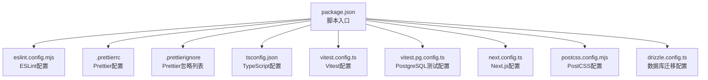
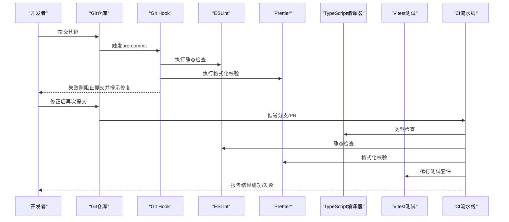
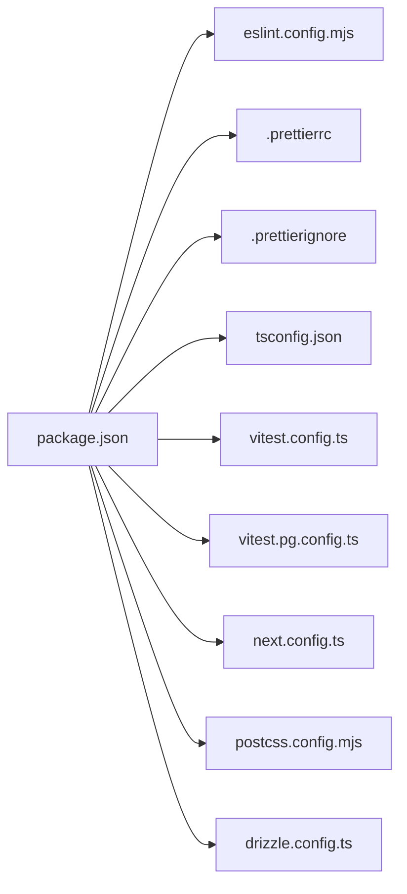

# 代码质量检查

<cite>
**本文引用的文件**   
- [package.json](file://package.json)
- [eslint.config.mjs](file://eslint.config.mjs)
- [.prettierrc](file://.prettierrc)
- [.prettierignore](file://.prettierignore)
- [tsconfig.json](file://tsconfig.json)
- [vitest.config.ts](file://vitest.config.ts)
- [vitest.pg.config.ts](file://vitest.pg.config.ts)
- [next.config.ts](file://next.config.ts)
- [postcss.config.mjs](file://postcss.config.mjs)
- [drizzle.config.ts](file://drizzle.config.ts)
</cite>

## 目录
1. [简介](#简介)
2. [项目结构](#项目结构)
3. [核心组件](#核心组件)
4. [架构总览](#架构总览)
5. [详细组件分析](#详细组件分析)
6. [依赖分析](#依赖分析)
7. [性能考虑](#性能考虑)
8. [故障排查指南](#故障排查指南)
9. [结论](#结论)
10. [附录](#附录)

## 简介
本指南面向PurpleInk平台的代码质量保障，覆盖ESLint规则配置、TypeScript编译与类型检查、Prettier格式化、Git Hook提交前检查以及CI流水线中的质量门禁与违规处理策略。目标是帮助开发者在本地与CI环境中保持一致的代码风格、严格的类型约束和稳定的构建流程。

## 项目结构
本项目采用现代前端工程化配置：
- ESLint通过配置文件集中管理规则集，统一静态检查与风格规范
- Prettier负责代码自动格式化，配合忽略文件避免对生成或第三方代码的误改
- TypeScript通过编译配置进行类型校验与模块解析
- Vitest作为测试运行器，提供单元测试与集成测试能力
- Next.js与PostCSS等工具链由各自配置文件驱动

**图表来源** 
- [package.json](file://package.json)
- [eslint.config.mjs](file://eslint.config.mjs)
- [.prettierrc](file://.prettierrc)
- [.prettierignore](file://.prettierignore)
- [tsconfig.json](file://tsconfig.json)
- [vitest.config.ts](file://vitest.config.ts)
- [vitest.pg.config.ts](file://vitest.pg.config.ts)
- [next.config.ts](file://next.config.ts)
- [postcss.config.mjs](file://postcss.config.mjs)
- [drizzle.config.ts](file://drizzle.config.ts)

**章节来源**
- [package.json](file://package.json)
- [eslint.config.mjs](file://eslint.config.mjs)
- [.prettierrc](file://.prettierrc)
- [.prettierignore](file://.prettierignore)
- [tsconfig.json](file://tsconfig.json)
- [vitest.config.ts](file://vitest.config.ts)
- [vitest.pg.config.ts](file://vitest.pg.config.ts)
- [next.config.ts](file://next.config.ts)
- [postcss.config.mjs](file://postcss.config.mjs)
- [drizzle.config.ts](file://drizzle.config.ts)

## 核心组件
- ESLint：统一静态检查与代码风格，支持TypeScript与React生态规则
- Prettier：统一的代码格式化工具，确保团队风格一致
- TypeScript：类型系统与编译时检查，提升代码健壮性
- Vitest：快速测试框架，支持TS与异步测试
- Next.js/PostCSS/Drizzle：应用与基础设施相关配置

**章节来源**
- [eslint.config.mjs](file://eslint.config.mjs)
- [.prettierrc](file://.prettierrc)
- [.prettierignore](file://.prettierignore)
- [tsconfig.json](file://tsconfig.json)
- [vitest.config.ts](file://vitest.config.ts)
- [vitest.pg.config.ts](file://vitest.pg.config.ts)
- [next.config.ts](file://next.config.ts)
- [postcss.config.mjs](file://postcss.config.mjs)
- [drizzle.config.ts](file://drizzle.config.ts)

## 架构总览
下图展示了从开发到CI的质量检查流水线：本地执行ESLint与Prettier，提交前通过Git Hook触发检查；CI中并行执行类型检查、静态检查、格式化校验与测试，失败即阻断合并。

[本图为概念流程图，不直接映射具体源码文件]

## 详细组件分析

### ESLint规则配置
- 目标：统一代码风格、发现潜在错误、强化TypeScript与React最佳实践
- 关键要点：
  - 启用TypeScript解析与规则，确保类型安全与TS语法规范
  - 引入React生态规则，约束组件写法与Hooks使用
  - 自定义或继承团队规则集，保证一致性
  - 针对特定目录或文件设置例外规则
- 建议：
  - 将严重级别设置为error，避免问题流入主干
  - 结合IDE插件实现实时反馈
  - 定期更新规则集以适配新语言特性

**章节来源**
- [eslint.config.mjs](file://eslint.config.mjs)

### Prettier代码格式化配置
- 目标：自动化代码格式，减少风格争议
- 关键要点：
  - 定义缩进、引号、分号、行宽等基础规则
  - 通过忽略文件排除生成文件、第三方库或不需要格式化的内容
  - 与编辑器集成，保存时自动格式化
- 建议：
  - 保持团队一致的格式化偏好
  - 在CI中增加格式化校验步骤，防止未格式化代码合并

**章节来源**
- [.prettierrc](file://.prettierrc)
- [.prettierignore](file://.prettierignore)

### TypeScript编译检查与类型验证
- 目标：通过编译期类型检查提升代码可靠性
- 关键要点：
  - 配置模块解析、目标版本、严格模式等选项
  - 指定包含与排除路径，优化编译性能
  - 与ESLint联动，共享类型信息
- 建议：
  - 开启严格模式，尽早暴露类型错误
  - 为公共接口定义明确的类型契约
  - 在CI中执行类型检查，阻断不合规提交

**章节来源**
- [tsconfig.json](file://tsconfig.json)

### 测试与运行时验证（Vitest）
- 目标：通过单元测试与集成测试保障功能正确性
- 关键要点：
  - 配置测试环境、匹配器与覆盖率统计
  - 支持异步与Mock，便于隔离外部依赖
  - 提供PostgreSQL集成测试配置，用于数据库相关用例
- 建议：
  - 关键业务逻辑必须覆盖测试
  - 在CI中并行执行测试，缩短反馈时间

**章节来源**
- [vitest.config.ts](file://vitest.config.ts)
- [vitest.pg.config.ts](file://vitest.pg.config.ts)

### 其他工具链配置
- Next.js：应用路由、构建与运行时行为
- PostCSS：样式预处理与插件链
- Drizzle：数据库迁移与类型安全查询

**章节来源**
- [next.config.ts](file://next.config.ts)
- [postcss.config.mjs](file://postcss.config.mjs)
- [drizzle.config.ts](file://drizzle.config.ts)

## 依赖分析
下图展示各配置文件的依赖关系与职责边界，便于理解质量保障体系的组成。

**图表来源** 
- [package.json](file://package.json)
- [eslint.config.mjs](file://eslint.config.mjs)
- [.prettierrc](file://.prettierrc)
- [.prettierignore](file://.prettierignore)
- [tsconfig.json](file://tsconfig.json)
- [vitest.config.ts](file://vitest.config.ts)
- [vitest.pg.config.ts](file://vitest.pg.config.ts)
- [next.config.ts](file://next.config.ts)
- [postcss.config.mjs](file://postcss.config.mjs)
- [drizzle.config.ts](file://drizzle.config.ts)

**章节来源**
- [package.json](file://package.json)
- [eslint.config.mjs](file://eslint.config.mjs)
- [.prettierrc](file://.prettierrc)
- [.prettierignore](file://.prettierignore)
- [tsconfig.json](file://tsconfig.json)
- [vitest.config.ts](file://vitest.config.ts)
- [vitest.pg.config.ts](file://vitest.pg.config.ts)
- [next.config.ts](file://next.config.ts)
- [postcss.config.mjs](file://postcss.config.mjs)
- [drizzle.config.ts](file://drizzle.config.ts)

## 性能考虑
- 增量检查：利用工具的缓存与增量能力，减少重复工作
- 并行执行：在CI中并行运行ESLint、Prettier、TypeScript与测试
- 选择性扫描：通过忽略文件与范围限定，仅检查变更文件
- 资源限制：合理设置内存与超时，避免长时间阻塞

[本节为通用指导，无需源码引用]

## 故障排查指南
- ESLint报错：查看规则说明与上下文，必要时临时禁用或调整规则优先级
- Prettier冲突：确认编辑器设置与配置文件一致，避免手动修改破坏格式
- TypeScript错误：根据错误定位类型定义与导入路径，补充缺失的类型声明
- 测试失败：检查Mock与环境变量，确保依赖服务可用
- CI失败：查看日志定位具体步骤，优先解决类型与静态检查问题

**章节来源**
- [eslint.config.mjs](file://eslint.config.mjs)
- [.prettierrc](file://.prettierrc)
- [tsconfig.json](file://tsconfig.json)
- [vitest.config.ts](file://vitest.config.ts)
- [vitest.pg.config.ts](file://vitest.pg.config.ts)

## 结论
通过ESLint、Prettier、TypeScript与Vitest的组合，PurpleInk平台建立了完整的代码质量保障体系。建议在本地与CI中严格执行这些检查，持续改进规则与流程，确保代码的可维护性与稳定性。

[本节为总结，无需源码引用]

## 附录

### Git Hook配置建议
- 使用husky或类似工具在pre-commit阶段触发ESLint与Prettier
- 在pre-push或CI中执行TypeScript类型检查与测试
- 失败时给出清晰的提示信息，引导开发者修复问题

[本节为概念性建议，无需源码引用]

### CI流水线门禁与违规处理策略
- 门禁条件：类型检查通过、静态检查无错误、格式化一致、测试全部通过
- 违规处理：阻断合并，要求修复后再提交；提供失败原因与修复指引
- 回滚策略：若CI误报，允许临时绕过但需尽快修复并补充用例

[本节为概念性建议，无需源码引用]