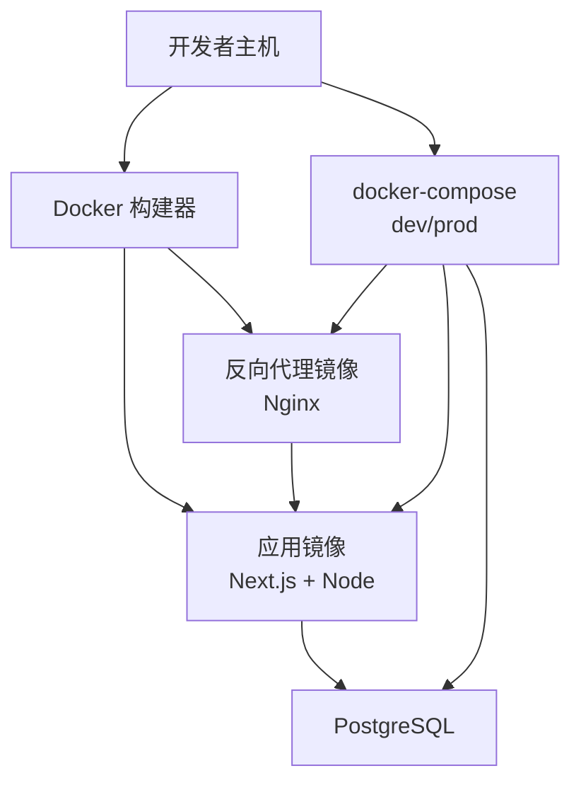
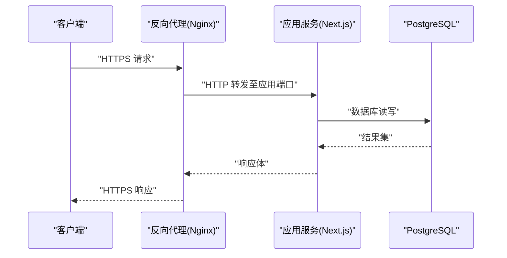
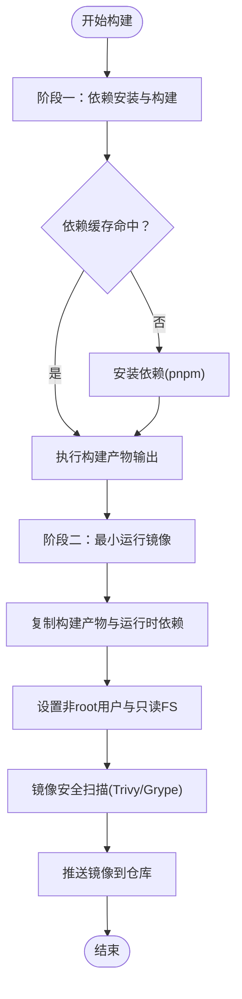
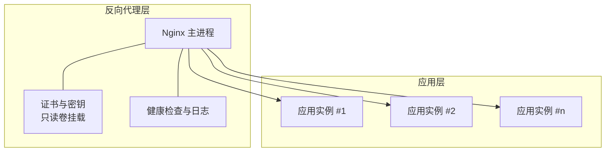
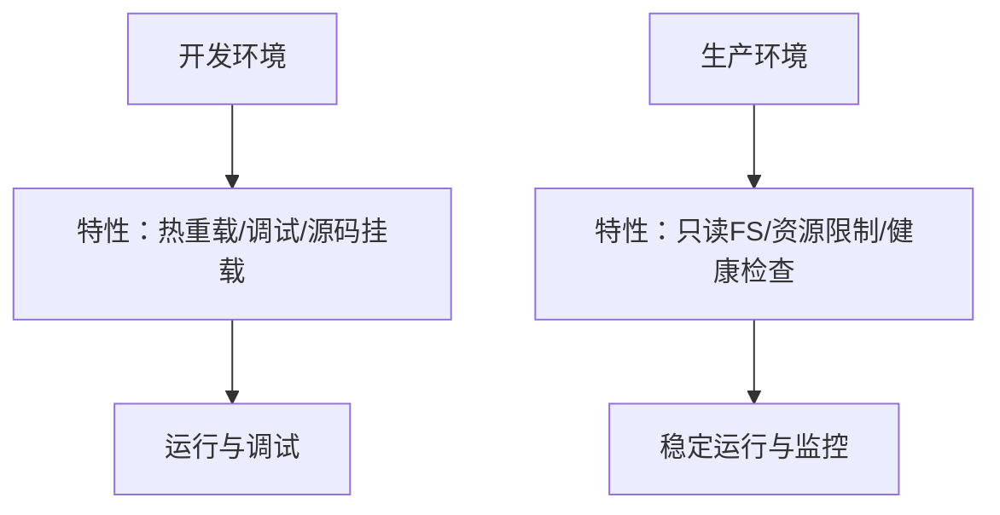
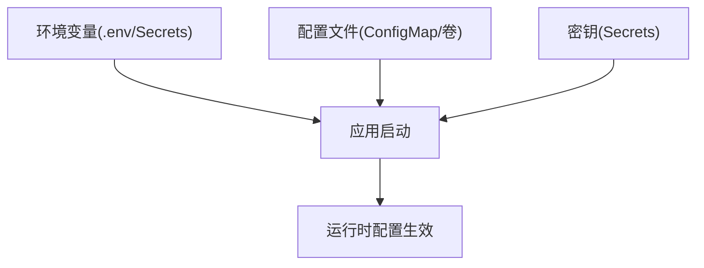
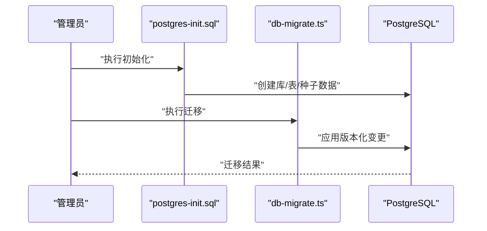
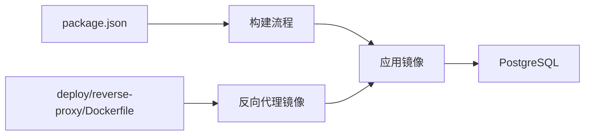

# 构建和部署

<cite>
**本文引用的文件**   
- [Dockerfile](file://Dockerfile)
- [docker-compose.dev.yml](file://docker-compose.dev.yml)
- [docker-compose.prod.yml](file://docker-compose.prod.yml)
- [.dockerignore](file://.dockerignore)
- [server/Dockerfile](file://server/Dockerfile)
- [deploy/reverse-proxy/Dockerfile](file://deploy/reverse-proxy/Dockerfile)
- [deploy/reverse-proxy/entrypoint.sh](file://deploy/reverse-proxy/entrypoint.sh)
- [config/tts.env.example](file://config/tts.env.example)
- [deploy/reverse-proxy/secrets/basic_auth_credentials.example](file://deploy/reverse-proxy/secrets/basic_auth_credentials.example)
- [package.json](file://package.json)
- [next.config.ts](file://next.config.ts)
- [drizzle.config.ts](file://drizzle.config.ts)
- [scripts/setup/db-migrate.ts](file://scripts/setup/db-migrate.ts)
- [scripts/setup/postgres-init.sql](file://scripts/setup/postgres-init.sql)
- [scripts/migration/provision-master-key.ts](file://scripts/migration/provision-master-key.ts)
- [docs/deployment/runbook.md](file://docs/deployment/runbook.md)
</cite>

## 目录
1. [简介](#简介)
2. [项目结构](#项目结构)
3. [核心组件](#核心组件)
4. [架构总览](#架构总览)
5. [详细组件分析](#详细组件分析)
6. [依赖关系分析](#依赖关系分析)
7. [性能考量](#性能考量)
8. [故障排查指南](#故障排查指南)
9. [结论](#结论)
10. [附录](#附录)

## 简介
本文件为 PurpleInk 平台的构建与部署完整配置文档，覆盖 Docker 镜像多阶段构建、依赖优化与安全扫描；开发环境与生产环境的 Docker Compose 差异；反向代理（Nginx）配置要点（SSL、负载均衡）；以及云平台、Kubernetes 与传统服务器的部署示例。同时给出环境变量、配置文件与密钥的安全管理策略，帮助读者在不同环境中稳定、安全地交付服务。

## 项目结构
PurpleInk 采用前后端一体化 Next.js 应用，配合独立的反向代理容器与数据库初始化脚本，形成清晰的“前端+后端+反向代理+数据库”的部署拓扑。关键构建与部署相关文件分布如下：
- 根级 Dockerfile：定义应用镜像的多阶段构建流程
- server/Dockerfile：可选的后端独立镜像构建（如需要拆分运行时）
- deploy/reverse-proxy/*：Nginx 反向代理镜像与入口脚本
- docker-compose.*.yml：开发与生产编排配置
- .dockerignore：构建上下文裁剪
- package.json / next.config.ts：Node 依赖与 Next.js 构建行为
- drizzle.config.ts：数据库迁移配置
- scripts/setup/* 与 scripts/migration/*：数据库初始化与密钥生成脚本
- config/tts.env.example：TTS 相关环境变量示例
- docs/deployment/runbook.md：运行手册

图表来源
- [Dockerfile:1-200](file://Dockerfile#L1-L200)
- [server/Dockerfile:1-200](file://server/Dockerfile#L1-L200)
- [deploy/reverse-proxy/Dockerfile:1-200](file://deploy/reverse-proxy/Dockerfile#L1-L200)
- [docker-compose.dev.yml:1-200](file://docker-compose.dev.yml#L1-L200)
- [docker-compose.prod.yml:1-200](file://docker-compose.prod.yml#L1-L200)

章节来源
- [Dockerfile:1-200](file://Dockerfile#L1-L200)
- [server/Dockerfile:1-200](file://server/Dockerfile#L1-L200)
- [deploy/reverse-proxy/Dockerfile:1-200](file://deploy/reverse-proxy/Dockerfile#L1-L200)
- [docker-compose.dev.yml:1-200](file://docker-compose.dev.yml#L1-L200)
- [docker-compose.prod.yml:1-200](file://docker-compose.prod.yml#L1-L200)
- [.dockerignore:1-200](file://.dockerignore#L1-L200)
- [package.json:1-200](file://package.json#L1-L200)
- [next.config.ts:1-200](file://next.config.ts#L1-L200)
- [drizzle.config.ts:1-200](file://drizzle.config.ts#L1-L200)

## 核心组件
- 应用镜像（Next.js/Node）：通过多阶段构建分离依赖安装、编译与运行环境，最小化最终镜像体积并提升安全性。
- 反向代理镜像（Nginx）：提供 HTTPS 终止、静态资源缓存、请求转发与基础认证等能力。
- 数据库（PostgreSQL）：持久化业务数据，支持初始化 SQL 与迁移脚本。
- 编排（Docker Compose）：统一开发/生产环境的服务组合、网络与卷挂载。

章节来源
- [Dockerfile:1-200](file://Dockerfile#L1-L200)
- [server/Dockerfile:1-200](file://server/Dockerfile#L1-L200)
- [deploy/reverse-proxy/Dockerfile:1-200](file://deploy/reverse-proxy/Dockerfile#L1-L200)
- [docker-compose.dev.yml:1-200](file://docker-compose.dev.yml#L1-L200)
- [docker-compose.prod.yml:1-200](file://docker-compose.prod.yml#L1-L200)

## 架构总览
下图展示从客户端到应用与数据库的请求路径，以及反向代理在其中的作用。

图表来源
- [deploy/reverse-proxy/Dockerfile:1-200](file://deploy/reverse-proxy/Dockerfile#L1-L200)
- [deploy/reverse-proxy/entrypoint.sh:1-200](file://deploy/reverse-proxy/entrypoint.sh#L1-L200)
- [Dockerfile:1-200](file://Dockerfile#L1-L200)
- [docker-compose.prod.yml:1-200](file://docker-compose.prod.yml#L1-L200)

## 详细组件分析

### Docker 镜像构建（多阶段与依赖优化）
- 多阶段构建策略
  - 构建阶段：安装依赖、执行类型检查与构建产物输出，使用包含完整工具链的基础镜像。
  - 运行阶段：仅复制必要产物与运行时依赖，使用精简基础镜像，降低攻击面与镜像体积。
- 依赖优化
  - 利用 pnpm 工作区与缓存层，优先锁定依赖版本，减少重复下载。
  - 通过 .dockerignore 排除无关文件，缩小构建上下文。
- 安全扫描
  - 建议在 CI 中集成 Trivy/Grype 等扫描工具，对构建产物进行漏洞检测与合规校验。
  - 定期更新基础镜像与依赖，启用只读文件系统与非 root 用户运行。

图表来源
- [Dockerfile:1-200](file://Dockerfile#L1-L200)
- [.dockerignore:1-200](file://.dockerignore#L1-L200)
- [package.json:1-200](file://package.json#L1-L200)

章节来源
- [Dockerfile:1-200](file://Dockerfile#L1-L200)
- [.dockerignore:1-200](file://.dockerignore#L1-L200)
- [package.json:1-200](file://package.json#L1-L200)

### 反向代理配置（Nginx、SSL、负载均衡）
- Nginx 职责
  - HTTPS 终止与证书管理（建议通过外部证书管理器或 Secret 注入）。
  - 请求转发至应用服务，支持健康检查与重试。
  - 静态资源缓存与压缩，提升性能。
- SSL 证书管理
  - 推荐使用 Let’s Encrypt 自动续期或云厂商托管证书。
  - 将证书与私钥以只读卷挂载至 Nginx 容器，避免硬编码。
- 负载均衡
  - 针对多副本应用实例，Nginx 可配置上游组与健康检查。
  - 结合会话保持与粘性 Cookie 实现无状态扩展。

图表来源
- [deploy/reverse-proxy/Dockerfile:1-200](file://deploy/reverse-proxy/Dockerfile#L1-L200)
- [deploy/reverse-proxy/entrypoint.sh:1-200](file://deploy/reverse-proxy/entrypoint.sh#L1-L200)

章节来源
- [deploy/reverse-proxy/Dockerfile:1-200](file://deploy/reverse-proxy/Dockerfile#L1-L200)
- [deploy/reverse-proxy/entrypoint.sh:1-200](file://deploy/reverse-proxy/entrypoint.sh#L1-L200)

### 开发环境与生产环境的 Docker Compose 差异
- 开发环境（docker-compose.dev.yml）
  - 开启热重载与调试端口
  - 挂载源码目录以便实时编辑
  - 使用本地或临时数据库，便于快速迭代
- 生产环境（docker-compose.prod.yml）
  - 关闭调试与热重载，启用只读文件系统
  - 使用受管数据库与持久卷
  - 限制资源配额与并发参数
  - 引入健康检查与重启策略

图表来源
- [docker-compose.dev.yml:1-200](file://docker-compose.dev.yml#L1-L200)
- [docker-compose.prod.yml:1-200](file://docker-compose.prod.yml#L1-L200)

章节来源
- [docker-compose.dev.yml:1-200](file://docker-compose.dev.yml#L1-L200)
- [docker-compose.prod.yml:1-200](file://docker-compose.prod.yml#L1-L200)

### 环境变量、配置文件与密钥安全管理
- 环境变量
  - 数据库连接串、API 密钥、TTS 配置等通过环境变量注入。
  - 使用 .env 模板与环境隔离，禁止提交敏感信息。
- 配置文件
  - 将易变配置（如 TTS 参数）抽离为外部配置文件，通过卷挂载或 ConfigMap 注入。
- 密钥管理
  - 使用 Docker Secrets、Kubernetes Secrets 或云厂商密钥管理服务。
  - 启动时动态加载，运行时只读访问，避免写入磁盘。

图表来源
- [config/tts.env.example:1-200](file://config/tts.env.example#L1-L200)
- [deploy/reverse-proxy/secrets/basic_auth_credentials.example:1-200](file://deploy/reverse-proxy/secrets/basic_auth_credentials.example#L1-L200)

章节来源
- [config/tts.env.example:1-200](file://config/tts.env.example#L1-L200)
- [deploy/reverse-proxy/secrets/basic_auth_credentials.example:1-200](file://deploy/reverse-proxy/secrets/basic_auth_credentials.example#L1-L200)

### 数据库初始化与迁移
- 初始化脚本
  - 使用 postgres-init.sql 创建初始结构与种子数据。
- 迁移脚本
  - 通过 db-migrate.ts 与 drizzle.config.ts 管理版本化迁移。
- 主密钥生成
  - 使用 provision-master-key.ts 生成并注入主密钥，确保加密字段安全。

图表来源
- [scripts/setup/postgres-init.sql:1-200](file://scripts/setup/postgres-init.sql#L1-L200)
- [scripts/setup/db-migrate.ts:1-200](file://scripts/setup/db-migrate.ts#L1-L200)
- [drizzle.config.ts:1-200](file://drizzle.config.ts#L1-L200)
- [scripts/migration/provision-master-key.ts:1-200](file://scripts/migration/provision-master-key.ts#L1-L200)

章节来源
- [scripts/setup/postgres-init.sql:1-200](file://scripts/setup/postgres-init.sql#L1-L200)
- [scripts/setup/db-migrate.ts:1-200](file://scripts/setup/db-migrate.ts#L1-L200)
- [drizzle.config.ts:1-200](file://drizzle.config.ts#L1-L200)
- [scripts/migration/provision-master-key.ts:1-200](file://scripts/migration/provision-master-key.ts#L1-L200)

### 不同部署平台示例
- 云平台（容器服务）
  - 使用托管容器服务（如阿里云 ACK、腾讯云 TKE、AWS ECS/Fargate），将镜像推送到私有仓库，通过环境变量与密钥管理服务注入配置。
  - 配置自动扩缩容与健康检查，结合负载均衡器暴露 HTTPS。
- Kubernetes
  - 使用 Deployment/Service/Ingress 管理应用生命周期，ConfigMap/Secret 管理配置与密钥。
  - 通过 HorizontalPodAutoscaler 实现弹性伸缩，持久卷存储数据库数据。
- 传统服务器
  - 使用 Docker Compose 编排服务，Nginx 作为反向代理，系统级防火墙与 SELinux/AppArmor 加固。
  - 定期备份数据库与配置文件，建立回滚与恢复流程。

章节来源
- [docs/deployment/runbook.md:1-200](file://docs/deployment/runbook.md#L1-L200)

## 依赖关系分析
- 应用镜像依赖 Node 运行时与 pnpm 工作区，构建产物由 Next.js 生成。
- 反向代理镜像依赖 Nginx 与证书管理工具，通过入口脚本完成配置注入。
- 数据库依赖 PostgreSQL 引擎与初始化/迁移脚本。
- 编排依赖 docker-compose 与服务间网络通信。

图表来源
- [package.json:1-200](file://package.json#L1-L200)
- [Dockerfile:1-200](file://Dockerfile#L1-L200)
- [deploy/reverse-proxy/Dockerfile:1-200](file://deploy/reverse-proxy/Dockerfile#L1-L200)

章节来源
- [package.json:1-200](file://package.json#L1-L200)
- [Dockerfile:1-200](file://Dockerfile#L1-L200)
- [deploy/reverse-proxy/Dockerfile:1-200](file://deploy/reverse-proxy/Dockerfile#L1-L200)

## 性能考量
- 构建性能
  - 使用 pnpm 缓存与分层构建，最大化缓存命中率。
  - 并行执行类型检查与构建任务，缩短 CI 时间。
- 运行性能
  - 启用 HTTP/2 与 Gzip/Brotli 压缩。
  - 合理设置 Nginx 缓存策略与连接池大小。
  - 数据库连接池与查询优化，避免慢查询。
- 安全与稳定性
  - 最小化镜像体积，减少依赖攻击面。
  - 启用只读文件系统与非 root 用户运行。
  - 定期扫描镜像与依赖漏洞，及时修复。

[本节为通用指导，不直接分析具体文件]

## 故障排查指南
- 常见问题
  - 构建失败：检查依赖缓存与 .dockerignore，确认 Node 版本与 pnpm 命令可用。
  - 反向代理无法访问：验证证书路径与权限，检查 Nginx 配置语法与健康检查。
  - 数据库连接失败：核对连接串、用户名密码与网络可达性。
- 诊断步骤
  - 查看容器日志与事件，定位错误堆栈。
  - 进入容器执行命令，验证环境变量与配置文件。
  - 使用健康检查端点验证服务可用性。

章节来源
- [docs/deployment/runbook.md:1-200](file://docs/deployment/runbook.md#L1-L200)

## 结论
通过多阶段构建、依赖优化与安全扫描，PurpleInk 能够在不同环境中稳定交付。反向代理与数据库初始化/迁移脚本保障了服务的安全性与可维护性。借助 Docker Compose 与平台适配方案，可在云平台、Kubernetes 与传统服务器上灵活部署。遵循环境变量与密钥管理最佳实践，进一步提升系统的可靠性与安全性。

[本节为总结性内容，不直接分析具体文件]

## 附录
- 参考文件清单
  - 构建与镜像：Dockerfile、server/Dockerfile、.dockerignore
  - 反向代理：deploy/reverse-proxy/Dockerfile、entrypoint.sh
  - 编排：docker-compose.dev.yml、docker-compose.prod.yml
  - 配置与密钥：config/tts.env.example、deploy/reverse-proxy/secrets/basic_auth_credentials.example
  - 应用依赖与构建：package.json、next.config.ts、drizzle.config.ts
  - 数据库与迁移：scripts/setup/postgres-init.sql、scripts/setup/db-migrate.ts、scripts/migration/provision-master-key.ts
  - 运行手册：docs/deployment/runbook.md

[本节为索引性内容，不直接分析具体文件]