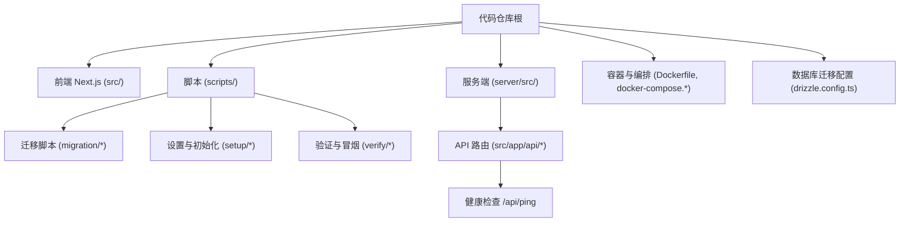
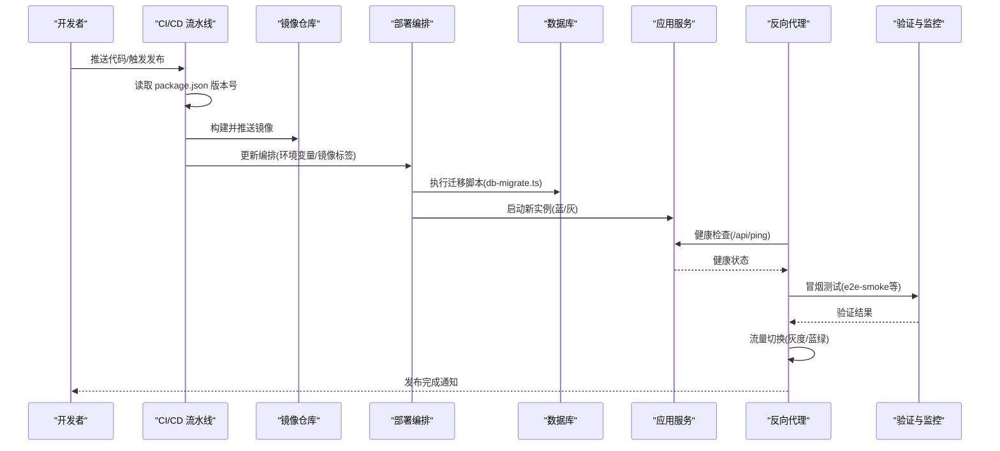
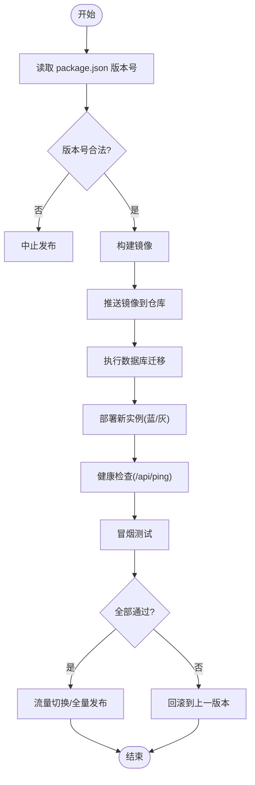
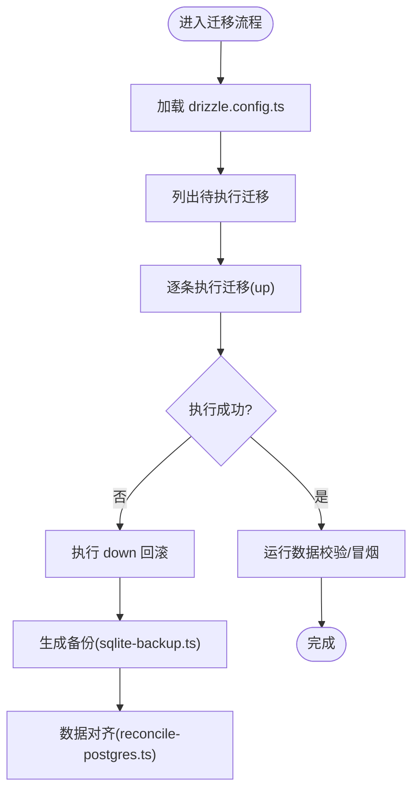
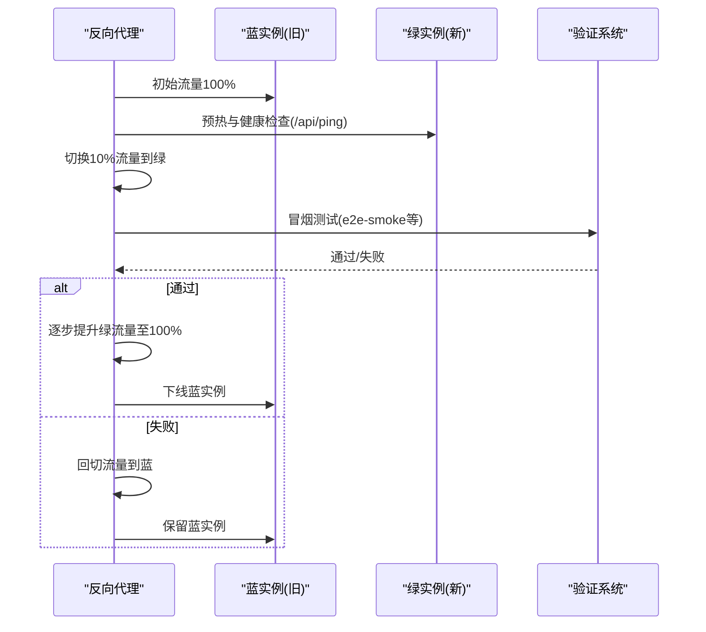
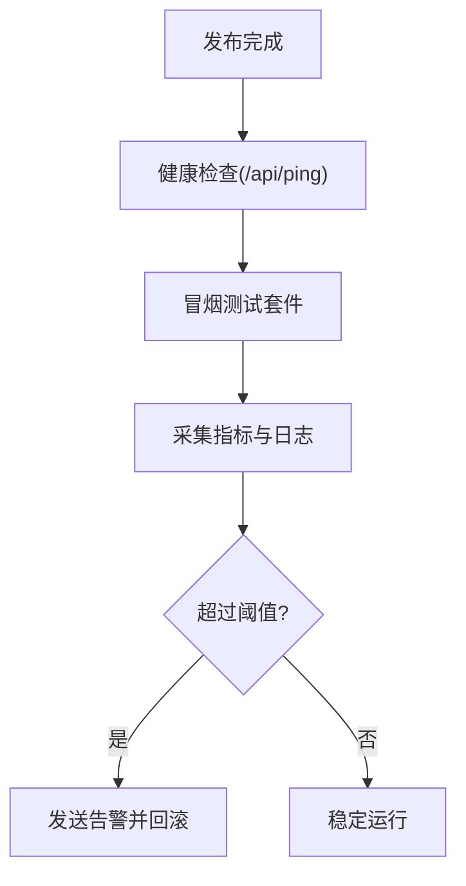
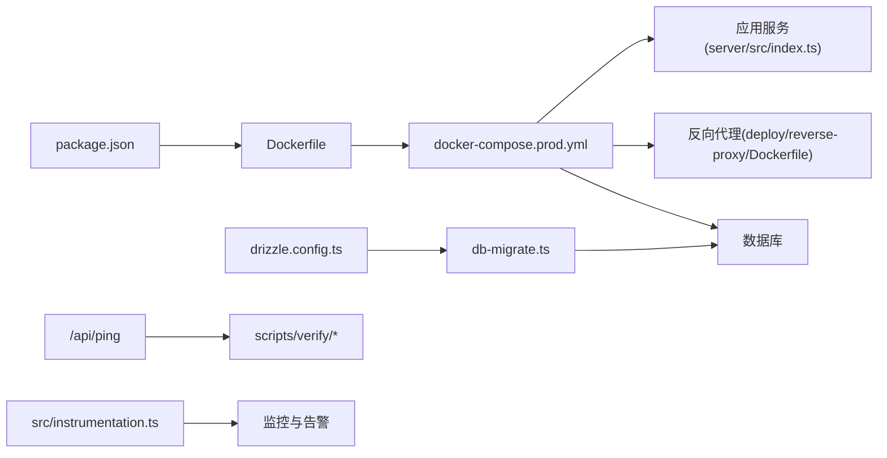

# 版本发布管理

<cite>
**本文引用的文件**   
- [package.json](file://package.json)
- [drizzle.config.ts](file://drizzle.config.ts)
- [docker-compose.dev.yml](file://docker-compose.dev.yml)
- [docker-compose.prod.yml](file://docker-compose.prod.yml)
- [Dockerfile](file://Dockerfile)
- [deploy/reverse-proxy/Dockerfile](file://deploy/reverse-proxy/Dockerfile)
- [scripts/setup/db-migrate.ts](file://scripts/setup/db-migrate.ts)
- [scripts/migration/export-sqlite.ts](file://scripts/migration/export-sqlite.ts)
- [scripts/migration/import-postgres.ts](file://scripts/migration/import-postgres.ts)
- [scripts/migration/provision-master-key.ts](file://scripts/migration/provision-master-key.ts)
- [scripts/migration/reconcile-postgres.ts](file://scripts/migration/reconcile-postgres.ts)
- [scripts/migration/sqlite-backup.ts](file://scripts/migration/sqlite-backup.ts)
- [scripts/verify/auth-flow-smoke.mjs](file://scripts/verify/auth-flow-smoke.mjs)
- [scripts/verify/demo-readiness.mjs](file://scripts/verify/demo-readiness.mjs)
- [scripts/verify/e2e-smoke.ts](file://scripts/verify/e2e-smoke.ts)
- [scripts/verify/products-scroll.ts](file://scripts/verify/products-scroll.ts)
- [scripts/verify/stepfun-probe.ts](file://scripts/verify/stepfun-probe.ts)
- [server/src/index.ts](file://server/src/index.ts)
- [src/app/api/ping/route.ts](file://src/app/api/ping/route.ts)
- [src/instrumentation.ts](file://src/instrumentation.ts)
- [next.config.ts](file://next.config.ts)
</cite>

## 目录
1. [简介](#简介)
2. [项目结构](#项目结构)
3. [核心组件](#核心组件)
4. [架构总览](#架构总览)
5. [详细组件分析](#详细组件分析)
6. [依赖关系分析](#依赖关系分析)
7. [性能考虑](#性能考虑)
8. [故障排查指南](#故障排查指南)
9. [结论](#结论)
10. [附录](#附录)

## 简介
本指南面向PurpleInk平台的版本发布与交付，覆盖语义化版本控制策略、自动化发布流程（版本号管理、变更日志生成、发布标签创建）、数据库迁移脚本管理与执行策略（向前兼容性与回滚机制）、灰度发布与蓝绿部署方案（流量切换、健康检查、快速回滚），以及发布后的验证流程与监控告警配置。目标是让研发、运维与质量团队在统一规范下高效、安全地发布新版本。

## 项目结构
仓库采用前后端一体化工程组织：前端基于Next.js，后端服务位于server目录，数据库迁移与工具脚本集中在scripts目录，容器化构建与编排通过Docker与docker-compose完成。发布相关的关键位置包括：
- 包与版本定义：package.json
- 数据库迁移配置：drizzle.config.ts
- 容器镜像构建：Dockerfile、deploy/reverse-proxy/Dockerfile
- 环境编排：docker-compose.dev.yml、docker-compose.prod.yml
- 迁移与数据工具：scripts/migration/*
- 启动与迁移脚本：scripts/setup/db-migrate.ts
- 健康检查与冒烟测试：scripts/verify/*、src/app/api/ping/route.ts
- 应用入口与可观测性：server/src/index.ts、src/instrumentation.ts

图表来源
- [package.json](file://package.json)
- [drizzle.config.ts](file://drizzle.config.ts)
- [docker-compose.dev.yml](file://docker-compose.dev.yml)
- [docker-compose.prod.yml](file://docker-compose.prod.yml)
- [Dockerfile](file://Dockerfile)
- [deploy/reverse-proxy/Dockerfile](file://deploy/reverse-proxy/Dockerfile)
- [scripts/setup/db-migrate.ts](file://scripts/setup/db-migrate.ts)
- [scripts/migration/export-sqlite.ts](file://scripts/migration/export-sqlite.ts)
- [scripts/migration/import-postgres.ts](file://scripts/migration/import-postgres.ts)
- [scripts/migration/provision-master-key.ts](file://scripts/migration/provision-master-key.ts)
- [scripts/migration/reconcile-postgres.ts](file://scripts/migration/reconcile-postgres.ts)
- [scripts/migration/sqlite-backup.ts](file://scripts/migration/sqlite-backup.ts)
- [scripts/verify/auth-flow-smoke.mjs](file://scripts/verify/auth-flow-smoke.mjs)
- [scripts/verify/demo-readiness.mjs](file://scripts/verify/demo-readiness.mjs)
- [scripts/verify/e2e-smoke.ts](file://scripts/verify/e2e-smoke.ts)
- [scripts/verify/products-scroll.ts](file://scripts/verify/products-scroll.ts)
- [scripts/verify/stepfun-probe.ts](file://scripts/verify/stepfun-probe.ts)
- [server/src/index.ts](file://server/src/index.ts)
- [src/app/api/ping/route.ts](file://src/app/api/ping/route.ts)
- [src/instrumentation.ts](file://src/instrumentation.ts)
- [next.config.ts](file://next.config.ts)

章节来源
- [package.json](file://package.json)
- [drizzle.config.ts](file://drizzle.config.ts)
- [docker-compose.dev.yml](file://docker-compose.dev.yml)
- [docker-compose.prod.yml](file://docker-compose.prod.yml)
- [Dockerfile](file://Dockerfile)
- [deploy/reverse-proxy/Dockerfile](file://deploy/reverse-proxy/Dockerfile)

## 核心组件
- 版本与包管理：通过package.json维护应用版本、依赖与脚本命令，作为CI/CD中版本号读取与发布的权威来源。
- 数据库迁移：使用Drizzle ORM进行迁移管理，drizzle.config.ts集中配置；迁移脚本由scripts/setup/db-migrate.ts驱动执行。
- 容器化与编排：Dockerfile用于构建应用镜像，docker-compose.*用于本地与生产编排，反向代理独立容器化便于流量治理。
- 健康检查与冒烟测试：/api/ping提供基础健康探针；scripts/verify下包含多种端到端与业务冒烟用例。
- 可观测性：src/instrumentation.ts集成应用级指标与追踪，配合反向代理与编排实现发布后监控。

章节来源
- [package.json](file://package.json)
- [drizzle.config.ts](file://drizzle.config.ts)
- [scripts/setup/db-migrate.ts](file://scripts/setup/db-migrate.ts)
- [Dockerfile](file://Dockerfile)
- [docker-compose.prod.yml](file://docker-compose.prod.yml)
- [src/app/api/ping/route.ts](file://src/app/api/ping/route.ts)
- [src/instrumentation.ts](file://src/instrumentation.ts)

## 架构总览
下图展示从代码到生产环境的发布流水线与关键组件交互，包括版本读取、镜像构建、迁移执行、反向代理与流量切换、健康检查与验证。

图表来源
- [package.json](file://package.json)
- [Dockerfile](file://Dockerfile)
- [docker-compose.prod.yml](file://docker-compose.prod.yml)
- [scripts/setup/db-migrate.ts](file://scripts/setup/db-migrate.ts)
- [src/app/api/ping/route.ts](file://src/app/api/ping/route.ts)
- [scripts/verify/e2e-smoke.ts](file://scripts/verify/e2e-smoke.ts)

## 详细组件分析

### 语义化版本控制策略
- 主版本（Major）：不兼容的API或数据结构变更，需评估数据库迁移影响与客户端兼容性，通常伴随重大功能重构或协议变更。
- 次版本（Minor）：向后兼容的功能新增与改进，允许扩展字段、新增接口能力，要求保持旧客户端可用。
- 补丁版本（Patch）：缺陷修复与微小优化，强调快速回归与热修复能力。

建议实践
- 版本号单一来源：以package.json中的version为准，禁止在多处硬编码。
- 分支策略：main为稳定基线，release分支用于预发与打标签，hotfix分支用于紧急修复。
- 变更日志：每次合并前强制生成变更摘要，按类型分类（feat、fix、perf、refactor、docs、chore）。

章节来源
- [package.json](file://package.json)

### 发布流程自动化
- 版本号管理：CI从package.json读取版本号，校验格式，生成镜像标签（如vX.Y.Z）。
- 变更日志生成：基于提交消息或PR描述自动生成CHANGELOG片段，合并时汇总。
- 发布标签创建：在成功构建与验证通过后，自动在仓库创建对应版本的Git标签。
- 镜像推送与部署：构建镜像推送到仓库，更新编排配置并滚动更新。

图表来源
- [package.json](file://package.json)
- [Dockerfile](file://Dockerfile)
- [scripts/setup/db-migrate.ts](file://scripts/setup/db-migrate.ts)
- [src/app/api/ping/route.ts](file://src/app/api/ping/route.ts)
- [scripts/verify/e2e-smoke.ts](file://scripts/verify/e2e-smoke.ts)

章节来源
- [package.json](file://package.json)
- [Dockerfile](file://Dockerfile)
- [scripts/setup/db-migrate.ts](file://scripts/setup/db-migrate.ts)
- [src/app/api/ping/route.ts](file://src/app/api/ping/route.ts)
- [scripts/verify/e2e-smoke.ts](file://scripts/verify/e2e-smoke.ts)

### 数据库迁移脚本管理与执行策略
- 迁移工具：使用Drizzle ORM，drizzle.config.ts集中配置连接与迁移路径。
- 执行入口：scripts/setup/db-migrate.ts负责拉取最新迁移并按序执行。
- 向前兼容：所有迁移必须保证向后兼容，新增字段默认值、删除字段需分阶段处理。
- 回滚机制：每个迁移应提供对应的down逻辑；必要时结合快照与备份脚本（sqlite-backup.ts、reconcile-postgres.ts）进行恢复。
- 数据迁移工具：export-sqlite.ts与import-postgres.ts支持跨库迁移与数据一致性校验。

图表来源
- [drizzle.config.ts](file://drizzle.config.ts)
- [scripts/setup/db-migrate.ts](file://scripts/setup/db-migrate.ts)
- [scripts/migration/export-sqlite.ts](file://scripts/migration/export-sqlite.ts)
- [scripts/migration/import-postgres.ts](file://scripts/migration/import-postgres.ts)
- [scripts/migration/reconcile-postgres.ts](file://scripts/migration/reconcile-postgres.ts)
- [scripts/migration/sqlite-backup.ts](file://scripts/migration/sqlite-backup.ts)

章节来源
- [drizzle.config.ts](file://drizzle.config.ts)
- [scripts/setup/db-migrate.ts](file://scripts/setup/db-migrate.ts)
- [scripts/migration/export-sqlite.ts](file://scripts/migration/export-sqlite.ts)
- [scripts/migration/import-postgres.ts](file://scripts/migration/import-postgres.ts)
- [scripts/migration/reconcile-postgres.ts](file://scripts/migration/reconcile-postgres.ts)
- [scripts/migration/sqlite-backup.ts](file://scripts/migration/sqlite-backup.ts)

### 灰度发布与蓝绿部署方案
- 蓝绿部署：同时运行两套相同环境（蓝/绿），通过反向代理将流量切换到新环境，验证通过后替换旧环境。
- 灰度发布：逐步增加新实例比例（如1%、10%、50%、100%），结合健康检查与冒烟测试动态调整。
- 流量切换：利用反向代理（deploy/reverse-proxy）按权重或规则转发请求，支持快速切流与回切。
- 健康检查：/api/ping作为基础探针，结合业务冒烟用例确保可用性。
- 快速回滚：一旦指标异常或验证失败，立即切回旧版本实例，保证业务连续性。

图表来源
- [deploy/reverse-proxy/Dockerfile](file://deploy/reverse-proxy/Dockerfile)
- [src/app/api/ping/route.ts](file://src/app/api/ping/route.ts)
- [scripts/verify/e2e-smoke.ts](file://scripts/verify/e2e-smoke.ts)

章节来源
- [deploy/reverse-proxy/Dockerfile](file://deploy/reverse-proxy/Dockerfile)
- [src/app/api/ping/route.ts](file://src/app/api/ping/route.ts)
- [scripts/verify/e2e-smoke.ts](file://scripts/verify/e2e-smoke.ts)

### 发布后的验证流程与监控告警
- 验证流程：
  - 基础健康检查：/api/ping返回就绪状态。
  - 冒烟测试：auth-flow-smoke、demo-readiness、products-scroll、stepfun-probe等用例覆盖关键路径。
  - 端到端测试：e2e-smoke验证用户旅程与页面渲染。
- 监控告警：
  - 应用指标：src/instrumentation.ts采集关键指标与追踪信息。
  - 错误率与延迟：在反向代理与应用层暴露错误码分布与P95/P99延迟。
  - 告警阈值：错误率突增、健康检查失败、迁移执行失败、冒烟测试失败均触发告警。

图表来源
- [src/app/api/ping/route.ts](file://src/app/api/ping/route.ts)
- [scripts/verify/auth-flow-smoke.mjs](file://scripts/verify/auth-flow-smoke.mjs)
- [scripts/verify/demo-readiness.mjs](file://scripts/verify/demo-readiness.mjs)
- [scripts/verify/products-scroll.ts](file://scripts/verify/products-scroll.ts)
- [scripts/verify/stepfun-probe.ts](file://scripts/verify/stepfun-probe.ts)
- [scripts/verify/e2e-smoke.ts](file://scripts/verify/e2e-smoke.ts)
- [src/instrumentation.ts](file://src/instrumentation.ts)

章节来源
- [src/app/api/ping/route.ts](file://src/app/api/ping/route.ts)
- [scripts/verify/auth-flow-smoke.mjs](file://scripts/verify/auth-flow-smoke.mjs)
- [scripts/verify/demo-readiness.mjs](file://scripts/verify/demo-readiness.mjs)
- [scripts/verify/products-scroll.ts](file://scripts/verify/products-scroll.ts)
- [scripts/verify/stepfun-probe.ts](file://scripts/verify/stepfun-probe.ts)
- [scripts/verify/e2e-smoke.ts](file://scripts/verify/e2e-smoke.ts)
- [src/instrumentation.ts](file://src/instrumentation.ts)

## 依赖关系分析
- 版本与构建：package.json决定依赖与脚本；Dockerfile基于Node环境构建镜像。
- 编排与服务：docker-compose.prod.yml协调应用、反向代理与数据库服务。
- 迁移与数据：drizzle.config.ts与scripts/setup/db-migrate.ts驱动迁移；scripts/migration/*提供数据工具。
- 健康与验证：/api/ping与scripts/verify/*构成发布后验证闭环。
- 可观测性：src/instrumentation.ts提供指标与追踪，支撑监控与告警。

图表来源
- [package.json](file://package.json)
- [Dockerfile](file://Dockerfile)
- [docker-compose.prod.yml](file://docker-compose.prod.yml)
- [server/src/index.ts](file://server/src/index.ts)
- [deploy/reverse-proxy/Dockerfile](file://deploy/reverse-proxy/Dockerfile)
- [drizzle.config.ts](file://drizzle.config.ts)
- [scripts/setup/db-migrate.ts](file://scripts/setup/db-migrate.ts)
- [src/app/api/ping/route.ts](file://src/app/api/ping/route.ts)
- [src/instrumentation.ts](file://src/instrumentation.ts)

章节来源
- [package.json](file://package.json)
- [Dockerfile](file://Dockerfile)
- [docker-compose.prod.yml](file://docker-compose.prod.yml)
- [server/src/index.ts](file://server/src/index.ts)
- [deploy/reverse-proxy/Dockerfile](file://deploy/reverse-proxy/Dockerfile)
- [drizzle.config.ts](file://drizzle.config.ts)
- [scripts/setup/db-migrate.ts](file://scripts/setup/db-migrate.ts)
- [src/app/api/ping/route.ts](file://src/app/api/ping/route.ts)
- [src/instrumentation.ts](file://src/instrumentation.ts)

## 性能考虑
- 构建优化：合理缓存依赖与中间产物，减少镜像体积与构建时间。
- 迁移效率：批量执行迁移，避免频繁锁表；对大表变更采用增量策略。
- 健康检查频率：合理设置探针间隔，避免过度探测导致负载升高。
- 灰度比例：根据资源与业务负载逐步放量，避免瞬时压力过大。
- 指标采样：对高频指标进行采样与聚合，降低存储与查询开销。

[本节为通用指导，不直接分析具体文件]

## 故障排查指南
- 迁移失败：检查drizzle.config.ts配置与数据库连接；查看db-migrate.ts执行日志；必要时使用sqlite-backup.ts与reconcile-postgres.ts进行数据恢复。
- 健康检查失败：确认/api/ping响应与依赖服务可用性；检查反向代理配置与端口映射。
- 冒烟测试失败：定位具体用例（auth-flow-smoke、demo-readiness、products-scroll、stepfun-probe、e2e-smoke），复现问题并收集日志。
- 指标异常：通过src/instrumentation.ts输出的指标与追踪信息定位瓶颈与错误源。

章节来源
- [drizzle.config.ts](file://drizzle.config.ts)
- [scripts/setup/db-migrate.ts](file://scripts/setup/db-migrate.ts)
- [scripts/migration/sqlite-backup.ts](file://scripts/migration/sqlite-backup.ts)
- [scripts/migration/reconcile-postgres.ts](file://scripts/migration/reconcile-postgres.ts)
- [src/app/api/ping/route.ts](file://src/app/api/ping/route.ts)
- [scripts/verify/auth-flow-smoke.mjs](file://scripts/verify/auth-flow-smoke.mjs)
- [scripts/verify/demo-readiness.mjs](file://scripts/verify/demo-readiness.mjs)
- [scripts/verify/products-scroll.ts](file://scripts/verify/products-scroll.ts)
- [scripts/verify/stepfun-probe.ts](file://scripts/verify/stepfun-probe.ts)
- [scripts/verify/e2e-smoke.ts](file://scripts/verify/e2e-smoke.ts)
- [src/instrumentation.ts](file://src/instrumentation.ts)

## 结论
通过统一的语义化版本策略、自动化发布流水线、健壮的迁移管理与回滚机制、灵活的灰度与蓝绿部署方案，以及完善的发布后验证与监控告警，PurpleInk平台能够实现安全、可控、高效的版本发布。建议在CI/CD中固化上述流程，持续优化指标与演练回滚，保障生产稳定性与用户体验。

[本节为总结性内容，不直接分析具体文件]

## 附录
- 常用命令参考：
  - 读取版本号：从package.json获取version字段。
  - 构建镜像：使用Dockerfile构建并推送镜像仓库。
  - 执行迁移：运行scripts/setup/db-migrate.ts。
  - 健康检查：访问/api/ping。
  - 冒烟测试：执行scripts/verify下的测试脚本。
- 最佳实践：
  - 每次发布前生成变更日志并评审。
  - 迁移脚本必须提供down逻辑与数据备份。
  - 灰度发布需设定明确的回滚条件与时间窗口。
  - 监控告警阈值需定期校准与演练。

[本节为补充信息，不直接分析具体文件]