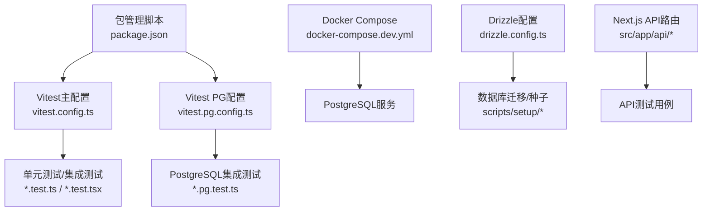
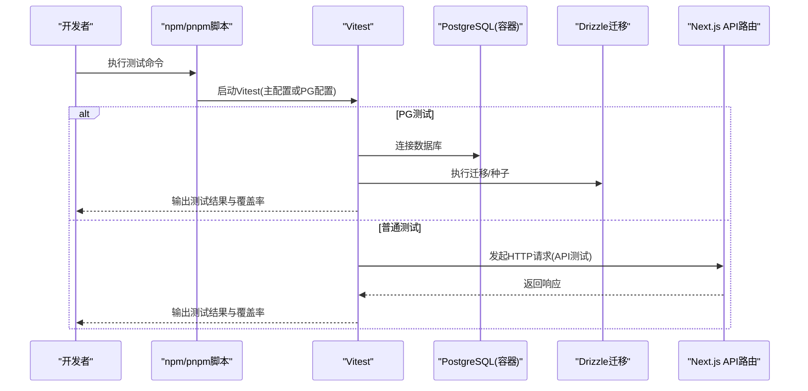
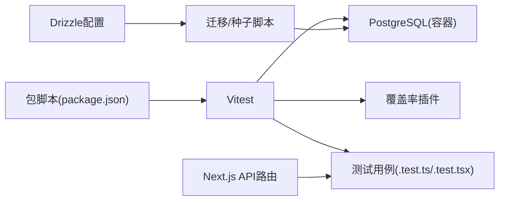

# 自动化测试配置

<cite>
**本文引用的文件**   
- [vitest.config.ts](file://vitest.config.ts)
- [vitest.pg.config.ts](file://vitest.pg.config.ts)
- [package.json](file://package.json)
- [docker-compose.dev.yml](file://docker-compose.dev.yml)
- [drizzle.config.ts](file://drizzle.config.ts)
- [scripts/setup/db-migrate.ts](file://scripts/setup/db-migrate.ts)
- [scripts/setup/postgres-init.sql](file://scripts/setup/postgres-init.sql)
- [server/src/index.ts](file://server/src/index.ts)
- [src/app/api/ping/route.ts](file://src/app/api/ping/route.ts)
- [tests/env.test.ts](file://tests/env.test.ts)
</cite>

## 目录
1. [简介](#简介)
2. [项目结构](#项目结构)
3. [核心组件](#核心组件)
4. [架构总览](#架构总览)
5. [详细组件分析](#详细组件分析)
6. [依赖分析](#依赖分析)
7. [性能考虑](#性能考虑)
8. [故障排查指南](#故障排查指南)
9. [结论](#结论)
10. [附录](#附录)

## 简介
本文件面向PurpleInk平台的自动化测试配置，聚焦Vitest测试框架的使用与扩展，覆盖单元测试、集成测试以及PostgreSQL集成测试的完整流程。文档将说明测试环境搭建（数据库初始化、Mock服务配置、测试数据准备）、覆盖率要求、报告生成以及在持续集成中的执行策略，并提供常见测试场景的实现思路与最佳实践，包括API测试、组件测试、异步操作测试等。同时给出性能优化与调试技巧，帮助团队在本地与CI环境中稳定高效地运行测试。

## 项目结构
仓库采用多配置文件组织测试：
- 根级Vitest主配置用于通用测试（单元/集成）
- PostgreSQL专用Vitest配置用于需要真实数据库的测试套件
- Docker Compose提供本地PostgreSQL服务
- Drizzle ORM配置驱动数据库迁移与种子脚本
- Next.js API路由作为后端接口，供API测试使用
- tests目录存放跨模块的集成与契约测试

图表来源
- [vitest.config.ts](file://vitest.config.ts)
- [vitest.pg.config.ts](file://vitest.pg.config.ts)
- [docker-compose.dev.yml](file://docker-compose.dev.yml)
- [drizzle.config.ts](file://drizzle.config.ts)
- [scripts/setup/db-migrate.ts](file://scripts/setup/db-migrate.ts)
- [scripts/setup/postgres-init.sql](file://scripts/setup/postgres-init.sql)
- [src/app/api/ping/route.ts](file://src/app/api/ping/route.ts)
- [package.json](file://package.json)

章节来源
- [vitest.config.ts](file://vitest.config.ts)
- [vitest.pg.config.ts](file://vitest.pg.config.ts)
- [docker-compose.dev.yml](file://docker-compose.dev.yml)
- [drizzle.config.ts](file://drizzle.config.ts)
- [package.json](file://package.json)

## 核心组件
- Vitest主配置：定义测试环境、匹配规则、覆盖率、全局设置等，适用于大多数单元与集成测试。
- Vitest PostgreSQL配置：启用Node环境、加载数据库连接信息、隔离事务或清理策略，确保PG测试可重复执行。
- Docker Compose：启动PostgreSQL容器，暴露端口与环境变量，便于本地与CI快速拉起数据库。
- Drizzle配置：声明数据库连接与迁移路径，配合脚本完成建库、迁移与种子数据。
- Next.js API路由：提供HTTP端点，作为API测试的目标。
- 包脚本：统一入口命令，如运行测试、覆盖率统计、PG专项测试等。

章节来源
- [vitest.config.ts](file://vitest.config.ts)
- [vitest.pg.config.ts](file://vitest.pg.config.ts)
- [docker-compose.dev.yml](file://docker-compose.dev.yml)
- [drizzle.config.ts](file://drizzle.config.ts)
- [src/app/api/ping/route.ts](file://src/app/api/ping/route.ts)
- [package.json](file://package.json)

## 架构总览
下图展示测试执行的整体架构：Vitest通过不同配置分别驱动普通测试与PG测试；PG测试通过Docker Compose启动数据库并执行迁移；API测试调用Next.js API路由；覆盖率与报告由Vitest插件与CLI输出。

图表来源
- [vitest.config.ts](file://vitest.config.ts)
- [vitest.pg.config.ts](file://vitest.pg.config.ts)
- [docker-compose.dev.yml](file://docker-compose.dev.yml)
- [drizzle.config.ts](file://drizzle.config.ts)
- [scripts/setup/db-migrate.ts](file://scripts/setup/db-migrate.ts)
- [src/app/api/ping/route.ts](file://src/app/api/ping/route.ts)

## 详细组件分析

### Vitest主配置（单元测试/集成测试）
- 目标：为大多数测试提供统一的运行环境、匹配规则、覆盖率与报告输出。
- 关键点：
  - 指定测试文件匹配模式，避免误匹配非测试文件
  - 启用覆盖率插件，设定阈值与输出格式
  - 配置全局钩子与模拟策略（如需）
  - 设置超时与并行度，平衡速度与稳定性

章节来源
- [vitest.config.ts](file://vitest.config.ts)

### Vitest PostgreSQL配置（PG集成测试）
- 目标：为需要真实数据库的测试提供独立环境，确保数据隔离与可重复性。
- 关键点：
  - 使用Node环境，允许访问文件系统与服务端模块
  - 读取环境变量以连接PostgreSQL
  - 在测试前执行迁移与种子，测试后清理数据或回滚事务
  - 隔离每个测试用例的数据状态，避免相互污染

章节来源
- [vitest.pg.config.ts](file://vitest.pg.config.ts)

### Docker Compose（PostgreSQL服务）
- 目标：在本地与CI中快速启动PostgreSQL容器，提供稳定的数据库环境。
- 关键点：
  - 定义服务镜像、端口映射、环境变量
  - 挂载初始化脚本，自动创建数据库与基础表结构
  - 健康检查确保服务就绪后再运行测试

章节来源
- [docker-compose.dev.yml](file://docker-compose.dev.yml)

### Drizzle配置与数据库迁移
- 目标：统一管理数据库Schema与迁移，保证测试环境与生产一致。
- 关键点：
  - 配置数据库连接与迁移目录
  - 提供迁移与种子脚本，支持幂等执行
  - 在PG测试前执行迁移，确保表结构与初始数据存在

章节来源
- [drizzle.config.ts](file://drizzle.config.ts)
- [scripts/setup/db-migrate.ts](file://scripts/setup/db-migrate.ts)
- [scripts/setup/postgres-init.sql](file://scripts/setup/postgres-init.sql)

### Next.js API路由（API测试目标）
- 目标：提供HTTP接口，供API测试验证业务逻辑与错误处理。
- 关键点：
  - 路由定义清晰，输入校验与错误码规范
  - 支持鉴权、限流、日志等横切关注点
  - 测试时可通过内联或外部方式调用

章节来源
- [src/app/api/ping/route.ts](file://src/app/api/ping/route.ts)

### 包脚本（测试入口）
- 目标：统一测试命令，区分普通测试与PG测试，便于本地与CI执行。
- 关键点：
  - 提供run test、coverage、pg-test等命令
  - 支持环境变量注入，切换测试环境
  - 在CI中串联迁移、测试、报告生成步骤

章节来源
- [package.json](file://package.json)

## 依赖分析
- 测试框架与插件：Vitest为核心，覆盖率插件用于统计与阈值控制
- 数据库层：PostgreSQL通过Docker Compose提供，Drizzle负责迁移与类型安全
- 应用层：Next.js API路由作为被测对象，测试通过HTTP或模块导入进行交互
- 工具链：pnpm/npm脚本协调执行顺序，环境变量驱动行为差异

图表来源
- [vitest.config.ts](file://vitest.config.ts)
- [vitest.pg.config.ts](file://vitest.pg.config.ts)
- [docker-compose.dev.yml](file://docker-compose.dev.yml)
- [drizzle.config.ts](file://drizzle.config.ts)
- [scripts/setup/db-migrate.ts](file://scripts/setup/db-migrate.ts)
- [src/app/api/ping/route.ts](file://src/app/api/ping/route.ts)
- [package.json](file://package.json)

章节来源
- [vitest.config.ts](file://vitest.config.ts)
- [vitest.pg.config.ts](file://vitest.pg.config.ts)
- [docker-compose.dev.yml](file://docker-compose.dev.yml)
- [drizzle.config.ts](file://drizzle.config.ts)
- [package.json](file://package.json)

## 性能考虑
- 测试并行化：合理设置Vitest并发度，避免资源竞争导致不稳定
- 数据库连接池：PG测试中复用连接，减少握手开销
- Mock与隔离：对第三方依赖使用Mock，缩短I/O等待时间
- 增量测试：按模块粒度拆分测试集，CI中仅运行变更相关测试
- 覆盖率阈值：设置合理的覆盖率门槛，避免过度追求数字影响开发效率

[本节为通用指导，不直接分析具体文件]

## 故障排查指南
- 环境变量缺失：确认PG连接信息、API地址等环境变量已正确设置
- 数据库未就绪：检查Docker Compose健康检查与迁移脚本是否成功执行
- 测试数据污染：确保每个测试用例前后有清理或事务回滚机制
- 覆盖率报告异常：检查插件配置与输出目录权限
- API测试失败：验证Next.js服务是否启动，路由是否正确注册

章节来源
- [tests/env.test.ts](file://tests/env.test.ts)

## 结论
通过Vitest主配置与PG专用配置的分离，结合Docker Compose与Drizzle迁移，PurpleInk平台实现了稳定、可重复且高效的自动化测试体系。单元测试保障核心逻辑正确性，集成测试验证模块协作，PG测试确保数据层可靠性。配合覆盖率阈值与CI流水线，可在保证质量的同时提升交付速度。建议持续优化测试并行度、Mock策略与数据隔离方案，进一步提升测试性能与可维护性。

[本节为总结性内容，不直接分析具体文件]

## 附录
- 常见测试场景实现思路：
  - API测试：构造请求、断言状态码与响应体、验证错误处理路径
  - 组件测试：渲染组件、触发交互、断言UI变化与事件回调
  - 异步操作测试：使用Promise与定时器模拟，断言最终状态与副作用
  - 数据库测试：使用事务包裹或清理钩子，确保数据一致性
- 调试技巧：
  - 启用Vitest调试模式，逐步定位失败用例
  - 打印关键上下文与中间结果，辅助问题复现
  - 使用独立数据库实例隔离调试环境

[本节为概念性内容，不直接分析具体文件]