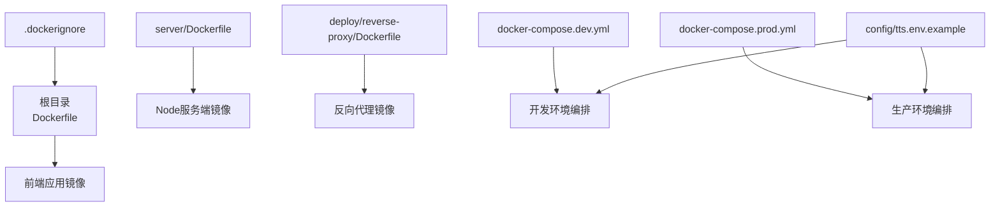
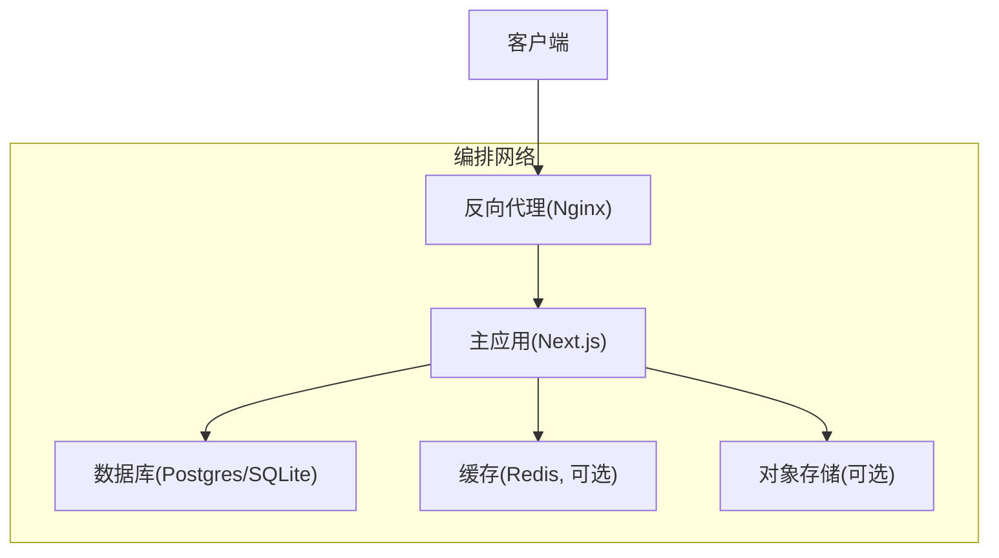
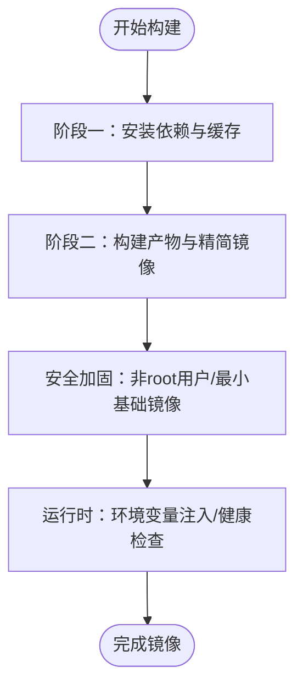
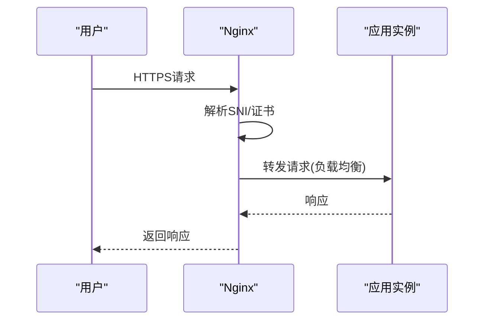
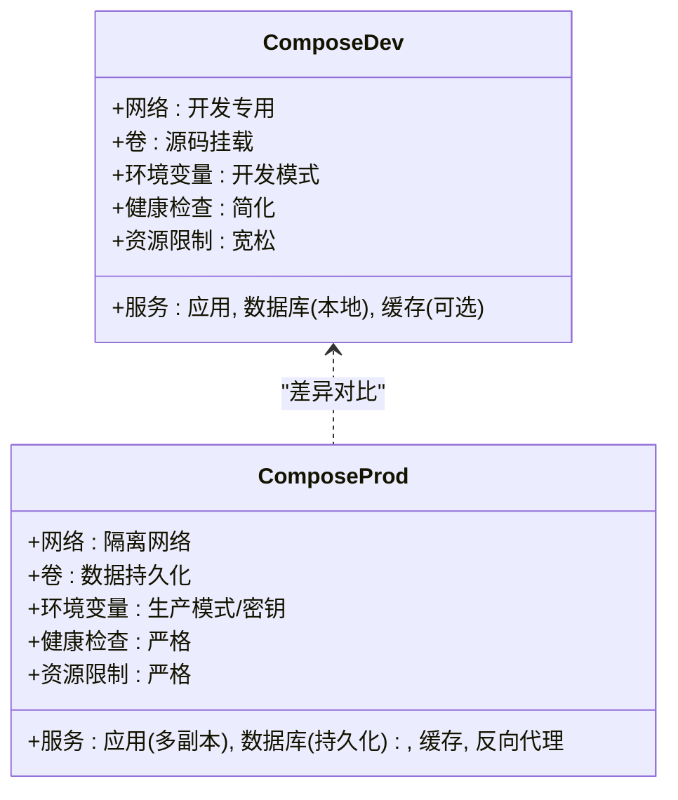
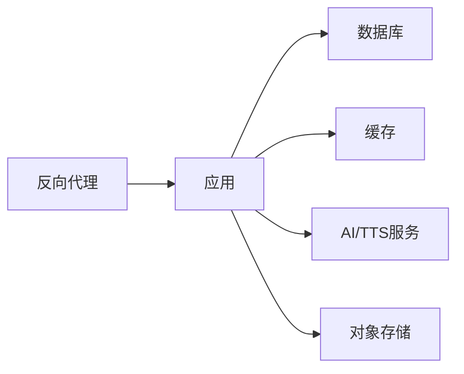

# Docker容器化部署

<cite>
**本文引用的文件**   
- [Dockerfile](file://Dockerfile)
- [.dockerignore](file://.dockerignore)
- [docker-compose.dev.yml](file://docker-compose.dev.yml)
- [docker-compose.prod.yml](file://docker-compose.prod.yml)
- [server/Dockerfile](file://server/Dockerfile)
- [deploy/reverse-proxy/Dockerfile](file://deploy/reverse-proxy/Dockerfile)
- [deploy/reverse-proxy/entrypoint.sh](file://deploy/reverse-proxy/entrypoint.sh)
- [deploy/reverse-proxy/secrets/basic_auth_credentials.example](file://deploy/reverse-proxy/secrets/basic_auth_credentials.example)
- [config/tts.env.example](file://config/tts.env.example)
</cite>

## 目录
1. [简介](#简介)
2. [项目结构](#项目结构)
3. [核心组件](#核心组件)
4. [架构总览](#架构总览)
5. [详细组件分析](#详细组件分析)
6. [依赖关系分析](#依赖关系分析)
7. [性能考虑](#性能考虑)
8. [故障排查指南](#故障排查指南)
9. [结论](#结论)
10. [附录](#附录)

## 简介
本文件面向PurpleInk平台的容器化部署，覆盖主应用镜像构建（多阶段构建、依赖优化、安全配置）、docker-compose编排（开发/生产差异、服务依赖、网络）、反向代理容器（Nginx、SSL证书挂载、负载均衡）以及健康检查、资源限制、日志收集等最佳实践，并提供常见问题的排查方法与解决方案。

## 项目结构
与容器化相关的核心文件分布如下：
- 根级Dockerfile：用于构建Next.js应用镜像（含多阶段构建与依赖优化）
- server/Dockerfile：Node服务端镜像定义（如需要独立运行后端服务）
- deploy/reverse-proxy/*：反向代理容器的镜像与启动脚本、示例凭据
- docker-compose.*.yml：开发与生产环境的编排文件
- .dockerignore：构建上下文过滤，减小镜像体积
- config/tts.env.example：TTS相关环境变量示例

图表来源
- [Dockerfile:1-200](file://Dockerfile#L1-L200)
- [server/Dockerfile:1-200](file://server/Dockerfile#L1-L200)
- [deploy/reverse-proxy/Dockerfile:1-200](file://deploy/reverse-proxy/Dockerfile#L1-L200)
- [docker-compose.dev.yml:1-200](file://docker-compose.dev.yml#L1-L200)
- [docker-compose.prod.yml:1-200](file://docker-compose.prod.yml#L1-L200)
- [.dockerignore:1-200](file://.dockerignore#L1-L200)
- [config/tts.env.example:1-200](file://config/tts.env.example#L1-L200)

章节来源
- [Dockerfile:1-200](file://Dockerfile#L1-L200)
- [server/Dockerfile:1-200](file://server/Dockerfile#L1-L200)
- [deploy/reverse-proxy/Dockerfile:1-200](file://deploy/reverse-proxy/Dockerfile#L1-L200)
- [docker-compose.dev.yml:1-200](file://docker-compose.dev.yml#L1-L200)
- [docker-compose.prod.yml:1-200](file://docker-compose.prod.yml#L1-L200)
- [.dockerignore:1-200](file://.dockerignore#L1-L200)
- [config/tts.env.example:1-200](file://config/tts.env.example#L1-L200)

## 核心组件
- 主应用镜像（Next.js）：通过多阶段构建分离依赖安装与产物构建，使用非root用户运行，最小化基础镜像并启用缓存层优化。
- Node服务端镜像（可选）：若将服务端逻辑与前端分离，提供独立的server镜像。
- 反向代理镜像（Nginx）：对外暴露HTTPS入口，支持SSL证书挂载、基本认证、负载均衡与健康检查转发。
- 编排文件：分别定义开发环境与生产环境的容器集合、网络、卷、环境变量、健康检查与资源限制。

章节来源
- [Dockerfile:1-200](file://Dockerfile#L1-L200)
- [server/Dockerfile:1-200](file://server/Dockerfile#L1-L200)
- [deploy/reverse-proxy/Dockerfile:1-200](file://deploy/reverse-proxy/Dockerfile#L1-L200)
- [docker-compose.dev.yml:1-200](file://docker-compose.dev.yml#L1-L200)
- [docker-compose.prod.yml:1-200](file://docker-compose.prod.yml#L1-L200)

## 架构总览
下图展示典型的生产部署拓扑：外部流量经反向代理进入，由编排文件统一调度各容器，应用通过内部网络访问数据库与外部服务。

图表来源
- [docker-compose.prod.yml:1-200](file://docker-compose.prod.yml#L1-L200)
- [deploy/reverse-proxy/Dockerfile:1-200](file://deploy/reverse-proxy/Dockerfile#L1-L200)
- [Dockerfile:1-200](file://Dockerfile#L1-L200)

## 详细组件分析

### 主应用镜像构建（多阶段构建与依赖优化）
- 多阶段构建：第一阶段安装依赖并缓存node_modules；第二阶段仅复制必要产物，减少镜像体积。
- 依赖优化：利用pnpm/yarn/npm的缓存策略，按package.json变更触发重建；排除无关文件（.dockerignore）。
- 安全配置：以非root用户运行，禁用不必要的系统包，关闭调试输出，设置只读文件系统（必要时挂载卷）。
- 运行时参数：通过环境变量注入API密钥、数据库连接串、TTS配置等。

图表来源
- [Dockerfile:1-200](file://Dockerfile#L1-L200)
- [.dockerignore:1-200](file://.dockerignore#L1-L200)

章节来源
- [Dockerfile:1-200](file://Dockerfile#L1-L200)
- [.dockerignore:1-200](file://.dockerignore#L1-L200)

### Node服务端镜像（可选）
- 用途：当业务逻辑拆分至独立Node服务时使用。
- 构建要点：同主应用镜像的多阶段构建与依赖缓存策略。
- 运行要点：进程管理（PM2或原生），健康检查端点，日志输出到stdout/stderr。

章节来源
- [server/Dockerfile:1-200](file://server/Dockerfile#L1-L200)

### 反向代理容器（Nginx）
- 镜像构建：基于官方Nginx镜像，自定义配置文件与入口脚本。
- SSL证书挂载：将主机证书目录挂载至容器，动态加载证书。
- 负载均衡：对上游应用实例进行轮询或加权分配。
- 基本认证：通过secrets文件实现路径级访问控制。
- 健康检查：转发健康检查请求至上游服务。

图表来源
- [deploy/reverse-proxy/Dockerfile:1-200](file://deploy/reverse-proxy/Dockerfile#L1-L200)
- [deploy/reverse-proxy/entrypoint.sh:1-200](file://deploy/reverse-proxy/entrypoint.sh#L1-L200)
- [deploy/reverse-proxy/secrets/basic_auth_credentials.example:1-200](file://deploy/reverse-proxy/secrets/basic_auth_credentials.example#L1-L200)

章节来源
- [deploy/reverse-proxy/Dockerfile:1-200](file://deploy/reverse-proxy/Dockerfile#L1-L200)
- [deploy/reverse-proxy/entrypoint.sh:1-200](file://deploy/reverse-proxy/entrypoint.sh#L1-L200)
- [deploy/reverse-proxy/secrets/basic_auth_credentials.example:1-200](file://deploy/reverse-proxy/secrets/basic_auth_credentials.example#L1-L200)

### 编排文件（开发 vs 生产）
- 开发环境：
  - 热重载与源码映射
  - 本地端口映射
  - 轻量依赖（如SQLite）
  - 调试日志级别
- 生产环境：
  - 多副本与滚动更新
  - 持久化卷（数据库、静态资源）
  - 环境变量与密钥管理
  - 资源限制与健康检查
  - 反向代理与TLS终止

图表来源
- [docker-compose.dev.yml:1-200](file://docker-compose.dev.yml#L1-L200)
- [docker-compose.prod.yml:1-200](file://docker-compose.prod.yml#L1-L200)

章节来源
- [docker-compose.dev.yml:1-200](file://docker-compose.dev.yml#L1-L200)
- [docker-compose.prod.yml:1-200](file://docker-compose.prod.yml#L1-L200)

### 环境变量与配置
- TTS配置：参考tts.env.example中的键值，按需注入到应用容器。
- 数据库连接：在compose中通过环境变量传递连接字符串。
- 安全敏感项：使用Compose secrets或外部密钥管理服务。

章节来源
- [config/tts.env.example:1-200](file://config/tts.env.example#L1-L200)
- [docker-compose.dev.yml:1-200](file://docker-compose.dev.yml#L1-L200)
- [docker-compose.prod.yml:1-200](file://docker-compose.prod.yml#L1-L200)

## 依赖关系分析
- 应用依赖：数据库、缓存、对象存储、第三方API（AI/TTS）。
- 反向代理依赖：上游应用实例、证书文件、认证凭据。
- 编排依赖：网络、卷、环境变量、健康检查、资源限制。

图表来源
- [docker-compose.prod.yml:1-200](file://docker-compose.prod.yml#L1-L200)
- [Dockerfile:1-200](file://Dockerfile#L1-L200)

章节来源
- [docker-compose.prod.yml:1-200](file://docker-compose.prod.yml#L1-L200)
- [Dockerfile:1-200](file://Dockerfile#L1-L200)

## 性能考虑
- 镜像体积：多阶段构建、精简基础镜像、排除无用文件。
- 构建缓存：合理分层，优先缓存依赖安装层。
- 运行时优化：启用HTTP/2、Gzip/Brotli压缩、连接池、并发限制。
- 资源限制：CPU/内存上限与下限，避免争用。
- 健康检查：快速失败与自动重启，缩短恢复时间。

[本节为通用指导，不直接分析具体文件]

## 故障排查指南
- 镜像构建失败：
  - 检查.dockerignore是否误删必要文件
  - 确认依赖安装阶段缓存命中情况
  - 查看构建日志定位错误模块
- 容器启动失败：
  - 检查环境变量是否正确注入
  - 验证数据库连接串与权限
  - 查看容器健康检查状态
- 反向代理问题：
  - 确认证书路径与权限
  - 校验上游服务可达性
  - 检查基本认证凭据格式
- 日志收集：
  - 统一输出到stdout/stderr
  - 使用日志聚合工具（如Fluentd/Logstash）
  - 设置合理的日志级别与轮转策略

章节来源
- [deploy/reverse-proxy/entrypoint.sh:1-200](file://deploy/reverse-proxy/entrypoint.sh#L1-L200)
- [docker-compose.dev.yml:1-200](file://docker-compose.dev.yml#L1-L200)
- [docker-compose.prod.yml:1-200](file://docker-compose.prod.yml#L1-L200)

## 结论
通过多阶段构建、依赖优化与安全加固，PurpleInk平台可实现高效、安全的容器化部署。结合docker-compose编排与反向代理，可灵活支撑开发与生产环境的不同需求。遵循健康检查、资源限制与日志收集的最佳实践，有助于提升系统的稳定性与可维护性。

[本节为总结性内容，不直接分析具体文件]

## 附录
- 常用命令：
  - 构建镜像：docker build -t purpleink-app .
  - 启动开发环境：docker compose -f docker-compose.dev.yml up
  - 启动生产环境：docker compose -f docker-compose.prod.yml up -d
- 健康检查端点：/health或/ping（根据应用实现）
- 日志查看：docker logs -f <container_name>

[本节为补充信息，不直接分析具体文件]