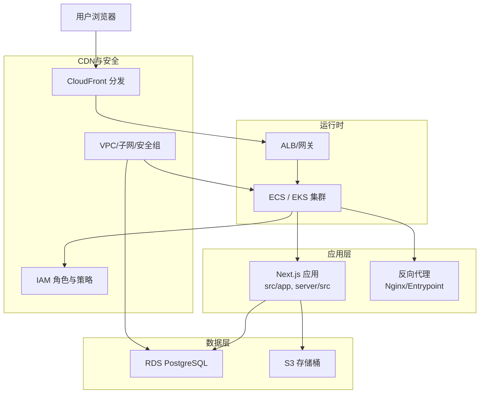
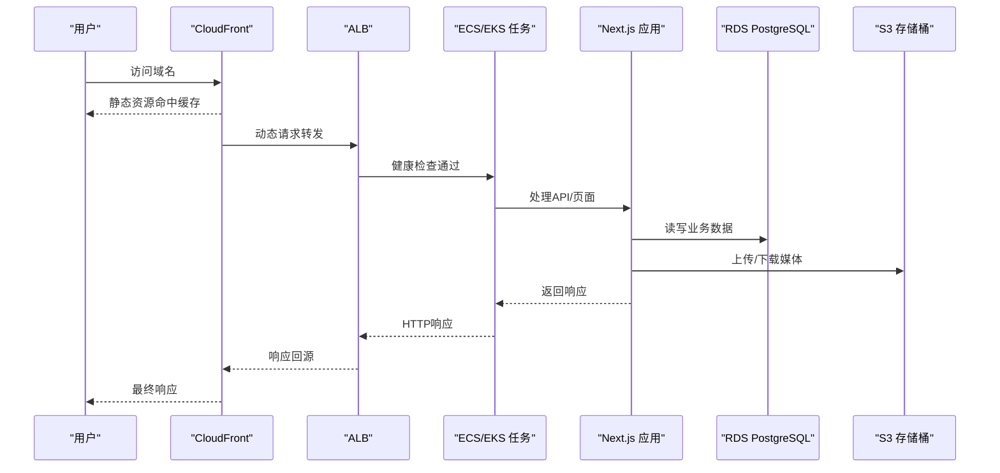
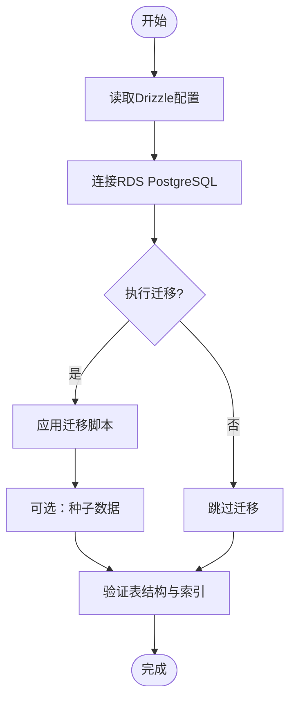
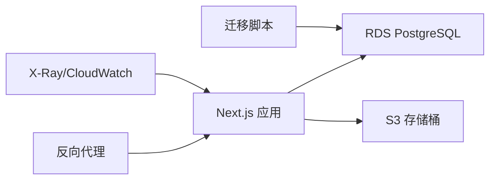

# AWS部署方案

<cite>
**本文引用的文件**   
- [Dockerfile](file://Dockerfile)
- [docker-compose.prod.yml](file://docker-compose.prod.yml)
- [drizzle.config.ts](file://drizzle.config.ts)
- [server/Dockerfile](file://server/Dockerfile)
- [deploy/reverse-proxy/Dockerfile](file://deploy/reverse-proxy/Dockerfile)
- [deploy/reverse-proxy/entrypoint.sh](file://deploy/reverse-proxy/entrypoint.sh)
- [scripts/setup/db-migrate.ts](file://scripts/setup/db-migrate.ts)
- [scripts/setup/postgres-init.sql](file://scripts/setup/postgres-init.sql)
- [scripts/migration/import-postgres.ts](file://scripts/migration/import-postgres.ts)
- [scripts/migration/reconcile-postgres.ts](file://scripts/migration/reconcile-postgres.ts)
- [src/instrumentation.ts](file://src/instrumentation.ts)
- [config/tts.env.example](file://config/tts.env.example)
</cite>

## 目录
1. [简介](#简介)
2. [项目结构](#项目结构)
3. [核心组件](#核心组件)
4. [架构总览](#架构总览)
5. [详细组件分析](#详细组件分析)
6. [依赖关系分析](#依赖关系分析)
7. [性能考虑](#性能考虑)
8. [故障排查指南](#故障排查指南)
9. [结论](#结论)
10. [附录](#附录)

## 简介
本指南面向在AWS上部署PurpleInk平台的工程团队，提供基于ECS与EKS的容器编排部署方案，涵盖任务定义、服务配置、自动扩缩容；RDS PostgreSQL主从复制、备份策略与性能优化；CloudFront CDN静态资源加速与S3媒体存储；IAM权限、VPC网络与安全组最佳实践；以及CloudWatch日志、X-Ray分布式追踪与Alarms告警集成。文档同时结合仓库中的Dockerfile、Compose与数据库迁移脚本，确保落地可执行。

## 项目结构
PurpleInk采用前后端一体化Next.js应用，后端服务位于server目录，反向代理与入口脚本位于deploy/reverse-proxy，数据库初始化与迁移脚本位于scripts目录。生产环境通过Docker镜像打包，配合ECS/EKS运行。

图表来源
- [Dockerfile](file://Dockerfile)
- [server/Dockerfile](file://server/Dockerfile)
- [deploy/reverse-proxy/Dockerfile](file://deploy/reverse-proxy/Dockerfile)
- [docker-compose.prod.yml](file://docker-compose.prod.yml)

章节来源
- [Dockerfile](file://Dockerfile)
- [server/Dockerfile](file://server/Dockerfile)
- [deploy/reverse-proxy/Dockerfile](file://deploy/reverse-proxy/Dockerfile)
- [docker-compose.prod.yml](file://docker-compose.prod.yml)

## 核心组件
- 应用镜像：Next.js服务端渲染与API路由，构建产物由server/Dockerfile生成。
- 反向代理：deploy/reverse-proxy提供基础认证与入口转发。
- 数据库：PostgreSQL（RDS），使用Drizzle ORM进行迁移与同步。
- 对象存储：S3用于媒体文件与导出产物。
- 监控与追踪：OpenTelemetry/X-Ray集成点位于src/instrumentation.ts。
- 配置：环境变量与密钥通过容器注入或Secrets Manager管理。

章节来源
- [server/Dockerfile](file://server/Dockerfile)
- [deploy/reverse-proxy/Dockerfile](file://deploy/reverse-proxy/Dockerfile)
- [drizzle.config.ts](file://drizzle.config.ts)
- [src/instrumentation.ts](file://src/instrumentation.ts)

## 架构总览
下图展示端到端请求路径与关键AWS组件交互，包括CDN、负载均衡、容器编排、数据库与对象存储。

图表来源
- [docker-compose.prod.yml](file://docker-compose.prod.yml)
- [server/Dockerfile](file://server/Dockerfile)
- [drizzle.config.ts](file://drizzle.config.ts)

## 详细组件分析

### 容器化与镜像构建
- 前端与后端统一通过Next.js构建，server/Dockerfile定义运行时依赖与启动命令。
- 反向代理镜像包含基础认证与入口脚本，便于在ECS/EKS中作为边车或独立服务运行。
- 建议将敏感配置放入AWS Secrets Manager，并通过环境变量注入容器。

章节来源
- [server/Dockerfile](file://server/Dockerfile)
- [deploy/reverse-proxy/Dockerfile](file://deploy/reverse-proxy/Dockerfile)
- [deploy/reverse-proxy/entrypoint.sh](file://deploy/reverse-proxy/entrypoint.sh)

### 数据库与迁移
- Drizzle ORM用于数据库模式管理与迁移，配置文件drizzle.config.ts指定连接参数与迁移路径。
- scripts/setup/db-migrate.ts与postgres-init.sql用于初始化与种子数据。
- 迁移脚本import-postgres.ts与reconcile-postgres.ts支持从SQLite导入并校验一致性。

图表来源
- [drizzle.config.ts](file://drizzle.config.ts)
- [scripts/setup/db-migrate.ts](file://scripts/setup/db-migrate.ts)
- [scripts/setup/postgres-init.sql](file://scripts/setup/postgres-init.sql)
- [scripts/migration/import-postgres.ts](file://scripts/migration/import-postgres.ts)
- [scripts/migration/reconcile-postgres.ts](file://scripts/migration/reconcile-postgres.ts)

章节来源
- [drizzle.config.ts](file://drizzle.config.ts)
- [scripts/setup/db-migrate.ts](file://scripts/setup/db-migrate.ts)
- [scripts/setup/postgres-init.sql](file://scripts/setup/postgres-init.sql)
- [scripts/migration/import-postgres.ts](file://scripts/migration/import-postgres.ts)
- [scripts/migration/reconcile-postgres.ts](file://scripts/migration/reconcile-postgres.ts)

### 监控与追踪
- src/instrumentation.ts为OpenTelemetry/X-Ray集成入口，建议在容器启动时启用探针与采样。
- 建议开启CloudWatch日志聚合，并将Trace ID注入到应用日志中以便关联。

章节来源
- [src/instrumentation.ts](file://src/instrumentation.ts)

### 配置与环境变量
- tts.env.example提供TTS相关环境变量示例，其他敏感配置建议使用AWS Secrets Manager或SSM Parameter Store。
- 容器启动时需注入数据库连接串、S3凭据、CDN域名等。

章节来源
- [config/tts.env.example](file://config/tts.env.example)

## 依赖关系分析
- 应用依赖RDS PostgreSQL与S3，反向代理依赖外部认证凭据。
- 迁移脚本依赖Drizzle CLI与数据库驱动。
- 监控依赖OpenTelemetry SDK与AWS X-Ray Agent。

图表来源
- [server/Dockerfile](file://server/Dockerfile)
- [drizzle.config.ts](file://drizzle.config.ts)
- [src/instrumentation.ts](file://src/instrumentation.ts)

章节来源
- [server/Dockerfile](file://server/Dockerfile)
- [drizzle.config.ts](file://drizzle.config.ts)
- [src/instrumentation.ts](file://src/instrumentation.ts)

## 性能考虑
- 数据库连接池：根据实例规格与并发设置合理连接数，避免过多连接导致CPU抖动。
- 缓存策略：对静态资源启用CloudFront缓存，对热点查询引入Redis或内存缓存。
- 异步处理：导出与渲染任务下沉至队列与Worker，避免阻塞主线程。
- I/O优化：S3分片上传与并行下载，减少大文件传输延迟。
- 资源隔离：ECS/EKS按工作负载划分命名空间与资源配额，限制单Pod/CPU占用。

[本节为通用指导，不直接分析具体文件]

## 故障排查指南
- 容器启动失败：检查环境变量、镜像构建产物与健康检查配置。
- 数据库连接错误：确认RDS安全组、IAM角色与连接串正确性。
- 迁移失败：查看Drizzle日志与SQL错误，必要时回滚迁移。
- 监控缺失：确认X-Ray Agent与OpenTelemetry探针已启用，TraceID是否注入日志。
- 权限不足：核对IAM策略是否允许S3读写、Secrets读取与CloudWatch写入。

章节来源
- [deploy/reverse-proxy/entrypoint.sh](file://deploy/reverse-proxy/entrypoint.sh)
- [scripts/setup/db-migrate.ts](file://scripts/setup/db-migrate.ts)
- [src/instrumentation.ts](file://src/instrumentation.ts)

## 结论
通过ECS/EKS容器化部署、RDS PostgreSQL高可用与备份、CloudFront+S3加速与存储、IAM/VPC/安全组安全加固，以及CloudWatch/X-Ray监控告警，PurpleInk可在AWS上实现稳定、可扩展、可观测的生产级平台。建议结合CI/CD流水线自动化发布与回滚，持续优化资源与成本。

[本节为总结性内容，不直接分析具体文件]

## 附录

### ECS部署要点
- 任务定义：定义容器镜像、端口映射、环境变量与挂载卷。
- 服务配置：设置最小/最大副本、滚动更新策略与健康检查。
- 自动扩缩容：基于CPU/内存或自定义指标触发扩缩容。
- 日志：输出到CloudWatch Logs，集中检索与告警。

### EKS部署要点
- Helm Chart：封装Deployment、Service、Ingress、ConfigMap与Secret。
- 节点池：区分系统节点与工作节点，按需扩容。
- 网络：CNI插件与Ingress控制器配置，暴露HTTPS。
- 存储：EBS CSI与S3 CSI用于持久化与对象存储。

### RDS PostgreSQL最佳实践
- 多可用区部署与只读副本提升可用性。
- 自动备份与快照策略，保留周期与跨区复制。
- 性能优化：调整shared_buffers、work_mem、max_connections与索引策略。
- 安全：VPC内网访问、SSL加密、最小权限IAM角色。

### CloudFront与S3
- 静态资源直连S3并通过CloudFront缓存。
- 媒体文件上传走预签名URL，降低服务器压力。
- 缓存失效策略与版本化文件名避免脏缓存。

### IAM与网络安全
- 最小权限原则：为每个服务分配独立角色与策略。
- VPC分段：公有子网放置ALB，私有子网放置ECS/EKS与RDS。
- 安全组：仅开放必要端口，限制来源IP段。

[本节为概念性补充，不直接分析具体文件]