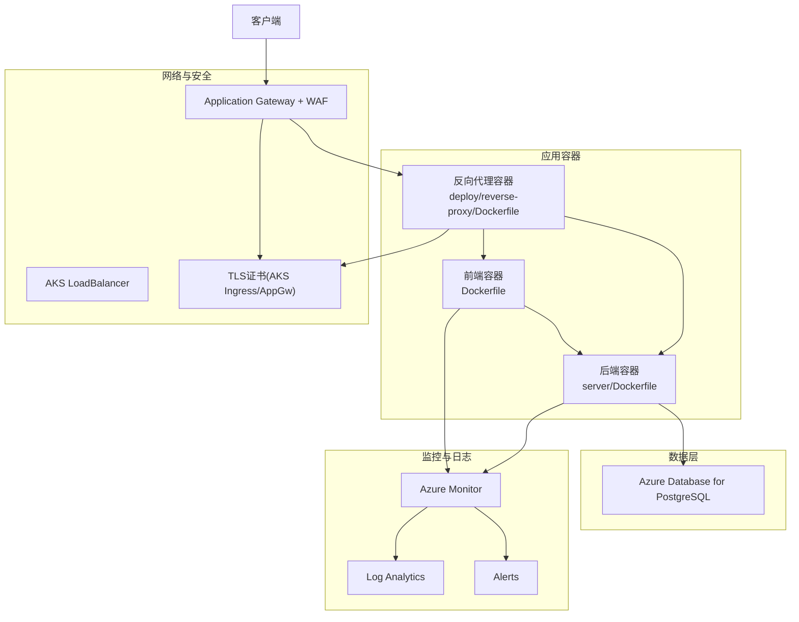
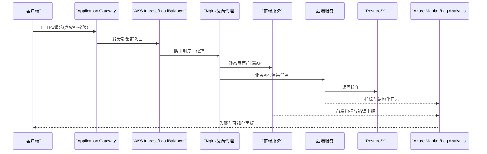
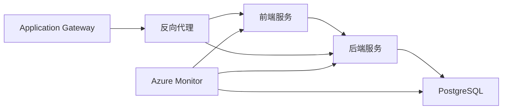

# Azure部署方案

<cite>
**本文引用的文件**   
- [Dockerfile](file://Dockerfile)
- [docker-compose.prod.yml](file://docker-compose.prod.yml)
- [server/Dockerfile](file://server/Dockerfile)
- [deploy/reverse-proxy/Dockerfile](file://deploy/reverse-proxy/Dockerfile)
- [deploy/reverse-proxy/entrypoint.sh](file://deploy/reverse-proxy/entrypoint.sh)
- [scripts/setup/postgres-init.sql](file://scripts/setup/postgres-init.sql)
- [scripts/migration/provision-master-key.ts](file://scripts/migration/provision-master-key.ts)
- [scripts/migration/import-postgres.ts](file://scripts/migration/import-postgres.ts)
- [scripts/migration/reconcile-postgres.ts](file://scripts/migration/reconcile-postgres.ts)
- [scripts/setup/bootstrap-credentials.ts](file://scripts/setup/bootstrap-credentials.ts)
- [scripts/setup/db-migrate.ts](file://scripts/setup/db-migrate.ts)
- [config/tts.env.example](file://config/tts.env.example)
- [docs/deployment/runbook.md](file://docs/deployment/runbook.md)
</cite>

## 目录
1. [简介](#简介)
2. [项目结构](#项目结构)
3. [核心组件](#核心组件)
4. [架构总览](#架构总览)
5. [详细组件分析](#详细组件分析)
6. [依赖关系分析](#依赖关系分析)
7. [性能与弹性](#性能与弹性)
8. [故障排查指南](#故障排查指南)
9. [结论](#结论)
10. [附录：Azure资源清单与配置要点](#附录azure资源清单与配置要点)

## 简介
本指南面向在Microsoft Azure上完整部署PurpleInk平台的工程团队，覆盖以下关键目标：
- AKS（Azure Kubernetes Service）容器集群的部署与配置：节点池管理、负载均衡器设置、证书管理。
- Azure Database for PostgreSQL的部署：弹性计算、自动故障转移、备份恢复策略。
- Application Gateway作为反向代理与WAF防火墙规则配置。
- Azure Monitor监控集成、Log Analytics日志分析、Alerts告警配置。
- 成本优化建议：预留实例、自动启停策略、资源标签管理。

本指南基于仓库中的Docker化应用、反向代理镜像、数据库初始化脚本与迁移工具进行设计，确保从开发到生产的一致性与可运维性。

## 项目结构
仓库采用前后端分离与多服务容器化组织方式：
- 前端与后端均提供独立Dockerfile，便于分别构建与部署。
- 反向代理使用独立的Nginx镜像，包含基础认证与入口脚本。
- 数据库初始化与迁移脚本位于scripts目录，支持PostgreSQL环境准备与数据导入。
- 生产编排参考docker-compose.prod.yml，可作为AKS Helm Chart或Kustomize的基础模板来源。

图表来源
- [Dockerfile](file://Dockerfile)
- [server/Dockerfile](file://server/Dockerfile)
- [deploy/reverse-proxy/Dockerfile](file://deploy/reverse-proxy/Dockerfile)

章节来源
- [Dockerfile](file://Dockerfile)
- [server/Dockerfile](file://server/Dockerfile)
- [deploy/reverse-proxy/Dockerfile](file://deploy/reverse-proxy/Dockerfile)
- [docker-compose.prod.yml](file://docker-compose.prod.yml)

## 核心组件
- 前端容器：静态资源与Next.js运行时，暴露HTTP端口供反向代理转发。
- 后端容器：Node.js服务，处理业务逻辑、队列任务、渲染与导出等能力，连接PostgreSQL。
- 反向代理：Nginx镜像，提供HTTPS终止、基础认证、请求路由与健康检查。
- 数据库：Azure Database for PostgreSQL，承载用户、项目、任务、凭证等核心数据。
- 监控与日志：通过Azure Monitor与Log Analytics采集指标与日志，结合Alerts实现告警。

章节来源
- [Dockerfile](file://Dockerfile)
- [server/Dockerfile](file://server/Dockerfile)
- [deploy/reverse-proxy/Dockerfile](file://deploy/reverse-proxy/Dockerfile)
- [scripts/setup/postgres-init.sql](file://scripts/setup/postgres-init.sql)

## 架构总览
整体架构以Application Gateway为统一入口，启用WAF防护与TLS终止；流量经AKS Ingress或LoadBalancer进入Nginx反向代理，再分发至前端与后端服务；后端持久化至Azure Database for PostgreSQL；所有组件通过Azure Monitor与Log Analytics进行观测与告警。

图表来源
- [deploy/reverse-proxy/Dockerfile](file://deploy/reverse-proxy/Dockerfile)
- [deploy/reverse-proxy/entrypoint.sh](file://deploy/reverse-proxy/entrypoint.sh)
- [server/Dockerfile](file://server/Dockerfile)
- [Dockerfile](file://Dockerfile)

## 详细组件分析

### AKS集群与节点池管理
- 节点池规划：
  - 系统节点池：运行kube-system组件，建议使用专用SKU与隔离磁盘。
  - 工作节点池：按负载划分，如“通用型”用于前后端，“GPU型”用于渲染任务（如有）。
  - 自动缩放：启用HPA/VPA与Cluster Autoscaler，依据CPU/内存/自定义指标扩缩容。
- 网络与负载均衡：
  - 使用Azure CNI或Kubenet网络插件，推荐Azure CNI以获得更高性能与IP直连。
  - 对外暴露服务可通过Ingress Controller（推荐NGINX或Azure Application Gateway Ingress Controller）或Service LoadBalancer。
- 证书管理：
  - 推荐使用Azure Key Vault与cert-manager自动签发与管理TLS证书。
  - 若使用Application Gateway，可在网关层集中管理证书并启用SNI。

章节来源
- [docker-compose.prod.yml](file://docker-compose.prod.yml)

### Application Gateway与WAF
- 反向代理：
  - 将Application Gateway作为统一入口，启用HTTPS终止与WAF策略。
  - 健康探针指向Nginx的反向代理健康端点，确保流量仅转发到健康实例。
- WAF规则：
  - 启用OWASP Core Rule Set，针对SQL注入、XSS、路径遍历等常见攻击设置阻断或审计模式。
  - 自定义规则：限制敏感路径访问频率、白名单IP段、鉴权头校验。
- 路由策略：
  - 基于主机名与路径前缀将流量分发到不同服务（前端、后端、管理接口）。
  - 会话保持与超时参数根据业务需求调整。

章节来源
- [deploy/reverse-proxy/Dockerfile](file://deploy/reverse-proxy/Dockerfile)
- [deploy/reverse-proxy/entrypoint.sh](file://deploy/reverse-proxy/entrypoint.sh)

### Azure Database for PostgreSQL
- 部署选项：
  - 选择“单服务器”或“灵活服务器”，生产推荐灵活服务器以支持弹性计算与高可用。
  - 启用高可用性（跨可用区），保障自动故障转移与数据冗余。
- 弹性与备份：
  - 弹性计算：根据CPU/内存阈值自动扩缩容，避免资源浪费。
  - 备份策略：启用保留期（如7-30天）、点时间恢复（PITR），定期导出快照到对象存储。
- 安全与访问：
  - 启用私有端点与虚拟网络集成，限制公网访问。
  - 使用密钥管理服务（Key Vault）托管数据库密码与连接字符串。

章节来源
- [scripts/setup/postgres-init.sql](file://scripts/setup/postgres-init.sql)
- [scripts/migration/import-postgres.ts](file://scripts/migration/import-postgres.ts)
- [scripts/migration/reconcile-postgres.ts](file://scripts/migration/reconcile-postgres.ts)

### 应用容器与反向代理
- 前端容器：
  - 构建产物最小化，启用缓存与CDN加速静态资源。
  - 环境变量注入（如API地址、功能开关）通过Kubernetes ConfigMap/Secret管理。
- 后端容器：
  - 进程模型：主进程处理HTTP请求，工作进程处理队列任务（渲染、导出、TTS等）。
  - 数据库连接：使用连接池与重试机制，避免瞬时失败导致雪崩。
- 反向代理：
  - Nginx镜像提供基础认证与请求过滤，入口脚本动态生成配置。
  - 健康检查端点用于网关与集群健康探测。

章节来源
- [Dockerfile](file://Dockerfile)
- [server/Dockerfile](file://server/Dockerfile)
- [deploy/reverse-proxy/Dockerfile](file://deploy/reverse-proxy/Dockerfile)
- [deploy/reverse-proxy/entrypoint.sh](file://deploy/reverse-proxy/entrypoint.sh)

### 数据库初始化与迁移
- 初始化脚本：
  - 创建数据库对象、默认角色与权限，确保最小权限原则。
- 迁移工具：
  - 版本化迁移脚本，支持回滚与幂等执行。
  - 数据导入与一致性校验，确保从SQLite或其他源平滑迁移。
- 密钥管理：
  - 主密钥与签名密钥通过专用脚本生成并安全存储。

章节来源
- [scripts/setup/postgres-init.sql](file://scripts/setup/postgres-init.sql)
- [scripts/migration/import-postgres.ts](file://scripts/migration/import-postgres.ts)
- [scripts/migration/reconcile-postgres.ts](file://scripts/migration/reconcile-postgres.ts)
- [scripts/migration/provision-master-key.ts](file://scripts/migration/provision-master-key.ts)

### 监控、日志与告警
- 指标采集：
  - 启用Container Insights与自定义指标，监控Pod/CPU/内存/网络I/O。
  - 后端服务暴露Prometheus指标端点，供Azure Monitor抓取。
- 日志分析：
  - 收集应用日志与系统日志到Log Analytics，建立查询仪表板。
  - 结构化日志格式，便于检索与聚合分析。
- 告警配置：
  - 定义阈值告警（CPU>80%持续5分钟、错误率>1%、数据库连接数接近上限）。
  - 事件驱动告警（VM重启、磁盘满、证书即将过期）。

章节来源
- [docs/deployment/runbook.md](file://docs/deployment/runbook.md)

## 依赖关系分析
- 应用依赖：
  - 前端依赖后端API与静态资源托管。
  - 后端依赖PostgreSQL与外部AI/TTS服务（通过环境变量配置）。
- 基础设施依赖：
  - AKS依赖VNet、子网、NSG、公共IP与证书。
  - Application Gateway依赖WAF策略、监听器与后端池。
  - PostgreSQL依赖备份计划、高可用配置与网络安全策略。

图表来源
- [Dockerfile](file://Dockerfile)
- [server/Dockerfile](file://server/Dockerfile)
- [deploy/reverse-proxy/Dockerfile](file://deploy/reverse-proxy/Dockerfile)

章节来源
- [docker-compose.prod.yml](file://docker-compose.prod.yml)

## 性能与弹性
- 水平扩展：
  - 无状态服务（前端、后端API）通过HPA自动扩缩容。
  - 有状态任务（渲染、导出）使用队列与Worker池，按负载动态扩容。
- 缓存与CDN：
  - 静态资源通过CDN缓存，减少源站压力。
  - 后端热点数据使用Redis或内存缓存（可选）。
- 数据库优化：
  - 索引优化与慢查询分析，避免全表扫描。
  - 读写分离（只读副本）提升查询吞吐。

[本节为通用指导，不直接分析具体文件]

## 故障排查指南
- 常见问题定位：
  - 应用启动失败：检查环境变量、ConfigMap/Secret挂载、镜像拉取权限。
  - 数据库连接失败：验证网络连通性、防火墙规则、凭据有效性。
  - 反向代理502/504：检查后端健康状态、超时设置、SSL握手。
- 日志与指标：
  - 使用Log Analytics查询异常堆栈与错误码分布。
  - 通过Azure Monitor查看Pod重启次数、资源利用率与延迟分布。
- 恢复流程：
  - 数据库恢复：使用PITR或快照恢复到指定时间点。
  - 应用回滚：通过Helm/Manifest版本回退，确保数据兼容。

章节来源
- [docs/deployment/runbook.md](file://docs/deployment/runbook.md)

## 结论
本方案基于仓库提供的容器化应用与脚本，构建了完整的Azure部署蓝图。通过AKS、Application Gateway、PostgreSQL与Azure Monitor的组合，实现了高可用、可扩展、可观测的生产环境。建议在实施过程中严格遵循安全最佳实践，并结合业务特性进行性能调优与成本优化。

[本节为总结性内容，不直接分析具体文件]

## 附录：Azure资源清单与配置要点
- AKS集群：
  - 节点池：系统节点池与工作节点池分离，启用自动缩放。
  - 网络：Azure CNI，Ingress Controller或AppGw Ingress。
  - 证书：cert-manager+Key Vault自动化管理。
- Application Gateway：
  - WAF：启用OWASP CRS，自定义规则拦截恶意请求。
  - 监听器：HTTPS终止，SNI支持多域名。
- PostgreSQL：
  - 灵活服务器：启用高可用与自动故障转移。
  - 备份：PITR与快照策略，定期导出到对象存储。
  - 安全：私有端点、虚拟网络集成、最小权限账户。
- 监控与告警：
  - Container Insights与自定义指标采集。
  - Log Analytics日志分析与查询仪表板。
  - Alerts阈值与事件驱动告警。
- 成本优化：
  - 预留实例：对稳定负载的VM与数据库购买预留实例。
  - 自动启停：非工作时间自动停止开发/测试环境。
  - 资源标签：统一标签管理成本分摊与资源归属。

章节来源
- [docker-compose.prod.yml](file://docker-compose.prod.yml)
- [config/tts.env.example](file://config/tts.env.example)
- [scripts/setup/bootstrap-credentials.ts](file://scripts/setup/bootstrap-credentials.ts)
- [scripts/setup/db-migrate.ts](file://scripts/setup/db-migrate.ts)