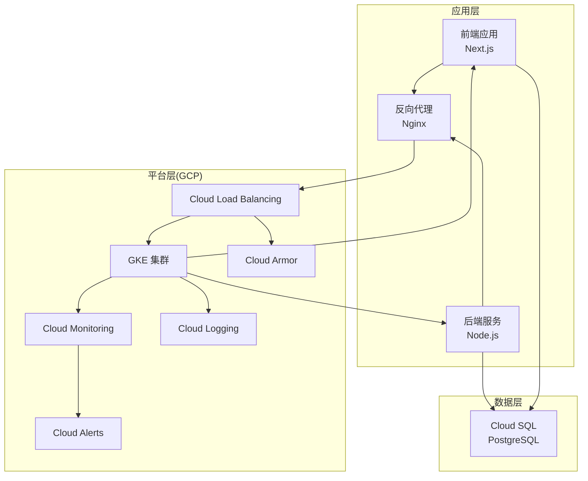
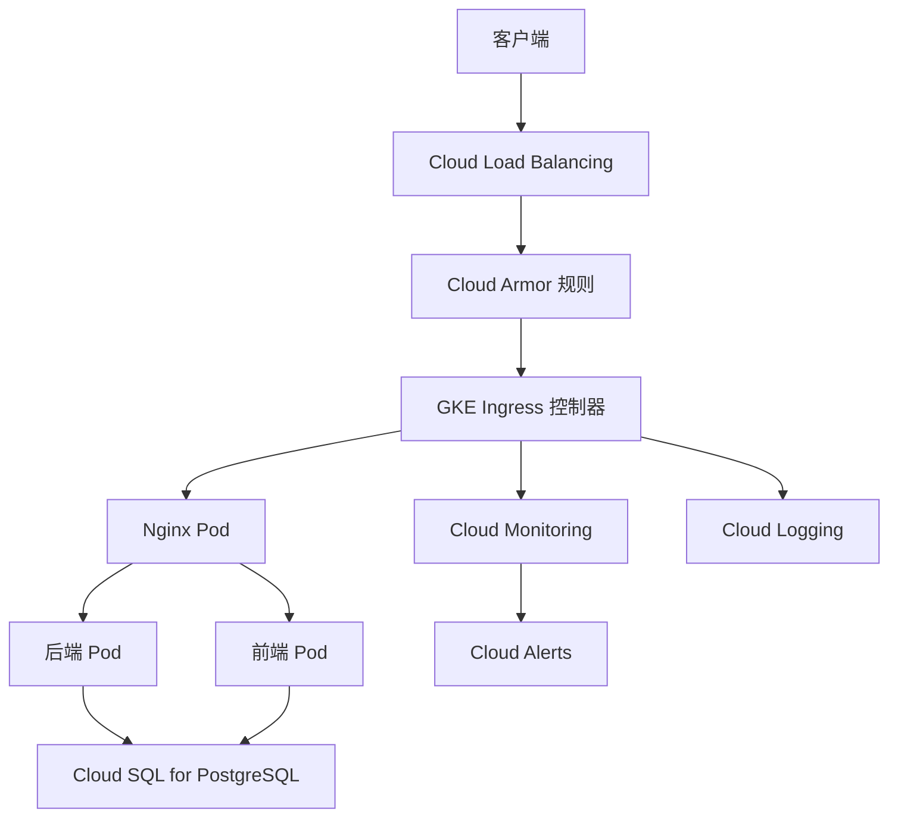
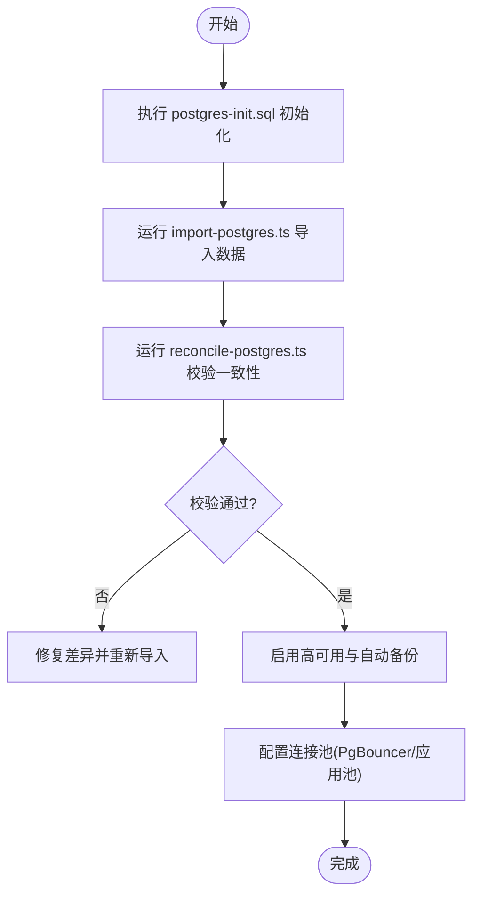
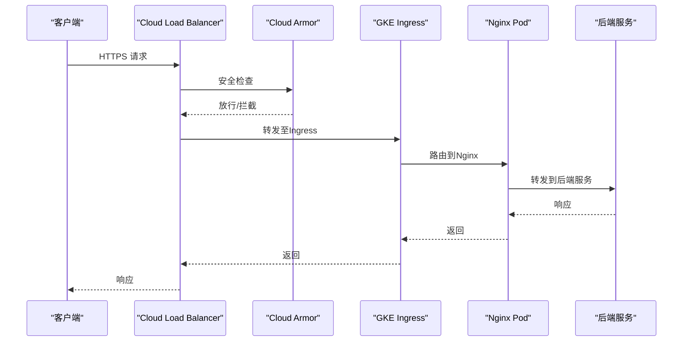
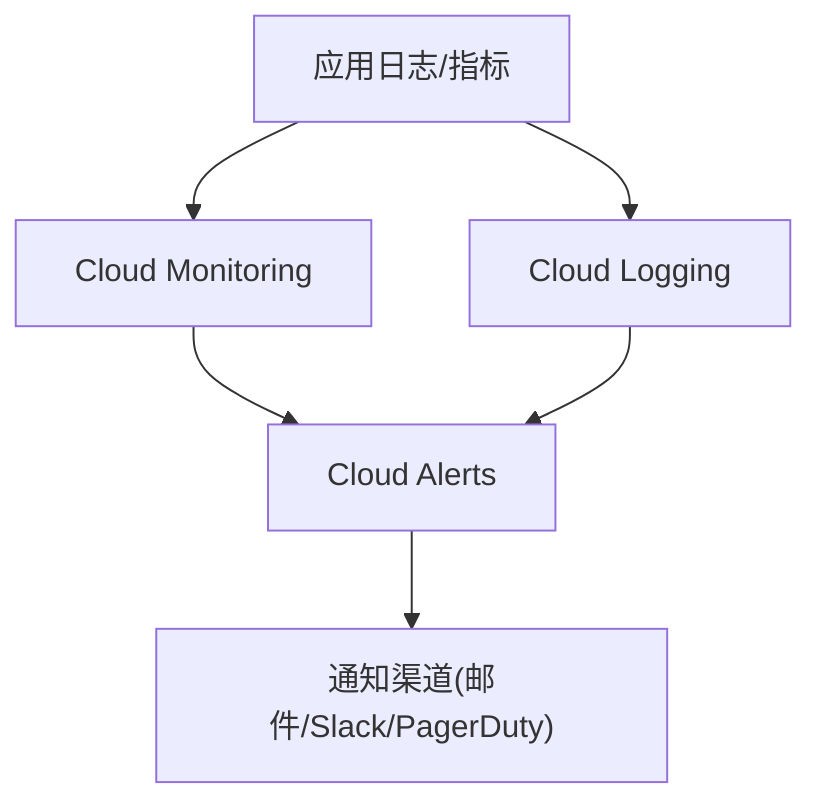
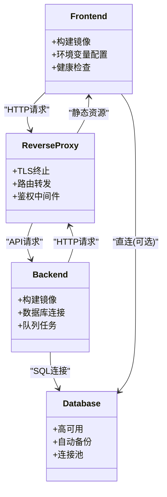

# Google Cloud部署方案

<cite>
**本文引用的文件**   
- [Dockerfile](file://Dockerfile)
- [docker-compose.prod.yml](file://docker-compose.prod.yml)
- [server/Dockerfile](file://server/Dockerfile)
- [deploy/reverse-proxy/Dockerfile](file://deploy/reverse-proxy/Dockerfile)
- [deploy/reverse-proxy/entrypoint.sh](file://deploy/reverse-proxy/entrypoint.sh)
- [scripts/setup/postgres-init.sql](file://scripts/setup/postgres-init.sql)
- [scripts/migration/import-postgres.ts](file://scripts/migration/import-postgres.ts)
- [scripts/migration/reconcile-postgres.ts](file://scripts/migration/reconcile-postgres.ts)
- [drizzle.config.ts](file://drizzle.config.ts)
- [next.config.ts](file://next.config.ts)
- [package.json](file://package.json)
- [docs/deployment/runbook.md](file://docs/deployment/runbook.md)
</cite>

## 目录
1. [简介](#简介)
2. [项目结构](#项目结构)
3. [核心组件](#核心组件)
4. [架构总览](#架构总览)
5. [详细组件分析](#详细组件分析)
6. [依赖关系分析](#依赖关系分析)
7. [性能考虑](#性能考虑)
8. [故障排查指南](#故障排查指南)
9. [结论](#结论)
10. [附录](#附录)

## 简介
本指南面向在Google Cloud Platform（GCP）上部署PurpleInk平台的工程团队，提供从容器化到Kubernetes集群、数据库、网络与安全、监控与日志、告警以及成本优化的端到端实践。内容覆盖：
- GKE容器集群部署配置（节点池管理、Ingress控制器、HPA水平扩缩容）
- Cloud SQL for PostgreSQL高可用、自动备份与连接池优化
- Cloud Load Balancing与Cloud Armor安全防护
- Cloud Monitoring、Cloud Logging与Cloud Alerts集成
- Cost Management策略（承诺使用折扣、自动资源清理、性能预算）

## 项目结构
仓库包含前后端应用、反向代理、数据库初始化脚本、迁移工具与生产编排示例，适合直接用于构建镜像与生成Kubernetes清单。关键目录与职责：
- 根级Dockerfile与Next.js配置：定义前端应用镜像与构建参数
- server/Dockerfile：后端服务镜像定义
- deploy/reverse-proxy：Nginx反向代理镜像与入口脚本
- scripts/setup/postgres-init.sql：数据库初始化脚本
- scripts/migration/*：PostgreSQL数据导入与一致性校验工具
- docker-compose.prod.yml：本地或CI环境的生产编排参考
- drizzle.config.ts：数据库迁移配置
- next.config.ts：Next.js运行时配置
- package.json：依赖与脚本入口

**图表来源** 
- [Dockerfile](file://Dockerfile)
- [server/Dockerfile](file://server/Dockerfile)
- [deploy/reverse-proxy/Dockerfile](file://deploy/reverse-proxy/Dockerfile)
- [docker-compose.prod.yml](file://docker-compose.prod.yml)

**章节来源**
- [Dockerfile](file://Dockerfile)
- [server/Dockerfile](file://server/Dockerfile)
- [deploy/reverse-proxy/Dockerfile](file://deploy/reverse-proxy/Dockerfile)
- [docker-compose.prod.yml](file://docker-compose.prod.yml)

## 核心组件
- 前端应用（Next.js）：通过根级Dockerfile构建静态产物并运行轻量服务器，便于在GKE中横向扩展。
- 后端服务（Node.js）：独立镜像，处理业务逻辑、队列任务与外部API调用。
- 反向代理（Nginx）：统一入口、TLS终止、鉴权与路由转发。
- 数据库（Cloud SQL for PostgreSQL）：承载结构化数据，支持高可用与自动备份。
- 基础设施（GKE、Load Balancer、Armor、Monitoring、Logging、Alerts）：提供弹性、安全与可观测性。

**章节来源**
- [Dockerfile](file://Dockerfile)
- [server/Dockerfile](file://server/Dockerfile)
- [deploy/reverse-proxy/Dockerfile](file://deploy/reverse-proxy/Dockerfile)
- [scripts/setup/postgres-init.sql](file://scripts/setup/postgres-init.sql)

## 架构总览
下图展示PurpleInk在GCP上的部署拓扑与数据流向，包括负载均衡、Kubernetes工作负载、数据库与可观测性集成。

**图表来源** 
- [docker-compose.prod.yml](file://docker-compose.prod.yml)
- [deploy/reverse-proxy/entrypoint.sh](file://deploy/reverse-proxy/entrypoint.sh)
- [scripts/setup/postgres-init.sql](file://scripts/setup/postgres-init.sql)

## 详细组件分析

### GKE容器集群部署配置
- 节点池管理
  - 建议按工作负载类型划分节点池：通用计算节点池（前端/后端）、GPU节点池（渲染/转码，如需要）。
  - 启用自动扩缩容（Cluster Autoscaler），设置最小/最大节点数与CPU/内存阈值。
  - 使用预emptible实例降低成本，结合Pod优先级与抢占恢复策略保障稳定性。
- Ingress控制器
  - 推荐使用GKE内置的NGINX Ingress Controller或GCLB Ingress，配合Managed Certificate实现HTTPS。
  - 将反向代理（Nginx）作为Ingress后端，统一端口与路径路由。
- HPA水平扩缩容
  - 为前端与后端Deployment配置HPA，基于CPU/内存或自定义指标（请求延迟、队列长度）进行扩缩容。
  - 设置合理的minReplicas与maxReplicas，避免冷启动抖动。
- 健康检查与就绪探针
  - 为所有Pod配置liveness与readiness探针，确保流量只进入健康实例。
- 存储与持久化
  - 使用GKE PersistentVolume（推荐SSD）挂载临时缓存或日志落盘；敏感数据不落盘。
- 安全与访问控制
  - 使用Workload Identity绑定Service Account，最小权限原则访问GCP资源。
  - 启用Network Policies限制Pod间通信。

**章节来源**
- [docker-compose.prod.yml](file://docker-compose.prod.yml)
- [deploy/reverse-proxy/entrypoint.sh](file://deploy/reverse-proxy/entrypoint.sh)

### Cloud SQL for PostgreSQL部署与优化
- 高可用配置
  - 启用高可用（HA）与多区域部署，确保故障快速切换。
  - 配置只读副本提升读取吞吐，后端服务读写分离。
- 自动备份与保留策略
  - 开启每日自动备份与事务日志备份，设置保留周期（例如30天）。
  - 定期演练恢复流程，验证备份有效性。
- 连接池优化
  - 使用PgBouncer或应用侧连接池（如node-postgres pool），根据并发与DB规格调整最大连接数。
  - 监控连接数、等待时间与超时错误，动态调优。
- 迁移与初始化
  - 使用提供的postgres-init.sql初始化结构与基础数据。
  - 通过import-postgres.ts与reconcile-postgres.ts完成数据导入与一致性校验。
- 安全加固
  - 仅允许VPC内网访问，禁用公网IP。
  - 使用Secret Manager管理凭据，注入环境变量。

**图表来源** 
- [scripts/setup/postgres-init.sql](file://scripts/setup/postgres-init.sql)
- [scripts/migration/import-postgres.ts](file://scripts/migration/import-postgres.ts)
- [scripts/migration/reconcile-postgres.ts](file://scripts/migration/reconcile-postgres.ts)

**章节来源**
- [scripts/setup/postgres-init.sql](file://scripts/setup/postgres-init.sql)
- [scripts/migration/import-postgres.ts](file://scripts/migration/import-postgres.ts)
- [scripts/migration/reconcile-postgres.ts](file://scripts/migration/reconcile-postgres.ts)

### Cloud Load Balancing与Cloud Armor安全防护
- Cloud Load Balancing
  - 使用Global HTTP(S) Load Balancer，结合Ingress控制器自动创建转发规则与健康检查。
  - 启用CDN缓存静态资源，降低源站压力。
- Cloud Armor
  - 配置WAF规则，防护SQL注入、XSS、CC攻击等常见威胁。
  - 设置IP白名单/黑名单、速率限制与地理限制策略。
- TLS与证书
  - 使用Managed Certificate自动签发与续期，强制HTTPS。
- 灰度发布与蓝绿部署
  - 借助Ingress权重路由与Service拆分，实现零停机发布。

**图表来源** 
- [deploy/reverse-proxy/Dockerfile](file://deploy/reverse-proxy/Dockerfile)
- [deploy/reverse-proxy/entrypoint.sh](file://deploy/reverse-proxy/entrypoint.sh)

**章节来源**
- [deploy/reverse-proxy/Dockerfile](file://deploy/reverse-proxy/Dockerfile)
- [deploy/reverse-proxy/entrypoint.sh](file://deploy/reverse-proxy/entrypoint.sh)

### Cloud Monitoring、Cloud Logging与Cloud Alerts
- Cloud Monitoring
  - 采集GKE节点、Pod、Service指标，自定义业务指标（QPS、延迟、错误率）。
  - 使用Dashboard可视化关键指标，设置SLO/SLI。
- Cloud Logging
  - 聚合应用日志与系统日志，结构化输出JSON格式便于查询与分析。
  - 配置日志路由与保留策略，降低存储成本。
- Cloud Alerts
  - 基于指标阈值与日志模式创建告警规则（如错误率突增、延迟升高、磁盘不足）。
  - 集成通知渠道（邮件、Slack、PagerDuty），明确升级策略。

**图表来源** 
- [next.config.ts](file://next.config.ts)
- [package.json](file://package.json)

**章节来源**
- [next.config.ts](file://next.config.ts)
- [package.json](file://package.json)

### 成本优化策略（Cost Management）
- 承诺使用折扣（Committed Use Discounts）
  - 对稳定基线负载购买1年或3年CUD，显著降低计算成本。
  - 结合Autoscaler预留最小节点，最大化折扣利用率。
- 自动资源清理
  - 定时清理未使用的PersistentVolume、Snapshot、镜像与日志。
  - 使用标签与生命周期策略自动化回收。
- 性能预算与容量规划
  - 设定性能预算（P95延迟、错误率上限），通过HPA与节点池扩容满足需求。
  - 定期压测与容量评审，避免过度配置。
- 存储与网络优化
  - 使用冷热分层存储，归档历史数据到低成本介质。
  - 启用内部负载均衡与VPC Service Controls减少跨区流量费用。

[本节为通用指导，不直接分析具体文件]

## 依赖关系分析
- 应用镜像依赖
  - 前端与后端分别基于各自Dockerfile构建，依赖Node.js运行时与系统库。
  - 反向代理镜像基于Nginx，依赖环境变量与配置文件。
- 数据库依赖
  - 应用通过环境变量连接Cloud SQL，使用SSL加密连接。
  - 迁移脚本依赖pg驱动与数据库连接字符串。
- 平台依赖
  - GKE集群依赖VPC、子网、防火墙规则与IAM角色。
  - Load Balancer与Armor依赖域名与证书管理。

**图表来源** 
- [Dockerfile](file://Dockerfile)
- [server/Dockerfile](file://server/Dockerfile)
- [deploy/reverse-proxy/Dockerfile](file://deploy/reverse-proxy/Dockerfile)
- [scripts/setup/postgres-init.sql](file://scripts/setup/postgres-init.sql)

**章节来源**
- [Dockerfile](file://Dockerfile)
- [server/Dockerfile](file://server/Dockerfile)
- [deploy/reverse-proxy/Dockerfile](file://deploy/reverse-proxy/Dockerfile)
- [scripts/setup/postgres-init.sql](file://scripts/setup/postgres-init.sql)

## 性能考虑
- 容器化与镜像优化
  - 多阶段构建减小镜像体积，移除开发依赖与调试信息。
  - 使用镜像缓存与并行构建加速CI/CD流水线。
- 数据库性能
  - 合理索引与查询优化，避免全表扫描。
  - 读写分离与连接池调优，降低锁竞争。
- 网络与缓存
  - 启用CDN缓存静态资源与API响应（短TTL）。
  - 使用内部负载均衡减少跨区延迟。
- 监控与调优
  - 基于Monitoring指标识别瓶颈，持续优化资源分配。
  - 压测与混沌工程验证弹性能力。

[本节为通用指导，不直接分析具体文件]

## 故障排查指南
- 常见问题定位
  - 应用启动失败：检查环境变量、Secret注入与依赖服务可用性。
  - 数据库连接失败：确认VPC网络、防火墙规则与SSL证书。
  - 反向代理404/502：检查Ingress路由与后端Pod健康状态。
- 日志与指标
  - 使用Cloud Logging检索错误堆栈与请求链路。
  - 通过Monitoring查看Pod重启、OOM与延迟异常。
- 回滚与恢复
  - 利用版本化镜像与滚动更新快速回滚。
  - 数据库快照与备份恢复演练。

**章节来源**
- [docs/deployment/runbook.md](file://docs/deployment/runbook.md)

## 结论
通过在GCP上采用GKE、Cloud SQL、Load Balancer与Armor、Monitoring/Logging/Alerts等原生服务，PurpleInk可实现高可用、可扩展、安全且可观测的生产环境。结合成本优化策略，可在保证性能的同时有效控制支出。建议持续迭代容量规划与自动化运维流程，提升交付效率与稳定性。

[本节为总结性内容，不直接分析具体文件]

## 附录
- 部署清单模板（示例）
  - Deployment：定义副本数、资源限制与探针
  - Service：暴露端口与负载均衡
  - Ingress：路由与TLS配置
  - HorizontalPodAutoscaler：基于指标的扩缩容
  - Secret/ConfigMap：管理与隔离配置
- 常用命令与脚本
  - kubectl apply -f manifests/
  - gcloud container clusters get-credentials
  - gcloud sql instances describe
- 参考文档
  - GKE最佳实践
  - Cloud SQL高可用与备份
  - Cloud Armor WAF规则
  - Monitoring与Logging集成

[本节为补充信息，不直接分析具体文件]