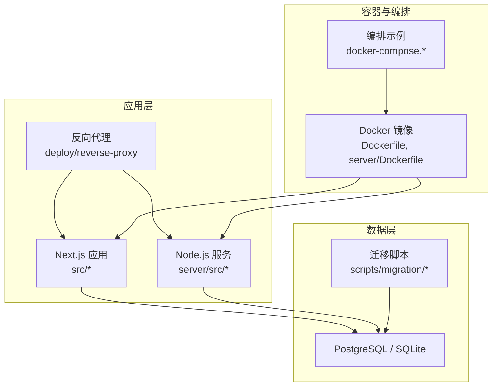
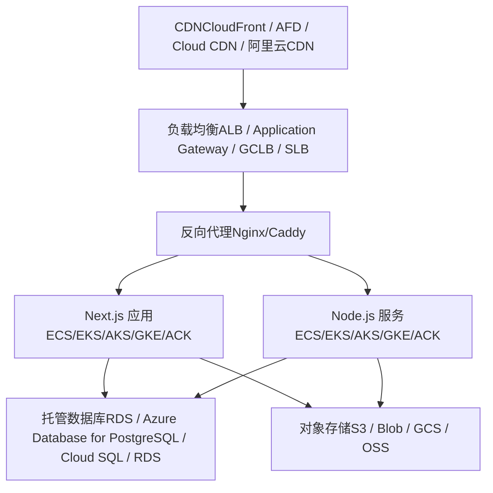
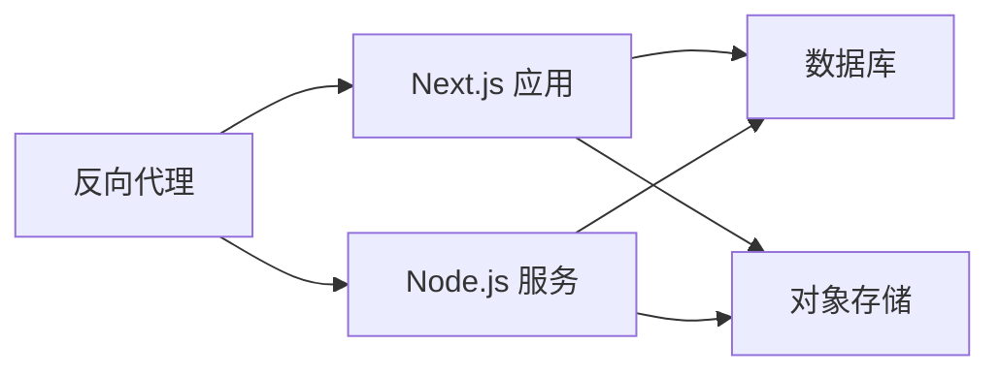

# 云平台部署方案

<cite>
**本文引用的文件**   
- [Dockerfile](file://Dockerfile)
- [docker-compose.dev.yml](file://docker-compose.dev.yml)
- [docker-compose.prod.yml](file://docker-compose.prod.yml)
- [deploy/reverse-proxy/Dockerfile](file://deploy/reverse-proxy/Dockerfile)
- [deploy/reverse-proxy/entrypoint.sh](file://deploy/reverse-proxy/entrypoint.sh)
- [server/Dockerfile](file://server/Dockerfile)
- [next.config.ts](file://next.config.ts)
- [drizzle.config.ts](file://drizzle.config.ts)
- [scripts/setup/db-migrate.ts](file://scripts/setup/db-migrate.ts)
- [scripts/migration/postgres-init.sql](file://scripts/setup/postgres-init.sql)
- [scripts/migration/import-postgres.ts](file://scripts/migration/import-postgres.ts)
- [scripts/migration/export-sqlite.ts](file://scripts/migration/export-sqlite.ts)
- [scripts/migration/reconcile-postgres.ts](file://scripts/migration/reconcile-postgres.ts)
- [scripts/migration/provision-master-key.ts](file://scripts/migration/provision-master-key.ts)
- [server/src/index.ts](file://server/src/index.ts)
- [server/src/server/api.ts](file://server/src/server/api.ts)
- [server/src/server/job-runner.ts](file://server/src/server/job-runner.ts)
- [server/src/server/job-store.ts](file://server/src/server/job-store.ts)
- [src/lib/config/env.ts](file://src/lib/config/env.ts)
- [config/tts.env.example](file://config/tts.env.example)
- [docs/deployment/runbook.md](file://docs/deployment/runbook.md)
</cite>

## 目录
1. [简介](#简介)
2. [项目结构](#项目结构)
3. [核心组件](#核心组件)
4. [架构总览](#架构总览)
5. [详细组件分析](#详细组件分析)
6. [依赖关系分析](#依赖关系分析)
7. [性能与成本优化](#性能与成本优化)
8. [安全配置](#安全配置)
9. [监控与可观测性](#监控与可观测性)
10. [故障排查指南](#故障排查指南)
11. [结论](#结论)
12. [附录：各云部署方案](#附录各云部署方案)

## 简介
本指南面向在主流云平台（AWS、Azure、Google Cloud、阿里云）上部署 PurpleInk 平台的工程团队，提供从容器编排、数据库、CDN、负载均衡到监控与安全的一体化部署方案。PurpleInk 采用 Next.js 应用与 Node.js 服务端组件，配合反向代理与数据库迁移脚本，适合以容器化方式在各云上快速落地。

## 项目结构
- 前端与API：Next.js 应用，位于 src 目录，通过 server 子模块暴露 API 与后台任务能力。
- 容器镜像：根级 Dockerfile 构建主应用；server/Dockerfile 构建后端服务；deploy/reverse-proxy 提供反向代理镜像。
- 运行编排：docker-compose.* 用于本地与生产环境编排示例。
- 数据库：使用 Drizzle ORM，迁移脚本位于 scripts 目录，支持 SQLite 与 PostgreSQL 的导入导出与初始化。
- 配置：环境变量与 TTS 相关配置示例位于 config 目录。

图表来源
- [Dockerfile](file://Dockerfile)
- [server/Dockerfile](file://server/Dockerfile)
- [deploy/reverse-proxy/Dockerfile](file://deploy/reverse-proxy/Dockerfile)
- [docker-compose.dev.yml](file://docker-compose.dev.yml)
- [docker-compose.prod.yml](file://docker-compose.prod.yml)
- [scripts/migration/postgres-init.sql](file://scripts/setup/postgres-init.sql)

章节来源
- [Dockerfile](file://Dockerfile)
- [server/Dockerfile](file://server/Dockerfile)
- [deploy/reverse-proxy/Dockerfile](file://deploy/reverse-proxy/Dockerfile)
- [docker-compose.dev.yml](file://docker-compose.dev.yml)
- [docker-compose.prod.yml](file://docker-compose.prod.yml)
- [next.config.ts](file://next.config.ts)
- [drizzle.config.ts](file://drizzle.config.ts)

## 核心组件
- 反向代理：基于 deploy/reverse-proxy 的轻量入口，负责 TLS 终止、鉴权与路由转发。
- Next.js 应用：承载页面渲染与 API 路由，通过环境变量加载运行时配置。
- Node.js 服务：提供作业执行、队列处理与持久化存储访问。
- 数据库：支持 SQLite（开发）与 PostgreSQL（生产），通过 Drizzle 进行迁移与数据访问。
- 迁移工具：提供数据库初始化、SQLite 与 PostgreSQL 之间的数据导入导出、主密钥准备等。

章节来源
- [deploy/reverse-proxy/Dockerfile](file://deploy/reverse-proxy/Dockerfile)
- [deploy/reverse-proxy/entrypoint.sh](file://deploy/reverse-proxy/entrypoint.sh)
- [server/src/index.ts](file://server/src/index.ts)
- [server/src/server/api.ts](file://server/src/server/api.ts)
- [server/src/server/job-runner.ts](file://server/src/server/job-runner.ts)
- [server/src/server/job-store.ts](file://server/src/server/job-store.ts)
- [drizzle.config.ts](file://drizzle.config.ts)
- [scripts/setup/db-migrate.ts](file://scripts/setup/db-migrate.ts)
- [scripts/migration/postgres-init.sql](file://scripts/setup/postgres-init.sql)
- [scripts/migration/import-postgres.ts](file://scripts/migration/import-postgres.ts)
- [scripts/migration/export-sqlite.ts](file://scripts/migration/export-sqlite.ts)
- [scripts/migration/reconcile-postgres.ts](file://scripts/migration/reconcile-postgres.ts)
- [scripts/migration/provision-master-key.ts](file://scripts/migration/provision-master-key.ts)

## 架构总览
下图展示 PurpleInk 在云上的典型部署拓扑：用户流量经 CDN 进入负载均衡器，再转发至反向代理与容器集群；应用与后端服务连接托管数据库，并通过对象存储缓存静态资源与产物。

[此图为概念性架构图，不直接映射具体源码文件]

## 详细组件分析

### 反向代理组件
- 职责：TLS 终止、基础认证、请求路由与健康检查。
- 关键文件：
  - 镜像定义：deploy/reverse-proxy/Dockerfile
  - 启动脚本：deploy/reverse-proxy/entrypoint.sh
- 建议：将敏感凭据通过平台密钥管理服务注入，避免硬编码。

章节来源
- [deploy/reverse-proxy/Dockerfile](file://deploy/reverse-proxy/Dockerfile)
- [deploy/reverse-proxy/entrypoint.sh](file://deploy/reverse-proxy/entrypoint.sh)

### Next.js 应用与服务端
- 职责：页面渲染、API 路由、作业调度与状态管理。
- 关键文件：
  - 应用入口：server/src/index.ts
  - API 路由：server/src/server/api.ts
  - 作业执行：server/src/server/job-runner.ts
  - 作业存储：server/src/server/job-store.ts
- 建议：为不同环境分离配置，启用最小权限原则访问数据库与对象存储。

章节来源
- [server/src/index.ts](file://server/src/index.ts)
- [server/src/server/api.ts](file://server/src/server/api.ts)
- [server/src/server/job-runner.ts](file://server/src/server/job-runner.ts)
- [server/src/server/job-store.ts](file://server/src/server/job-store.ts)

### 数据库与迁移
- 职责：结构化数据存储、迁移与数据一致性保障。
- 关键文件：
  - ORM 配置：drizzle.config.ts
  - 迁移脚本：scripts/setup/db-migrate.ts
  - 初始化SQL：scripts/setup/postgres-init.sql
  - 数据导入导出：scripts/migration/import-postgres.ts、scripts/migration/export-sqlite.ts
  - 数据对齐：scripts/migration/reconcile-postgres.ts
  - 主密钥准备：scripts/migration/provision-master-key.ts
- 建议：生产环境使用高可用数据库实例，开启自动备份与跨区复制。

章节来源
- [drizzle.config.ts](file://drizzle.config.ts)
- [scripts/setup/db-migrate.ts](file://scripts/setup/db-migrate.ts)
- [scripts/setup/postgres-init.sql](file://scripts/setup/postgres-init.sql)
- [scripts/migration/import-postgres.ts](file://scripts/migration/import-postgres.ts)
- [scripts/migration/export-sqlite.ts](file://scripts/migration/export-sqlite.ts)
- [scripts/migration/reconcile-postgres.ts](file://scripts/migration/reconcile-postgres.ts)
- [scripts/migration/provision-master-key.ts](file://scripts/migration/provision-master-key.ts)

### 容器与编排
- 职责：构建与应用发布、服务编排与扩缩容。
- 关键文件：
  - 主应用镜像：Dockerfile
  - 后端服务镜像：server/Dockerfile
  - 编排示例：docker-compose.dev.yml、docker-compose.prod.yml
- 建议：在多节点集群中启用滚动更新与健康检查，结合外部负载均衡。

章节来源
- [Dockerfile](file://Dockerfile)
- [server/Dockerfile](file://server/Dockerfile)
- [docker-compose.dev.yml](file://docker-compose.dev.yml)
- [docker-compose.prod.yml](file://docker-compose.prod.yml)

### 配置与环境变量
- 职责：运行时配置加载、TTS 与第三方服务接入。
- 关键文件：
  - 环境变量示例：config/tts.env.example
  - 应用配置：next.config.ts
- 建议：使用平台密钥管理服务或环境变量注入，避免泄露敏感信息。

章节来源
- [config/tts.env.example](file://config/tts.env.example)
- [next.config.ts](file://next.config.ts)

## 依赖关系分析
- 反向代理依赖 Next.js 与 Node.js 服务端口，健康检查需覆盖所有上游。
- Next.js 与 Node.js 服务均依赖数据库连接参数与对象存储凭证。
- 迁移脚本依赖数据库驱动与目标库版本兼容性。

[此图为概念性依赖图，不直接映射具体源码文件]

## 性能与成本优化
- 容器编排
  - 使用水平自动扩缩容（HPA/KEDA）应对突发流量。
  - 设置合理的 CPU/内存限制与请求限流，避免资源争用。
- 数据库
  - 选择合适实例规格与存储类型，启用只读副本分担查询压力。
  - 定期清理索引与归档历史数据，降低 I/O 开销。
- CDN 与缓存
  - 静态资源与产物缓存至对象存储，CDN 加速分发。
  - 合理设置 TTL 与缓存键，减少回源请求。
- 成本优化
  - 使用预留实例或节省计划降低计算与数据库成本。
  - 非生产环境使用按需实例并定时关闭。

[本节为通用指导，不直接分析具体文件]

## 安全配置
- 网络隔离
  - 将应用与数据库置于私有子网，仅开放必要端口。
  - 使用安全组/防火墙规则限制入站流量。
- 身份与访问控制
  - 最小权限原则，按服务分配 IAM/角色策略。
  - 使用平台密钥管理服务管理数据库密码与 API 密钥。
- 传输加密
  - 全站 HTTPS，启用 HSTS 与强加密套件。
  - 数据库连接强制 SSL/TLS。
- 审计与合规
  - 开启访问日志与操作审计，集中收集至日志平台。
  - 定期进行漏洞扫描与基线核查。

[本节为通用指导，不直接分析具体文件]

## 监控与可观测性
- 指标采集
  - 应用指标：QPS、延迟、错误率、资源利用率。
  - 数据库指标：连接数、慢查询、锁等待、磁盘使用。
- 日志聚合
  - 统一收集应用与系统日志，建立告警规则。
- 链路追踪
  - 对关键请求路径进行分布式追踪，定位瓶颈。
- 健康检查
  - 配置探针与就绪探针，确保流量只路由到健康实例。

[本节为通用指导，不直接分析具体文件]

## 故障排查指南
- 常见问题
  - 数据库连接失败：检查连接字符串、网络策略与证书。
  - 反向代理超时：确认上游服务健康与负载情况。
  - 迁移失败：核对数据库版本与迁移脚本兼容性。
- 诊断步骤
  - 查看服务日志与事件记录，定位异常堆栈。
  - 使用平台监控面板观察资源与指标趋势。
  - 复现问题并逐步缩小范围，必要时回滚变更。

章节来源
- [docs/deployment/runbook.md](file://docs/deployment/runbook.md)

## 结论
PurpleInk 平台具备清晰的容器化与模块化设计，适合在各大云平台快速落地。通过合理的编排、数据库选型、CDN 与对象存储组合，以及完善的安全与监控体系，可实现高可用、可扩展且成本可控的生产部署。

[本节为总结性内容，不直接分析具体文件]

## 附录：各云部署方案

### AWS 部署方案
- 容器编排
  - ECS：使用 Fargate 或 EC2 集群，配合 ALB 与 Auto Scaling。
  - EKS：Kubernetes 集群，部署反向代理、Next.js 与 Node.js 服务。
- 数据库
  - RDS PostgreSQL：多可用区部署，启用只读副本与自动备份。
- CDN
  - CloudFront：缓存静态资源与产物，结合 S3 作为源站。
- 负载均衡
  - ALB：七层负载均衡，支持路径与主机名路由。
- 最佳实践
  - 使用 Secrets Manager 管理密钥，IAM 最小权限。
  - 启用 VPC 流日志与 WAF 防护。
  - 通过 CloudWatch 与 X-Ray 进行监控与追踪。

[本节为通用指导，不直接分析具体文件]

### Azure 部署方案
- 容器编排
  - AKS：Kubernetes 集群，部署反向代理、Next.js 与 Node.js 服务。
- 数据库
  - Azure Database for PostgreSQL：弹性伸缩与自动备份。
- 负载均衡
  - Application Gateway：七层负载均衡与 WAF。
- CDN
  - Azure Front Door：全球加速与智能路由。
- 最佳实践
  - 使用 Key Vault 管理密钥，RBAC 最小权限。
  - 启用 Azure Monitor 与 Application Insights。
  - 通过 NSG 与防火墙规则限制网络访问。

[本节为通用指导，不直接分析具体文件]

### Google Cloud 部署方案
- 容器编排
  - GKE：Kubernetes 集群，部署反向代理、Next.js 与 Node.js 服务。
- 数据库
  - Cloud SQL for PostgreSQL：高可用与自动备份。
- 负载均衡
  - GCLB：全局负载均衡与 HTTP(S) 负载均衡器。
- CDN
  - Cloud CDN：缓存静态资源与产物，结合 Cloud Storage。
- 最佳实践
  - 使用 Secret Manager 管理密钥，IAM 最小权限。
  - 启用 Cloud Monitoring 与 Logging。
  - 通过 VPC 防火墙与 Cloud Armor 提升安全性。

[本节为通用指导，不直接分析具体文件]

### 阿里云部署方案
- 容器编排
  - ACK：Kubernetes 集群，部署反向代理、Next.js 与 Node.js 服务。
- 数据库
  - RDS PostgreSQL：多可用区与只读副本。
- 负载均衡
  - SLB：四层与七层负载均衡。
- CDN
  - 阿里云 CDN：缓存静态资源与产物，结合 OSS。
- 最佳实践
  - 使用 KMS 与 RAM 最小权限管理密钥。
  - 启用云监控与日志服务 SLS。
  - 通过安全组与云防火墙限制网络访问。

[本节为通用指导，不直接分析具体文件]