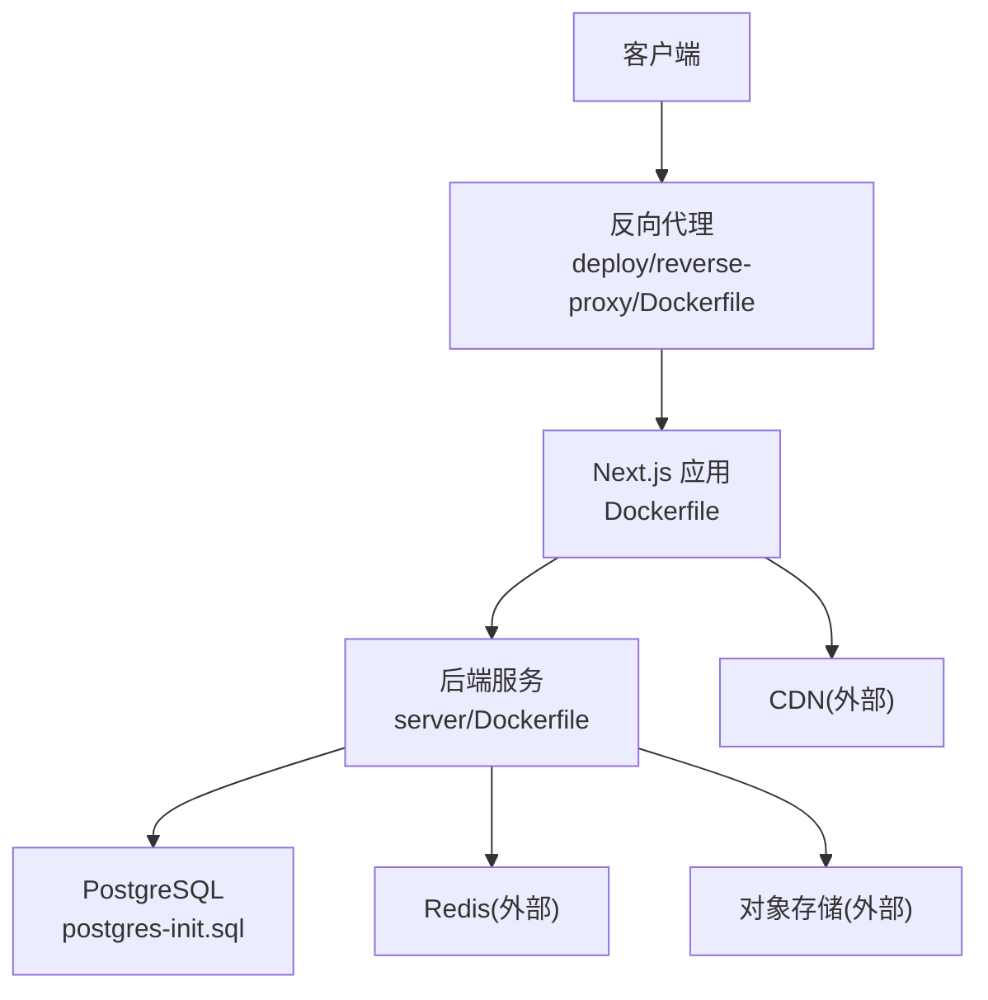
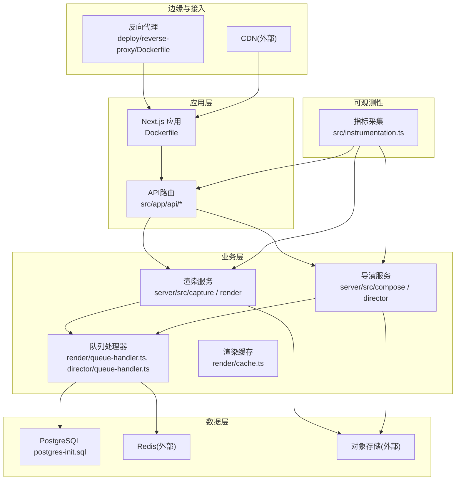
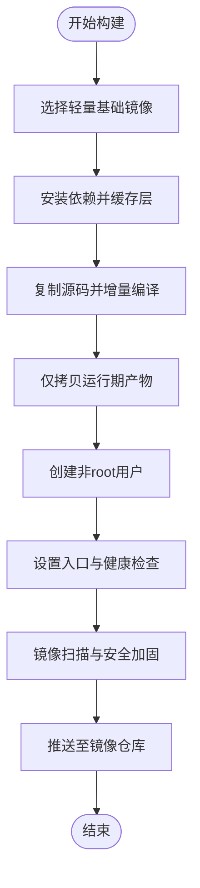
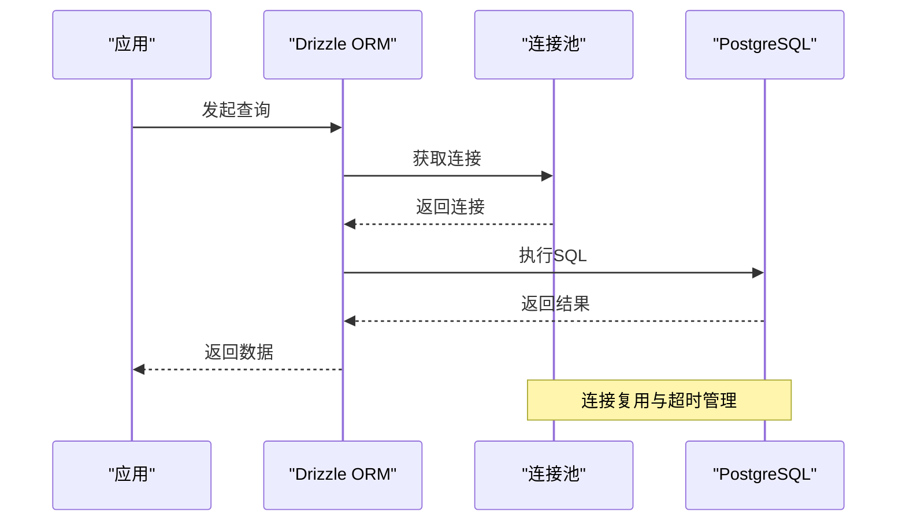
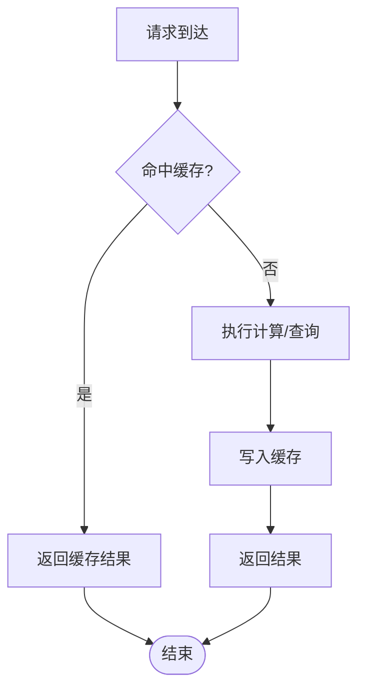
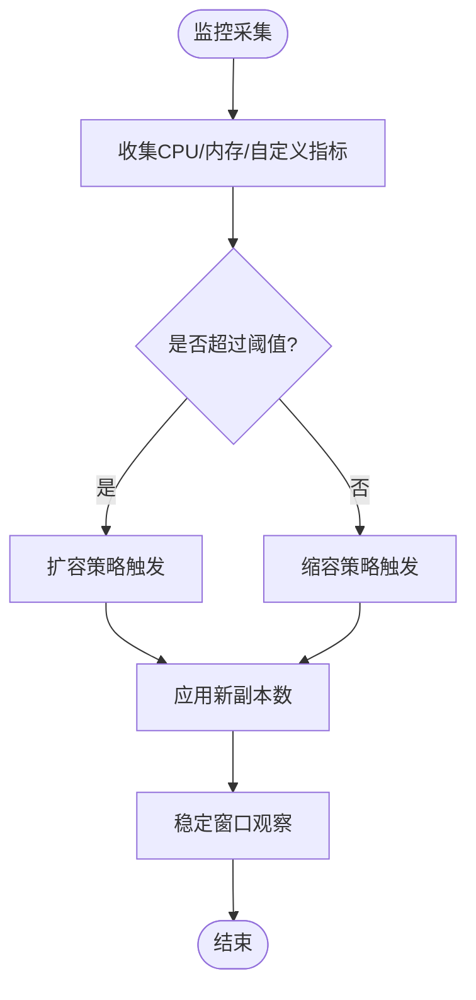
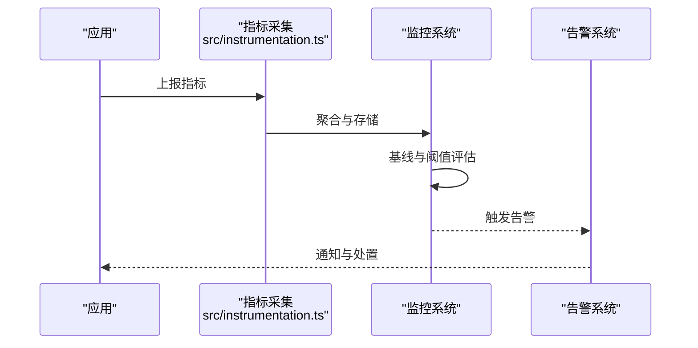
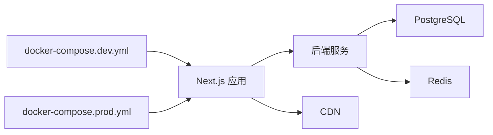

# 云资源优化

<cite>
**本文引用的文件**   
- [Dockerfile](file://Dockerfile)
- [docker-compose.dev.yml](file://docker-compose.dev.yml)
- [docker-compose.prod.yml](file://docker-compose.prod.yml)
- [server/Dockerfile](file://server/Dockerfile)
- [deploy/reverse-proxy/Dockerfile](file://deploy/reverse-proxy/Dockerfile)
- [next.config.ts](file://next.config.ts)
- [drizzle.config.ts](file://drizzle.config.ts)
- [scripts/setup/postgres-init.sql](file://scripts/setup/postgres-init.sql)
- [src/lib/db/index.ts](file://src/lib/db/index.ts)
- [src/features/render/cache.ts](file://src/features/render/cache.ts)
- [src/features/render/queue-handler.ts](file://src/features/render/queue-handler.ts)
- [src/features/director/queue-handler.ts](file://src/features/director/queue-handler.ts)
- [src/instrumentation.ts](file://src/instrumentation.ts)
</cite>

## 目录
1. [简介](#简介)
2. [项目结构](#项目结构)
3. [核心组件](#核心组件)
4. [架构总览](#架构总览)
5. [详细组件分析](#详细组件分析)
6. [依赖关系分析](#依赖关系分析)
7. [性能考量](#性能考量)
8. [故障排查指南](#故障排查指南)
9. [结论](#结论)
10. [附录](#附录)

## 简介
本指南面向PurpleInk平台的云资源优化与成本控制，围绕容器镜像优化、数据库性能调优、缓存策略设计、自动扩缩容配置以及监控告警最佳实践，提供可落地的方案与落地路径。内容基于仓库中的构建与部署配置、服务端与渲染管线、数据库初始化脚本、缓存与队列实现、以及指标采集入口进行系统化梳理，帮助读者在保障稳定性的前提下降低资源占用与成本。

## 项目结构
从容器化与部署视角看，项目包含前端Next.js应用、Node后端服务、反向代理、数据库初始化脚本以及多套编排文件。关键文件包括：
- 根级Dockerfile用于生产镜像构建
- server/Dockerfile用于后端服务镜像构建
- deploy/reverse-proxy/Dockerfile用于反向代理镜像
- docker-compose.dev.yml与docker-compose.prod.yml分别用于开发与生产编排
- next.config.ts用于前端构建与运行时优化
- drizzle.config.ts用于数据库迁移与ORM配置
- scripts/setup/postgres-init.sql用于PostgreSQL初始化
- src/instrumentation.ts用于OpenTelemetry等指标采集入口

图表来源 
- [deploy/reverse-proxy/Dockerfile](file://deploy/reverse-proxy/Dockerfile)
- [Dockerfile](file://Dockerfile)
- [server/Dockerfile](file://server/Dockerfile)
- [scripts/setup/postgres-init.sql](file://scripts/setup/postgres-init.sql)

章节来源
- [Dockerfile](file://Dockerfile)
- [server/Dockerfile](file://server/Dockerfile)
- [deploy/reverse-proxy/Dockerfile](file://deploy/reverse-proxy/Dockerfile)
- [docker-compose.dev.yml](file://docker-compose.dev.yml)
- [docker-compose.prod.yml](file://docker-compose.prod.yml)
- [next.config.ts](file://next.config.ts)
- [drizzle.config.ts](file://drizzle.config.ts)
- [scripts/setup/postgres-init.sql](file://scripts/setup/postgres-init.sql)

## 核心组件
- 容器镜像层：根级Dockerfile、server/Dockerfile、反向代理Dockerfile共同构成镜像分层与构建流水线。
- 数据库层：PostgreSQL通过初始化脚本建立基础结构与权限，配合Drizzle ORM进行迁移与查询。
- 缓存与队列：渲染与导演模块的队列处理器负责任务调度与并发控制；渲染缓存模块提供结果缓存能力。
- 指标与可观测性：instrumentation.ts集中接入指标采集，为监控与告警提供数据源。

章节来源
- [Dockerfile](file://Dockerfile)
- [server/Dockerfile](file://server/Dockerfile)
- [deploy/reverse-proxy/Dockerfile](file://deploy/reverse-proxy/Dockerfile)
- [drizzle.config.ts](file://drizzle.config.ts)
- [scripts/setup/postgres-init.sql](file://scripts/setup/postgres-init.sql)
- [src/features/render/cache.ts](file://src/features/render/cache.ts)
- [src/features/render/queue-handler.ts](file://src/features/render/queue-handler.ts)
- [src/features/director/queue-handler.ts](file://src/features/director/queue-handler.ts)
- [src/instrumentation.ts](file://src/instrumentation.ts)

## 架构总览
整体架构采用“反向代理 + Next.js 应用 + Node 后端 + PostgreSQL”的分层模式，结合外部缓存（Redis）与对象存储，满足高并发渲染与媒体处理需求。

图表来源 
- [deploy/reverse-proxy/Dockerfile](file://deploy/reverse-proxy/Dockerfile)
- [Dockerfile](file://Dockerfile)
- [server/Dockerfile](file://server/Dockerfile)
- [scripts/setup/postgres-init.sql](file://scripts/setup/postgres-init.sql)
- [src/features/render/cache.ts](file://src/features/render/cache.ts)
- [src/features/render/queue-handler.ts](file://src/features/render/queue-handler.ts)
- [src/features/director/queue-handler.ts](file://src/features/director/queue-handler.ts)
- [src/instrumentation.ts](file://src/instrumentation.ts)

## 详细组件分析

### 容器镜像优化
- 多阶段构建：将依赖安装、编译与运行环境分离，减少最终镜像体积。
- 镜像分层：按“基础镜像 → 依赖层 → 源码层 → 产物层”组织，提升缓存命中率。
- 依赖精简：仅引入运行期必要包，剔除开发依赖与未使用代码。
- 安全加固：最小权限用户、只读文件系统、非root运行。

章节来源
- [Dockerfile](file://Dockerfile)
- [server/Dockerfile](file://server/Dockerfile)
- [deploy/reverse-proxy/Dockerfile](file://deploy/reverse-proxy/Dockerfile)

### 数据库性能调优
- 索引优化：针对高频查询字段建立合适索引，避免全表扫描。
- 查询优化：使用分页、投影、预编译语句，减少不必要的数据传输。
- 连接池配置：根据实例规格与并发模型调整最大连接数与超时时间。
- 初始化脚本：通过postgres-init.sql统一建库、建角色与权限，确保一致性。

章节来源
- [drizzle.config.ts](file://drizzle.config.ts)
- [scripts/setup/postgres-init.sql](file://scripts/setup/postgres-init.sql)

### 缓存策略设计
- Redis缓存：对热点数据与计算密集型结果进行缓存，缩短响应时延。
- CDN加速：静态资源与媒体输出通过CDN分发，降低源站压力。
- 浏览器缓存：合理设置Cache-Control与ETag，提升首屏加载速度。

章节来源
- [src/features/render/cache.ts](file://src/features/render/cache.ts)

### 自动扩缩容配置
- 基于CPU/内存：根据资源利用率动态伸缩Pod数量。
- 自定义指标：结合队列长度、渲染耗时等自定义指标进行弹性伸缩。
- 目标状态：设定期望副本数与扩缩容阈值，避免抖动。

章节来源
- [docker-compose.prod.yml](file://docker-compose.prod.yml)

### 监控与告警最佳实践
- 关键指标：QPS、延迟分布、错误率、资源利用率、队列长度、缓存命中率。
- 异常检测：基于基线与滑动窗口检测异常波动。
- 性能基线：建立不同负载下的基准曲线，指导容量规划。

章节来源
- [src/instrumentation.ts](file://src/instrumentation.ts)

## 依赖关系分析
- 构建依赖：Dockerfile与server/Dockerfile定义镜像构建顺序与依赖层。
- 运行依赖：Next.js应用依赖后端API与数据库、缓存、对象存储。
- 编排依赖：docker-compose.*统一管理服务间网络、卷与变量。

图表来源 
- [docker-compose.dev.yml](file://docker-compose.dev.yml)
- [docker-compose.prod.yml](file://docker-compose.prod.yml)
- [Dockerfile](file://Dockerfile)
- [server/Dockerfile](file://server/Dockerfile)

章节来源
- [docker-compose.dev.yml](file://docker-compose.dev.yml)
- [docker-compose.prod.yml](file://docker-compose.prod.yml)
- [Dockerfile](file://Dockerfile)
- [server/Dockerfile](file://server/Dockerfile)

## 性能考量
- 镜像体积与启动时间：通过多阶段构建与依赖分层降低镜像大小，提高冷启动速度。
- 数据库连接与查询：合理设置连接池上限与超时，避免连接耗尽；使用索引与分页减少IO。
- 缓存命中率：热点数据优先缓存，结合CDN与浏览器缓存降低回源压力。
- 扩缩容策略：基于真实负载指标设定阈值，避免频繁扩缩容带来的抖动。
- 可观测性：完善指标采集与日志规范，便于定位瓶颈与异常。

## 故障排查指南
- 镜像问题：检查构建日志与镜像扫描报告，确认依赖完整性与漏洞修复。
- 数据库问题：查看慢查询日志与连接池状态，确认索引与锁竞争情况。
- 缓存问题：验证缓存键设计与过期策略，检查Redis连通性与内存水位。
- 扩缩容问题：核对指标采集与阈值配置，观察扩缩容事件与稳定性。
- 指标采集：确认instrumentation.ts配置与上报链路正常。

章节来源
- [src/instrumentation.ts](file://src/instrumentation.ts)
- [drizzle.config.ts](file://drizzle.config.ts)
- [scripts/setup/postgres-init.sql](file://scripts/setup/postgres-init.sql)
- [src/features/render/cache.ts](file://src/features/render/cache.ts)

## 结论
通过系统化的镜像优化、数据库调优、缓存策略、弹性伸缩与可观测性建设，PurpleInk平台能够在保证性能与稳定性的同时显著降低云资源成本。建议持续迭代指标体系与自动化策略，形成闭环优化机制。

## 附录
- 参考文件清单见“本文引用的文件”。
- 如需进一步细化某一部分（如具体指标口径或扩缩容阈值），可在对应模块内补充配置与测试用例。