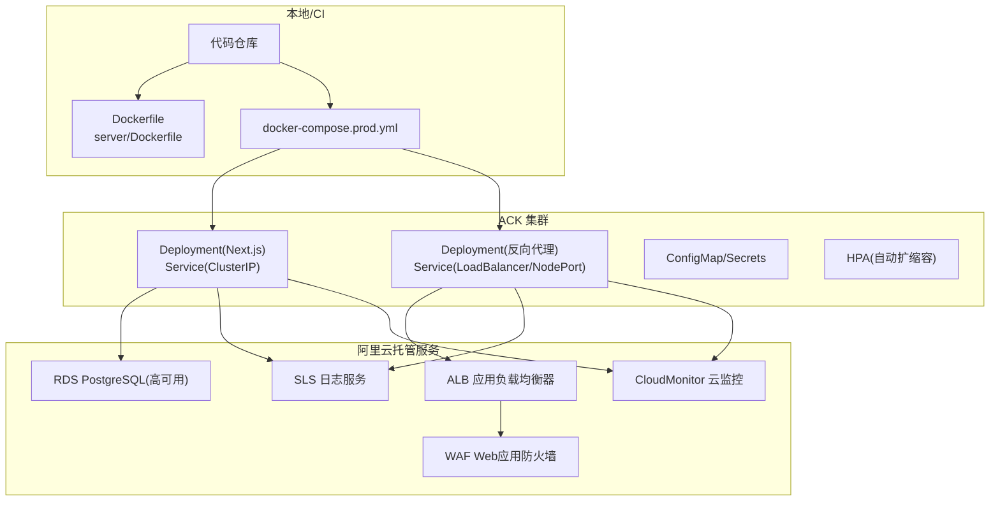
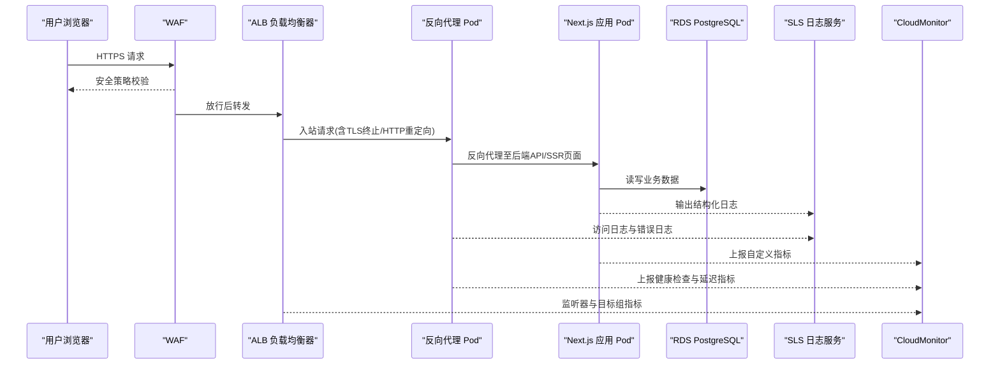
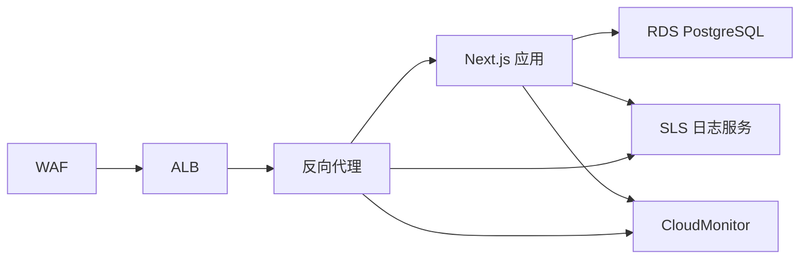

# 阿里云部署方案

<cite>
**本文档引用的文件**   
- [docker-compose.prod.yml](file://docker-compose.prod.yml)
- [Dockerfile](file://Dockerfile)
- [server/Dockerfile](file://server/Dockerfile)
- [deploy/reverse-proxy/Dockerfile](file://deploy/reverse-proxy/Dockerfile)
- [deploy/reverse-proxy/entrypoint.sh](file://deploy/reverse-proxy/entrypoint.sh)
- [scripts/setup/db-migrate.ts](file://scripts/setup/db-migrate.ts)
- [scripts/migration/import-postgres.ts](file://scripts/migration/import-postgres.ts)
- [scripts/migration/provision-master-key.ts](file://scripts/migration/provision-master-key.ts)
- [scripts/setup/postgres-init.sql](file://scripts/setup/postgres-init.sql)
- [config/tts.env.example](file://config/tts.env.example)
- [docs/deployment/runbook.md](file://docs/deployment/runbook.md)
- [docs/configuration/credentials.md](file://docs/configuration/credentials.md)
- [next.config.ts](file://next.config.ts)
- [package.json](file://package.json)
</cite>

## 目录
1. [简介](#简介)
2. [项目结构](#项目结构)
3. [核心组件](#核心组件)
4. [架构总览](#架构总览)
5. [详细组件分析](#详细组件分析)
6. [依赖关系分析](#依赖关系分析)
7. [性能与成本优化](#性能与成本优化)
8. [故障排查指南](#故障排查指南)
9. [结论](#结论)
10. [附录](#附录)

## 简介
本指南面向在阿里云上部署 PurpleInk 平台的工程团队，覆盖 ACK（容器服务 Kubernetes 版）集群、RDS PostgreSQL、ALB 应用负载均衡器与 WAF、云监控 CloudMonitor、日志服务 SLS 以及弹性伸缩策略等关键要素。文档基于仓库中的容器化配置、迁移脚本与运行手册，提供从基础设施到应用上线的完整步骤与最佳实践。

## 项目结构
PurpleInk 采用前后端一体化 Next.js 应用，配合独立的反向代理容器与数据库迁移工具。生产环境通过 docker-compose 编排镜像构建与启动流程；Kubernetes 部署时，将应用与服务拆分为 Deployment、Service、Ingress/HPA 等资源对象。

图表来源
- [docker-compose.prod.yml](file://docker-compose.prod.yml)
- [Dockerfile](file://Dockerfile)
- [server/Dockerfile](file://server/Dockerfile)
- [deploy/reverse-proxy/Dockerfile](file://deploy/reverse-proxy/Dockerfile)

章节来源
- [docker-compose.prod.yml](file://docker-compose.prod.yml)
- [Dockerfile](file://Dockerfile)
- [server/Dockerfile](file://server/Dockerfile)
- [deploy/reverse-proxy/Dockerfile](file://deploy/reverse-proxy/Dockerfile)

## 核心组件
- 应用容器：Next.js 服务端渲染与 API，由 server/Dockerfile 定义构建与运行。
- 反向代理：Nginx/反向代理容器，用于 TLS 终止、静态资源缓存与请求转发。
- 数据库：RDS PostgreSQL 高可用实例，承载业务数据与状态。
- 负载均衡与安全：ALB + WAF，提供公网入口、健康检查与防护能力。
- 可观测性：SLS 采集应用与系统日志，CloudMonitor 采集指标并设置报警。
- 自动化：Helm/Kustomize 或 Terraform/ROS 管理资源，CI/CD 流水线完成镜像构建与发布。

章节来源
- [server/Dockerfile](file://server/Dockerfile)
- [deploy/reverse-proxy/Dockerfile](file://deploy/reverse-proxy/Dockerfile)
- [docs/deployment/runbook.md](file://docs/deployment/runbook.md)

## 架构总览
下图展示 PurpleInk 在阿里云上的端到端流量路径与关键组件交互。

图表来源
- [docker-compose.prod.yml](file://docker-compose.prod.yml)
- [deploy/reverse-proxy/entrypoint.sh](file://deploy/reverse-proxy/entrypoint.sh)
- [scripts/setup/db-migrate.ts](file://scripts/setup/db-migrate.ts)

## 详细组件分析

### ACK 集群与节点池管理
- 集群规划：建议按环境划分命名空间（如 prod、staging），使用独立 VPC 与子网隔离。
- 节点池：
  - 通用计算节点池：运行 Next.js 应用与反向代理，推荐 x86 高性能机型。
  - 抢占式节点池：用于无状态批处理任务（如导出、转码），结合 HPA 与弹性伸缩。
- 网络：启用 Terway 或 Flannel 插件，按需开启 IPv6 与多网卡；为 Ingress/ALB 分配独立子网。
- 存储：使用云盘或 NAS 作为持久卷（如需），但建议将大对象放入 OSS，数据库使用 RDS。
- 安全：启用 RAM 最小权限、Pod 安全策略、网络策略限制跨命名空间访问。

章节来源
- [docker-compose.prod.yml](file://docker-compose.prod.yml)
- [docs/deployment/runbook.md](file://docs/deployment/runbook.md)

### 负载均衡器 SLB/ALB 与证书管理
- ALB 配置：
  - 监听器：HTTPS 443 端口，启用 HTTP/2 与 Keep-Alive。
  - 转发规则：按域名与路径路由至 Next.js 服务与反向代理。
  - 健康检查：对 /ping 或应用健康端点进行检查，失败阈值与间隔合理设置。
- 证书管理：
  - 使用 ACM 或 ALB 内置证书管理，定期轮换；支持通配符证书。
  - 反向代理容器内不持有私钥，仅做透明转发。
- 回源策略：优先回源至反向代理，再由其转发至 Next.js 服务，便于统一缓存与限流。

章节来源
- [deploy/reverse-proxy/Dockerfile](file://deploy/reverse-proxy/Dockerfile)
- [deploy/reverse-proxy/entrypoint.sh](file://deploy/reverse-proxy/entrypoint.sh)
- [docker-compose.prod.yml](file://docker-compose.prod.yml)

### 反向代理容器与入口安全
- 功能：TLS 终止、Gzip/Brotli 压缩、静态资源缓存、请求头标准化、基础认证（可选）。
- 配置要点：
  - 环境变量注入域名、上游服务地址、超时与重试策略。
  - 健康检查端点与告警集成。
  - 基础认证凭据通过 Secret 管理，避免硬编码。

章节来源
- [deploy/reverse-proxy/Dockerfile](file://deploy/reverse-proxy/Dockerfile)
- [deploy/reverse-proxy/entrypoint.sh](file://deploy/reverse-proxy/entrypoint.sh)
- [deploy/reverse-proxy/secrets/basic_auth_credentials.example](file://deploy/reverse-proxy/secrets/basic_auth_credentials.example)

### RDS PostgreSQL 高可用与备份恢复
- 高可用：主备实例跨可用区部署，自动故障切换；连接字符串使用只读/写分离。
- 备份策略：开启每日全量与增量备份，保留周期按合规要求设置；跨地域复制。
- 初始化与迁移：
  - 使用 scripts/setup/postgres-init.sql 初始化库表结构与初始数据。
  - 使用 scripts/setup/db-migrate.ts 执行数据库迁移。
  - 使用 scripts/migration/import-postgres.ts 导入历史数据。
  - 使用 scripts/migration/provision-master-key.ts 生成并注入主密钥。
- 慢查询优化：
  - 开启慢查询日志，设定阈值；定期分析 Top SQL。
  - 为高频查询添加索引，避免全表扫描。
  - 调整连接池大小与内存参数，避免锁竞争。

章节来源
- [scripts/setup/postgres-init.sql](file://scripts/setup/postgres-init.sql)
- [scripts/setup/db-migrate.ts](file://scripts/setup/db-migrate.ts)
- [scripts/migration/import-postgres.ts](file://scripts/migration/import-postgres.ts)
- [scripts/migration/provision-master-key.ts](file://scripts/migration/provision-master-key.ts)

### ALB 与 WAF 集成
- ALB：
  - 监听器与转发规则按域名与路径拆分，支持灰度发布与蓝绿部署。
  - 目标组健康检查指向反向代理与 Next.js 健康端点。
- WAF：
  - 启用常见攻击防护（SQL注入、XSS、CC 攻击）。
  - 自定义规则：限制敏感路径访问频率、白名单 IP、UA 过滤。
  - 联动告警：异常流量触发 CloudMonitor 报警。

章节来源
- [docker-compose.prod.yml](file://docker-compose.prod.yml)
- [docs/deployment/runbook.md](file://docs/deployment/runbook.md)

### 云监控 CloudMonitor 与日志服务 SLS
- CloudMonitor：
  - 采集 ALB 监听器、目标组、ECS/Pod 指标。
  - 设置 CPU、内存、磁盘、网络、延迟、错误率等阈值报警。
  - 自定义指标：应用层 QPS、耗时、队列长度等。
- SLS：
  - 采集应用日志（JSON 结构化）、访问日志、错误堆栈。
  - 建立索引与仪表盘，设置告警规则与自动处置。
  - 日志轮转与归档策略，降低存储成本。

章节来源
- [docs/deployment/runbook.md](file://docs/deployment/runbook.md)

### 应用容器化与构建
- Next.js 应用镜像：
  - 使用 server/Dockerfile 构建 Node.js 运行时镜像，安装依赖并编译产物。
  - 环境变量注入数据库连接、外部服务密钥、TTS 配置等。
- 反向代理镜像：
  - 使用 deploy/reverse-proxy/Dockerfile 构建 Nginx 镜像，挂载配置与证书。
- 构建优化：
  - 分层缓存依赖，减少构建时间。
  - 多阶段构建，减小最终镜像体积。

章节来源
- [server/Dockerfile](file://server/Dockerfile)
- [deploy/reverse-proxy/Dockerfile](file://deploy/reverse-proxy/Dockerfile)
- [next.config.ts](file://next.config.ts)
- [package.json](file://package.json)

### 配置与环境变量
- TTS 配置：参考 config/tts.env.example 示例，注入第三方服务凭据与模型参数。
- 数据库连接：使用 Secret 管理连接串、用户名与密码，避免明文。
- 应用配置：通过 ConfigMap 管理非敏感配置，Secret 管理敏感信息。

章节来源
- [config/tts.env.example](file://config/tts.env.example)
- [docs/configuration/credentials.md](file://docs/configuration/credentials.md)

## 依赖关系分析
应用与服务的依赖关系如下：

图表来源
- [docker-compose.prod.yml](file://docker-compose.prod.yml)
- [server/Dockerfile](file://server/Dockerfile)
- [deploy/reverse-proxy/Dockerfile](file://deploy/reverse-proxy/Dockerfile)

章节来源
- [docker-compose.prod.yml](file://docker-compose.prod.yml)
- [server/Dockerfile](file://server/Dockerfile)
- [deploy/reverse-proxy/Dockerfile](file://deploy/reverse-proxy/Dockerfile)

## 性能与成本优化
- 抢占式实例：
  - 用于无状态批处理任务（导出、转码），结合 HPA 与弹性伸缩策略。
  - 设置优雅退出与任务断点续传，避免中断损失。
- 资源包购买：
  - 预购带宽包与实例规格包，降低峰值成本。
  - 数据库选择预留实例或节省计划。
- 弹性伸缩策略：
  - 基于 CPU、内存、QPS 与队列长度进行水平扩缩容。
  - 设置最小副本数与最大副本数，避免冷启动抖动。
- 缓存与CDN：
  - 静态资源与图片上传至 OSS，并通过 CDN 加速。
  - 应用层缓存热点数据，减少数据库压力。
- 日志与监控：
  - 日志采样与分级，降低 SLS 存储成本。
  - 监控指标精简，避免过度采集。

章节来源
- [docs/deployment/runbook.md](file://docs/deployment/runbook.md)

## 故障排查指南
- 应用不可用：
  - 检查 Pod 状态与事件，查看健康检查端点是否返回正常。
  - 查看应用日志与错误堆栈，定位异常原因。
- 数据库连接失败：
  - 检查连接串、用户名与密码是否正确。
  - 查看 RDS 实例状态与白名单配置。
- 反向代理超时：
  - 调整上游服务超时与重试策略。
  - 检查 Next.js 应用响应时间与负载情况。
- 监控与告警：
  - 确认 CloudMonitor 与 SLS 接入正常。
  - 设置合理的阈值与告警通知渠道。

章节来源
- [docs/deployment/runbook.md](file://docs/deployment/runbook.md)

## 结论
通过在 ACK 上部署 PurpleInk，并结合 RDS、ALB、WAF、SLS 与 CloudMonitor，可实现高可用、可扩展且安全的云平台。遵循本指南的配置与优化建议，可有效提升系统稳定性与成本效益。

## 附录
- 快速启动：参考 docker-compose.prod.yml 进行本地验证。
- 迁移脚本：使用 scripts 目录下的工具完成数据库初始化与数据导入。
- 运行手册：详见 docs/deployment/runbook.md，包含运维操作与应急流程。

章节来源
- [docker-compose.prod.yml](file://docker-compose.prod.yml)
- [scripts/setup/db-migrate.ts](file://scripts/setup/db-migrate.ts)
- [scripts/migration/import-postgres.ts](file://scripts/migration/import-postgres.ts)
- [docs/deployment/runbook.md](file://docs/deployment/runbook.md)