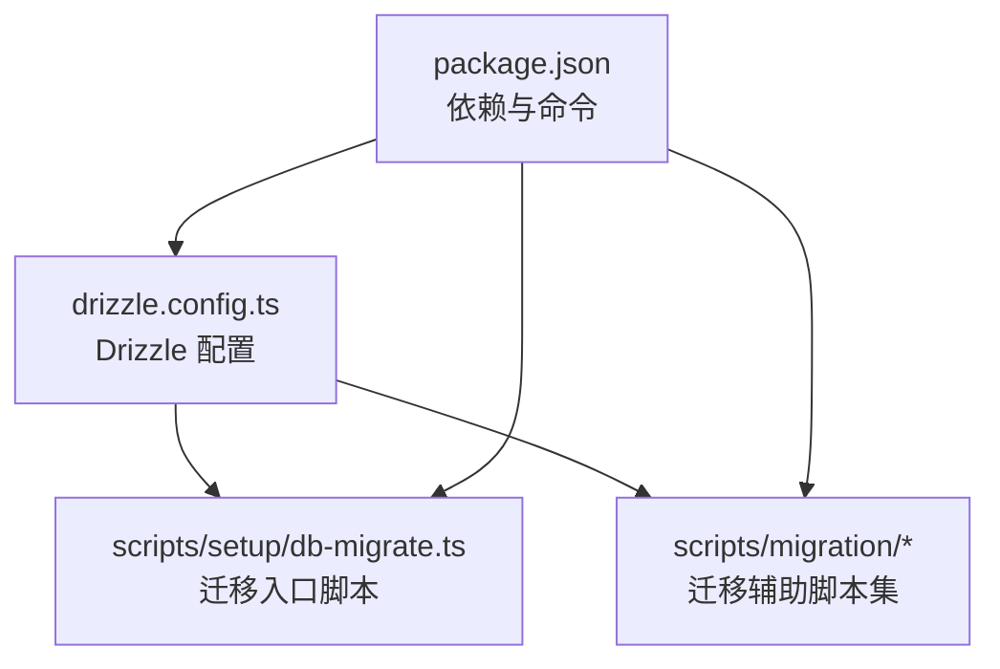
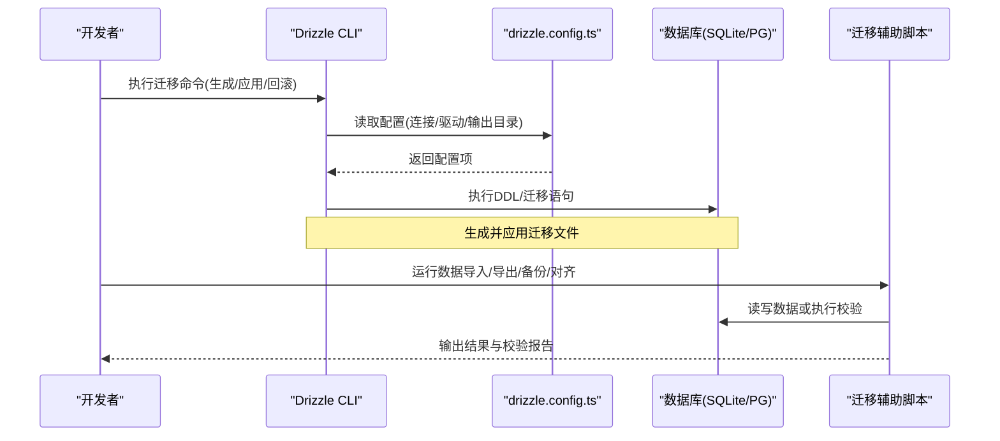
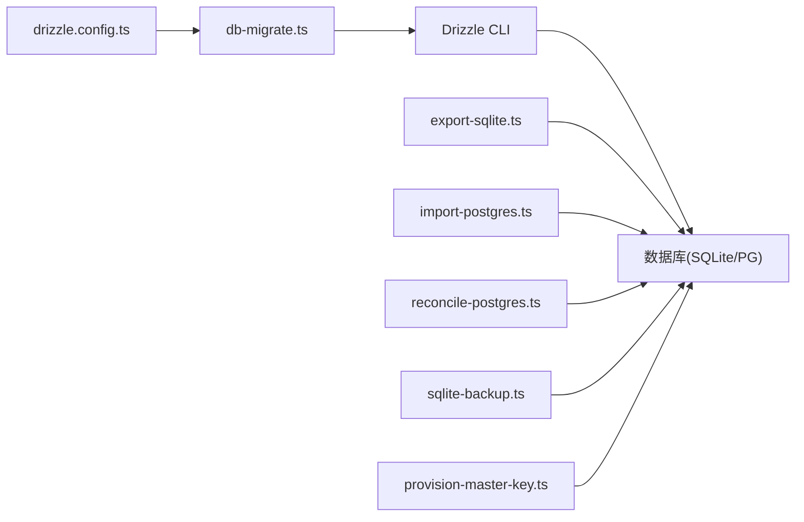

# Drizzle ORM迁移管理

<cite>
**本文引用的文件**   
- [drizzle.config.ts](file://drizzle.config.ts)
- [package.json](file://package.json)
- [scripts/setup/db-migrate.ts](file://scripts/setup/db-migrate.ts)
- [scripts/migration/export-sqlite.ts](file://scripts/migration/export-sqlite.ts)
- [scripts/migration/import-postgres.ts](file://scripts/migration/import-postgres.ts)
- [scripts/migration/reconcile-postgres.ts](file://scripts/migration/reconcile-postgres.ts)
- [scripts/migration/sqlite-backup.ts](file://scripts/migration/sqlite-backup.ts)
- [scripts/migration/provision-master-key.ts](file://scripts/migration/provision-master-key.ts)
</cite>

## 目录
1. [简介](#简介)
2. [项目结构](#项目结构)
3. [核心组件](#核心组件)
4. [架构总览](#架构总览)
5. [详细组件分析](#详细组件分析)
6. [依赖关系分析](#依赖关系分析)
7. [性能考虑](#性能考虑)
8. [故障排查指南](#故障排查指南)
9. [结论](#结论)
10. [附录](#附录)

## 简介
本指南面向使用 Drizzle ORM 的数据库迁移与版本管理，覆盖以下主题：
- 初始数据库结构的定义（表、索引、约束）
- 增量迁移流程（生成、执行、回滚）
- 迁移版本管理与冲突解决策略
- 迁移脚本编写规范（命名、注释、错误处理）
- 迁移过程中的数据验证与完整性检查

本项目通过 Drizzle 配置与脚本工具链完成数据库初始化、迁移与数据一致性校验，适用于 SQLite 与 PostgreSQL 两种目标数据库。

## 项目结构
与迁移相关的核心位置：
- 根级配置文件：用于指定数据库连接、驱动、迁移输出目录等
- 脚本目录 scripts/：包含迁移辅助脚本（导出/导入、备份、主密钥准备、PostgreSQL 对齐等）
- 包管理配置：声明 Drizzle CLI 及常用依赖

图表来源
- [drizzle.config.ts](file://drizzle.config.ts)
- [scripts/setup/db-migrate.ts](file://scripts/setup/db-migrate.ts)
- [package.json](file://package.json)

章节来源
- [drizzle.config.ts](file://drizzle.config.ts)
- [package.json](file://package.json)

## 核心组件
- Drizzle 配置中心：集中管理数据库连接、驱动类型、迁移输出路径、SQL 生成选项等
- 迁移入口脚本：封装 drizzle-kit 命令，统一执行生成、应用、回滚等操作
- 迁移辅助脚本：提供 SQLite/PostgreSQL 的数据导出/导入、备份、差异对齐、主密钥初始化等能力

章节来源
- [drizzle.config.ts](file://drizzle.config.ts)
- [scripts/setup/db-migrate.ts](file://scripts/setup/db-migrate.ts)
- [scripts/migration/export-sqlite.ts](file://scripts/migration/export-sqlite.ts)
- [scripts/migration/import-postgres.ts](file://scripts/migration/import-postgres.ts)
- [scripts/migration/reconcile-postgres.ts](file://scripts/migration/reconcile-postgres.ts)
- [scripts/migration/sqlite-backup.ts](file://scripts/migration/sqlite-backup.ts)
- [scripts/migration/provision-master-key.ts](file://scripts/migration/provision-master-key.ts)

## 架构总览
下图展示了从配置到迁移执行的端到端流程，以及辅助脚本在数据一致性与环境准备中的作用。

图表来源
- [drizzle.config.ts](file://drizzle.config.ts)
- [scripts/setup/db-migrate.ts](file://scripts/setup/db-migrate.ts)
- [scripts/migration/export-sqlite.ts](file://scripts/migration/export-sqlite.ts)
- [scripts/migration/import-postgres.ts](file://scripts/migration/import-postgres.ts)
- [scripts/migration/reconcile-postgres.ts](file://scripts/migration/reconcile-postgres.ts)
- [scripts/migration/sqlite-backup.ts](file://scripts/migration/sqlite-backup.ts)
- [scripts/migration/provision-master-key.ts](file://scripts/migration/provision-master-key.ts)

## 详细组件分析

### Drizzle 配置（drizzle.config.ts）
- 职责
  - 定义数据库连接信息（驱动、URL、参数）
  - 指定迁移输出目录与 SQL 生成选项
  - 为不同环境（开发/测试/生产）提供可切换的配置
- 关键点
  - 驱动选择影响迁移行为与兼容性
  - 输出目录需纳入版本控制以便协作
  - 连接参数应通过环境变量注入，避免硬编码敏感信息

章节来源
- [drizzle.config.ts](file://drizzle.config.ts)

### 迁移入口脚本（scripts/setup/db-migrate.ts）
- 职责
  - 封装 drizzle-kit 命令，统一执行“生成迁移”、“应用迁移”、“回滚迁移”
  - 根据传入参数决定操作模式与环境变量加载
- 关键点
  - 建议将常用操作封装为 npm/pnpm 脚本，便于团队复用
  - 在执行前进行必要的环境校验（如数据库连通性）

章节来源
- [scripts/setup/db-migrate.ts](file://scripts/setup/db-migrate.ts)

### 迁移辅助脚本集（scripts/migration/*）
- export-sqlite.ts
  - 用途：从 SQLite 导出数据（例如转储 SQL 或结构化数据），便于备份或跨库迁移
  - 关注点：事务边界、大表分页导出、字符集与时间格式一致性
- import-postgres.ts
  - 用途：将导出的数据导入 PostgreSQL，支持批量插入与错误重试
  - 关注点：字段映射、约束冲突处理、幂等性设计
- reconcile-postgres.ts
  - 用途：对比源与目标 PG 的结构/数据差异，生成修复脚本或执行自动对齐
  - 关注点：差异检测算法、回滚策略、并发安全
- sqlite-backup.ts
  - 用途：对 SQLite 文件进行快照备份，支持压缩与归档
  - 关注点：锁机制、在线备份策略、备份完整性校验
- provision-master-key.ts
  - 用途：初始化或轮换主密钥，确保敏感数据加密存储的一致性
  - 关注点：密钥轮转、向后兼容、权限控制

章节来源
- [scripts/migration/export-sqlite.ts](file://scripts/migration/export-sqlite.ts)
- [scripts/migration/import-postgres.ts](file://scripts/migration/import-postgres.ts)
- [scripts/migration/reconcile-postgres.ts](file://scripts/migration/reconcile-postgres.ts)
- [scripts/migration/sqlite-backup.ts](file://scripts/migration/sqlite-backup.ts)
- [scripts/migration/provision-master-key.ts](file://scripts/migration/provision-master-key.ts)

### 包管理与命令（package.json）
- 职责
  - 声明 Drizzle CLI 及相关依赖
  - 暴露便捷命令以触发迁移与辅助脚本
- 关键点
  - 命令别名应清晰表达意图（如 migrate:generate、migrate:apply、migrate:rollback）
  - 建议在 CI 中固定依赖版本以保证可重现性

章节来源
- [package.json](file://package.json)

## 依赖关系分析
- 配置与脚本耦合度低：drizzle.config.ts 仅负责配置，迁移入口脚本通过 CLI 调用，降低变更风险
- 辅助脚本相互独立：每个脚本聚焦单一职责，便于单独测试与维护
- 外部依赖：数据库驱动、Drizzle CLI、Node 运行时；应避免在生产环境引入不必要的开发依赖

图表来源
- [drizzle.config.ts](file://drizzle.config.ts)
- [scripts/setup/db-migrate.ts](file://scripts/setup/db-migrate.ts)
- [scripts/migration/export-sqlite.ts](file://scripts/migration/export-sqlite.ts)
- [scripts/migration/import-postgres.ts](file://scripts/migration/import-postgres.ts)
- [scripts/migration/reconcile-postgres.ts](file://scripts/migration/reconcile-postgres.ts)
- [scripts/migration/sqlite-backup.ts](file://scripts/migration/sqlite-backup.ts)
- [scripts/migration/provision-master-key.ts](file://scripts/migration/provision-master-key.ts)

章节来源
- [drizzle.config.ts](file://drizzle.config.ts)
- [scripts/setup/db-migrate.ts](file://scripts/setup/db-migrate.ts)
- [scripts/migration/export-sqlite.ts](file://scripts/migration/export-sqlite.ts)
- [scripts/migration/import-postgres.ts](file://scripts/migration/import-postgres.ts)
- [scripts/migration/reconcile-postgres.ts](file://scripts/migration/reconcile-postgres.ts)
- [scripts/migration/sqlite-backup.ts](file://scripts/migration/sqlite-backup.ts)
- [scripts/migration/provision-master-key.ts](file://scripts/migration/provision-master-key.ts)

## 性能考虑
- 迁移批量化：对大表变更采用分批提交，减少锁持有时间
- 索引重建策略：先删除旧索引，再创建新索引，必要时分阶段执行
- 并行与串行：非依赖的迁移步骤可并行执行，但涉及同一表的变更必须串行
- 资源限制：设置合理的超时与内存上限，防止长时间运行的迁移阻塞服务

[本节为通用指导，不直接分析具体文件]

## 故障排查指南
- 常见错误
  - 连接失败：检查数据库 URL、端口、认证信息与网络策略
  - 迁移冲突：确认本地与远程迁移顺序一致，必要时手动合并
  - 数据不一致：使用 reconcile 脚本比对结构与数据，定位差异并修复
- 诊断步骤
  - 查看迁移日志与错误堆栈
  - 回滚到上一个稳定版本，逐步定位问题
  - 使用备份恢复至最近可用状态
- 预防措施
  - 在预发环境先行演练迁移
  - 对关键表增加校验脚本（行数、哈希、外键完整性）

章节来源
- [scripts/migration/reconcile-postgres.ts](file://scripts/migration/reconcile-postgres.ts)
- [scripts/migration/sqlite-backup.ts](file://scripts/migration/sqlite-backup.ts)

## 结论
通过统一的 Drizzle 配置与脚本化迁移流程，本项目实现了可重复、可审计、可回滚的数据库版本管理。配合数据导出/导入、备份与差异对齐脚本，能够在多环境下保证数据结构与数据内容的一致性与完整性。建议团队遵循本文的规范与最佳实践，持续完善迁移质量与可靠性。

[本节为总结性内容，不直接分析具体文件]

## 附录

### 初始数据库结构定义（表、索引、约束）
- 表结构设计
  - 明确主键、唯一键、外键与默认值
  - 合理划分字段类型与时区策略
- 索引策略
  - 查询热点列建立索引，避免过度索引
  - 复合索引按查询条件顺序设计
- 约束与校验
  - 使用数据库层约束保障数据完整性
  - 对枚举类字段使用 CHECK 约束或字典表

[本节为概念性说明，不直接分析具体文件]

### 增量迁移操作流程
- 生成迁移文件
  - 基于模型变更生成增量 SQL
  - 审查生成的 SQL 是否符合预期
- 执行迁移
  - 在目标环境依次应用迁移
  - 记录执行结果与耗时
- 回滚操作
  - 针对失败的迁移进行回滚
  - 验证回滚后的数据一致性

章节来源
- [scripts/setup/db-migrate.ts](file://scripts/setup/db-migrate.ts)

### 迁移版本管理与冲突解决策略
- 版本管理
  - 迁移文件按时间戳或序号命名，确保有序执行
  - 禁止修改已应用的迁移，新增变更通过新迁移实现
- 冲突解决
  - 多人协作时优先拉取最新迁移再本地生成
  - 发生冲突时合并 SQL 并人工复核
  - 在预发环境复现并验证后再上线

章节来源
- [scripts/setup/db-migrate.ts](file://scripts/setup/db-migrate.ts)

### 迁移脚本编写规范
- 命名约定
  - 使用语义化名称描述变更内容（如 add_user_email_index）
- 注释要求
  - 在迁移头部说明目的、影响范围与回滚策略
- 错误处理
  - 捕获异常并记录上下文信息
  - 提供幂等性保护，避免重复执行导致副作用

章节来源
- [scripts/migration/export-sqlite.ts](file://scripts/migration/export-sqlite.ts)
- [scripts/migration/import-postgres.ts](file://scripts/migration/import-postgres.ts)
- [scripts/migration/reconcile-postgres.ts](file://scripts/migration/reconcile-postgres.ts)
- [scripts/migration/sqlite-backup.ts](file://scripts/migration/sqlite-backup.ts)
- [scripts/migration/provision-master-key.ts](file://scripts/migration/provision-master-key.ts)

### 数据验证与完整性检查
- 结构校验
  - 对比源与目标的表结构、索引、约束差异
- 数据校验
  - 行数统计、关键字段哈希比对、外键完整性检查
- 自动化
  - 将校验步骤集成到迁移流程中，失败即中止

章节来源
- [scripts/migration/reconcile-postgres.ts](file://scripts/migration/reconcile-postgres.ts)
- [scripts/migration/export-sqlite.ts](file://scripts/migration/export-sqlite.ts)
- [scripts/migration/import-postgres.ts](file://scripts/migration/import-postgres.ts)