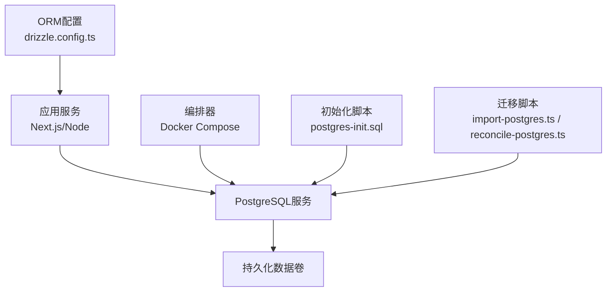
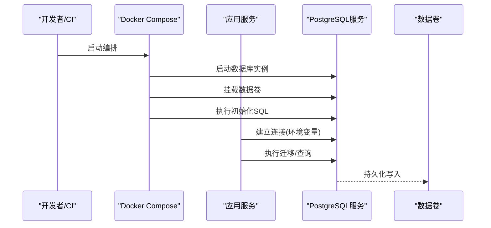
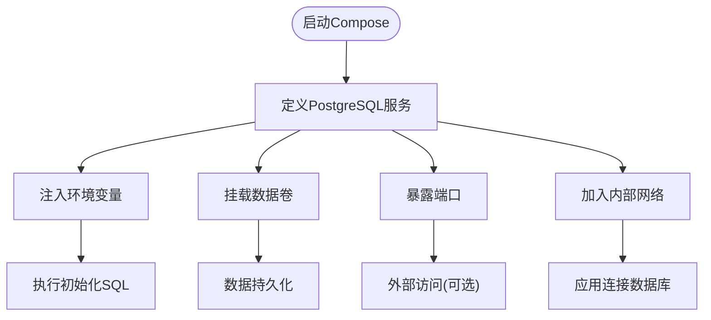
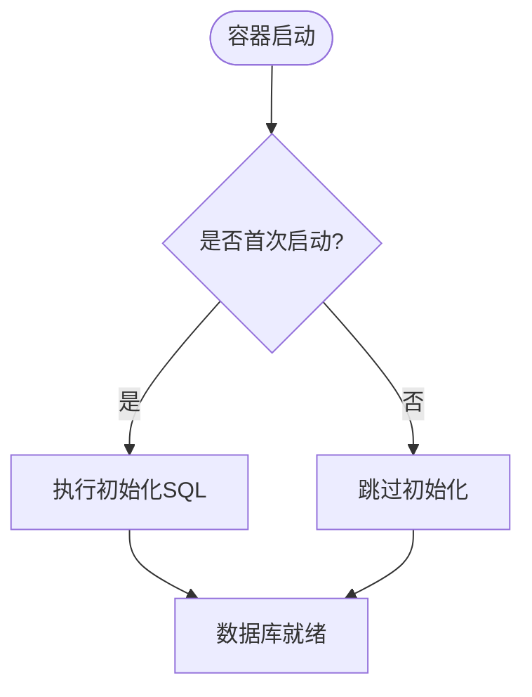
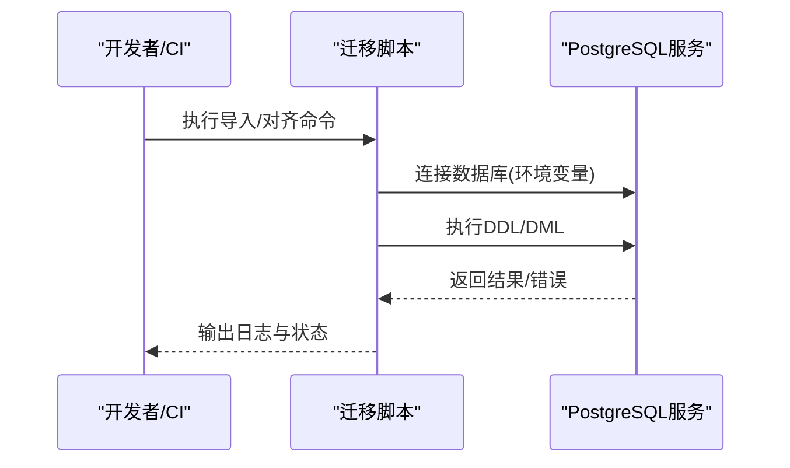
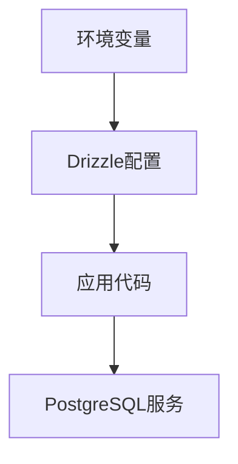
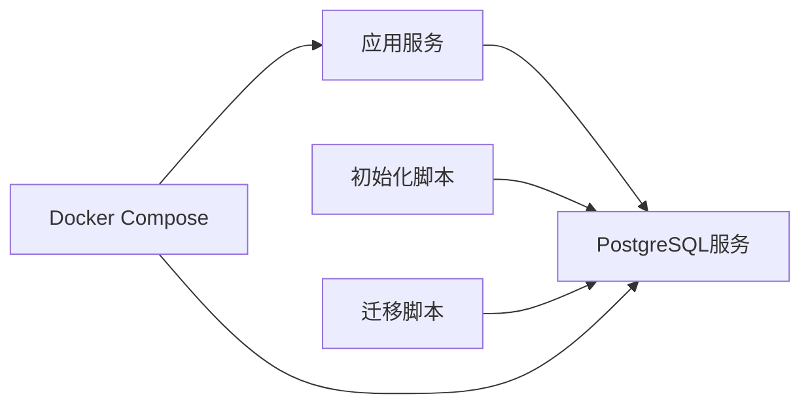

# PostgreSQL安装与配置

<cite>
**本文引用的文件**   
- [docker-compose.dev.yml](file://docker-compose.dev.yml)
- [docker-compose.prod.yml](file://docker-compose.prod.yml)
- [scripts/setup/postgres-init.sql](file://scripts/setup/postgres-init.sql)
- [scripts/migration/import-postgres.ts](file://scripts/migration/import-postgres.ts)
- [scripts/migration/reconcile-postgres.ts](file://scripts/migration/reconcile-postgres.ts)
- [drizzle.config.ts](file://drizzle.config.ts)
- [server/Dockerfile](file://server/Dockerfile)
- [Dockerfile](file://Dockerfile)
</cite>

## 目录
1. [简介](#简介)
2. [项目结构](#项目结构)
3. [核心组件](#核心组件)
4. [架构总览](#架构总览)
5. [详细组件分析](#详细组件分析)
6. [依赖关系分析](#依赖关系分析)
7. [性能考虑](#性能考虑)
8. [故障排查指南](#故障排查指南)
9. [结论](#结论)
10. [附录](#附录)

## 简介
本指南面向需要在不同操作系统（Windows、Linux、macOS）上安装并配置PostgreSQL，以及在Docker环境中部署数据库的生产团队。内容涵盖：
- 多平台安装步骤概览
- 配置文件优化要点（内存、连接池、并发参数）
- Docker容器化部署（编排、数据卷、网络）
- 生产环境最佳实践（安全、备份、监控告警）
- 常见问题定位与解决

说明：本项目通过Docker Compose管理PostgreSQL服务，并提供初始化SQL与迁移脚本；应用侧使用Drizzle ORM进行数据库访问。

## 项目结构
与PostgreSQL相关的工程要素包括：
- 容器编排：开发/生产环境的Compose文件定义了PostgreSQL服务、端口映射、环境变量和数据卷挂载
- 初始化脚本：提供数据库对象与初始数据的初始化SQL
- 迁移工具：导入与同步PostgreSQL数据的脚本
- ORM配置：Drizzle配置用于连接PostgreSQL
- 应用镜像：包含运行与迁移所需的依赖

**图示来源** 
- [docker-compose.dev.yml](file://docker-compose.dev.yml)
- [docker-compose.prod.yml](file://docker-compose.prod.yml)
- [scripts/setup/postgres-init.sql](file://scripts/setup/postgres-init.sql)
- [scripts/migration/import-postgres.ts](file://scripts/migration/import-postgres.ts)
- [scripts/migration/reconcile-postgres.ts](file://scripts/migration/reconcile-postgres.ts)
- [drizzle.config.ts](file://drizzle.config.ts)

**章节来源**
- [docker-compose.dev.yml](file://docker-compose.dev.yml)
- [docker-compose.prod.yml](file://docker-compose.prod.yml)
- [scripts/setup/postgres-init.sql](file://scripts/setup/postgres-init.sql)
- [scripts/migration/import-postgres.ts](file://scripts/migration/import-postgres.ts)
- [scripts/migration/reconcile-postgres.ts](file://scripts/migration/reconcile-postgres.ts)
- [drizzle.config.ts](file://drizzle.config.ts)

## 核心组件
- 容器编排与服务定义：在Compose文件中声明PostgreSQL服务、端口、环境变量、数据卷和网络
- 初始化SQL：创建必要的数据库对象和基础数据
- 迁移脚本：将外部数据导入或与应用状态对齐
- ORM连接配置：通过环境变量驱动数据库连接信息

**章节来源**
- [docker-compose.dev.yml](file://docker-compose.dev.yml)
- [docker-compose.prod.yml](file://docker-compose.prod.yml)
- [scripts/setup/postgres-init.sql](file://scripts/setup/postgres-init.sql)
- [scripts/migration/import-postgres.ts](file://scripts/migration/import-postgres.ts)
- [scripts/migration/reconcile-postgres.ts](file://scripts/migration/reconcile-postgres.ts)
- [drizzle.config.ts](file://drizzle.config.ts)

## 架构总览
下图展示了应用、PostgreSQL与编排器的交互关系，以及数据持久化路径。

**图示来源** 
- [docker-compose.dev.yml](file://docker-compose.dev.yml)
- [docker-compose.prod.yml](file://docker-compose.prod.yml)
- [scripts/setup/postgres-init.sql](file://scripts/setup/postgres-init.sql)

## 详细组件分析

### 容器编排与网络
- 服务定义：Compose中定义PostgreSQL服务，暴露默认端口，设置环境变量（如用户名、密码、数据库名）
- 数据卷：将PostgreSQL数据目录挂载到宿主机或命名卷，确保重启后数据不丢失
- 网络：应用与数据库在同一Compose网络下，通过服务名解析访问

**图示来源** 
- [docker-compose.dev.yml](file://docker-compose.dev.yml)
- [docker-compose.prod.yml](file://docker-compose.prod.yml)

**章节来源**
- [docker-compose.dev.yml](file://docker-compose.dev.yml)
- [docker-compose.prod.yml](file://docker-compose.prod.yml)

### 初始化脚本与数据准备
- 初始化SQL：在容器首次启动时执行，创建数据库对象与基础数据
- 建议：将DDL与种子数据分离，便于版本化管理与回滚

**图示来源** 
- [scripts/setup/postgres-init.sql](file://scripts/setup/postgres-init.sql)

**章节来源**
- [scripts/setup/postgres-init.sql](file://scripts/setup/postgres-init.sql)

### 迁移与数据导入
- 导入脚本：从外部源导入数据至PostgreSQL
- 对齐脚本：确保数据库状态与应用期望一致（表结构、索引、约束等）

**图示来源** 
- [scripts/migration/import-postgres.ts](file://scripts/migration/import-postgres.ts)
- [scripts/migration/reconcile-postgres.ts](file://scripts/migration/reconcile-postgres.ts)

**章节来源**
- [scripts/migration/import-postgres.ts](file://scripts/migration/import-postgres.ts)
- [scripts/migration/reconcile-postgres.ts](file://scripts/migration/reconcile-postgres.ts)

### ORM连接配置
- Drizzle配置：通过环境变量读取数据库连接信息（主机、端口、用户、密码、库名）
- 建议：在生产环境使用密钥管理服务注入敏感信息

**图示来源** 
- [drizzle.config.ts](file://drizzle.config.ts)

**章节来源**
- [drizzle.config.ts](file://drizzle.config.ts)

### 应用镜像与依赖
- 应用镜像：构建包含运行时依赖的镜像，支持运行与迁移任务
- 建议：将数据库迁移作为独立任务在应用启动前执行

**章节来源**
- [server/Dockerfile](file://server/Dockerfile)
- [Dockerfile](file://Dockerfile)

## 依赖关系分析
- 应用依赖PostgreSQL服务，通过环境变量获取连接信息
- 初始化脚本与迁移脚本依赖PostgreSQL服务可用
- Compose编排负责服务生命周期、网络与数据卷管理

**图示来源** 
- [docker-compose.dev.yml](file://docker-compose.dev.yml)
- [docker-compose.prod.yml](file://docker-compose.prod.yml)
- [scripts/setup/postgres-init.sql](file://scripts/setup/postgres-init.sql)
- [scripts/migration/import-postgres.ts](file://scripts/migration/import-postgres.ts)
- [scripts/migration/reconcile-postgres.ts](file://scripts/migration/reconcile-postgres.ts)
- [drizzle.config.ts](file://drizzle.config.ts)

**章节来源**
- [docker-compose.dev.yml](file://docker-compose.dev.yml)
- [docker-compose.prod.yml](file://docker-compose.prod.yml)
- [scripts/setup/postgres-init.sql](file://scripts/setup/postgres-init.sql)
- [scripts/migration/import-postgres.ts](file://scripts/migration/import-postgres.ts)
- [scripts/migration/reconcile-postgres.ts](file://scripts/migration/reconcile-postgres.ts)
- [drizzle.config.ts](file://drizzle.config.ts)

## 性能考虑
- 内存分配：根据宿主内存合理设置共享内存与缓冲区大小，避免过度占用导致系统抖动
- 连接池：调整最大连接数与应用端连接池上限，防止连接耗尽或资源浪费
- 并发参数：依据CPU核数与工作负载类型调优并行度、锁竞争与I/O调度
- I/O与存储：使用SSD与合适的文件系统选项，减少延迟与提升吞吐
- 监控指标：关注连接数、缓存命中率、慢查询、锁等待与磁盘I/O

[本节为通用指导，不直接分析具体文件]

## 故障排查指南
- 连接失败：检查环境变量是否正确、服务名解析是否正常、防火墙与安全组策略
- 权限问题：确认用户与数据库权限，验证认证方式与密码
- 数据卷异常：检查挂载路径与权限，确保数据目录存在且可写
- 初始化失败：查看初始化脚本执行日志，确认SQL语法与依赖对象
- 迁移错误：核对迁移脚本输入数据格式与目标表结构一致性

**章节来源**
- [docker-compose.dev.yml](file://docker-compose.dev.yml)
- [docker-compose.prod.yml](file://docker-compose.prod.yml)
- [scripts/setup/postgres-init.sql](file://scripts/setup/postgres-init.sql)
- [scripts/migration/import-postgres.ts](file://scripts/migration/import-postgres.ts)
- [scripts/migration/reconcile-postgres.ts](file://scripts/migration/reconcile-postgres.ts)
- [drizzle.config.ts](file://drizzle.config.ts)

## 结论
本项目通过Docker Compose统一管理PostgreSQL服务，配合初始化SQL与迁移脚本完成数据准备与同步。应用侧通过环境变量与ORM配置连接数据库。生产环境应重点关注安全配置、备份策略与监控告警，并结合工作负载特性对内存、连接与并发参数进行调优。

[本节为总结性内容，不直接分析具体文件]

## 附录

### 多平台安装步骤（概览）
- Windows：使用官方安装包或包管理器安装PostgreSQL，配置服务与防火墙规则
- Linux：使用发行版包管理器安装，启用并配置服务，设置开机自启
- macOS：使用包管理器安装，启动本地服务并配置环境变量

[本节为通用指导，不直接分析具体文件]

### Docker部署要点
- 编排：在Compose中定义PostgreSQL服务、端口、环境变量与数据卷
- 数据卷：将数据目录挂载到持久化存储，确保重启不丢数据
- 网络：应用与数据库在同一网络下，通过服务名访问
- 健康检查：添加健康检查以保障服务可用性

**章节来源**
- [docker-compose.dev.yml](file://docker-compose.dev.yml)
- [docker-compose.prod.yml](file://docker-compose.prod.yml)

### 安全配置建议
- 最小权限：为应用账户授予必要的最小权限
- 认证方式：优先使用强密码与TLS加密连接
- 访问控制：限制监听地址与来源IP白名单
- 密钥管理：使用密钥管理服务注入敏感信息

[本节为通用指导，不直接分析具体文件]

### 备份策略建议
- 定期全量与增量备份，保留多版本快照
- 异地容灾：将备份副本存储于不同地域
- 恢复演练：定期进行恢复演练验证备份有效性

[本节为通用指导，不直接分析具体文件]

### 监控告警建议
- 关键指标：连接数、缓存命中率、慢查询、锁等待、磁盘I/O
- 告警阈值：基于历史基线设定阈值，及时触发告警
- 日志采集：集中收集数据库与应用日志，便于问题定位

[本节为通用指导，不直接分析具体文件]