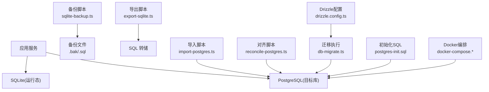
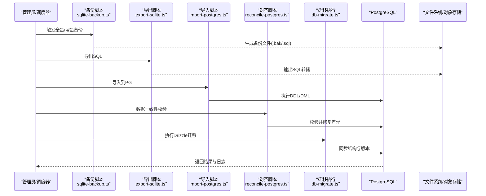
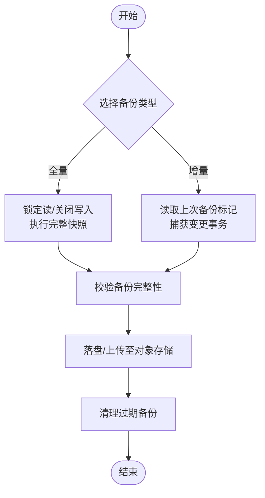
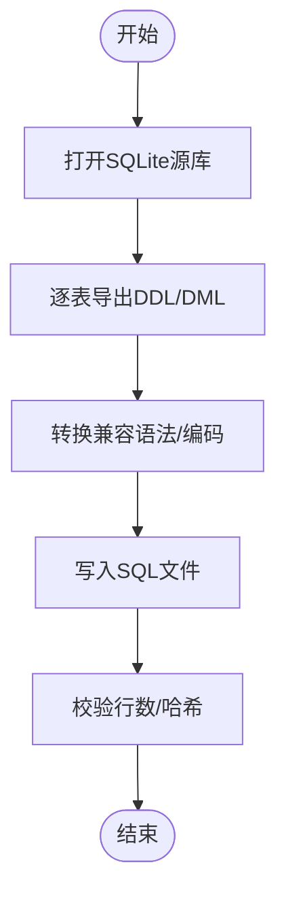
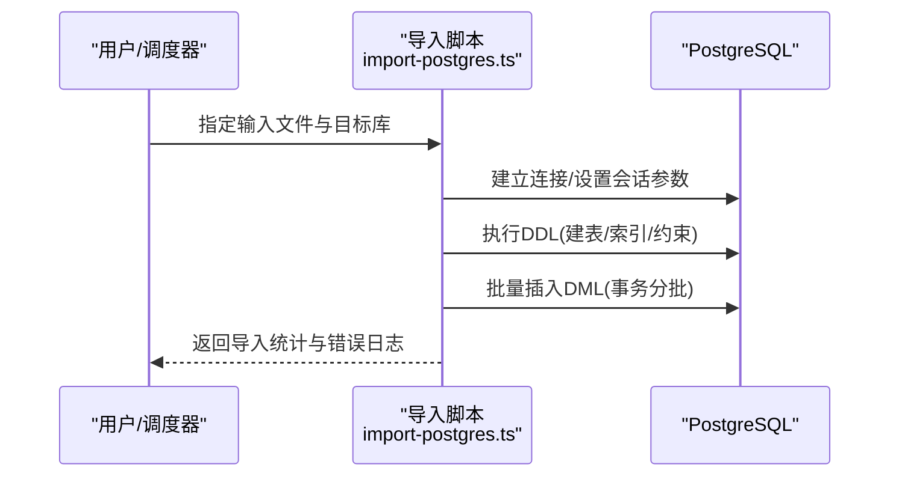
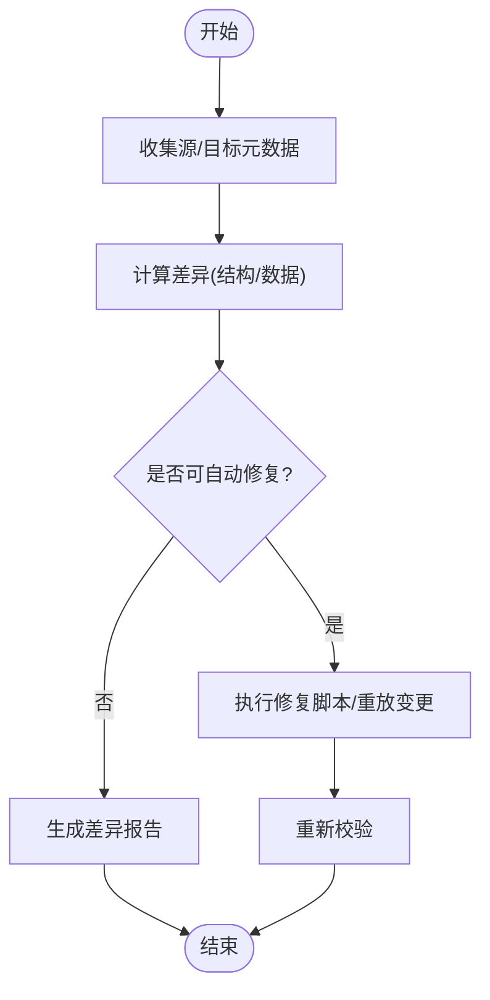
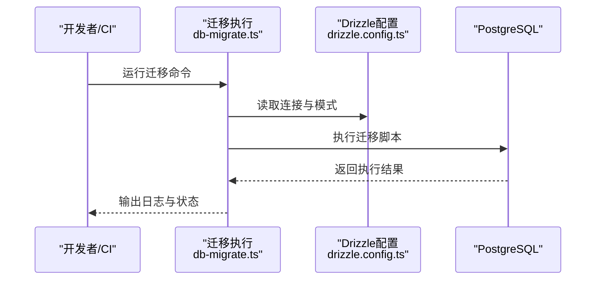
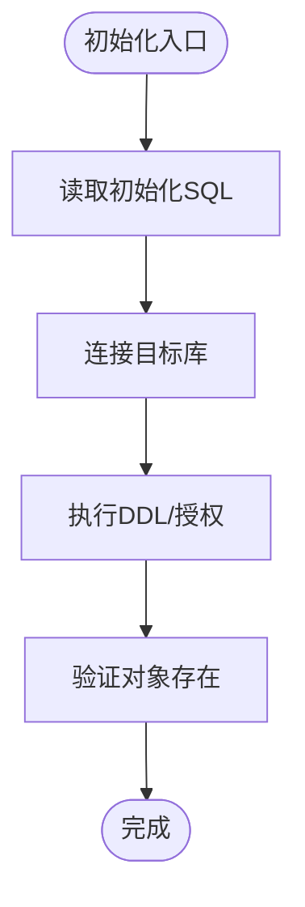
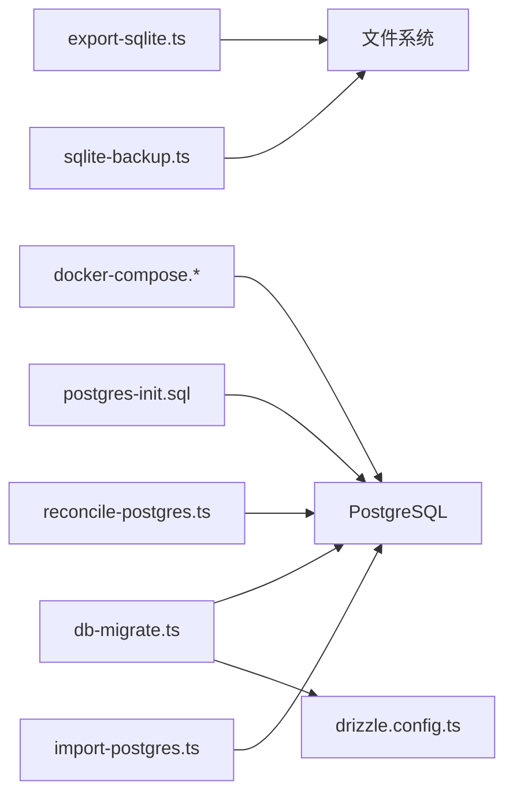

# 数据备份与恢复

<cite>
**本文引用的文件**   
- [scripts/migration/sqlite-backup.ts](file://scripts/migration/sqlite-backup.ts)
- [scripts/migration/export-sqlite.ts](file://scripts/migration/export-sqlite.ts)
- [scripts/migration/import-postgres.ts](file://scripts/migration/import-postgres.ts)
- [scripts/migration/reconcile-postgres.ts](file://scripts/migration/reconcile-postgres.ts)
- [drizzle.config.ts](file://drizzle.config.ts)
- [scripts/setup/db-migrate.ts](file://scripts/setup/db-migrate.ts)
- [scripts/setup/postgres-init.sql](file://scripts/setup/postgres-init.sql)
- [docker-compose.dev.yml](file://docker-compose.dev.yml)
- [docker-compose.prod.yml](file://docker-compose.prod.yml)
</cite>

## 目录
1. [简介](#简介)
2. [项目结构](#项目结构)
3. [核心组件](#核心组件)
4. [架构总览](#架构总览)
5. [详细组件分析](#详细组件分析)
6. [依赖关系分析](#依赖关系分析)
7. [性能考虑](#性能考虑)
8. [故障排查指南](#故障排查指南)
9. [结论](#结论)
10. [附录](#附录)

## 简介
本文件面向生产与运维人员，提供一套完整的数据备份与恢复操作流程，覆盖：
- 全量备份与增量备份的实现方法（含自动策略与手动操作）
- 数据恢复流程（灾难恢复、部分数据恢复、一致性验证）
- SQLite 到 PostgreSQL 的迁移工具使用方法（字段映射、数据清洗、校验）
- 备份数据存储策略（本地、云存储、异地备份）
- 备份验证与测试方法

本仓库已包含数据库备份与迁移相关脚本与配置，可作为落地实现的基础。

## 项目结构
与备份与恢复相关的代码主要位于 scripts 目录下的 migration 与 setup 子目录，以及根级 drizzle 配置与 docker-compose 文件：
- scripts/migration：SQLite 备份导出、PostgreSQL 导入、数据对齐与主密钥初始化等
- scripts/setup：数据库初始化 SQL、迁移执行、凭证引导等
- drizzle.config.ts：ORM/迁移配置（连接串、模式定义位置等）
- docker-compose.*：开发/生产环境数据库服务编排

图表来源
- [scripts/migration/sqlite-backup.ts](file://scripts/migration/sqlite-backup.ts)
- [scripts/migration/export-sqlite.ts](file://scripts/migration/export-sqlite.ts)
- [scripts/migration/import-postgres.ts](file://scripts/migration/import-postgres.ts)
- [scripts/migration/reconcile-postgres.ts](file://scripts/migration/reconcile-postgres.ts)
- [scripts/setup/db-migrate.ts](file://scripts/setup/db-migrate.ts)
- [scripts/setup/postgres-init.sql](file://scripts/setup/postgres-init.sql)
- [drizzle.config.ts](file://drizzle.config.ts)
- [docker-compose.dev.yml](file://docker-compose.dev.yml)
- [docker-compose.prod.yml](file://docker-compose.prod.yml)

章节来源
- [scripts/migration/sqlite-backup.ts](file://scripts/migration/sqlite-backup.ts)
- [scripts/migration/export-sqlite.ts](file://scripts/migration/export-sqlite.ts)
- [scripts/migration/import-postgres.ts](file://scripts/migration/import-postgres.ts)
- [scripts/migration/reconcile-postgres.ts](file://scripts/migration/reconcile-postgres.ts)
- [scripts/setup/db-migrate.ts](file://scripts/setup/db-migrate.ts)
- [scripts/setup/postgres-init.sql](file://scripts/setup/postgres-init.sql)
- [drizzle.config.ts](file://drizzle.config.ts)
- [docker-compose.dev.yml](file://docker-compose.dev.yml)
- [docker-compose.prod.yml](file://docker-compose.prod.yml)

## 核心组件
- SQLite 备份脚本：用于对 SQLite 进行物理或逻辑备份，支持按时间戳命名与保留策略
- SQLite 导出脚本：将 SQLite 导出为 SQL 文本，便于跨平台迁移与人工审查
- PostgreSQL 导入脚本：将导出的 SQL 或结构化数据导入到 PostgreSQL
- 数据对齐脚本：在导入后对目标库进行一致性检查与修复
- Drizzle 迁移执行：基于配置的迁移任务，确保目标库结构与版本一致
- 初始化 SQL：为目标库创建必要的对象与初始状态
- Docker Compose：编排数据库服务，便于本地与生产环境的统一部署

章节来源
- [scripts/migration/sqlite-backup.ts](file://scripts/migration/sqlite-backup.ts)
- [scripts/migration/export-sqlite.ts](file://scripts/migration/export-sqlite.ts)
- [scripts/migration/import-postgres.ts](file://scripts/migration/import-postgres.ts)
- [scripts/migration/reconcile-postgres.ts](file://scripts/migration/reconcile-postgres.ts)
- [scripts/setup/db-migrate.ts](file://scripts/setup/db-migrate.ts)
- [scripts/setup/postgres-init.sql](file://scripts/setup/postgres-init.sql)
- [drizzle.config.ts](file://drizzle.config.ts)

## 架构总览
下图展示了从 SQLite 到 PostgreSQL 的备份与迁移整体流程，包括自动备份、导出、导入、对齐与迁移执行。

图表来源
- [scripts/migration/sqlite-backup.ts](file://scripts/migration/sqlite-backup.ts)
- [scripts/migration/export-sqlite.ts](file://scripts/migration/export-sqlite.ts)
- [scripts/migration/import-postgres.ts](file://scripts/migration/import-postgres.ts)
- [scripts/migration/reconcile-postgres.ts](file://scripts/migration/reconcile-postgres.ts)
- [scripts/setup/db-migrate.ts](file://scripts/setup/db-migrate.ts)

## 详细组件分析

### SQLite 备份组件（全量与增量）
- 全量备份：对 SQLite 数据库进行完整快照，建议在生产低峰期执行，并在备份完成后校验文件大小与完整性
- 增量备份：基于上次备份的时间戳或事务ID，仅备份变更数据；需结合 WAL 模式与事务边界，保证一致性
- 自动化策略：通过定时任务（如 cron）定期执行，保留最近 N 份全量与若干份增量，过期清理

图表来源
- [scripts/migration/sqlite-backup.ts](file://scripts/migration/sqlite-backup.ts)

章节来源
- [scripts/migration/sqlite-backup.ts](file://scripts/migration/sqlite-backup.ts)

### SQLite 导出组件（SQL 转储）
- 用途：将 SQLite 导出为标准 SQL，便于跨平台迁移、人工审查与归档
- 注意事项：处理外键约束、索引重建顺序、字符集与排序规则兼容

图表来源
- [scripts/migration/export-sqlite.ts](file://scripts/migration/export-sqlite.ts)

章节来源
- [scripts/migration/export-sqlite.ts](file://scripts/migration/export-sqlite.ts)

### PostgreSQL 导入组件
- 输入：来自导出脚本的 SQL 文件或结构化数据
- 过程：建立连接、准备目标库、执行导入、监控进度与错误
- 输出：导入报告与失败重试点

图表来源
- [scripts/migration/import-postgres.ts](file://scripts/migration/import-postgres.ts)

章节来源
- [scripts/migration/import-postgres.ts](file://scripts/migration/import-postgres.ts)

### 数据对齐与一致性校验
- 目的：在导入后对比源与目标的元数据与关键指标，发现并修复差异
- 内容：表数量、列定义、索引、约束、计数校验、抽样比对

图表来源
- [scripts/migration/reconcile-postgres.ts](file://scripts/migration/reconcile-postgres.ts)

章节来源
- [scripts/migration/reconcile-postgres.ts](file://scripts/migration/reconcile-postgres.ts)

### Drizzle 迁移执行
- 作用：根据配置文件执行迁移，确保目标库结构与代码期望一致
- 关键点：连接串、迁移文件路径、回滚策略、幂等性

图表来源
- [scripts/setup/db-migrate.ts](file://scripts/setup/db-migrate.ts)
- [drizzle.config.ts](file://drizzle.config.ts)

章节来源
- [scripts/setup/db-migrate.ts](file://scripts/setup/db-migrate.ts)
- [drizzle.config.ts](file://drizzle.config.ts)

### 数据库初始化
- 内容：创建数据库对象、角色权限、扩展与初始数据
- 适用：新环境搭建、灾备恢复后的重建

图表来源
- [scripts/setup/postgres-init.sql](file://scripts/setup/postgres-init.sql)

章节来源
- [scripts/setup/postgres-init.sql](file://scripts/setup/postgres-init.sql)

## 依赖关系分析
- 备份与导出脚本依赖 SQLite 运行时与文件系统
- 导入与对齐脚本依赖 PostgreSQL 客户端与网络连通性
- 迁移执行依赖 Drizzle 配置与迁移文件
- Docker Compose 负责数据库服务的启动与暴露端口

图表来源
- [scripts/migration/sqlite-backup.ts](file://scripts/migration/sqlite-backup.ts)
- [scripts/migration/export-sqlite.ts](file://scripts/migration/export-sqlite.ts)
- [scripts/migration/import-postgres.ts](file://scripts/migration/import-postgres.ts)
- [scripts/migration/reconcile-postgres.ts](file://scripts/migration/reconcile-postgres.ts)
- [scripts/setup/db-migrate.ts](file://scripts/setup/db-migrate.ts)
- [scripts/setup/postgres-init.sql](file://scripts/setup/postgres-init.sql)
- [drizzle.config.ts](file://drizzle.config.ts)
- [docker-compose.dev.yml](file://docker-compose.dev.yml)
- [docker-compose.prod.yml](file://docker-compose.prod.yml)

章节来源
- [scripts/migration/sqlite-backup.ts](file://scripts/migration/sqlite-backup.ts)
- [scripts/migration/export-sqlite.ts](file://scripts/migration/export-sqlite.ts)
- [scripts/migration/import-postgres.ts](file://scripts/migration/import-postgres.ts)
- [scripts/migration/reconcile-postgres.ts](file://scripts/migration/reconcile-postgres.ts)
- [scripts/setup/db-migrate.ts](file://scripts/setup/db-migrate.ts)
- [scripts/setup/postgres-init.sql](file://scripts/setup/postgres-init.sql)
- [drizzle.config.ts](file://drizzle.config.ts)
- [docker-compose.dev.yml](file://docker-compose.dev.yml)
- [docker-compose.prod.yml](file://docker-compose.prod.yml)

## 性能考虑
- 备份阶段：使用只读事务或 WAL 模式减少锁竞争；分批次导出大表；压缩传输与落盘
- 导入阶段：禁用非必要索引与约束，导入后再重建；批量提交事务；调整并行度
- 校验阶段：抽样比对而非全量扫描；优先校验关键业务表与索引
- 资源隔离：在独立进程或容器内执行，避免影响在线服务

[本节为通用指导，不直接分析具体文件]

## 故障排查指南
- 连接失败：检查数据库服务状态、端口、认证信息与网络策略
- 权限不足：确认导入账号具备 DDL/DML 权限与 schema 访问权
- 导入中断：记录断点与错误日志，定位失败语句后重试
- 数据不一致：使用对齐脚本生成差异报告，逐步修复
- 迁移冲突：回滚到上一版本，修正迁移脚本后重试

章节来源
- [scripts/migration/import-postgres.ts](file://scripts/migration/import-postgres.ts)
- [scripts/migration/reconcile-postgres.ts](file://scripts/migration/reconcile-postgres.ts)
- [scripts/setup/db-migrate.ts](file://scripts/setup/db-migrate.ts)

## 结论
通过本仓库提供的备份、导出、导入、对齐与迁移脚本，可以构建可靠的 SQLite 到 PostgreSQL 数据流转体系。配合自动化调度与存储策略，可实现高可用的备份与恢复能力。建议在每次变更后进行演练与验证，确保 RPO/RTO 满足业务要求。

[本节为总结性内容，不直接分析具体文件]

## 附录

### 全量与增量备份策略
- 全量备份：每日低峰期执行一次，保留最近 N 份
- 增量备份：每小时或基于事务间隔执行，保留最近 M 份
- 保留策略：按时间与数量双重限制，自动清理过期备份
- 存储位置：本地磁盘 + 对象存储（多副本/跨区域）

章节来源
- [scripts/migration/sqlite-backup.ts](file://scripts/migration/sqlite-backup.ts)

### 手动备份与恢复操作
- 手动全量备份：调用备份脚本并指定输出路径
- 手动增量备份：指定上次备份标记，仅捕获变更
- 恢复流程：先恢复全量，再按序回放增量；导入后执行对齐与迁移

章节来源
- [scripts/migration/sqlite-backup.ts](file://scripts/migration/sqlite-backup.ts)
- [scripts/migration/import-postgres.ts](file://scripts/migration/import-postgres.ts)
- [scripts/migration/reconcile-postgres.ts](file://scripts/migration/reconcile-postgres.ts)

### 数据恢复流程（灾难恢复、部分恢复、一致性验证）
- 灾难恢复：从最近全量+增量序列恢复，执行导入与对齐，最后执行迁移
- 部分恢复：针对特定表或时间段，导出/导入对应数据片段
- 一致性验证：元数据比对、计数校验、抽样比对、业务查询回归

章节来源
- [scripts/migration/import-postgres.ts](file://scripts/migration/import-postgres.ts)
- [scripts/migration/reconcile-postgres.ts](file://scripts/migration/reconcile-postgres.ts)

### SQLite 到 PostgreSQL 迁移工具使用
- 字段映射：字符串、数值、日期时间类型的兼容性处理
- 数据清洗：去重、空值处理、格式标准化
- 校验：导入前后计数与抽样比对，索引与约束重建验证

章节来源
- [scripts/migration/export-sqlite.ts](file://scripts/migration/export-sqlite.ts)
- [scripts/migration/import-postgres.ts](file://scripts/migration/import-postgres.ts)
- [scripts/migration/reconcile-postgres.ts](file://scripts/migration/reconcile-postgres.ts)

### 备份数据存储策略（本地、云存储、异地备份）
- 本地存储：快速读写，适合短期保留与频繁恢复
- 云存储：高可用与持久化，支持生命周期管理与加密
- 异地备份：跨区域复制，防范区域性灾难

章节来源
- [scripts/migration/sqlite-backup.ts](file://scripts/migration/sqlite-backup.ts)

### 备份验证与测试方法
- 完整性校验：文件大小、哈希校验
- 可恢复性演练：定期在隔离环境恢复并执行回归测试
- 性能基准：记录备份/导入耗时与吞吐，优化阈值

章节来源
- [scripts/migration/sqlite-backup.ts](file://scripts/migration/sqlite-backup.ts)
- [scripts/migration/import-postgres.ts](file://scripts/migration/import-postgres.ts)
- [scripts/migration/reconcile-postgres.ts](file://scripts/migration/reconcile-postgres.ts)