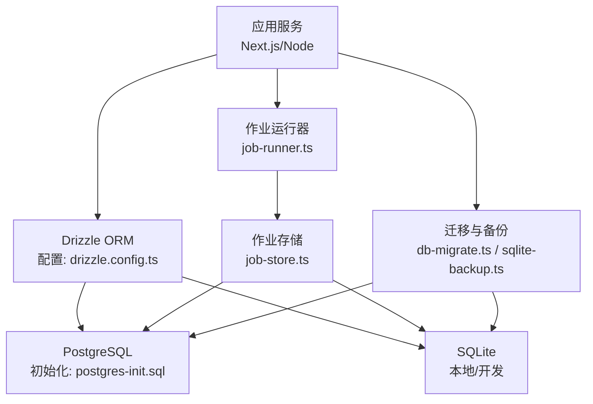
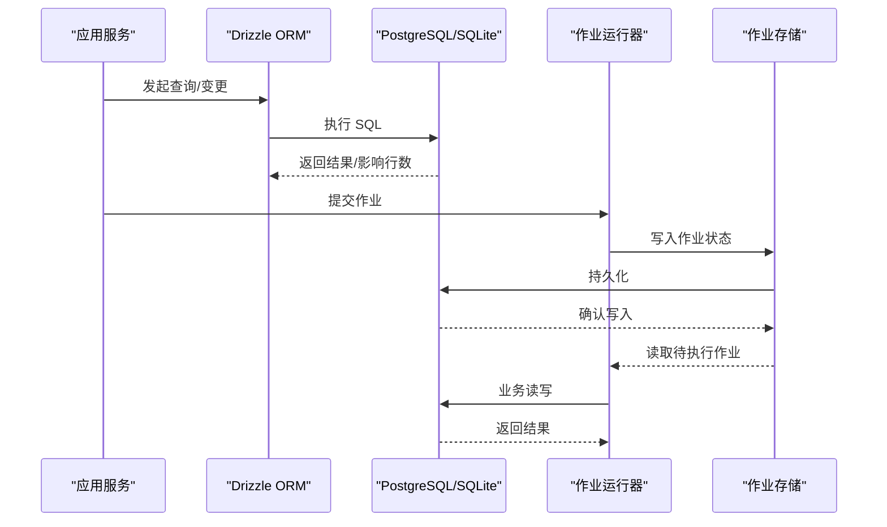
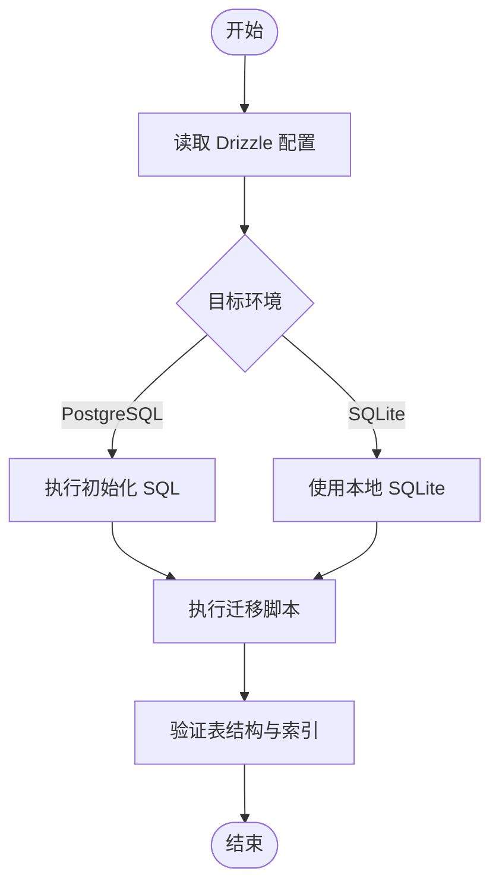
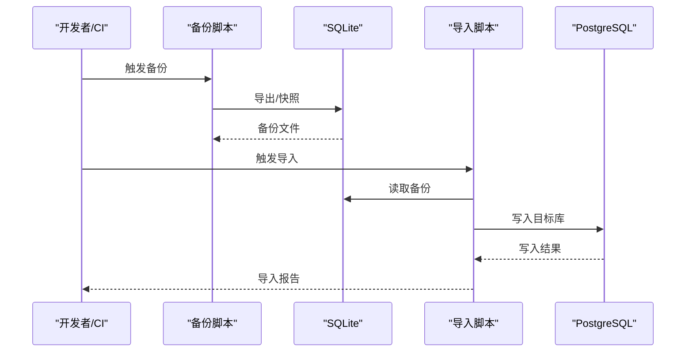
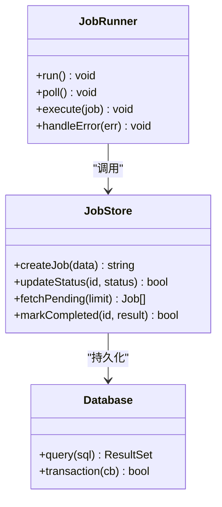
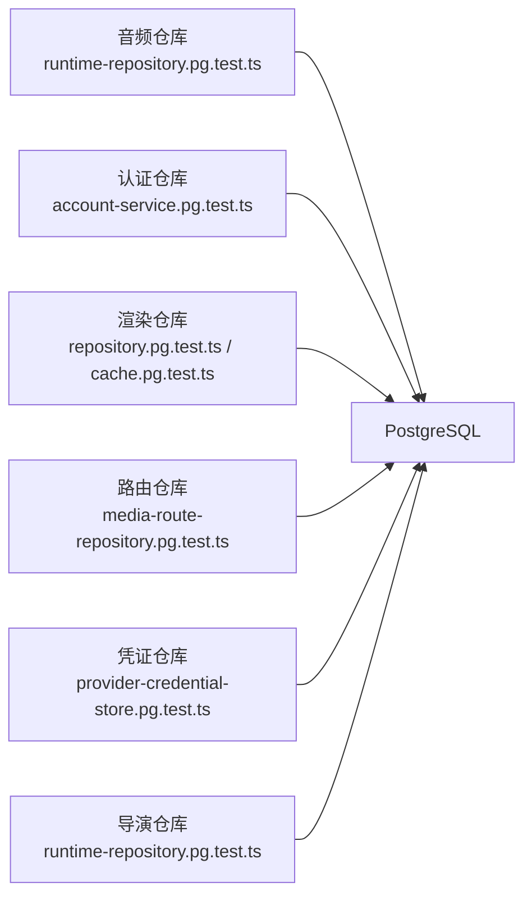
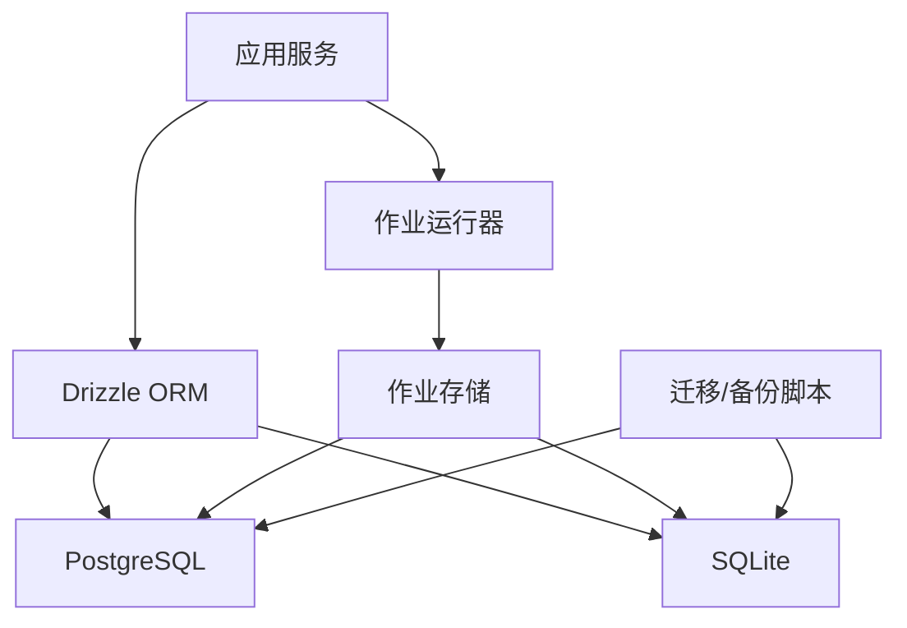

# 数据库监控与维护

<cite>
**本文引用的文件**   
- [drizzle.config.ts](file://drizzle.config.ts)
- [postgres-init.sql](file://scripts/setup/postgres-init.sql)
- [db-migrate.ts](file://scripts/setup/db-migrate.ts)
- [sqlite-backup.ts](file://scripts/migration/sqlite-backup.ts)
- [export-sqlite.ts](file://scripts/migration/export-sqlite.ts)
- [import-postgres.ts](file://scripts/migration/import-postgres.ts)
- [reconcile-postgres.ts](file://scripts/migration/reconcile-postgres.ts)
- [bootstrap-credentials.ts](file://scripts/setup/bootstrap-credentials.ts)
- [job-runner.ts](file://server/src/server/job-runner.ts)
- [job-store.ts](file://server/src/server/job-store.ts)
- [runtime-repository.pg.test.ts](file://src/features/audio/runtime-repository.pg.test.ts)
- [account-service.pg.test.ts](file://src/features/auth/account-service.pg.test.ts)
- [cache.pg.test.ts](file://src/features/render/cache.pg.test.ts)
- [repository.pg.test.ts](file://src/features/render/repository.pg.test.ts)
- [media-route-repository.pg.test.ts](file://src/features/routing/media-route-repository.pg.test.ts)
- [provider-credential-store.pg.test.ts](file://src/features/credentials/provider-credential-store.pg.test.ts)
- [runtime-repository.pg.test.ts](file://src/features/director/runtime-repository.pg.test.ts)
</cite>

## 目录
1. [简介](#简介)
2. [项目结构](#项目结构)
3. [核心组件](#核心组件)
4. [架构总览](#架构总览)
5. [详细组件分析](#详细组件分析)
6. [依赖关系分析](#依赖关系分析)
7. [性能考虑](#性能考虑)
8. [故障诊断指南](#故障诊断指南)
9. [结论](#结论)
10. [附录](#附录)

## 简介
本指南面向使用本项目的运维与研发人员，提供数据库监控与维护的完整实践。内容涵盖：
- 关键性能指标（KPI）设置：查询响应时间、连接数、内存使用率、锁等待、I/O 等
- 慢查询分析与优化：执行计划分析、索引优化建议、SQL 调优方法
- 存储空间管理：表空间规划、日志清理、归档策略
- 定期维护任务清单：统计信息更新、索引重建、健康检查
- 故障诊断与问题排查：常见告警定位、恢复流程、回滚策略

本项目采用 Drizzle ORM 进行数据访问，支持 SQLite 与 PostgreSQL；生产环境推荐 PostgreSQL，并通过迁移脚本与初始化 SQL 完成库表结构与权限配置。

## 项目结构
与数据库相关的关键位置：
- 数据库配置与迁移：drizzle.config.ts、scripts/setup/db-migrate.ts、scripts/setup/postgres-init.sql
- 备份与导入导出：scripts/migration/sqlite-backup.ts、scripts/migration/export-sqlite.ts、scripts/migration/import-postgres.ts、scripts/migration/reconcile-postgres.ts
- 运行时持久化与作业：server/src/server/job-runner.ts、server/src/server/job-store.ts
- 特性层仓库与测试（含 PG 集成用例）：src/features/*/runtime-repository*.ts、repository*.pg.test.ts 等

**图表来源** 
- [drizzle.config.ts](file://drizzle.config.ts)
- [postgres-init.sql](file://scripts/setup/postgres-init.sql)
- [db-migrate.ts](file://scripts/setup/db-migrate.ts)
- [sqlite-backup.ts](file://scripts/migration/sqlite-backup.ts)
- [job-runner.ts](file://server/src/server/job-runner.ts)
- [job-store.ts](file://server/src/server/job-store.ts)

**章节来源**
- [drizzle.config.ts](file://drizzle.config.ts)
- [postgres-init.sql](file://scripts/setup/postgres-init.sql)
- [db-migrate.ts](file://scripts/setup/db-migrate.ts)
- [sqlite-backup.ts](file://scripts/migration/sqlite-backup.ts)
- [job-runner.ts](file://server/src/server/job-runner.ts)
- [job-store.ts](file://server/src/server/job-store.ts)

## 核心组件
- 数据库配置与迁移
  - Drizzle 配置：统一数据库连接、迁移命令入口
  - 迁移脚本：确保库表结构与版本一致
  - 初始化 SQL：创建用户、角色、权限、扩展等
- 备份与导入导出
  - SQLite 备份与导出：便于本地开发与快速恢复
  - Postgres 导入与对齐：从 SQLite 导入并校验一致性
- 作业系统与持久化
  - 作业运行器：调度与执行后台任务
  - 作业存储：将作业状态持久化到数据库

**章节来源**
- [drizzle.config.ts](file://drizzle.config.ts)
- [db-migrate.ts](file://scripts/setup/db-migrate.ts)
- [postgres-init.sql](file://scripts/setup/postgres-init.sql)
- [sqlite-backup.ts](file://scripts/migration/sqlite-backup.ts)
- [export-sqlite.ts](file://scripts/migration/export-sqlite.ts)
- [import-postgres.ts](file://scripts/migration/import-postgres.ts)
- [reconcile-postgres.ts](file://scripts/migration/reconcile-postgres.ts)
- [job-runner.ts](file://server/src/server/job-runner.ts)
- [job-store.ts](file://server/src/server/job-store.ts)

## 架构总览
下图展示了应用、ORM、数据库与作业系统之间的交互关系，以及迁移与备份在整体流程中的位置。

**图表来源** 
- [job-runner.ts](file://server/src/server/job-runner.ts)
- [job-store.ts](file://server/src/server/job-store.ts)
- [drizzle.config.ts](file://drizzle.config.ts)

## 详细组件分析

### 数据库配置与迁移
- Drizzle 配置集中管理连接参数与方言选择，便于在不同环境切换 SQLite/PostgreSQL
- 迁移脚本负责按版本顺序执行变更，保证多实例部署一致性
- 初始化 SQL 用于创建数据库对象、权限与扩展，避免启动时缺失依赖

**图表来源** 
- [drizzle.config.ts](file://drizzle.config.ts)
- [postgres-init.sql](file://scripts/setup/postgres-init.sql)
- [db-migrate.ts](file://scripts/setup/db-migrate.ts)

**章节来源**
- [drizzle.config.ts](file://drizzle.config.ts)
- [postgres-init.sql](file://scripts/setup/postgres-init.sql)
- [db-migrate.ts](file://scripts/setup/db-migrate.ts)

### 备份与导入导出
- SQLite 备份：通过脚本生成快照或导出 SQL，适用于开发环境与轻量恢复
- 导入与对齐：将 SQLite 数据导入 PostgreSQL，并进行一致性校验与修复

**图表来源** 
- [sqlite-backup.ts](file://scripts/migration/sqlite-backup.ts)
- [export-sqlite.ts](file://scripts/migration/export-sqlite.ts)
- [import-postgres.ts](file://scripts/migration/import-postgres.ts)
- [reconcile-postgres.ts](file://scripts/migration/reconcile-postgres.ts)

**章节来源**
- [sqlite-backup.ts](file://scripts/migration/sqlite-backup.ts)
- [export-sqlite.ts](file://scripts/migration/export-sqlite.ts)
- [import-postgres.ts](file://scripts/migration/import-postgres.ts)
- [reconcile-postgres.ts](file://scripts/migration/reconcile-postgres.ts)

### 作业系统与持久化
- 作业运行器负责拉取待执行作业、执行任务逻辑、更新状态与重试
- 作业存储封装对数据库的读写，确保状态一致性与幂等性

**图表来源** 
- [job-runner.ts](file://server/src/server/job-runner.ts)
- [job-store.ts](file://server/src/server/job-store.ts)

**章节来源**
- [job-runner.ts](file://server/src/server/job-runner.ts)
- [job-store.ts](file://server/src/server/job-store.ts)

### 特性层仓库与 PG 集成测试
- 多个特性模块通过仓库模式访问数据库，包含音频、认证、渲染、路由、凭证、导演等
- PG 集成测试覆盖关键路径，有助于回归与性能基线对比

**图表来源** 
- [runtime-repository.pg.test.ts](file://src/features/audio/runtime-repository.pg.test.ts)
- [account-service.pg.test.ts](file://src/features/auth/account-service.pg.test.ts)
- [cache.pg.test.ts](file://src/features/render/cache.pg.test.ts)
- [repository.pg.test.ts](file://src/features/render/repository.pg.test.ts)
- [media-route-repository.pg.test.ts](file://src/features/routing/media-route-repository.pg.test.ts)
- [provider-credential-store.pg.test.ts](file://src/features/credentials/provider-credential-store.pg.test.ts)
- [runtime-repository.pg.test.ts](file://src/features/director/runtime-repository.pg.test.ts)

**章节来源**
- [runtime-repository.pg.test.ts](file://src/features/audio/runtime-repository.pg.test.ts)
- [account-service.pg.test.ts](file://src/features/auth/account-service.pg.test.ts)
- [cache.pg.test.ts](file://src/features/render/cache.pg.test.ts)
- [repository.pg.test.ts](file://src/features/render/repository.pg.test.ts)
- [media-route-repository.pg.test.ts](file://src/features/routing/media-route-repository.pg.test.ts)
- [provider-credential-store.pg.test.ts](file://src/features/credentials/provider-credential-store.pg.test.ts)
- [runtime-repository.pg.test.ts](file://src/features/director/runtime-repository.pg.test.ts)

## 依赖关系分析
- 应用层依赖 Drizzle ORM 进行数据访问，ORM 再依赖具体数据库驱动
- 作业系统与仓库模块共同依赖数据库，形成稳定的持久化边界
- 迁移与备份脚本独立于运行时，但需与 ORM 模型保持一致

**图表来源** 
- [drizzle.config.ts](file://drizzle.config.ts)
- [job-runner.ts](file://server/src/server/job-runner.ts)
- [job-store.ts](file://server/src/server/job-store.ts)
- [sqlite-backup.ts](file://scripts/migration/sqlite-backup.ts)

**章节来源**
- [drizzle.config.ts](file://drizzle.config.ts)
- [job-runner.ts](file://server/src/server/job-runner.ts)
- [job-store.ts](file://server/src/server/job-store.ts)
- [sqlite-backup.ts](file://scripts/migration/sqlite-backup.ts)

## 性能考虑
- 连接池与并发
  - 合理设置连接池大小，避免连接耗尽与频繁握手开销
  - 控制作业并发度，防止写放大与锁竞争
- 查询性能
  - 关注慢查询与全表扫描，优先使用覆盖索引与选择性高的条件
  - 分页与批量操作结合，减少单次事务负载
- 内存与 I/O
  - 监控内存使用率与临时表使用，避免排序溢出
  - 调整工作区大小与缓存命中率，降低磁盘 I/O
- 统计信息与执行计划
  - 定期更新统计信息，确保优化器选择正确路径
  - 对热点查询采集执行计划，识别瓶颈点

[本节为通用指导，不直接分析具体文件]

## 故障诊断指南
- 常见问题定位
  - 连接超时：检查连接池上限、网络延迟、数据库负载
  - 慢查询：启用慢查询日志，分析执行计划与索引命中
  - 锁等待：查看锁持有者与等待者，必要时终止阻塞会话
  - 磁盘不足：清理归档与日志，扩容或迁移冷数据
- 恢复与回滚
  - 使用备份脚本恢复至最近可用时间点
  - 回滚迁移前务必备份，确保可逆性
- 健康检查
  - 定期检查库表大小、索引碎片、统计信息新鲜度
  - 监控作业队列积压与失败率，及时告警

**章节来源**
- [sqlite-backup.ts](file://scripts/migration/sqlite-backup.ts)
- [db-migrate.ts](file://scripts/setup/db-migrate.ts)
- [postgres-init.sql](file://scripts/setup/postgres-init.sql)

## 结论
通过统一的 ORM 配置、完善的迁移与备份机制、健壮的作业系统与仓库抽象，本项目具备在生产环境中稳定运行的基础。配合科学的监控指标、慢查询优化、存储管理与定期维护，可显著提升数据库可用性与性能。建议在 CI/CD 中集成健康检查与性能基线，持续保障数据库质量。

[本节为总结，不直接分析具体文件]

## 附录
- 常用监控指标建议
  - 查询响应时间：P95/P99 延迟、慢查询阈值
  - 连接数：活跃连接、空闲连接、连接池利用率
  - 内存使用率：缓冲池命中率、临时表使用
  - I/O：读/写吞吐、延迟、磁盘占用
  - 锁与事务：锁等待时长、事务回滚率
- 定期维护清单
  - 每周：统计信息更新、索引碎片评估、备份有效性验证
  - 每月：索引重建（高碎片场景）、归档清理、容量规划
  - 每季度：执行计划审计、慢查询优化、容量与性能压测

[本节为通用指导，不直接分析具体文件]