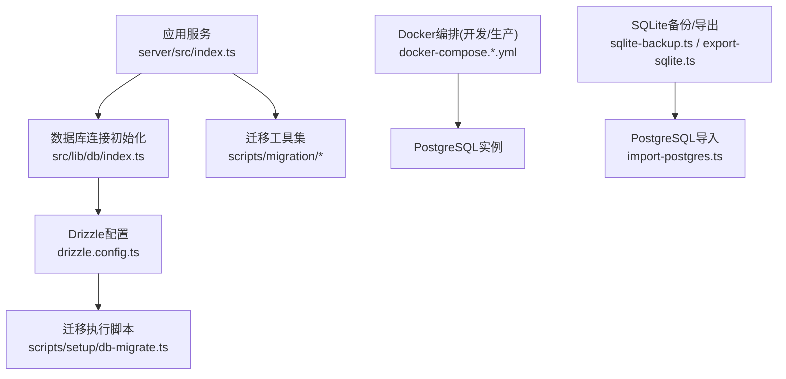
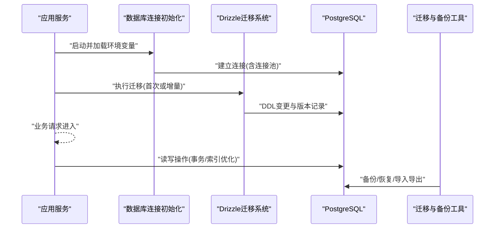
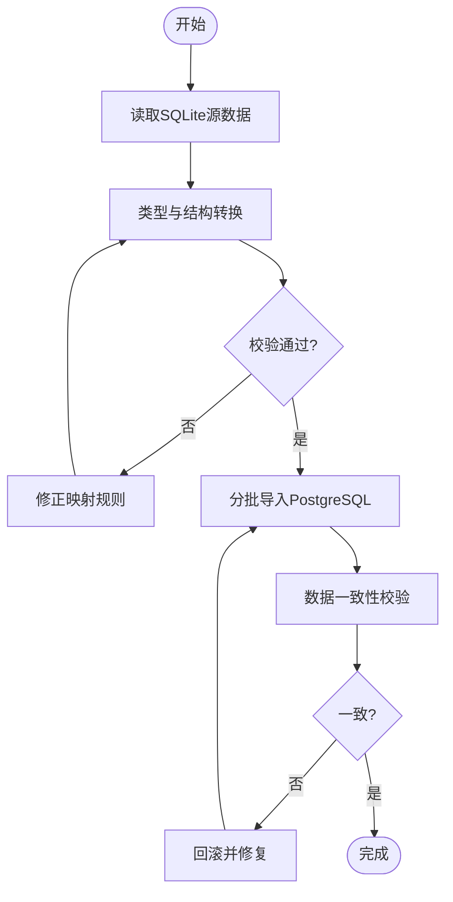
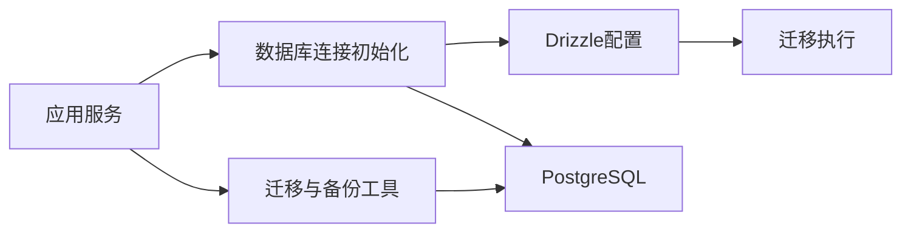

# 数据库部署与管理

<cite>
**本文引用的文件**   
- [drizzle.config.ts](file://drizzle.config.ts)
- [scripts/migration/export-sqlite.ts](file://scripts/migration/export-sqlite.ts)
- [scripts/migration/import-postgres.ts](file://scripts/migration/import-postgres.ts)
- [scripts/migration/reconcile-postgres.ts](file://scripts/migration/reconcile-postgres.ts)
- [scripts/migration/sqlite-backup.ts](file://scripts/migration/sqlite-backup.ts)
- [scripts/setup/db-migrate.ts](file://scripts/setup/db-migrate.ts)
- [scripts/setup/postgres-init.sql](file://scripts/setup/postgres-init.sql)
- [docker-compose.dev.yml](file://docker-compose.dev.yml)
- [docker-compose.prod.yml](file://docker-compose.prod.yml)
- [server/src/index.ts](file://server/src/index.ts)
- [src/lib/db/index.ts](file://src/lib/db/index.ts)
</cite>

## 目录
1. [简介](#简介)
2. [项目结构](#项目结构)
3. [核心组件](#核心组件)
4. [架构总览](#架构总览)
5. [详细组件分析](#详细组件分析)
6. [依赖关系分析](#依赖关系分析)
7. [性能与优化建议](#性能与优化建议)
8. [故障排查指南](#故障排查指南)
9. [结论](#结论)
10. [附录](#附录)

## 简介
本指南面向PurpleInk平台的数据库部署与运维，覆盖PostgreSQL安装与配置、Drizzle ORM迁移体系、备份与恢复流程、监控与维护建议，以及SQLite到PostgreSQL的数据迁移工具使用。文档基于仓库中的脚本与配置文件进行梳理，确保落地可执行。

## 项目结构
与数据库相关的核心位置：
- Drizzle配置与迁移入口位于根目录的配置文件与setup脚本中
- SQLite与PostgreSQL之间的数据导入导出脚本位于scripts/migration
- Docker Compose用于本地和生产环境的数据库编排
- 应用层通过lib/db模块初始化数据库连接

**图表来源** 
- [server/src/index.ts](file://server/src/index.ts)
- [src/lib/db/index.ts](file://src/lib/db/index.ts)
- [drizzle.config.ts](file://drizzle.config.ts)
- [scripts/setup/db-migrate.ts](file://scripts/setup/db-migrate.ts)
- [scripts/migration/export-sqlite.ts](file://scripts/migration/export-sqlite.ts)
- [scripts/migration/import-postgres.ts](file://scripts/migration/import-postgres.ts)
- [scripts/migration/sqlite-backup.ts](file://scripts/migration/sqlite-backup.ts)
- [docker-compose.dev.yml](file://docker-compose.dev.yml)
- [docker-compose.prod.yml](file://docker-compose.prod.yml)

**章节来源**
- [drizzle.config.ts](file://drizzle.config.ts)
- [scripts/setup/db-migrate.ts](file://scripts/setup/db-migrate.ts)
- [scripts/migration/export-sqlite.ts](file://scripts/migration/export-sqlite.ts)
- [scripts/migration/import-postgres.ts](file://scripts/migration/import-postgres.ts)
- [scripts/migration/reconcile-postgres.ts](file://scripts/migration/reconcile-postgres.ts)
- [scripts/migration/sqlite-backup.ts](file://scripts/migration/sqlite-backup.ts)
- [scripts/setup/postgres-init.sql](file://scripts/setup/postgres-init.sql)
- [docker-compose.dev.yml](file://docker-compose.dev.yml)
- [docker-compose.prod.yml](file://docker-compose.prod.yml)
- [server/src/index.ts](file://server/src/index.ts)
- [src/lib/db/index.ts](file://src/lib/db/index.ts)

## 核心组件
- PostgreSQL实例：由Docker Compose管理，提供持久化存储与连接端点
- Drizzle ORM：负责数据库模式定义与迁移执行
- 迁移脚本：包含初始迁移、增量更新、回滚策略与一致性校验
- 备份与恢复：SQLite全量备份与PostgreSQL导入导出工具
- 应用连接：服务端启动时建立数据库连接并加载必要资源

**章节来源**
- [docker-compose.dev.yml](file://docker-compose.dev.yml)
- [docker-compose.prod.yml](file://docker-compose.prod.yml)
- [drizzle.config.ts](file://drizzle.config.ts)
- [scripts/setup/db-migrate.ts](file://scripts/setup/db-migrate.ts)
- [scripts/migration/export-sqlite.ts](file://scripts/migration/export-sqlite.ts)
- [scripts/migration/import-postgres.ts](file://scripts/migration/import-postgres.ts)
- [scripts/migration/reconcile-postgres.ts](file://scripts/migration/reconcile-postgres.ts)
- [scripts/migration/sqlite-backup.ts](file://scripts/migration/sqlite-backup.ts)
- [scripts/setup/postgres-init.sql](file://scripts/setup/postgres-init.sql)
- [server/src/index.ts](file://server/src/index.ts)
- [src/lib/db/index.ts](file://src/lib/db/index.ts)

## 架构总览
下图展示从应用启动到数据库访问的整体流程，以及迁移与备份工具在生命周期中的介入点。

**图表来源** 
- [server/src/index.ts](file://server/src/index.ts)
- [src/lib/db/index.ts](file://src/lib/db/index.ts)
- [drizzle.config.ts](file://drizzle.config.ts)
- [scripts/setup/db-migrate.ts](file://scripts/setup/db-migrate.ts)
- [scripts/migration/export-sqlite.ts](file://scripts/migration/export-sqlite.ts)
- [scripts/migration/import-postgres.ts](file://scripts/migration/import-postgres.ts)
- [scripts/migration/sqlite-backup.ts](file://scripts/migration/sqlite-backup.ts)

## 详细组件分析

### PostgreSQL安装与配置
- 版本选择：建议使用长期支持版本（如14/15/16），结合Drizzle兼容性评估
- 内存优化：根据服务器内存调整shared_buffers、work_mem、maintenance_work_mem等参数
- 连接池：应用侧通过连接池管理连接数，避免过多直连导致资源耗尽
- 持久化：使用Docker卷挂载数据目录，确保容器重启后数据不丢失
- 安全：设置强密码、限制网络访问范围、启用SSL（生产环境）

参考编排与初始化：
- docker-compose.*.yml中定义PostgreSQL服务、端口映射、卷挂载与环境变量
- postgres-init.sql可用于初始化用户、数据库与基础权限

**章节来源**
- [docker-compose.dev.yml](file://docker-compose.dev.yml)
- [docker-compose.prod.yml](file://docker-compose.prod.yml)
- [scripts/setup/postgres-init.sql](file://scripts/setup/postgres-init.sql)

### Drizzle ORM迁移系统
- 初始迁移：首次运行生成并执行DDL，创建表结构与约束
- 增量更新：新增字段或表时生成新迁移文件，按顺序执行
- 回滚策略：优先采用“向前兼容”的增量变更；必要时编写反向迁移
- 一致性校验：reconcile脚本用于比对期望状态与实际状态，减少漂移

关键文件：
- drizzle.config.ts：驱动类型、数据库连接信息、迁移目录配置
- scripts/setup/db-migrate.ts：封装迁移执行逻辑，供CI/CD或本地使用

**章节来源**
- [drizzle.config.ts](file://drizzle.config.ts)
- [scripts/setup/db-migrate.ts](file://scripts/setup/db-migrate.ts)
- [scripts/migration/reconcile-postgres.ts](file://scripts/migration/reconcile-postgres.ts)

### 备份与恢复流程
- 全量备份：对PostgreSQL进行完整快照（pg_dump或云厂商快照）
- 增量备份：基于WAL或时间点的增量备份，降低RPO
- 灾难恢复：先恢复全量，再回放增量至目标时间点
- SQLite备份：sqlite-backup.ts用于本地SQLite文件的快速备份
- 导入导出：export-sqlite.ts导出为中间格式，import-postgres.ts导入到PostgreSQL

推荐流程：
1. 停止写入或进入只读模式
2. 执行全量备份
3. 收集增量日志/WAL
4. 验证备份完整性
5. 在目标环境恢复并校验数据一致性

**章节来源**
- [scripts/migration/sqlite-backup.ts](file://scripts/migration/sqlite-backup.ts)
- [scripts/migration/export-sqlite.ts](file://scripts/migration/export-sqlite.ts)
- [scripts/migration/import-postgres.ts](file://scripts/migration/import-postgres.ts)

### 数据迁移工具（SQLite到PostgreSQL）
- 导出阶段：从SQLite读取表结构与数据，转换为通用格式（JSON/CSV）
- 转换阶段：处理类型映射、主键自增、外键约束差异
- 导入阶段：批量插入PostgreSQL，必要时分批提交以控制事务大小
- 校验阶段：对比行数、哈希校验或抽样比对，确保一致性

**图表来源** 
- [scripts/migration/export-sqlite.ts](file://scripts/migration/export-sqlite.ts)
- [scripts/migration/import-postgres.ts](file://scripts/migration/import-postgres.ts)

**章节来源**
- [scripts/migration/export-sqlite.ts](file://scripts/migration/export-sqlite.ts)
- [scripts/migration/import-postgres.ts](file://scripts/migration/import-postgres.ts)

### 应用连接与连接池
- 连接初始化：应用启动时读取环境变量，建立数据库连接
- 连接池：合理设置最大连接数、超时与重试策略
- 健康检查：定期探测连接可用性，失败时自动重连
- 资源释放：请求结束关闭连接，避免泄漏

**章节来源**
- [server/src/index.ts](file://server/src/index.ts)
- [src/lib/db/index.ts](file://src/lib/db/index.ts)

## 依赖关系分析
- 应用服务依赖数据库连接初始化模块
- 连接初始化模块依赖Drizzle配置与迁移脚本
- 迁移与备份工具独立于运行时，但需与数据库版本和模式保持一致
- Docker Compose统一管理PostgreSQL实例与卷挂载

**图表来源** 
- [server/src/index.ts](file://server/src/index.ts)
- [src/lib/db/index.ts](file://src/lib/db/index.ts)
- [drizzle.config.ts](file://drizzle.config.ts)
- [scripts/setup/db-migrate.ts](file://scripts/setup/db-migrate.ts)
- [scripts/migration/export-sqlite.ts](file://scripts/migration/export-sqlite.ts)
- [scripts/migration/import-postgres.ts](file://scripts/migration/import-postgres.ts)
- [scripts/migration/sqlite-backup.ts](file://scripts/migration/sqlite-backup.ts)

**章节来源**
- [server/src/index.ts](file://server/src/index.ts)
- [src/lib/db/index.ts](file://src/lib/db/index.ts)
- [drizzle.config.ts](file://drizzle.config.ts)
- [scripts/setup/db-migrate.ts](file://scripts/setup/db-migrate.ts)
- [scripts/migration/export-sqlite.ts](file://scripts/migration/export-sqlite.ts)
- [scripts/migration/import-postgres.ts](file://scripts/migration/import-postgres.ts)
- [scripts/migration/sqlite-backup.ts](file://scripts/migration/sqlite-backup.ts)

## 性能与优化建议
- 慢查询分析：启用慢查询日志，定期分析top queries，定位热点SQL
- 索引优化：为高频过滤与排序字段添加合适索引，避免过度索引
- 存储空间管理：监控表与索引大小，清理历史数据，分区大表
- 连接池调优：根据并发与数据库容量调整max_connections与池大小
- 缓存策略：对读多写少的数据引入缓存层，减轻数据库压力

[本节为通用指导，不直接分析具体文件]

## 故障排查指南
- 连接失败：检查环境变量、网络连通性、防火墙与SSL配置
- 迁移失败：查看迁移日志，确认DDL顺序与依赖关系
- 数据不一致：使用reconcile脚本比对期望与实际状态
- 备份不可用：验证备份文件完整性与恢复演练
- 性能退化：分析慢查询、锁等待与IO瓶颈

**章节来源**
- [scripts/migration/reconcile-postgres.ts](file://scripts/migration/reconcile-postgres.ts)
- [scripts/setup/db-migrate.ts](file://scripts/setup/db-migrate.ts)
- [scripts/migration/sqlite-backup.ts](file://scripts/migration/sqlite-backup.ts)

## 结论
通过Docker编排PostgreSQL、Drizzle迁移系统与完善的备份恢复流程，PurpleInk平台可实现稳定可靠的数据库部署与运维。建议在开发与生产环境中严格遵循迁移与备份规范，持续监控性能指标并及时优化。

[本节为总结性内容，不直接分析具体文件]

## 附录
- 常用命令与脚本路径请参考各脚本文件说明
- 生产环境建议启用加密传输、审计日志与自动化备份
- 定期演练灾难恢复流程，确保RTO/RPO满足业务要求

[本节为补充信息，不直接分析具体文件]