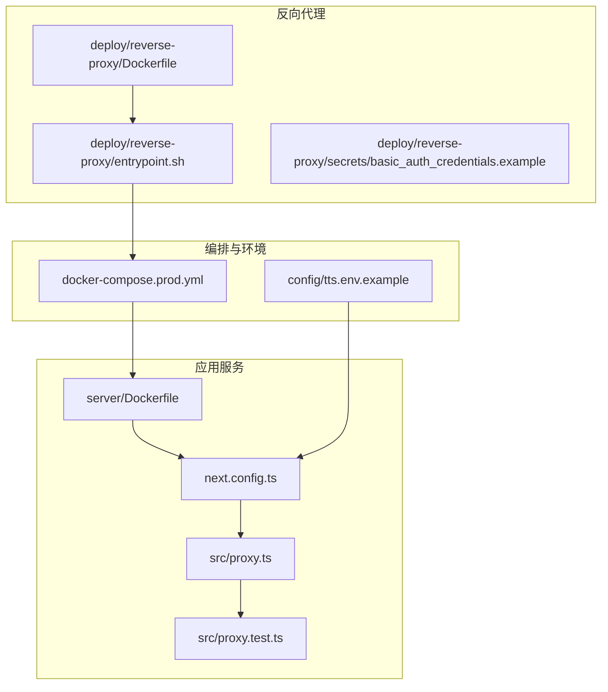
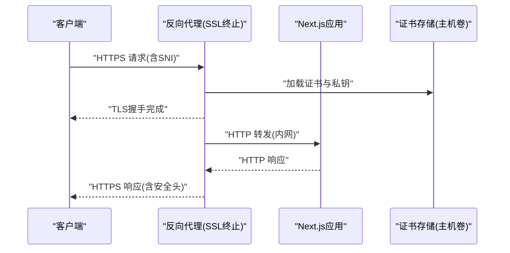
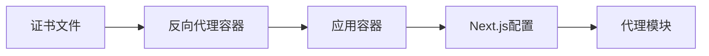

# SSL/TLS证书配置

<cite>
**本文引用的文件**   
- [docker-compose.prod.yml](file://docker-compose.prod.yml)
- [Dockerfile](file://Dockerfile)
- [server/Dockerfile](file://server/Dockerfile)
- [deploy/reverse-proxy/Dockerfile](file://deploy/reverse-proxy/Dockerfile)
- [deploy/reverse-proxy/entrypoint.sh](file://deploy/reverse-proxy/entrypoint.sh)
- [deploy/reverse-proxy/secrets/basic_auth_credentials.example](file://deploy/reverse-proxy/secrets/basic_auth_credentials.example)
- [next.config.ts](file://next.config.ts)
- [src/proxy.ts](file://src/proxy.ts)
- [src/proxy.test.ts](file://src/proxy.test.ts)
- [config/tts.env.example](file://config/tts.env.example)
</cite>

## 目录
1. [简介](#简介)
2. [项目结构](#项目结构)
3. [核心组件](#核心组件)
4. [架构总览](#架构总览)
5. [详细组件分析](#详细组件分析)
6. [依赖关系分析](#依赖关系分析)
7. [性能考虑](#性能考虑)
8. [故障排查指南](#故障排查指南)
9. [结论](#结论)
10. [附录](#附录)

## 简介
本指南面向PurpleInk平台的SSL/TLS证书部署与运维，覆盖以下主题：
- 获取并安装Let's Encrypt免费证书及自动续期脚本
- 自定义SSL证书的安装步骤（文件格式、私钥保护、证书链）
- 反向代理中的SSL终止配置（HTTPS重定向、HSTS、协议版本控制）
- Docker环境下的证书挂载与管理方案
- 多域名证书的部署策略
- 证书故障排查与安全审计建议

说明：本项目未内置证书管理逻辑，证书由反向代理层统一终止并提供安全能力。应用侧通过环境变量或配置文件读取上游信任信息。

## 项目结构
与SSL/TLS相关的关键位置包括：
- 反向代理容器定义与入口脚本
- 生产编排文件（服务间通信、端口映射、卷挂载）
- Next.js应用的安全头与代理设置
- 示例环境变量模板

图表来源 
- [deploy/reverse-proxy/Dockerfile](file://deploy/reverse-proxy/Dockerfile)
- [deploy/reverse-proxy/entrypoint.sh](file://deploy/reverse-proxy/entrypoint.sh)
- [docker-compose.prod.yml](file://docker-compose.prod.yml)
- [server/Dockerfile](file://server/Dockerfile)
- [next.config.ts](file://next.config.ts)
- [src/proxy.ts](file://src/proxy.ts)
- [src/proxy.test.ts](file://src/proxy.test.ts)
- [config/tts.env.example](file://config/tts.env.example)

章节来源
- [docker-compose.prod.yml](file://docker-compose.prod.yml)
- [deploy/reverse-proxy/Dockerfile](file://deploy/reverse-proxy/Dockerfile)
- [deploy/reverse-proxy/entrypoint.sh](file://deploy/reverse-proxy/entrypoint.sh)
- [server/Dockerfile](file://server/Dockerfile)
- [next.config.ts](file://next.config.ts)
- [src/proxy.ts](file://src/proxy.ts)
- [src/proxy.test.ts](file://src/proxy.test.ts)
- [config/tts.env.example](file://config/tts.env.example)

## 核心组件
- 反向代理层：负责TLS终止、HTTPS重定向、HSTS、协议版本控制、静态资源缓存等。
- 应用服务层：Next.js应用，接收来自反向代理的HTTP请求，按需要设置安全响应头。
- 编排层：Docker Compose定义服务网络、端口映射、卷挂载（证书、密钥）。
- 环境变量与配置：通过环境变量注入敏感信息与运行时行为开关。

章节来源
- [docker-compose.prod.yml](file://docker-compose.prod.yml)
- [deploy/reverse-proxy/Dockerfile](file://deploy/reverse-proxy/Dockerfile)
- [deploy/reverse-proxy/entrypoint.sh](file://deploy/reverse-proxy/entrypoint.sh)
- [next.config.ts](file://next.config.ts)
- [src/proxy.ts](file://src/proxy.ts)

## 架构总览
下图展示从客户端到应用的完整TLS终止与转发流程，以及证书在容器间的挂载路径。

图表来源 
- [docker-compose.prod.yml](file://docker-compose.prod.yml)
- [deploy/reverse-proxy/Dockerfile](file://deploy/reverse-proxy/Dockerfile)
- [deploy/reverse-proxy/entrypoint.sh](file://deploy/reverse-proxy/entrypoint.sh)
- [server/Dockerfile](file://server/Dockerfile)

## 详细组件分析

### Let's Encrypt证书获取与自动续期
- 推荐在反向代理容器中集成证书管理工具（如certbot），通过HTTP-01或DNS-01验证方式申请证书。
- 将证书持久化到主机卷，以便容器重启后仍可用。
- 使用系统定时任务（cron）或容器内调度器定期执行续期脚本，并在成功后触发重载配置。

实施要点：
- 确保证书目录权限最小化，仅反向代理进程可读。
- 续期脚本需幂等，避免重复申请导致限流。
- 在反向代理中监听ACME挑战端口（通常为80）或通过DNS记录完成验证。

章节来源
- [deploy/reverse-proxy/Dockerfile](file://deploy/reverse-proxy/Dockerfile)
- [deploy/reverse-proxy/entrypoint.sh](file://deploy/reverse-proxy/entrypoint.sh)
- [docker-compose.prod.yml](file://docker-compose.prod.yml)

### 自定义SSL证书安装
- 证书格式要求：
  - 服务器证书：PEM或DER格式（推荐PEM）
  - 私钥：RSA或ECDSA，建议使用无密码保护的PEM私钥
  - 中间证书链：按顺序拼接根CA与中间CA
- 私钥保护：
  - 限制文件权限（例如只读给运行用户）
  - 使用独立卷或密钥管理服务存放
- 证书链配置：
  - 确保服务端发送完整的证书链，避免客户端校验失败
  - 验证顺序：服务器证书 -> 中间证书 -> 根证书

章节来源
- [docker-compose.prod.yml](file://docker-compose.prod.yml)
- [deploy/reverse-proxy/Dockerfile](file://deploy/reverse-proxy/Dockerfile)

### 反向代理SSL终止配置
- HTTPS重定向：将所有HTTP请求重定向到HTTPS
- HSTS头：启用Strict-Transport-Security，设置合适的max-age与includeSubDomains
- 协议版本控制：禁用不安全的TLS版本（如TLS1.0/1.1），仅允许TLS1.2及以上
- 加密套件：优先选择强加密套件，禁用弱算法
- OCSP装订：提升证书吊销检查性能

章节来源
- [deploy/reverse-proxy/Dockerfile](file://deploy/reverse-proxy/Dockerfile)
- [deploy/reverse-proxy/entrypoint.sh](file://deploy/reverse-proxy/entrypoint.sh)

### Docker环境下的证书挂载与管理
- 卷挂载：将主机上的证书目录挂载到反向代理容器
- 环境变量：通过环境变量注入敏感信息（如API密钥、数据库连接串）
- 多容器共享：如需应用层访问证书，可通过内部网络共享卷或使用专用服务

章节来源
- [docker-compose.prod.yml](file://docker-compose.prod.yml)
- [server/Dockerfile](file://server/Dockerfile)
- [config/tts.env.example](file://config/tts.env.example)

### 多域名证书部署策略
- 单证书多域名：使用SAN扩展的证书支持多个域名
- 通配符证书：适用于子域名场景，注意安全性权衡
- SNI支持：确保反向代理正确解析SNI以选择对应证书

章节来源
- [docker-compose.prod.yml](file://docker-compose.prod.yml)
- [deploy/reverse-proxy/Dockerfile](file://deploy/reverse-proxy/Dockerfile)

## 依赖关系分析
反向代理与应用服务之间的依赖关系如下：

图表来源 
- [docker-compose.prod.yml](file://docker-compose.prod.yml)
- [deploy/reverse-proxy/Dockerfile](file://deploy/reverse-proxy/Dockerfile)
- [server/Dockerfile](file://server/Dockerfile)
- [next.config.ts](file://next.config.ts)
- [src/proxy.ts](file://src/proxy.ts)

章节来源
- [docker-compose.prod.yml](file://docker-compose.prod.yml)
- [deploy/reverse-proxy/Dockerfile](file://deploy/reverse-proxy/Dockerfile)
- [server/Dockerfile](file://server/Dockerfile)
- [next.config.ts](file://next.config.ts)
- [src/proxy.ts](file://src/proxy.ts)

## 性能考虑
- 启用HTTP/2和HTTP/3以提升传输效率
- 配置合理的超时参数，避免连接堆积
- 使用CDN缓存静态资源，减少后端压力
- 启用压缩（Gzip/Brotli）减少传输大小
- 合理设置Keep-Alive连接池

## 故障排查指南
常见问题及解决方案：
- 证书过期：检查证书有效期，配置自动续期
- 证书链不完整：确认中间证书已正确配置
- 权限问题：检查证书文件权限和容器用户权限
- 端口冲突：确认80/443端口未被占用
- 网络连通性：验证反向代理与应用服务间网络可达

调试命令：
- 检查证书有效性：openssl x509 -in cert.pem -noout -dates
- 测试TLS握手：openssl s_client -connect domain:443
- 查看反向代理日志：docker logs reverse-proxy-container

章节来源
- [deploy/reverse-proxy/entrypoint.sh](file://deploy/reverse-proxy/entrypoint.sh)
- [docker-compose.prod.yml](file://docker-compose.prod.yml)

## 结论
通过反向代理层统一管理SSL/TLS证书，可以实现集中化的证书生命周期管理和安全策略配置。结合Docker容器化和自动化续期脚本，能够构建高可用、易维护的HTTPS服务架构。建议定期进行安全审计和性能调优，确保系统的安全性和稳定性。

## 附录
- 最佳实践清单：
  - 使用强加密套件和最新TLS版本
  - 启用HSTS和安全相关响应头
  - 定期更新证书和依赖包
  - 监控证书到期时间
  - 备份私钥和配置文件
- 参考文档：
  - Let's Encrypt官方文档
  - Mozilla SSL配置生成器
  - OWASP安全指南