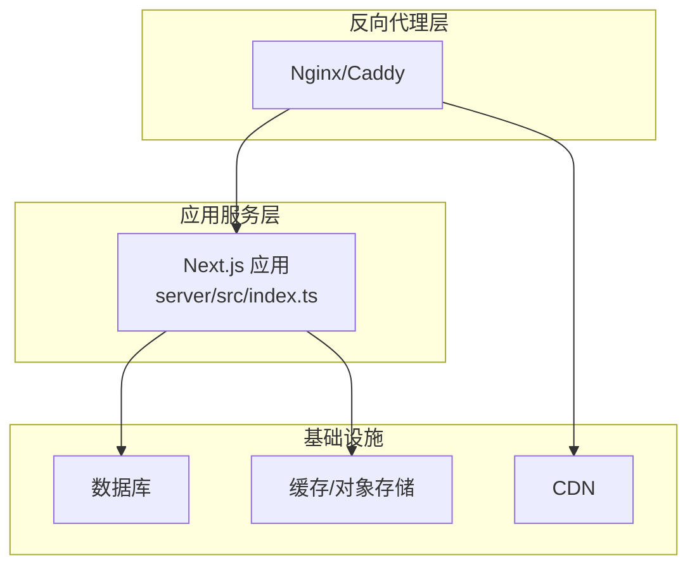
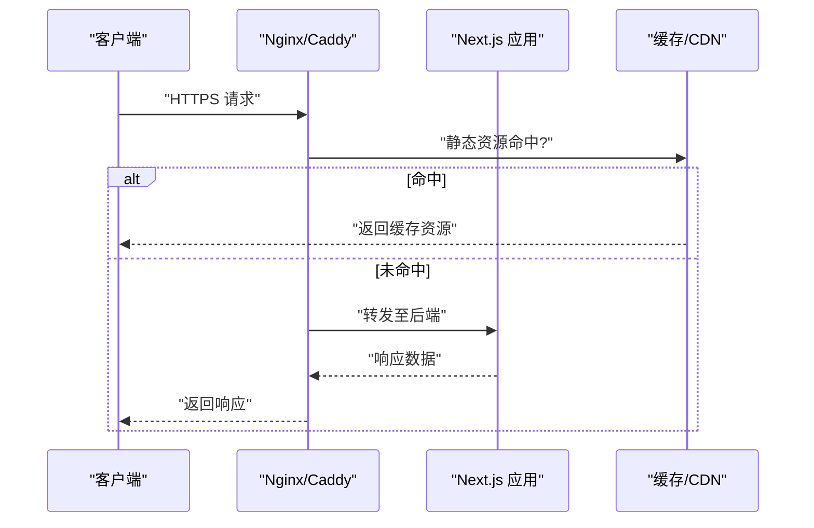
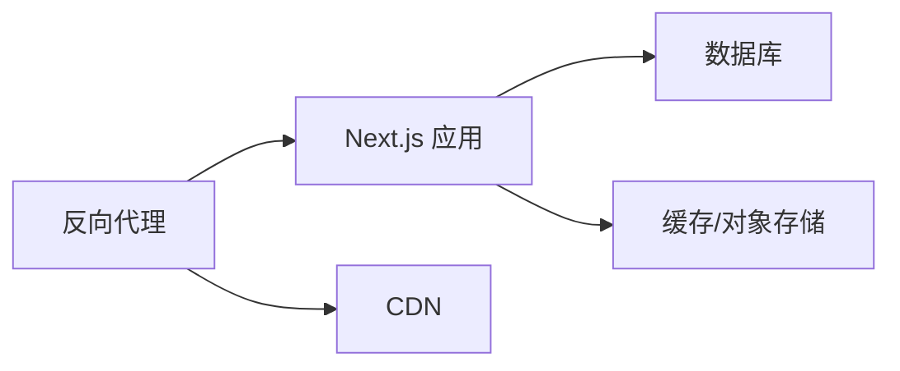

# 反向代理配置

<cite>
**本文引用的文件**   
- [deploy/reverse-proxy/Dockerfile](file://deploy/reverse-proxy/Dockerfile)
- [deploy/reverse-proxy/entrypoint.sh](file://deploy/reverse-proxy/entrypoint.sh)
- [deploy/reverse-proxy/secrets/basic_auth_credentials.example](file://deploy/reverse-proxy/secrets/basic_auth_credentials.example)
- [docker-compose.dev.yml](file://docker-compose.dev.yml)
- [docker-compose.prod.yml](file://docker-compose.prod.yml)
- [next.config.ts](file://next.config.ts)
- [server/src/index.ts](file://server/src/index.ts)
- [src/app/api/ping/route.ts](file://src/app/api/ping/route.ts)
</cite>

## 目录
1. [简介](#简介)
2. [项目结构](#项目结构)
3. [核心组件](#核心组件)
4. [架构总览](#架构总览)
5. [详细组件分析](#详细组件分析)
6. [依赖关系分析](#依赖关系分析)
7. [性能考虑](#性能考虑)
8. [故障排除指南](#故障排除指南)
9. [结论](#结论)
10. [附录](#附录)

## 简介
本指南面向PurpleInk平台的生产与开发环境，提供Nginx或Caddy作为反向代理的高级配置方案。内容覆盖负载均衡、健康检查、请求路由、缓存策略（静态资源、API响应、CDN集成）、压缩（Gzip/Brotli）、安全头（CSP、X-Frame-Options等）、WebSocket支持、限流策略、访问日志与监控集成、性能调优参数以及常见问题的排查方法。文档同时结合仓库中的部署脚本与Next.js应用特性，给出可落地的最佳实践。

## 项目结构
仓库中与反向代理相关的部署资产集中在 deploy/reverse-proxy 目录，包含容器化镜像构建与入口脚本；应用层通过 Next.js 提供服务，并暴露若干 API 路由用于健康检查与业务功能。

图表来源
- [deploy/reverse-proxy/Dockerfile](file://deploy/reverse-proxy/Dockerfile)
- [deploy/reverse-proxy/entrypoint.sh](file://deploy/reverse-proxy/entrypoint.sh)
- [server/src/index.ts](file://server/src/index.ts)

章节来源
- [deploy/reverse-proxy/Dockerfile](file://deploy/reverse-proxy/Dockerfile)
- [deploy/reverse-proxy/entrypoint.sh](file://deploy/reverse-proxy/entrypoint.sh)
- [docker-compose.dev.yml](file://docker-compose.dev.yml)
- [docker-compose.prod.yml](file://docker-compose.prod.yml)
- [server/src/index.ts](file://server/src/index.ts)

## 核心组件
- 反向代理：Nginx 或 Caddy，负责TLS终止、请求路由、负载均衡、缓存、压缩与安全头注入。
- 应用服务：Next.js 应用，提供页面渲染与REST API，内部监听本地端口。
- 健康检查端点：/api/ping，供代理层进行存活探测。
- 认证凭据：basic_auth_credentials.example 示例文件，用于演示基础认证凭据管理。

章节来源
- [src/app/api/ping/route.ts](file://src/app/api/ping/route.ts)
- [deploy/reverse-proxy/secrets/basic_auth_credentials.example](file://deploy/reverse-proxy/secrets/basic_auth_credentials.example)

## 架构总览
下图展示从客户端到反向代理再到Next.js应用的典型请求路径，以及可选的CDN与缓存层。

图表来源
- [deploy/reverse-proxy/Dockerfile](file://deploy/reverse-proxy/Dockerfile)
- [deploy/reverse-proxy/entrypoint.sh](file://deploy/reverse-proxy/entrypoint.sh)
- [server/src/index.ts](file://server/src/index.ts)

## 详细组件分析

### Nginx 反向代理配置要点
- TLS终止与HTTP/2：启用HSTS、强制HTTPS、HTTP/2以提升性能。
- 负载均衡与健康检查：对上游Next.js实例进行轮询或加权分配，使用健康检查端点 /api/ping 判定节点可用性。
- 请求路由：按路径前缀区分静态资源、API与WebSocket流量，分别设置不同的超时与缓冲策略。
- 缓存策略：
  - 静态资源：开启浏览器与代理层缓存，设置合理的Cache-Control与ETag。
  - API响应：对GET类接口启用短TTL缓存，避免写操作被缓存。
  - CDN集成：通过Vary头与源站缓存键控制CDN缓存行为。
- 压缩：启用Gzip与Brotli（若编译支持），针对文本类型资源进行压缩。
- 安全头：设置Content-Security-Policy、X-Frame-Options、X-Content-Type-Options、Referrer-Policy等。
- WebSocket：为需要长连接的端点启用Upgrade与Connection头透传。
- 限流与访问控制：基于IP或用户标识进行速率限制，结合Basic Auth保护敏感路径。
- 日志与监控：输出结构化访问日志，对接Prometheus或集中式日志系统。

章节来源
- [deploy/reverse-proxy/Dockerfile](file://deploy/reverse-proxy/Dockerfile)
- [deploy/reverse-proxy/entrypoint.sh](file://deploy/reverse-proxy/entrypoint.sh)
- [src/app/api/ping/route.ts](file://src/app/api/ping/route.ts)

### Caddy 反向代理配置要点
- 自动TLS与ACME：简化证书申请与续期。
- 反向代理与健康检查：使用health_path指向 /api/ping，自动剔除不健康节点。
- 路由与中间件：通过route块组织不同路径的处理逻辑，便于扩展。
- 缓存：利用cache中间件对静态资源与只读API进行缓存，配合CDN边缘缓存。
- 压缩：启用encode模块，优先选择Brotli，回退到Gzip。
- 安全头：通过header中间件统一注入安全头部。
- WebSocket：自动处理Upgrade与Connection头，无需额外配置。
- 限流：使用ratelimit中间件实现细粒度限流。
- 日志与指标：启用access日志与metrics导出，便于监控告警。

章节来源
- [deploy/reverse-proxy/Dockerfile](file://deploy/reverse-proxy/Dockerfile)
- [deploy/reverse-proxy/entrypoint.sh](file://deploy/reverse-proxy/entrypoint.sh)
- [src/app/api/ping/route.ts](file://src/app/api/ping/route.ts)

### Next.js 应用与代理协作
- 端口与协议：应用监听本地端口，代理负责对外暴露HTTPS与HTTP/2。
- 静态资源：Next.js构建产物由代理层缓存与CDN分发，减少源站压力。
- API路由：/api/* 路由由代理转发至应用，必要时在代理层做鉴权与限流。
- 健康检查：/api/ping 返回简单状态，供代理层探测。

章节来源
- [server/src/index.ts](file://server/src/index.ts)
- [src/app/api/ping/route.ts](file://src/app/api/ping/route.ts)

### 缓存策略详解
- 静态资源缓存：
  - 浏览器缓存：设置Cache-Control与Expires，使用版本化文件名提升命中率。
  - 代理缓存：启用代理层缓存，缩短重复请求延迟。
  - CDN缓存：通过Vary与缓存键控制边缘缓存一致性。
- API响应缓存：
  - 仅对GET且幂等的接口启用短TTL缓存，避免脏数据。
  - 使用ETag与If-None-Match协商缓存，降低带宽消耗。
- 缓存失效：
  - 发布时清理相关缓存键，确保新内容及时生效。
  - 对动态内容采用按需失效策略。

章节来源
- [next.config.ts](file://next.config.ts)
- [deploy/reverse-proxy/Dockerfile](file://deploy/reverse-proxy/Dockerfile)

### 压缩算法与参数
- Gzip：广泛兼容，适合文本类资源，建议开启并设置最小长度阈值。
- Brotli：更高压缩率，需客户端支持，优先于Gzip。
- 压缩范围：HTML、CSS、JS、JSON、SVG等文本类型资源。
- 压缩级别：根据CPU与带宽权衡选择合适的压缩级别。

章节来源
- [deploy/reverse-proxy/Dockerfile](file://deploy/reverse-proxy/Dockerfile)
- [deploy/reverse-proxy/entrypoint.sh](file://deploy/reverse-proxy/entrypoint.sh)

### 安全头配置
- Content-Security-Policy：限制资源加载与脚本执行，防止XSS攻击。
- X-Frame-Options：禁止嵌入点击劫持。
- X-Content-Type-Options：禁止MIME嗅探。
- Referrer-Policy：控制Referer信息泄露。
- Strict-Transport-Security：强制HTTPS传输。

章节来源
- [deploy/reverse-proxy/Dockerfile](file://deploy/reverse-proxy/Dockerfile)
- [deploy/reverse-proxy/entrypoint.sh](file://deploy/reverse-proxy/entrypoint.sh)

### WebSocket支持
- 升级头透传：确保Upgrade与Connection头正确传递。
- 超时与缓冲：为长连接设置合适的超时与缓冲区大小。
- 路由隔离：将WebSocket流量与常规HTTP流量分离，便于监控与限流。

章节来源
- [deploy/reverse-proxy/Dockerfile](file://deploy/reverse-proxy/Dockerfile)
- [deploy/reverse-proxy/entrypoint.sh](file://deploy/reverse-proxy/entrypoint.sh)

### 限流策略与访问控制
- 速率限制：基于IP或用户标识限制请求频率，防止滥用。
- 基础认证：对敏感路径启用Basic Auth，凭据通过环境变量或密钥管理注入。
- 白名单与黑名单：按IP段进行访问控制。

章节来源
- [deploy/reverse-proxy/secrets/basic_auth_credentials.example](file://deploy/reverse-proxy/secrets/basic_auth_credentials.example)
- [deploy/reverse-proxy/Dockerfile](file://deploy/reverse-proxy/Dockerfile)

### 访问日志与监控集成
- 访问日志：记录请求路径、状态码、耗时与客户端IP，便于审计与分析。
- 指标导出：暴露Prometheus指标，采集QPS、错误率、延迟分布等关键指标。
- 集中式日志：将日志推送至ELK或云日志服务，建立告警规则。

章节来源
- [deploy/reverse-proxy/Dockerfile](file://deploy/reverse-proxy/Dockerfile)
- [deploy/reverse-proxy/entrypoint.sh](file://deploy/reverse-proxy/entrypoint.sh)

## 依赖关系分析
反向代理依赖Next.js应用的健康检查端点与API路由；应用依赖数据库与缓存/对象存储；CDN作为边缘缓存层加速静态资源与只读API。

图表来源
- [deploy/reverse-proxy/Dockerfile](file://deploy/reverse-proxy/Dockerfile)
- [deploy/reverse-proxy/entrypoint.sh](file://deploy/reverse-proxy/entrypoint.sh)
- [server/src/index.ts](file://server/src/index.ts)

章节来源
- [docker-compose.dev.yml](file://docker-compose.dev.yml)
- [docker-compose.prod.yml](file://docker-compose.prod.yml)

## 性能考虑
- 连接复用：启用Keep-Alive，减少握手开销。
- 并发与线程：根据CPU核数调整worker进程与线程池大小。
- 缓冲区：合理设置请求与响应缓冲区，避免频繁磁盘IO。
- 缓存命中率：优化缓存键与TTL，提升静态资源与API缓存命中率。
- 压缩权衡：在高CPU环境下适当降低压缩级别，平衡CPU与带宽。

[本节为通用性能指导，不直接分析具体文件]

## 故障排除指南
- 健康检查失败：确认 /api/ping 可达且返回正常状态码，检查上游节点负载与网络连通性。
- 缓存不一致：清理代理与CDN缓存，验证Vary头与缓存键是否正确。
- WebSocket断开：检查Upgrade与Connection头透传，确认超时与缓冲区设置。
- 安全头缺失：核对代理层安全头配置是否生效，浏览器开发者工具验证响应头。
- 限流触发：查看限流规则与日志，调整阈值或白名单。

章节来源
- [src/app/api/ping/route.ts](file://src/app/api/ping/route.ts)
- [deploy/reverse-proxy/Dockerfile](file://deploy/reverse-proxy/Dockerfile)
- [deploy/reverse-proxy/entrypoint.sh](file://deploy/reverse-proxy/entrypoint.sh)

## 结论
通过Nginx或Caddy作为PurpleInk平台的反向代理，可实现高可用、高性能与安全的网关层。结合缓存、压缩、安全头、WebSocket、限流与监控等能力，能够显著提升用户体验与系统稳定性。建议在生产环境中严格遵循本指南的配置要点，并结合实际业务需求进行调优与扩展。

[本节为总结性内容，不直接分析具体文件]

## 附录
- 参考配置文件位置：
  - 反向代理容器构建与入口脚本：deploy/reverse-proxy/Dockerfile、deploy/reverse-proxy/entrypoint.sh
  - 应用服务入口：server/src/index.ts
  - 健康检查路由：src/app/api/ping/route.ts
  - 基础认证凭据示例：deploy/reverse-proxy/secrets/basic_auth_credentials.example
  - Next.js配置：next.config.ts
  - 编排文件：docker-compose.dev.yml、docker-compose.prod.yml

章节来源
- [deploy/reverse-proxy/Dockerfile](file://deploy/reverse-proxy/Dockerfile)
- [deploy/reverse-proxy/entrypoint.sh](file://deploy/reverse-proxy/entrypoint.sh)
- [server/src/index.ts](file://server/src/index.ts)
- [src/app/api/ping/route.ts](file://src/app/api/ping/route.ts)
- [deploy/reverse-proxy/secrets/basic_auth_credentials.example](file://deploy/reverse-proxy/secrets/basic_auth_credentials.example)
- [next.config.ts](file://next.config.ts)
- [docker-compose.dev.yml](file://docker-compose.dev.yml)
- [docker-compose.prod.yml](file://docker-compose.prod.yml)