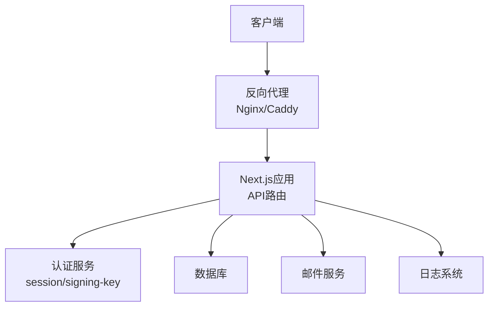
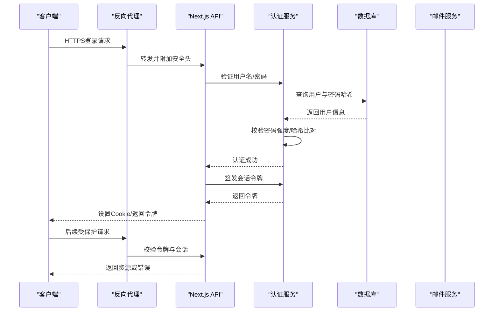
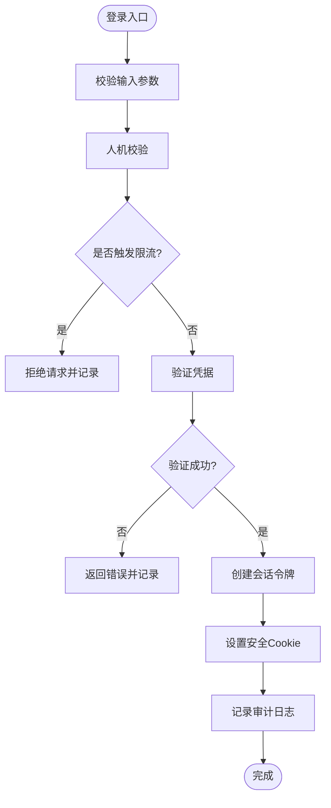
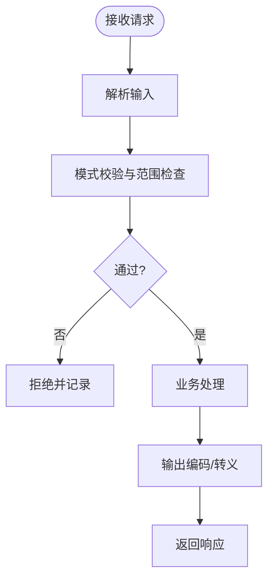
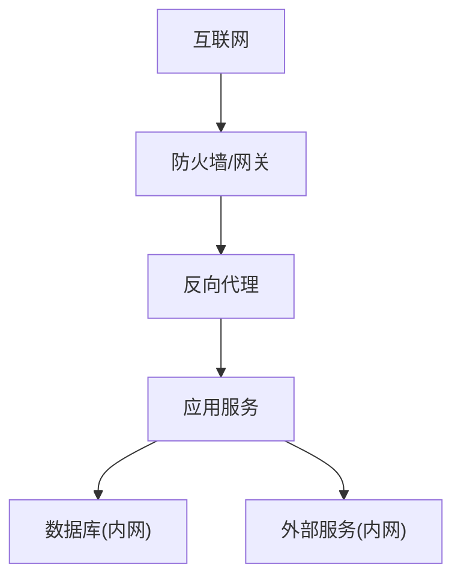
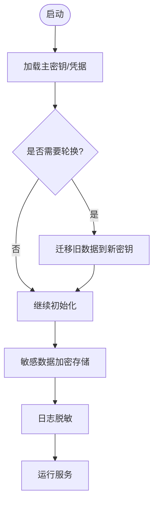
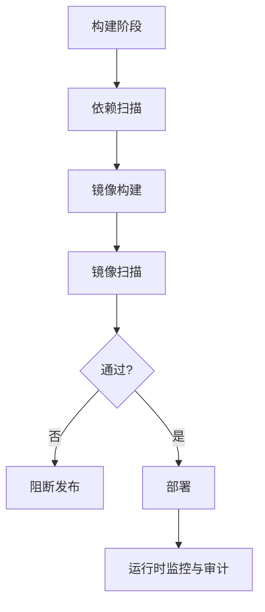
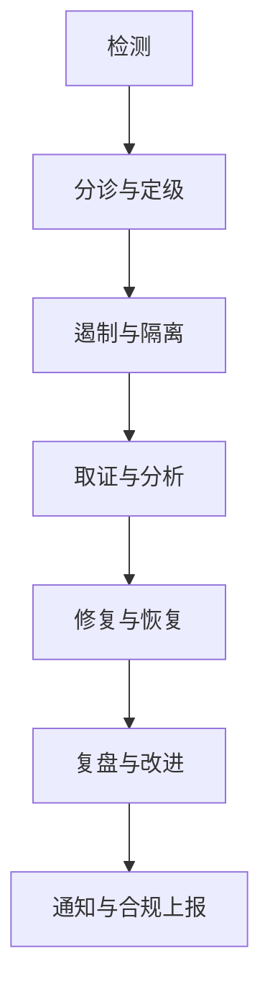
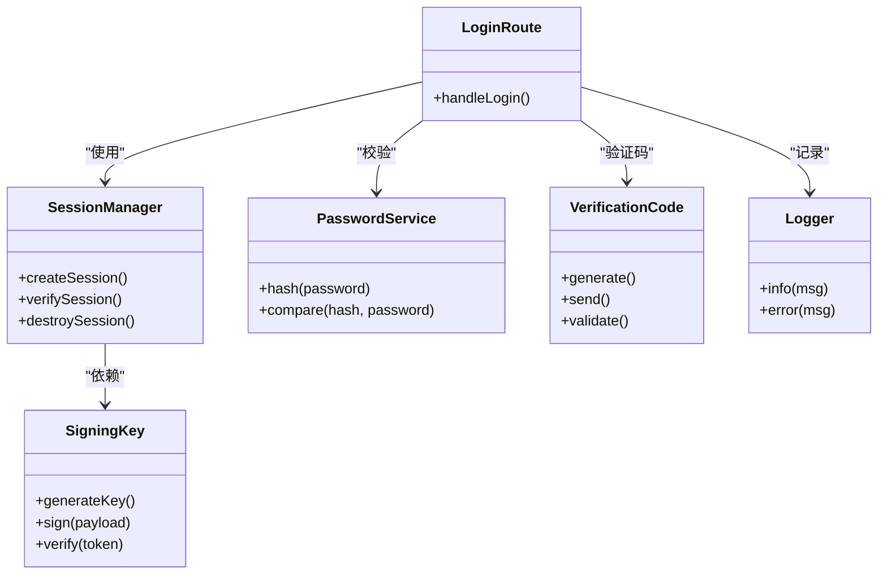

# 安全加固

<cite>
**本文引用的文件**   
- [server/src/index.ts](file://server/src/index.ts)
- [src/app/api/auth/login/route.ts](file://src/app/api/auth/login/route.ts)
- [src/app/api/auth/logout/route.ts](file://src/app/api/auth/logout/route.ts)
- [src/app/api/auth/session/route.ts](file://src/app/api/auth/session/route.ts)
- [src/features/auth/session.ts](file://src/features/auth/session.ts)
- [src/features/auth/signing-key.ts](file://src/features/auth/signing-key.ts)
- [src/features/auth/human-check.ts](file://src/features/auth/human-check.ts)
- [src/features/auth/password.ts](file://src/features/auth/password.ts)
- [src/features/auth/verification-code.ts](file://src/features/auth/verification-code.ts)
- [src/features/auth/mailer.ts](file://src/features/auth/mailer.ts)
- [src/features/auth/account-service.ts](file://src/features/auth/account-service.ts)
- [src/features/auth/errors.ts](file://src/features/auth/errors.ts)
- [src/features/auth/throttle.ts](file://src/features/auth/throttle.ts)
- [src/lib/config/index.ts](file://src/lib/config/index.ts)
- [src/lib/logger.ts](file://src/lib/logger.ts)
- [deploy/reverse-proxy/Dockerfile](file://deploy/reverse-proxy/Dockerfile)
- [deploy/reverse-proxy/entrypoint.sh](file://deploy/reverse-proxy/entrypoint.sh)
- [docker-compose.prod.yml](file://docker-compose.prod.yml)
- [scripts/setup/bootstrap-credentials.ts](file://scripts/setup/bootstrap-credentials.ts)
- [scripts/migration/provision-master-key.ts](file://scripts/migration/provision-master-key.ts)
- [docs/configuration/credentials.md](file://docs/configuration/credentials.md)
- [docs/deployment/runbook.md](file://docs/deployment/runbook.md)
</cite>

## 目录
1. [简介](#简介)
2. [项目结构](#项目结构)
3. [核心组件](#核心组件)
4. [架构总览](#架构总览)
5. [详细组件分析](#详细组件分析)
6. [依赖关系分析](#依赖关系分析)
7. [性能考虑](#性能考虑)
8. [故障排查指南](#故障排查指南)
9. [结论](#结论)
10. [附录](#附录)

## 简介
本指南面向PurpleInk平台生产环境的安全加固，覆盖身份认证与授权、输入输出安全、网络安全、敏感信息管理、安全审计与漏洞扫描、事件响应与合规要求。文档基于仓库中的认证实现、反向代理配置、容器编排与脚本工具进行系统化梳理，并提供可操作的实践建议与可视化图示，帮助团队在生产环境中落地安全基线。

## 项目结构
从安全视角看，关键代码分布在以下位置：
- 服务端入口与运行时：server/src/index.ts
- Next.js API路由（认证相关）：src/app/api/auth/*
- 认证域逻辑：src/features/auth/*
- 配置与日志：src/lib/config/index.ts、src/lib/logger.ts
- 反向代理与安全前置：deploy/reverse-proxy/*
- 容器编排与环境：docker-compose.prod.yml
- 密钥与凭据初始化：scripts/setup/bootstrap-credentials.ts、scripts/migration/provision-master-key.ts
- 配置与部署文档：docs/configuration/credentials.md、docs/deployment/runbook.md

**图表来源** 
- [server/src/index.ts](file://server/src/index.ts)
- [src/app/api/auth/login/route.ts](file://src/app/api/auth/login/route.ts)
- [src/app/api/auth/logout/route.ts](file://src/app/api/auth/logout/route.ts)
- [src/app/api/auth/session/route.ts](file://src/app/api/auth/session/route.ts)
- [src/features/auth/session.ts](file://src/features/auth/session.ts)
- [src/features/auth/signing-key.ts](file://src/features/auth/signing-key.ts)
- [src/lib/logger.ts](file://src/lib/logger.ts)
- [deploy/reverse-proxy/Dockerfile](file://deploy/reverse-proxy/Dockerfile)
- [deploy/reverse-proxy/entrypoint.sh](file://deploy/reverse-proxy/entrypoint.sh)
- [docker-compose.prod.yml](file://docker-compose.prod.yml)

**章节来源**
- [server/src/index.ts](file://server/src/index.ts)
- [src/app/api/auth/login/route.ts](file://src/app/api/auth/login/route.ts)
- [src/app/api/auth/logout/route.ts](file://src/app/api/auth/logout/route.ts)
- [src/app/api/auth/session/route.ts](file://src/app/api/auth/session/route.ts)
- [src/features/auth/session.ts](file://src/features/auth/session.ts)
- [src/features/auth/signing-key.ts](file://src/features/auth/signing-key.ts)
- [src/lib/logger.ts](file://src/lib/logger.ts)
- [deploy/reverse-proxy/Dockerfile](file://deploy/reverse-proxy/Dockerfile)
- [deploy/reverse-proxy/entrypoint.sh](file://deploy/reverse-proxy/entrypoint.sh)
- [docker-compose.prod.yml](file://docker-compose.prod.yml)

## 核心组件
- 认证会话管理：负责会话创建、校验、刷新与销毁，确保令牌签名安全与过期策略合理。
- 密码与验证码：密码哈希、强度校验；验证码生成、发送、校验与防重放。
- 人机校验与限流：防止自动化攻击与暴力破解。
- 反向代理：HTTPS终止、访问控制、请求限制、安全头注入。
- 密钥与凭据：主密钥管理、凭据引导、环境变量隔离。
- 日志与审计：结构化日志、脱敏、集中化收集。

**章节来源**
- [src/features/auth/session.ts](file://src/features/auth/session.ts)
- [src/features/auth/signing-key.ts](file://src/features/auth/signing-key.ts)
- [src/features/auth/password.ts](file://src/features/auth/password.ts)
- [src/features/auth/verification-code.ts](file://src/features/auth/verification-code.ts)
- [src/features/auth/human-check.ts](file://src/features/auth/human-check.ts)
- [src/features/auth/throttle.ts](file://src/features/auth/throttle.ts)
- [deploy/reverse-proxy/Dockerfile](file://deploy/reverse-proxy/Dockerfile)
- [deploy/reverse-proxy/entrypoint.sh](file://deploy/reverse-proxy/entrypoint.sh)
- [scripts/setup/bootstrap-credentials.ts](file://scripts/setup/bootstrap-credentials.ts)
- [scripts/migration/provision-master-key.ts](file://scripts/migration/provision-master-key.ts)
- [src/lib/logger.ts](file://src/lib/logger.ts)

## 架构总览
下图展示生产环境下从客户端到认证服务的调用链路与安全边界。

**图表来源** 
- [src/app/api/auth/login/route.ts](file://src/app/api/auth/login/route.ts)
- [src/app/api/auth/logout/route.ts](file://src/app/api/auth/logout/route.ts)
- [src/app/api/auth/session/route.ts](file://src/app/api/auth/session/route.ts)
- [src/features/auth/session.ts](file://src/features/auth/session.ts)
- [src/features/auth/signing-key.ts](file://src/features/auth/signing-key.ts)
- [src/features/auth/password.ts](file://src/features/auth/password.ts)
- [src/features/auth/account-service.ts](file://src/features/auth/account-service.ts)
- [src/lib/logger.ts](file://src/lib/logger.ts)

## 详细组件分析

### 身份认证与会话管理
- 登录流程：校验凭据、生成会话、设置安全Cookie、记录审计日志。
- 会话校验：解析并验证令牌签名、检查过期时间、权限上下文注入。
- 登出流程：撤销会话、清理Cookie、记录审计日志。
- 令牌安全：使用强随机主密钥、最小化载荷、短生命周期、刷新机制。

**图表来源** 
- [src/app/api/auth/login/route.ts](file://src/app/api/auth/login/route.ts)
- [src/features/auth/human-check.ts](file://src/features/auth/human-check.ts)
- [src/features/auth/throttle.ts](file://src/features/auth/throttle.ts)
- [src/features/auth/password.ts](file://src/features/auth/password.ts)
- [src/features/auth/session.ts](file://src/features/auth/session.ts)
- [src/lib/logger.ts](file://src/lib/logger.ts)

**章节来源**
- [src/app/api/auth/login/route.ts](file://src/app/api/auth/login/route.ts)
- [src/app/api/auth/logout/route.ts](file://src/app/api/auth/logout/route.ts)
- [src/app/api/auth/session/route.ts](file://src/app/api/auth/session/route.ts)
- [src/features/auth/session.ts](file://src/features/auth/session.ts)
- [src/features/auth/signing-key.ts](file://src/features/auth/signing-key.ts)
- [src/features/auth/human-check.ts](file://src/features/auth/human-check.ts)
- [src/features/auth/throttle.ts](file://src/features/auth/throttle.ts)
- [src/features/auth/password.ts](file://src/features/auth/password.ts)
- [src/lib/logger.ts](file://src/lib/logger.ts)

### 输入验证与输出编码
- 输入验证：对API请求体、路径参数、查询参数进行严格校验，拒绝非法类型与长度越界。
- 输出编码：渲染页面时对动态内容转义，避免XSS；对外部数据统一编码后再输出。
- SQL注入防护：使用参数化查询与ORM约束，禁止拼接SQL字符串。
- 最佳实践：白名单校验、最小权限原则、统一错误消息模板。

[本节为通用实践说明，不直接分析具体文件]

### 网络安全配置
- 反向代理：强制HTTPS、启用HSTS、安全头注入（CSP、X-Frame-Options等）、请求大小限制。
- DDoS防护：连接数限制、速率限制、IP黑名单、异常流量检测。
- IP白名单：管理控制台与敏感接口仅允许可信IP访问。
- 网络分区：数据库与外部服务不在公网暴露，使用内网通信。

**图表来源** 
- [deploy/reverse-proxy/Dockerfile](file://deploy/reverse-proxy/Dockerfile)
- [deploy/reverse-proxy/entrypoint.sh](file://deploy/reverse-proxy/entrypoint.sh)
- [docker-compose.prod.yml](file://docker-compose.prod.yml)

**章节来源**
- [deploy/reverse-proxy/Dockerfile](file://deploy/reverse-proxy/Dockerfile)
- [deploy/reverse-proxy/entrypoint.sh](file://deploy/reverse-proxy/entrypoint.sh)
- [docker-compose.prod.yml](file://docker-compose.prod.yml)

### 敏感信息管理
- 主密钥轮换：定期轮换主密钥，支持多版本兼容解密旧数据。
- 日志脱敏：屏蔽密码、令牌、身份证号等敏感字段。
- 传输加密：全站TLS、内部服务mTLS可选。
- 凭据管理：通过环境变量或密钥管理服务注入，禁止硬编码。

**图表来源** 
- [scripts/migration/provision-master-key.ts](file://scripts/migration/provision-master-key.ts)
- [scripts/setup/bootstrap-credentials.ts](file://scripts/setup/bootstrap-credentials.ts)
- [src/lib/logger.ts](file://src/lib/logger.ts)

**章节来源**
- [scripts/migration/provision-master-key.ts](file://scripts/migration/provision-master-key.ts)
- [scripts/setup/bootstrap-credentials.ts](file://scripts/setup/bootstrap-credentials.ts)
- [src/lib/logger.ts](file://src/lib/logger.ts)
- [docs/configuration/credentials.md](file://docs/configuration/credentials.md)

### 安全审计与漏洞扫描
- 依赖包安全检查：CI中集成依赖漏洞扫描，阻断高危依赖。
- 容器镜像扫描：构建镜像后执行镜像安全扫描，阻止不安全镜像上线。
- 代码静态分析：引入规则集，拦截常见安全问题。
- 运行时监控：集中化日志与告警，异常行为自动告警。

[本节为通用实践说明，不直接分析具体文件]

### 安全事件响应流程与合规性
- 事件分级：按影响面与严重性分级，定义响应时限。
- 处置步骤：隔离、取证、修复、复盘、通知。
- 合规要求：数据最小化、访问留痕、保留周期、审计导出。
- 演练与改进：定期演练，更新预案与策略。

[本节为通用实践说明，不直接分析具体文件]

## 依赖关系分析
认证子系统的关键依赖如下：
- API路由依赖会话管理与签名密钥。
- 会话管理依赖主密钥与配置。
- 密码与验证码模块依赖数据库与邮件服务。
- 日志模块贯穿各层用于审计与排障。

**图表来源** 
- [src/app/api/auth/login/route.ts](file://src/app/api/auth/login/route.ts)
- [src/features/auth/session.ts](file://src/features/auth/session.ts)
- [src/features/auth/signing-key.ts](file://src/features/auth/signing-key.ts)
- [src/features/auth/password.ts](file://src/features/auth/password.ts)
- [src/features/auth/verification-code.ts](file://src/features/auth/verification-code.ts)
- [src/lib/logger.ts](file://src/lib/logger.ts)

**章节来源**
- [src/app/api/auth/login/route.ts](file://src/app/api/auth/login/route.ts)
- [src/features/auth/session.ts](file://src/features/auth/session.ts)
- [src/features/auth/signing-key.ts](file://src/features/auth/signing-key.ts)
- [src/features/auth/password.ts](file://src/features/auth/password.ts)
- [src/features/auth/verification-code.ts](file://src/features/auth/verification-code.ts)
- [src/lib/logger.ts](file://src/lib/logger.ts)

## 性能考虑
- 会话校验应缓存热点数据，减少数据库压力。
- 人机校验与限流需具备高可用与快速失败能力。
- 日志写入异步化，避免阻塞主流程。
- 反向代理层做请求裁剪与压缩，降低带宽占用。

[本节为通用实践说明，不直接分析具体文件]

## 故障排查指南
- 认证失败：检查凭据格式、密码哈希算法、会话令牌签名与过期时间。
- 会话异常：核对主密钥一致性、Cookie安全属性、跨域配置。
- 验证码问题：确认邮件服务连通性、验证码有效期与重试策略。
- 限流误伤：查看阈值配置、IP来源与UA特征。
- 日志定位：开启结构化日志，关注错误码与堆栈信息。

**章节来源**
- [src/features/auth/errors.ts](file://src/features/auth/errors.ts)
- [src/features/auth/account-service.ts](file://src/features/auth/account-service.ts)
- [src/features/auth/mailer.ts](file://src/features/auth/mailer.ts)
- [src/lib/logger.ts](file://src/lib/logger.ts)

## 结论
通过强化认证与会话管理、完善输入输出安全、部署反向代理与网络防护、规范敏感信息管理、建立自动化审计与漏洞扫描体系，并结合事件响应与合规要求，PurpleInk平台可在生产环境中达到较高的安全基线。建议持续迭代安全策略，结合监控与演练提升整体韧性。

## 附录
- 配置参考：详见凭据与部署文档，确保环境变量与密钥管理符合安全基线。
- 部署手册：遵循运行手册进行变更与回滚，保证可追溯性与稳定性。

**章节来源**
- [docs/configuration/credentials.md](file://docs/configuration/credentials.md)
- [docs/deployment/runbook.md](file://docs/deployment/runbook.md)