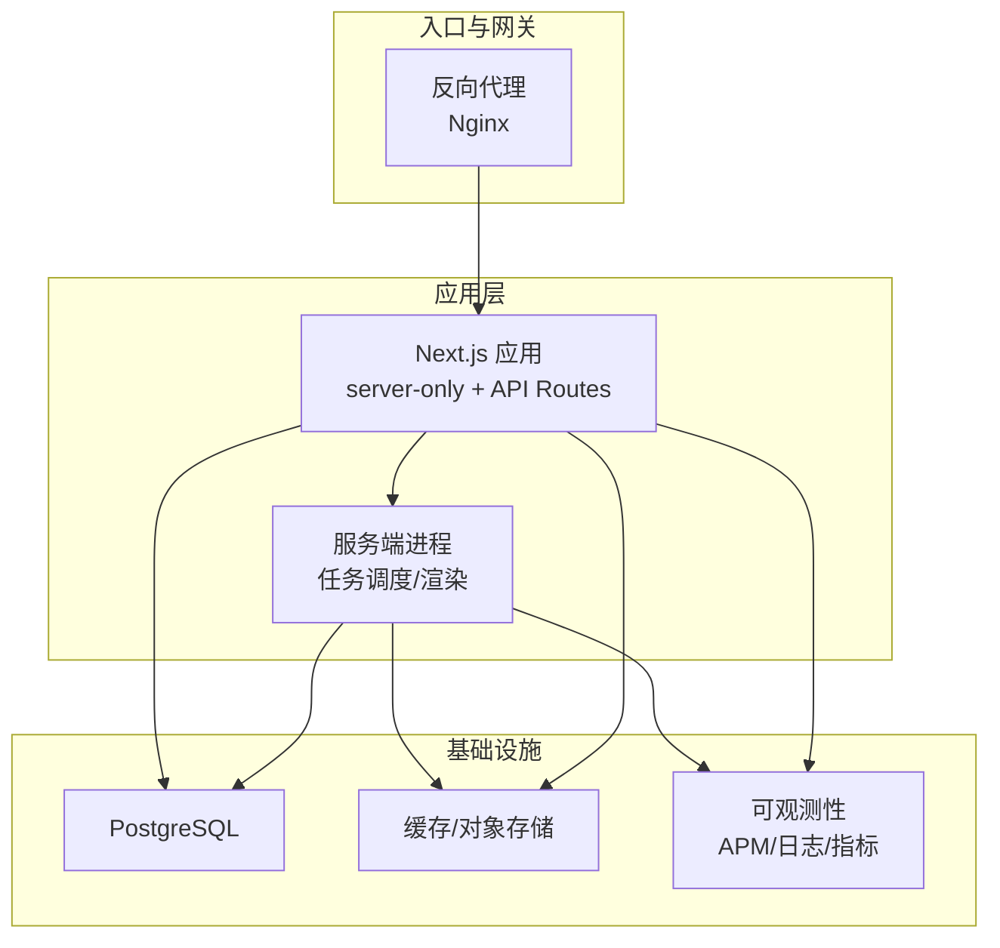
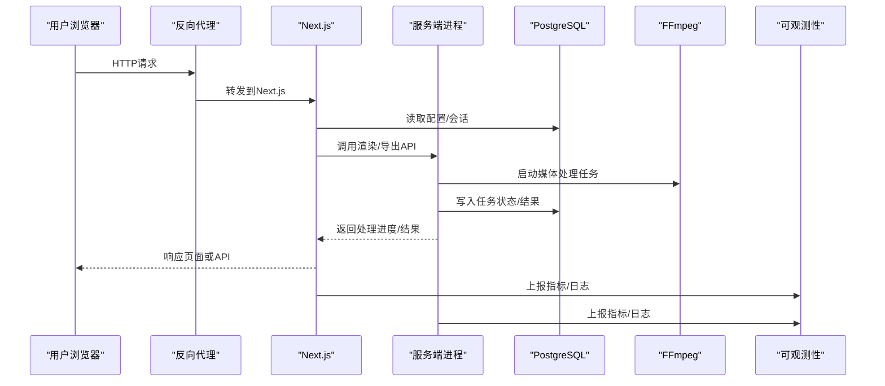
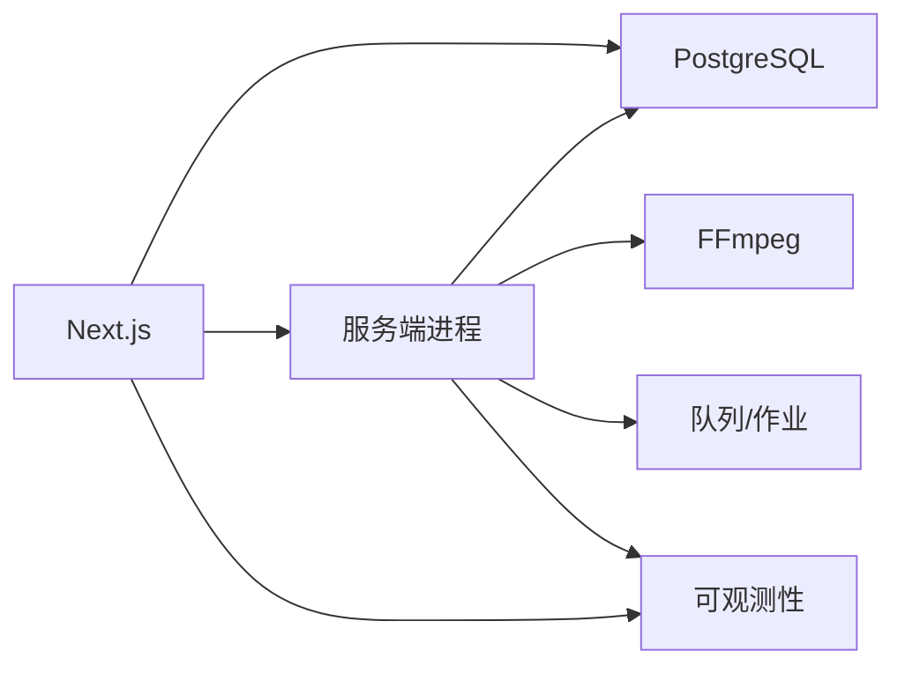

# 性能调优

<cite>
**本文引用的文件**   
- [next.config.ts](file://next.config.ts)
- [package.json](file://package.json)
- [Dockerfile](file://Dockerfile)
- [docker-compose.prod.yml](file://docker-compose.prod.yml)
- [server/package.json](file://server/package.json)
- [server/src/index.ts](file://server/src/index.ts)
- [server/src/server/job-runner.ts](file://server/src/server/job-runner.ts)
- [server/src/server/job-store.ts](file://server/src/server/job-store.ts)
- [src/instrumentation.ts](file://src/instrumentation.ts)
- [drizzle.config.ts](file://drizzle.config.ts)
- [scripts/setup/postgres-init.sql](file://scripts/setup/postgres-init.sql)
- [deploy/reverse-proxy/Dockerfile](file://deploy/reverse-proxy/Dockerfile)
- [deploy/reverse-proxy/entrypoint.sh](file://deploy/reverse-proxy/entrypoint.sh)
- [src/features/render/renderer.ts](file://src/features/render/renderer.ts)
- [src/features/render/media-ffmpeg.test.ts](file://src/features/render/media-ffmpeg.test.ts)
- [src/features/render/export-service.ts](file://src/features/render/export-service.ts)
- [src/features/render/queue-handler.ts](file://src/features/render/queue-handler.ts)
- [src/features/director/queue-handler.ts](file://src/features/director/queue-handler.ts)
- [src/lib/db/index.ts](file://src/lib/db/index.ts)
</cite>

## 目录
1. [简介](#简介)
2. [项目结构](#项目结构)
3. [核心组件](#核心组件)
4. [架构总览](#架构总览)
5. [详细组件分析](#详细组件分析)
6. [依赖关系分析](#依赖关系分析)
7. [性能注意事项](#性能注意事项)
8. [故障排查指南](#故障排查指南)
9. [结论](#结论)
10. [附录](#附录)

## 简介
本指南面向PurpleInk平台生产环境的性能调优，覆盖以下关键领域：
- Node.js进程管理（PM2集群、内存限制、CPU绑定）
- PostgreSQL连接池与查询优化
- Next.js应用性能（静态资源、代码分割、缓存策略、增量静态生成）
- 媒体处理优化（FFmpeg参数、并发控制、内存管理）
- 监控与可观测性（APM、日志聚合、指标采集）
- 基准测试方法与常见问题诊断

## 项目结构
PurpleInk采用Next.js作为前端与API服务，服务端通过独立的Node服务运行渲染与任务编排。部署使用Docker与反向代理，数据库为PostgreSQL并通过Drizzle进行迁移与类型安全访问。

图表来源
- [Dockerfile](file://Dockerfile)
- [docker-compose.prod.yml](file://docker-compose.prod.yml)
- [deploy/reverse-proxy/Dockerfile](file://deploy/reverse-proxy/Dockerfile)
- [deploy/reverse-proxy/entrypoint.sh](file://deploy/reverse-proxy/entrypoint.sh)

章节来源
- [Dockerfile](file://Dockerfile)
- [docker-compose.prod.yml](file://docker-compose.prod.yml)
- [deploy/reverse-proxy/Dockerfile](file://deploy/reverse-proxy/Dockerfile)
- [deploy/reverse-proxy/entrypoint.sh](file://deploy/reverse-proxy/entrypoint.sh)

## 核心组件
- Next.js应用：提供页面渲染、API路由与静态资源服务
- 服务端进程：负责作业调度、渲染管线执行与媒体处理
- 数据库层：PostgreSQL连接池、迁移与数据访问
- 媒体处理：基于FFmpeg的编码、转码与合成
- 可观测性：APM、结构化日志与指标上报

章节来源
- [next.config.ts](file://next.config.ts)
- [server/src/index.ts](file://server/src/index.ts)
- [src/lib/db/index.ts](file://src/lib/db/index.ts)
- [src/features/render/renderer.ts](file://src/features/render/renderer.ts)
- [src/features/render/media-ffmpeg.test.ts](file://src/features/render/media-ffmpeg.test.ts)

## 架构总览
下图展示生产环境请求流与关键子系统交互：

图表来源
- [next.config.ts](file://next.config.ts)
- [server/src/index.ts](file://server/src/index.ts)
- [src/lib/db/index.ts](file://src/lib/db/index.ts)
- [src/features/render/renderer.ts](file://src/features/render/renderer.ts)

## 详细组件分析

### Node.js进程管理与PM2集群
- 目标：提升吞吐与容错能力，避免单点OOM导致服务中断
- 建议配置要点：
  - 启用集群模式，实例数等于CPU核数或略低，避免上下文切换开销
  - 设置内存上限（如每实例1.5-2GB），触发自动重启
  - CPU亲和性绑定，减少跨核迁移
  - 优雅重启与滚动更新，保证零停机发布
  - 健康检查与就绪探针，配合容器编排
- 在容器中运行时，结合环境变量注入PM2配置，确保每次启动一致

章节来源
- [package.json](file://package.json)
- [server/package.json](file://server/package.json)
- [Dockerfile](file://Dockerfile)
- [docker-compose.prod.yml](file://docker-compose.prod.yml)

### PostgreSQL连接池与查询优化
- 连接池参数：
  - 最大连接数：根据CPU核数与I/O能力估算，通常=CPU*2~4
  - 最小连接数：保持预热，降低冷启动延迟
  - 空闲超时与存活时间：避免僵尸连接
  - 查询超时：防止长事务拖垮连接池
- 查询优化：
  - 合理使用索引与覆盖索引
  - 分页与批量操作，避免一次性加载大结果集
  - 读写分离（只读副本）分担热点查询
  - 慢查询日志与EXPLAIN分析
- Drizzle迁移与类型安全访问，确保SQL一致性

章节来源
- [drizzle.config.ts](file://drizzle.config.ts)
- [scripts/setup/postgres-init.sql](file://scripts/setup/postgres-init.sql)
- [src/lib/db/index.ts](file://src/lib/db/index.ts)

### Next.js应用性能优化
- 静态资源优化：
  - 启用图片优化与按需加载
  - 字体子集化与预加载关键资源
  - 压缩与CDN缓存策略
- 代码分割：
  - 按路由与组件懒加载
  - 第三方库按需引入，避免打包体积膨胀
- 缓存策略：
  - 浏览器强缓存与ETag
  - 服务端缓存（Redis/Memcached）热点数据
- 增量静态生成（ISR）：
  - 对内容型页面启用ISR，缩短构建时间并提高命中率
  - 合理设置revalidate与fallback策略

章节来源
- [next.config.ts](file://next.config.ts)

### 媒体处理优化（FFmpeg）
- 参数调优：
  - 选择合适的编码器与预设（速度/质量权衡）
  - 控制分辨率、码率与帧率，避免过度编码
  - 使用硬件加速（GPU/NVENC）提升吞吐
- 并发与内存：
  - 限制同时运行的FFmpeg进程数，避免OOM
  - 分块处理与流式输出，降低峰值内存
  - 失败重试与断点续传
- 队列与优先级：
  - 区分高/中/低优先级任务
  - 背压与限流，保护下游依赖

章节来源
- [src/features/render/renderer.ts](file://src/features/render/renderer.ts)
- [src/features/render/media-ffmpeg.test.ts](file://src/features/render/media-ffmpeg.test.ts)
- [src/features/render/export-service.ts](file://src/features/render/export-service.ts)
- [src/features/render/queue-handler.ts](file://src/features/render/queue-handler.ts)

### 任务调度与队列
- 作业运行器：
  - 支持多阶段流水线与状态机推进
  - 失败重试与退避策略
- 队列处理器：
  - 并发控制与限速
  - 幂等性与去重
- 持久化：
  - 任务状态落库，支持恢复与审计

章节来源
- [server/src/server/job-runner.ts](file://server/src/server/job-runner.ts)
- [server/src/server/job-store.ts](file://server/src/server/job-store.ts)
- [src/features/director/queue-handler.ts](file://src/features/director/queue-handler.ts)

### 可观测性与监控集成
- APM：
  - 接入OpenTelemetry或商业APM，追踪请求链路
  - 自定义埋点：数据库、外部API、FFmpeg任务
- 日志聚合：
  - 结构化JSON日志，统一收集到ELK/Loki
  - 敏感信息脱敏
- 指标采集：
  - 暴露Prometheus端点，采集QPS、延迟、错误率、资源使用
  - 告警规则：CPU/内存/连接池/队列积压

章节来源
- [src/instrumentation.ts](file://src/instrumentation.ts)

## 依赖关系分析
下图展示关键模块间的依赖与调用关系：

图表来源
- [next.config.ts](file://next.config.ts)
- [server/src/index.ts](file://server/src/index.ts)
- [src/lib/db/index.ts](file://src/lib/db/index.ts)
- [src/features/render/renderer.ts](file://src/features/render/renderer.ts)
- [src/instrumentation.ts](file://src/instrumentation.ts)

章节来源
- [server/src/index.ts](file://server/src/index.ts)
- [src/lib/db/index.ts](file://src/lib/db/index.ts)
- [src/features/render/renderer.ts](file://src/features/render/renderer.ts)
- [src/instrumentation.ts](file://src/instrumentation.ts)

## 性能注意事项
- 容量规划：
  - 根据峰值QPS与平均延迟计算所需实例数与CPU/内存
  - 数据库连接数与磁盘I/O预留余量
- 资源隔离：
  - 容器级别限制CPU与内存，避免相互影响
  - 网络带宽与磁盘IO配额
- 缓存命中：
  - 热点数据缓存与失效策略
  - 静态资源CDN缓存与版本化
- 降级与熔断：
  - 外部依赖不可用时的快速失败与回退
  - 队列积压时的限流与丢弃策略

## 故障排查指南
- 常见症状：
  - 高延迟与超时：检查连接池耗尽、慢查询、FFmpeg阻塞
  - OOM崩溃：查看内存上限、大对象处理、并发过高
  - 队列积压：确认消费者数量、任务耗时、依赖可用性
- 诊断步骤：
  - 查看APM链路，定位瓶颈节点
  - 检查数据库慢查询与锁等待
  - 监控FFmpeg进程与资源占用
  - 分析日志中的错误堆栈与重试次数
- 恢复策略：
  - 扩容实例与连接池
  - 清理大对象与临时文件
  - 调整队列并发与超时参数

## 结论
通过合理的进程管理、数据库连接池优化、Next.js性能调优与媒体处理优化，结合完善的监控与可观测性体系，PurpleInk在生产环境中可实现高吞吐、低延迟与稳定可靠的运行表现。持续的性能基准测试与问题诊断是保障长期稳定性的关键。

## 附录
- 基准测试方法：
  - 使用负载工具模拟真实流量，测量QPS、P95/P99延迟与错误率
  - 分阶段压测：冷启动、稳态、峰值与恢复
  - 记录资源使用与GC行为，识别瓶颈
- 常用命令与工具：
  - PM2：集群启动、内存监控、日志查看
  - pg_stat_statements：慢查询分析
  - Prometheus/Grafana：指标可视化与告警
  - FFmpeg统计：编码速度与资源占用