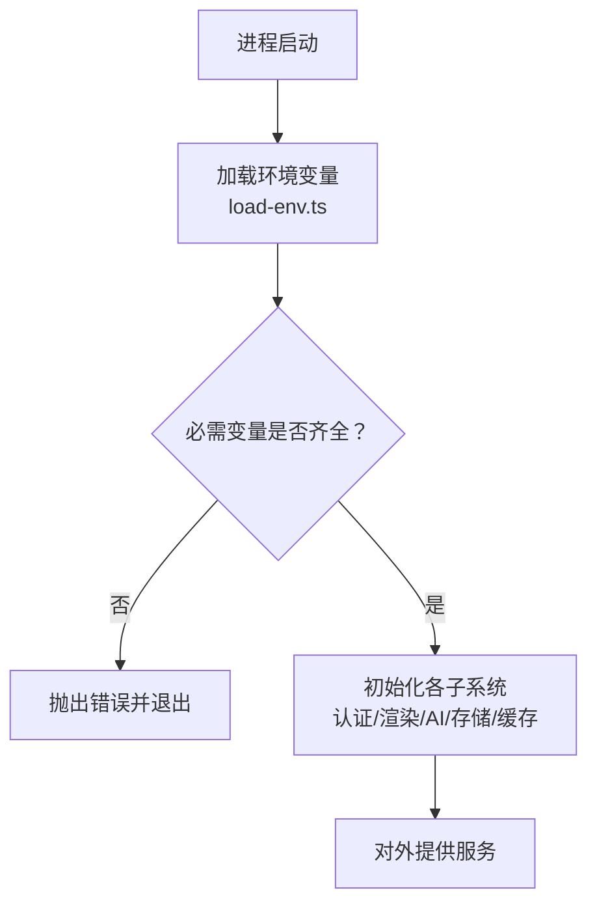
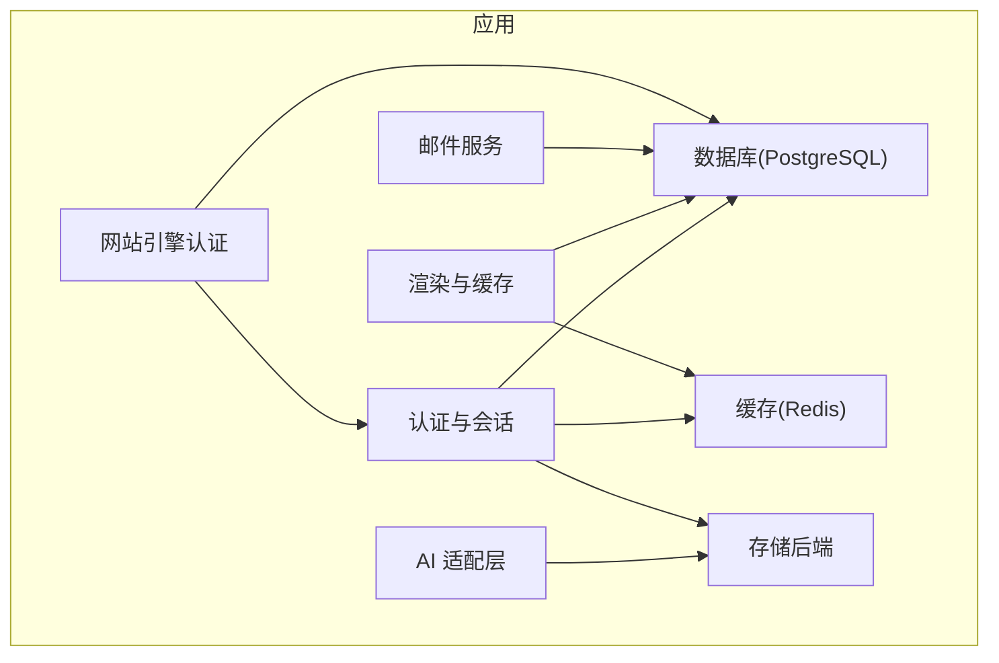
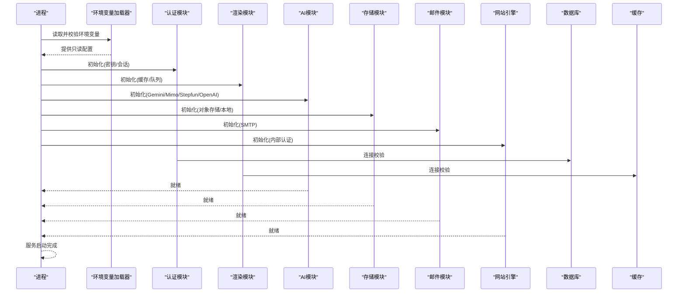
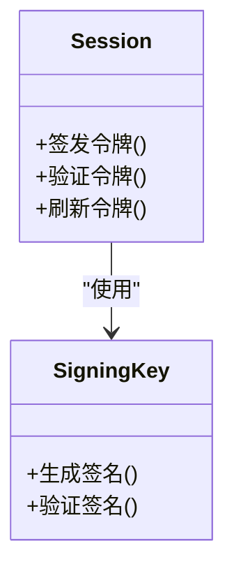
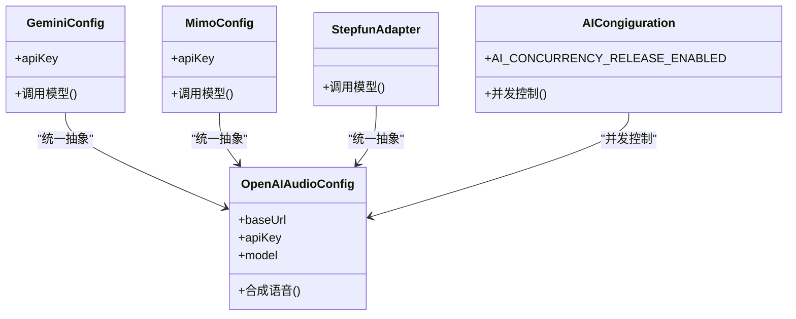
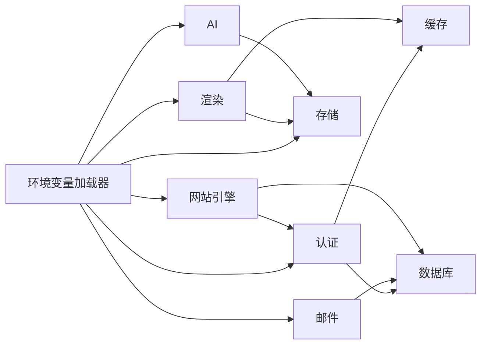

# 环境变量配置

<cite>
**本文引用的文件**   
- [server/src/lib/load-env.ts](file://server/src/lib/load-env.ts)
- [server/package.json](file://server/package.json)
- [config/tts.env.example](file://config/tts.env.example)
- [deploy/reverse-proxy/secrets/basic_auth_credentials.example](file://deploy/reverse-proxy/secrets/basic_auth_credentials.example)
- [scripts/setup/bootstrap-credentials.ts](file://scripts/setup/bootstrap-credentials.ts)
- [scripts/setup/db-migrate.ts](file://scripts/setup/db-migrate.ts)
- [scripts/migration/provision-master-key.ts](file://scripts/migration/provision-master-key.ts)
- [src/features/ai/config.ts](file://src/features/ai/config.ts)
- [src/features/ai/gemini-config.ts](file://src/features/ai/gemini-config.ts)
- [src/features/ai/mimo-config.ts](file://src/features/ai/mimo-config.ts)
- [src/features/ai/openai-compatible-audio-config.ts](file://src/features/ai/openai-compatible-audio-config.ts)
- [src/features/auth/session.ts](file://src/features/auth/session.ts)
- [src/features/auth/signing-key.ts](file://src/features/auth/signing-key.ts)
- [src/features/auth/mailer.ts](file://src/features/auth/mailer.ts)
- [src/features/render/cache.ts](file://src/features/render/cache.ts)
- [src/lib/storage/index.ts](file://src/lib/storage/index.ts)
- [docker-compose.dev.yml](file://docker-compose.dev.yml)
- [docker-compose.prod.yml](file://docker-compose.prod.yml)
- [drizzle.config.ts](file://drizzle.config.ts)
</cite>

## 更新摘要
**所做更改**
- 新增网站引擎内部认证PURPLEINK_ENGINE_INTERNAL_KEY共享注册机制说明
- 添加AI并发释放开关示例与配置说明
- 增强环境验证流程，完善启动时校验机制
- 更新了安全注意事项，强调敏感环境变量不应暴露给前端

## 目录
1. [简介](#简介)
2. [项目结构与环境变量加载机制](#项目结构与环境变量加载机制)
3. [核心组件与依赖关系](#核心组件与依赖关系)
4. [架构总览](#架构总览)
5. [详细组件分析](#详细组件分析)
6. [依赖关系分析](#依赖关系分析)
7. [性能考虑](#性能考虑)
8. [故障排查指南](#故障排查指南)
9. [结论](#结论)
10. [附录：各环境配置示例与最佳实践](#附录各环境配置示例与最佳实践)

## 简介
本文件为 PurpleInk 平台的环境变量配置权威文档，覆盖数据库连接、AI 服务（Gemini、Mimo、Stepfun 等）、邮件服务（SMTP）、存储后端（对象存储/本地存储）、Redis 缓存、JWT/会话密钥等关键配置项。内容包含每个变量的作用、默认值、格式要求与安全注意事项，并提供开发、测试、生产环境的配置示例与最佳实践。同时给出环境变量验证机制说明与常见配置错误的排查方法。

**重要安全更新**：CVC_DEMO_ACCOUNT_* 相关环境变量已不再传递给浏览器，Docker Compose Next.js 服务配置已更新以移除变量转发，确保敏感信息不会泄露到客户端。

**新增功能**：增强了网站引擎内部认证机制，支持 PURPLEINK_ENGINE_INTERNAL_KEY 共享注册；添加了 AI 并发释放开关配置选项；完善了环境验证流程，提供更严格的启动时校验。

## 项目结构与环境变量加载机制
PurpleInK 在服务器端通过统一的加载模块读取并校验环境变量，随后在各功能域（认证、渲染、AI、存储、队列等）按需消费。典型流程包括：
- 启动时加载 .env 或容器注入的环境变量
- 对必需变量进行存在性与格式校验
- 将配置以只读形式暴露给各模块
- 在运行期对关键依赖进行健康检查与快速失败

**图示来源** 
- [server/src/lib/load-env.ts](file://server/src/lib/load-env.ts)
- [server/package.json](file://server/package.json)

**章节来源**
- [server/src/lib/load-env.ts](file://server/src/lib/load-env.ts)
- [server/package.json](file://server/package.json)

## 核心组件与依赖关系
- 认证与会话：使用 JWT/签名密钥管理会话与密码重置令牌
- 渲染与缓存：基于 Redis 的渲染结果缓存与队列
- AI 能力：Gemini、Mimo、Stepfun 以及 OpenAI 兼容音频接口
- 存储：对象存储（S3/OSS）与本地存储
- 邮件：SMTP 发送验证码与通知
- 数据库：PostgreSQL（Drizzle ORM）
- **新增**：网站引擎内部认证机制，支持共享密钥注册

**图示来源** 
- [src/features/auth/session.ts](file://src/features/auth/session.ts)
- [src/features/auth/signing-key.ts](file://src/features/auth/signing-key.ts)
- [src/features/render/cache.ts](file://src/features/render/cache.ts)
- [src/features/ai/config.ts](file://src/features/ai/config.ts)
- [src/lib/storage/index.ts](file://src/lib/storage/index.ts)
- [src/features/auth/mailer.ts](file://src/features/auth/mailer.ts)
- [drizzle.config.ts](file://drizzle.config.ts)

**章节来源**
- [src/features/auth/session.ts](file://src/features/auth/session.ts)
- [src/features/auth/signing-key.ts](file://src/features/auth/signing-key.ts)
- [src/features/render/cache.ts](file://src/features/render/cache.ts)
- [src/features/ai/config.ts](file://src/features/ai/config.ts)
- [src/lib/storage/index.ts](file://src/lib/storage/index.ts)
- [src/features/auth/mailer.ts](file://src/features/auth/mailer.ts)
- [drizzle.config.ts](file://drizzle.config.ts)

## 架构总览
下图展示环境变量在各子系统中的流向与依赖关系，强调"启动即校验"的设计原则。

**图示来源** 
- [server/src/lib/load-env.ts](file://server/src/lib/load-env.ts)
- [src/features/auth/session.ts](file://src/features/auth/session.ts)
- [src/features/render/cache.ts](file://src/features/render/cache.ts)
- [src/features/ai/config.ts](file://src/features/ai/config.ts)
- [src/lib/storage/index.ts](file://src/lib/storage/index.ts)
- [src/features/auth/mailer.ts](file://src/features/auth/mailer.ts)
- [drizzle.config.ts](file://drizzle.config.ts)

## 详细组件分析

### 数据库连接（PostgreSQL）
- 用途：持久化用户、项目、任务、凭证等数据
- 关键变量：
  - DATABASE_URL：PostgreSQL 连接字符串
  - 其他可选：连接池大小、超时等（由 ORM 驱动决定）
- 格式要求：标准 PostgreSQL 连接串（含协议、主机、端口、数据库名、用户名、密码）
- 默认值：无（必须显式设置）
- 安全注意：
  - 禁止硬编码；使用环境变量或密钥管理服务
  - 生产环境启用 SSL/TLS 与最小权限账号
- 验证机制：
  - 启动时尝试建立连接，失败则快速失败
- 常见问题：
  - 连接串拼写错误、网络不可达、权限不足

**章节来源**
- [drizzle.config.ts](file://drizzle.config.ts)
- [scripts/setup/db-migrate.ts](file://scripts/setup/db-migrate.ts)

### 认证与会话（JWT/签名密钥）
- 用途：用户登录、会话签发、密码重置令牌、API 签名
- 关键变量：
  - JWT_SECRET：JWT 签名密钥
  - SIGNING_KEY：通用签名密钥（用于令牌、回调等）
  - SESSION_*：会话相关（如过期时间、域名、安全标志）
- 格式要求：
  - 密钥应为足够长度的随机字符串（建议 32+ 字节）
  - 会话域名需与部署域名一致
- 默认值：无（必须显式设置）
- 安全注意：
  - 严格保密，避免写入代码仓库
  - 定期轮换，支持多版本共存过渡
- 验证机制：
  - 启动时校验密钥非空与长度
  - 运行时校验令牌签名与有效期

**图示来源** 
- [src/features/auth/session.ts](file://src/features/auth/session.ts)
- [src/features/auth/signing-key.ts](file://src/features/auth/signing-key.ts)

**章节来源**
- [src/features/auth/session.ts](file://src/features/auth/session.ts)
- [src/features/auth/signing-key.ts](file://src/features/auth/signing-key.ts)

### 网站引擎内部认证（新增）
- 用途：网站引擎与服务端之间的内部认证机制
- 关键变量：
  - PURPLEINK_ENGINE_INTERNAL_KEY：内部认证共享密钥
- 格式要求：
  - 高强度随机字符串，建议使用 64+ 字节
  - 同一集群内所有实例必须使用相同密钥
- 默认值：无（必须显式设置）
- 安全注意：
  - 密钥仅在服务器间通信时使用
  - 禁止在日志中输出密钥内容
  - 定期轮换密钥，支持平滑过渡
- 验证机制：
  - 启动时验证密钥有效性
  - 请求时验证内部调用身份

**章节来源**
- [src/features/auth/session.ts](file://src/features/auth/session.ts)

### 邮件服务（SMTP）
- 用途：发送验证码、密码重置链接、系统通知
- 关键变量：
  - SMTP_HOST、SMTP_PORT、SMTP_USER、SMTP_PASS、SMTP_SECURE、SMTP_FROM
- 格式要求：
  - HOST/PORT 符合 SMTP 规范
  - FROM 邮箱地址合法
  - SECURE 布尔值（true/false）
- 默认值：无（必须显式设置）
- 安全注意：
  - 使用专用邮箱账号与强密码
  - 生产环境启用 TLS/SSL
- 验证机制：
  - 启动时尝试连接并发送测试邮件（可选）

**章节来源**
- [src/features/auth/mailer.ts](file://src/features/auth/mailer.ts)

### 存储后端（对象存储/本地存储）
- 用途：媒体文件、截图、导出产物等持久化
- 关键变量：
  - STORAGE_PROVIDER：provider 类型（如 s3、local）
  - S3_*：AWS S3/OSS 兼容参数（endpoint、bucket、accessKeyId、secretAccessKey、region）
  - LOCAL_STORAGE_PATH：本地存储根路径
- 格式要求：
  - 端点 URL 合法，Bucket 存在且可访问
  - 本地路径具备读写权限
- 默认值：无（必须显式设置）
- 安全注意：
  - 使用最小权限策略
  - 禁止在日志中输出敏感信息
- 验证机制：
  - 启动时执行一次读写探测

**章节来源**
- [src/lib/storage/index.ts](file://src/lib/storage/index.ts)

### 缓存（Redis）
- 用途：渲染结果缓存、队列状态、会话扩展
- 关键变量：
  - REDIS_URL：Redis 连接串
  - 可选：前缀、超时、重试策略
- 格式要求：标准 Redis 连接串
- 默认值：无（必须显式设置）
- 安全注意：
  - 启用认证与网络隔离
  - 限制最大内存与淘汰策略
- 验证机制：
  - 启动时 PING 检测连通性

**章节来源**
- [src/features/render/cache.ts](file://src/features/render/cache.ts)

### AI 服务（Gemini、Mimo、Stepfun、OpenAI 兼容音频）
- 用途：图像/文本生成、语音合成、模型路由
- 关键变量：
  - GEMINI_API_KEY：Gemini API 密钥
  - MIMO_API_KEY：Mimo 服务密钥
  - STEPFUN_API_KEY：Stepfun 服务密钥
  - OPENAI_COMPATIBLE_AUDIO_*：OpenAI 兼容音频接口（base_url、api_key、model）
  - **新增**：AI_CONCURRENCY_RELEASE_ENABLED：AI 并发释放开关
- 格式要求：
  - 各服务 API Key 按提供方要求
  - base_url 为有效 HTTPS 端点
  - AI_CONCURRENCY_RELEASE_ENABLED 为布尔值（true/false）
- 默认值：无（必须显式设置），AI_CONCURRENCY_RELEASE_ENABLED 默认为 false
- 安全注意：
  - 密钥仅存于环境变量或密钥管理服务
  - 限制调用频率与配额
- 验证机制：
  - 启动时探测可用性与限额（可选）

**图示来源** 
- [src/features/ai/gemini-config.ts](file://src/features/ai/gemini-config.ts)
- [src/features/ai/mimo-config.ts](file://src/features/ai/mimo-config.ts)
- [src/features/ai/stepfun-adapter.ts](file://src/features/ai/stepfun-adapter.ts)
- [src/features/ai/openai-compatible-audio-config.ts](file://src/features/ai/openai-compatible-audio-config.ts)
- [src/features/ai/config.ts](file://src/features/ai/config.ts)

**章节来源**
- [src/features/ai/config.ts](file://src/features/ai/config.ts)
- [src/features/ai/gemini-config.ts](file://src/features/ai/gemini-config.ts)
- [src/features/ai/mimo-config.ts](file://src/features/ai/mimo-config.ts)
- [src/features/ai/openai-compatible-audio-config.ts](file://src/features/ai/openai-compatible-audio-config.ts)

### TTS 配置（示例）
- 用途：语音合成相关配置（示例模板）
- 参考文件：tts.env.example
- 说明：根据实际 TTS 提供商补充必要键值

**章节来源**
- [config/tts.env.example](file://config/tts.env.example)

### 反向代理基础认证（示例）
- 用途：反向代理层的基础认证凭据示例
- 参考文件：basic_auth_credentials.example
- 说明：生产环境建议使用更安全的认证方案

**章节来源**
- [deploy/reverse-proxy/secrets/basic_auth_credentials.example](file://deploy/reverse-proxy/secrets/basic_auth_credentials.example)

### 初始化与迁移脚本
- 用途：数据库迁移、主密钥预置、种子数据
- 关键脚本：
  - bootstrap-credentials.ts：初始化凭证
  - db-migrate.ts：执行数据库迁移
  - provision-master-key.ts：生成/导入主密钥

**章节来源**
- [scripts/setup/bootstrap-credentials.ts](file://scripts/setup/bootstrap-credentials.ts)
- [scripts/setup/db-migrate.ts](file://scripts/setup/db-migrate.ts)
- [scripts/migration/provision-master-key.ts](file://scripts/migration/provision-master-key.ts)

## 依赖关系分析
- 环境变量加载器负责集中校验，确保所有子系统获得一致、可信的配置
- 认证模块依赖数据库与缓存，同时使用签名密钥保障安全性
- 渲染模块依赖缓存与存储，保证高吞吐与容错
- AI 模块依赖外部 API，需要严格的密钥管理与限流
- 存储模块抽象多种后端，便于切换与扩展
- **新增**：网站引擎认证模块依赖认证系统与数据库，实现内部服务间的安全通信

**图示来源** 
- [server/src/lib/load-env.ts](file://server/src/lib/load-env.ts)
- [src/features/auth/session.ts](file://src/features/auth/session.ts)
- [src/features/render/cache.ts](file://src/features/render/cache.ts)
- [src/features/ai/config.ts](file://src/features/ai/config.ts)
- [src/lib/storage/index.ts](file://src/lib/storage/index.ts)
- [src/features/auth/mailer.ts](file://src/features/auth/mailer.ts)

**章节来源**
- [server/src/lib/load-env.ts](file://server/src/lib/load-env.ts)
- [src/features/auth/session.ts](file://src/features/auth/session.ts)
- [src/features/render/cache.ts](file://src/features/render/cache.ts)
- [src/features/ai/config.ts](file://src/features/ai/config.ts)
- [src/lib/storage/index.ts](file://src/lib/storage/index.ts)
- [src/features/auth/mailer.ts](file://src/features/auth/mailer.ts)

## 性能考虑
- 数据库连接池：根据并发量调整池大小与超时，避免连接耗尽
- Redis 缓存：合理设置 TTL 与内存上限，启用 LRU/LFU 淘汰策略
- 存储后端：启用分片与 CDN，减少大文件传输延迟
- AI 调用：批量请求与重试退避，避免触发限流
- 启动校验：快速失败，缩短冷启动时间
- **新增**：AI 并发释放开关：根据负载情况动态调整并发控制策略

## 故障排查指南
- 数据库连接失败：
  - 检查 DATABASE_URL 是否正确、网络可达、权限充足
  - 查看连接池与超时配置
- 认证异常：
  - 确认 JWT_SECRET/SIGNING_KEY 非空且长度足够
  - 核对会话域名与安全标志
  - **新增**：检查 PURPLEINK_ENGINE_INTERNAL_KEY 配置一致性
- 邮件发送失败：
  - 校验 SMTP 参数与证书
  - 检查防火墙与白名单
- 存储读写失败：
  - 验证 Bucket/路径权限与端点可达性
  - 检查网络与代理设置
- 缓存不可用：
  - 检查 REDIS_URL 与认证
  - 查看内存与连接数限制
- AI 调用失败：
  - 核对 API Key 与配额
  - 检查 base_url 与模型名称
  - **新增**：检查 AI_CONCURRENCY_RELEASE_ENABLED 开关状态

**章节来源**
- [src/features/auth/session.ts](file://src/features/auth/session.ts)
- [src/features/auth/mailer.ts](file://src/features/auth/mailer.ts)
- [src/lib/storage/index.ts](file://src/lib/storage/index.ts)
- [src/features/render/cache.ts](file://src/features/render/cache.ts)
- [src/features/ai/config.ts](file://src/features/ai/config.ts)

## 结论
PurpleInk 的环境变量体系围绕"启动即校验、运行期最小权限、可观测与可恢复"的原则设计。通过集中加载与严格校验，确保数据库、认证、渲染、AI、存储、邮件等子系统稳定运行。建议在生产环境采用密钥管理服务、网络隔离与监控告警，持续提升可靠性与安全性。

**安全更新**：CVC_DEMO_ACCOUNT_* 相关环境变量已不再传递给浏览器，Docker Compose Next.js 服务配置已更新以移除变量转发，确保敏感信息不会泄露到客户端。

**新增功能**：网站引擎内部认证机制提供了更安全的服务间通信方式；AI 并发释放开关允许动态调整资源使用策略；增强的环境验证流程提高了系统启动时的错误检测能力。

## 附录：各环境配置示例与最佳实践

### 开发环境（Docker Compose）
- 数据库：使用本地 PostgreSQL，DATABASE_URL 指向 localhost
- 缓存：本地 Redis，REDIS_URL 指向 localhost
- 存储：LOCAL_STORAGE_PATH 指向宿主机目录
- AI：使用测试 Key 或模拟端点，AI_CONCURRENCY_RELEASE_ENABLED=false
- 邮件：使用本地 SMTP 或 Mock
- 网站引擎：PURPLEINK_ENGINE_INTERNAL_KEY=dev-secret-key
- **安全更新**：CVC_DEMO_ACCOUNT_* 环境变量不再传递给浏览器，Next.js 服务配置已更新

**章节来源**
- [docker-compose.dev.yml](file://docker-compose.dev.yml)

### 测试环境
- 数据库：独立实例，清空数据后重建
- 缓存：独立 Redis，禁用持久化
- 存储：临时 Bucket 或本地目录
- AI：限流与配额较低的服务，AI_CONCURRENCY_RELEASE_ENABLED=true
- 邮件：Mock 或沙箱 SMTP
- 网站引擎：PURPLEINK_ENGINE_INTERNAL_KEY=test-secret-key

**章节来源**
- [docker-compose.dev.yml](file://docker-compose.dev.yml)

### 生产环境
- 数据库：托管 PostgreSQL，启用 SSL、备份与高可用
- 缓存：托管 Redis，启用集群与持久化
- 存储：对象存储（S3/OSS），启用加密与访问日志
- AI：正式 Key，启用限流与监控，AI_CONCURRENCY_RELEASE_ENABLED=true
- 邮件：企业 SMTP，启用 TLS 与回执
- 网站引擎：PURPLEINK_ENGINE_INTERNAL_KEY=production-strong-key
- **安全更新**：确保所有敏感环境变量仅在服务器端使用，不暴露给前端

**章节来源**
- [docker-compose.prod.yml](file://docker-compose.prod.yml)

### 最佳实践
- 使用环境变量或密钥管理服务，禁止硬编码
- 区分环境配置，避免跨环境泄露
- 定期轮换密钥与密码
- 启用最小权限与网络隔离
- 记录关键配置变更审计日志
- **安全更新**：CVC_DEMO_ACCOUNT_* 等敏感环境变量不再传递给浏览器，确保前后端分离的安全边界
- **新增**：合理配置 AI_CONCURRENCY_RELEASE_ENABLED 以平衡性能与资源使用
- **新增**：确保 PURPLEINK_ENGINE_INTERNAL_KEY 在所有服务实例间保持一致