# 生产环境配置

<cite>
**本文引用的文件**   
- [docker-compose.prod.yml](file://docker-compose.prod.yml)
- [Dockerfile](file://Dockerfile)
- [next.config.ts](file://next.config.ts)
- [server/package.json](file://server/package.json)
- [config/tts.env.example](file://config/tts.env.example)
- [deploy/reverse-proxy/Dockerfile](file://deploy/reverse-proxy/Dockerfile)
- [deploy/reverse-proxy/entrypoint.sh](file://deploy/reverse-proxy/entrypoint.sh)
- [deploy/reverse-proxy/secrets/basic_auth_credentials.example](file://deploy/reverse-proxy/secrets/basic_auth_credentials.example)
- [server/src/lib/load-env.ts](file://server/src/lib/load-env.ts)
- [src/features/auth/mailer.ts](file://src/features/auth/mailer.ts)
- [src/features/auth/session.ts](file://src/features/auth/session.ts)
- [src/features/auth/signing-key.ts](file://src/features/auth/signing-key.ts)
- [src/features/ai/config.ts](file://src/features/ai/config.ts)
- [src/features/ai/provider-registry.ts](file://src/features/ai/provider-registry.ts)
- [src/features/render/cache.ts](file://src/features/render/cache.ts)
- [src/features/render/export-service.ts](file://src/features/render/export-service.ts)
- [src/features/audio/media-provider.ts](file://src/features/audio/media-provider.ts)
- [src/lib/storage/index.ts](file://src/lib/storage/index.ts)
- [drizzle.config.ts](file://drizzle.config.ts)
- [scripts/setup/db-migrate.ts](file://scripts/setup/db-migrate.ts)
- [scripts/setup/postgres-init.sql](file://scripts/setup/postgres-init.sql)
- [scripts/migration/provision-master-key.ts](file://scripts/migration/provision-master-key.ts)
</cite>

## 目录
1. [简介](#简介)
2. [项目结构](#项目结构)
3. [核心组件](#核心组件)
4. [架构总览](#架构总览)
5. [详细组件分析](#详细组件分析)
6. [依赖关系分析](#依赖关系分析)
7. [性能调优](#性能调优)
8. [故障排查指南](#故障排查指南)
9. [结论](#结论)
10. [附录：环境变量清单与示例](#附录环境变量清单与示例)

## 简介
本指南面向PurpleInk平台的生产环境部署，聚焦于环境变量、证书管理、反向代理、性能与安全等关键主题。内容基于仓库中的容器编排、Next.js服务、AI与媒体处理模块、认证与邮件子系统以及数据库迁移脚本进行系统化梳理，帮助读者在生产环境中正确、安全、高效地运行系统。

## 项目结构
生产环境相关的关键位置包括：
- 容器编排与镜像构建：docker-compose.prod.yml、Dockerfile
- Next.js应用配置：next.config.ts
- 服务端依赖与入口：server/package.json
- AI能力与环境变量示例：src/features/ai/*、config/tts.env.example
- 反向代理（Nginx）：deploy/reverse-proxy/*
- 认证与会话：src/features/auth/*
- 渲染与缓存：src/features/render/*
- 音频与媒体：src/features/audio/*
- 存储抽象：src/lib/storage/*
- 数据库配置与迁移：drizzle.config.ts、scripts/setup/*、scripts/migration/*

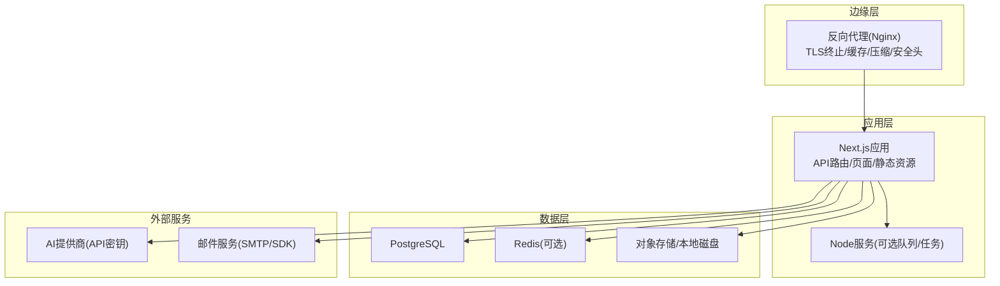

**图示来源** 
- [docker-compose.prod.yml](file://docker-compose.prod.yml)
- [Dockerfile](file://Dockerfile)
- [deploy/reverse-proxy/Dockerfile](file://deploy/reverse-proxy/Dockerfile)
- [deploy/reverse-proxy/entrypoint.sh](file://deploy/reverse-proxy/entrypoint.sh)

**章节来源**
- [docker-compose.prod.yml](file://docker-compose.prod.yml)
- [Dockerfile](file://Dockerfile)
- [next.config.ts](file://next.config.ts)
- [server/package.json](file://server/package.json)

## 核心组件
- 反向代理（Nginx）：负责TLS终止、缓存策略、压缩与安全头；通过环境变量注入证书路径与凭据。
- Next.js应用：承载API路由、页面渲染与静态资源；通过环境变量加载数据库、AI、邮件、存储等配置。
- 认证与会话：基于签名密钥与会话存储实现登录态管理。
- AI能力：多提供商适配与路由，依赖API密钥与模型配置。
- 渲染与导出：视频/图片渲染、缩略图生成、缓存与队列处理。
- 音频与TTS：语音合成与媒体处理，依赖外部TTS或OpenAI兼容接口。
- 存储抽象：统一访问对象存储或本地文件系统。
- 数据库：PostgreSQL为主，Drizzle ORM进行迁移与连接管理。

**章节来源**
- [src/features/auth/mailer.ts](file://src/features/auth/mailer.ts)
- [src/features/auth/session.ts](file://src/features/auth/session.ts)
- [src/features/auth/signing-key.ts](file://src/features/auth/signing-key.ts)
- [src/features/ai/config.ts](file://src/features/ai/config.ts)
- [src/features/ai/provider-registry.ts](file://src/features/ai/provider-registry.ts)
- [src/features/render/cache.ts](file://src/features/render/cache.ts)
- [src/features/render/export-service.ts](file://src/features/render/export-service.ts)
- [src/features/audio/media-provider.ts](file://src/features/audio/media-provider.ts)
- [src/lib/storage/index.ts](file://src/lib/storage/index.ts)
- [drizzle.config.ts](file://drizzle.config.ts)
- [scripts/setup/db-migrate.ts](file://scripts/setup/db-migrate.ts)
- [scripts/setup/postgres-init.sql](file://scripts/setup/postgres-init.sql)

## 架构总览
生产环境典型请求流如下：客户端经Nginx进入Next.js应用，应用根据路由调用认证、AI、渲染、存储与数据库等服务，必要时通过队列异步执行耗时任务。

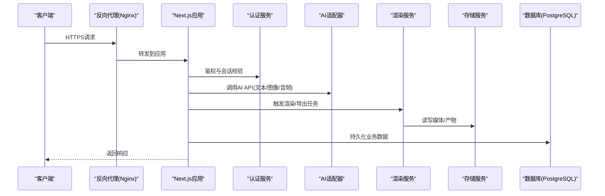

**图示来源** 
- [docker-compose.prod.yml](file://docker-compose.prod.yml)
- [next.config.ts](file://next.config.ts)
- [src/features/auth/session.ts](file://src/features/auth/session.ts)
- [src/features/ai/config.ts](file://src/features/ai/config.ts)
- [src/features/render/export-service.ts](file://src/features/render/export-service.ts)
- [src/lib/storage/index.ts](file://src/lib/storage/index.ts)
- [drizzle.config.ts](file://drizzle.config.ts)

## 详细组件分析

### 环境变量与配置加载
- 应用启动时通过环境变量加载配置，包括数据库连接、AI密钥、邮件服务、存储后端、会话与签名密钥等。
- 建议将敏感信息放入容器Secrets或环境变量注入，避免硬编码。

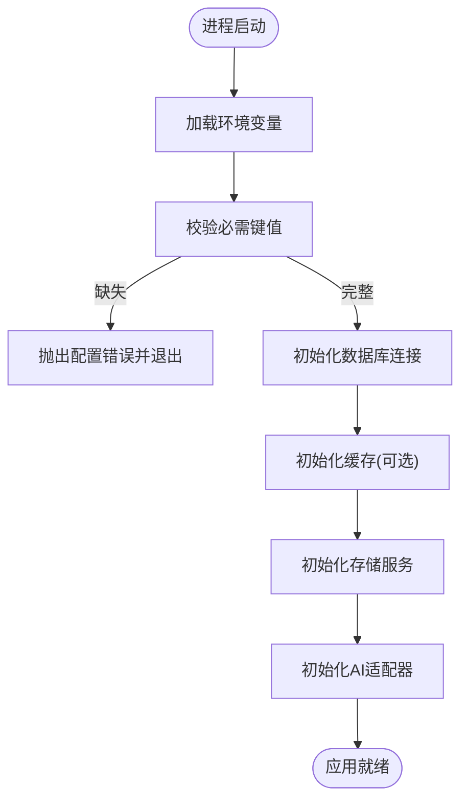

**图示来源** 
- [server/src/lib/load-env.ts](file://server/src/lib/load-env.ts)
- [drizzle.config.ts](file://drizzle.config.ts)
- [src/features/ai/config.ts](file://src/features/ai/config.ts)
- [src/lib/storage/index.ts](file://src/lib/storage/index.ts)

**章节来源**
- [server/src/lib/load-env.ts](file://server/src/lib/load-env.ts)
- [drizzle.config.ts](file://drizzle.config.ts)
- [src/features/ai/config.ts](file://src/features/ai/config.ts)
- [src/lib/storage/index.ts](file://src/lib/storage/index.ts)

### 数据库连接与迁移
- 使用PostgreSQL作为主存储，Drizzle进行迁移与连接管理。
- 生产环境需设置连接池大小、超时、SSL等参数，确保高可用与稳定性。
- 首次部署需执行初始化SQL与迁移脚本。

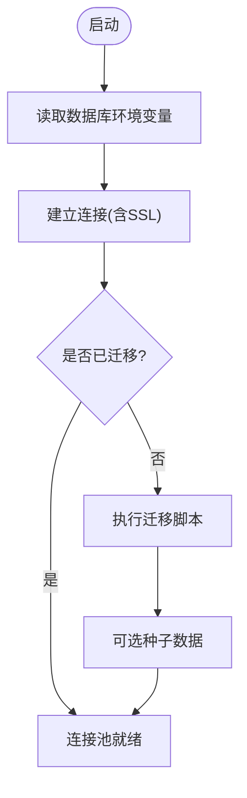

**图示来源** 
- [drizzle.config.ts](file://drizzle.config.ts)
- [scripts/setup/db-migrate.ts](file://scripts/setup/db-migrate.ts)
- [scripts/setup/postgres-init.sql](file://scripts/setup/postgres-init.sql)

**章节来源**
- [drizzle.config.ts](file://drizzle.config.ts)
- [scripts/setup/db-migrate.ts](file://scripts/setup/db-migrate.ts)
- [scripts/setup/postgres-init.sql](file://scripts/setup/postgres-init.sql)

### AI服务API密钥与路由
- 支持多个AI提供商，通过环境变量注入API密钥与端点。
- 提供适配器注册与默认模型选择，便于动态切换与容错。

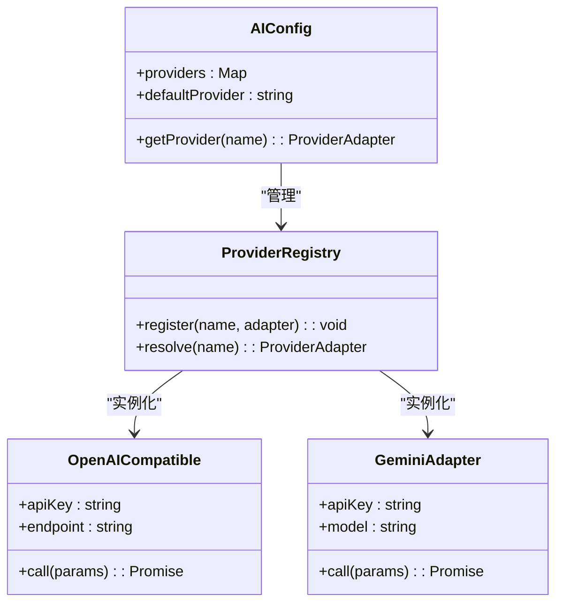

**图示来源** 
- [src/features/ai/config.ts](file://src/features/ai/config.ts)
- [src/features/ai/provider-registry.ts](file://src/features/ai/provider-registry.ts)

**章节来源**
- [src/features/ai/config.ts](file://src/features/ai/config.ts)
- [src/features/ai/provider-registry.ts](file://src/features/ai/provider-registry.ts)
- [config/tts.env.example](file://config/tts.env.example)

### 邮件服务配置
- 用于密码重置、验证码等场景，支持SMTP或第三方邮件SDK。
- 生产环境应启用TLS、重试与失败告警。

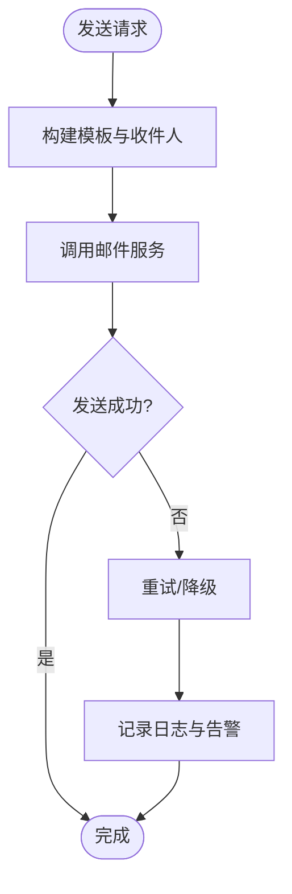

**图示来源** 
- [src/features/auth/mailer.ts](file://src/features/auth/mailer.ts)

**章节来源**
- [src/features/auth/mailer.ts](file://src/features/auth/mailer.ts)

### 存储后端设置
- 统一抽象对象存储与本地文件系统，支持分片上传、缓存与CDN集成。
- 生产环境建议使用对象存储（如S3兼容），并开启加密与访问控制。

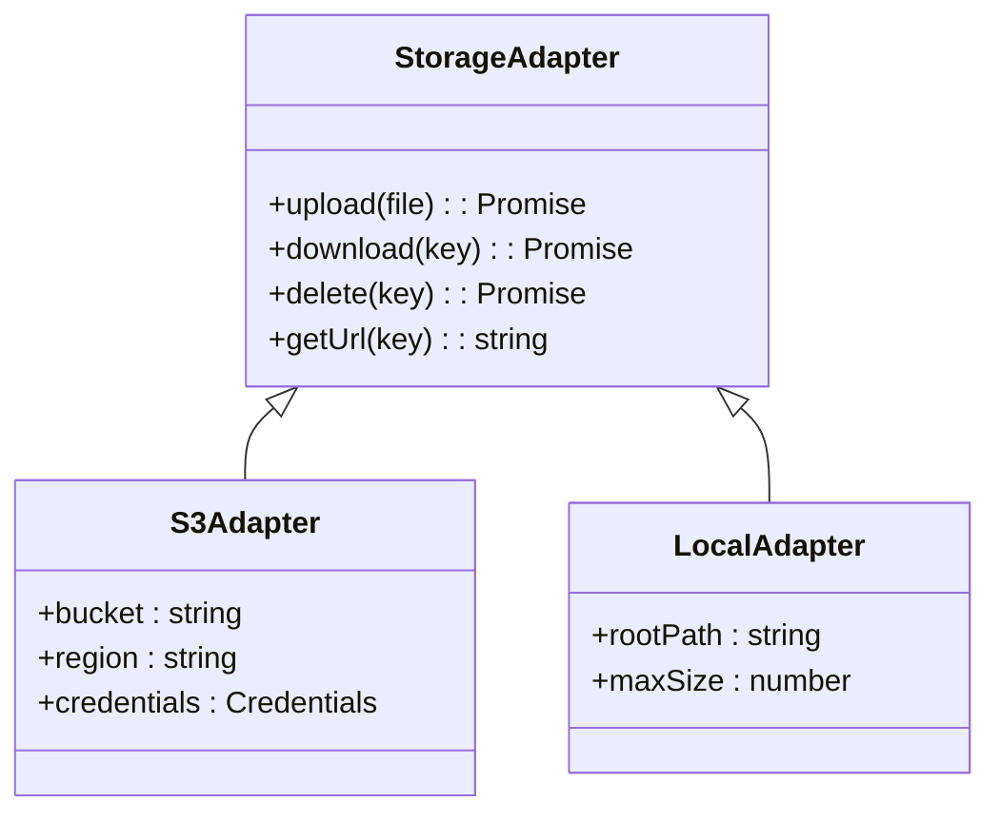

**图示来源** 
- [src/lib/storage/index.ts](file://src/lib/storage/index.ts)

**章节来源**
- [src/lib/storage/index.ts](file://src/lib/storage/index.ts)

### 渲染与缓存
- 渲染服务负责媒体处理与导出，结合缓存减少重复计算。
- 生产环境需合理设置缓存策略与过期时间，避免内存溢出。

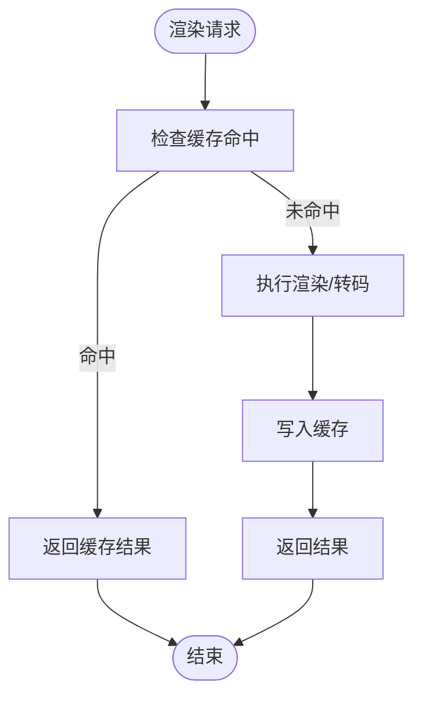

**图示来源** 
- [src/features/render/cache.ts](file://src/features/render/cache.ts)
- [src/features/render/export-service.ts](file://src/features/render/export-service.ts)

**章节来源**
- [src/features/render/cache.ts](file://src/features/render/cache.ts)
- [src/features/render/export-service.ts](file://src/features/render/export-service.ts)

### 音频与TTS
- 支持多种TTS提供商与OpenAI兼容接口，环境变量注入密钥与模型。
- 生产环境需考虑并发限制与失败重试。

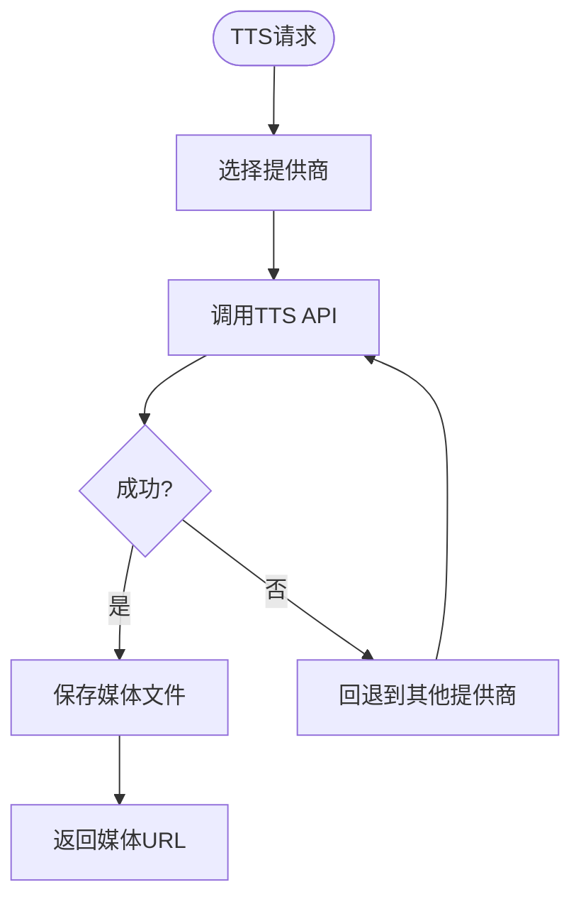

**图示来源** 
- [src/features/audio/media-provider.ts](file://src/features/audio/media-provider.ts)
- [config/tts.env.example](file://config/tts.env.example)

**章节来源**
- [src/features/audio/media-provider.ts](file://src/features/audio/media-provider.ts)
- [config/tts.env.example](file://config/tts.env.example)

### 认证与会话
- 基于签名密钥与会话存储实现用户登录态管理。
- 生产环境需强密码策略、会话过期与CSRF防护。

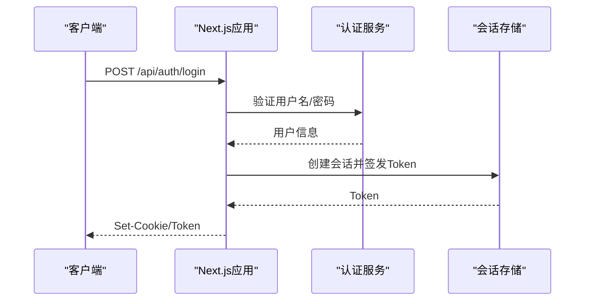

**图示来源** 
- [src/features/auth/session.ts](file://src/features/auth/session.ts)
- [src/features/auth/signing-key.ts](file://src/features/auth/signing-key.ts)

**章节来源**
- [src/features/auth/session.ts](file://src/features/auth/session.ts)
- [src/features/auth/signing-key.ts](file://src/features/auth/signing-key.ts)

## 依赖关系分析
- 反向代理依赖证书与基本认证凭据。
- Next.js应用依赖数据库、缓存、存储、AI与邮件服务。
- 渲染与音频模块依赖外部媒体处理工具与提供商API。

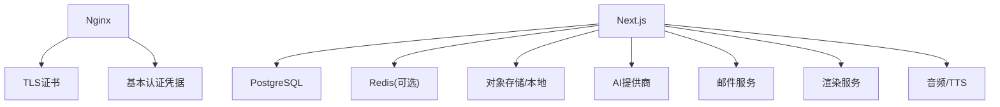

**图示来源** 
- [deploy/reverse-proxy/Dockerfile](file://deploy/reverse-proxy/Dockerfile)
- [deploy/reverse-proxy/entrypoint.sh](file://deploy/reverse-proxy/entrypoint.sh)
- [deploy/reverse-proxy/secrets/basic_auth_credentials.example](file://deploy/reverse-proxy/secrets/basic_auth_credentials.example)
- [docker-compose.prod.yml](file://docker-compose.prod.yml)

**章节来源**
- [deploy/reverse-proxy/Dockerfile](file://deploy/reverse-proxy/Dockerfile)
- [deploy/reverse-proxy/entrypoint.sh](file://deploy/reverse-proxy/entrypoint.sh)
- [deploy/reverse-proxy/secrets/basic_auth_credentials.example](file://deploy/reverse-proxy/secrets/basic_auth_credentials.example)
- [docker-compose.prod.yml](file://docker-compose.prod.yml)

## 性能调优
- Node.js进程管理：使用PM2或容器编排的副本数与CPU/内存限制，避免单点瓶颈。
- 数据库连接池：根据并发量调整最大连接数、空闲超时与查询超时。
- 静态资源优化：启用Gzip/Brotli压缩、HTTP缓存头与CDN缓存。
- 渲染与导出：合理设置队列并发与任务超时，避免阻塞主线程。
- 缓存策略：对热点数据启用Redis缓存，设置合理的TTL与失效策略。

[本节为通用指导，不直接分析具体文件]

## 故障排查指南
- 环境变量缺失：检查必需键值是否注入，确认容器Secrets挂载正确。
- 数据库连接失败：验证连接字符串、SSL证书与网络连通性。
- AI服务调用失败：检查API密钥、端点与配额限制。
- 邮件发送失败：确认SMTP配置、TLS与防火墙规则。
- 渲染超时：检查媒体处理工具安装与资源占用。
- 会话异常：核对签名密钥与会话存储可用性。

**章节来源**
- [server/src/lib/load-env.ts](file://server/src/lib/load-env.ts)
- [drizzle.config.ts](file://drizzle.config.ts)
- [src/features/ai/config.ts](file://src/features/ai/config.ts)
- [src/features/auth/mailer.ts](file://src/features/auth/mailer.ts)
- [src/features/render/export-service.ts](file://src/features/render/export-service.ts)
- [src/features/auth/session.ts](file://src/features/auth/session.ts)

## 结论
通过合理的环境变量管理、证书与反向代理配置、性能调优与安全加固，PurpleInk平台可在生产环境中稳定运行。建议持续监控关键指标，定期更新依赖与证书，确保系统的安全性与可靠性。

[本节为总结，不直接分析具体文件]

## 附录：环境变量清单与示例
- 数据库
  - DATABASE_URL：PostgreSQL连接字符串（含SSL）
  - DB_POOL_MAX：连接池最大值
  - DB_QUERY_TIMEOUT：查询超时毫秒
- AI服务
  - AI_OPENAI_API_KEY：OpenAI兼容接口密钥
  - AI_GEMINI_API_KEY：Gemini密钥
  - AI_DEFAULT_PROVIDER：默认提供商名称
- 邮件服务
  - MAIL_SMTP_HOST：SMTP主机
  - MAIL_SMTP_PORT：端口
  - MAIL_USER/MAIL_PASS：认证凭据
  - MAIL_FROM：发件人地址
- 存储后端
  - STORAGE_TYPE：类型（local/s3）
  - STORAGE_BUCKET：桶名（S3）
  - STORAGE_REGION：区域（S3）
  - STORAGE_ACCESS_KEY/SECRET_KEY：访问密钥
- 会话与签名
  - SESSION_SECRET：会话密钥
  - SIGNING_KEY：签名密钥
- 反向代理
  - NGINX_TLS_CERT_PATH：证书路径
  - NGINX_TLS_KEY_PATH：私钥路径
  - BASIC_AUTH_CREDENTIALS_FILE：基本认证凭据文件路径

**章节来源**
- [drizzle.config.ts](file://drizzle.config.ts)
- [src/features/ai/config.ts](file://src/features/ai/config.ts)
- [src/features/auth/mailer.ts](file://src/features/auth/mailer.ts)
- [src/lib/storage/index.ts](file://src/lib/storage/index.ts)
- [src/features/auth/session.ts](file://src/features/auth/session.ts)
- [deploy/reverse-proxy/entrypoint.sh](file://deploy/reverse-proxy/entrypoint.sh)
- [deploy/reverse-proxy/secrets/basic_auth_credentials.example](file://deploy/reverse-proxy/secrets/basic_auth_credentials.example)
- [config/tts.env.example](file://config/tts.env.example)