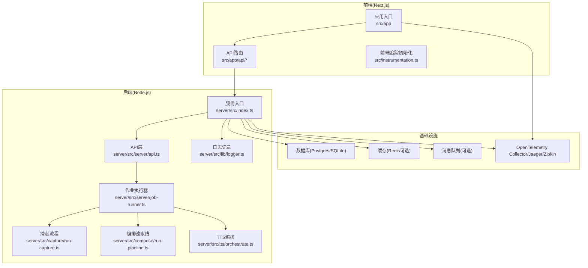
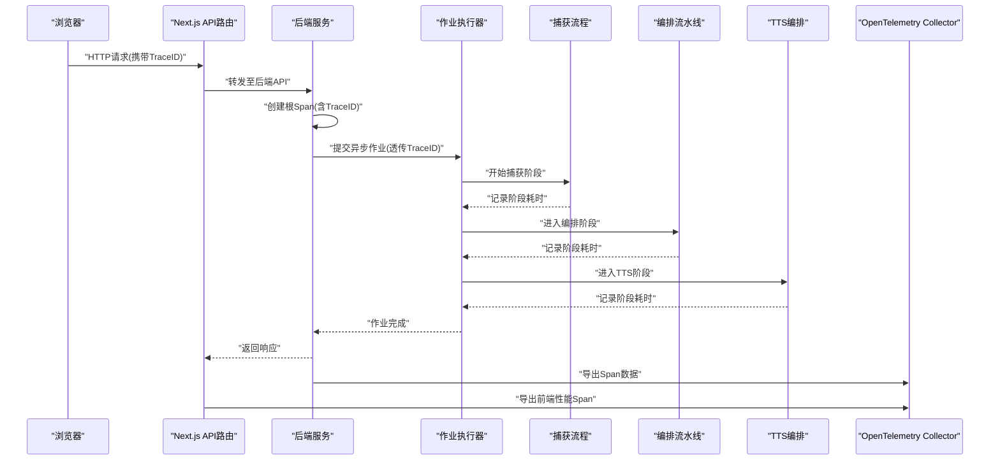
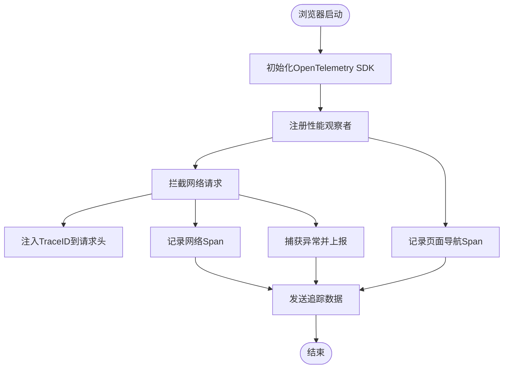
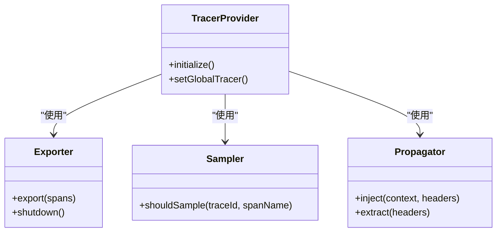
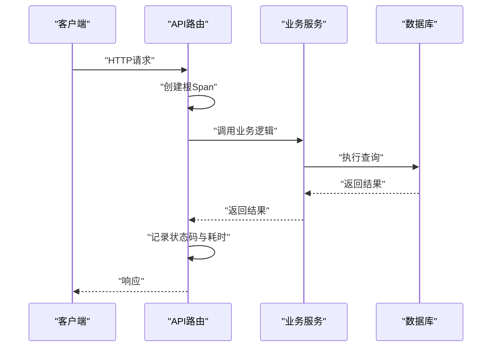
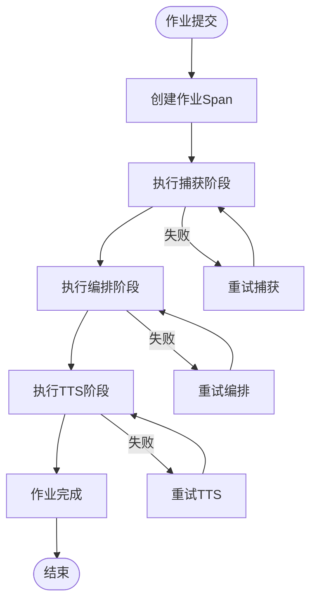
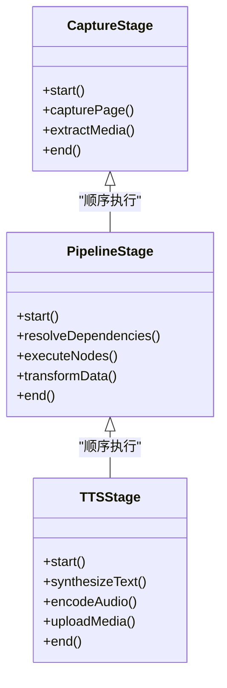
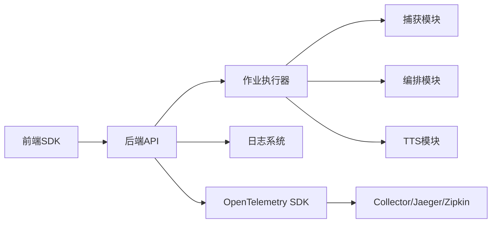

# 分布式追踪

<cite>
**本文引用的文件**   
- [src/instrumentation.ts](file://src/instrumentation.ts)
- [server/src/index.ts](file://server/src/index.ts)
- [server/src/server/api.ts](file://server/src/server/api.ts)
- [server/src/server/job-runner.ts](file://server/src/server/job-runner.ts)
- [server/src/lib/logger.ts](file://server/src/lib/logger.ts)
- [server/src/capture/run-capture.ts](file://server/src/capture/run-capture.ts)
- [server/src/compose/run-pipeline.ts](file://server/src/compose/run-pipeline.ts)
- [server/src/tts/orchestrate.ts](file://server/src/tts/orchestrate.ts)
- [src/app/api/director/pipeline/route.ts](file://src/app/api/director/pipeline/route.ts)
- [src/app/api/render/route.ts](file://src/app/api/render/route.ts)
- [src/app/api/jobs/[id]/route.ts](file://src/app/api/jobs/[id]/route.ts)
- [docker-compose.dev.yml](file://docker-compose.dev.yml)
- [docker-compose.prod.yml](file://docker-compose.prod.yml)
</cite>

## 目录
1. [简介](#简介)
2. [项目结构](#项目结构)
3. [核心组件](#核心组件)
4. [架构总览](#架构总览)
5. [详细组件分析](#详细组件分析)
6. [依赖关系分析](#依赖关系分析)
7. [性能考量](#性能考量)
8. [故障排查指南](#故障排查指南)
9. [结论](#结论)
10. [附录](#附录)

## 简介
本文件面向PurpleInk平台的分布式追踪，系统性说明请求链路追踪的实现原理与落地方案，涵盖：
- Trace ID生成、Span管理与跨服务调用追踪
- 前后端追踪集成（浏览器端性能追踪、API调用链追踪、异步任务追踪）
- 分布式追踪工具配置（Jaeger、Zipkin、OpenTelemetry）的部署与集成建议
- 性能瓶颈识别方法（慢查询定位、资源争用分析、并发问题诊断）
- 追踪数据采样策略与存储优化建议

## 项目结构
本项目采用前后端分离架构：
- 前端基于Next.js应用，提供页面路由与API路由入口
- 后端服务位于server目录，包含API、作业调度、渲染/捕获流水线、TTS编排等模块
- 基础设施通过Docker Compose编排，便于本地与生产环境部署

图表来源 
- [src/instrumentation.ts](file://src/instrumentation.ts)
- [server/src/index.ts](file://server/src/index.ts)
- [server/src/server/api.ts](file://server/src/server/api.ts)
- [server/src/server/job-runner.ts](file://server/src/server/job-runner.ts)
- [server/src/capture/run-capture.ts](file://server/src/capture/run-capture.ts)
- [server/src/compose/run-pipeline.ts](file://server/src/compose/run-pipeline.ts)
- [server/src/tts/orchestrate.ts](file://server/src/tts/orchestrate.ts)
- [server/src/lib/logger.ts](file://server/src/lib/logger.ts)

章节来源
- [src/instrumentation.ts](file://src/instrumentation.ts)
- [server/src/index.ts](file://server/src/index.ts)
- [docker-compose.dev.yml](file://docker-compose.dev.yml)
- [docker-compose.prod.yml](file://docker-compose.prod.yml)

## 核心组件
- 前端追踪初始化：负责浏览器端性能指标采集、网络请求拦截、错误上报与Trace上下文注入
- 后端服务入口：统一接入OpenTelemetry SDK，初始化TracerProvider、Exporter、Sampler，并设置全局传播器
- API网关/路由：在请求处理中创建根Span，透传Trace ID到下游服务或异步任务
- 作业执行器：为每个作业创建独立Span，关联上游请求Trace ID，记录阶段耗时
- 业务流水线（捕获/编排/TTS）：将长任务拆分为多个Span，形成清晰的子树结构
- 日志系统：结构化输出日志，附带trace_id、span_id、service_name等字段，便于关联追踪与日志

章节来源
- [src/instrumentation.ts](file://src/instrumentation.ts)
- [server/src/index.ts](file://server/src/index.ts)
- [server/src/server/api.ts](file://server/src/server/api.ts)
- [server/src/server/job-runner.ts](file://server/src/server/job-runner.ts)
- [server/src/capture/run-capture.ts](file://server/src/capture/run-capture.ts)
- [server/src/compose/run-pipeline.ts](file://server/src/compose/run-pipeline.ts)
- [server/src/tts/orchestrate.ts](file://server/src/tts/orchestrate.ts)
- [server/src/lib/logger.ts](file://server/src/lib/logger.ts)

## 架构总览
下图展示从浏览器发起请求到后端各子系统处理的完整追踪链路。Trace ID贯穿全链路，Span按职责划分，便于定位慢点与异常。

图表来源 
- [src/app/api/director/pipeline/route.ts](file://src/app/api/director/pipeline/route.ts)
- [src/app/api/render/route.ts](file://src/app/api/render/route.ts)
- [src/app/api/jobs/[id]/route.ts](file://src/app/api/jobs/[id]/route.ts)
- [server/src/server/api.ts](file://server/src/server/api.ts)
- [server/src/server/job-runner.ts](file://server/src/server/job-runner.ts)
- [server/src/capture/run-capture.ts](file://server/src/capture/run-capture.ts)
- [server/src/compose/run-pipeline.ts](file://server/src/compose/run-pipeline.ts)
- [server/src/tts/orchestrate.ts](file://server/src/tts/orchestrate.ts)
- [src/instrumentation.ts](file://src/instrumentation.ts)

## 详细组件分析

### 前端追踪初始化与浏览器性能追踪
- 作用：初始化OpenTelemetry浏览器SDK，采集导航、资源、网络请求、用户交互等指标；注入Trace ID到后续API请求头
- 关键点：
  - 使用PerformanceObserver收集关键性能指标
  - 拦截fetch/XMLHttpRequest，附加traceparent或自定义头部
  - 错误捕获与上报，关联当前Span
  - 采样策略：按请求重要性或延迟阈值动态调整

章节来源
- [src/instrumentation.ts](file://src/instrumentation.ts)

### 后端服务入口与全局追踪配置
- 作用：在服务启动时初始化TracerProvider、Exporter、Sampler，设置全局传播器以支持跨进程/线程的Trace上下文传递
- 关键点：
  - 配置Exporter指向Collector或直连Jaeger/Zipkin
  - 设置Sampler（如基于百分比或基于延迟阈值）
  - 注入中间件或钩子，确保每个请求创建根Span
  - 结构化日志集成trace_id、span_id、service_name

图表来源 
- [server/src/index.ts](file://server/src/index.ts)

章节来源
- [server/src/index.ts](file://server/src/index.ts)
- [server/src/lib/logger.ts](file://server/src/lib/logger.ts)

### API层与请求级Span管理
- 作用：在每个API路由中创建根Span，记录请求路径、方法、状态码、耗时，并将Trace ID透传到下游
- 关键点：
  - 统一中间件包装，自动创建/结束Span
  - 错误处理时记录异常信息与堆栈
  - 对异步任务提交时，将Trace ID写入任务元数据

图表来源 
- [server/src/server/api.ts](file://server/src/server/api.ts)
- [src/app/api/director/pipeline/route.ts](file://src/app/api/director/pipeline/route.ts)
- [src/app/api/render/route.ts](file://src/app/api/render/route.ts)
- [src/app/api/jobs/[id]/route.ts](file://src/app/api/jobs/[id]/route.ts)

章节来源
- [server/src/server/api.ts](file://server/src/server/api.ts)
- [src/app/api/director/pipeline/route.ts](file://src/app/api/director/pipeline/route.ts)
- [src/app/api/render/route.ts](file://src/app/api/render/route.ts)
- [src/app/api/jobs/[id]/route.ts](file://src/app/api/jobs/[id]/route.ts)

### 作业执行器与异步任务追踪
- 作用：为每个作业创建独立Span，记录阶段划分（捕获、编排、TTS），并关联上游Trace ID
- 关键点：
  - 作业生命周期管理（创建、执行、完成、失败）
  - 阶段Span嵌套，便于定位慢步骤
  - 重试与超时控制，记录重试次数与原因

图表来源 
- [server/src/server/job-runner.ts](file://server/src/server/job-runner.ts)
- [server/src/capture/run-capture.ts](file://server/src/capture/run-capture.ts)
- [server/src/compose/run-pipeline.ts](file://server/src/compose/run-pipeline.ts)
- [server/src/tts/orchestrate.ts](file://server/src/tts/orchestrate.ts)

章节来源
- [server/src/server/job-runner.ts](file://server/src/server/job-runner.ts)
- [server/src/capture/run-capture.ts](file://server/src/capture/run-capture.ts)
- [server/src/compose/run-pipeline.ts](file://server/src/compose/run-pipeline.ts)
- [server/src/tts/orchestrate.ts](file://server/src/tts/orchestrate.ts)

### 业务流水线（捕获/编排/TTS）的Span设计
- 捕获阶段：记录页面加载、截图、媒体提取等子Span
- 编排阶段：记录节点执行、依赖解析、数据转换等子Span
- TTS阶段：记录文本合成、音频编码、上传等子Span
- 目标：形成清晰的层级结构，便于可视化与性能分析

图表来源 
- [server/src/capture/run-capture.ts](file://server/src/capture/run-capture.ts)
- [server/src/compose/run-pipeline.ts](file://server/src/compose/run-pipeline.ts)
- [server/src/tts/orchestrate.ts](file://server/src/tts/orchestrate.ts)

章节来源
- [server/src/capture/run-capture.ts](file://server/src/capture/run-capture.ts)
- [server/src/compose/run-pipeline.ts](file://server/src/compose/run-pipeline.ts)
- [server/src/tts/orchestrate.ts](file://server/src/tts/orchestrate.ts)

## 依赖关系分析
- 前端依赖OpenTelemetry浏览器SDK，向后端API发送请求时注入Trace ID
- 后端依赖OpenTelemetry Node.js SDK，导出Span数据到Collector或直连追踪后端
- 作业执行器依赖捕获、编排、TTS模块，形成串行或并行执行图
- 日志系统依赖结构化输出，与追踪数据关联

图表来源 
- [src/instrumentation.ts](file://src/instrumentation.ts)
- [server/src/index.ts](file://server/src/index.ts)
- [server/src/server/api.ts](file://server/src/server/api.ts)
- [server/src/server/job-runner.ts](file://server/src/server/job-runner.ts)
- [server/src/capture/run-capture.ts](file://server/src/capture/run-capture.ts)
- [server/src/compose/run-pipeline.ts](file://server/src/compose/run-pipeline.ts)
- [server/src/tts/orchestrate.ts](file://server/src/tts/orchestrate.ts)
- [server/src/lib/logger.ts](file://server/src/lib/logger.ts)

章节来源
- [src/instrumentation.ts](file://src/instrumentation.ts)
- [server/src/index.ts](file://server/src/index.ts)
- [server/src/server/api.ts](file://server/src/server/api.ts)
- [server/src/server/job-runner.ts](file://server/src/server/job-runner.ts)
- [server/src/capture/run-capture.ts](file://server/src/capture/run-capture.ts)
- [server/src/compose/run-pipeline.ts](file://server/src/compose/run-pipeline.ts)
- [server/src/tts/orchestrate.ts](file://server/src/tts/orchestrate.ts)
- [server/src/lib/logger.ts](file://server/src/lib/logger.ts)

## 性能考量
- 采样策略：
  - 前端：按请求重要性（如用户操作触发）或延迟阈值动态采样
  - 后端：基于百分比采样，结合热点接口自适应提高采样率
- Span粒度：
  - 避免过细导致数据量爆炸，合理合并短小Span
  - 关键路径（如数据库查询、外部API调用）保持独立Span
- 数据传输：
  - 批量导出Span，减少网络开销
  - 使用压缩与异步发送，降低对主流程影响
- 存储优化：
  - 按时间窗口滚动存储，保留高价值数据
  - 索引trace_id、span_id、service_name，提升查询效率

[本节为通用指导，不直接分析具体文件]

## 故障排查指南
- 慢查询定位：
  - 通过追踪界面查看数据库Span耗时，识别慢SQL
  - 结合日志中的trace_id快速定位相关请求
- 资源争用分析：
  - 观察CPU/内存占用与Span分布，识别热点代码
  - 检查锁竞争与线程池使用情况
- 并发问题诊断：
  - 分析并发请求的Span时序，识别死锁与竞态条件
  - 监控队列积压与作业执行时长

章节来源
- [server/src/lib/logger.ts](file://server/src/lib/logger.ts)
- [server/src/server/job-runner.ts](file://server/src/server/job-runner.ts)

## 结论
PurpleInk平台通过OpenTelemetry实现端到端分布式追踪，覆盖前端性能、API调用链与异步任务。合理的Span设计与采样策略确保了可观测性与性能的平衡。建议持续优化追踪数据质量与存储成本，提升问题定位效率。

[本节为总结性内容，不直接分析具体文件]

## 附录
- Jaeger/Zipkin部署建议：
  - 使用Docker Compose快速搭建，配置环境变量与端口映射
  - 调整Collector参数以应对高吞吐场景
- OpenTelemetry集成要点：
  - 正确配置Exporter与Sampler
  - 确保Trace ID在各服务间正确传播

章节来源
- [docker-compose.dev.yml](file://docker-compose.dev.yml)
- [docker-compose.prod.yml](file://docker-compose.prod.yml)