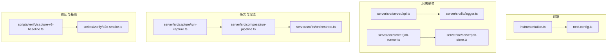
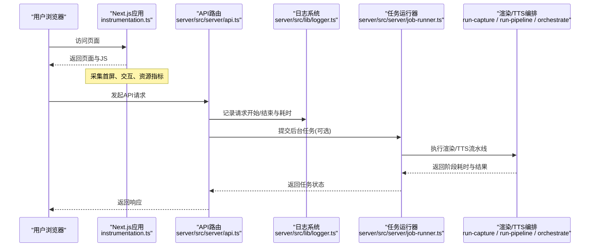
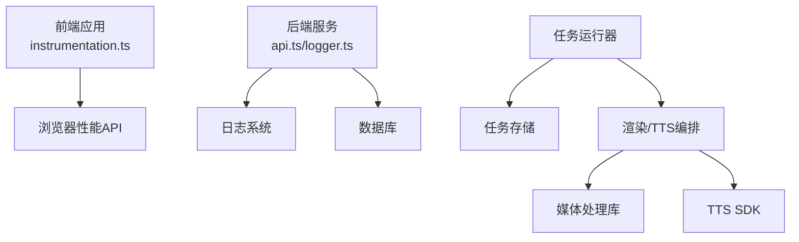

# 性能监控

<cite>
**本文引用的文件**   
- [src/instrumentation.ts](file://src/instrumentation.ts)
- [server/src/lib/logger.ts](file://server/src/lib/logger.ts)
- [server/src/server/api.ts](file://server/src/server/api.ts)
- [server/src/server/job-runner.ts](file://server/src/server/job-runner.ts)
- [server/src/server/job-store.ts](file://server/src/server/job-store.ts)
- [server/src/capture/run-capture.ts](file://server/src/capture/run-capture.ts)
- [server/src/compose/run-pipeline.ts](file://server/src/compose/run-pipeline.ts)
- [server/src/tts/orchestrate.ts](file://server/src/tts/orchestrate.ts)
- [server/package.json](file://server/package.json)
- [package.json](file://package.json)
- [next.config.ts](file://next.config.ts)
- [scripts/verify/capture-v3-baseline.ts](file://scripts/verify/capture-v3-baseline.ts)
- [scripts/verify/e2e-smoke.ts](file://scripts/verify/e2e-smoke.ts)
</cite>

## 目录
1. [简介](#简介)
2. [项目结构](#项目结构)
3. [核心组件](#核心组件)
4. [架构总览](#架构总览)
5. [详细组件分析](#详细组件分析)
6. [依赖分析](#依赖分析)
7. [性能考虑](#性能考虑)
8. [故障排查指南](#故障排查指南)
9. [结论](#结论)
10. [附录](#附录)（如有需要）

## 简介
本文件面向PurpleInk平台的性能监控与APM集成，聚焦以下目标：
- 明确关键性能指标(KPI)定义与采集方法
- 前端性能监控：页面加载时间、用户交互响应、资源使用等指标的收集与分析
- 后端性能监控：API响应时间、数据库查询性能、内存使用情况等监控配置
- 性能基准测试实施方案：自动化性能回归检测、阈值设置与告警规则
- 瓶颈识别与优化建议的最佳实践

说明：仓库中未包含专用的APM SDK或第三方性能埋点库。因此，本文基于现有代码中的日志、脚本与基础设施，给出“最小可行”的性能监控方案，并指出可扩展的集成点。

## 项目结构
从工程结构看，性能相关能力主要分布在：
- 前端应用入口与Next.js配置：用于接入浏览器端性能指标与运行时诊断
- 服务端日志与请求处理：用于记录API耗时、任务执行耗时与错误上下文
- 任务编排与渲染管线：用于采集长任务阶段耗时与失败率
- 验证与基线脚本：用于构建性能回归检测流程

**图示来源** 
- [src/instrumentation.ts](file://src/instrumentation.ts)
- [next.config.ts](file://next.config.ts)
- [server/src/server/api.ts](file://server/src/server/api.ts)
- [server/src/lib/logger.ts](file://server/src/lib/logger.ts)
- [server/src/server/job-runner.ts](file://server/src/server/job-runner.ts)
- [server/src/server/job-store.ts](file://server/src/server/job-store.ts)
- [server/src/capture/run-capture.ts](file://server/src/capture/run-capture.ts)
- [server/src/compose/run-pipeline.ts](file://server/src/compose/run-pipeline.ts)
- [server/src/tts/orchestrate.ts](file://server/src/tts/orchestrate.ts)
- [scripts/verify/capture-v3-baseline.ts](file://scripts/verify/capture-v3-baseline.ts)
- [scripts/verify/e2e-smoke.ts](file://scripts/verify/e2e-smoke.ts)

**章节来源**
- [src/instrumentation.ts](file://src/instrumentation.ts)
- [next.config.ts](file://next.config.ts)
- [server/src/server/api.ts](file://server/src/server/api.ts)
- [server/src/lib/logger.ts](file://server/src/lib/logger.ts)
- [server/src/server/job-runner.ts](file://server/src/server/job-runner.ts)
- [server/src/server/job-store.ts](file://server/src/server/job-store.ts)
- [server/src/capture/run-capture.ts](file://server/src/capture/run-capture.ts)
- [server/src/compose/run-pipeline.ts](file://server/src/compose/run-pipeline.ts)
- [server/src/tts/orchestrate.ts](file://server/src/tts/orchestrate.ts)
- [scripts/verify/capture-v3-baseline.ts](file://scripts/verify/capture-v3-baseline.ts)
- [scripts/verify/e2e-smoke.ts](file://scripts/verify/e2e-smoke.ts)

## 核心组件
- 前端性能采集入口：通过应用级初始化脚本统一注入性能埋点与上报逻辑
- 后端日志系统：集中输出结构化日志，便于聚合与检索
- API路由层：承载HTTP请求处理，适合在此处记录请求耗时与状态码
- 任务运行器与存储：负责后台作业调度与持久化，适合记录阶段耗时与失败率
- 渲染与TTS编排：长耗时任务的阶段划分与耗时统计
- 验证与基线脚本：用于构建性能回归检测与对比

**章节来源**
- [src/instrumentation.ts](file://src/instrumentation.ts)
- [server/src/lib/logger.ts](file://server/src/lib/logger.ts)
- [server/src/server/api.ts](file://server/src/server/api.ts)
- [server/src/server/job-runner.ts](file://server/src/server/job-runner.ts)
- [server/src/server/job-store.ts](file://server/src/server/job-store.ts)
- [server/src/capture/run-capture.ts](file://server/src/capture/run-capture.ts)
- [server/src/compose/run-pipeline.ts](file://server/src/compose/run-pipeline.ts)
- [server/src/tts/orchestrate.ts](file://server/src/tts/orchestrate.ts)

## 架构总览
下图展示前后端性能数据流与关键采集点：

**图示来源** 
- [src/instrumentation.ts](file://src/instrumentation.ts)
- [server/src/server/api.ts](file://server/src/server/api.ts)
- [server/src/lib/logger.ts](file://server/src/lib/logger.ts)
- [server/src/server/job-runner.ts](file://server/src/server/job-runner.ts)
- [server/src/capture/run-capture.ts](file://server/src/capture/run-capture.ts)
- [server/src/compose/run-pipeline.ts](file://server/src/compose/run-pipeline.ts)
- [server/src/tts/orchestrate.ts](file://server/src/tts/orchestrate.ts)

## 详细组件分析

### 前端性能监控
- 指标定义
  - 页面加载时间：首次内容绘制(FCP)、最大内容绘制(LCP)、首次输入延迟(FID)/交互到下一字节(INP)
  - 用户交互响应：按钮点击到反馈的时间、表单提交到响应完成时间
  - 资源使用：主线程阻塞时间、网络请求数量与大小、缓存命中率
- 采集方法
  - 在应用初始化脚本中统一注入Web Performance API与自定义事件监听
  - 将指标以结构化方式上报至后端或外部分析平台
- 集成要点
  - 避免对首屏造成额外开销，采用采样与异步上报
  - 区分环境（开发/生产），在生产开启完整采集

**章节来源**
- [src/instrumentation.ts](file://src/instrumentation.ts)
- [next.config.ts](file://next.config.ts)

### 后端性能监控
- API响应时间
  - 在路由层记录请求开始与结束时间，计算耗时并写入结构化日志
  - 按接口维度聚合P50/P95/P99耗时与错误率
- 数据库查询性能
  - 在数据访问层增加慢查询日志与查询计划采样
  - 针对热点表建立索引与分页策略，减少全表扫描
- 内存使用情况
  - 定期采集Node进程内存快照与堆转储，定位内存泄漏
  - 结合GC日志分析停顿时间与回收效率

**章节来源**
- [server/src/server/api.ts](file://server/src/server/api.ts)
- [server/src/lib/logger.ts](file://server/src/lib/logger.ts)

### 任务与渲染管线监控
- 任务运行器
  - 记录任务生命周期事件：入队、开始、完成、失败
  - 统计队列长度、吞吐与平均等待时间
- 渲染与TTS编排
  - 在关键阶段打点：解析、生成、编码、上传
  - 输出阶段耗时分布与失败原因分类

**章节来源**
- [server/src/server/job-runner.ts](file://server/src/server/job-runner.ts)
- [server/src/server/job-store.ts](file://server/src/server/job-store.ts)
- [server/src/capture/run-capture.ts](file://server/src/capture/run-capture.ts)
- [server/src/compose/run-pipeline.ts](file://server/src/compose/run-pipeline.ts)
- [server/src/tts/orchestrate.ts](file://server/src/tts/orchestrate.ts)

### 性能基准测试与回归检测
- 基线采集
  - 使用现有脚本采集关键路径的耗时与资源占用，形成基线数据
- 自动化回归
  - 在CI中执行端到端与性能脚本，比较当前与基线的差异
- 阈值与告警
  - 设定P95/P99耗时阈值与错误率上限
  - 当超过阈值时触发告警并回滚变更

**章节来源**
- [scripts/verify/capture-v3-baseline.ts](file://scripts/verify/capture-v3-baseline.ts)
- [scripts/verify/e2e-smoke.ts](file://scripts/verify/e2e-smoke.ts)

## 依赖分析
- 前端依赖
  - Next.js运行时与浏览器Performance API
  - 可选的外部分析SDK（如未引入则需自行实现上报）
- 后端依赖
  - Node.js运行时与文件系统/数据库驱动
  - 日志聚合与监控系统（如ELK、Prometheus/Grafana）
- 任务与渲染
  - Playwright/浏览器驱动、FFmpeg、媒体处理库
  - TTS提供商SDK与音频编解码库

**图示来源** 
- [src/instrumentation.ts](file://src/instrumentation.ts)
- [server/src/server/api.ts](file://server/src/server/api.ts)
- [server/src/lib/logger.ts](file://server/src/lib/logger.ts)
- [server/src/server/job-runner.ts](file://server/src/server/job-runner.ts)
- [server/src/server/job-store.ts](file://server/src/server/job-store.ts)
- [server/src/capture/run-capture.ts](file://server/src/capture/run-capture.ts)
- [server/src/compose/run-pipeline.ts](file://server/src/compose/run-pipeline.ts)
- [server/src/tts/orchestrate.ts](file://server/src/tts/orchestrate.ts)

**章节来源**
- [server/package.json](file://server/package.json)
- [package.json](file://package.json)

## 性能考虑
- 前端
  - 首屏优化：代码分割、懒加载、静态资源压缩与CDN缓存
  - 交互优化：事件节流与防抖、Web Worker处理重计算
  - 资源监控：监控大图片与视频加载，启用预取与预连接
- 后端
  - API优化：缓存热点数据、批量操作、异步处理
  - 数据库优化：索引设计、查询重写、连接池调优
  - 内存管理：对象复用、避免闭包泄漏、定期GC
- 任务与渲染
  - 并行与限流：控制并发度，避免资源争用
  - 分片与重试：失败重试与断点续传，提升鲁棒性

[本节为通用指导，不直接分析具体文件]

## 故障排查指南
- 常见问题
  - 首屏加载缓慢：检查资源体积、缓存命中与网络质量
  - API超时：查看日志中的耗时分布与错误堆栈
  - 任务堆积：观察队列长度与消费者吞吐
  - 内存泄漏：抓取堆快照并分析增长趋势
- 排查步骤
  - 在前端打开性能面板，录制关键路径
  - 在后端检索结构化日志，过滤错误与慢请求
  - 在任务系统中查看失败原因与重试次数
  - 使用Profiling工具定位CPU热点与内存分配

**章节来源**
- [server/src/lib/logger.ts](file://server/src/lib/logger.ts)
- [server/src/server/job-runner.ts](file://server/src/server/job-runner.ts)
- [server/src/server/job-store.ts](file://server/src/server/job-store.ts)

## 结论
PurpleInk平台当前未内置专用APM SDK，但可通过现有日志、脚本与基础设施构建最小可行的性能监控体系。建议优先完善前端指标采集与后端结构化日志，逐步接入外部APM与监控系统，形成闭环的性能治理流程。

[本节为总结性内容，不直接分析具体文件]

## 附录
- 指标字典（示例）
  - 页面加载：FCP、LCP、INP
  - 交互响应：点击到反馈时长、表单提交到响应时长
  - 资源使用：主线程阻塞时间、网络请求数与大小、缓存命中率
  - API性能：P50/P95/P99耗时、错误率、吞吐
  - 数据库：慢查询比例、连接池利用率、锁等待时间
  - 任务：队列长度、平均等待时间、失败率、阶段耗时分布
- 告警规则（示例）
  - P95耗时超过阈值持续5分钟
  - 错误率超过阈值
  - 队列长度超过阈值且持续增长
  - 内存使用超过阈值或出现泄漏迹象

[本节为概念性内容，不直接分析具体文件]