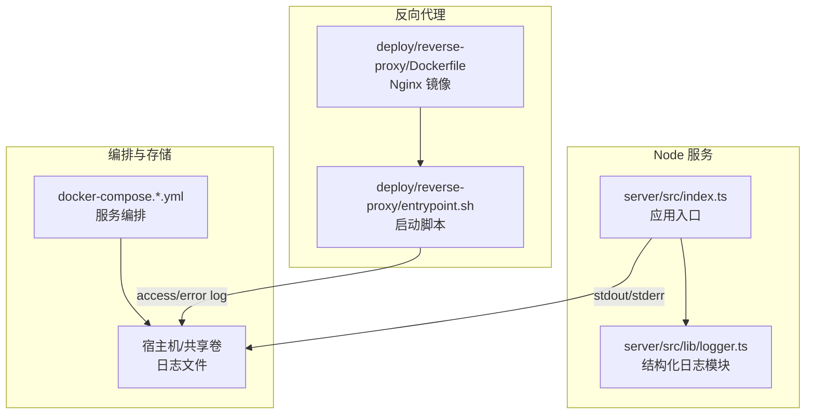
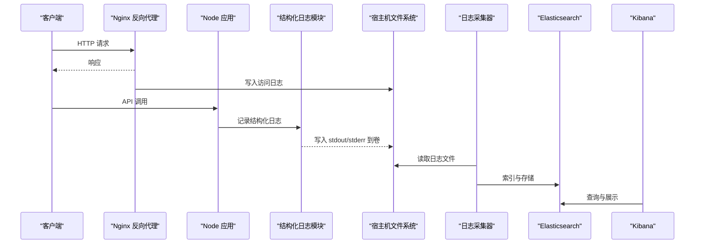
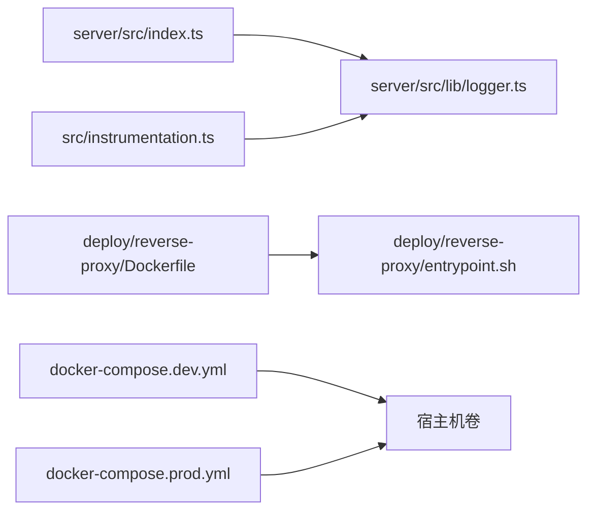

# 日志系统

<cite>
**本文引用的文件**   
- [server/src/lib/logger.ts](file://server/src/lib/logger.ts)
- [server/src/index.ts](file://server/src/index.ts)
- [server/package.json](file://server/package.json)
- [docker-compose.dev.yml](file://docker-compose.dev.yml)
- [docker-compose.prod.yml](file://docker-compose.prod.yml)
- [deploy/reverse-proxy/Dockerfile](file://deploy/reverse-proxy/Dockerfile)
- [deploy/reverse-proxy/entrypoint.sh](file://deploy/reverse-proxy/entrypoint.sh)
- [next.config.ts](file://next.config.ts)
- [src/instrumentation.ts](file://src/instrumentation.ts)
</cite>

## 目录
1. [简介](#简介)
2. [项目结构](#项目结构)
3. [核心组件](#核心组件)
4. [架构总览](#架构总览)
5. [详细组件分析](#详细组件分析)
6. [依赖关系分析](#依赖关系分析)
7. [性能考量](#性能考量)
8. [故障排查指南](#故障排查指南)
9. [结论](#结论)
10. [附录](#附录)

## 简介
本文件为 PurpleInk 平台的日志系统文档，聚焦结构化日志格式、日志级别管理、日志收集与存储策略、聚合检索集成（ELK Stack 或同类方案）、分析最佳实践以及日志轮转归档清理配置。内容基于仓库中的服务端日志实现、反向代理与容器编排配置进行梳理，帮助读者快速理解并落地生产级日志体系。

## 项目结构
- 服务端日志实现位于 server 子工程，核心日志模块在 server/src/lib/logger.ts，应用入口在 server/src/index.ts。
- 反向代理部署于 deploy/reverse-proxy，包含 Nginx 镜像构建与启动脚本，用于采集访问日志。
- 容器编排通过 docker-compose 文件定义服务与卷挂载，便于集中化日志输出到宿主机或外部日志服务。
- Next.js 前端通过 next.config.ts 与 instrumentation.ts 暴露运行时能力，可配合统一日志框架进行请求链路追踪。

**图表来源** 
- [server/src/index.ts](file://server/src/index.ts)
- [server/src/lib/logger.ts](file://server/src/lib/logger.ts)
- [deploy/reverse-proxy/Dockerfile](file://deploy/reverse-proxy/Dockerfile)
- [deploy/reverse-proxy/entrypoint.sh](file://deploy/reverse-proxy/entrypoint.sh)
- [docker-compose.dev.yml](file://docker-compose.dev.yml)
- [docker-compose.prod.yml](file://docker-compose.prod.yml)

**章节来源**
- [server/src/lib/logger.ts](file://server/src/lib/logger.ts)
- [server/src/index.ts](file://server/src/index.ts)
- [deploy/reverse-proxy/Dockerfile](file://deploy/reverse-proxy/Dockerfile)
- [deploy/reverse-proxy/entrypoint.sh](file://deploy/reverse-proxy/entrypoint.sh)
- [docker-compose.dev.yml](file://docker-compose.dev.yml)
- [docker-compose.prod.yml](file://docker-compose.prod.yml)

## 核心组件
- 结构化日志模块：提供统一的 JSON 日志输出，包含时间戳、级别、消息、上下文字段等，便于下游解析与索引。
- 应用入口：初始化日志模块，设置全局日志级别与输出目标，确保所有业务模块使用同一日志实例。
- 反向代理：Nginx 以 JSON 或标准格式输出访问日志，便于后续统一采集。
- 容器编排：通过卷挂载将 stdout/stderr 和 Nginx 日志持久化到宿主机，供日志采集器读取。

**章节来源**
- [server/src/lib/logger.ts](file://server/src/lib/logger.ts)
- [server/src/index.ts](file://server/src/index.ts)
- [deploy/reverse-proxy/Dockerfile](file://deploy/reverse-proxy/Dockerfile)
- [deploy/reverse-proxy/entrypoint.sh](file://deploy/reverse-proxy/entrypoint.sh)
- [docker-compose.dev.yml](file://docker-compose.dev.yml)
- [docker-compose.prod.yml](file://docker-compose.prod.yml)

## 架构总览
PurpleInk 的日志架构采用“应用 stdout + 反向代理 access/error + 容器卷持久化”的模式，结合 ELK Stack（Elasticsearch、Logstash、Kibana）或同类工具完成聚合、索引与可视化。

**图表来源** 
- [deploy/reverse-proxy/Dockerfile](file://deploy/reverse-proxy/Dockerfile)
- [deploy/reverse-proxy/entrypoint.sh](file://deploy/reverse-proxy/entrypoint.sh)
- [server/src/index.ts](file://server/src/index.ts)
- [server/src/lib/logger.ts](file://server/src/lib/logger.ts)
- [docker-compose.dev.yml](file://docker-compose.dev.yml)
- [docker-compose.prod.yml](file://docker-compose.prod.yml)

## 详细组件分析

### 结构化日志格式设计
- 字段定义建议包含：时间戳、级别、消息、服务名、实例标识、请求 ID、用户标识、耗时、错误堆栈、业务上下文键值对。
- JSON 规范：每条日志一行 JSON，避免多行文本；复杂对象需扁平化或序列化后再写入。
- 级别管理：支持 trace/debug/info/warn/error/fatal，默认在生产环境启用 info 及以上级别，开发环境可开启 debug。
- 上下文注入：中间件或请求生命周期中注入请求 ID、用户信息、路由信息等，保证链路可追溯。

**章节来源**
- [server/src/lib/logger.ts](file://server/src/lib/logger.ts)

### 日志级别管理
- 级别优先级：trace < debug < info < warn < error < fatal。
- 动态调整：可通过环境变量或配置文件在运行时切换级别，避免重启。
- 过滤策略：在高吞吐场景下，降低低级别日志输出比例，减少 I/O 压力。

**章节来源**
- [server/src/lib/logger.ts](file://server/src/lib/logger.ts)

### 日志收集策略
- 应用日志：Node 应用通过 stdout/stderr 输出结构化 JSON，由容器编排挂载到宿主机卷，供采集器读取。
- 访问日志：Nginx 以 JSON 或标准格式输出访问日志，便于统一解析。
- 错误日志：Nginx error.log 与应用 error 级别日志分离，便于快速定位异常。
- 存储方案：本地磁盘按天分片，配合采集器转发至 Elasticsearch；敏感数据脱敏后入库。

**章节来源**
- [server/src/index.ts](file://server/src/index.ts)
- [deploy/reverse-proxy/Dockerfile](file://deploy/reverse-proxy/Dockerfile)
- [deploy/reverse-proxy/entrypoint.sh](file://deploy/reverse-proxy/entrypoint.sh)
- [docker-compose.dev.yml](file://docker-compose.dev.yml)
- [docker-compose.prod.yml](file://docker-compose.prod.yml)

### 日志聚合与检索（ELK Stack）
- Logstash/Filebeat：从宿主机卷读取 Node 与 Nginx 日志，解析 JSON，提取关键字段。
- Elasticsearch：按服务名、日期、级别建立索引，支持全文检索与聚合分析。
- Kibana：构建仪表盘，监控错误率、慢请求、用户行为与安全事件。
- 集成要点：确保字段命名一致、时区统一、字符集 UTF-8。

**章节来源**
- [docker-compose.dev.yml](file://docker-compose.dev.yml)
- [docker-compose.prod.yml](file://docker-compose.prod.yml)

### 日志分析最佳实践
- 常见错误模式识别：统计 error/fatal 级别占比，关联请求 ID 定位失败链路。
- 性能问题诊断：关注耗时字段，筛选慢请求与超时场景，结合数据库与外部 API 调用日志分析瓶颈。
- 安全事件审计：记录登录失败、权限拒绝、异常 IP 与频率，结合 WAF 与访问日志交叉验证。

**章节来源**
- [server/src/lib/logger.ts](file://server/src/lib/logger.ts)

### 日志轮转、归档与清理
- 应用日志：通过容器卷挂载到宿主机，使用 logrotate 按大小或时间轮转，保留周期可配置。
- Nginx 日志：logrotate 配置 access.log 与 error.log，压缩归档并定期清理。
- 归档策略：热数据保留 7-30 天，冷数据迁移至对象存储，降低成本。
- 清理规则：超过保留期的日志自动删除，避免磁盘占满。

**章节来源**
- [docker-compose.dev.yml](file://docker-compose.dev.yml)
- [docker-compose.prod.yml](file://docker-compose.prod.yml)

## 依赖关系分析
- 应用层依赖 logger 模块进行结构化输出，入口文件负责初始化与级别设置。
- 反向代理依赖 Nginx 镜像与启动脚本，输出访问与错误日志。
- 容器编排通过 docker-compose 统一管理服务、卷与网络，确保日志路径一致。
- 前端 instrumentation.ts 可用于埋点与链路追踪，与后端日志关联。

**图表来源** 
- [server/src/index.ts](file://server/src/index.ts)
- [server/src/lib/logger.ts](file://server/src/lib/logger.ts)
- [deploy/reverse-proxy/Dockerfile](file://deploy/reverse-proxy/Dockerfile)
- [deploy/reverse-proxy/entrypoint.sh](file://deploy/reverse-proxy/entrypoint.sh)
- [docker-compose.dev.yml](file://docker-compose.dev.yml)
- [docker-compose.prod.yml](file://docker-compose.prod.yml)
- [src/instrumentation.ts](file://src/instrumentation.ts)

**章节来源**
- [server/src/index.ts](file://server/src/index.ts)
- [server/src/lib/logger.ts](file://server/src/lib/logger.ts)
- [deploy/reverse-proxy/Dockerfile](file://deploy/reverse-proxy/Dockerfile)
- [deploy/reverse-proxy/entrypoint.sh](file://deploy/reverse-proxy/entrypoint.sh)
- [docker-compose.dev.yml](file://docker-compose.dev.yml)
- [docker-compose.prod.yml](file://docker-compose.prod.yml)
- [src/instrumentation.ts](file://src/instrumentation.ts)

## 性能考量
- 异步写入：日志模块应支持异步队列，避免阻塞主线程。
- 批量发送：采集器批量转发日志，减少网络开销。
- 字段精简：仅输出必要字段，降低序列化与传输成本。
- 采样策略：对高频低价值日志进行采样，控制总量。

[本节为通用指导，不直接分析具体文件]

## 故障排查指南
- 日志缺失：检查容器卷挂载是否正确，确认 stdout/stderr 是否被重定向。
- 解析失败：校验 JSON 格式与字段命名，确保采集器配置一致。
- 性能下降：观察日志 I/O 占用，调整级别与采样策略。
- 安全告警：结合访问日志与错误日志，定位异常请求与攻击行为。

**章节来源**
- [server/src/lib/logger.ts](file://server/src/lib/logger.ts)
- [deploy/reverse-proxy/Dockerfile](file://deploy/reverse-proxy/Dockerfile)
- [docker-compose.dev.yml](file://docker-compose.dev.yml)
- [docker-compose.prod.yml](file://docker-compose.prod.yml)

## 结论
PurpleInk 的日志系统以结构化 JSON 为核心，结合反向代理与容器编排，形成完整的采集、存储与分析闭环。通过 ELK Stack 或同类工具，可实现高效检索与可视化，支撑运维监控、性能优化与安全审计。建议持续完善字段规范、采样策略与归档清理机制，保障系统在大规模运行下的稳定性与可观测性。

[本节为总结性内容，不直接分析具体文件]

## 附录
- 环境变量参考：日志级别、输出目标、采样率等可通过环境变量动态配置。
- 包依赖：server/package.json 中可能包含日志相关库，如 winston、pino 等，可根据实际需求选择。
- 前端埋点：src/instrumentation.ts 可用于前端性能与错误上报，与后端日志关联分析。

**章节来源**
- [server/package.json](file://server/package.json)
- [src/instrumentation.ts](file://src/instrumentation.ts)