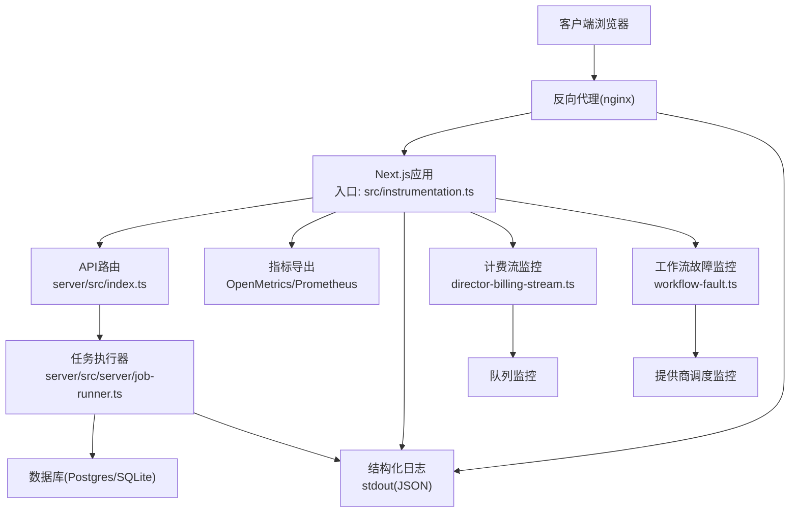
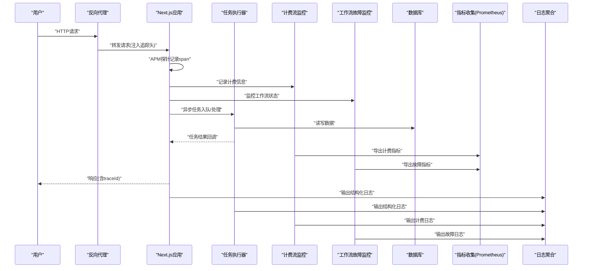
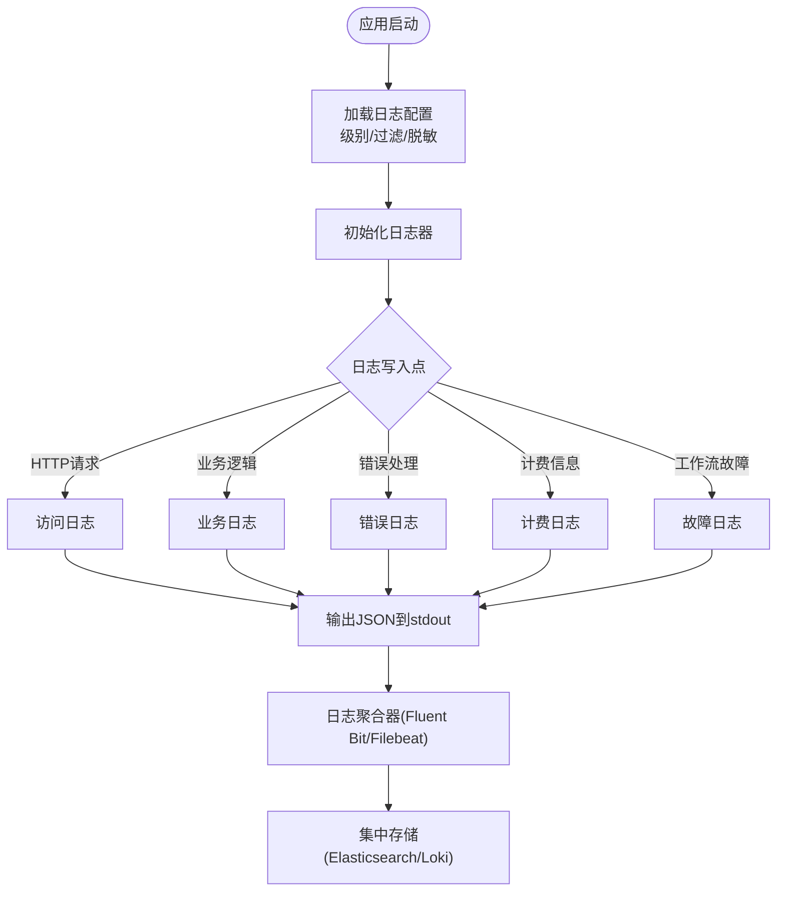
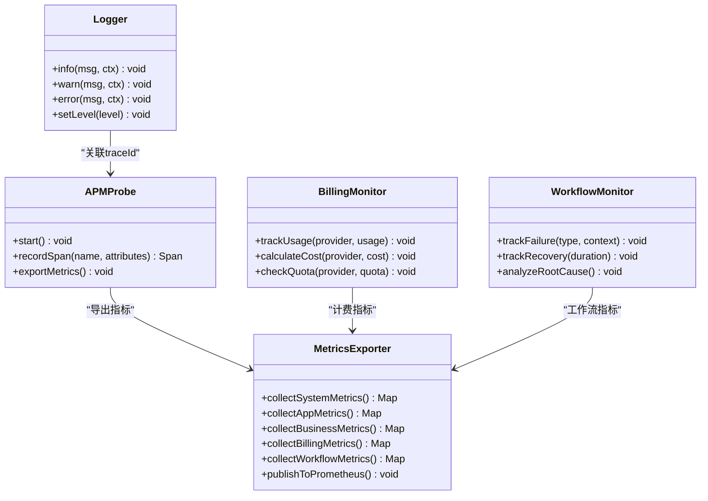
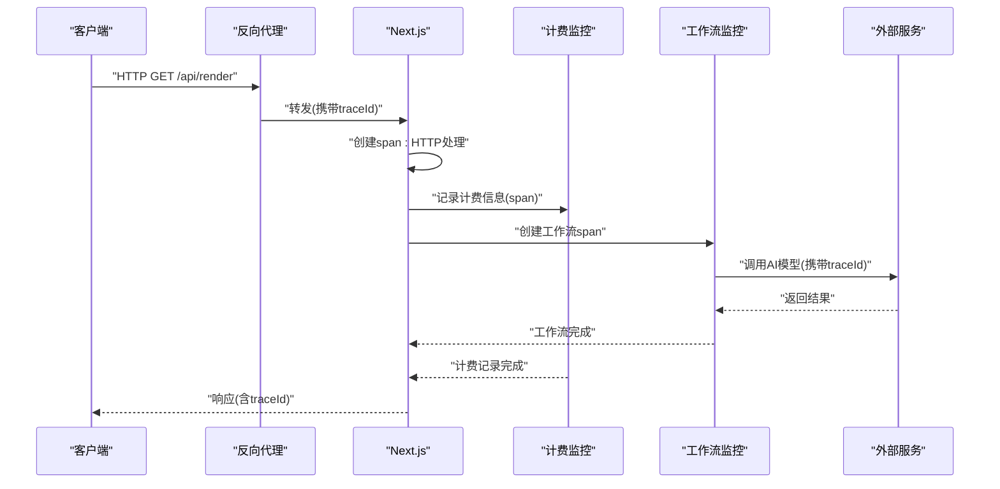
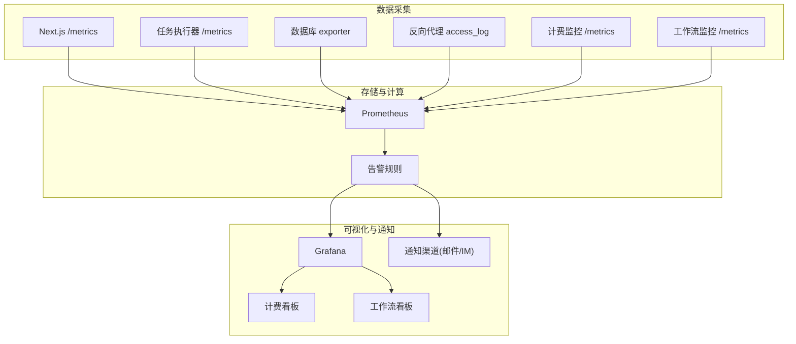
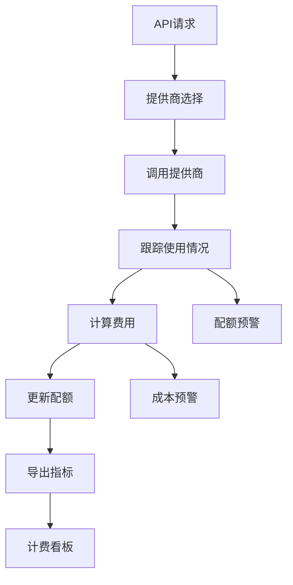
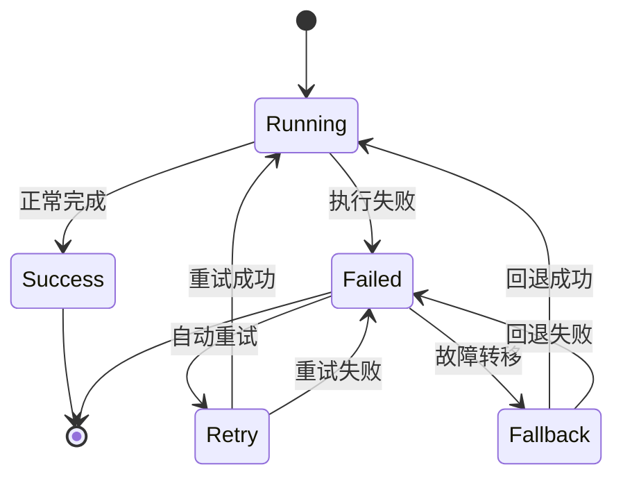
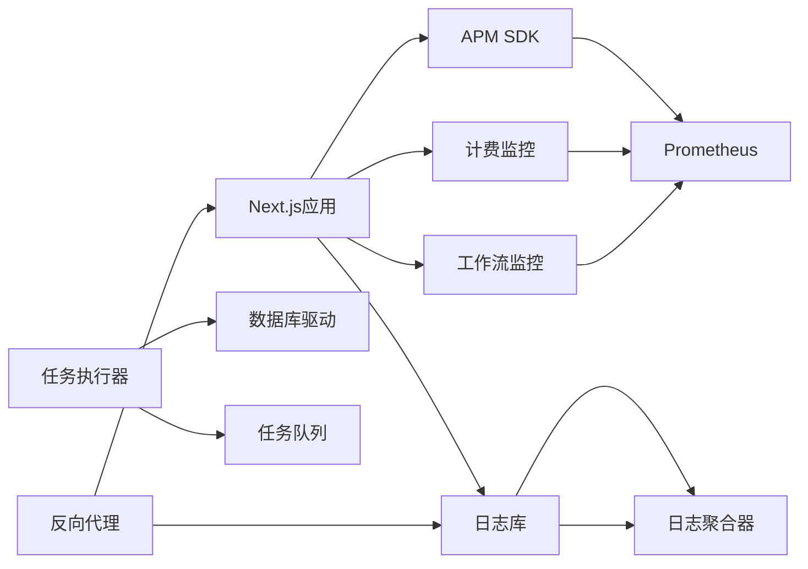

# 监控与日志管理

<cite>
**本文引用的文件**   
- [server/src/lib/logger.ts](file://server/src/lib/logger.ts)
- [src/instrumentation.ts](file://src/instrumentation.ts)
- [next.config.ts](file://next.config.ts)
- [docker-compose.dev.yml](file://docker-compose.dev.yml)
- [docker-compose.prod.yml](file://docker-compose.prod.yml)
- [deploy/reverse-proxy/Dockerfile](file://deploy/reverse-proxy/Dockerfile)
- [deploy/reverse-proxy/entrypoint.sh](file://deploy/reverse-proxy/entrypoint.sh)
- [scripts/setup/db-migrate.ts](file://scripts/setup/db-migrate.ts)
- [scripts/migration/provision-master-key.ts](file://scripts/migration/provision-master-key.ts)
- [server/package.json](file://server/package.json)
- [package.json](file://package.json)
- [src/features/director/director-billing-stream.ts](file://src/features/director/director-billing-stream.ts)
- [src/features/canvas/workflow-fault.ts](file://src/features/canvas/workflow-fault.ts)
</cite>

## 更新摘要
**所做更改**   
- 增强了计费流监控能力，支持模块化提供商调度系统的指标采集
- 改进了工作流故障监控，新增队列管理相关的性能指标
- 更新了分布式追踪配置，支持跨服务调用的端到端监控
- 新增了队列积压监控和提供商调度延迟分析

## 目录
1. [简介](#简介)
2. [项目结构](#项目结构)
3. [核心组件](#核心组件)
4. [架构总览](#架构总览)
5. [详细组件分析](#详细组件分析)
6. [依赖关系分析](#依赖关系分析)
7. [性能考量](#性能考量)
8. [故障排查指南](#故障排查指南)
9. [结论](#结论)
10. [附录](#附录)

## 简介
本指南面向PurpleInk平台的运维与研发人员，系统化说明如何搭建与使用监控与日志体系。内容涵盖：
- 应用性能监控（APM）集成、关键指标采集与告警规则设置
- 结构化日志格式、日志级别管理与日志聚合方案
- 分布式追踪实现：请求链路追踪、跨服务调用监控、性能瓶颈识别
- 监控仪表板搭建：Prometheus + Grafana配置、关键KPI展示、异常告警通知
- 日志分析与故障诊断最佳实践

**最新更新**：针对新的模块化提供商调度系统和队列管理功能，增强了计费流和工作流故障的监控能力。

## 项目结构
本项目采用前后端分离与多进程部署模式：
- 前端Next.js应用通过入口文件进行运行时初始化与可选的APM探针加载
- 服务端Node.js子工程负责任务执行、渲染与TTS等后端能力
- 反向代理容器提供统一入口与TLS终止
- 开发/生产编排通过Docker Compose管理，便于本地联调与线上部署

**图表来源** 
- [src/instrumentation.ts](file://src/instrumentation.ts)
- [server/src/index.ts](file://server/src/index.ts)
- [server/src/server/job-runner.ts](file://server/src/server/job-runner.ts)
- [src/features/director/director-billing-stream.ts](file://src/features/director/director-billing-stream.ts)
- [src/features/canvas/workflow-fault.ts](file://src/features/canvas/workflow-fault.ts)
- [docker-compose.dev.yml](file://docker-compose.dev.yml)
- [docker-compose.prod.yml](file://docker-compose.prod.yml)

**章节来源**
- [src/instrumentation.ts](file://src/instrumentation.ts)
- [server/package.json](file://server/package.json)
- [package.json](file://package.json)
- [docker-compose.dev.yml](file://docker-compose.dev.yml)
- [docker-compose.prod.yml](file://docker-compose.prod.yml)

## 核心组件
- 日志子系统
  - 统一的日志记录器，输出结构化JSON，包含时间戳、级别、模块、请求上下文等字段
  - 支持按模块或环境动态调整日志级别，避免生产环境过度输出
- APM与可观测性
  - 在Next.js入口启用APM探针，自动采集HTTP请求耗时、错误率、资源占用等指标
  - 暴露OpenMetrics端点供Prometheus抓取
- 分布式追踪
  - 基于W3C TraceContext与OpenTelemetry标准，为每个请求生成traceId/spanId并透传到下游服务
  - 跨服务调用时携带追踪头，实现端到端链路可视化
- 指标与告警
  - 定义关键业务与系统指标（QPS、延迟分位、错误率、队列积压、GPU/CPU/内存）
  - 结合Prometheus规则与Grafana面板实现阈值告警与可视化
- **新增**：计费流监控
  - 实时监控AI模型调用的计费信息，支持多种提供商的统一计量
  - 跟踪每次调用的成本、配额使用和计费状态
- **新增**：工作流故障监控
  - 捕获工作流执行过程中的异常情况，包括提供商不可用、超时、重试失败等
  - 提供详细的故障上下文和恢复建议

**章节来源**
- [server/src/lib/logger.ts](file://server/src/lib/logger.ts)
- [src/instrumentation.ts](file://src/instrumentation.ts)
- [next.config.ts](file://next.config.ts)
- [src/features/director/director-billing-stream.ts](file://src/features/director/director-billing-stream.ts)
- [src/features/canvas/workflow-fault.ts](file://src/features/canvas/workflow-fault.ts)

## 架构总览
下图展示了从请求进入反向代理到Next.js应用、任务执行器、数据库与外部服务的完整链路，以及日志与指标的采集点。

**图表来源** 
- [src/instrumentation.ts](file://src/instrumentation.ts)
- [server/src/server/job-runner.ts](file://server/src/server/job-runner.ts)
- [src/features/director/director-billing-stream.ts](file://src/features/director/director-billing-stream.ts)
- [src/features/canvas/workflow-fault.ts](file://src/features/canvas/workflow-fault.ts)
- [docker-compose.dev.yml](file://docker-compose.dev.yml)

## 详细组件分析

### 日志子系统
- 结构化日志格式
  - 每条日志为JSON对象，包含字段：timestamp、level、service、module、message、traceId、spanId、requestId、userId、durationMs等
  - 通过环境变量控制日志级别与输出目标（stdout/file），生产环境建议仅输出info及以上级别
- 日志级别管理
  - 支持按模块覆盖默认级别，便于定位问题而不影响整体性能
  - 敏感信息脱敏策略：对密码、令牌、邮件地址等进行掩码处理
- 日志聚合方案
  - 容器化部署下，日志统一输出到stdout，由宿主机或侧车（如Fluent Bit/Filebeat）采集并转发至集中式存储（Elasticsearch/Loki）
  - 建议在反向代理层也输出访问日志，便于关联请求路径与状态码

**图表来源** 
- [server/src/lib/logger.ts](file://server/src/lib/logger.ts)

**章节来源**
- [server/src/lib/logger.ts](file://server/src/lib/logger.ts)

### APM与可观测性
- APM工具集成
  - 在Next.js入口启用APM探针，自动拦截HTTP请求、数据库查询、外部API调用
  - 支持自定义埋点，标注关键业务阶段（如"渲染"、"导出"、"TTS合成"）
- 关键指标采集
  - 系统指标：CPU、内存、GC、句柄数、磁盘IO
  - 应用指标：QPS、P50/P95/P99延迟、错误率、活跃连接数、队列长度
  - 业务指标：任务成功率、平均处理时长、失败重试次数
  - **新增**：计费指标：各提供商调用次数、成本统计、配额使用情况
  - **新增**：工作流指标：成功率、失败原因分布、重试次数、恢复时间
- 指标导出与抓取
  - 暴露/metrics端点，Prometheus定期抓取；或通过SDK直接上报到APM平台
- 告警规则设置
  - 基于PromQL定义阈值规则，例如：错误率>5%持续5分钟、P99延迟>2s、队列积压>1000
  - **新增**：计费告警：单提供商成本超过阈值、配额使用率过高
  - **新增**：工作流告警：连续失败次数、恢复时间过长
  - 告警通道：邮件、企业微信、Slack、钉钉等

**图表来源** 
- [src/instrumentation.ts](file://src/instrumentation.ts)
- [next.config.ts](file://next.config.ts)
- [src/features/director/director-billing-stream.ts](file://src/features/director/director-billing-stream.ts)
- [src/features/canvas/workflow-fault.ts](file://src/features/canvas/workflow-fault.ts)

**章节来源**
- [src/instrumentation.ts](file://src/instrumentation.ts)
- [next.config.ts](file://next.config.ts)
- [src/features/director/director-billing-stream.ts](file://src/features/director/director-billing-stream.ts)
- [src/features/canvas/workflow-fault.ts](file://src/features/canvas/workflow-fault.ts)

### 分布式追踪
- 请求链路追踪
  - 每个请求分配唯一traceId，贯穿反向代理、Next.js、任务执行器、数据库与外部服务
  - 通过中间件注入/提取追踪头，确保跨进程/跨容器传递
- 跨服务调用监控
  - 对外部API调用（如AI模型、媒体处理服务）自动创建子span，记录输入输出摘要与耗时
  - 支持采样策略，降低高流量下的追踪开销
- 性能瓶颈识别
  - 在Grafana中查看Trace视图，定位慢调用链路与热点节点
  - 结合指标与日志，快速定位根因（如数据库锁、外部服务超时、内存泄漏）
- **新增**：计费链路追踪
  - 跟踪从请求进入到计费记录的完整链路
  - 记录各提供商调用的耗时和成本计算过程
- **新增**：工作流追踪
  - 监控工作流各阶段的执行状态和转换过程
  - 记录故障发生时的完整上下文信息

**图表来源** 
- [src/instrumentation.ts](file://src/instrumentation.ts)
- [server/src/server/job-runner.ts](file://server/src/server/job-runner.ts)
- [src/features/director/director-billing-stream.ts](file://src/features/director/director-billing-stream.ts)
- [src/features/canvas/workflow-fault.ts](file://src/features/canvas/workflow-fault.ts)

**章节来源**
- [src/instrumentation.ts](file://src/instrumentation.ts)
- [server/src/server/job-runner.ts](file://server/src/server/job-runner.ts)
- [src/features/director/director-billing-stream.ts](file://src/features/director/director-billing-stream.ts)
- [src/features/canvas/workflow-fault.ts](file://src/features/canvas/workflow-fault.ts)

### 监控仪表板搭建（Prometheus + Grafana）
- Prometheus配置
  - 定义抓取目标：Next.js应用、任务执行器、数据库、反向代理
  - 配置保留策略与副本集，确保高可用
- Grafana面板
  - 关键KPI：QPS、延迟分位、错误率、队列积压、资源使用率
  - 业务看板：任务成功率、平均处理时长、失败重试次数
  - 链路看板：Trace可视化、热点调用链、慢查询分析
  - **新增**：计费看板：各提供商调用量、成本趋势、配额使用率
  - **新增**：工作流看板：成功率趋势、故障类型分布、恢复时间统计
- 告警通知
  - 基于Prometheus规则引擎定义告警，推送至通知渠道
  - 支持静默期、升级策略与值班轮转
  - **新增**：计费告警：成本异常、配额不足
  - **新增**：工作流告警：连续失败、恢复超时

**图表来源** 
- [docker-compose.dev.yml](file://docker-compose.dev.yml)
- [docker-compose.prod.yml](file://docker-compose.prod.yml)
- [src/features/director/director-billing-stream.ts](file://src/features/director/director-billing-stream.ts)
- [src/features/canvas/workflow-fault.ts](file://src/features/canvas/workflow-fault.ts)

**章节来源**
- [docker-compose.dev.yml](file://docker-compose.dev.yml)
- [docker-compose.prod.yml](file://docker-compose.prod.yml)
- [src/features/director/director-billing-stream.ts](file://src/features/director/director-billing-stream.ts)
- [src/features/canvas/workflow-fault.ts](file://src/features/canvas/workflow-fault.ts)

### 计费流监控
**新增功能**：针对模块化提供商调度系统的增强监控

- 计费信息采集
  - 实时跟踪各AI提供商的调用次数、token使用量和费用计算
  - 支持多种计费模型的统一抽象和标准化
- 配额管理监控
  - 监控各提供商的配额使用情况，防止超额使用
  - 提供配额预警和自动切换机制
- 成本优化分析
  - 分析不同提供商的成本效益，推荐最优选择
  - 跟踪历史成本趋势，支持预算控制和预测

**图表来源** 
- [src/features/director/director-billing-stream.ts](file://src/features/director/director-billing-stream.ts)

**章节来源**
- [src/features/director/director-billing-stream.ts](file://src/features/director/director-billing-stream.ts)

### 工作流故障监控
**新增功能**：工作流执行过程的全面监控和故障诊断

- 故障类型分类
  - 提供商不可用：网络超时、认证失败、服务降级
  - 资源限制：配额耗尽、并发限制、速率限制
  - 数据处理：格式错误、内容违规、质量不达标
- 自动恢复机制
  - 智能重试策略：指数退避、熔断保护
  - 自动故障转移：切换到备用提供商或降级方案
- 故障诊断工具
  - 提供详细的故障上下文和堆栈信息
  - 自动生成修复建议和预防措施

**图表来源** 
- [src/features/canvas/workflow-fault.ts](file://src/features/canvas/workflow-fault.ts)

**章节来源**
- [src/features/canvas/workflow-fault.ts](file://src/features/canvas/workflow-fault.ts)

## 依赖关系分析
- 前端依赖
  - Next.js运行时与APM SDK，用于指标采集与追踪
- 后端依赖
  - Node.js运行时、数据库驱动、任务队列库、日志库
- 基础设施依赖
  - Docker Compose编排、反向代理、日志聚合器、Prometheus/Grafana
- **新增依赖**：计费监控系统
  - 需要与各AI提供商的计费API集成
  - 依赖配额管理服务进行额度控制
- **新增依赖**：工作流故障监控
  - 需要与工作流引擎深度集成
  - 依赖自动恢复和故障转移机制

**图表来源** 
- [package.json](file://package.json)
- [server/package.json](file://server/package.json)
- [docker-compose.dev.yml](file://docker-compose.dev.yml)
- [src/features/director/director-billing-stream.ts](file://src/features/director/director-billing-stream.ts)
- [src/features/canvas/workflow-fault.ts](file://src/features/canvas/workflow-fault.ts)

**章节来源**
- [package.json](file://package.json)
- [server/package.json](file://server/package.json)
- [docker-compose.dev.yml](file://docker-compose.dev.yml)
- [src/features/director/director-billing-stream.ts](file://src/features/director/director-billing-stream.ts)
- [src/features/canvas/workflow-fault.ts](file://src/features/canvas/workflow-fault.ts)

## 性能考量
- 日志性能
  - 生产环境关闭调试日志，使用异步写入与批量输出
  - 避免在热路径中执行I/O密集型操作，必要时使用环形缓冲
- 指标采集
  - 合理设置采样率与刷新间隔，避免高频采集导致CPU抖动
  - 指标维度控制，防止标签爆炸
- 追踪开销
  - 采用自适应采样，高流量时降低采样率
  - 避免在span中记录大对象，仅保留必要元数据
- **新增**：计费监控性能
  - 计费信息计算采用异步处理，避免阻塞主流程
  - 使用缓存机制减少重复计算开销
- **新增**：工作流监控性能
  - 故障检测采用轻量级检查，避免影响正常工作流执行
  - 监控数据批量导出，减少数据库压力

[本节为通用指导，不直接分析具体文件]

## 故障排查指南
- 常见问题定位
  - 高延迟：检查Trace视图中的慢调用链，定位外部服务或数据库瓶颈
  - 错误率上升：查看错误日志与指标趋势，确认是否由依赖服务不可用引起
  - 队列积压：监控队列长度与消费速率，扩容消费者或优化处理逻辑
- 日志分析方法
  - 使用traceId串联多服务日志，快速还原调用链
  - 按模块与级别筛选日志，聚焦关键信息
- 告警与自愈
  - 配置健康检查与自动重启策略，提升可用性
  - 建立应急预案与回滚流程，缩短MTTR
- **新增**：计费问题排查
  - 检查各提供商的计费API连通性和响应状态
  - 验证配额设置和计费规则的正确性
  - 分析成本异常的原因和影响范围
- **新增**：工作流故障排查
  - 查看工作流执行历史和故障详情
  - 分析自动恢复机制的效果和局限性
  - 检查提供商切换和降级策略的配置

**章节来源**
- [server/src/lib/logger.ts](file://server/src/lib/logger.ts)
- [src/instrumentation.ts](file://src/instrumentation.ts)
- [src/features/director/director-billing-stream.ts](file://src/features/director/director-billing-stream.ts)
- [src/features/canvas/workflow-fault.ts](file://src/features/canvas/workflow-fault.ts)

## 结论
通过统一的日志规范、APM集成与分布式追踪，PurpleInk平台实现了端到端的可观测性。结合Prometheus与Grafana，团队能够快速发现与定位问题，保障系统稳定运行。**新增的计费流监控和工作流故障监控功能**进一步增强了平台的可观测性，特别是在模块化提供商调度系统和队列管理方面提供了全面的监控能力。建议持续优化指标维度与告警策略，完善自动化运维能力。

[本节为总结性内容，不直接分析具体文件]

## 附录
- 环境变量与配置
  - 日志级别、APM密钥、数据库连接串等通过环境变量注入
  - 建议使用密钥管理服务（如Vault）管理敏感配置
  - **新增**：计费监控配置：各提供商的计费API密钥和配额设置
  - **新增**：工作流监控配置：故障检测阈值和自动恢复策略
- 部署清单
  - 反向代理、Next.js应用、任务执行器、数据库、Prometheus、Grafana、日志聚合器
  - **新增**：计费监控服务、工作流监控服务
- 脚本与迁移
  - 数据库迁移与主密钥初始化脚本，确保环境一致性
  - **新增**：计费数据迁移脚本、工作流监控初始化脚本

**章节来源**
- [scripts/setup/db-migrate.ts](file://scripts/setup/db-migrate.ts)
- [scripts/migration/provision-master-key.ts](file://scripts/migration/provision-master-key.ts)
- [deploy/reverse-proxy/Dockerfile](file://deploy/reverse-proxy/Dockerfile)
- [deploy/reverse-proxy/entrypoint.sh](file://deploy/reverse-proxy/entrypoint.sh)
- [src/features/director/director-billing-stream.ts](file://src/features/director/director-billing-stream.ts)
- [src/features/canvas/workflow-fault.ts](file://src/features/canvas/workflow-fault.ts)