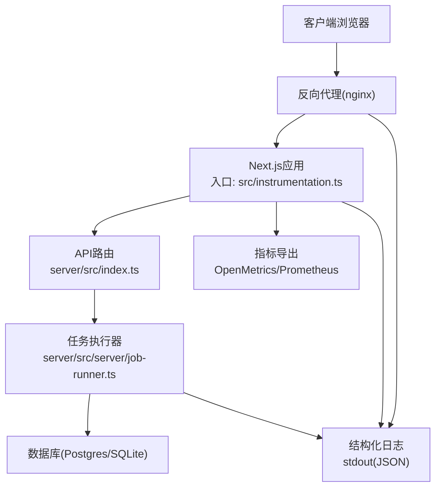
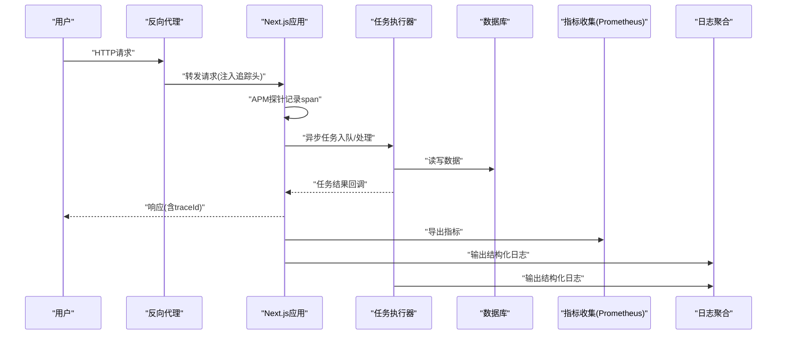
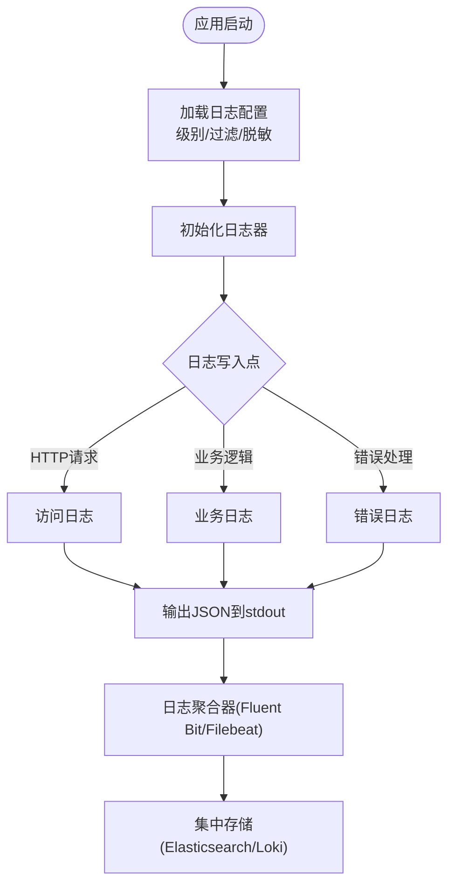
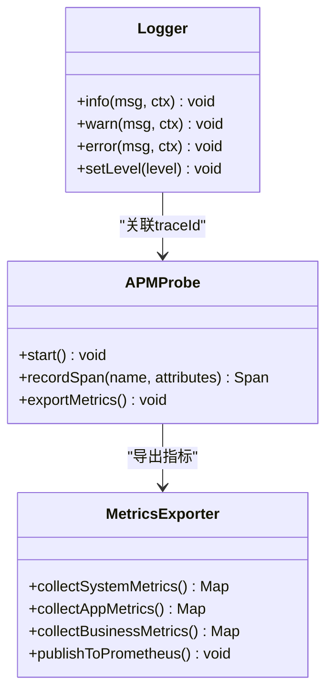
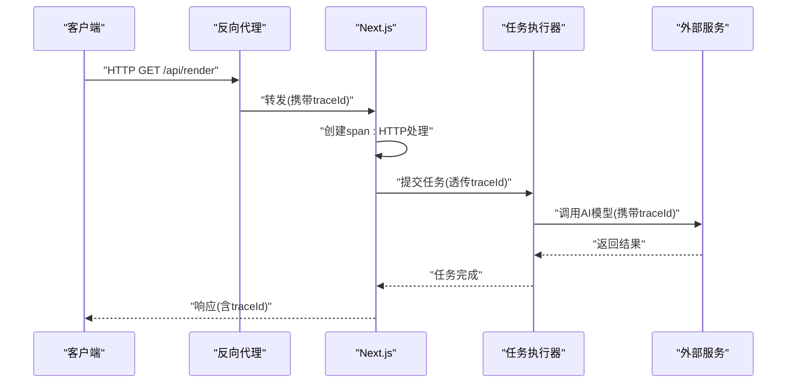
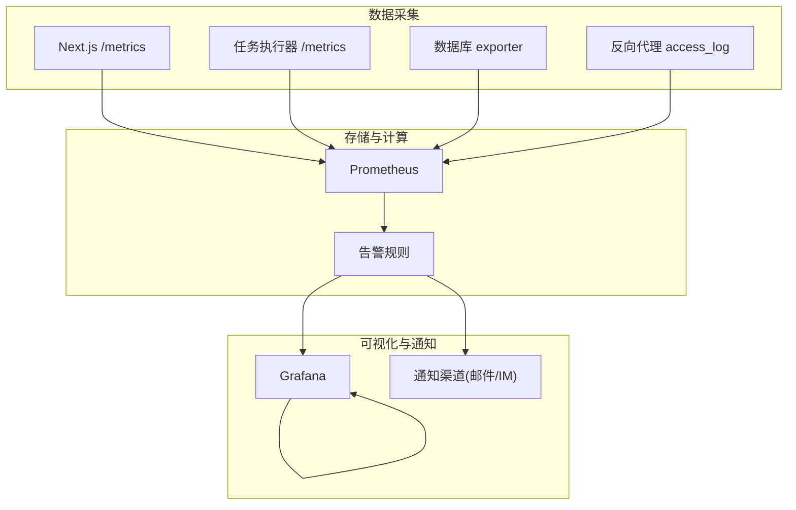
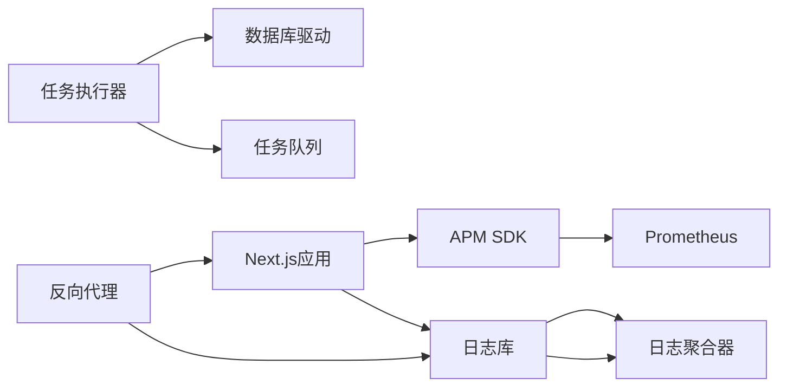

# 监控与日志管理

<cite>
**本文引用的文件**   
- [server/src/lib/logger.ts](file://server/src/lib/logger.ts)
- [src/instrumentation.ts](file://src/instrumentation.ts)
- [next.config.ts](file://next.config.ts)
- [docker-compose.dev.yml](file://docker-compose.dev.yml)
- [docker-compose.prod.yml](file://docker-compose.prod.yml)
- [deploy/reverse-proxy/Dockerfile](file://deploy/reverse-proxy/Dockerfile)
- [deploy/reverse-proxy/entrypoint.sh](file://deploy/reverse-proxy/entrypoint.sh)
- [scripts/setup/db-migrate.ts](file://scripts/setup/db-migrate.ts)
- [scripts/migration/provision-master-key.ts](file://scripts/migration/provision-master-key.ts)
- [server/package.json](file://server/package.json)
- [package.json](file://package.json)
</cite>

## 目录
1. [简介](#简介)
2. [项目结构](#项目结构)
3. [核心组件](#核心组件)
4. [架构总览](#架构总览)
5. [详细组件分析](#详细组件分析)
6. [依赖关系分析](#依赖关系分析)
7. [性能考量](#性能考量)
8. [故障排查指南](#故障排查指南)
9. [结论](#结论)
10. [附录](#附录)

## 简介
本指南面向PurpleInk平台的运维与研发人员，系统化说明如何搭建与使用监控与日志体系。内容涵盖：
- 应用性能监控（APM）集成、关键指标采集与告警规则设置
- 结构化日志格式、日志级别管理与日志聚合方案
- 分布式追踪实现：请求链路追踪、跨服务调用监控、性能瓶颈识别
- 监控仪表板搭建：Prometheus + Grafana配置、关键KPI展示、异常告警通知
- 日志分析与故障诊断最佳实践

## 项目结构
本项目采用前后端分离与多进程部署模式：
- 前端Next.js应用通过入口文件进行运行时初始化与可选的APM探针加载
- 服务端Node.js子工程负责任务执行、渲染与TTS等后端能力
- 反向代理容器提供统一入口与TLS终止
- 开发/生产编排通过Docker Compose管理，便于本地联调与线上部署

**图表来源** 
- [src/instrumentation.ts](file://src/instrumentation.ts)
- [server/src/index.ts](file://server/src/index.ts)
- [server/src/server/job-runner.ts](file://server/src/server/job-runner.ts)
- [docker-compose.dev.yml](file://docker-compose.dev.yml)
- [docker-compose.prod.yml](file://docker-compose.prod.yml)

**章节来源**
- [src/instrumentation.ts](file://src/instrumentation.ts)
- [server/package.json](file://server/package.json)
- [package.json](file://package.json)
- [docker-compose.dev.yml](file://docker-compose.dev.yml)
- [docker-compose.prod.yml](file://docker-compose.prod.yml)

## 核心组件
- 日志子系统
  - 统一的日志记录器，输出结构化JSON，包含时间戳、级别、模块、请求上下文等字段
  - 支持按模块或环境动态调整日志级别，避免生产环境过度输出
- APM与可观测性
  - 在Next.js入口启用APM探针，自动采集HTTP请求耗时、错误率、资源占用等指标
  - 暴露OpenMetrics端点供Prometheus抓取
- 分布式追踪
  - 基于W3C TraceContext与OpenTelemetry标准，为每个请求生成traceId/spanId并透传到下游服务
  - 跨服务调用时携带追踪头，实现端到端链路可视化
- 指标与告警
  - 定义关键业务与系统指标（QPS、延迟分位、错误率、队列积压、GPU/CPU/内存）
  - 结合Prometheus规则与Grafana面板实现阈值告警与可视化

**章节来源**
- [server/src/lib/logger.ts](file://server/src/lib/logger.ts)
- [src/instrumentation.ts](file://src/instrumentation.ts)
- [next.config.ts](file://next.config.ts)

## 架构总览
下图展示了从请求进入反向代理到Next.js应用、任务执行器、数据库与外部服务的完整链路，以及日志与指标的采集点。

**图表来源** 
- [src/instrumentation.ts](file://src/instrumentation.ts)
- [server/src/server/job-runner.ts](file://server/src/server/job-runner.ts)
- [docker-compose.dev.yml](file://docker-compose.dev.yml)

## 详细组件分析

### 日志子系统
- 结构化日志格式
  - 每条日志为JSON对象，包含字段：timestamp、level、service、module、message、traceId、spanId、requestId、userId、durationMs等
  - 通过环境变量控制日志级别与输出目标（stdout/file），生产环境建议仅输出info及以上级别
- 日志级别管理
  - 支持按模块覆盖默认级别，便于定位问题而不影响整体性能
  - 敏感信息脱敏策略：对密码、令牌、邮件地址等进行掩码处理
- 日志聚合方案
  - 容器化部署下，日志统一输出到stdout，由宿主机或侧车（如Fluent Bit/Filebeat）采集并转发至集中式存储（Elasticsearch/Loki）
  - 建议在反向代理层也输出访问日志，便于关联请求路径与状态码

**图表来源** 
- [server/src/lib/logger.ts](file://server/src/lib/logger.ts)

**章节来源**
- [server/src/lib/logger.ts](file://server/src/lib/logger.ts)

### APM与可观测性
- APM工具集成
  - 在Next.js入口启用APM探针，自动拦截HTTP请求、数据库查询、外部API调用
  - 支持自定义埋点，标注关键业务阶段（如“渲染”、“导出”、“TTS合成”）
- 关键指标采集
  - 系统指标：CPU、内存、GC、句柄数、磁盘IO
  - 应用指标：QPS、P50/P95/P99延迟、错误率、活跃连接数、队列长度
  - 业务指标：任务成功率、平均处理时长、失败重试次数
- 指标导出与抓取
  - 暴露/metrics端点，Prometheus定期抓取；或通过SDK直接上报到APM平台
- 告警规则设置
  - 基于PromQL定义阈值规则，例如：错误率>5%持续5分钟、P99延迟>2s、队列积压>1000
  - 告警通道：邮件、企业微信、Slack、钉钉等

**图表来源** 
- [src/instrumentation.ts](file://src/instrumentation.ts)
- [next.config.ts](file://next.config.ts)

**章节来源**
- [src/instrumentation.ts](file://src/instrumentation.ts)
- [next.config.ts](file://next.config.ts)

### 分布式追踪
- 请求链路追踪
  - 每个请求分配唯一traceId，贯穿反向代理、Next.js、任务执行器、数据库与外部服务
  - 通过中间件注入/提取追踪头，确保跨进程/跨容器传递
- 跨服务调用监控
  - 对外部API调用（如AI模型、媒体处理服务）自动创建子span，记录输入输出摘要与耗时
  - 支持采样策略，降低高流量下的追踪开销
- 性能瓶颈识别
  - 在Grafana中查看Trace视图，定位慢调用链路与热点节点
  - 结合指标与日志，快速定位根因（如数据库锁、外部服务超时、内存泄漏）

**图表来源** 
- [src/instrumentation.ts](file://src/instrumentation.ts)
- [server/src/server/job-runner.ts](file://server/src/server/job-runner.ts)

**章节来源**
- [src/instrumentation.ts](file://src/instrumentation.ts)
- [server/src/server/job-runner.ts](file://server/src/server/job-runner.ts)

### 监控仪表板搭建（Prometheus + Grafana）
- Prometheus配置
  - 定义抓取目标：Next.js应用、任务执行器、数据库、反向代理
  - 配置保留策略与副本集，确保高可用
- Grafana面板
  - 关键KPI：QPS、延迟分位、错误率、队列积压、资源使用率
  - 业务看板：任务成功率、平均处理时长、失败重试次数
  - 链路看板：Trace可视化、热点调用链、慢查询分析
- 告警通知
  - 基于Prometheus规则引擎定义告警，推送至通知渠道
  - 支持静默期、升级策略与值班轮转

**图表来源** 
- [docker-compose.dev.yml](file://docker-compose.dev.yml)
- [docker-compose.prod.yml](file://docker-compose.prod.yml)

**章节来源**
- [docker-compose.dev.yml](file://docker-compose.dev.yml)
- [docker-compose.prod.yml](file://docker-compose.prod.yml)

## 依赖关系分析
- 前端依赖
  - Next.js运行时与APM SDK，用于指标采集与追踪
- 后端依赖
  - Node.js运行时、数据库驱动、任务队列库、日志库
- 基础设施依赖
  - Docker Compose编排、反向代理、日志聚合器、Prometheus/Grafana

**图表来源** 
- [package.json](file://package.json)
- [server/package.json](file://server/package.json)
- [docker-compose.dev.yml](file://docker-compose.dev.yml)

**章节来源**
- [package.json](file://package.json)
- [server/package.json](file://server/package.json)
- [docker-compose.dev.yml](file://docker-compose.dev.yml)

## 性能考量
- 日志性能
  - 生产环境关闭调试日志，使用异步写入与批量输出
  - 避免在热路径中执行I/O密集型操作，必要时使用环形缓冲
- 指标采集
  - 合理设置采样率与刷新间隔，避免高频采集导致CPU抖动
  - 指标维度控制，防止标签爆炸
- 追踪开销
  - 采用自适应采样，高流量时降低采样率
  - 避免在span中记录大对象，仅保留必要元数据

[本节为通用指导，不直接分析具体文件]

## 故障排查指南
- 常见问题定位
  - 高延迟：检查Trace视图中的慢调用链，定位外部服务或数据库瓶颈
  - 错误率上升：查看错误日志与指标趋势，确认是否由依赖服务不可用引起
  - 队列积压：监控队列长度与消费速率，扩容消费者或优化处理逻辑
- 日志分析方法
  - 使用traceId串联多服务日志，快速还原调用链
  - 按模块与级别筛选日志，聚焦关键信息
- 告警与自愈
  - 配置健康检查与自动重启策略，提升可用性
  - 建立应急预案与回滚流程，缩短MTTR

**章节来源**
- [server/src/lib/logger.ts](file://server/src/lib/logger.ts)
- [src/instrumentation.ts](file://src/instrumentation.ts)

## 结论
通过统一的日志规范、APM集成与分布式追踪，PurpleInk平台实现了端到端的可观测性。结合Prometheus与Grafana，团队能够快速发现与定位问题，保障系统稳定运行。建议持续优化指标维度与告警策略，完善自动化运维能力。

[本节为总结性内容，不直接分析具体文件]

## 附录
- 环境变量与配置
  - 日志级别、APM密钥、数据库连接串等通过环境变量注入
  - 建议使用密钥管理服务（如Vault）管理敏感配置
- 部署清单
  - 反向代理、Next.js应用、任务执行器、数据库、Prometheus、Grafana、日志聚合器
- 脚本与迁移
  - 数据库迁移与主密钥初始化脚本，确保环境一致性

**章节来源**
- [scripts/setup/db-migrate.ts](file://scripts/setup/db-migrate.ts)
- [scripts/migration/provision-master-key.ts](file://scripts/migration/provision-master-key.ts)
- [deploy/reverse-proxy/Dockerfile](file://deploy/reverse-proxy/Dockerfile)
- [deploy/reverse-proxy/entrypoint.sh](file://deploy/reverse-proxy/entrypoint.sh)