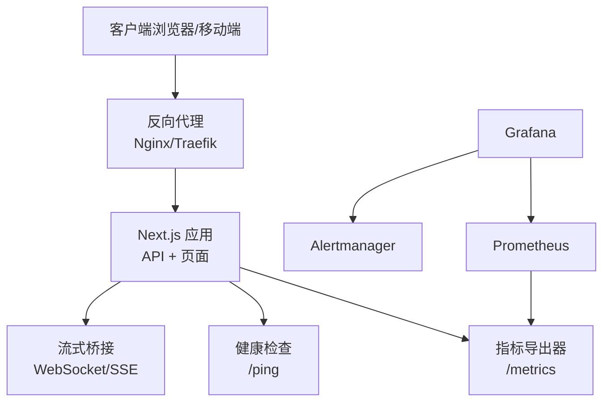
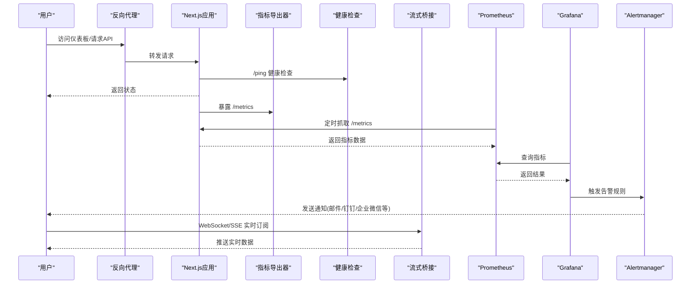
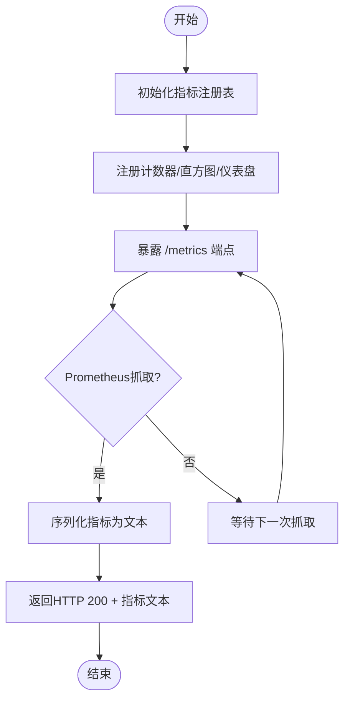
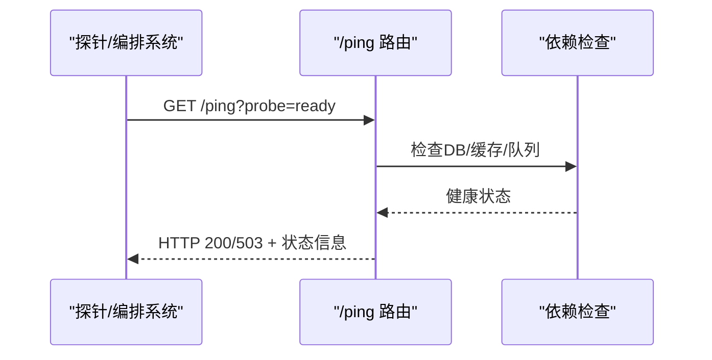
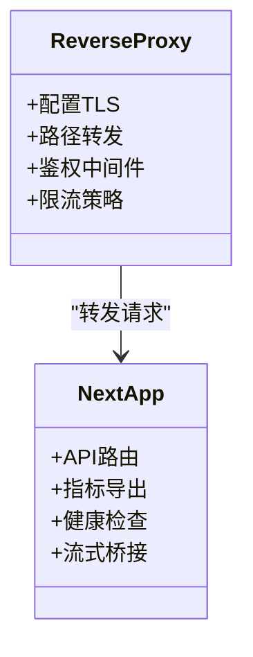
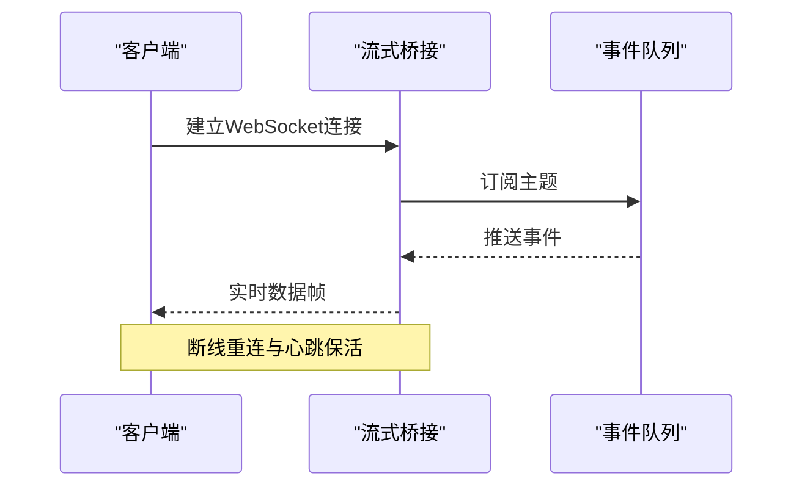
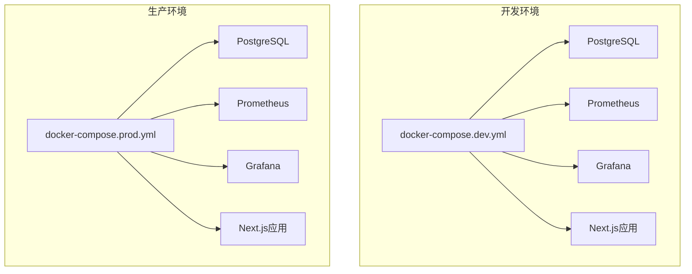
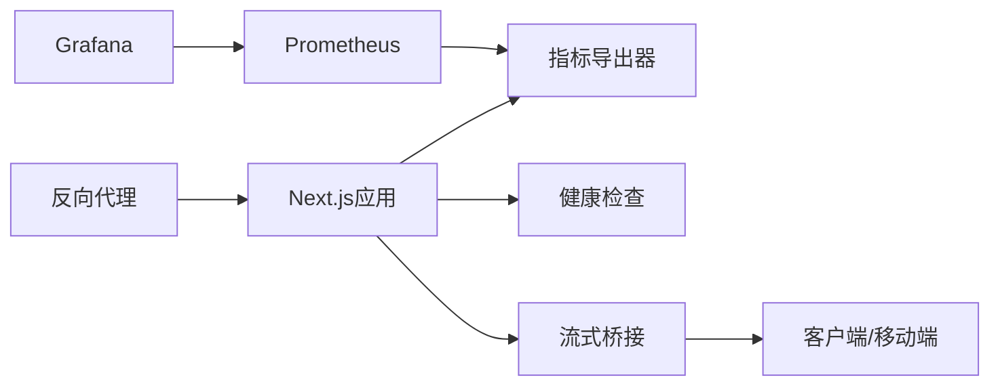

# 监控仪表板

<cite>
**本文引用的文件**   
- [docker-compose.dev.yml](file://docker-compose.dev.yml)
- [docker-compose.prod.yml](file://docker-compose.prod.yml)
- [Dockerfile](file://Dockerfile)
- [next.config.ts](file://next.config.ts)
- [server/src/index.ts](file://server/src/index.ts)
- [src/app/api/ping/route.ts](file://src/app/api/ping/route.ts)
- [src/lib/stream/index.ts](file://src/lib/stream/index.ts)
- [src/features/director/pi-stream-bridge.ts](file://src/features/director/pi-stream-bridge.ts)
- [deploy/reverse-proxy/Dockerfile](file://deploy/reverse-proxy/Dockerfile)
- [deploy/reverse-proxy/entrypoint.sh](file://deploy/reverse-proxy/entrypoint.sh)
- [config/tts.env.example](file://config/tts.env.example)
- [scripts/setup/bootstrap-credentials.ts](file://scripts/setup/bootstrap-credentials.ts)
- [scripts/setup/db-migrate.ts](file://scripts/setup/db-migrate.ts)
- [scripts/migration/postgres-init.sql](file://scripts/setup/postgres-init.sql)
</cite>

## 目录
1. [简介](#简介)
2. [项目结构](#项目结构)
3. [核心组件](#核心组件)
4. [架构总览](#架构总览)
5. [详细组件分析](#详细组件分析)
6. [依赖分析](#依赖分析)
7. [性能考虑](#性能考虑)
8. [故障排查指南](#故障排查指南)
9. [结论](#结论)
10. [附录](#附录)

## 简介
本指南面向PurpleInk平台的监控与可观测性建设，目标是基于Prometheus + Grafana搭建统一的监控仪表板。内容涵盖：
- 部署与配置：容器化编排、数据源连接、指标抓取与可视化面板创建
- 关键仪表板设计：系统健康状态、业务指标展示、错误率监控、容量规划视图
- 告警规则：阈值设置、通知渠道集成、告警升级策略
- 实时监控：WebSocket推送、实时图表更新、移动端适配
- 权限管理：多环境支持与RBAC思路
- 结合仓库现有能力（Next.js API、反向代理、流式桥接）给出落地方案

## 项目结构
仓库采用前后端分离的Next.js应用，配合反向代理与容器编排。监控相关的关键点包括：
- 应用入口与API路由：用于暴露健康检查与指标采集端点
- 反向代理：统一入口、鉴权、限流与TLS终止
- 容器编排：开发/生产环境的依赖服务编排
- 流式桥接：为实时场景提供WebSocket或SSE能力的基础

**图示来源** 
- [docker-compose.dev.yml](file://docker-compose.dev.yml)
- [docker-compose.prod.yml](file://docker-compose.prod.yml)
- [next.config.ts](file://next.config.ts)
- [server/src/index.ts](file://server/src/index.ts)
- [src/app/api/ping/route.ts](file://src/app/api/ping/route.ts)
- [src/lib/stream/index.ts](file://src/lib/stream/index.ts)
- [src/features/director/pi-stream-bridge.ts](file://src/features/director/pi-stream-bridge.ts)
- [deploy/reverse-proxy/Dockerfile](file://deploy/reverse-proxy/Dockerfile)
- [deploy/reverse-proxy/entrypoint.sh](file://deploy/reverse-proxy/entrypoint.sh)

**章节来源**
- [docker-compose.dev.yml](file://docker-compose.dev.yml)
- [docker-compose.prod.yml](file://docker-compose.prod.yml)
- [next.config.ts](file://next.config.ts)
- [server/src/index.ts](file://server/src/index.ts)
- [src/app/api/ping/route.ts](file://src/app/api/ping/route.ts)
- [src/lib/stream/index.ts](file://src/lib/stream/index.ts)
- [src/features/director/pi-stream-bridge.ts](file://src/features/director/pi-stream-bridge.ts)
- [deploy/reverse-proxy/Dockerfile](file://deploy/reverse-proxy/Dockerfile)
- [deploy/reverse-proxy/entrypoint.sh](file://deploy/reverse-proxy/entrypoint.sh)

## 核心组件
- 指标导出器：在Next.js应用中暴露标准Prometheus格式指标，便于Prometheus抓取
- 健康检查接口：对外提供快速存活/就绪探测
- 反向代理：集中处理鉴权、限流、TLS、路径转发
- 流式桥接：为实时图表与WebSocket推送提供基础
- 容器编排：统一管理Prometheus、Grafana、应用与依赖服务的生命周期

**章节来源**
- [server/src/index.ts](file://server/src/index.ts)
- [src/app/api/ping/route.ts](file://src/app/api/ping/route.ts)
- [src/lib/stream/index.ts](file://src/lib/stream/index.ts)
- [src/features/director/pi-stream-bridge.ts](file://src/features/director/pi-stream-bridge.ts)
- [deploy/reverse-proxy/Dockerfile](file://deploy/reverse-proxy/Dockerfile)
- [deploy/reverse-proxy/entrypoint.sh](file://deploy/reverse-proxy/entrypoint.sh)

## 架构总览
下图展示了从客户端到监控系统的端到端流程：客户端通过反向代理访问Next.js应用；应用暴露指标与健康检查；Prometheus定期抓取指标；Grafana作为可视化与告警中心；Alertmanager负责告警路由与升级。

**图示来源** 
- [src/app/api/ping/route.ts](file://src/app/api/ping/route.ts)
- [src/lib/stream/index.ts](file://src/lib/stream/index.ts)
- [src/features/director/pi-stream-bridge.ts](file://src/features/director/pi-stream-bridge.ts)
- [deploy/reverse-proxy/Dockerfile](file://deploy/reverse-proxy/Dockerfile)
- [deploy/reverse-proxy/entrypoint.sh](file://deploy/reverse-proxy/entrypoint.sh)

## 详细组件分析

### 指标导出器与抓取
- 目标：在Next.js应用中实现标准的Prometheus指标导出，包含系统资源、业务请求计数、错误率、延迟分位等
- 实现要点：
  - 使用HTTP端点暴露指标文本（如 /metrics），确保响应头正确、缓存控制合理
  - 指标命名遵循Prometheus规范，避免高基数标签
  - 对热点接口进行采样与聚合，降低抓取开销
  - 将指标写入内存缓冲或轻量存储，保证高并发下的稳定性

**图示来源** 
- [server/src/index.ts](file://server/src/index.ts)
- [next.config.ts](file://next.config.ts)

**章节来源**
- [server/src/index.ts](file://server/src/index.ts)
- [next.config.ts](file://next.config.ts)

### 健康检查接口
- 目标：提供快速存活性与就绪性探测，供反向代理与编排系统使用
- 实现要点：
  - /ping 返回简单状态码与时间戳
  - 支持探针参数区分存活/就绪
  - 与数据库、外部依赖的健康状态联动

**图示来源** 
- [src/app/api/ping/route.ts](file://src/app/api/ping/route.ts)

**章节来源**
- [src/app/api/ping/route.ts](file://src/app/api/ping/route.ts)

### 反向代理与鉴权
- 目标：统一入口、鉴权、限流、TLS终止与路径转发
- 实现要点：
  - 使用Nginx/Traefik作为反向代理，集中配置SSL证书与访问控制
  - 对敏感路径启用Basic Auth或OAuth
  - 对指标与健康检查路径放行，对仪表板路径启用鉴权

**图示来源** 
- [deploy/reverse-proxy/Dockerfile](file://deploy/reverse-proxy/Dockerfile)
- [deploy/reverse-proxy/entrypoint.sh](file://deploy/reverse-proxy/entrypoint.sh)

**章节来源**
- [deploy/reverse-proxy/Dockerfile](file://deploy/reverse-proxy/Dockerfile)
- [deploy/reverse-proxy/entrypoint.sh](file://deploy/reverse-proxy/entrypoint.sh)

### 流式桥接与实时监控
- 目标：为实时图表与WebSocket推送提供稳定通道
- 实现要点：
  - 使用WebSocket或SSE建立长连接
  - 按主题/频道分发事件，支持过滤与重连
  - 与业务队列或事件总线集成，保证消息不丢失

**图示来源** 
- [src/lib/stream/index.ts](file://src/lib/stream/index.ts)
- [src/features/director/pi-stream-bridge.ts](file://src/features/director/pi-stream-bridge.ts)

**章节来源**
- [src/lib/stream/index.ts](file://src/lib/stream/index.ts)
- [src/features/director/pi-stream-bridge.ts](file://src/features/director/pi-stream-bridge.ts)

### 容器编排与环境配置
- 目标：在开发与生产环境中统一部署Prometheus、Grafana与应用依赖
- 实现要点：
  - 使用docker-compose定义服务网络、卷挂载与环境变量
  - 分离开发/生产配置，确保敏感信息通过密钥管理
  - 提供初始化脚本与迁移任务

**图示来源** 
- [docker-compose.dev.yml](file://docker-compose.dev.yml)
- [docker-compose.prod.yml](file://docker-compose.prod.yml)
- [scripts/setup/db-migrate.ts](file://scripts/setup/db-migrate.ts)
- [scripts/setup/postgres-init.sql](file://scripts/setup/postgres-init.sql)

**章节来源**
- [docker-compose.dev.yml](file://docker-compose.dev.yml)
- [docker-compose.prod.yml](file://docker-compose.prod.yml)
- [scripts/setup/db-migrate.ts](file://scripts/setup/db-migrate.ts)
- [scripts/setup/postgres-init.sql](file://scripts/setup/postgres-init.sql)

## 依赖分析
- Next.js应用依赖反向代理进行鉴权与限流
- 指标导出器依赖应用内部状态与业务逻辑
- Prometheus依赖稳定的指标端点与合理的抓取间隔
- Grafana依赖Prometheus数据源与权限配置
- 流式桥接依赖事件队列与客户端重连机制

**图示来源** 
- [server/src/index.ts](file://server/src/index.ts)
- [src/app/api/ping/route.ts](file://src/app/api/ping/route.ts)
- [src/lib/stream/index.ts](file://src/lib/stream/index.ts)
- [src/features/director/pi-stream-bridge.ts](file://src/features/director/pi-stream-bridge.ts)
- [deploy/reverse-proxy/Dockerfile](file://deploy/reverse-proxy/Dockerfile)

**章节来源**
- [server/src/index.ts](file://server/src/index.ts)
- [src/app/api/ping/route.ts](file://src/app/api/ping/route.ts)
- [src/lib/stream/index.ts](file://src/lib/stream/index.ts)
- [src/features/director/pi-stream-bridge.ts](file://src/features/director/pi-stream-bridge.ts)
- [deploy/reverse-proxy/Dockerfile](file://deploy/reverse-proxy/Dockerfile)

## 性能考虑
- 指标抓取优化：
  - 合理设置抓取间隔与超时，避免高峰期抖动
  - 使用增量指标与聚合计算，减少高基数标签
  - 对热点接口进行采样与降采样
- 流式推送优化：
  - 使用批量推送与压缩传输
  - 客户端侧做去抖与节流
  - 服务端维护连接池与会话状态
- 反向代理优化：
  - 启用缓存与静态资源CDN
  - 限制并发连接数与速率限制
  - 合理配置TLS会话复用

[本节为通用指导，无需特定文件引用]

## 故障排查指南
- 健康检查失败：
  - 检查 /ping 路由与依赖服务状态
  - 查看反向代理日志与TLS证书配置
- 指标抓取异常：
  - 验证 /metrics 端点可达性与响应格式
  - 检查Prometheus抓取配置与网络连通性
- 流式推送中断：
  - 确认WebSocket握手成功与心跳保活
  - 检查事件队列消费与重试机制
- 权限与鉴权问题：
  - 核对反向代理鉴权中间件与路径白名单
  - 检查Grafana数据源权限与角色绑定

**章节来源**
- [src/app/api/ping/route.ts](file://src/app/api/ping/route.ts)
- [deploy/reverse-proxy/entrypoint.sh](file://deploy/reverse-proxy/entrypoint.sh)
- [scripts/setup/bootstrap-credentials.ts](file://scripts/setup/bootstrap-credentials.ts)

## 结论
通过在本仓库中引入指标导出器、健康检查与流式桥接，并结合反向代理与容器编排，可以构建一套完整的Prometheus + Grafana监控体系。建议优先实现系统健康与错误率监控，逐步扩展至业务指标与容量规划视图，并通过告警规则与通知渠道形成闭环。实时监控可通过WebSocket/SSE与移动端适配提升用户体验。

[本节为总结性内容，无需特定文件引用]

## 附录

### 部署与配置清单
- 反向代理：
  - 配置TLS证书与路径转发
  - 启用鉴权与限流策略
  - 放行指标与健康检查路径
- Prometheus：
  - 配置抓取目标与间隔
  - 设置保留策略与存储卷
- Grafana：
  - 添加Prometheus数据源
  - 导入或创建仪表板JSON
  - 配置告警规则与通知渠道
- 应用侧：
  - 暴露 /metrics 与 /ping
  - 实现流式桥接与事件订阅
  - 环境变量与密钥管理

**章节来源**
- [docker-compose.dev.yml](file://docker-compose.dev.yml)
- [docker-compose.prod.yml](file://docker-compose.prod.yml)
- [next.config.ts](file://next.config.ts)
- [config/tts.env.example](file://config/tts.env.example)
- [scripts/setup/bootstrap-credentials.ts](file://scripts/setup/bootstrap-credentials.ts)

### 关键仪表板设计建议
- 系统健康状态：
  - CPU/内存/磁盘使用率
  - 进程存活与重启次数
  - 依赖服务可用性
- 业务指标展示：
  - 请求量、成功率、延迟分位
  - 队列长度与消费速率
  - 用户活跃与转化漏斗
- 错误率监控：
  - 5xx错误比例与Top错误
  - 异常堆栈与上下文关联
  - 错误趋势与回归检测
- 容量规划视图：
  - 资源使用趋势与预测
  - 扩容阈值与自动扩缩容
  - 成本分析与优化建议

[本节为概念性内容，无需特定文件引用]

### 告警规则与通知渠道
- 阈值设置：
  - 基于历史基线与动态阈值
  - 分级告警（警告/严重/致命）
- 通知渠道：
  - 邮件、短信、钉钉、企业微信、Slack
  - 多渠道冗余与去重
- 告警升级策略：
  - 静默期与抑制规则
  - 升级时间与责任人轮转

[本节为概念性内容，无需特定文件引用]

### 实时监控与移动端适配
- WebSocket/SSE：
  - 连接管理与重连策略
  - 消息压缩与分页加载
- 移动端适配：
  - 响应式布局与触摸交互
  - 低带宽优化与离线缓存

[本节为概念性内容，无需特定文件引用]

### 权限管理与多环境支持
- 权限管理：
  - RBAC角色与资源隔离
  - 数据源与仪表板级权限
- 多环境支持：
  - 环境变量与密钥注入
  - 配置差异与灰度发布

**章节来源**
- [deploy/reverse-proxy/Dockerfile](file://deploy/reverse-proxy/Dockerfile)
- [deploy/reverse-proxy/entrypoint.sh](file://deploy/reverse-proxy/entrypoint.sh)
- [config/tts.env.example](file://config/tts.env.example)
- [scripts/setup/bootstrap-credentials.ts](file://scripts/setup/bootstrap-credentials.ts)